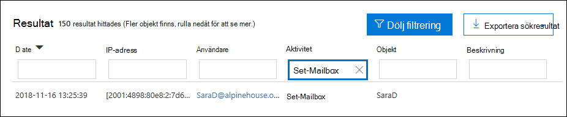
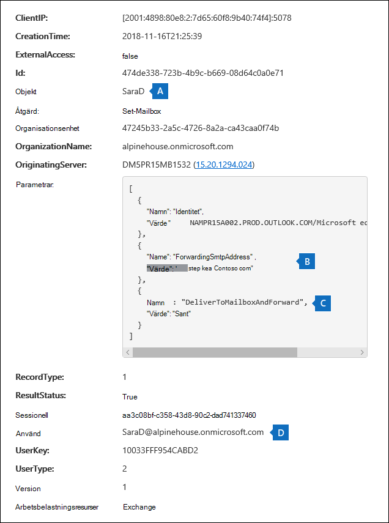
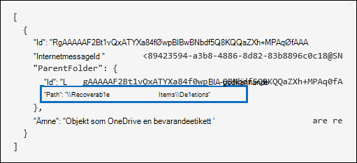
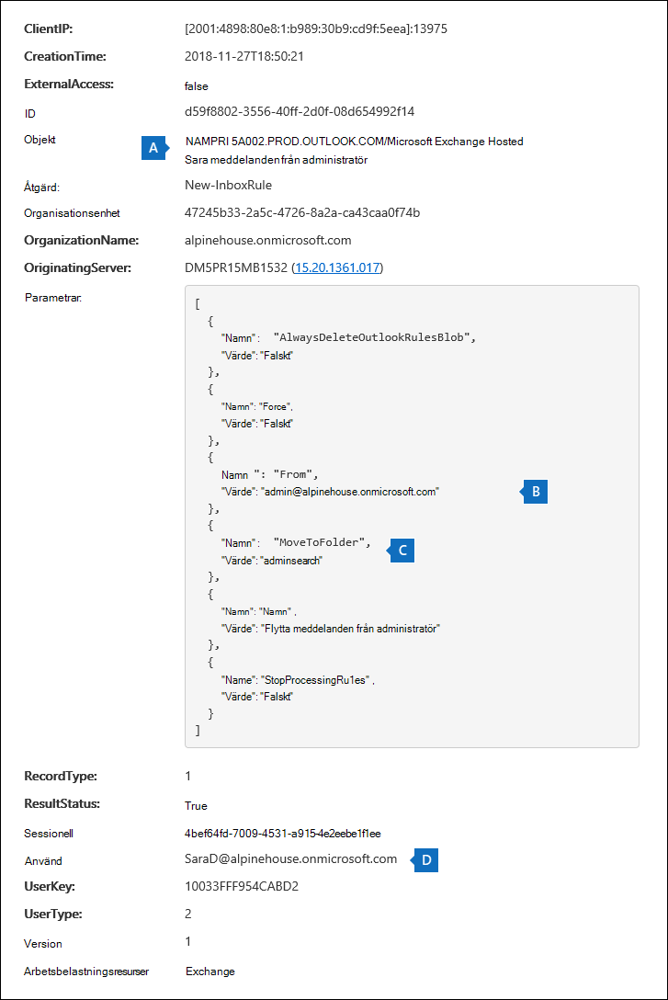
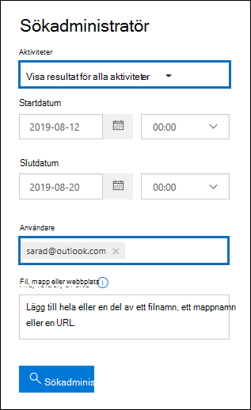

# <a name="search-the-audit-log-to-investigate-common-support-issues"></a><span data-ttu-id="8b357-103">Söka i granskningsloggen för att undersöka vanliga supportproblem</span><span class="sxs-lookup"><span data-stu-id="8b357-103">Search the audit log to investigate common support issues</span></span>

<span data-ttu-id="8b357-104">I den här artikeln beskrivs hur du använder sökverktyget i granskningsloggen för att undersöka vanliga supportproblem.</span><span class="sxs-lookup"><span data-stu-id="8b357-104">This article describes how to use the audit log search tool to help you investigate common support issues.</span></span> <span data-ttu-id="8b357-105">Det omfattar att använda granskningsloggen för att:</span><span class="sxs-lookup"><span data-stu-id="8b357-105">This includes using the audit log to:</span></span>

- <span data-ttu-id="8b357-106">Hitta IP-adressen för datorn som används för att komma åt ett komprometterat konto</span><span class="sxs-lookup"><span data-stu-id="8b357-106">Find the IP address of the computer used to access a compromised account</span></span>
- <span data-ttu-id="8b357-107">Avgöra vem som kan konfigurera vidarebefordran av e-post för en postlåda</span><span class="sxs-lookup"><span data-stu-id="8b357-107">Determine who set up email forwarding for a mailbox</span></span>
- <span data-ttu-id="8b357-108">Avgöra om en användare har tagit bort e-postobjekt i postlådan</span><span class="sxs-lookup"><span data-stu-id="8b357-108">Determine if a user deleted email items in their mailbox</span></span>
- <span data-ttu-id="8b357-109">Avgöra om en användare har skapat en inkorgsregel</span><span class="sxs-lookup"><span data-stu-id="8b357-109">Determine if a user created an inbox rule</span></span>
- <span data-ttu-id="8b357-110">Undersöka varför en användare utanför organisationen har loggat in på ett bra sätt</span><span class="sxs-lookup"><span data-stu-id="8b357-110">Investigate why there was a successful login by a user outside your organization</span></span>
- <span data-ttu-id="8b357-111">Söka efter postlådeaktiviteter som utförs av användare med andra licenser än E5</span><span class="sxs-lookup"><span data-stu-id="8b357-111">Search for mailbox activities performed by users with non-E5 licenses</span></span>
- <span data-ttu-id="8b357-112">Söka efter postlådeaktiviteter som utförts av ombudsanvändare</span><span class="sxs-lookup"><span data-stu-id="8b357-112">Search for mailbox activities performed by delegate users</span></span>

## <a name="using-the-audit-log-search-tool"></a><span data-ttu-id="8b357-113">Använda granskningsloggens sökverktyg</span><span class="sxs-lookup"><span data-stu-id="8b357-113">Using the audit log search tool</span></span>

<span data-ttu-id="8b357-114">Alla felsökningsscenarier som beskrivs i den här artikeln baseras på användning av verktyget för granskningsloggsökning i Säkerhets- & efterlevnadscenter.</span><span class="sxs-lookup"><span data-stu-id="8b357-114">Each of the troubleshooting scenarios described in this article is based on using the audit log search tool in the Security & Compliance Center.</span></span> <span data-ttu-id="8b357-115">Det här avsnittet innehåller de behörigheter som krävs för att söka i granskningsloggen och beskriver stegen för att komma åt och köra granskningsloggsökningar.</span><span class="sxs-lookup"><span data-stu-id="8b357-115">This section lists the permissions required to search the audit log and describes the steps to access and run audit log searches.</span></span> <span data-ttu-id="8b357-116">Varje scenarioavsnitt förklarar hur du konfigurerar en granskningsloggsökningsfråga och vad du letar efter i den detaljerade informationen i granskningsposterna som matchar sökvillkoren.</span><span class="sxs-lookup"><span data-stu-id="8b357-116">Each scenario section explains how to configure an audit log search query and what to look for in the detailed information in the audit records that match the search criteria.</span></span>

### <a name="permissions-required-to-use-the-audit-log-search-tool"></a><span data-ttu-id="8b357-117">Behörigheter som krävs för att använda verktyget för granskningsloggsökning</span><span class="sxs-lookup"><span data-stu-id="8b357-117">Permissions required to use the audit log search tool</span></span>

<span data-ttu-id="8b357-118">Du måste ha tilldelats rollen View-Only granskningsloggar eller granskningsloggar i Exchange Online kunna söka i granskningsloggen.</span><span class="sxs-lookup"><span data-stu-id="8b357-118">You must be assigned the View-Only Audit Logs or Audit Logs role in Exchange Online to search the audit log.</span></span> <span data-ttu-id="8b357-119">Som standard tilldelas de här rollerna till rollgrupperna Efterlevnadshantering och Organisationshantering på sidan **Behörigheter** i administrationscentret för Exchange.</span><span class="sxs-lookup"><span data-stu-id="8b357-119">By default, these roles are assigned to the Compliance Management and Organization Management role groups on the **Permissions** page in the Exchange admin center.</span></span> <span data-ttu-id="8b357-120">Globala administratörer i Office 365 och Microsoft 365 läggs automatiskt till som medlemmar i rollgruppen Organisationshantering i Exchange Online.</span><span class="sxs-lookup"><span data-stu-id="8b357-120">Global administrators in Office 365 and Microsoft 365 are automatically added as members of the Organization Management role group in Exchange Online.</span></span> <span data-ttu-id="8b357-121">Mer information finns i [Hantera rollgrupper i Exchange Online](/Exchange/permissions-exo/role-groups).</span><span class="sxs-lookup"><span data-stu-id="8b357-121">For more information, see [Manage role groups in Exchange Online](/Exchange/permissions-exo/role-groups).</span></span>

### <a name="running-audit-log-searches"></a><span data-ttu-id="8b357-122">Köra granskningsloggsökningar</span><span class="sxs-lookup"><span data-stu-id="8b357-122">Running audit log searches</span></span>

<span data-ttu-id="8b357-123">I det här avsnittet beskrivs grunderna för att skapa och köra granskningsloggsökningar.</span><span class="sxs-lookup"><span data-stu-id="8b357-123">This section describes the basics for creating and running audit log searches.</span></span> <span data-ttu-id="8b357-124">Använd de här instruktionerna som utgångspunkt för varje felsökningsscenario i den här artikeln.</span><span class="sxs-lookup"><span data-stu-id="8b357-124">Use these instructions as a starting point for each troubleshooting scenario in this article.</span></span> <span data-ttu-id="8b357-125">Mer detaljerade anvisningar finns i Söka [i granskningsloggen](search-the-audit-log-in-security-and-compliance.md#step-1-run-an-audit-log-search).</span><span class="sxs-lookup"><span data-stu-id="8b357-125">For more detailed step-by-step instructions, see [Search the audit log](search-the-audit-log-in-security-and-compliance.md#step-1-run-an-audit-log-search).</span></span>

1. <span data-ttu-id="8b357-126">Gå till [https://protection.office.com/unifiedauditlog](https://protection.office.com/unifiedauditlog) och logga in med ditt arbets- eller skolkonto.</span><span class="sxs-lookup"><span data-stu-id="8b357-126">Go to [https://protection.office.com/unifiedauditlog](https://protection.office.com/unifiedauditlog) and sign in using your work or school account.</span></span>
    
    <span data-ttu-id="8b357-127">Sidan **Sökning i granskningslogg** visas.</span><span class="sxs-lookup"><span data-stu-id="8b357-127">The **Audit log search** page is displayed.</span></span> 
    
    
  
4. <span data-ttu-id="8b357-129">Du kan konfigurera följande sökvillkor.</span><span class="sxs-lookup"><span data-stu-id="8b357-129">You can configure the following search criteria.</span></span> <span data-ttu-id="8b357-130">Varje felsökningsscenario i den här artikeln rekommenderar särskild vägledning för hur du konfigurerar dessa fält.</span><span class="sxs-lookup"><span data-stu-id="8b357-130">Each troubleshooting scenario in this article recommends specific guidance for configuring these fields.</span></span>
    
    <span data-ttu-id="8b357-131">a.</span><span class="sxs-lookup"><span data-stu-id="8b357-131">a.</span></span> <span data-ttu-id="8b357-132">**Aktiviteter:** Välj listrutan för att visa de aktiviteter som du kan söka efter.</span><span class="sxs-lookup"><span data-stu-id="8b357-132">**Activities:** Select the drop-down list to display the activities that you can search for.</span></span> <span data-ttu-id="8b357-133">När du har kört sökningen visas bara granskningsposterna för de markerade aktiviteterna.</span><span class="sxs-lookup"><span data-stu-id="8b357-133">After you run the search, only the audit records for the selected activities are displayed.</span></span> <span data-ttu-id="8b357-134">Om **du markerar Visa resultat för alla** aktiviteter visas resultat för alla aktiviteter som uppfyller de andra sökvillkoren.</span><span class="sxs-lookup"><span data-stu-id="8b357-134">Selecting **Show results for all activities** displays results for all activities that meet the other search criteria.</span></span> <span data-ttu-id="8b357-135">Du måste också lämna fältet tomt i vissa felsökningsscenarier.</span><span class="sxs-lookup"><span data-stu-id="8b357-135">You'll also have to leave this field blank in some of the troubleshooting scenarios.</span></span>
    
    <span data-ttu-id="8b357-136">b.</span><span class="sxs-lookup"><span data-stu-id="8b357-136">b.</span></span> <span data-ttu-id="8b357-137">**Startdatum och** **Slutdatum: Välj ett** datum- och tidsintervall för att visa händelser som inträffat inom den perioden.</span><span class="sxs-lookup"><span data-stu-id="8b357-137">**Start date** and **End date:** Select a date and time range to display the events that occurred within that period.</span></span> <span data-ttu-id="8b357-138">De senaste sju dagarna är valda som standard.</span><span class="sxs-lookup"><span data-stu-id="8b357-138">The last seven days are selected by default.</span></span> <span data-ttu-id="8b357-139">Datum och tid presenteras i UTC-format (Coordinated Universal Time).</span><span class="sxs-lookup"><span data-stu-id="8b357-139">The date and time are presented in Coordinated Universal Time (UTC) format.</span></span> <span data-ttu-id="8b357-140">Det maximala datumintervall som du kan ange är 90 dagar.</span><span class="sxs-lookup"><span data-stu-id="8b357-140">The maximum date range that you can specify is 90 days.</span></span>

    <span data-ttu-id="8b357-141">c.</span><span class="sxs-lookup"><span data-stu-id="8b357-141">c.</span></span> <span data-ttu-id="8b357-142">**Användare:** Klicka i den här rutan och välj sedan en eller flera användare som du vill visa sökresultat för.</span><span class="sxs-lookup"><span data-stu-id="8b357-142">**Users:** Click in this box and then select one or more users to display search results for.</span></span> <span data-ttu-id="8b357-143">Granskningsposter för den valda aktiviteten som utförts av de användare du väljer i den här rutan visas i resultatlistan.</span><span class="sxs-lookup"><span data-stu-id="8b357-143">Audit records for the selected activity performed by the users you select in this box are displayed in the list of results.</span></span> <span data-ttu-id="8b357-144">Lämna rutan tom för att returnera poster för alla användare (och tjänstkonton) i organisationen.</span><span class="sxs-lookup"><span data-stu-id="8b357-144">Leave this box blank to return entries for all users (and service accounts) in your organization.</span></span>
    
    <span data-ttu-id="8b357-145">d.</span><span class="sxs-lookup"><span data-stu-id="8b357-145">d.</span></span> <span data-ttu-id="8b357-146">**Fil, mapp eller webbplats:** Skriv en del av eller hela fil- eller mappnamnet för att söka efter aktivitet relaterad till filen i mappen som innehåller det angivna nyckelordet.</span><span class="sxs-lookup"><span data-stu-id="8b357-146">**File, folder, or site:** Type some or all of a file or folder name to search for activity related to the file of folder that contains the specified keyword.</span></span> <span data-ttu-id="8b357-147">Du kan också ange en URL-adress till en fil eller mapp.</span><span class="sxs-lookup"><span data-stu-id="8b357-147">You can also specify a URL of a file or folder.</span></span> <span data-ttu-id="8b357-148">Om du använder en URL-adress måste du se till att skriva den fullständiga URL-sökvägen eller, om du bara skriver en del av URL-adressen, inte innehåller några specialtecken eller blanksteg.</span><span class="sxs-lookup"><span data-stu-id="8b357-148">If you use a URL, be sure the type the full URL path or if you only type a portion of the URL, don't include any special characters or spaces.</span></span> <span data-ttu-id="8b357-149">Lämna rutan tom för att returnera poster för alla filer eller mappar i organisationen.</span><span class="sxs-lookup"><span data-stu-id="8b357-149">Leave this box blank to return entries for all files and folders in your organization.</span></span> <span data-ttu-id="8b357-150">Det här fältet är tomt i alla felsökningsscenarier i den här artikeln.</span><span class="sxs-lookup"><span data-stu-id="8b357-150">This field is left blank in all the troubleshooting scenarios in this article.</span></span>
    
5. <span data-ttu-id="8b357-151">Välj **Sök** för att köra sökningen med dina sökvillkor.</span><span class="sxs-lookup"><span data-stu-id="8b357-151">Select **Search** to run the search using your search criteria.</span></span> 
    
    <span data-ttu-id="8b357-152">Sökresultaten läses in och efter en liten stund visas de under **Resultat på sidan** **Granskningsloggsökning.**</span><span class="sxs-lookup"><span data-stu-id="8b357-152">The search results are loaded, and after a few moments they're displayed under **Results** on the **Audit log search** page.</span></span> <span data-ttu-id="8b357-153">I vart och ett av avsnitten i den här artikeln finns anvisningar om vad du ska leta efter i samband med det specifika felsökningsscenariot.</span><span class="sxs-lookup"><span data-stu-id="8b357-153">Each of the sections in this article provides guidance about things to look for in the context of the specific troubleshooting scenario.</span></span>

    <span data-ttu-id="8b357-154">Mer information om att visa, filtrera eller exportera resultat från granskningsloggsökning finns i:</span><span class="sxs-lookup"><span data-stu-id="8b357-154">For more information about viewing, filtering, or exporting audit log search results, see:</span></span>

    - [<span data-ttu-id="8b357-155">Visa sökresultat</span><span class="sxs-lookup"><span data-stu-id="8b357-155">View search results</span></span>](search-the-audit-log-in-security-and-compliance.md#step-2-view-the-search-results)
    - [<span data-ttu-id="8b357-156">Filtrera sökresultat</span><span class="sxs-lookup"><span data-stu-id="8b357-156">Filter search results</span></span>](search-the-audit-log-in-security-and-compliance.md#step-3-filter-the-search-results)
    - [<span data-ttu-id="8b357-157">Exportera sökresultaten</span><span class="sxs-lookup"><span data-stu-id="8b357-157">Export search results</span></span>](search-the-audit-log-in-security-and-compliance.md#step-4-export-the-search-results-to-a-file)

## <a name="find-the-ip-address-of-the-computer-used-to-access-a-compromised-account"></a><span data-ttu-id="8b357-158">Hitta IP-adressen för datorn som används för att komma åt ett komprometterat konto</span><span class="sxs-lookup"><span data-stu-id="8b357-158">Find the IP address of the computer used to access a compromised account</span></span>

<span data-ttu-id="8b357-159">IP-adressen som motsvarar en aktivitet som utförts av en användare ingår i de flesta granskningsposter.</span><span class="sxs-lookup"><span data-stu-id="8b357-159">The IP address corresponding to an activity performed by any user is included in most audit records.</span></span> <span data-ttu-id="8b357-160">Information om klienten som används ingår också i granskningsposten.</span><span class="sxs-lookup"><span data-stu-id="8b357-160">Information about the client used is also included in the audit record.</span></span>

<span data-ttu-id="8b357-161">Så här konfigurerar du en granskningsloggsökningsfråga för det här scenariot:</span><span class="sxs-lookup"><span data-stu-id="8b357-161">Here's how to configure an audit log search query for this scenario:</span></span>

<span data-ttu-id="8b357-162">**Aktiviteter:** Välj en specifik aktivitet att söka efter, om det är relevant för ditt ärende.</span><span class="sxs-lookup"><span data-stu-id="8b357-162">**Activities:** If relevant to your case, select a specific activity to search for.</span></span> <span data-ttu-id="8b357-163">För felsökning av komprometterade konton kan du välja den användare som **loggat in i** postlådeaktiviteten under **Exchange postlådeaktiviteter**.</span><span class="sxs-lookup"><span data-stu-id="8b357-163">For troubleshooting compromised accounts, consider selecting the **User signed in to mailbox** activity under **Exchange mailbox activities**.</span></span> <span data-ttu-id="8b357-164">Detta returnerar granskningsposter som visar DEN IP-adress som används när du loggade in på postlådan.</span><span class="sxs-lookup"><span data-stu-id="8b357-164">This returns auditing records showing the IP address that was use when signing in to the mailbox.</span></span> <span data-ttu-id="8b357-165">Annars lämnar du det här fältet tomt för att returnera granskningsposter för alla aktiviteter.</span><span class="sxs-lookup"><span data-stu-id="8b357-165">Otherwise, leave this field blank to return audit records for all activities.</span></span> 

> [!TIP]
> <span data-ttu-id="8b357-166">Om du lämnar det här fältet tomt returneras **UserLoggedIn-aktiviteter,** vilket är en Azure Active Directory som anger att någon har loggat in på ett användarkonto.</span><span class="sxs-lookup"><span data-stu-id="8b357-166">Leaving this field blank will  return **UserLoggedIn** activities, which is an Azure Active Directory activity that indicates that someone has signed in to an user account.</span></span> <span data-ttu-id="8b357-167">Använd filtrering i sökresultaten för att visa **UserLoggedIn-granskningsposterna.**</span><span class="sxs-lookup"><span data-stu-id="8b357-167">Use filtering in the search results to display the **UserLoggedIn** audit records.</span></span>

<span data-ttu-id="8b357-168">**Startdatum och** **slutdatum: Välj** ett datumintervall som är relevant för din undersökning.</span><span class="sxs-lookup"><span data-stu-id="8b357-168">**Start date** and **End date:** Select a date range that's applicable to your investigation.</span></span>

<span data-ttu-id="8b357-169">**Användare:** Om du undersöker ett komprometterat konto väljer du den användare vars konto har komprometterats.</span><span class="sxs-lookup"><span data-stu-id="8b357-169">**Users:** If you're investigating a compromised account, select the user whose account was compromised.</span></span> <span data-ttu-id="8b357-170">Det här returnerar granskningsposter för aktiviteter som utförs av användarkontot.</span><span class="sxs-lookup"><span data-stu-id="8b357-170">This returns audit records for activities performed by that user account.</span></span>

<span data-ttu-id="8b357-171">**Fil, mapp eller webbplats:** Lämna fältet tomt.</span><span class="sxs-lookup"><span data-stu-id="8b357-171">**File, folder, or site:** Leave this field blank.</span></span>

<span data-ttu-id="8b357-172">När du har kört sökningen visas IP-adressen för varje aktivitet i **kolumnen IP-adress** i sökresultatet.</span><span class="sxs-lookup"><span data-stu-id="8b357-172">After you run the search, the IP address for each activity is displayed in the **IP address** column in the search results.</span></span> <span data-ttu-id="8b357-173">Markera posten i sökresultatet om du vill visa mer detaljerad information på den utfällade sidan.</span><span class="sxs-lookup"><span data-stu-id="8b357-173">Select the record in the search results to view more detailed information on the flyout page.</span></span>

## <a name="determine-who-set-up-email-forwarding-for-a-mailbox"></a><span data-ttu-id="8b357-174">Avgöra vem som kan konfigurera vidarebefordran av e-post för en postlåda</span><span class="sxs-lookup"><span data-stu-id="8b357-174">Determine who set up email forwarding for a mailbox</span></span>

<span data-ttu-id="8b357-175">När vidarebefordran av e-post har konfigurerats för en postlåda vidarebefordras e-postmeddelanden som skickas till postlådan till en annan postlåda.</span><span class="sxs-lookup"><span data-stu-id="8b357-175">When email forwarding is configured for a mailbox, email messages that are sent to the mailbox are forwarded to another mailbox.</span></span> <span data-ttu-id="8b357-176">Meddelanden kan vidarebefordras till användare i eller utanför organisationen.</span><span class="sxs-lookup"><span data-stu-id="8b357-176">Messages can be forwarded to users inside or outside of your organization.</span></span> <span data-ttu-id="8b357-177">När vidarebefordran av e-post konfigureras för en postlåda är den underliggande Exchange Online-cmdleten som används **Set-Mailbox**.</span><span class="sxs-lookup"><span data-stu-id="8b357-177">When email forwarding is set up on a mailbox, the underlying Exchange Online cmdlet that's used is **Set-Mailbox**.</span></span>

<span data-ttu-id="8b357-178">Så här konfigurerar du en granskningsloggsökningsfråga för det här scenariot:</span><span class="sxs-lookup"><span data-stu-id="8b357-178">Here's how to configure an audit log search query for this scenario:</span></span>

<span data-ttu-id="8b357-179">**Aktiviteter:** Lämna fältet tomt så att sökningen returnerar granskningsposter för alla aktiviteter.</span><span class="sxs-lookup"><span data-stu-id="8b357-179">**Activities:** Leave this field blank so that the search returns audit records for all activities.</span></span> <span data-ttu-id="8b357-180">Det här är nödvändigt för att returnera alla granskningsposter som är relaterade till **cmdleten Set-Mailbox.**</span><span class="sxs-lookup"><span data-stu-id="8b357-180">This is necessary to return any audit records related to the **Set-Mailbox** cmdlet.</span></span>

<span data-ttu-id="8b357-181">**Startdatum och** **slutdatum: Välj** ett datumintervall som är relevant för din undersökning.</span><span class="sxs-lookup"><span data-stu-id="8b357-181">**Start date** and **End date:** Select a date range that's applicable to your investigation.</span></span>

<span data-ttu-id="8b357-182">**Användare:** Lämna fältet tomt om du inte undersöker ett problem med vidarebefordran av e-post för en viss användare.</span><span class="sxs-lookup"><span data-stu-id="8b357-182">**Users:** Unless you're investigating an email forwarding issue for a specific user, leave this field blank.</span></span> <span data-ttu-id="8b357-183">På så sätt kan du se om vidarebefordran av e-post har ställts in för en användare.</span><span class="sxs-lookup"><span data-stu-id="8b357-183">This helps you identify if email forwarding was set up for any user.</span></span>

<span data-ttu-id="8b357-184">**Fil, mapp eller webbplats:** Lämna fältet tomt.</span><span class="sxs-lookup"><span data-stu-id="8b357-184">**File, folder, or site:** Leave this field blank.</span></span>

<span data-ttu-id="8b357-185">När du har kört sökningen väljer **du Filtrera** resultat på sidan med sökresultat.</span><span class="sxs-lookup"><span data-stu-id="8b357-185">After you run the search, select **Filter results** on the search results page.</span></span> <span data-ttu-id="8b357-186">I rutan under **kolumnrubriken** Aktivitet skriver du **Set-Mailbox** så att endast granskningsposter som är relaterade till cmdleten **Set-Mailbox** visas.</span><span class="sxs-lookup"><span data-stu-id="8b357-186">In the box under **Activity** column header, type **Set-Mailbox** so that only audit records related to the **Set-Mailbox** cmdlet are displayed.</span></span>



<span data-ttu-id="8b357-188">I det här läget måste du titta på informationen för varje granskningspost för att avgöra om aktiviteten är relaterad till vidarebefordran av e-post.</span><span class="sxs-lookup"><span data-stu-id="8b357-188">At this point, you have to look at the details of each audit record to determine if the activity is related to email forwarding.</span></span> <span data-ttu-id="8b357-189">Välj granskningsposten för att **visa den utfällade** sidan Information och välj sedan Mer **information**.</span><span class="sxs-lookup"><span data-stu-id="8b357-189">Select the audit record to display the **Details** flyout page, and then select **More information**.</span></span> <span data-ttu-id="8b357-190">I följande skärmbild och beskrivningar markeras den information som anger att vidarebefordran av e-post ställts in för postlådan.</span><span class="sxs-lookup"><span data-stu-id="8b357-190">The following screenshot and descriptions highlight the information that indicates email forwarding was set on the mailbox.</span></span>



<span data-ttu-id="8b357-192">a.</span><span class="sxs-lookup"><span data-stu-id="8b357-192">a.</span></span> <span data-ttu-id="8b357-193">I fältet **Objekt-ID** visas alias för postlådan som vidarebefordran av e-post var inställd på.</span><span class="sxs-lookup"><span data-stu-id="8b357-193">In the **ObjectId** field, the alias of the mailbox that email forwarding was set on is displayed.</span></span> <span data-ttu-id="8b357-194">Den här postlådan visas också **i kolumnen** Objekt på sökresultatsidan.</span><span class="sxs-lookup"><span data-stu-id="8b357-194">This mailbox is also displayed on the **Item** column in the search results page.</span></span>

<span data-ttu-id="8b357-195">b.</span><span class="sxs-lookup"><span data-stu-id="8b357-195">b.</span></span> <span data-ttu-id="8b357-196">I fältet **Parametrar** anger värdet *ForwardingSmtpAddress att* vidarebefordran av e-post har angetts för postlådan.</span><span class="sxs-lookup"><span data-stu-id="8b357-196">In the **Parameters** field, The value *ForwardingSmtpAddress* indicates that email forwarding was set on the mailbox.</span></span> <span data-ttu-id="8b357-197">I det här exemplet vidarebefordras e-post till e-postadressen mike@contoso.com, som finns utanför alpinehouse.onmicrosoft.com organisation.</span><span class="sxs-lookup"><span data-stu-id="8b357-197">In this example, mail is being forwarded to the email address mike@contoso.com, which is outside of the alpinehouse.onmicrosoft.com organization.</span></span>

<span data-ttu-id="8b357-198">c.</span><span class="sxs-lookup"><span data-stu-id="8b357-198">c.</span></span> <span data-ttu-id="8b357-199">Värdet *True* för parametern *DeliverToMailboxAndForward* anger att en kopia av  meddelandet levereras till sarad@alpinehouse.onmicrosoft.com och vidarebefordras till den e-postadress som anges av parametern *ForwardingSmtpAddress,* som i det här exemplet är mike@contoso.com.</span><span class="sxs-lookup"><span data-stu-id="8b357-199">The *True* value for the *DeliverToMailboxAndForward* parameter indicates that a copy of the message is delivered to sarad@alpinehouse.onmicrosoft.com *and* is forwarded to the email address specified by the *ForwardingSmtpAddress* parameter, which in this example is mike@contoso.com.</span></span> <span data-ttu-id="8b357-200">Om värdet för parametern *DeliverToMailboxAndForward* är inställt på *Falskt* vidarebefordras bara e-post till den adress som anges av parametern *ForwardingSmtpAddress.*</span><span class="sxs-lookup"><span data-stu-id="8b357-200">If the value for the *DeliverToMailboxAndForward* parameter is set to *False*, then email is only forwarded to the address specified by the *ForwardingSmtpAddress* parameter.</span></span> <span data-ttu-id="8b357-201">Det levereras inte till postlådan som anges i **fältet ObjectId.**</span><span class="sxs-lookup"><span data-stu-id="8b357-201">It's not delivered to the mailbox specified in the **ObjectId** field.</span></span>

<span data-ttu-id="8b357-202">d.</span><span class="sxs-lookup"><span data-stu-id="8b357-202">d.</span></span> <span data-ttu-id="8b357-203">Fältet **UserId** anger användaren som ställer in vidarebefordran av e-post för postlådan som anges i **fältet Objekt-ID.**</span><span class="sxs-lookup"><span data-stu-id="8b357-203">The **UserId** field indicates the user who set email forwarding on the mailbox specified in the **ObjectId** field.</span></span> <span data-ttu-id="8b357-204">Den här användaren visas också i **kolumnen** Användare på sidan med sökresultat.</span><span class="sxs-lookup"><span data-stu-id="8b357-204">This user is also displayed in the **User** column on the search results page.</span></span> <span data-ttu-id="8b357-205">I det här fallet verkar ägaren av postlådan ställa in vidarebefordran av e-post för sin postlåda.</span><span class="sxs-lookup"><span data-stu-id="8b357-205">In this case, it seems that the owner of the mailbox set email forwarding on her mailbox.</span></span>

<span data-ttu-id="8b357-206">Om du anser att vidarebefordran av e-post inte ska ställas in på postlådan kan du ta bort den genom att köra följande kommando i Exchange Online PowerShell:</span><span class="sxs-lookup"><span data-stu-id="8b357-206">If you determine that email forwarding shouldn't be set on the mailbox, you can remove it by running the following command in Exchange Online PowerShell:</span></span>

```powershell
Set-Mailbox <mailbox alias> -ForwardingSmtpAddress $null 
```

<span data-ttu-id="8b357-207">Mer information om parametrar för vidarebefordran av e-post finns i [artikeln Set-Mailbox.](/powershell/module/exchange/set-mailbox)</span><span class="sxs-lookup"><span data-stu-id="8b357-207">For more information about the parameters related to email forwarding, see the [Set-Mailbox](/powershell/module/exchange/set-mailbox) article.</span></span>

## <a name="determine-if-a-user-deleted-email-items"></a><span data-ttu-id="8b357-208">Avgöra om en användare har tagit bort e-postobjekt</span><span class="sxs-lookup"><span data-stu-id="8b357-208">Determine if a user deleted email items</span></span>

<span data-ttu-id="8b357-209">Från och med januari 2019 startar Microsoft granskningsloggning för postlådor som standard för alla Office 365 och Microsoft-organisationer.</span><span class="sxs-lookup"><span data-stu-id="8b357-209">Starting in January 2019, Microsoft is turning on mailbox audit logging by default for all Office 365 and Microsoft organizations.</span></span> <span data-ttu-id="8b357-210">Det innebär att vissa åtgärder som utförs av postlådeägare loggas automatiskt och motsvarande granskningsposter för postlådor är tillgängliga när du söker efter dem i granskningsloggen för postlådan.</span><span class="sxs-lookup"><span data-stu-id="8b357-210">This means that certain actions performed by mailbox owners are automatically logged, and the corresponding mailbox audit records are available when you search for them in the mailbox audit log.</span></span> <span data-ttu-id="8b357-211">Innan postlådegranskning var aktiverat som standard var du tvungen att manuellt aktivera den för alla användarpostlådor i organisationen.</span><span class="sxs-lookup"><span data-stu-id="8b357-211">Before mailbox auditing was turned on by default, you had to manually enable it for every user mailbox in your organization.</span></span> 

<span data-ttu-id="8b357-212">De postlådeåtgärder som loggas som standard omfattar åtgärderna MjukDelete och HardDelete-postlåda som utförs av postlådeägare.</span><span class="sxs-lookup"><span data-stu-id="8b357-212">The mailbox actions logged by default include the SoftDelete and HardDelete mailbox actions performed by mailbox owners.</span></span> <span data-ttu-id="8b357-213">Det innebär att du kan använda följande steg för att söka i granskningsloggen efter händelser relaterade till borttagna e-postobjekt.</span><span class="sxs-lookup"><span data-stu-id="8b357-213">This means you can use the following steps to search the audit log for events related to deleted email items.</span></span> <span data-ttu-id="8b357-214">Mer information om postlådegranskning som standard finns i [Hantera granskning av postlådor.](enable-mailbox-auditing.md)</span><span class="sxs-lookup"><span data-stu-id="8b357-214">For more information about mailbox auditing on by default, see [Manage mailbox auditing](enable-mailbox-auditing.md).</span></span>

<span data-ttu-id="8b357-215">Så här konfigurerar du en granskningsloggsökningsfråga för det här scenariot:</span><span class="sxs-lookup"><span data-stu-id="8b357-215">Here's how to configure an audit log search query for this scenario:</span></span>

<span data-ttu-id="8b357-216">**Aktiviteter:** Under **Exchange postlådeaktiviteter** väljer du en eller båda av följande aktiviteter:</span><span class="sxs-lookup"><span data-stu-id="8b357-216">**Activities:** Under **Exchange mailbox activities**, select one or both of the following activities:</span></span>

- <span data-ttu-id="8b357-217">**Meddelanden som tagits bort från mappen Borttaget:** Den här aktiviteten motsvarar **postlådegranskningsåtgärden SoftDelete.**</span><span class="sxs-lookup"><span data-stu-id="8b357-217">**Deleted messages from Deleted Items folder:** This activity corresponds to the **SoftDelete** mailbox auditing action.</span></span> <span data-ttu-id="8b357-218">Den här aktiviteten loggas också när en användare tar bort ett objekt permanent genom att markera det och trycka på **Skift+Delete.**</span><span class="sxs-lookup"><span data-stu-id="8b357-218">This activity is also logged when a user permanently deletes an item by selecting it and pressing **Shift+Delete**.</span></span> <span data-ttu-id="8b357-219">När ett objekt har tagits bort permanent kan användaren återställa det tills bevarandetiden för borttagna objekt löper ut.</span><span class="sxs-lookup"><span data-stu-id="8b357-219">After an item is permanently deleted, the user can recover it until the deleted item retention period expires.</span></span>

- <span data-ttu-id="8b357-220">**Meddelanden har rensats från postlådan:** Den här aktiviteten motsvarar **granskningsåtgärden HardDelete-postlåda.**</span><span class="sxs-lookup"><span data-stu-id="8b357-220">**Purged messages from mailbox:** This activity corresponds to the **HardDelete** mailbox auditing action.</span></span> <span data-ttu-id="8b357-221">Detta loggas när en användare rensar ett objekt från mappen Återställningsbara objekt.</span><span class="sxs-lookup"><span data-stu-id="8b357-221">This is logged when a user purges an item from the Recoverable Items folder.</span></span> <span data-ttu-id="8b357-222">Administratörer kan använda verktyget Innehållssökning i säkerhets- och efterlevnadscentret för att söka efter och återställa borttagna objekt tills bevarandeperioden för borttagna objekt löper ut eller längre om användarens postlåda är undantaget.</span><span class="sxs-lookup"><span data-stu-id="8b357-222">Admins can use the Content Search tool in the security and compliance center to search for and recover purged items until the deleted item retention period expires or longer if the user's mailbox is on hold.</span></span>

<span data-ttu-id="8b357-223">**Startdatum och** **slutdatum: Välj** ett datumintervall som är relevant för din undersökning.</span><span class="sxs-lookup"><span data-stu-id="8b357-223">**Start date** and **End date:** Select a date range that's applicable to your investigation.</span></span>

<span data-ttu-id="8b357-224">**Användare:** Om du väljer en användare i det här fältet returnerar verktyget för granskningsloggsökning granskningsposter för e-postobjekt som har tagits bort (SoftDeleted eller HardDeleted) av den användare du anger.</span><span class="sxs-lookup"><span data-stu-id="8b357-224">**Users:** If you select a user in this field, the audit log search tool returns audit records for email items that were deleted (SoftDeleted or HardDeleted) by the user you specify.</span></span> <span data-ttu-id="8b357-225">Ibland är inte användaren som tar bort ett e-postmeddelande postlådans ägare.</span><span class="sxs-lookup"><span data-stu-id="8b357-225">Sometimes the user who deletes an email might not be the mailbox owner.</span></span>

<span data-ttu-id="8b357-226">**Fil, mapp eller webbplats:** Lämna fältet tomt.</span><span class="sxs-lookup"><span data-stu-id="8b357-226">**File, folder, or site:** Leave this field blank.</span></span>

<span data-ttu-id="8b357-227">När du har kört sökningen kan du filtrera sökresultatet och visa granskningsposterna för mjukt borttagna objekt eller för permanent borttagna objekt.</span><span class="sxs-lookup"><span data-stu-id="8b357-227">After you run the search, you can filter the search results to display the audit records for soft-deleted items or for hard-deleted items.</span></span> <span data-ttu-id="8b357-228">Välj granskningsposten för att **visa den utfällade** sidan Information och välj sedan Mer **information**.</span><span class="sxs-lookup"><span data-stu-id="8b357-228">Select the audit record to display the **Details** flyout page, and then select **More information**.</span></span> <span data-ttu-id="8b357-229">Mer information om det borttagna objektet, till exempel ämnesraden och platsen för objektet när det togs bort, visas i **fältet AffectedItems.**</span><span class="sxs-lookup"><span data-stu-id="8b357-229">Additional information about the deleted item, such as the subject line and the location of the item when it was deleted, is displayed in the **AffectedItems** field.</span></span> <span data-ttu-id="8b357-230">Följande skärmbilder visar ett exempel på fältet **AffectedItems** från ett mjukt borttagna objekt och ett hård borttagna objekt.</span><span class="sxs-lookup"><span data-stu-id="8b357-230">The following screenshots show an example of the **AffectedItems** field from a soft-deleted item and a hard-deleted item.</span></span>

<span data-ttu-id="8b357-231">**Exempel på fältet AffectedItems för mjukt borttagna objekt**</span><span class="sxs-lookup"><span data-stu-id="8b357-231">**Example of AffectedItems field for soft-deleted item**</span></span>


<span data-ttu-id="8b357-233">**Exempel på fältet AffectedItems för permanent borttagna objekt**</span><span class="sxs-lookup"><span data-stu-id="8b357-233">**Example of AffectedItems field for hard-deleted item**</span></span>



### <a name="recover-deleted-email-items"></a><span data-ttu-id="8b357-235">Återskapa borttagna e-postobjekt</span><span class="sxs-lookup"><span data-stu-id="8b357-235">Recover deleted email items</span></span>

<span data-ttu-id="8b357-236">Användare kan återställa mjukt borttagna objekt om bevarandeperioden för borttagna objekt inte har gått ut.</span><span class="sxs-lookup"><span data-stu-id="8b357-236">Users can recover soft-deleted items if the deleted items retention period has not expired.</span></span> <span data-ttu-id="8b357-237">I Exchange Online är standardlagringstiden för borttagna objekt 14 dagar, men administratörer kan öka den här inställningen till högst 30 dagar.</span><span class="sxs-lookup"><span data-stu-id="8b357-237">In Exchange Online, the default deleted items retention period is 14 days, but admins can increase this setting to a maximum of 30 days.</span></span> <span data-ttu-id="8b357-238">Peka på artikeln [Återskapa borttagna objekt eller e-Outlook](https://support.office.com/article/Recover-deleted-items-or-email-in-Outlook-Web-App-C3D8FC15-EEEF-4F1C-81DF-E27964B7EDD4) i webbartikeln om du vill ha anvisningar för hur du återställer borttagna objekt.</span><span class="sxs-lookup"><span data-stu-id="8b357-238">Point users to the [Recover deleted items or email in Outlook on the web](https://support.office.com/article/Recover-deleted-items-or-email-in-Outlook-Web-App-C3D8FC15-EEEF-4F1C-81DF-E27964B7EDD4) article for instructions on recovering deleted items.</span></span>

<span data-ttu-id="8b357-239">Som tidigare förklarats kan administratörer eventuellt återställa permanent borttagna objekt om bevarandeperioden för borttagna objekt inte har gått ut eller om postlådan är undantaget. I sådana fall bevaras objekt tills bevarandetiden går ut.</span><span class="sxs-lookup"><span data-stu-id="8b357-239">As previously explained, admins may be able to recover hard-deleted items if the deleted item retention period hasn't expired or if the mailbox is on hold, in which case items are kept until the hold duration expires.</span></span> <span data-ttu-id="8b357-240">När du kör en innehållssökning returneras mjuka borttagna och permanent borttagna objekt i mappen Återställningsbara objekt i sökresultatet om de matchar sökfrågan.</span><span class="sxs-lookup"><span data-stu-id="8b357-240">When you run a content search, soft-deleted and hard-deleted items in the Recoverable Items folder are returned in the search results if they match the search query.</span></span> <span data-ttu-id="8b357-241">Mer information om hur du kör innehållssökningar finns i [Innehållssökning i Office 365](content-search.md).</span><span class="sxs-lookup"><span data-stu-id="8b357-241">For more information about running content searches, see [Content Search in Office 365](content-search.md).</span></span>

> [!TIP]
> <span data-ttu-id="8b357-242">Om du vill söka efter borttagna e-postobjekt söker du efter hela eller en del av ämnesraden som visas i fältet **AffectedItems** i granskningsposten.</span><span class="sxs-lookup"><span data-stu-id="8b357-242">To search for deleted email items, search for all or part of the subject line that's displayed in the **AffectedItems** field in the audit record.</span></span>

## <a name="determine-if-a-user-created-an-inbox-rule"></a><span data-ttu-id="8b357-243">Avgöra om en användare har skapat en inkorgsregel</span><span class="sxs-lookup"><span data-stu-id="8b357-243">Determine if a user created an inbox rule</span></span>

<span data-ttu-id="8b357-244">När användare skapar en inkorgsregel för Exchange Online postlåda sparas en motsvarande granskningspost i granskningsloggen.</span><span class="sxs-lookup"><span data-stu-id="8b357-244">When users create an inbox rule for their Exchange Online mailbox, a corresponding audit record is saved to the audit log.</span></span> <span data-ttu-id="8b357-245">Mer information om inkorgsregler finns i:</span><span class="sxs-lookup"><span data-stu-id="8b357-245">For more information about inbox rules, see:</span></span>

- [<span data-ttu-id="8b357-246">Använda inkorgsregler i Outlook på webben</span><span class="sxs-lookup"><span data-stu-id="8b357-246">Use inbox rules in Outlook on the web</span></span>](https://support.office.com/article/use-inbox-rules-in-outlook-on-the-web-8400435c-f14e-4272-9004-1548bb1848f2)
- [<span data-ttu-id="8b357-247">Hantera e-postmeddelanden i Outlook med hjälp av regler</span><span class="sxs-lookup"><span data-stu-id="8b357-247">Manage email messages in Outlook by using rules</span></span>](https://support.office.com/article/Manage-email-messages-by-using-rules-C24F5DEA-9465-4DF4-AD17-A50704D66C59)

<span data-ttu-id="8b357-248">Så här konfigurerar du en granskningsloggsökningsfråga för det här scenariot:</span><span class="sxs-lookup"><span data-stu-id="8b357-248">Here's how to configure an audit log search query for this scenario:</span></span>

<span data-ttu-id="8b357-249">**Aktiviteter:** Under **Exchange postlådeaktiviteter** väljer du **Ny inkorgRegel Skapa/ändra/aktivera/inaktivera inkorgsregel.**</span><span class="sxs-lookup"><span data-stu-id="8b357-249">**Activities:** Under **Exchange mailbox activities**, select **New-InboxRule Create/modify/enable/disable inbox rule**.</span></span>

<span data-ttu-id="8b357-250">**Startdatum och** **slutdatum: Välj** ett datumintervall som är relevant för din undersökning.</span><span class="sxs-lookup"><span data-stu-id="8b357-250">**Start date** and **End date:** Select a date range that's applicable to your investigation.</span></span>

<span data-ttu-id="8b357-251">**Användare:** Lämna fältet tomt om du inte undersöker en specifik användare.</span><span class="sxs-lookup"><span data-stu-id="8b357-251">**Users:** Unless you're investigating a specific user, leave this field blank.</span></span> <span data-ttu-id="8b357-252">På så sätt kan du identifiera nya inkorgsregler som har ställts in av alla användare.</span><span class="sxs-lookup"><span data-stu-id="8b357-252">This helps you identify new inbox rules set up by any user.</span></span>

<span data-ttu-id="8b357-253">**Fil, mapp eller webbplats:** Lämna fältet tomt.</span><span class="sxs-lookup"><span data-stu-id="8b357-253">**File, folder, or site:** Leave this field blank.</span></span>

<span data-ttu-id="8b357-254">När du har kört sökningen visas granskningsposter för den här aktiviteten i sökresultaten.</span><span class="sxs-lookup"><span data-stu-id="8b357-254">After you run the search, any audit records for this activity are displayed in the search results.</span></span> <span data-ttu-id="8b357-255">Välj en granskningspost för att **visa den utfällna** sidan Information och välj sedan Mer **information**.</span><span class="sxs-lookup"><span data-stu-id="8b357-255">Select an audit record to display the **Details** flyout page, and then select **More information**.</span></span> <span data-ttu-id="8b357-256">Information om inställningarna för inkorgsregel visas i **fältet** Parametrar.</span><span class="sxs-lookup"><span data-stu-id="8b357-256">Information about the inbox rule settings is displayed in the **Parameters** field.</span></span> <span data-ttu-id="8b357-257">I följande skärmbild och beskrivningar markeras informationen om inkorgsregler.</span><span class="sxs-lookup"><span data-stu-id="8b357-257">The following screenshot and descriptions highlight the information about inbox rules.</span></span>



<span data-ttu-id="8b357-259">a.</span><span class="sxs-lookup"><span data-stu-id="8b357-259">a.</span></span> <span data-ttu-id="8b357-260">I **fältet Objekt-ID** visas det fullständiga namnet på inkorgsregeln.</span><span class="sxs-lookup"><span data-stu-id="8b357-260">In the **ObjectId** field, the full name of the inbox rule is displayed.</span></span> <span data-ttu-id="8b357-261">Det här namnet innehåller alias för användarens postlåda (till exempel SaraD) och namnet på inkorgsregeln (till exempel "Flytta meddelanden från administratör").</span><span class="sxs-lookup"><span data-stu-id="8b357-261">This name includes the alias of the user's mailbox (for example, SaraD) and the name of the inbox rule (for example, "Move messages from admin").</span></span>

<span data-ttu-id="8b357-262">b.</span><span class="sxs-lookup"><span data-stu-id="8b357-262">b.</span></span> <span data-ttu-id="8b357-263">Villkoret **för** inkorgsregeln visas i fältet Parametrar.</span><span class="sxs-lookup"><span data-stu-id="8b357-263">In the **Parameters** field, the condition of the inbox rule is displayed.</span></span> <span data-ttu-id="8b357-264">I det här exemplet anges villkoret av *parametern Från.*</span><span class="sxs-lookup"><span data-stu-id="8b357-264">In this example, the condition is specified by the *From* parameter.</span></span> <span data-ttu-id="8b357-265">Värdet som har definierats för *parametern* Från anger att inkorgsregeln agerar på e-post som admin@alpinehouse.onmicrosoft.com.</span><span class="sxs-lookup"><span data-stu-id="8b357-265">The value defined for the *From* parameter indicates that the inbox rule acts on email sent by admin@alpinehouse.onmicrosoft.com.</span></span> <span data-ttu-id="8b357-266">En fullständig lista över parametrar som kan användas för att definiera villkor för inkorgsregler finns i artikeln Regel [för Ny-Inkorg.](/powershell/module/exchange/new-inboxrule)</span><span class="sxs-lookup"><span data-stu-id="8b357-266">For a complete list of the parameters that can be used to define conditions of inbox rules, see the [New-InboxRule](/powershell/module/exchange/new-inboxrule) article.</span></span>

<span data-ttu-id="8b357-267">c.</span><span class="sxs-lookup"><span data-stu-id="8b357-267">c.</span></span> <span data-ttu-id="8b357-268">Parametern *MoveToFolder* anger åtgärden för inkorgsregeln.</span><span class="sxs-lookup"><span data-stu-id="8b357-268">The *MoveToFolder* parameter specifies the action for the inbox rule.</span></span> <span data-ttu-id="8b357-269">I det här exemplet flyttas meddelanden som admin@alpinehouse.onmicrosoft.com från mappen *AdminSearch.*</span><span class="sxs-lookup"><span data-stu-id="8b357-269">In this example, messages received from admin@alpinehouse.onmicrosoft.com are moved to the folder named *AdminSearch*.</span></span> <span data-ttu-id="8b357-270">I artikeln [Ny inkorg Finns även](/powershell/module/exchange/new-inboxrule) en fullständig lista över parametrar som kan användas för att definiera en inkorgsregels åtgärd.</span><span class="sxs-lookup"><span data-stu-id="8b357-270">Also see the [New-InboxRule](/powershell/module/exchange/new-inboxrule) article for a complete list of parameters that can be used to define the action of an inbox rule.</span></span>

<span data-ttu-id="8b357-271">d.</span><span class="sxs-lookup"><span data-stu-id="8b357-271">d.</span></span> <span data-ttu-id="8b357-272">Fältet **UserId** anger användaren som skapade inkorgsregeln som anges i **fältet Objekt-ID.**</span><span class="sxs-lookup"><span data-stu-id="8b357-272">The **UserId** field indicates the user who created the inbox rule specified in the **ObjectId** field.</span></span> <span data-ttu-id="8b357-273">Den här användaren visas också i **kolumnen** Användare på sidan med sökresultat.</span><span class="sxs-lookup"><span data-stu-id="8b357-273">This user is also displayed in the **User** column on the search results page.</span></span>

## <a name="investigate-why-there-was-a-successful-login-by-a-user-outside-your-organization"></a><span data-ttu-id="8b357-274">Undersöka varför en användare utanför organisationen har loggat in på ett bra sätt</span><span class="sxs-lookup"><span data-stu-id="8b357-274">Investigate why there was a successful login by a user outside your organization</span></span>

<span data-ttu-id="8b357-275">När du granskar granskningsposter i granskningsloggen kan det hända att du ser poster som anger att en extern användare autentiserades av Azure Active Directory och har loggats in i organisationen.</span><span class="sxs-lookup"><span data-stu-id="8b357-275">When reviewing audit records in the audit log, you may see records that indicate an external user was authenticated by Azure Active Directory and successfully logged in to your organization.</span></span> <span data-ttu-id="8b357-276">En administratör i contoso.onmicrosoft.com kan till exempel se en granskningspost som visar att en användare från en annan organisation (till exempel fabrikam.onmicrosoft.com) har loggat in på contoso.onmicrosoft.com.</span><span class="sxs-lookup"><span data-stu-id="8b357-276">For example, an admin in contoso.onmicrosoft.com may see an audit record showing that a user from a different organization (for example, fabrikam.onmicrosoft.com) successfully logged into contoso.onmicrosoft.com.</span></span> <span data-ttu-id="8b357-277">På samma sätt kan du se granskningsposter som anger att användare med ett Microsoft-konto (MSA), till exempel Outlook.com eller Live.com, har loggat in i organisationen.</span><span class="sxs-lookup"><span data-stu-id="8b357-277">Similarly, you may see audit records that indicate users with a Microsoft Account (MSA), such as an Outlook.com or Live.com, successfully logged in to your organization.</span></span> <span data-ttu-id="8b357-278">I dessa situationer är den granskade aktiviteten **Användare inloggad.**</span><span class="sxs-lookup"><span data-stu-id="8b357-278">In these situations, the audited activity is **User logged In**.</span></span> 

<span data-ttu-id="8b357-279">Detta är avsiktligt.</span><span class="sxs-lookup"><span data-stu-id="8b357-279">This behavior is by design.</span></span> <span data-ttu-id="8b357-280">Azure Active Directory (Azure AD), katalogtjänsten, tillåter något som kallas direktautentisering när en extern användare försöker komma åt en *SharePoint-webbplats* eller en OneDrive-plats i organisationen.</span><span class="sxs-lookup"><span data-stu-id="8b357-280">Azure Active Directory (Azure AD), the directory service, allows something called *pass-through authentication* when an external user tries to access a SharePoint site or a OneDrive location in your organization.</span></span> <span data-ttu-id="8b357-281">När den externa användaren försöker göra detta uppmanas de att ange sina autentiseringsuppgifter.</span><span class="sxs-lookup"><span data-stu-id="8b357-281">When the external user tries to do this, they're prompted to enter their credentials.</span></span> <span data-ttu-id="8b357-282">Azure AD använder autentiseringsuppgifterna för att autentisera användaren, vilket innebär att endast Azure AD verifierar att användaren är som han eller hon utger sig för att vara.</span><span class="sxs-lookup"><span data-stu-id="8b357-282">Azure AD uses the credentials to authenticate the user, meaning only Azure AD verifies that the user is who they say they are.</span></span> <span data-ttu-id="8b357-283">Indikation på att inloggningen i granskningsposten är resultatet av azure AD-autentisering av användaren.</span><span class="sxs-lookup"><span data-stu-id="8b357-283">The indication of the successful login in the audit record is the result of Azure AD authenticating the user.</span></span> <span data-ttu-id="8b357-284">En lyckad inloggning innebär inte att användaren har kunnat komma åt några resurser eller utföra andra åtgärder i organisationen.</span><span class="sxs-lookup"><span data-stu-id="8b357-284">The successful login doesn't mean that the user was able to access any resources or perform any other actions in your organization.</span></span> <span data-ttu-id="8b357-285">Den anger bara att användaren autentiserats av Azure AD.</span><span class="sxs-lookup"><span data-stu-id="8b357-285">It only indicates that the user was authenticated by Azure AD.</span></span> <span data-ttu-id="8b357-286">För att en direktanvändare ska få åtkomst till SharePoint- eller OneDrive-resurser måste en användare i organisationen uttryckligen dela en resurs med den externa användaren genom att skicka en delningsinbjudan eller en anonym delningslänk till dem.</span><span class="sxs-lookup"><span data-stu-id="8b357-286">In order for a pass-through user to access SharePoint or OneDrive resources, a user in your organization would have to explicitly share a resource with the external user by sending them a sharing invitation or anonymous sharing link.</span></span> 

> [!NOTE]
> <span data-ttu-id="8b357-287">Azure AD tillåter direktautentisering endast *för program från första* part, till exempel SharePoint Online och OneDrive för företag.</span><span class="sxs-lookup"><span data-stu-id="8b357-287">Azure AD allows pass-through authentication only for *first-party applications*, such as SharePoint Online and OneDrive for Business.</span></span> <span data-ttu-id="8b357-288">Det är inte tillåtet för andra program från tredje part.</span><span class="sxs-lookup"><span data-stu-id="8b357-288">It isn't allowed for other third-party applications.</span></span>

<span data-ttu-id="8b357-289">Här är ett exempel och beskrivningar av relevanta egenskaper i en granskningspost för en användare som loggats **in** om det är ett resultat av direktautentisering.</span><span class="sxs-lookup"><span data-stu-id="8b357-289">Here's an example and descriptions of relevant properties in an audit record for a **User logged In** event that is a result of pass-through authentication.</span></span> <span data-ttu-id="8b357-290">Välj granskningsposten för att **visa den utfällade** sidan Information och välj sedan Mer **information**.</span><span class="sxs-lookup"><span data-stu-id="8b357-290">Select the audit record to display the **Details** flyout page, and then select **More information**.</span></span>


   <span data-ttu-id="8b357-292">a.</span><span class="sxs-lookup"><span data-stu-id="8b357-292">a.</span></span> <span data-ttu-id="8b357-293">Det här fältet anger att användaren som försökte komma åt en resurs i organisationen inte hittades i organisationens Azure AD.</span><span class="sxs-lookup"><span data-stu-id="8b357-293">This field indicates that the user who attempted to access a resource in your organization wasn't found in your organization's Azure AD.</span></span>

   <span data-ttu-id="8b357-294">b.</span><span class="sxs-lookup"><span data-stu-id="8b357-294">b.</span></span> <span data-ttu-id="8b357-295">I det här fältet visas UPN för den externa användare som försökte komma åt en resurs i organisationen.</span><span class="sxs-lookup"><span data-stu-id="8b357-295">This field displays the UPN of the external user that attempted to access a resource in your organization.</span></span> <span data-ttu-id="8b357-296">Det här användar-ID:t identifieras också **i användar-** **och userid-egenskaperna** i granskningsposten.</span><span class="sxs-lookup"><span data-stu-id="8b357-296">This user ID is also identified in the **User** and **UserId** properties in the audit record.</span></span>

   <span data-ttu-id="8b357-297">c.</span><span class="sxs-lookup"><span data-stu-id="8b357-297">c.</span></span> <span data-ttu-id="8b357-298">Egenskapen **ApplicationId** identifierar programmet som utlöste inloggningsbegäran.</span><span class="sxs-lookup"><span data-stu-id="8b357-298">The **ApplicationId** property identifies the application that triggered the logon request.</span></span> <span data-ttu-id="8b357-299">Värdet på 00000003-0000-0ff1-ce00-00000000000 som visas i ApplicationId-egenskapen i den här granskningsposten anger SharePoint Online.</span><span class="sxs-lookup"><span data-stu-id="8b357-299">The value of 00000003-0000-0ff1-ce00-000000000000 displayed in the ApplicationId property in this audit record indicates SharePoint Online.</span></span> <span data-ttu-id="8b357-300">OneDrive för företag har samma ApplicationId.</span><span class="sxs-lookup"><span data-stu-id="8b357-300">OneDrive for Business also has this same ApplicationId.</span></span>

   <span data-ttu-id="8b357-301">d.</span><span class="sxs-lookup"><span data-stu-id="8b357-301">d.</span></span> <span data-ttu-id="8b357-302">Det här indikerar att direktautentisering lyckades.</span><span class="sxs-lookup"><span data-stu-id="8b357-302">This indicates that the pass-through authentication was successful.</span></span> <span data-ttu-id="8b357-303">Med andra ord kunde användaren autentiseras av Azure AD.</span><span class="sxs-lookup"><span data-stu-id="8b357-303">In other words, the user was successfully authenticated by Azure AD.</span></span> 

   <span data-ttu-id="8b357-304">e.</span><span class="sxs-lookup"><span data-stu-id="8b357-304">e.</span></span> <span data-ttu-id="8b357-305">**RecordType-värdet** **för 15** anger att den granskade aktiviteten (UserLoggedIn) är en STS-inloggningshändelse (Secure Token Service) i Azure AD.</span><span class="sxs-lookup"><span data-stu-id="8b357-305">The **RecordType** value of **15** indicates that the audited activity (UserLoggedIn) is a  Secure Token Service (STS) logon event in Azure AD.</span></span>

<span data-ttu-id="8b357-306">Mer information om andra egenskaper som visas i en UserLoggedIn-granskningspost finns i Azure AD-relaterad schemainformation i Office 365 API-schema för [hanteringsaktivitet.](/office/office-365-management-api/office-365-management-activity-api-schema#azure-active-directory-base-schema)</span><span class="sxs-lookup"><span data-stu-id="8b357-306">For more information about the other properties displayed in a UserLoggedIn audit record, see the Azure AD-related schema information in [Office 365 Management Activity API schema](/office/office-365-management-api/office-365-management-activity-api-schema#azure-active-directory-base-schema).</span></span>

<span data-ttu-id="8b357-307">Här är två exempelscenarier som skulle resultera i en framgångsrik användare som **loggats i** granskningsaktivitet på grund av direktautentisering:</span><span class="sxs-lookup"><span data-stu-id="8b357-307">Here are two examples scenarios that would result in a successful **User logged in** audit activity because of pass-through authentication:</span></span> 

  - <span data-ttu-id="8b357-308">En användare med ett Microsoft-konto (till exempel SaraD@outlook.com) har försökt komma åt ett dokument i ett OneDrive för företag-konto i fourthcoffee.onmicrosoft.com och det finns inte något motsvarande gästanvändarkonto för SaraD@outlook.com i fourthcoffee.onmicrosoft.com.</span><span class="sxs-lookup"><span data-stu-id="8b357-308">A user with a Microsoft Account (such as SaraD@outlook.com) has tried to access a document in a OneDrive for Business account in fourthcoffee.onmicrosoft.com and there isn't a corresponding guest user account for SaraD@outlook.com in fourthcoffee.onmicrosoft.com.</span></span>

  - <span data-ttu-id="8b357-309">En användare med ett arbets- eller skolkonto i en organisation (till exempel pilarp@fabrikam.onmicrosoft.com) har försökt komma åt en SharePoint-webbplats i contoso.onmicrosoft.com och det finns inte något motsvarande gästanvändarkonto för pilarp@fabrikam.com i contoso.onmicrosoft.com.</span><span class="sxs-lookup"><span data-stu-id="8b357-309">A user with a Work or School account in an organization (such as pilarp@fabrikam.onmicrosoft.com) has tried to access a SharePoint site in contoso.onmicrosoft.com and there isn't a corresponding guest user account for pilarp@fabrikam.com in contoso.onmicrosoft.com.</span></span>

### <a name="tips-for-investigating-successful-logins-resulting-from-pass-through-authentication"></a><span data-ttu-id="8b357-310">Tips att undersöka lyckade inloggningar som härrör från direktautentisering</span><span class="sxs-lookup"><span data-stu-id="8b357-310">Tips for investigating successful logins resulting from pass-through authentication</span></span>

- <span data-ttu-id="8b357-311">Sök i granskningsloggen efter aktiviteter som utförts av den externa användaren som identifierats i **den användare som loggade in** granskningsposten.</span><span class="sxs-lookup"><span data-stu-id="8b357-311">Search the audit log for activities performed by the external user identified in the **User logged in** audit record.</span></span> <span data-ttu-id="8b357-312">Skriv UPN för den externa användaren i rutan Användare **och** använd ett datumintervall om det är relevant för ditt scenario.</span><span class="sxs-lookup"><span data-stu-id="8b357-312">Type the UPN for the external user in the **Users** box and use a date range if relevant to your scenario.</span></span> <span data-ttu-id="8b357-313">Du kan till exempel skapa en sökning med hjälp av följande sökvillkor:</span><span class="sxs-lookup"><span data-stu-id="8b357-313">For example, you can create a search using the following search criteria:</span></span>

   

    <span data-ttu-id="8b357-315">Utöver de  användarloggade aktiviteterna kan andra granskningsposter returneras, sådana som anger att en användare i organisationen delade resurser med den externa användaren och om den externa användaren kom åt, ändrade eller hämtade ett dokument som delades med dem.</span><span class="sxs-lookup"><span data-stu-id="8b357-315">In addition to the **User logged in** activities, other audit records may be returned, such ones that indicate a user in your organization shared resources with the external user and whether the external user accessed, modified, or downloaded a document that was shared with them.</span></span>

- <span data-ttu-id="8b357-316">Sök efter SharePoint delade aktiviteter som anger att en fil delades med den externa användare som identifieras av en användare **som loggade in i** granskningsposten.</span><span class="sxs-lookup"><span data-stu-id="8b357-316">Search for SharePoint sharing activities that would indicate a file was shared with the external user identified by a **User logged in** audit record.</span></span> <span data-ttu-id="8b357-317">Mer information finns i [Använda delningsgranskning i granskningsloggen](use-sharing-auditing.md).</span><span class="sxs-lookup"><span data-stu-id="8b357-317">For more information, see [Use sharing auditing in the audit log](use-sharing-auditing.md).</span></span>

- <span data-ttu-id="8b357-318">Exportera granskningsloggens sökresultat som innehåller poster som är relevanta för din undersökning så att du kan Excel söka efter andra aktiviteter som är relaterade till den externa användaren.</span><span class="sxs-lookup"><span data-stu-id="8b357-318">Export the audit log search results that contain records relevant to your investigation so that you can use Excel to search for other activities related to the external user.</span></span> <span data-ttu-id="8b357-319">Mer information finns i [Exportera, konfigurera och visa granskningsloggposter.](export-view-audit-log-records.md)</span><span class="sxs-lookup"><span data-stu-id="8b357-319">For more information, see  [Export, configure, and view audit log records](export-view-audit-log-records.md).</span></span>

## <a name="search-for-mailbox-activities-performed-by-users-with-non-e5-licenses"></a><span data-ttu-id="8b357-320">Söka efter postlådeaktiviteter som utförs av användare med andra licenser än E5</span><span class="sxs-lookup"><span data-stu-id="8b357-320">Search for mailbox activities performed by users with non-E5 licenses</span></span>

<span data-ttu-id="8b357-321">Även [när](enable-mailbox-auditing.md) postlådegranskning är aktiverat som standard för organisationen kanske du märker att granskningshändelser för postlådor för vissa användare inte hittas i granskningsloggsökningar med hjälp av efterlevnadscentret, cmdleten **Search-UnifiedAuditLog eller API:t** för Office 365-hanteringsaktivitet.</span><span class="sxs-lookup"><span data-stu-id="8b357-321">Even when [mailbox auditing on by default](enable-mailbox-auditing.md) is turned on for your organization, you might notice that mailbox audit events for some users aren't found in audit log searches by using the compliance center, the **Search-UnifiedAuditLog** cmdlet, or the Office 365 Management Activity API.</span></span> <span data-ttu-id="8b357-322">Anledningen är att granskningshändelser för postlådor bara returneras för användare med E5-licenser när du använder någon av de tidigare metoderna för att söka i den enhetliga granskningsloggen.</span><span class="sxs-lookup"><span data-stu-id="8b357-322">The reason for this is that mailbox audit events will be returned only for users with E5 licenses when you one of the previous methods to search the unified audit log.</span></span>

<span data-ttu-id="8b357-323">Om du vill hämta granskningsloggposter för postlådor för andra användare än E5 kan du utföra någon av följande lösningar:</span><span class="sxs-lookup"><span data-stu-id="8b357-323">To retrieve mailbox audit log records for non-E5 users, you can perform one of the following workarounds:</span></span>

- <span data-ttu-id="8b357-324">Aktivera postlådegranskning manuellt för enskilda postlådor (kör `Set-Mailbox -Identity <MailboxIdentity> -AuditEnabled $true` kommandot i Exchange Online PowerShell).</span><span class="sxs-lookup"><span data-stu-id="8b357-324">Manually enable mailbox auditing on individual mailboxes (run the `Set-Mailbox -Identity <MailboxIdentity> -AuditEnabled $true` command in Exchange Online PowerShell).</span></span> <span data-ttu-id="8b357-325">När du har gjort det kan du söka efter granskningsaktiviteter för postlådor med hjälp av efterlevnadscentret, **cmdlet:en Search-UnifiedAuditLog eller API:t** för Office 365 Management Activity.</span><span class="sxs-lookup"><span data-stu-id="8b357-325">After you do this, search for mailbox audit activities by using the compliance center, the **Search-UnifiedAuditLog** cmdlet, or the Office 365 Management Activity API.</span></span>
  
  > [!NOTE]
  > <span data-ttu-id="8b357-326">Om postlådegranskning redan verkar vara aktiverad för postlådan, men sökningarna inte returnerar några resultat, så kan du ändra värdet för parametern _AuditEnabled_ till och `$false` sedan tillbaka till `$true` .</span><span class="sxs-lookup"><span data-stu-id="8b357-326">If mailbox auditing already appears to be enabled on the mailbox, but your searches return no results, change the value of the _AuditEnabled_ parameter to `$false` and then back to `$true`.</span></span>
  
- <span data-ttu-id="8b357-327">Använd följande cmdlets i Exchange Online PowerShell:</span><span class="sxs-lookup"><span data-stu-id="8b357-327">Use the following cmdlets in Exchange Online PowerShell:</span></span>

  - <span data-ttu-id="8b357-328">[Search-MailboxAuditLog för](/powershell/module/exchange/search-mailboxauditlog) att söka i granskningsloggen för postlådor för specifika användare.</span><span class="sxs-lookup"><span data-stu-id="8b357-328">[Search-MailboxAuditLog](/powershell/module/exchange/search-mailboxauditlog) to search the mailbox audit log for specific users.</span></span>

  - <span data-ttu-id="8b357-329">[New-MailboxAuditLogSearch](/powershell/module/exchange/new-mailboxauditlogsearch) för att söka i granskningsloggen för postlådor för specifika användare och få resultatet skickat via e-post till vissa mottagare.</span><span class="sxs-lookup"><span data-stu-id="8b357-329">[New-MailboxAuditLogSearch](/powershell/module/exchange/new-mailboxauditlogsearch) to search the mailbox audit log for specific users and to have the results sent via email to specified recipients.</span></span>

## <a name="search-for-mailbox-activities-performed-in-a-specific-mailbox-including-shared-mailboxes"></a><span data-ttu-id="8b357-330">Sök efter postlådeaktiviteter som utförs i en viss postlåda (inklusive delade postlådor)</span><span class="sxs-lookup"><span data-stu-id="8b357-330">Search for mailbox activities performed in a specific mailbox (including shared mailboxes)</span></span>

<span data-ttu-id="8b357-331">När du  använder listrutan Användare i verktyget för granskningsloggsökning i efterlevnadscentret eller kommandot **Search-UnifiedAuditLog -UserIds** i Exchange Online PowerShell kan du söka efter aktiviteter som utförs av en viss användare.</span><span class="sxs-lookup"><span data-stu-id="8b357-331">When you use the **Users** dropdown list in the audit log search tool in the compliance center or the **Search-UnifiedAuditLog -UserIds** command in Exchange Online PowerShell, you can search for activities performed by a specific user.</span></span> <span data-ttu-id="8b357-332">För granskningsaktiviteter för postlådor söker den här typen av sökning efter aktiviteter som utförts av den angivna användaren.</span><span class="sxs-lookup"><span data-stu-id="8b357-332">For mailbox audit activities, this type of search will search for activities performed by the specified user.</span></span> <span data-ttu-id="8b357-333">Det garanterar inte att alla aktiviteter som utförs i samma postlåda returneras i sökresultatet.</span><span class="sxs-lookup"><span data-stu-id="8b357-333">It doesn't guarantee that all activities performed in the same mailbox are returned in the search results.</span></span> <span data-ttu-id="8b357-334">En granskningsloggsökning returnerar till exempel inte granskningsposter för aktiviteter som utförts av en ombudsanvändare eftersom en sökning efter postlådeaktiviteter som utförts av en viss användare inte returnerar aktiviteter som utförts av en ombudsanvändare som har tilldelats behörighet till en annan användares postlåda.</span><span class="sxs-lookup"><span data-stu-id="8b357-334">For example, an audit log search won't return audit records for activities performed by a delegate user because searching for mailbox activities performed by a specific user will not return activities performed by a delegate user who's been assigned permissions to access another user's mailbox.</span></span> <span data-ttu-id="8b357-335">(En ombudsanvändare är någon som har tilldelats postlådebehörigheten SendAs, SendOnBehalf eller FullAccess till en annan användares postlåda.)</span><span class="sxs-lookup"><span data-stu-id="8b357-335">(A delegate user is someone who's been assigned the SendAs, SendOnBehalf, or FullAccess mailbox permission to another user's mailbox.)</span></span>

<span data-ttu-id="8b357-336">Om du  använder listrutan för användare i verktyget för granskningsloggsökning eller **Search-UnifiedAuditLog -UserIds returneras** inte heller resultat för aktiviteter som utförts i en delad postlåda.</span><span class="sxs-lookup"><span data-stu-id="8b357-336">Also, using the **User** dropdown list in the audit log search tool or the **Search-UnifiedAuditLog -UserIds** will not return results for activities performed in a shared mailbox.</span></span>

<span data-ttu-id="8b357-337">Om du vill söka efter aktiviteter som utförs i en viss postlåda eller söka efter aktiviteter som utförs i en delad postlåda använder du följande syntax när du kör cmdleten **Search-UnifiedAuditLog:**</span><span class="sxs-lookup"><span data-stu-id="8b357-337">To search for the activities performed in a specific mailbox or to search for activities performed in a shared mailbox, use the following syntax when running the **Search-UnifiedAuditLog** cmdlet:</span></span>

```powershell
Search-UnifiedAuditLog  -StartDate <date> -EndDate <date> -FreeText (Get-Mailbox <mailbox identity).ExchangeGuid
```

<span data-ttu-id="8b357-338">Följande kommando returnerar till exempel granskningsposter för aktiviteter som utförts i den delade postlådan i Contoso-efterlevnadsteamet mellan augusti 2020 och oktober 2020:</span><span class="sxs-lookup"><span data-stu-id="8b357-338">For example, the following command returns audit records for activities performed in the Contoso Compliance Team shared mailbox between August 2020 and October 2020:</span></span>

```powershell
Search-UnifiedAuditLog  -StartDate 08/01/2020 -EndDate 10/31/2020 -FreeText (Get-Mailbox complianceteam@contoso.onmicrosoft.com).ExchangeGuid
```

<span data-ttu-id="8b357-339">Alternativt kan du använda cmdleten **Search-MailboxAuditLog** för att söka efter granskningsposter för aktivitet som utförs i en viss postlåda.</span><span class="sxs-lookup"><span data-stu-id="8b357-339">Alternatively, you can use the **Search-MailboxAuditLog** cmdlet to search for audit records for activity performed in a specific mailbox.</span></span> <span data-ttu-id="8b357-340">Det omfattar även sökning efter aktiviteter som utförs i en delad postlåda.</span><span class="sxs-lookup"><span data-stu-id="8b357-340">This includes searching for activities performed in a shared mailbox.</span></span>

<span data-ttu-id="8b357-341">Följande exempel returnerar granskningsloggposter för postlådor för aktiviteter som utförts i den delade postlådan i Contoso-efterlevnadsteamet:</span><span class="sxs-lookup"><span data-stu-id="8b357-341">The following example returns mailbox audit log records for activities performed in the Contoso Compliance Team shared mailbox:</span></span>

```powershell
Search-MailboxAuditLog -Identity complianceteam@contoso.onmicrosoft.com -StartDate 08/01/2020 -EndDate 10/31/2020 -ShowDetails
```

<span data-ttu-id="8b357-342">Följande exempel returnerar granskningsloggposter för postlådor för aktiviteter som utförts i den angivna postlådan av ombudsanvändare:</span><span class="sxs-lookup"><span data-stu-id="8b357-342">The following example returns mailbox audit log records for activities performed in the specified mailbox by delegate users:</span></span>

```powershell
Search-MailboxAuditLog -Identity <mailbox identity> -StartDate <date> -EndDate <date> -LogonTypes Delegate -ShowDetails
```

<span data-ttu-id="8b357-343">Du kan också använda cmdleten **New-MailboxAuditLogSearch** för att söka i granskningsloggen efter en viss postlåda och få resultatet skickat via e-post till angivna mottagare.</span><span class="sxs-lookup"><span data-stu-id="8b357-343">You can also use the **New-MailboxAuditLogSearch** cmdlet to search the audit log for a specific mailbox and to have the results sent via email to specified recipients.</span></span>