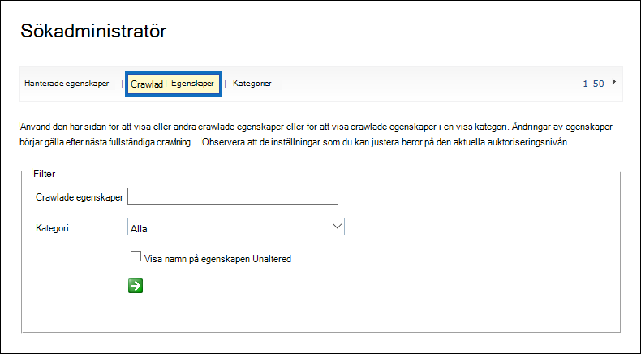

# <a name="use-retention-labels-to-manage-the-lifecycle-of-documents-stored-in-sharepoint"></a><span data-ttu-id="a41e9-103">Hantera livscykeln för dokument som lagras i SharePoint med hjälp av kvarhållningsetiketter</span><span class="sxs-lookup"><span data-stu-id="a41e9-103">Use retention labels to manage the lifecycle of documents stored in SharePoint</span></span>

><span data-ttu-id="a41e9-104">*[Licensieringsvägledning för Microsoft 365 för säkerhet och efterlevnad](/office365/servicedescriptions/microsoft-365-service-descriptions/microsoft-365-tenantlevel-services-licensing-guidance/microsoft-365-security-compliance-licensing-guidance).*</span><span class="sxs-lookup"><span data-stu-id="a41e9-104">*[Microsoft 365 licensing guidance for security & compliance](/office365/servicedescriptions/microsoft-365-service-descriptions/microsoft-365-tenantlevel-services-licensing-guidance/microsoft-365-security-compliance-licensing-guidance).*</span></span>

<span data-ttu-id="a41e9-105">I den här artikeln beskrivs hur du kan hantera livscykeln för dokument som lagras i SharePoint genom att använda automatiskt tillämpade kvarhållningsetiketter och händelsebaserad kvarhållning.</span><span class="sxs-lookup"><span data-stu-id="a41e9-105">This article describes how you can manage the lifecycle of documents that are stored in SharePoint by using automatically applied retention labels and event-based retention.</span></span>

<span data-ttu-id="a41e9-106">Funktionen för automatisk tillämpning använder SharePoint-metadata för dokumentklassificering.</span><span class="sxs-lookup"><span data-stu-id="a41e9-106">The auto-apply functionality uses SharePoint metadata for document classification.</span></span> <span data-ttu-id="a41e9-107">Exemplet i den här artikeln gäller produktrelaterade dokument, men samma koncept kan användas för andra scenarier.</span><span class="sxs-lookup"><span data-stu-id="a41e9-107">The example in this article is for product-related documents, but the same concepts can be used for other scenarios.</span></span> <span data-ttu-id="a41e9-108">Inom olje- och gasindustrin kan det till exempel används till att hantera livscykeln för dokument om fysiska tillgångar som oljeplattformar, borrhålsloggar eller produktionslicenser.</span><span class="sxs-lookup"><span data-stu-id="a41e9-108">For example, in the oil and gas industry, you could use it to manage the lifecycle of documents about physical assets such as oil platforms, well logs, or production licenses.</span></span> <span data-ttu-id="a41e9-109">I finansiella tjänster kan det användas till att hantera dokument för bankkonton, huslån eller försäkringsavtal.</span><span class="sxs-lookup"><span data-stu-id="a41e9-109">In the financial services industry, you could manage bank account, mortgage, or insurance contract documents.</span></span> <span data-ttu-id="a41e9-110">Och inom den offentliga sektorn kan du hantera dokument som bygglov eller skatteblanketter.</span><span class="sxs-lookup"><span data-stu-id="a41e9-110">In the public sector, you could manage construction permits or tax forms.</span></span>

<span data-ttu-id="a41e9-111">I den här artikeln ska vi titta närmare på informationsarkitekturen och definitionen av kvarhållningsetiketterna.</span><span class="sxs-lookup"><span data-stu-id="a41e9-111">In this article, we'll look at the information architecture and definition of the retention labels.</span></span> <span data-ttu-id="a41e9-112">Sedan klassificerar vi dokument genom att automatiskt tillämpa etiketterna.</span><span class="sxs-lookup"><span data-stu-id="a41e9-112">Then we'll classify documents by auto-applying the labels.</span></span> <span data-ttu-id="a41e9-113">Slutligen genererar vi de händelser som startar kvarhållningsperioden.</span><span class="sxs-lookup"><span data-stu-id="a41e9-113">And finally we'll generate the events that initiate the retention period.</span></span>

## <a name="information-architecture"></a><span data-ttu-id="a41e9-114">Informationsarkitektur</span><span class="sxs-lookup"><span data-stu-id="a41e9-114">Information architecture</span></span>

<span data-ttu-id="a41e9-115">I vårt scenario använder ett tillverkningsföretag SharePoint för att lagra alla dokument om de produkter som företaget utvecklar.</span><span class="sxs-lookup"><span data-stu-id="a41e9-115">Our scenario is a manufacturing company that uses SharePoint to store all the documents about the products that the company develops.</span></span> <span data-ttu-id="a41e9-116">Dessa dokument omfattar produktspecifikationer, avtal med leverantörer och användarhandböcker.</span><span class="sxs-lookup"><span data-stu-id="a41e9-116">These documents include product specifications, agreements with suppliers, and user manuals.</span></span> <span data-ttu-id="a41e9-117">När dessa dokument lagras i SharePoint via principer för innehållshantering för företag definieras dokumentmetadata som används för att klassificera dem.</span><span class="sxs-lookup"><span data-stu-id="a41e9-117">When these documents are stored in SharePoint through Enterprise Content Management policies, document metadata is defined, which is used to classify them.</span></span> <span data-ttu-id="a41e9-118">Varje dokument har följande metadataegenskaper:</span><span class="sxs-lookup"><span data-stu-id="a41e9-118">Each document has the following metadata properties:</span></span>

- <span data-ttu-id="a41e9-119">**Doc Type** (till exempel produktspecifikation, avtal eller användarhandbok)</span><span class="sxs-lookup"><span data-stu-id="a41e9-119">**Doc Type** (such as product specification, agreement, or user manual)</span></span>

- <span data-ttu-id="a41e9-120">**Produktnamn**</span><span class="sxs-lookup"><span data-stu-id="a41e9-120">**Product Name**</span></span>

- <span data-ttu-id="a41e9-121">**Status** (utkast eller slutgiltig)</span><span class="sxs-lookup"><span data-stu-id="a41e9-121">**Status** (draft or final)</span></span>

<span data-ttu-id="a41e9-122">Dessa metadata utgör en basinnehållstyp som kallas *produktionsdokument* för alla dokument.</span><span class="sxs-lookup"><span data-stu-id="a41e9-122">This metadata forms a base content type called *Production Document* for all the documents.</span></span>


> [!NOTE]
> <span data-ttu-id="a41e9-124">Senare i det här scenariot använder kvarhållningsprinciperna egenskaperna **Doc Type** och **Status** för att klassificera och automatiskt tillämpa kvarhållningsetiketter.</span><span class="sxs-lookup"><span data-stu-id="a41e9-124">The **Doc Type** and **Status** properties are used by retention policies later in this scenario to classify and auto-apply retention labels.</span></span>

<span data-ttu-id="a41e9-125">Vi kan ha flera innehållstyper som representerar olika typer av dokument, men nu ska vi fokusera på produktdokumentationen.</span><span class="sxs-lookup"><span data-stu-id="a41e9-125">We might have several content types that represent different types of documents, but let's focus on the product documentation.</span></span>

<span data-ttu-id="a41e9-126">I det här scenariot använder vi tjänsten Hanterade metadata och termlagringsplatsen för att skapa en termuppsättning för *Doc Type* och en annan för *Produktnamn*.</span><span class="sxs-lookup"><span data-stu-id="a41e9-126">In this scenario, we use the Managed Metadata service and the Term Store to create a term set for *Doc Type* and another one for *Product Name*.</span></span> <span data-ttu-id="a41e9-127">För varje termuppsättning skapar vi en term för varje värde.</span><span class="sxs-lookup"><span data-stu-id="a41e9-127">For each term set, we create a term for each value.</span></span> <span data-ttu-id="a41e9-128">Det skulle se ut ungefär så här i termlagringsplatsen för SharePoint-organisationen:</span><span class="sxs-lookup"><span data-stu-id="a41e9-128">It would look like something like this in Term Store for your SharePoint organization:</span></span>


<span data-ttu-id="a41e9-130">Du kan skapa och publicera en *innehållstyp* med hjälp av [innehållstypsnavet](https://support.office.com/article/manage-content-type-publishing-06f39ac0-5576-4b68-abbc-82b68334889b).</span><span class="sxs-lookup"><span data-stu-id="a41e9-130">*Content Type* can be created and published by using the [Content Type Hub](https://support.office.com/article/manage-content-type-publishing-06f39ac0-5576-4b68-abbc-82b68334889b).</span></span> <span data-ttu-id="a41e9-131">Du kan också skapa och publicera en innehållstyp med hjälp av verktyg för webbplatsetablering som [PnP Provisioning Framework](/sharepoint/dev/solution-guidance/pnp-provisioning-framework) eller [site design JSON schema](/sharepoint/dev/declarative-customization/site-design-json-schema#define-a-new-content-type).</span><span class="sxs-lookup"><span data-stu-id="a41e9-131">You can also create and publish a content type by using site provisioning tools, such as the [PnP provisioning framework](/sharepoint/dev/solution-guidance/pnp-provisioning-framework) or [site design JSON schema](/sharepoint/dev/declarative-customization/site-design-json-schema#define-a-new-content-type).</span></span>

<span data-ttu-id="a41e9-132">Varje produkt har en dedikerad SharePoint-webbplats som innehåller ett dokumentbibliotek med rätt innehållstyper aktiverade.</span><span class="sxs-lookup"><span data-stu-id="a41e9-132">Each product has a dedicated SharePoint site that contains one document library that has the right content types enabled.</span></span> <span data-ttu-id="a41e9-133">Alla dokument lagras i det här dokumentbiblioteket.</span><span class="sxs-lookup"><span data-stu-id="a41e9-133">All documents are stored in this document library.</span></span>

<span data-ttu-id="a41e9-134">[  ](../media/SPRetention3.png#lightbox)</span><span class="sxs-lookup"><span data-stu-id="a41e9-134">[  ](../media/SPRetention3.png#lightbox)</span></span>

> [!NOTE]
> <span data-ttu-id="a41e9-135">I stället för att ha en SharePoint-webbplats per produkt skulle tillverkningsföretaget i det här scenariot kunna använda ett Microsoft Team per produkt så att alla i teamet kan samarbeta, till exempel via fortlöpande chatt, och använda fliken **Filer** i Teams för dokumenthantering.</span><span class="sxs-lookup"><span data-stu-id="a41e9-135">Instead of having a SharePoint site per product, the manufacturing company in this scenario could use a Microsoft Team per product to support collaboration among members of the team, such as through persistent chat, and use the **Files** tab in Teams for document management.</span></span> <span data-ttu-id="a41e9-136">I den här artikeln fokuserar vi bara på dokument, så vi använder bara en webbplats.</span><span class="sxs-lookup"><span data-stu-id="a41e9-136">In this article we only focus on documents, so, we'll only use a site.</span></span>

<span data-ttu-id="a41e9-137">Här är en vy över dokumentbiblioteket för produkten Spinning Widget:</span><span class="sxs-lookup"><span data-stu-id="a41e9-137">Here's a view of the document library for the Spinning Widget product:</span></span>

<span data-ttu-id="a41e9-138">[  ](../media/SPRetention4.png#lightbox)</span><span class="sxs-lookup"><span data-stu-id="a41e9-138">[  ](../media/SPRetention4.png#lightbox)</span></span>

<span data-ttu-id="a41e9-139">Nu när vi har den grundläggande informationsarkitekturen för dokumenthantering på plats kan vi ta en titt på kvarhållnings- och borttagningsstrategin för dokument som använder metadata och hur vi klassificerar dessa dokument.</span><span class="sxs-lookup"><span data-stu-id="a41e9-139">Now that we have the basic information architecture in place for document management, let's look at the retention and disposal strategy for the documents that use the metadata and how we classify those documents.</span></span>

## <a name="retention-and-disposition"></a><span data-ttu-id="a41e9-140">Kvarhållning och borttagning</span><span class="sxs-lookup"><span data-stu-id="a41e9-140">Retention and disposition</span></span>

<span data-ttu-id="a41e9-141">Tillverkningsföretagets efterlevnads- och datastyrningsprinciper bestämmer hur data bevaras och kasseras.</span><span class="sxs-lookup"><span data-stu-id="a41e9-141">The manufacturing company's compliance and data governance policies dictate how data is preserved and disposed of.</span></span> <span data-ttu-id="a41e9-142">Produktrelaterade dokument måste bevaras så länge produkten tillverkas och sedan ytterligare en viss tid.</span><span class="sxs-lookup"><span data-stu-id="a41e9-142">Product-related documents must be kept for as long as the product is manufactured and for a certain additional period.</span></span> <span data-ttu-id="a41e9-143">Denna tidsperiod är olika för produktspecifikationer, avtal och användarhandböcker.</span><span class="sxs-lookup"><span data-stu-id="a41e9-143">The additional period differs for product specifications, agreements, and user manuals.</span></span> <span data-ttu-id="a41e9-144">Följande tabell anger kraven för kvarhållning och borttagning:</span><span class="sxs-lookup"><span data-stu-id="a41e9-144">The following table indicates the retention and disposition requirements:</span></span>

|   <span data-ttu-id="a41e9-145">Dokumenttyp</span><span class="sxs-lookup"><span data-stu-id="a41e9-145">Document type</span></span>            |   <span data-ttu-id="a41e9-146">Kvarhållning</span><span class="sxs-lookup"><span data-stu-id="a41e9-146">Retention</span></span>                            |   <span data-ttu-id="a41e9-147">Borttagning</span><span class="sxs-lookup"><span data-stu-id="a41e9-147">Disposition</span></span>                                |
| -------------------------- | -------------------------------------- | -------------------------------------------- |
| <span data-ttu-id="a41e9-148">Produktspecifikationer</span><span class="sxs-lookup"><span data-stu-id="a41e9-148">Product specifications</span></span>      | <span data-ttu-id="a41e9-149">Fem år efter avslutad produktion</span><span class="sxs-lookup"><span data-stu-id="a41e9-149">5 years after production stops</span></span>  | <span data-ttu-id="a41e9-150">Ta bort</span><span class="sxs-lookup"><span data-stu-id="a41e9-150">Delete</span></span>                                       |
| <span data-ttu-id="a41e9-151">Produktavtal</span><span class="sxs-lookup"><span data-stu-id="a41e9-151">Product agreements</span></span>          | <span data-ttu-id="a41e9-152">Tio år efter avslutad produktion</span><span class="sxs-lookup"><span data-stu-id="a41e9-152">10 years after production stops</span></span> | <span data-ttu-id="a41e9-153">Granska</span><span class="sxs-lookup"><span data-stu-id="a41e9-153">Review</span></span>                                       |
| <span data-ttu-id="a41e9-154">Användarhandböcker</span><span class="sxs-lookup"><span data-stu-id="a41e9-154">User manuals</span></span>                | <span data-ttu-id="a41e9-155">Fem år efter avslutad produktion</span><span class="sxs-lookup"><span data-stu-id="a41e9-155">5 years after production stops</span></span>  | <span data-ttu-id="a41e9-156">Ta bort</span><span class="sxs-lookup"><span data-stu-id="a41e9-156">Delete</span></span>                                       |
| <span data-ttu-id="a41e9-157">Alla andra typer av dokument</span><span class="sxs-lookup"><span data-stu-id="a41e9-157">All other types of documents</span></span> | <span data-ttu-id="a41e9-158">Behåll inte aktivt</span><span class="sxs-lookup"><span data-stu-id="a41e9-158">Don't actively retain</span></span>  | <span data-ttu-id="a41e9-159">Ta bort när dokumentet är äldre än 3 år</span><span class="sxs-lookup"><span data-stu-id="a41e9-159">Delete when document is older than 3 years</span></span> <br /><br /> <span data-ttu-id="a41e9-160">Ett dokument anses vara äldre än 3 år om det inte har ändrats under de senaste 3 åren.</span><span class="sxs-lookup"><span data-stu-id="a41e9-160">A document is considered older than 3 years if it hasn't been modified within the last 3 years.</span></span> |
|||

<span data-ttu-id="a41e9-161">Vi använder Microsoft 365 Efterlevnadscenter för att skapa följande [kvarhållningsetiketter](retention.md#retention-labels):</span><span class="sxs-lookup"><span data-stu-id="a41e9-161">We use the Microsoft 365 compliance center to create the following [retention labels](retention.md#retention-labels):</span></span>

  - <span data-ttu-id="a41e9-162">Produktspecifikation</span><span class="sxs-lookup"><span data-stu-id="a41e9-162">Product Specification</span></span>

  - <span data-ttu-id="a41e9-163">Produktavtal</span><span class="sxs-lookup"><span data-stu-id="a41e9-163">Product Agreement</span></span>

  - <span data-ttu-id="a41e9-164">Användarhandbok</span><span class="sxs-lookup"><span data-stu-id="a41e9-164">User Manual</span></span>

<span data-ttu-id="a41e9-165">I den här artikeln visar vi bara hur du skapar och automatiskt tillämpar kvarhållningsetiketten för produktspecifikation.</span><span class="sxs-lookup"><span data-stu-id="a41e9-165">In this article, we only show how to create and auto-apply the Product Specification retention label.</span></span> <span data-ttu-id="a41e9-166">Om du vill implementera hela scenariot kan du också skapa och automatiskt tillämpa kvarhållningsetiketter för de andra två dokumenttyperna.</span><span class="sxs-lookup"><span data-stu-id="a41e9-166">To implement the complete scenario, you would also create and auto-apply retention labels for the other two document types.</span></span>

### <a name="settings-for-the-product-specification-retention-label"></a><span data-ttu-id="a41e9-167">Inställningar för kvarhållningsetikett för produktspecifikation</span><span class="sxs-lookup"><span data-stu-id="a41e9-167">Settings for the Product Specification retention label</span></span>

<span data-ttu-id="a41e9-168">Här är [filplanen](file-plan-manager.md) för kvarhållningsetiketten för produktspecifikation:</span><span class="sxs-lookup"><span data-stu-id="a41e9-168">Here's the [file plan](file-plan-manager.md) for the Product Specification retention label:</span></span>

- <span data-ttu-id="a41e9-169">**Namn:** Produktspecifikation</span><span class="sxs-lookup"><span data-stu-id="a41e9-169">**Name:** Product Specification</span></span>

- <span data-ttu-id="a41e9-170">**Beskrivning för användare:** bevara i 5 år efter avslutad produktion.</span><span class="sxs-lookup"><span data-stu-id="a41e9-170">**Description for users:** Retain for 5 years after production stops.</span></span>

- <span data-ttu-id="a41e9-171">**Beskrivning för administratörer:** bevara i fem år efter avslutad produktion, ta bort automatiskt, händelsebaserad kvarhållning, händelsetypen är *produktupphörande*.</span><span class="sxs-lookup"><span data-stu-id="a41e9-171">**Description for admins:** Retain for 5 years after production stops, auto delete, event-based retention, event type is *Product Cessation*.</span></span>

- <span data-ttu-id="a41e9-172">**Bevarandeåtgärd:** Bevara och ta bort.</span><span class="sxs-lookup"><span data-stu-id="a41e9-172">**Retention action:** Retain and delete.</span></span>

- <span data-ttu-id="a41e9-173">**Kvarhållningsperiod:** 5 år (1 825 dagar).</span><span class="sxs-lookup"><span data-stu-id="a41e9-173">**Retention duration:** 5 years (1,825 days).</span></span>

- <span data-ttu-id="a41e9-174">**Postetikett**: Konfigurera kvarhållningsetiketten så att objekt markeras som en [arkivhandling](records-management.md#records), vilket innebär att de märkta dokumenten inte kan ändras eller tas bort av användare.</span><span class="sxs-lookup"><span data-stu-id="a41e9-174">**Record label**: Configure the retention label to mark items as a [record](records-management.md#records), which means the labeled documents can't then be modified or deleted by users.</span></span>

- <span data-ttu-id="a41e9-175">**Filplansbeskrivningar:** För enkelhetens skull används inga valfria filbeskrivningar i det här scenariot.</span><span class="sxs-lookup"><span data-stu-id="a41e9-175">**File plan descriptors:** For simplifying the scenario, no optional file descriptors are provided.</span></span>

<span data-ttu-id="a41e9-176">Följande skärmbild visar inställningarna när du skapar en kvarhållningsetikett för produktspecifikation i Microsoft 365 Efterlevnadscenter.</span><span class="sxs-lookup"><span data-stu-id="a41e9-176">The following screenshot shows the settings when you create the Product Specification retention label in the Microsoft 365 compliance center.</span></span> <span data-ttu-id="a41e9-177">Du kan skapa händelsetypen *Produktupphörande* när du skapar kvarhållningsetiketten.</span><span class="sxs-lookup"><span data-stu-id="a41e9-177">You can create the *Product Cessation* event type when you create the retention label.</span></span> <span data-ttu-id="a41e9-178">Se proceduren i följande avsnitt.</span><span class="sxs-lookup"><span data-stu-id="a41e9-178">See the procedure in the following section.</span></span>


> [!NOTE]
> <span data-ttu-id="a41e9-180">Om du vill undvika en väntetid på 5 år för borttagning av dokumentet anger du kvarhållningsperioden till ***1 dag*** om du återskapar det här scenariot i en testmiljö.</span><span class="sxs-lookup"><span data-stu-id="a41e9-180">To avoid a 5-year wait for document deletion, set the retention duration to ***1 day*** if you're recreating this scenario in a test environment.</span></span>

### <a name="create-an-event-type-when-you-create-a-retention-label"></a><span data-ttu-id="a41e9-181">Skapa en händelsetyp när du skapar en kvarhållningsetikett</span><span class="sxs-lookup"><span data-stu-id="a41e9-181">Create an event type when you create a retention label</span></span>

1. <span data-ttu-id="a41e9-182">Efter **Start the retention period based on** (Starta kvarhållningsperioden baserat på) på sidan **Define retention settings** (Definiera kvarhållningsinställningar) i guiden Skapa kvarhållningsetikett väljer du **Create new event type** (Skapa ny händelsetyp):</span><span class="sxs-lookup"><span data-stu-id="a41e9-182">On the **Define retention settings** page of the Create retention label wizard, after **Start the retention period based on**, select **Create new event type**:</span></span>
    
    

3. <span data-ttu-id="a41e9-184">På sidan **Name your event type** (Namnge din händelsetyp) anger du **Product Cessation** (Produktupphörande) och en valfri beskrivning.</span><span class="sxs-lookup"><span data-stu-id="a41e9-184">On the **Name your event type** page, enter **Product Cessation** and an optional description.</span></span> <span data-ttu-id="a41e9-185">Välj sedan **Nästa**, **Skicka** och **Klart**.</span><span class="sxs-lookup"><span data-stu-id="a41e9-185">Then select **Next**, **Submit**, and **Done**.</span></span>

4. <span data-ttu-id="a41e9-186">Tillbaka på sidan **Define retention settings** (Definiera kvarhållningsinställningar) väljer du händelsetypen **Produktupphörande** (som du skapade) i **Start the retention period based on** (Starta kvarhållningsperioden baserat på).</span><span class="sxs-lookup"><span data-stu-id="a41e9-186">Back on the **Define retention settings** page, for **Start the retention period based on**, use the dropdown box to select the **Product Cessation** event type that you created.</span></span>
    
    <span data-ttu-id="a41e9-187">Så här ser inställningar ut för kvarhållningsetiketten för produktspecifikation:</span><span class="sxs-lookup"><span data-stu-id="a41e9-187">Here's what the settings look like for the Product Specification retention label:</span></span> 
    
   

6. <span data-ttu-id="a41e9-189">Välj **Skapa etikett**. På nästa sida ser du alternativen för att publicera etiketten, tillämpa den automatiskt eller bara spara etiketten: Välj **Just save the label for now** (Spara bara etiketten för tillfället) och välj sedan **Klar**.</span><span class="sxs-lookup"><span data-stu-id="a41e9-189">Select **Create label**, and on the next page when you see the options to publish the label, auto-apply the label, or just save the label: Select **Just save the label for now**, and then select **Done**.</span></span> 
    
    > [!TIP]
    > <span data-ttu-id="a41e9-190">Mer detaljerade anvisningar finns i [Skapa en etikett vars kvarhållningstid baseras på en händelse](event-driven-retention.md#step-1-create-a-label-whose-retention-period-is-based-on-an-event).</span><span class="sxs-lookup"><span data-stu-id="a41e9-190">For more detailed steps, see [Create a label whose retention period is based on an event](event-driven-retention.md#step-1-create-a-label-whose-retention-period-is-based-on-an-event).</span></span>

<span data-ttu-id="a41e9-191">Nu ska vi titta närmare på hur vi tillämpar kvarhållningsetiketten automatiskt på innehåll i produktspecifikationer.</span><span class="sxs-lookup"><span data-stu-id="a41e9-191">Now let's look at how we'll auto-apply the retention label to product-specification content.</span></span>

## <a name="auto-apply-retention-labels-to-documents"></a><span data-ttu-id="a41e9-192">Tillämpa kvarhållningsetiketter automatiskt för dokument</span><span class="sxs-lookup"><span data-stu-id="a41e9-192">Auto-apply retention labels to documents</span></span>

<span data-ttu-id="a41e9-193">Vi kommer att använda KQL (Keyword Query Language) för att [automatiskt tillämpa](apply-retention-labels-automatically.md) de kvarhållningsetiketter som vi har skapat.</span><span class="sxs-lookup"><span data-stu-id="a41e9-193">We're going to use Keyword Query Language (KQL) to [auto-apply](apply-retention-labels-automatically.md) the retention labels that we created.</span></span> <span data-ttu-id="a41e9-194">KQL är det språk som används för att skapa sökfrågor.</span><span class="sxs-lookup"><span data-stu-id="a41e9-194">KQL is the language that's used to build search queries.</span></span> <span data-ttu-id="a41e9-195">I KQL kan söka du med nyckelord eller hanterade egenskaper.</span><span class="sxs-lookup"><span data-stu-id="a41e9-195">In KQL, you can search by using keywords or managed properties.</span></span> <span data-ttu-id="a41e9-196">Mer information finns i [syntaxreferensen för KQL (Keyword Query Language)](/sharepoint/dev/general-development/keyword-query-language-kql-syntax-reference).</span><span class="sxs-lookup"><span data-stu-id="a41e9-196">For more information, see [Keyword Query Language (KQL) syntax reference](/sharepoint/dev/general-development/keyword-query-language-kql-syntax-reference).</span></span>

<span data-ttu-id="a41e9-197">Vi vill säga till Microsoft 365 att vi vill "tillämpa kvarhållningsetiketten **Produktspecifikation** för alla dokument som har **statusen** **Slutgiltig** och **dokumenttypen** **Produktspecifikation**."</span><span class="sxs-lookup"><span data-stu-id="a41e9-197">Basically, we want to tell Microsoft 365 to "apply the **Product Specification** retention label to all documents that have a **Status** of **Final** and a **Doc Type** of **Product Specification**."</span></span> <span data-ttu-id="a41e9-198">**Status** och **Doc Type** är som du kanske minns de webbplatskolumner som vi definierade för innehållstypen Produktdokumentation i avsnittet [Informationsarkitektur](#information-architecture).</span><span class="sxs-lookup"><span data-stu-id="a41e9-198">Recall that **Status** and **Doc Type** are the site columns that we defined for the Product Documentation content type in the [Information architecture](#information-architecture) section.</span></span> <span data-ttu-id="a41e9-199">För att göra det måste vi konfigurera sökschemat.</span><span class="sxs-lookup"><span data-stu-id="a41e9-199">To do this, we need to configure the search schema.</span></span>

<span data-ttu-id="a41e9-200">När SharePoint indexerar innehåll genereras automatiskt crawlade egenskaper för varje webbplatskolumn.</span><span class="sxs-lookup"><span data-stu-id="a41e9-200">When SharePoint indexes content, it automatically generates crawled properties for each site column.</span></span> <span data-ttu-id="a41e9-201">I det här scenariot är vi intresserade av egenskaperna **Doc Type** och **Status**.</span><span class="sxs-lookup"><span data-stu-id="a41e9-201">For this scenario, we're interested in the **Doc Type** and **Status** properties.</span></span> <span data-ttu-id="a41e9-202">För att skapa de crawlade egenskaperna behöver vi dokument i biblioteket som har rätt innehållstyp och som har ifyllda webbplatskolumner för sökning.</span><span class="sxs-lookup"><span data-stu-id="a41e9-202">We need documents in the library that are the right content type and have the site columns filled in for search to create the crawled properties.</span></span>

<span data-ttu-id="a41e9-203">I administrationscentret för SharePoint öppnar du Sökkonfiguration och väljer **Hantera schemasökning** för att visa och konfigurera de crawlade egenskaperna.</span><span class="sxs-lookup"><span data-stu-id="a41e9-203">In the SharePoint admin center, open the Search configuration, and select **Manage Search Schema** to view and configure the crawled properties.</span></span>



<span data-ttu-id="a41e9-205">Om vi skriver ***status** _ i rutan _ *Crawlade egenskaper** och väljer den gröna pilen bör resultatet bli så här:</span><span class="sxs-lookup"><span data-stu-id="a41e9-205">If we type ***status** _ in the _ *Crawled properties** box and select the green arrow, we should see a result like this:</span></span>


<span data-ttu-id="a41e9-207">Egenskapen **ows\_\_Status** (observera det dubbla understrecket) är den som vi är intresserade av.</span><span class="sxs-lookup"><span data-stu-id="a41e9-207">The **ows\_\_Status** property (notice the double underscore) is the one that interests us.</span></span> <span data-ttu-id="a41e9-208">Den mappar till egenskapen **Status** för innehållstypen Produktionsdokument.</span><span class="sxs-lookup"><span data-stu-id="a41e9-208">It maps to the **Status** property of the Production Document content type.</span></span>

<span data-ttu-id="a41e9-209">Om vi nu skriver ***ows\_doc*** och väljer den gröna pilen, bör vi se något som ser ut så här:</span><span class="sxs-lookup"><span data-stu-id="a41e9-209">Now, if we type ***ows\_doc*** and select the green arrow, we should see something like this:</span></span>


<span data-ttu-id="a41e9-211">Egenskapen **ows\_Doc\_x0020\_Type** är den andra egenskapen som vi är intresserade av.</span><span class="sxs-lookup"><span data-stu-id="a41e9-211">The **ows\_Doc\_x0020\_Type** property is the second property that interests us.</span></span> <span data-ttu-id="a41e9-212">Den mappar till egenskapen **Status** för innehållstypen Produktionsdokument.</span><span class="sxs-lookup"><span data-stu-id="a41e9-212">It maps to the **Doc Type** property of the Production Document content type.</span></span>

> [!TIP]
> <span data-ttu-id="a41e9-213">Om du vill ta reda på namnet på en crawlad egenskap i det här scenariot går du till dokumentbiblioteket som innehåller produktionsdokumenten.</span><span class="sxs-lookup"><span data-stu-id="a41e9-213">To identify the name of a crawled property for this scenario, go to the document library that contains the production documents.</span></span> <span data-ttu-id="a41e9-214">Gå sedan till biblioteksinställningarna.</span><span class="sxs-lookup"><span data-stu-id="a41e9-214">Then go to the library settings.</span></span> <span data-ttu-id="a41e9-215">För **Kolumner** väljer du namnet på kolumnen (till exempel **Status** eller **Doc Type**) för att öppna webbplatskolumnsidan.</span><span class="sxs-lookup"><span data-stu-id="a41e9-215">For **Columns**, select the name of the column (for example, **Status** or **Doc Type**) to open the site column page.</span></span> <span data-ttu-id="a41e9-216">Parametern *Field* i URL-adressen för sidan innehåller namnet på fältet.</span><span class="sxs-lookup"><span data-stu-id="a41e9-216">The *Field* parameter in the URL for that page contains the name of the field.</span></span> <span data-ttu-id="a41e9-217">Det här fältnamnet, med prefixet ”ows_”, är namnet på den crawlade egenskapen.</span><span class="sxs-lookup"><span data-stu-id="a41e9-217">This field name, prefixed with "ows_", is the name of the crawled property.</span></span> <span data-ttu-id="a41e9-218">URL-adressen `https://tenantname.sharepoint.com/sites/SpinningWidget/_layouts/15/FldEdit.aspx?List=%7BC38C2F45-3BD6-4C3B-AA3B-EF5DF6B3D172%7D&Field=_Status` motsvarar till exempel den crawlade egenskapen *ows\_\_Status*.</span><span class="sxs-lookup"><span data-stu-id="a41e9-218">For example, the URL `https://tenantname.sharepoint.com/sites/SpinningWidget/_layouts/15/FldEdit.aspx?List=%7BC38C2F45-3BD6-4C3B-AA3B-EF5DF6B3D172%7D&Field=_Status` corresponds to the *ows\_\_Status* crawled property.</span></span>

<span data-ttu-id="a41e9-219">Om de crawlade egenskaper du letar efter inte visas i avsnittet Hantera schemasökning i administrationscentret för SharePoint:</span><span class="sxs-lookup"><span data-stu-id="a41e9-219">If the crawled properties you're looking for don't appear in the Manage Search Schema section in SharePoint admin center:</span></span>

- <span data-ttu-id="a41e9-220">Det kan hända att dokumenten inte har indexerats.</span><span class="sxs-lookup"><span data-stu-id="a41e9-220">Maybe the documents haven't been indexed.</span></span> <span data-ttu-id="a41e9-221">Du kan tvinga fram en omindexering av biblioteket genom att gå till **Inställningar för dokumentbibliotek** > **Avancerade inställningar**.</span><span class="sxs-lookup"><span data-stu-id="a41e9-221">You can force a reindex of the library by going to **Document library settings** > **Advanced Settings**.</span></span>

- <span data-ttu-id="a41e9-222">Om dokumentbiblioteket finns på en modern webbplats kontrollerar du att SharePoint-administratören även är webbplatssamlingsadministratör.</span><span class="sxs-lookup"><span data-stu-id="a41e9-222">If the document library is in a modern site, make sure that the SharePoint admin is also a site collection admin.</span></span>

<span data-ttu-id="a41e9-223">Mer information om crawlade och hanterade egenskaper finns i [Automatiskt skapade hanterade egenskaper i SharePoint Server](/sharepoint/technical-reference/automatically-created-managed-properties-in-sharepoint).</span><span class="sxs-lookup"><span data-stu-id="a41e9-223">For more information about crawled and managed properties, see [Automatically created managed properties in SharePoint Server](/sharepoint/technical-reference/automatically-created-managed-properties-in-sharepoint).</span></span>

### <a name="map-crawled-properties-to-pre-defined-managed-properties"></a><span data-ttu-id="a41e9-224">Mappa crawlade egenskaper till fördefinierade hanterade egenskaper</span><span class="sxs-lookup"><span data-stu-id="a41e9-224">Map crawled properties to pre-defined managed properties</span></span>

<span data-ttu-id="a41e9-225">KQL kan inte använda crawlade egenskaper i sökfrågor.</span><span class="sxs-lookup"><span data-stu-id="a41e9-225">KQL can't use crawled properties in search queries.</span></span> <span data-ttu-id="a41e9-226">Du måste använda en hanterad egenskap.</span><span class="sxs-lookup"><span data-stu-id="a41e9-226">It has to use a managed property.</span></span> <span data-ttu-id="a41e9-227">I ett normalt sökscenario skapar vi en hanterad egenskap och mappar den till den crawlade egenskapen som vi behöver.</span><span class="sxs-lookup"><span data-stu-id="a41e9-227">In a typical search scenario, we create a managed property and map it to the crawled property that we need.</span></span> <span data-ttu-id="a41e9-228">Men för automatisk tillämpning av kvarhållningsetiketter kan du bara ange fördefinierade hanterade egenskaper i KQL, inte anpassade hanterade egenskaper.</span><span class="sxs-lookup"><span data-stu-id="a41e9-228">However, for auto-applying retention labels, you can only specify pre-defined managed properties in KQL, not custom managed properties.</span></span> <span data-ttu-id="a41e9-229">Det finns en uppsättning fördefinierade hanterade egenskaper i systemet för sträng *RefinableString00* till *RefinableString199* som du kan använda.</span><span class="sxs-lookup"><span data-stu-id="a41e9-229">There's a set of predefined managed properties in the system for string *RefinableString00* to *RefinableString199* that you can use.</span></span> <span data-ttu-id="a41e9-230">En fullständig lista finns i [Oanvända hanterade egenskaper (standard)](/sharepoint/manage-search-schema#default-unused-managed-properties).</span><span class="sxs-lookup"><span data-stu-id="a41e9-230">For a complete list, see [Default unused managed properties](/sharepoint/manage-search-schema#default-unused-managed-properties).</span></span> <span data-ttu-id="a41e9-231">De här standardegenskaperna används vanligtvis för att definiera sökförfining.</span><span class="sxs-lookup"><span data-stu-id="a41e9-231">These default managed properties are typically used for defining search refiners.</span></span>

<span data-ttu-id="a41e9-232">För att KQL-frågan ska kunna tillämpa rätt kvarhållningsetikett automatiskt för produktdokumentinnehåll mappar vi de crawlade egenskaperna **ows\_Doc\_x0020\_Type* och *ows\_\_Status** till två begränsningsbara hanterade egenskaper.</span><span class="sxs-lookup"><span data-stu-id="a41e9-232">For the KQL query to automatically apply the correct retention label to product document content, we map the crawled properties **ows\_Doc\_x0020\_Type* and *ows\_\_Status** to two refinable managed properties.</span></span> <span data-ttu-id="a41e9-233">I testmiljön för det här scenariot används inte **RefinableString00** och **RefinableString01**.</span><span class="sxs-lookup"><span data-stu-id="a41e9-233">In our test environment for this scenario, **RefinableString00** and **RefinableString01** aren't being used.</span></span> <span data-ttu-id="a41e9-234">Vi fastställde detta genom att titta på **Hanterade egenskaper** i **Hantera schemasökning** i administrationscentret för SharePoint.</span><span class="sxs-lookup"><span data-stu-id="a41e9-234">We determined this by looking at **Managed Properties** in **Manage Search Schema** in the SharePoint admin center.</span></span>

<span data-ttu-id="a41e9-235">[  ](../media/SPRetention12.png#lightbox)</span><span class="sxs-lookup"><span data-stu-id="a41e9-235">[  ](../media/SPRetention12.png#lightbox)</span></span>

<span data-ttu-id="a41e9-236">Observera att kolumnen **Mappade crawlade egenskaper** på föregående skärmbild är tom.</span><span class="sxs-lookup"><span data-stu-id="a41e9-236">Notice that the **Mapped Crawled Properties** column in the previous screenshot is empty.</span></span>

<span data-ttu-id="a41e9-237">Så här mappar du den crawlade egenskapen **ows\_Doc\_x0020\_Type**:</span><span class="sxs-lookup"><span data-stu-id="a41e9-237">To map the **ows\_Doc\_x0020\_Type** crawled property, follow these steps:</span></span>

1. <span data-ttu-id="a41e9-238">I filterrutan **Hanterad egenskap** skriver du **_RefinableString00_** och väljer den gröna pilen.</span><span class="sxs-lookup"><span data-stu-id="a41e9-238">In the **Managed property** filter box, type **_RefinableString00_** and select the green arrow.</span></span>

2. <span data-ttu-id="a41e9-239">Välj länken **RefinableString00** i resultatlistan och rulla sedan ned till avsnittet **Mappningar till crawlade egenskaper**.</span><span class="sxs-lookup"><span data-stu-id="a41e9-239">In the results list, select the **RefinableString00** link, and then scroll down to the **Mappings to crawled properties** section.</span></span>  

3. <span data-ttu-id="a41e9-240">Välj **Lägg till en mappning** och skriv sedan **_ows\_Doc\_x0020\_Type_*_ i rutan _\* Sök efter crawlade egenskapsnamn*\* i fönstret **Välj crawlad egenskap**.</span><span class="sxs-lookup"><span data-stu-id="a41e9-240">Select **Add a Mapping**, and then type **_ows\_Doc\_x0020\_Type_*_ in the _\* Search for a crawled property name*\* box in the **Crawled property selection** window.</span></span> <span data-ttu-id="a41e9-241">Välj **Sök**.</span><span class="sxs-lookup"><span data-stu-id="a41e9-241">Select **Find**.</span></span>  

4. <span data-ttu-id="a41e9-242">I resultatlistan väljer du **ows\_Doc\_x0020\_Type** och sedan **OK**.</span><span class="sxs-lookup"><span data-stu-id="a41e9-242">In the results list, select **ows\_Doc\_x0020\_Type** and then select **OK**.</span></span>

   <span data-ttu-id="a41e9-243">I avsnittet **Mappade crawlade egenskaper** bör du se något som liknar den här skärmbilden:</span><span class="sxs-lookup"><span data-stu-id="a41e9-243">In the **Mapped Crawled Properties** section, you should see something similar to this screenshot:</span></span>

   <span data-ttu-id="a41e9-244">[  ](../media/SPRetention13.png#lightbox)</span><span class="sxs-lookup"><span data-stu-id="a41e9-244">[  ](../media/SPRetention13.png#lightbox)</span></span>


5. <span data-ttu-id="a41e9-245">Rulla längst ned på sidan och välj **OK** om du vill spara mappningen.</span><span class="sxs-lookup"><span data-stu-id="a41e9-245">Scroll to the bottom of the page and select **OK** to save the mapping.</span></span>

<span data-ttu-id="a41e9-246">Upprepa de här stegen för att mappa **RefinableString01** och **ows\_\_Status**.</span><span class="sxs-lookup"><span data-stu-id="a41e9-246">Repeat these steps to map **RefinableString01** and **ows\_\_Status**.</span></span>

<span data-ttu-id="a41e9-247">Nu ska du ha två hanterade egenskaper mappade till två crawlade egenskaper:</span><span class="sxs-lookup"><span data-stu-id="a41e9-247">Now you should have two managed properties mapped to the two crawled properties:</span></span>

<span data-ttu-id="a41e9-248">[  ](../media/SPRetention14.png#lightbox)</span><span class="sxs-lookup"><span data-stu-id="a41e9-248">[  ](../media/SPRetention14.png#lightbox)</span></span>

<span data-ttu-id="a41e9-249">Vi kontrollerar att konfigurationen är korrekt genom att köra en företagssökning.</span><span class="sxs-lookup"><span data-stu-id="a41e9-249">Let's verify that our setup is correct by running an enterprise search.</span></span> <span data-ttu-id="a41e9-250">Gå till *https://\<your_tenant>.sharepoint.com/search* i en webbläsare.</span><span class="sxs-lookup"><span data-stu-id="a41e9-250">In a browser, go to *https://\<your_tenant>.sharepoint.com/search*.</span></span> <span data-ttu-id="a41e9-251">I sökrutan skriver du \***RefinableString00:"Produktspecifikation"** _ och trycker på Retur.</span><span class="sxs-lookup"><span data-stu-id="a41e9-251">In the search box, type \***RefinableString00:"Product Specification"** _ and press enter.</span></span> <span data-ttu-id="a41e9-252">Den här sökningen ska returnera alla dokument som har **_dokumenttypen_** _ \*Produktspecifikation\*\*.</span><span class="sxs-lookup"><span data-stu-id="a41e9-252">This search should return all documents that have a _ *Product Specification*\* of **_Doc Type_**.</span></span>

<span data-ttu-id="a41e9-253">Skriv **RefinableString00:"Produktspecifikation" AND RefinableString01:Slutgiltig** i sökrutan och tryck på Retur.</span><span class="sxs-lookup"><span data-stu-id="a41e9-253">Now in the search box, type **RefinableString00:"Product Specification" AND RefinableString01:Final** and press enter.</span></span> <span data-ttu-id="a41e9-254">Då returneras alla dokument som har **_dokumenttypen_*_ **Produktspecifikation** och _\* statusen*\* **_Slutgiltig_**.</span><span class="sxs-lookup"><span data-stu-id="a41e9-254">This should return all documents that have **Product Specification** of **_Doc Type_*_ and a _\* Status*\* of **_Final_**.</span></span>

### <a name="create-auto-apply-label-policies"></a><span data-ttu-id="a41e9-255">Skapa principer för automatisk tillämpning av etiketter</span><span class="sxs-lookup"><span data-stu-id="a41e9-255">Create auto-apply label policies</span></span>

<span data-ttu-id="a41e9-256">Nu när vi har kontrollerat att KQL-frågan fungerar ska vi skapa en princip för automatisk etikettillämpning som använder en KQL -fråga för att automatiskt tillämpa kvarhållningsetiketten Produktspecifikation för lämpliga dokument.</span><span class="sxs-lookup"><span data-stu-id="a41e9-256">Now that we've verified that the KQL query is working, let's create an auto-apply label policy that uses a KQL query to automatically apply the Product Specification retention label to the appropriate documents.</span></span>

1. <span data-ttu-id="a41e9-257">I [efterlevnadscentret](https://compliance.microsoft.com/homepage) går du till **Hantering av arkivhandlingar** > **Etikettprinciper** > **Använd en etikett automatiskt**.</span><span class="sxs-lookup"><span data-stu-id="a41e9-257">In the [compliance center](https://compliance.microsoft.com/homepage), go to **Records management** > **Label policies** > **Auto-apply a label**.</span></span>

   <span data-ttu-id="a41e9-258">[  ](../media/SPRetention16.png#lightbox)</span><span class="sxs-lookup"><span data-stu-id="a41e9-258">[  ](../media/SPRetention16.png#lightbox)</span></span>

2. <span data-ttu-id="a41e9-259">På sidan för att **namnge principen för automatisk etikettering** i guiden för att skapa princip för automatisk etikettering anger du ett namn, till exempel **Automatisk tillämpning av etiketten Produktspecifikation**, och anger en beskrivning (valfritt).</span><span class="sxs-lookup"><span data-stu-id="a41e9-259">In the Create auto-labeling policy wizard, on the **Name your auto-labeling policy** page, enter a name such as **Auto-apply Product Specification label**, and an optional description.</span></span> <span data-ttu-id="a41e9-260">Välj sedan **Nästa**.</span><span class="sxs-lookup"><span data-stu-id="a41e9-260">Then select **Next**.</span></span>

3. <span data-ttu-id="a41e9-261">Välj **Tillämpa etiketten på innehåll som innehåller specifika ord eller fraser, eller egenskaper** på sidan **Välj den typ av innehåll du vill använda etiketten med** och välj sedan **Nästa**.</span><span class="sxs-lookup"><span data-stu-id="a41e9-261">On the **Choose the type of content you want to apply this label to** page, select **Apply label to content that contains specific words or phrases, or properties**, and then select **Next**.</span></span>
    
   <span data-ttu-id="a41e9-262">[  ](../media/SPRetention17.png#lightbox)</span><span class="sxs-lookup"><span data-stu-id="a41e9-262">[  ](../media/SPRetention17.png#lightbox)</span></span>
    
   <span data-ttu-id="a41e9-263">Med det här alternativet kan vi ange samma KQL-sökfråga som vi testade i föregående avsnitt.</span><span class="sxs-lookup"><span data-stu-id="a41e9-263">This option lets us provide the same KQL search query that we tested in the previous section.</span></span> <span data-ttu-id="a41e9-264">Frågan returnerar alla produktspecifikationsdokument som har statusen *Slutgiltig*.</span><span class="sxs-lookup"><span data-stu-id="a41e9-264">The query returns all Product Specification documents that have a status of *Final*.</span></span> <span data-ttu-id="a41e9-265">När vi använder samma fråga i principen för automatisk etikettillämpning tillämpas kvarhållningsetiketten Produktspecifikation automatiskt för alla dokument som matchar den.</span><span class="sxs-lookup"><span data-stu-id="a41e9-265">When we use this same query in the auto-apply label policy, the Product Specification retention label will be automatically applied to all documents that match it.</span></span>

4. <span data-ttu-id="a41e9-266">På sidan **Använd etiketten på innehåll som matchar den här frågan** skriver du **RefinableString00:"Produktspecifikation" AND RefinableString01:Slutgiltig** och väljer sedan **Nästa**.</span><span class="sxs-lookup"><span data-stu-id="a41e9-266">On the **Apply label to content matching this query** page, type **RefinableString00:"Product Specification" AND RefinableString01:Final**, and then select **Next**.</span></span>

   

5. <span data-ttu-id="a41e9-268">På sidan **Välj platser där principen ska tillämpas** väljer du de innehållsplatser där principen ska tillämpas.</span><span class="sxs-lookup"><span data-stu-id="a41e9-268">On the **Choose locations to apply the policy** page, you select the content locations that you want to apply the policy to.</span></span> <span data-ttu-id="a41e9-269">I det här scenariot tillämpar vi principen endast på SharePoint-webbplatser eftersom alla produktionsdokument lagras i SharePoint-dokumentbibliotek.</span><span class="sxs-lookup"><span data-stu-id="a41e9-269">For this scenario, we apply the policy only to SharePoint locations, because all the production documents are stored in SharePoint document libraries.</span></span> <span data-ttu-id="a41e9-270">Växla status för **Exchange-e-post**, **OneDrive-konton** och **Microsoft 365-grupper** till **Av**.</span><span class="sxs-lookup"><span data-stu-id="a41e9-270">Toggle the status for **Exchange email**, **OneDrive accounts**, and **Microsoft 365 Groups** to **Off**.</span></span> <span data-ttu-id="a41e9-271">Kontrollera att statusen för SharePoint-webbplatser är inställd på **På** innan du väljer **Nästa**:</span><span class="sxs-lookup"><span data-stu-id="a41e9-271">Make sure that the status for SharePoint sites is set to **On** before you select **Next**:</span></span> 
    
    
    
   > [!TIP]
   > <span data-ttu-id="a41e9-273">I stället för att använda principen på alla SharePoint-webbplatser kan du välja **Välj webbplats** och lägga till URL-adresser för specifika SharePoint-webbplatser.</span><span class="sxs-lookup"><span data-stu-id="a41e9-273">Instead of applying the policy to all SharePoint sites, you can select **Choose site** and add the URLs for specific SharePoint sites.</span></span>

6. <span data-ttu-id="a41e9-274">På sidan **Välj etikett att tillämpa automatiskt** väljer du **Lägg till etikett**.</span><span class="sxs-lookup"><span data-stu-id="a41e9-274">On the **Choose a label to auto-apply** page, select **Add label**.</span></span>

7. <span data-ttu-id="a41e9-275">Välj **Produktspecifikation** i listan med kvarhållningsetiketter.</span><span class="sxs-lookup"><span data-stu-id="a41e9-275">From the list of retention labels, select **Product Specification**.</span></span> <span data-ttu-id="a41e9-276">Välj sedan **Lägg till** och **Nästa**.</span><span class="sxs-lookup"><span data-stu-id="a41e9-276">Then select **Add** and **Next**.</span></span>

8. <span data-ttu-id="a41e9-277">Granska dina inställningar:</span><span class="sxs-lookup"><span data-stu-id="a41e9-277">Review your settings:</span></span>

    

9. <span data-ttu-id="a41e9-279">Välj **Skicka** för att skapa principen för automatisk etikettillämpning.</span><span class="sxs-lookup"><span data-stu-id="a41e9-279">Select **Submit** to create the auto-apply label policy.</span></span>
    
   >[!NOTE]
   ><span data-ttu-id="a41e9-280">Det tar upp till sju dagar att automatiskt tillämpa etiketten Produktspecifikation på alla dokument som matchar KQL-sökfrågan.</span><span class="sxs-lookup"><span data-stu-id="a41e9-280">It takes up to 7 days to automatically apply the Product Specification label to all documents that match the KQL search query.</span></span>

### <a name="verify-that-the-retention-label-was-automatically-applied"></a><span data-ttu-id="a41e9-281">Kontrollera att kvarhållningsetiketten tillämpats automatiskt</span><span class="sxs-lookup"><span data-stu-id="a41e9-281">Verify that the retention label was automatically applied</span></span>

<span data-ttu-id="a41e9-282">Efter sju dagar använder du [aktivitetsutforskaren](data-classification-activity-explorer.md) i efterlevnadscentret för att kontrollera att principen för automatisk etikettillämpning som vi skapade tillämpar kvarhållningsetiketterna automatiskt på produktdokumenten.</span><span class="sxs-lookup"><span data-stu-id="a41e9-282">After 7 days, use [activity explorer](data-classification-activity-explorer.md) in the compliance center to verify that the auto-apply label policy that we created did automatically apply the retention labels to the product documents.</span></span>

<span data-ttu-id="a41e9-283">Titta också på egenskaperna för dokumenten i dokumentbiblioteket.</span><span class="sxs-lookup"><span data-stu-id="a41e9-283">Also look at the properties of the documents in the Document Library.</span></span> <span data-ttu-id="a41e9-284">På informationspanelen kan du se om kvarhållningsetiketten används i ett valt dokument.</span><span class="sxs-lookup"><span data-stu-id="a41e9-284">In the information panel, you can see that the retention label is applied to a selected document.</span></span>

<span data-ttu-id="a41e9-285">[  ](../media/SPRetention21.png#lightbox)</span><span class="sxs-lookup"><span data-stu-id="a41e9-285">[  ](../media/SPRetention21.png#lightbox)</span></span>

<span data-ttu-id="a41e9-286">Eftersom kvarhållningsetiketterna tillämpas automatiskt på dokument skyddas dessa dokument från att tas bort eftersom kvarhållningsetiketten har konfigurerats för att deklarera dokumenten som *arkivhandlingar*.</span><span class="sxs-lookup"><span data-stu-id="a41e9-286">Because the retention labels were auto-applied to documents, those documents are protected from deletion because the retention label was configured to declare the documents as *records*.</span></span> <span data-ttu-id="a41e9-287">Ett exempel på det här skyddet är att vi får följande felmeddelande när vi försöker ta bort något av dessa dokument:</span><span class="sxs-lookup"><span data-stu-id="a41e9-287">As an example of this protection, we get the following error message when we try to delete one of these documents:</span></span>

<span data-ttu-id="a41e9-288">[  ](../media/SPRetention22.png#lightbox)</span><span class="sxs-lookup"><span data-stu-id="a41e9-288">[  ](../media/SPRetention22.png#lightbox)</span></span>

## <a name="generate-the-event-that-triggers-the-retention-period"></a><span data-ttu-id="a41e9-289">Generera den händelse som utlöser kvarhållningsperioden</span><span class="sxs-lookup"><span data-stu-id="a41e9-289">Generate the event that triggers the retention period</span></span>

<span data-ttu-id="a41e9-290">Nu när kvarhållningsetiketterna används kan vi fokusera på händelsen som indikerar upphörande av produktion för en viss produkt.</span><span class="sxs-lookup"><span data-stu-id="a41e9-290">Now that the retention labels are applied, let's focus on the event that will indicate the end of production for a particular product.</span></span> <span data-ttu-id="a41e9-291">Den här händelsen utlöser starten på den kvarhållningsperiod som har definierats i kvarhållningsetiketterna.</span><span class="sxs-lookup"><span data-stu-id="a41e9-291">This event triggers the beginning of the retention period that's defined in the retention labels.</span></span> <span data-ttu-id="a41e9-292">För produktspecifikationsdokument börjar till exempel den femåriga kvarhållningsperioden när händelsen ”upphörande av produktion” utlöses.</span><span class="sxs-lookup"><span data-stu-id="a41e9-292">For example, for product specification documents, the 5-year retention period begins when the "end of production" event is triggered.</span></span>

<span data-ttu-id="a41e9-293">Du kan skapa händelsen manuellt i Microsoft 365 Efterlevnadscenter genom att gå till **Hantering av arkivhandlingar** > **Händelser**.</span><span class="sxs-lookup"><span data-stu-id="a41e9-293">You can manually create the event in the Microsoft 365 compliance center by going to **Records Managements** > **Events**.</span></span> <span data-ttu-id="a41e9-294">Sedan väljer du händelsetyp, anger rätt tillgångs-ID:n och anger ett datum för händelsen.</span><span class="sxs-lookup"><span data-stu-id="a41e9-294">You would choose the event type, set the correct asset IDs, and enter a date for the event.</span></span> <span data-ttu-id="a41e9-295">Mer information finns i [Starta kvarhållning när en händelse inträffar](event-driven-retention.md).</span><span class="sxs-lookup"><span data-stu-id="a41e9-295">For more information, see [Start retention when an event occurs](event-driven-retention.md).</span></span>

<span data-ttu-id="a41e9-296">Men i det här scenariot genererar vi automatiskt händelsen från ett externt produktionssystem.</span><span class="sxs-lookup"><span data-stu-id="a41e9-296">But for this scenario, we'll automatically generate the event from an external production system.</span></span> <span data-ttu-id="a41e9-297">Systemet är en enkel SharePoint-lista som anger om en produkt är i produktion eller inte.</span><span class="sxs-lookup"><span data-stu-id="a41e9-297">The system is a simple SharePoint list that indicates whether a product is in production.</span></span> <span data-ttu-id="a41e9-298">Ett [Power Automate](/flow/getting-started)-flöde som är kopplat till listan utlöser händelsen.</span><span class="sxs-lookup"><span data-stu-id="a41e9-298">A [Power Automate](/flow/getting-started) flow that's associated with the list will trigger the event.</span></span> <span data-ttu-id="a41e9-299">I ett verkligt scenario kan du använda olika system för att generera händelsen, till exempel ett HR- eller CRM-system.</span><span class="sxs-lookup"><span data-stu-id="a41e9-299">In a real-world scenario, you could use various systems to generate the event, such as an HR or CRM system.</span></span> <span data-ttu-id="a41e9-300">Power Automate innehåller många färdiga interaktioner och byggblock för Microsoft 365-arbetsbelastningar, till exempel Microsoft Exchange, SharePoint, Teams och Dynamics 365, samt appar från tredje part som Twitter, Box, Salesforce och Workdays.</span><span class="sxs-lookup"><span data-stu-id="a41e9-300">Power Automate contains many ready-to-use interactions and building block for Microsoft 365 workloads, such as Microsoft Exchange, SharePoint, Teams, and Dynamics 365, plus third-party apps such as Twitter, Box, Salesforce, and Workdays.</span></span> <span data-ttu-id="a41e9-301">Den här funktionen gör det enkelt att integrera Power Automate med olika system.</span><span class="sxs-lookup"><span data-stu-id="a41e9-301">This feature makes it easy to integrate Power Automate with various systems.</span></span> <span data-ttu-id="a41e9-302">Mer information finns i [Automatisera händelsebaserad kvarhållning](./event-driven-retention.md#automate-events-by-using-a-rest-api).</span><span class="sxs-lookup"><span data-stu-id="a41e9-302">For more information, see [Automate event-driven retention](./event-driven-retention.md#automate-events-by-using-a-rest-api).</span></span>

<span data-ttu-id="a41e9-303">Följande skärmbild visar SharePoint-listan som används för att utlösa händelsen:</span><span class="sxs-lookup"><span data-stu-id="a41e9-303">The following screenshot shows the SharePoint list that will be used the trigger the event:</span></span>

<span data-ttu-id="a41e9-304">[  ](../media/SPRetention23.png#lightbox)</span><span class="sxs-lookup"><span data-stu-id="a41e9-304">[  ](../media/SPRetention23.png#lightbox)</span></span>

<span data-ttu-id="a41e9-305">Det finns två produkter som för närvarande är i produktion, vilket anges av \***Ja** _ i kolumnen _ \*I produktion\*\*.</span><span class="sxs-lookup"><span data-stu-id="a41e9-305">There are two products currently in production, as indicated by the ***Yes** _ in the _ *In Production** column.</span></span> <span data-ttu-id="a41e9-306">När värdet i den här kolumnen är inställt på **_Nej_** för en produkt genereras händelsen automatiskt av det flöde som är kopplat till listan.</span><span class="sxs-lookup"><span data-stu-id="a41e9-306">When the value in this column is set to **_No_** for a product, the flow associated with the list will automatically generate the event.</span></span> <span data-ttu-id="a41e9-307">Händelsen utlöser starten på kvarhållningsperioden för den kvarhållningsetikett som tillämpades automatiskt för motsvarande produktdokument.</span><span class="sxs-lookup"><span data-stu-id="a41e9-307">The event triggers the start of the retention period for the retention label that was auto-applied to the corresponding product documents.</span></span>

<span data-ttu-id="a41e9-308">I det här scenariot använder vi följande flöde för att utlösa händelsen:</span><span class="sxs-lookup"><span data-stu-id="a41e9-308">For this scenario, we use the following flow to trigger the event:</span></span>

<span data-ttu-id="a41e9-309">[  ](../media/SPRetention24.png#lightbox)</span><span class="sxs-lookup"><span data-stu-id="a41e9-309">[  ](../media/SPRetention24.png#lightbox)</span></span>

<span data-ttu-id="a41e9-310">Om du vill skapa det här flödet utgår du från en SharePoint-anslutningsapp och väljer utlösaren **När ett objekt skapas eller ändras**.</span><span class="sxs-lookup"><span data-stu-id="a41e9-310">To create this flow, start from a SharePoint connector and select the **When an item is created or modified** trigger.</span></span> <span data-ttu-id="a41e9-311">Ange webbplatsadressen och listnamnet.</span><span class="sxs-lookup"><span data-stu-id="a41e9-311">Specify the site address and list name.</span></span> <span data-ttu-id="a41e9-312">Lägg sedan till ett villkor baserat på när kolumnvärdet för listan **I produktion** är inställt på **_Nej_* _ (eller lika med _false* på villkorskortet).</span><span class="sxs-lookup"><span data-stu-id="a41e9-312">Then add a condition based on when the **In Production** list column value is set to **_No_* _ (or equal to _false* on the condition card).</span></span> <span data-ttu-id="a41e9-313">Lägg sedan till en åtgärd baserat på den inbyggda HTTP-mallen.</span><span class="sxs-lookup"><span data-stu-id="a41e9-313">Then add an action based on the built-in HTTP template.</span></span> <span data-ttu-id="a41e9-314">Använd värdena i följande avsnitt för att konfigurera HTTP-åtgärden.</span><span class="sxs-lookup"><span data-stu-id="a41e9-314">Use the values in the following section to configure the HTTP action.</span></span> <span data-ttu-id="a41e9-315">Du kan kopiera värdena för egenskaperna **URI** och **Body** från följande avsnitt och klistra in dem i mallen.</span><span class="sxs-lookup"><span data-stu-id="a41e9-315">You can copy the values for the **URI** and **Body** properties from the following section and paste them into the template.</span></span>

- <span data-ttu-id="a41e9-316">**Method**: POST</span><span class="sxs-lookup"><span data-stu-id="a41e9-316">**Method**: POST</span></span>
- <span data-ttu-id="a41e9-317">**URI**: `https://ps.compliance.protection.outlook.com/psws/service.svc/ComplianceRetentionEvent`</span><span class="sxs-lookup"><span data-stu-id="a41e9-317">**URI**: `https://ps.compliance.protection.outlook.com/psws/service.svc/ComplianceRetentionEvent`</span></span>
- <span data-ttu-id="a41e9-318">**Headers**: Key = Content-Type, Value = application/atom+xml</span><span class="sxs-lookup"><span data-stu-id="a41e9-318">**Headers**: Key = Content-Type, Value = application/atom+xml</span></span>
- <span data-ttu-id="a41e9-319">**Body**:</span><span class="sxs-lookup"><span data-stu-id="a41e9-319">**Body**:</span></span>
    
    ```xml
    <?xml version='1.0' encoding='utf-8' standalone='yes'>
    <entry xmlns:d='http://schemas.microsoft.com/ado/2007/08/dataservices' xmlns:m='http://schemas.microsoft.com/ado/2007/08/dataservices/metadata' xmlns='https://www.w3.org/2005/Atom'>
    <category scheme='http://schemas.microsoft.com/ado/2007/08/dataservices/scheme' term='Exchange.ComplianceRetentionEvent'>
    <updated>9/9/2017 10:50:00 PM</updated>
    <content type='application/xml'>
    <m:properties>
    <d:Name>Cessation Production @{triggerBody()?['Product_x0020_Name']?['Value']}</d:Name>
    <d:EventType>Product Cessation&lt;</d:EventType>
    <d:SharePointAssetIdQuery>ProductName:&quot;@{triggerBody()?['Product_x0020_Name']?['Value']}<d:SharePointAssetIdQuery>
    <d:EventDateTime>@{formatDateTime(utcNow(),'yyyy-MM-dd')}</d:EventDateTime>
    </m:properties>
    </content&gt>
    </entry>
    ```

<span data-ttu-id="a41e9-320">I den här listan beskrivs parametrarna i egenskapen **Body** för den åtgärd som måste konfigureras för det här scenariot:</span><span class="sxs-lookup"><span data-stu-id="a41e9-320">This list describes the parameters in the **Body** property of the action that must be configured for this scenario:</span></span>

- <span data-ttu-id="a41e9-321">**Name**: Den här parametern anger namnet på händelsen som kommer att skapas i Microsoft 365 Efterlevnadscenter.</span><span class="sxs-lookup"><span data-stu-id="a41e9-321">**Name**: This parameter specifies the name of the event that will be created in the Microsoft 365 compliance center.</span></span> <span data-ttu-id="a41e9-322">I det här scenariot är namnet “Cessation Production *xxx*", där *xxx* är värdet för den hanterade egenskapen **ProductName** som vi skapade tidigare.</span><span class="sxs-lookup"><span data-stu-id="a41e9-322">For this scenario, the name is "Cessation Production *xxx*", where *xxx* is the value of the **ProductName** managed property that we created earlier.</span></span>
- <span data-ttu-id="a41e9-323">**EventType**: Värdet för den här parametern motsvarar den händelsetyp som den skapade händelsen gäller för.</span><span class="sxs-lookup"><span data-stu-id="a41e9-323">**EventType**: The value for this parameter corresponds to the event type that the created event will apply to.</span></span> <span data-ttu-id="a41e9-324">Den här händelsetypen definierades när du skapade kvarhållningsetiketten.</span><span class="sxs-lookup"><span data-stu-id="a41e9-324">This event type was defined when you created the retention label.</span></span> <span data-ttu-id="a41e9-325">I det här scenariot är händelsetypen ”Produktupphörande”.</span><span class="sxs-lookup"><span data-stu-id="a41e9-325">For this scenario, the event type is "Product Cessation."</span></span>
- <span data-ttu-id="a41e9-326">**SharePointAssetIdQuery**: Den här parametern definierar tillgångs-ID:t för händelsen.</span><span class="sxs-lookup"><span data-stu-id="a41e9-326">**SharePointAssetIdQuery**: This parameter defines the asset ID for the event.</span></span> <span data-ttu-id="a41e9-327">För händelsebaserad kvarhållning behövs ett unikt ID för dokumentet.</span><span class="sxs-lookup"><span data-stu-id="a41e9-327">Event-based retention needs a unique identifier for the document.</span></span> <span data-ttu-id="a41e9-328">Vi kan använda tillgångs-ID:n för att identifiera dokument som en viss händelse gäller för eller, som i det här scenariot, metadatakolumnen **Produktnamn**.</span><span class="sxs-lookup"><span data-stu-id="a41e9-328">We can use asset IDs to identify the documents that a particular event applies to or, as in this scenario, the metadata column **Product Name**.</span></span> <span data-ttu-id="a41e9-329">För att göra det måste vi skapa en ny hanterad egenskap, **ProductName**, som kan användas i KQL-frågan.</span><span class="sxs-lookup"><span data-stu-id="a41e9-329">To do  this, we need to create a new **ProductName** managed property that can be used in the KQL query.</span></span> <span data-ttu-id="a41e9-330">(Du kan också använda **RefinableString00** i stället för att skapa en ny hanterad egenskap).</span><span class="sxs-lookup"><span data-stu-id="a41e9-330">(Alternatively, we could use **RefinableString00** instead of creating a new managed property).</span></span> <span data-ttu-id="a41e9-331">Vi måste också mappa den nya hanterade egenskapen till den crawlade egenskapen **ows_Product_x0020_Name**.</span><span class="sxs-lookup"><span data-stu-id="a41e9-331">We also need to map this new managed property to the **ows_Product_x0020_Name** crawled property.</span></span> <span data-ttu-id="a41e9-332">Här är en skärmbild av den här hanterade egenskapen.</span><span class="sxs-lookup"><span data-stu-id="a41e9-332">Here's a screenshot of this managed property.</span></span>

    <span data-ttu-id="a41e9-333">[  ](../media/SPRetention25.png#lightbox)</span><span class="sxs-lookup"><span data-stu-id="a41e9-333">[  ](../media/SPRetention25.png#lightbox)</span></span>

- <span data-ttu-id="a41e9-334">**EventDateTime**: Den här parametern definierar datumet då händelsen inträffar.</span><span class="sxs-lookup"><span data-stu-id="a41e9-334">**EventDateTime**: This parameter defines the date that the event occurs.</span></span> <span data-ttu-id="a41e9-335">Använd formatet för aktuellt datum:</span><span class="sxs-lookup"><span data-stu-id="a41e9-335">Use the current date format:</span></span><br/><br/><span data-ttu-id="a41e9-336">*formatDateTime(utcNow(),'yyyy-MM-dd'*)</span><span class="sxs-lookup"><span data-stu-id="a41e9-336">*formatDateTime(utcNow(),'yyyy-MM-dd'*)</span></span>

### <a name="putting-it-all-together"></a><span data-ttu-id="a41e9-337">Sammanställa allt</span><span class="sxs-lookup"><span data-stu-id="a41e9-337">Putting it all together</span></span>

<span data-ttu-id="a41e9-338">Nu har kvarhållningsetiketten skapats och tillämpas automatiskt, och flödet har konfigurerats och skapats.</span><span class="sxs-lookup"><span data-stu-id="a41e9-338">Now the retention label is created and auto-applied, and the flow is configured and created.</span></span> <span data-ttu-id="a41e9-339">När värdet i kolumnen **I produktion** för produkten Spinning Widget i produktlistan ändras från **_Ja_*_ till _*_Nej_*_ utlöser flödet skapandet av händelsen. Om du vill se händelsen i efterlevnadscentret går du till _\* Hantering av arkivhandlingar*\* > **Händelser**.</span><span class="sxs-lookup"><span data-stu-id="a41e9-339">When the value in the **In Production** column for the Spinning Widget product in the Products list is changed from **_Yes_*_ to _*_No_*_, the flow is triggered to create the event. To see this event in the compliance center, go to _\* Records management*\* > **Events**.</span></span>

<span data-ttu-id="a41e9-340">[  ](../media/SPRetention28.png#lightbox)</span><span class="sxs-lookup"><span data-stu-id="a41e9-340">[  ](../media/SPRetention28.png#lightbox)</span></span>

<span data-ttu-id="a41e9-341">Välj händelsen om du vill visa informationen på den utfällbara sidan.</span><span class="sxs-lookup"><span data-stu-id="a41e9-341">Select the event to view the details on the flyout page.</span></span> <span data-ttu-id="a41e9-342">Observera att även om händelsen skapas så visar händelsestatusen att inga SharePoint-webbplatser eller -dokument har bearbetats.</span><span class="sxs-lookup"><span data-stu-id="a41e9-342">Notice that even though the event is created, the event status shows that no SharePoint sites or documents have been processed.</span></span>


<span data-ttu-id="a41e9-344">Men efter en fördröjning visas händelsestatusen att en SharePoint-webbplats och ett SharePoint-dokument har bearbetats.</span><span class="sxs-lookup"><span data-stu-id="a41e9-344">But after a delay, the event status shows that a SharePoint site and a SharePoint document have been processed.</span></span>  


 
<span data-ttu-id="a41e9-346">Du kan se att kvarhållningsperioden för etiketten som används för produktdokumentet Spinning Widget har startats baserat på händelsedatumet för händelsen *Cessation Production Spinning Widget*.</span><span class="sxs-lookup"><span data-stu-id="a41e9-346">This shows that the retention period for the label applied to the Spinning Widget product document has been initiated, based on the event date of the *Cessation Production Spinning Widget* event.</span></span> <span data-ttu-id="a41e9-347">Om du implementerade scenariot i din testmiljö genom att konfigurera en kvarhållningsperiod på en dag kan du gå till dokumentbiblioteket för dina produktdokument ett par dagar efter händelsen skapades och kontrollera att dokumentet har tagits bort (efter att borttagningsjobbet i SharePoint har körts).</span><span class="sxs-lookup"><span data-stu-id="a41e9-347">Assuming that you implemented the scenario in your test environment by configuring a one-day retention period, you can go to the document library for your product documents a few days after the event was created and verify that the document was deleted (after the deletion job in SharePoint has run).</span></span>

### <a name="more-about-asset-ids"></a><span data-ttu-id="a41e9-348">Mer om tillgångs-ID:n</span><span class="sxs-lookup"><span data-stu-id="a41e9-348">More about asset IDs</span></span>

<span data-ttu-id="a41e9-349">Som det står i artikeln [Starta kvarhållning när en händelse inträffar](event-driven-retention.md) är det viktigt att förstå relationen mellan händelsetyper, kvarhållningsetiketter och tillgångs-ID:n.</span><span class="sxs-lookup"><span data-stu-id="a41e9-349">As the [Start retention when an event occurs](event-driven-retention.md) article explains, it's important to understand the relationship between event types, retention labels, events, and asset IDs.</span></span> <span data-ttu-id="a41e9-350">Tillgångs-ID är bara en dokumentegenskap i SharePoint och OneDrive.</span><span class="sxs-lookup"><span data-stu-id="a41e9-350">The asset ID is simply a document property in SharePoint and OneDrive.</span></span> <span data-ttu-id="a41e9-351">Med tillgångs-ID:t kan du identifiera de dokument vars kvarhållningsperiod ska utlösas av händelsen.</span><span class="sxs-lookup"><span data-stu-id="a41e9-351">It helps you identify the documents whose retention period will be triggered by the event.</span></span> <span data-ttu-id="a41e9-352">Som standard finns en **tillgångs-ID**-egenskap i SharePoint som du kan använda för händelsebaserad kvarhållning:</span><span class="sxs-lookup"><span data-stu-id="a41e9-352">By default, SharePoint has an **Asset Id** property that you can use for event-driven retention:</span></span>


<span data-ttu-id="a41e9-354">Som följande skärmbild visar heter den hanterade tillgångs-ID-egenskapen **ComplianceAssetId**.</span><span class="sxs-lookup"><span data-stu-id="a41e9-354">As the following screenshot shows, the asset ID managed property is called **ComplianceAssetId**.</span></span>

<span data-ttu-id="a41e9-355">[  ](../media/SPRetention27.png#lightbox)</span><span class="sxs-lookup"><span data-stu-id="a41e9-355">[  ](../media/SPRetention27.png#lightbox)</span></span>

<span data-ttu-id="a41e9-356">Du måste inte använda **tillgångs-ID**-standardegenskapen som vi gör i det här scenariot. Du kan använda vilken annan egenskap du vill.</span><span class="sxs-lookup"><span data-stu-id="a41e9-356">Instead of using the default **Asset Id** property as we do in this scenario, you can use any other property.</span></span> <span data-ttu-id="a41e9-357">Men det är viktigt att förstå att om du inte anger ett tillgångs-ID eller nyckelord för en händelse utlöser händelsen kvarhållningsperioden för allt innehåll som har en etikett av den händelsetypen.</span><span class="sxs-lookup"><span data-stu-id="a41e9-357">But it's important to understand that if you don't specify an asset ID or keywords for an event, all the content that has a label of that event type will get its retention period triggered by the event.</span></span>

### <a name="using-advanced-search-in-sharepoint"></a><span data-ttu-id="a41e9-358">Använda avancerad sökning i SharePoint</span><span class="sxs-lookup"><span data-stu-id="a41e9-358">Using advanced search in SharePoint</span></span>

<span data-ttu-id="a41e9-359">På den föregående skärmbilden kan du se att det finns en annan hanterad egenskap kopplad till kvarhållningsetiketter som heter **ComplianceTag** och som är mappad till en crawlad egenskap.</span><span class="sxs-lookup"><span data-stu-id="a41e9-359">In the previous screenshot, you can see that there's another managed property related to retention labels called **ComplianceTag** that's mapped to a crawled property.</span></span> <span data-ttu-id="a41e9-360">Den hanterade egenskapen **ComplianceAssetId** är också mappad till en crawlad egenskap.</span><span class="sxs-lookup"><span data-stu-id="a41e9-360">The **ComplianceAssetId** managed property is also mapped to a crawled property.</span></span> <span data-ttu-id="a41e9-361">Det innebär att du kan använda de här hanterade egenskaperna i avancerad sökning för att hämta alla dokument som har taggats med en kvarhållningsetikett.</span><span class="sxs-lookup"><span data-stu-id="a41e9-361">This means that you can use these managed properties in advanced search to retrieve all documents that have been tagged with a retention label.</span></span>