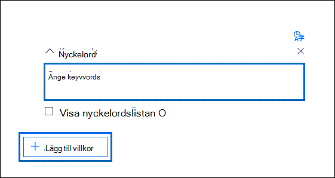
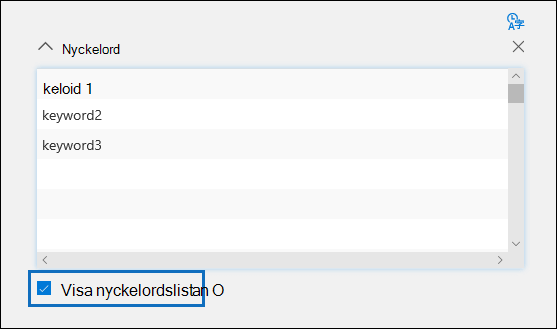

# Skapa sökfrågor för samlingar i Advanced eDiscovery

När du konfigurerar sökfrågan när du skapar en samling i ett Advanced eDiscovery-ärende kan du använda nyckelord för att hitta specifikt innehåll och villkor för att begränsa sökningens omfattning för att returnera de objekt som är mest relevanta för den juridiska undersökningen. 

## Nyckelordssökningar

Skriv en nyckelordsfråga **i rutan** Nyckelord i sökfrågan. Du kan ange nyckelord, egenskaper för e-postmeddelanden, till exempel datum för skickade och mottagna meddelanden, eller dokumentegenskaper, t.ex. filnamn eller det datum då ett dokument senast ändrades. Du kan använda mer komplexa frågor som innehåller booleska operatorer som **AND**, **OR**, **NOT**, och **NEAR**. Du kan också söka efter känslig information (t.ex. personnummer) i dokument i SharePoint och OneDrive (inte i e-postmeddelanden), eller söka efter dokument som har delats externt. Om du lämnar **rutan Nyckelord** tom visas allt innehåll på de angivna innehållsplatserna i sökresultatet.

## Nyckelordslista

Alternativt kan du markera kryssrutan Visa **nyckelordslista och** skriva ett nyckelord eller en nyckelordsfras på varje rad. Nyckelorden på varje rad är sammankopplade med en logisk operator (som representeras som *c:er* i sökfrågesyntaxen) som liknar den **ELLER-operatorn** i sökfrågan som skapas. Det innebär att objekt som innehåller ett nyckelord på valfri rad finns i sökresultaten. Du kan lägga till upp till 180 rader i nyckelordslistan Advanced eDiscovery i sökfrågor.

Varför ska jag använda nyckelordslistan? Du kan få statistik som visar hur många objekt som matchar varje nyckelord i nyckelordslistan. Det kan hjälpa dig att snabbt identifiera de nyckelord som är mest (och minst) effektiva. Du kan också använda en nyckelordsfras (inom parentes) i en rad i listan med nyckelord. Mer information om sökstatistik finns i [Sökstatistik](search-statistics-in-advanced-ediscovery.md).

## Villkor

Du kan lägga till sökvillkor för att begränsa omfattningen av en sökning och returnera en mer förfinad uppsättning resultat. Varje villkor lägger till en sats i sökfrågan som skapas och körs när du startar sökningen. Ett villkor är logiskt kopplat till nyckelordsfrågan som anges i nyckelordsrutan av en logisk operator (som representeras som *c:c* i sökfrågesyntaxen) som fungerar ungefär som operatorn **OCH.** Det innebär att objekt måste uppfylla både nyckelordsfrågan och ett eller flera villkor som ska tas med i sökresultatet. Det är så du begränsar resultatet med hjälp av villkor. En lista och en beskrivning av de villkor som du kan använda i en sökfråga finns i avsnittet "Sökvillkor" i [Nyckelordsfrågor och sökvillkor.](keyword-queries-and-search-conditions.md#search-conditions)
