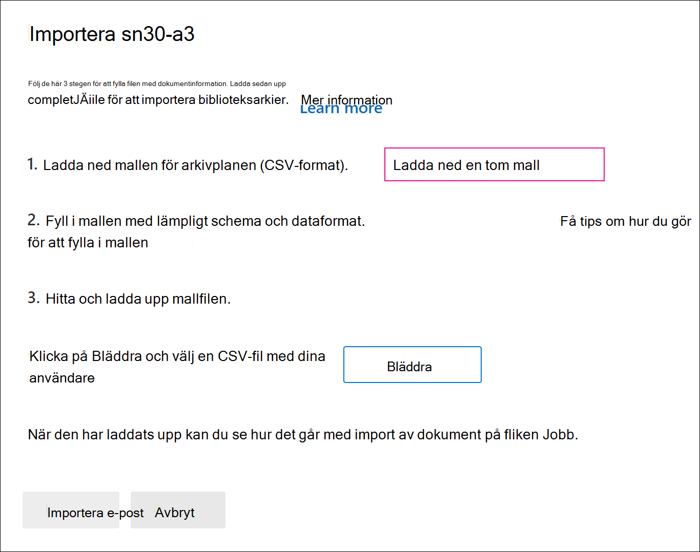

# Importera biblioteks till ett Advanced eDiscovery ärendeImport custodians to an Advanced eDiscovery case

I Advanced eDiscovery fall där många dokumentrepresentanter ingår kan du importera flera dokumentrepresentanter samtidigt genom att använda en CSV-fil som innehåller den information som behövs för att lägga till dem i ett ärende.For Advanced eDiscovery cases that involve many custodians, you can import multiple custodians at once by using a CSV file that contains the information necessary to add them to a case.

## Importera sn3:arImport custodians

1. Öppna Advanced eDiscovery och välj **fliken Datakällor.**Open the Advanced eDiscovery case and select the **Data sources** tab.

2. Klicka på **Lägg till datakälla** Importera  >  **snianer**.Click **Add data source** > **Import custodians**.

3. På den **utfällsbara sidan Importera** dokumentrepresentanter klickar du på Ladda ned en **tom mall för** att ladda ned en dokumentmall i CSV-fil.On the **Import custodians** flyout page, click **Download a blank template** to download a custodian template CSV file.

   

4. Lägg till ljudinformation i CSV-filen och spara den på din lokala dator.Add the custodial information to the CSV file and save it to your local computer. Mer information om vilka egenskaper som krävs i [CSV-filen](#custodian-csv-file) finns i csv-filens insv-fil.See the [Custodian CSV file](#custodian-csv-file) section for information about the required properties in the CSV file.

5. När du har förberett CSV-filen med den dokumentade informationen går du tillbaka till fliken **Datakällor** och klickar på Lägg till **datakälla**  >  **Importera dokumentianer** igen.After you've prepared the CSV file with the custodian information, go back to the **Data sources** tab, and click **Add data source** > **Import custodians** again.

6. På den **utfällliga** sidan  Importera dokumentrepresentanter klickar du på Bläddra och laddar sedan upp CSV-filen som innehåller den dokumentade informationen.On the **Import custodians** flyout page, click **Browse** and then upload the CSV file that contains the custodian information.

   När CSV-filen har laddats  upp skapas och visas på fliken  Jobb. Jobbet validerar de registrerades och deras associerade datakällor och lägger sedan till dem på **sidan Datakällor** för ärendet.After the CSV file is uploaded, a job named **BulkAddCustodian** is created and displayed on the **Jobs** tab. The job validates the custodians and their associated data sources and then adds them to the **Data sources** page of the case.

## Csv-fil för dokumentCustodian CSV file

När du har laddat ned MALLEN CSV-dokument kan du lägga till dokumentrepresentanter och deras datakälla i varje rad.After you download the CSV custodian template, you can add custodians and their data source in each row. Se till att du inte ändrar kolumnnamnen i rubrikraden.Be sure not to change the column names in the header row. Använd kolumnerna typ av arbetsbelastning och arbetsbelastning för att koppla andra datakällor till en vårdnadshavare.Use the workload type and workload location columns to associate other data sources to a custodian.

| KolumnnamnColumn name|BeskrivningDescription|
|:------- |:------------------------------------------------------------|
|**10-postkontakt****Custodian contactEmail**     |Den insertsiskans UPN-e-postadress.The custodian's UPN email address. Till exempel sarad@contoso.onmicrosoft.com.For example, sarad@contoso.onmicrosoft.com.           |
|**Exchange Aktiverad****Exchange Enabled** | SANT/FALSKT-värde för att inkludera eller inte inkludera den som är den som förser postlådan med sitt namn.TRUE/FALSE value to include or not include the custodian's mailbox.      |
|**OneDrive Aktiverad****OneDrive Enabled** | SANT/FALSKT-värde om du vill inkludera eller inte inkludera den som har OneDrive för företag konto.TRUE/FALSE value to include or not included the custodian's OneDrive for Business account. |
|**Is OnHold****Is OnHold**        | SANT/FALSKT anger om de verkliga datakällorna ska vara i förvaring.TRUE/FALSE value to indicate whether to place the custodian data sources on hold. 11     |
|**Typ av arbetsbelastning1****Workload1 Type**         |Strängvärde som anger vilken typ av datakälla som ska associeras med den som ska associeras.String value indicating the type of data source to associate with the custodian. Möjliga värden inkluderar:Possible values include:  - ExchangeMailbox- ExchangeMailbox  - SharePointSite- SharePointSite - TeamsMailbox- TeamsMailbox - TeamsSite- TeamsSite  - YammerMailbox- YammerMailbox - Yammer-webbplats- YammerSite |
|**Workload1 Location****Workload1 Location**     | Beroende på typ av arbetsbelastning är det här datakällans plats.Depending on your workload type, this would be the location of the data source. Till exempel e-postadressen för en Exchange postlåda eller URL-adressen för en SharePoint webbplats.For example, the email address for an Exchange mailbox or the URL for a SharePoint site. |
|||

> [!NOTE]
> 1 Du kan placera högst 1 000 postlådor och 100 platser i förvaring med hjälp av importprocessen och CSV-filen.1 You can place a maximum of 1,000 mailboxes and 100 sites on hold by using the custodian import process and CSV file. Du kan använda den här processen för att lägga till fler än 1 000 personer till ett ärende, men begränsningarna för förvaring gäller fortfarande.You can use this process to add more than 1,000 custodians to a case, but the hold limits still apply. Mer information om begränsningar för begränsningar av begränsningar för [begränsningar finns i Advanced eDiscovery](limits-ediscovery20.md#hold-limits).For more information about hold limits, see [Limits in Advanced eDiscovery](limits-ediscovery20.md#hold-limits).

Här är ett exempel på en CSV-fil med dokumentinformation:Here's an example of a CSV file with custodian information:  

|10-postkontaktCustodian contactEmail      | Exchange AktiveradExchange Enabled | OneDrive AktiveradOneDrive Enabled | Is OnHoldIs OnHold | Typ av arbetsbelastning1Workload1 Type | Workload1 LocationWorkload1 Location             |
| ----------------- | ---------------- | ---------------- | --------- | -------------- | ------------------------------ |
|robinc@onmicrosoft.contoso.comrobinc@onmicrosoft.contoso.com | TRUETRUE             | TRUETRUE             | TRUETRUE      | SharePointSiteSharePointSite | https://contoso.sharepoint.com |
|pillarp@onmicrosoft.contoso.compillarp@onmicrosoft.contoso.com | TRUETRUE             | TRUETRUE             | TRUETRUE      | |  |
||||||

## Kontroll av datakälla och datakällaCustodian and data source validation

När du har laddat upp den uppsvända CSV Advanced eDiscovery filen gör du följande:After you upload the custodian CSV file, Advanced eDiscovery does the following things:

1. Verifierar de som har godkänt den och deras datakällor.Validates the custodians and their data sources.

2. Indexerar alla datakällor för varje dokumentägare och placerar dem i förvaring (om egenskapen **Is OnHold** i CSV-filen är inställd på SANT).Indexes all data sources for each custodian and places them on hold (if the **Is OnHold** property in the CSV file is set to TRUE).

### InsidningsvalideringCustodian validation

För närvarande stöder vi endast import av biblioteksmedlemmar som ingår i organisationens Azure Active Directory (Azure AD).Currently, we only support importing custodians that are included in your organization's Azure Active Directory (Azure AD).

Det dokumentariska importverktyget söker efter och verifierar dokumentrepresentanter med HJÄLP av UPN-värdet i kolumnen **Förnamnkontaktepost** i CSV-filen.The custodian import tool finds and validates custodians using the UPN value in the **Custodian contactEmail** column in the CSV file. Om någon har verifierat en datakälla läggs den till automatiskt i ärendet och listas på fliken **Datakällor** för ärendet.Custodians that are validated are automatically added to the case and listed on the **Data sources** tab of the case. Om en vårdnadshavare inte kan verifieras visas de i felloggen för det BulkAddCustodian-jobb som finns på fliken Jobb för ärendet. If a custodian can't be validated, they are listed in the error log for the BulkAddCustodian job that is listed on the **Jobs** tab in the case. Ej registrerade bibliotek läggs inte till i ärendet eller visas på **fliken Datakällor.**Unvalidated custodians are not added to the case or listed on the **Data sources** tab.

### DatakällverifieringData source validation

När brevlådor valideras och läggs till i ärendet läggs varje primär postlåda och OneDrive konto som är kopplat till en vårdnadshavare till.After custodians are validated and added to the case, each primary mailbox and OneDrive account that's associated with a custodian is added.

Men om någon av de andra datakällorna (t.ex. SharePoint-webbplatser, Microsoft Teams-, Microsoft 365-grupper eller Yammer-grupper) som är kopplade till en användare inte kan hittas, tilldelas inga av dem till den verifieradeianen och värdet Verifierad visas i kolumnen **Status** bredvid den som är godkänd på fliken **Datakällor.** However, if any of the other data sources (such as SharePoint sites, Microsoft Teams, Microsoft 365 Groups, or Yammer groups) associated with a custodian can't be found, none of them are assigned to the custodian and the value **Not validated** is displayed in the **Status** column next to the custodian on the **Data sources** tab.

Så här lägger du till verifierade datakällor för en vårdnadshavare:To add validated data sources for a custodian:

1. På fliken **Datakällor** väljer du en dokumenterare som innehåller datakällor som inte är verifierade.On the **Data sources** tab, select a custodian that contains data sources that aren't validated.

2. På den utfällliga sidan  för den verifierade person som ingår bläddrar du till avsnittet Förfallna platser för att visa både verifierade och icke verifierade datakällor som är associerade med verifierare.On the custodian flyout page, scroll to the **Custodial locations** section to view both validated and unvalidated data sources that are associated with custodian.

3. Klicka **på** Redigera högst upp på den utfällliga sidan om du vill ta bort ogiltiga datakällor eller lägga till nya.Click **Edit** at the top of the flyout page to remove invalid data sources or add new ones.

4. När du tar bort oberäknade datakällor eller  lägger till en ny, visas värdet Aktiv i kolumnen **Status** för den vårdnadshavare som inte har något värde på **fliken Datakällor.** Om du vill lägga till källor som tidigare såg ut att vara ogiltiga följer du åtgärdsstegen nedan för att manuellt lägga till dem till en vårdnadshavare.After you remove unvalidated data sources or add a new one, the value **Active** is displayed in **Status** column for the custodian on the **Data sources** tab. To add sources that previously appeared to be invalid, follow the remediation steps below to manually add them to a custodian.

### Åtgärda ogiltiga datakällorRemediating invalid data sources

Så här lägger du till och associerar en datakälla som tidigare var ogiltig:To manually add and associate a data source that was previously invalid:

1. På fliken **Datakällor väljer** du en vårdnadshavare att manuellt lägga till och associera en datakälla som tidigare var ogiltig.On the **Data sources** tab, select a custodian to manually add and associate a data source that was previously invalid.

2. Klicka **på** Redigera högst upp på den utfällliga sidan om du vill associera postlådor, webbplatser, Teams eller Yammer postgrupper med den tor just nu.Click **Edit** at the top of the flyout page to associate mailboxes, sites, Teams, or Yammer groups to the custodian. Det gör du genom **att** klicka på Redigera bredvid rätt dataplatstyp.Do this by clicking **Edit** next to the appropriate data location type.

3. Klicka **på** Nästa för att visa **sidan Inställningar för** håll och konfigurera inställningen för att vänta för de datakällor du lagt till.Click **Next** to display the **Hold settings** page and configure the hold setting for the data sources you added.

4. Klicka **på Nästa** för att visa sidan Granska **granskare** och klicka sedan på **Skicka för** att spara ändringarna.Click **Next** to display the **Review custodians** page, and then click **Submit** to save your changes.
