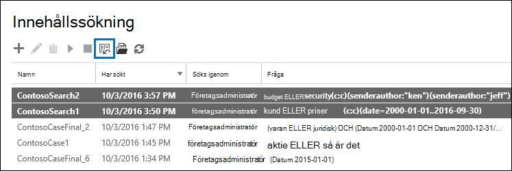
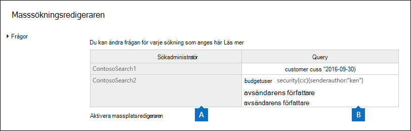
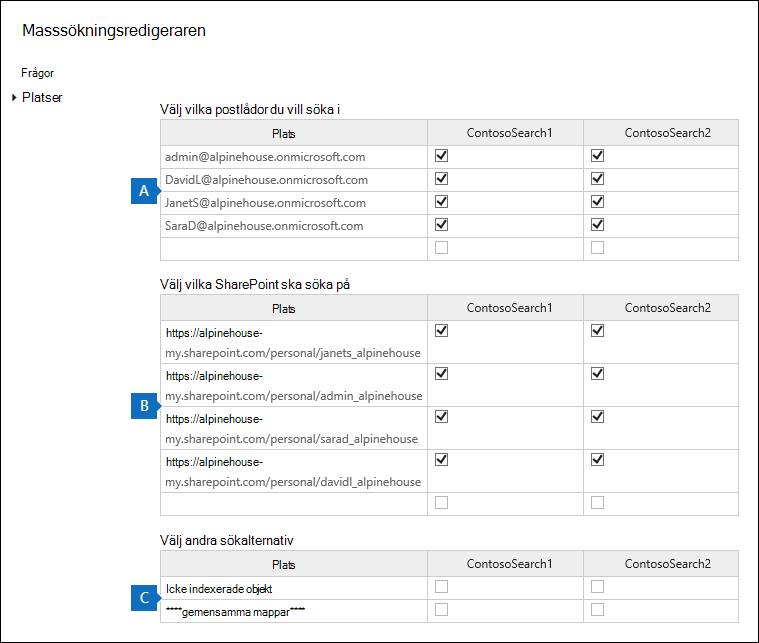

# Massredigera innehållssökningar

Du kan använda redigeraren för masssökning i verktyget Innehållssökning för att redigera flera sökningar samtidigt. Med det här verktyget kan du snabbt ändra platsen för en fråga och innehåll för en eller flera sökningar. Sedan kan du köra sökningarna igen och få nya uppskattade sökresultat för de reviderade sökningarna. Med redigeraren kan du även kopiera och klistra in frågor och innehållsplatser från en Microsoft Excel eller textfil. Det innebär att du kan använda verktyget Sökstatistik för att visa statistik för en eller flera sökningar, exportera statistiken till en CSV-fil där du kan redigera frågorna och innehållsplatserna i Excel. Sedan använder du Masssökningsredigeraren för att lägga till de reviderade frågorna och innehållsplatserna i sökningarna. När du har ändrat en eller flera sökningar kan du starta om dem och få nya uppskattade sökresultat.

Mer information om hur du använder verktyget Sökstatistik finns i [Visa nyckelordsstatistik för innehållssökningsresultat](view-keyword-statistics-for-content-search.md).

## Använda Masssökningsredigeraren för att ändra frågor

1. Gå till <https://protection.office.com> och välj sedan Sök **efter** \> **innehållsökning**.

2. Markera en eller flera sökningar i listan med sökningar och välj sedan **Masssökningsredigeraren** Masssökning i  Editor.

    

    Följande information visas på sidan **Frågor i** Redigeraren för masssökning.

    

    a. I **kolumnen** Sök visas namnet på innehållssökningen. Som tidigare nämnts kan du redigera frågan för flera sökningar.

    b. I **frågekolumnen** visas frågan för innehållssökningen som finns i **kolumnen** Sök. Om frågan skapades med hjälp av listfunktionen för nyckelord avgränsas nyckelorden med texten **`(c:s)`** . Det här anger att nyckelorden är kopplade av **operatorn** ELLER. Om frågan dessutom innehåller villkor avgränsas nyckelorden och villkoren med texten **`(c:c)`** . Det här anger att nyckelorden (eller nyckelordsfaserna) är kopplade till villkoren av **OPERATORN.** I den föregående skärmbilden skulle KQL-frågan som motsvarar till exempel vara ContosoSearch1. `customer (c:s) pricing(c:c)(date=2000-01-01..2016-09-30)` `(customer OR pricing) AND (date=2002-01-01..2016-09-30)`

3. Om du vill redigera en fråga markerar du den cell i frågan som du vill ändra och gör sedan något av följande. Cellens kantlinjer visas med en blå ruta när du markerar den.

   - Skriv den nya frågan i cellen. Du kan inte redigera en del av frågan. Du måste skriva hela frågan.

      Eller

   - Klistra in en ny fråga i cellen. Det här förutsätter att du har kopierat frågetexten från en fil, till exempel en textfil eller en Excel fil.

4. När du har redigerat en eller flera frågor på **sidan Frågor** väljer du **Spara**.

    Den ändrade frågan visas i kolumnen **Fråga för** den valda sökningen.

5. Välj **Stäng** för att stänga redigeraren för masssökning.

6. På sidan **Innehållssökning** markerar du sökningen som du har redigerat och väljer **Starta** sökningen för att starta om sökningen med den ändrade frågan.

Här är några tips för att redigera frågor med hjälp av Redigeraren för masssökning:

- Kopiera den befintliga frågan (med hjälp av **Ctrl C**) till en textfil. Redigera frågan i textfilen och kopiera sedan den ändrade frågan och klistra in den (med **Ctrl+V)** i cellen **på sidan** Frågor.

- Du kan också kopiera frågor från andra program (till exempel Microsoft Word eller Microsoft Excel). Men det kan hända att du oavsiktligt lägger till tecken som inte stöds i en fråga med hjälp av Masssökningsredigeraren. Det bästa sättet att förhindra tecken som inte stöds är att skriva frågan i en cell på **sidan** Frågor. Du kan också kopiera en fråga från Word eller Excel och sedan klistra in den i en fil i en textredigerare, till exempel Microsoft Anteckningar. Spara sedan textfilen och välj **ANSI** i **listrutan** Kodning. Då tas all formatering bort och tecken som inte stöds. Sedan kan du kopiera och klistra in frågan från textfilen till **sidan** Frågor.

## Använda Masssökningsredigeraren för att ändra innehållsplatser

1. I Redigeraren för masssökning efter en eller flera markerade sökningar  markerar du Aktivera massplatsredigeraren och sedan länken Platser som visas på sidan.

    Följande information visas på sidan **Platser i** Redigeraren för masssökning.

    

    a. **Postlådor att söka i** I det här avsnittet visas en kolumn för varje vald innehållssökning och en rad för varje postlåda som ingår i sökningen. En bockmarkering anger att postlådan ingår i sökningen. Du kan lägga till postlådor i en sökning genom att skriva postlådans e-postadress i en tom rad och sedan markera kryssrutan för den innehållssökning du vill lägga till den i. Du kan också ta bort en postlåda från en sökning genom att avmarkera kryssrutan.

    b. **SharePoint webbplatser att söka på** I det här avsnittet visas en rad SharePoint och OneDrive som ingår i varje vald innehållssökning. En bockmarkering anger att webbplatsen ingår i sökningen. Du kan lägga till webbplatser i en sökning genom att skriva url:en för webbplatsen i en tom rad och sedan markera kryssrutan för den innehållssökning du vill lägga till den i. Du kan också ta bort en webbplats från en sökning genom att avmarkera kryssrutan.

    c. **Andra sökalternativ** I det här avsnittet anges om icke indexerade objekt och gemensamma mappar ingår i sökningen. Om du vill inkludera dem kontrollerar du att kryssrutan är markerad. Om du vill ta bort dem avmarkerar du kryssrutan.

2. När du har redigerat ett eller flera av avsnitten **på sidan Platser** väljer du **Spara**.

    De ändrade innehållsplatserna visas i rätt avsnitt för de valda sökningarna.

3. Välj **Stäng** för att stänga redigeraren för masssökning.

4. På sidan **Innehållssökning** markerar du sökningen som du  har redigerat och väljer Starta sökningen för att starta om sökningen med de ändrade innehållsplatserna.

Här är några tips för att redigera innehållsplatser med hjälp av Redigeraren för masssökning:

- Du kan redigera innehållssökningar om du vill söka  i alla postlådor  eller webbplatser i organisationen genom att skriva Alla på en tom rad i Postlådorna för att söka **eller SharePoint** webbplatser för att söka i och sedan markera kryssrutan.

- Du kan lägga till flera innehållsplatser i en eller flera sökningar genom att kopiera flera rader från en textfil eller en Excel-fil och sedan klistra in dem i ett avsnitt **på sidan** Platser. När du har lagt till nya platser ska du markera kryssrutan för varje sökning som du vill lägga till platsen i.

    > [!TIP]
    > Om du vill skapa en lista med e-postadresser för alla användare i organisationen kör du PowerShell-kommandot i steg 2 i [Steg 2: Skapa](search-the-mailbox-and-onedrive-for-business-for-a-list-of-users.md#step-2-generate-a-list-of-users)en lista med användare. Du kan även följa stegen i Hämta en lista över [OneDrive och URL:er](/onedrive/list-onedrive-urls) i organisationen för att skapa en lista över alla OneDrive för företag i organisationen. Observera att du måste lägga till URL-adressen för organisationens Min webbplats-domän (till exempel till den https://contoso-my.sharepoint.com) OneDrive för företag-webbplatser som skapas av skriptet. När du har lista med e-postadresser OneDrive för företag eller webbplatser kan  du kopiera och klistra in dem på sidan Platser i redigeraren för masssökning.

- När du väljer **Spara** för att spara ändringar i Redigeraren för masssökning valideras e-postadressen för postlådor som du lade till i en sökning. Om e-postadressen inte finns visas ett felmeddelande om att postlådan inte kan finnas. URL-adresser för webbplatser verifieras inte.
