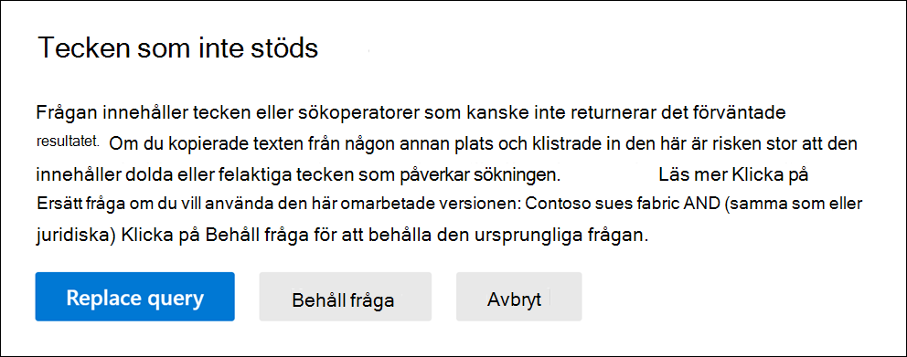

# Söka efter fel i innehållssökningsfrågan
  
Här är en lista över de tecken som inte stöds och som vi kontrollerar. Tecken som inte stöds är ofta dolda och leder vanligtvis till ett sökfel eller oväntade resultat.
  
- **Smarta citattecken** – Smarta enkla och dubbla citattecken (kallas även typografiska citattecken) stöds inte. Endast raka citattecken kan användas i en sökfråga. 

- **Icke utskrivbara tecken** och kontrolltecken – Icke utskrivbara tecken och kontrolltecken representerar inte en skriven symbol, till exempel ett alfanumeriskt tecken. Exempel på icke utskrivbara tecken och kontrolltecken är tecken som formaterar text eller separata rader med text. 

- **Vänster-till-höger-** och höger-till-vänster-markeringar – Dessa markeringar är kontrolltecken som används för att ange textriktningen för språk som är från vänster till höger (till exempel svenska och spanska) och språk som är från höger till vänster (t.ex. arabiska och hebreiska).

- **Booleska operatorer** med gemener – Om du använder en boolesk operator, till exempel **OCH,** **ELLER** och **ICKE** i en sökfråga, måste den vara versal. När vi kontrollerar om det finns stavfel i en fråga anger frågesyntaxen ofta att en boolesk operator används, även om gemener (operatorer) kan användas. till exempel  `(WordA or WordB) and (WordC or WordD)` .

## Vad händer om en fråga har ett tecken som inte stöds?

Om tecken som inte stöds hittas i frågan visas ett varningsmeddelande där det står att tecken som inte stöds hittas och föreslår ett alternativ. Du kan sedan välja att behålla den ursprungliga frågan eller ersätta den med den föreslagna reviderade frågan.

Här är ett exempel på varningsmeddelandet som visas när du klickar på Sök efter **stavfel** i sökfrågan i föregående skärmbild. Observera att den ursprungliga frågan använder smarta citattecken och booleska operatorer med gemener.
  

  
## Förhindra tecken som inte stöds i dina sökfrågor

Tecken som inte stöds läggs vanligtvis till i en fråga när du kopierar frågan eller delar av frågan från andra program (till exempel Microsoft Word eller Microsoft Excel) och klistrar in dem i nyckelordsrutan på frågesidan i en innehållssökning. Det bästa sättet att förhindra tecken som inte stöds är att skriva frågan i rutan nyckelord. Du kan också kopiera en fråga från Word eller Excel och sedan klistra in den i en textredigerare, till exempel Microsoft Anteckningar. Spara textfilen och välj **ANSI** i **listrutan** Kodning. Det här tar bort all formatering och tecken som inte stöds. Sedan kan du kopiera och klistra in frågan från textfilen till nyckelordsfrågerutan. 
