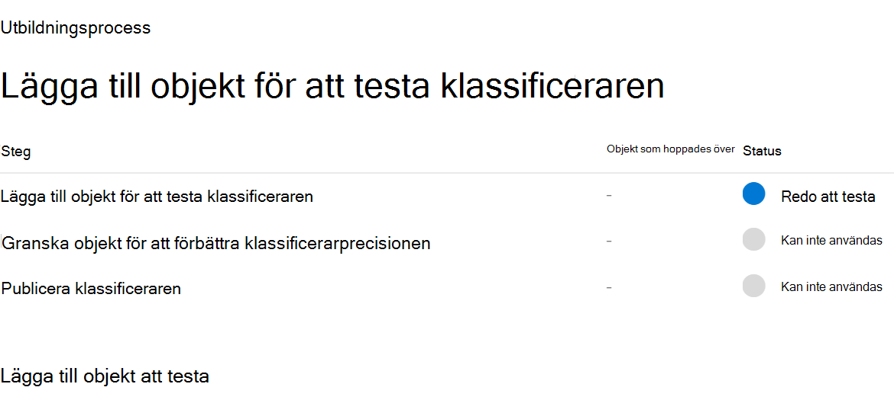
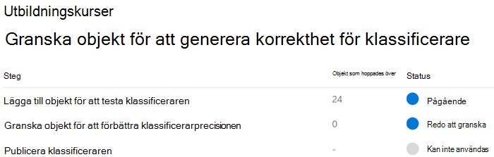
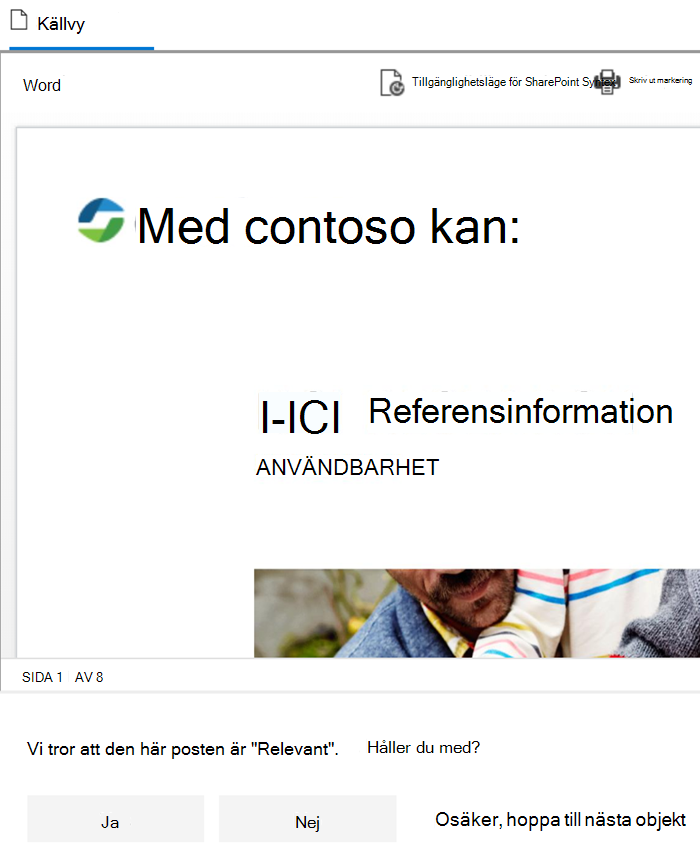
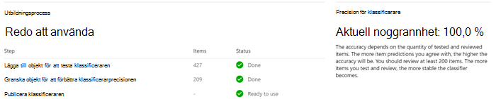

# Kom igång med utbildningsbara klassificerareGet started with trainable classifiers

En Microsoft 365 trainable classifier är ett verktyg som du kan träna för att känna igen olika typer av innehåll genom att ge det urval att titta på.A Microsoft 365 trainable classifier is a tool you can train to recognize various types of content by giving it samples to look at. När du har utbildat dig kan du använda den för att identifiera objektet för tillämpning av Office känslighetsetiketter, principer för kommunikationsefterlevnad och bevarandeetiketter.Once trained, you can use it to identify item for application of Office sensitivity labels, Communications compliance policies, and retention label policies.

Om du skapar en egen utbildare för att klassificera den först ingår att ge det urval som människor har valt och som matchar kategorin positivt.Creating a custom trainable classifier first involves giving it samples that are human picked and positively match the category. När de har bearbetats testar du sedan möjligheten att förutsäga klassificerarna genom att ge den en blandning av positiva och negativa prover.Then, after it has processed those, you test the classifiers ability to predict by giving it a mix of positive and negative samples. I den här artikeln beskrivs hur du skapar och utbildar en anpassad klassificerare och hur du förbättrar prestanda för anpassade utbildare och föranpassade klassificerare under deras livstid genom omsämring.This article shows you how to create and train a custom classifier and how to improve the performance of custom trainable classifiers and pre-trained classifiers over their lifetime through retraining.

Mer information om de olika typerna av klassificerare finns i [Läs mer om utbildare.](classifier-learn-about.md)To learn more about the different types of classifiers, see [Learn about trainable classifiers](classifier-learn-about.md).

Titta på den här videon för en snabb sammanfattning av hur du skapar en utbildande klassificerare.Watch this video for a quick summary of creating a trainable classifier. Du måste fortfarande läsa den här fullständiga artikeln för att få mer information.You'll still need to read this full article to get the details.

 

> [!VIDEO https://www.microsoft.com/videoplayer/embed/RWyGL7]

## FörutsättningarPrerequisites

### LicensieringskravLicensing requirements

Klassificerare är en funktion Microsoft 365 E5 regelefterlevnad eller E5-efterlevnad.Classifiers are a Microsoft 365 E5, or E5 Compliance feature. Du måste ha en av dessa prenumerationer för att kunna använda dem.You must have one of these subscriptions to make use of them.

### BehörigheterPermissions

Så här kommer du åt klassificerare i användargränssnittet:To access classifiers in the UI: 

- Den globala administratören måste registrera sig för klientorganisationen för att skapa anpassade klassificerare.the Global admin needs to opt in for the tenant to create custom classifiers.
- Efterlevnadsadministratörsroll krävs för att utbilda en klassificerare.Compliance Administrator role is required to train a classifier.

Du behöver konton med de här behörigheterna för att använda klassificerare i följande scenarier:You'll need accounts with these permissions to use classifiers in these scenarios:

- Scenario för bevarandeprincip: Roller för arkiveringshantering och bevarandehanteringRetention label policy scenario: Record Management and Retention Management roles 
- Scenario för känslighetsetikettsprincip: Säkerhetsadministratör, efterlevnadsadministratör, efterlevnadsdataadministratörSensitivity label policy scenario: Security Administrator, Compliance Administrator, Compliance Data Administrator
- Scenario: Scenario för kommunikationsefterlevnadspolicy: Insider-riskhanteringsadministratör, övervakande granskningsadministratörCommunication compliance policy scenario: Insider Risk Management Admin, Supervisory Review Administrator 

> [!IMPORTANT]
> Som standard kan endast den användare som skapar en anpassad klassificerare utbilda och granska prognoser som gjorts av den klassificeraren.By default, only the user who creates a custom classifier can train and review predictions made by that classifier.

## Förbereda en egen utbildarePrepare for a custom trainable classifier 

Det är bra att förstå vad som ingår i att skapa en egen utbildare innan du dyker ned.It's helpful to understand what's involved in creating a custom trainable classifier before you dive in. 

### TidslinjeTimeline

Den här tidslinjen återspeglar ett exempel på distribution av utbildande klassificerare.This timeline reflects a sample deployment of trainable classifiers.

> [!TIP]
> Avanmälning krävs första gången för utbildare.Opt-in is required the first time for trainable classifiers. Det tar tolv dagar Microsoft 365 att slutföra en baslinjeutvärdering av organisationens innehåll.It takes twelve days for Microsoft 365 to complete a baseline evaluation of your organizations content. Kontakta din globala administratör för att starta processen med att anmäla dig.Contact your global administrator to kick off the opt-in process.

### Övergripande arbetsflödeOverall workflow

Mer information om det övergripande arbetsflödet för att skapa anpassade utbildare finns i Processflöde för att skapa anpassade klassificerare som [kan klassificeras av kunder.](classifier-learn-about.md#process-flow-for-creating-custom-classifiers)To understand more about the overall workflow of creating custom trainable classifiers, see [Process flow for creating customer trainable classifiers](classifier-learn-about.md#process-flow-for-creating-custom-classifiers).

### StartinnehållSeed content

När du vill att en utbildare ska klassificera ett objekt oberoende av varandra och korrekt identifiera det som en viss kategori av innehåll måste du först presentera det med många exempel på den typ av innehåll som ingår i kategorin.When you want a trainable classifier to independently and accurately identify an item as being in particular category of content, you first have to present it with many samples of the type of content that are in the category. Denna matning av prover till den utbildande klassificeraren kallas för *ifogning*.This feeding of samples to the trainable classifier is known as *seeding*. Lägga till innehåll väljs av en person och ska nu representera innehållskategorin.Seed content is selected by a human and is judged to represent the category of content.

> [!TIP]
> Du måste ha minst 50 positiva tal och upp till 500.You need to have at least 50 positive samples and as many as 500. Den utbildande klassificeraren bearbetar upp till de 500 senaste skapade exemplen (som skapas av filen som skapats med datum- och tidsstämpeln).The trainable classifier will process up to the 500 most recent created samples (by file created date/time stamp). Ju fler exempel du anger, desto mer exakta är de prognoser som klassificeraren gör.The more samples you provide, the more accurate the predictions the classifier will make.

### Testa innehållTesting content

När den utbildande klassificeraren har hanterat tillräckligt positiva prover för att skapa en prognosmodell måste du testa de prognoser som den gör för att se om klassificeraren på ett korrekt sätt kan skilja mellan objekt som matchar kategorin och objekt som inte har det.Once the trainable classifier has processed enough positive samples to build a prediction model, you need to test the predictions it makes to see if the classifier can correctly distinguish between items that match the category and items that don't. Det gör du genom att välja en annan, förhoppningsvis större, uppsättning människor som har hämtats innehåll som består av prover som bör gå in i kategorin och exempel som inte kommer att det.You do this by selecting another, hopefully larger, set of human picked content that consists of samples that should fall into the category and samples that won't. Du bör testa med andra data än de ursprungliga startdata som du angav först.You should test with different data than the initial seed data you first provided. När de har hanterats går du manuellt igenom resultatet och kontrollerar om varje prognos är korrekt, felaktig eller osäker.Once it processes those, you manually go through the results and verify whether each prediction is correct, incorrect, or you aren't sure. Den utbildande klassificeraren använder den här feedbacken för att förbättra sin prognosmodell.The trainable classifier uses this feedback to improve its prediction model.

> [!TIP]
> För bästa resultat bör du ha minst 200 objekt i testuppsättningen med en jämn fördelning av positiva och negativa matchningar.For best results, have at least 200 items in your test sample set with an even distribution of positive and negative matches.

## Så här skapar du en utbildareHow to create a trainable classifier

1. Samla in mellan 50–500 startinnehållsobjekt.Collect between 50-500 seed content items. Det får endast vara exempel som verkligen representerar den typ av innehåll som du vill att den utbildande klassificeraren ska identifiera som i klassificeringskategorin.These must be only samples that strongly represent the type of content you want the trainable classifier to positively identify as being in the classification category. Se [Filnamnstillägg och filtyper som crawlas som](/sharepoint/technical-reference/default-crawled-file-name-extensions-and-parsed-file-types) standard i SharePoint server för filtyper som stöds.See, [Default crawled file name extensions and parsed file types in SharePoint Server](/sharepoint/technical-reference/default-crawled-file-name-extensions-and-parsed-file-types) for the supported file types.

   > [!IMPORTANT]
   > Start- och testobjekt får inte krypteras och måste vara på engelska.The seed and test sample items must not be encrypted and they must be in English.

   > [!IMPORTANT]
   > Kontrollera att elementen i startuppsättningen **är starka** exempel på kategorin.Make sure the items in your seed set are **strong** examples of the category. Den utbildande klassificeraren skapar först sin modell baserat på vad du tillskriver den.The trainable classifier initially builds its model based on what you seed it with. Klassificeraren antar att alla startprov är starka positiva tal och det går inte att se om ett sampel är en svag eller negativ matchning för kategorin.The classifier assumes all seed samples are strong positives and has no way of knowing if a sample is a weak or negative match to the category.

2. Placera startinnehållet i en SharePoint Online-mapp som är avsedd att endast *hålla startinnehåll.*Place the seed content in a SharePoint Online folder that is dedicated to holding *the seed content only*. Notera URL-adressen till webbplatsen, biblioteket och mappen.Make note of the site, library, and folder URL.

   > [!TIP]
   > Om du skapar en ny webbplats och mapp för dina startdata bör du tillåta minst en timme för indexeringen av platsen innan du skapar den trainable-klassificerare som använder dessa tillåtna data.If you create a new site and folder for your seed data, allow at least an hour for that location to be indexed before creating the trainable classifier that will use that seed data.

3. Logga in på Microsoft 365 Efterlevnadscenter med rollåtkomst från efterlevnadsadministratör eller säkerhetsadministratör och öppna **Microsoft 365 Efterlevnadscenter** eller **Microsoft 365 säkerhetscenter**  >  **Dataklassificering.**Sign in to Microsoft 365 compliance center with compliance admin or security admin role access and open **Microsoft 365 compliance center** or **Microsoft 365 security center** > **Data classification**.

4. Välj **fliken Utbildare.**Choose the **Trainable classifiers** tab.

5. Välj **Skapa utbildare .**Choose **Create trainable classifier**.

6. Fyll i lämpliga värden för och fälten för kategorin objekt som du vill att den här `Name` `Description` utbildande klassificeraren ska identifiera.Fill in appropriate values for the `Name` and `Description` fields of the category of items you want this trainable classifier to identify.

7. Välj URL SharePoint för onlinewebbplats, bibliotek och mapp för startinnehållswebbplatsen från steg 2.Pick the SharePoint Online site, library, and folder URL for the seed content site from step 2. Välj `Add` .Choose `Add`.

8. Granska inställningarna och välj `Create trainable classifier` .Review the settings and choose `Create trainable classifier`.

9. Inom 24 timmar bearbetar den utbildande klassificeraren startdata och skapar en prognosmodell.Within 24 hours the trainable classifier will process the seed data and build a prediction model. Klassificerarstatusen är när `In progress` den bearbetar startdata.The classifier status is `In progress` while it processes the seed data. När klassificeraren har bearbetat startdata ändras statusen till `Need test items` .When the classifier is finished processing the seed data, the status changes to `Need test items`.

10. Du kan nu visa informationssidan genom att välja klassificeraren.You can now view the details page by choosing the classifier.

    > [!div class="mx-imgBorder"]
    > 

11. Samla in minst 200 testinnehållsobjekt (10 000 max) för bästa resultat.Collect at least 200 test content items (10,000 max) for best results. Det bör vara en blandning av objekt som är starka positiva, starka negativa och vissa som till sin natur är lite mindre uppenbara.These should be a mix of items that are strong positives, strong negatives and some that are a little less obvious in their nature. Se [Filnamnstillägg och filtyper som crawlas som](/sharepoint/technical-reference/default-crawled-file-name-extensions-and-parsed-file-types) standard i SharePoint server för filtyper som stöds.See, [Default crawled file name extensions and parsed file types in SharePoint Server](/sharepoint/technical-reference/default-crawled-file-name-extensions-and-parsed-file-types) for the supported file types.

    > [!IMPORTANT]
    > Exempelobjekten får inte krypteras och måste vara på engelska.The sample items must not be encrypted and they must be in English.

12. Placera testinnehållet i en mapp SharePoint online som endast ska användas för *att hålla testinnehållet.*Place the test content in a SharePoint Online folder that is dedicated to holding *the test content only*. Notera URL-adressen SharePoint Online, bibliotek och mapp.Make note of the SharePoint Online site, library, and folder URL.

    > [!TIP]
    > Om du skapar en ny webbplats och mapp för dina testdata ska det ta minst en timme innan den platsen indexeras innan du skapar den trainable-klassificerare som använder dessa startdata.If you create a new site and folder for your test data, allow at least an hour for that location to be indexed before creating the trainable classifier that will use that seed data.

13. Välj `Add items to test` .Choose `Add items to test`.

14. Välj URL SharePoint för webbplatsen, biblioteket och mappen Online för testinnehållswebbplatsen från steg 12.Pick the SharePoint Online site, library, and folder URL for the test content site from step 12. Välj `Add` .Choose `Add`.

15. Slutför guiden genom att välja `Done` .Finish the wizard by choosing `Done`. Det tar upp till en timme innan testfilerna bearbetas med din utbildare.Your trainable classifier will take up to an hour to process the test files.

16. När den utbildande klassificeraren har bearbetat dina testfiler ändras statusen på informationssidan till `Ready to review` .When the trainable classifier is done processing your test files, the status on the details page will change to `Ready to review`. Om du behöver öka testprovstorleken väljer och tillåter du att den utbildande `Add items to test` klassificeraren bearbetar de ytterligare objekten.If you need to increase the test sample size, choose `Add items to test` and allow the trainable classifier to process the additional items.

    > [!div class="mx-imgBorder"]
    > 

17. Välj `Tested items to review` flik för att granska objekt.Choose `Tested items to review` tab to review items.

18. Microsoft 365 med 30 objekt åt gången.Microsoft 365 will present 30 items at a time. Granska dem och välj ett `We predict this item is "Relevant". Do you agree?` eller `Yes` eller i `No` `Not sure, skip to next item` rutan.Review them and in the `We predict this item is "Relevant". Do you agree?` box choose either `Yes` or `No` or `Not sure, skip to next item`. Modellprecisionen uppdateras automatiskt efter var 30:e post.Model accuracy is automatically updated after every 30 items.

    > [!div class="mx-imgBorder"]
    > 

19. Granska *minst* 200 objekt.Review *at least* 200 items. När korrekthetsresultatet har visats blir **publiceringsalternativet** tillgängligt och det visas som klassificerares `Ready to use` status.Once the accuracy score has stabilized, the **publish** option will become available and the classifier status will say `Ready to use`.

    > [!div class="mx-imgBorder"]
    > 

20. Publicera klassificeraren.Publish the classifier.

21. När du publicerat din klassificerare blir tillgänglig som ett villkor [i Office](apply-sensitivity-label-automatically.md)automatisk märkning med känslighetsetiketter [tillämpar](apply-retention-labels-automatically.md#configuring-conditions-for-auto-apply-retention-labels) du bevarandeprincip automatiskt utifrån ett villkor och i [kommunikationsefterlevnad.](communication-compliance.md)Once published your classifier will be available as a condition in [Office auto-labeling with sensitivity labels](apply-sensitivity-label-automatically.md), [auto-apply retention label policy based on a condition](apply-retention-labels-automatically.md#configuring-conditions-for-auto-apply-retention-labels) and in [Communication compliance](communication-compliance.md).
