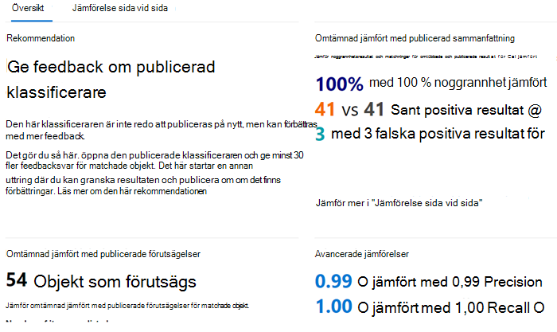

# Så här tränar du en klassificerare i kommunikationsefterlevnad på nytt

En Microsoft 365 trainable classifier är ett verktyg som du kan träna för att känna igen olika typer av innehåll genom att ge det urval att titta på. När du har utbildat dig kan du använda den för att identifiera objekt för tillämpning Office av känslighetsetiketter, principer för kommunikationsefterlevnad och bevarandeetiketter.

I den här artikeln beskrivs hur du förbättrar prestanda för anpassade utbildare och vissa i förväg utbildade klassificerare genom att ge dem ytterligare feedback.

Mer information om de olika typerna av klassificerare finns i [Läs mer om utbildare.](classifier-learn-about.md)

## Behörigheter

Så här kommer du åt klassificerare i Microsoft 365 kompatibilitetscenter:

- Administratörsrollen för efterlevnad eller dataefterlevnad krävs för att utbilda en klassificerare

Du behöver konton med de här behörigheterna för att använda klassificerare i följande scenarier:

- Scenario: Scenario för kommunikationsefterlevnadspolicy: Insider-riskhanteringsadministratör, övervakande granskningsadministratör 

## Övergripande arbetsflöde

> [!IMPORTANT]
> Du ger feedback i den efterlevnadslösning som använder klassificeraren som ett villkor. **Om du inte har en princip för kommunikationsefterlevnad som använder en klassificerare som ett villkor ska du sluta här.**

När du använder dina klassificerare kanske du vill öka precisionen för klassificeringarna som de gör. Det gör du genom att utvärdera kvaliteten på klassificeringarna för objekt som den har identifierat som en matchning eller inte en matchning. När du har gör 30 utvärderingar för en klassificerare krävs den feedbacken och automatiskt omtämnande för sig själv.

Mer information om det övergripande arbetsflödet för att omtämna en klassificerare finns i Processflöde för att [omtämna en klassificerare.](classifier-learn-about.md#retraining-classifiers)

> [!NOTE]
> En klassificerare måste redan ha publicerats och användas innan den kan tränas om.

## Så här kör du om en klassificerare i principer för kommunikationsefterlevnad

1. Öppna den princip för kommunikationsefterlevnad som använder en klassificerare som ett villkor och välj ett av de identifierade objekten i **listan Väntande.**
2. Välj ellipsen och **Förbättra klassificering**.
3. I fönstret **Detaljerad feedback** väljer du **Matcha** om objektet är positivt.  Om objektet är en falsk positiv inställning, att det är det som felaktigt inkluderades i kategorin, väljer **du Inte en matchning**.
4. Om det finns en annan klassificerare som är lämpligare för objektet kan du välja det i listan Föreslå andra klassificerare som **kan klassificeras.** Det här utlöser att den andra klassificeraren utvärderar objektet.

> [!TIP]
> Du kan ge feedback på flera objekt samtidigt genom att välja alla och sedan **välja Ge detaljerad feedback** i kommandofältet.

5. Välj **Skicka feedback** för att skicka din utvärdering av , `match` `not a match` klassificeringar och föreslå andra utbildare. När du har angett 30 instanser av feedback till en klassificerare kommer den automatiskt att tränas om. Det kan ta mellan 1 och 4 timmar att träna. Klassificerare kan bara omtämnas två gånger per dag.

> [!IMPORTANT]
> Den här informationen går till klassificeraren i klientorganisationen, **den går inte tillbaka till Microsoft.**

6.  Öppna sidan **Dataklassificering** i Microsoft 365 **kompatibilitetscenter.**
7. Öppna **Utbildare som klassificerar**.
8. Den klassificerare som använts i efterlevnadsprincipen för kommunikation visas under **rubriken Omutbildning.**

9. När du är klar med omtrainningen väljer du klassificeraren för att öppna översikten för omtraining.

10. Granska den rekommenderade åtgärden och förutsägelsejämförelserna för de omtämta och publicerade versionerna av klassificeraren.
11. Om du är nöjd med resultatet av uttröjningen väljer **du Publicera om.**
12. Om du inte är nöjd med resultatet av omtämningen kan du välja att ge ytterligare feedback till klassificeraren i gränssnittet för kommunikationsefterlevnad och starta en annan omtrainingscykel eller inte göra någonting. I sådant fall används den publicerade versionen av klassificeraren fortsatt. 

## Information om att publicera om rekommendationer

Här är lite information om hur vi sammanställer rekommendationen om att publicera om en omtämnad klassificerare eller föreslå ytterligare omtraining. För det krävs lite djupare förståelse för hur utbildande klassificerare fungerar.

Efter en omtrainning utvärderar vi klassificeraren prestanda för både objekten med feedback och de objekt som ursprungligen användes för att utbilda klassificeraren. 

- För inbyggda modeller är objekt som används för att utbilda klassificeraren de objekt som används av Microsoft för att skapa modellen.
- För anpassade modeller kommer objekt som används i den ursprungliga utbildningen som klassificeraren kommer från de webbplatser som du har lagt till för test och granskning.

Vi jämför prestandanumren för båda uppsättningarna med objekt för den omtämnad och publicerade klassificeraren för att ge en rekommendation om huruvida det fanns förbättring av publiceringen på nytt. 

## Se även

- [Mer information om utbildningsbara klassificerare](classifier-learn-about.md)
- [Förvalda filnamnstillägg och filtyper som crawlas och analyseras i SharePoint Server](/sharepoint/technical-reference/default-crawled-file-name-extensions-and-parsed-file-types)