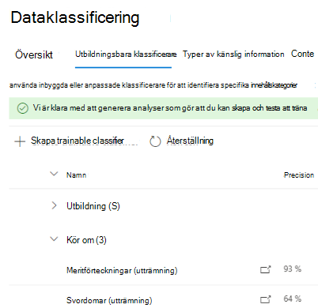
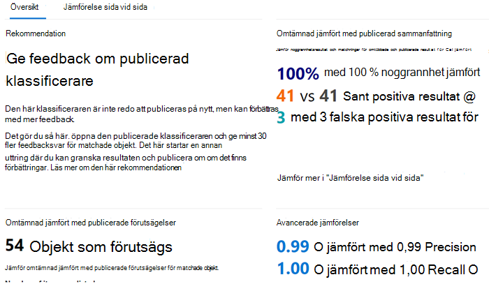

# Så här tränar du en klassificerare i innehållsutforskaren på nyttHow to retrain a classifier in content explorer

En Microsoft 365 trainable classifier är ett verktyg som du kan träna för att känna igen olika typer av innehåll genom att ge det urval att titta på.A Microsoft 365 trainable classifier is a tool you can train to recognize various types of content by giving it samples to look at. När du har utbildat dig kan du använda den för att identifiera objekt för tillämpning Office av känslighetsetiketter, principer för kommunikationsefterlevnad och bevarandeetiketter.Once trained, you can use it to identify item for application of Office sensitivity labels, communications compliance policies, and retention label policies.

I den här artikeln beskrivs hur du förbättrar prestanda för anpassade utbildare och vissa i förväg utbildade klassificerare genom att ge dem ytterligare feedback.This article shows you how to improve the performance of custom trainable classifiers and some pre-trained classifiers by providing them additional feedback.

Mer information om de olika typerna av klassificerare finns i [Läs mer om utbildare.](classifier-learn-about.md)To learn more about the different types of classifiers, see [Learn about trainable classifiers](classifier-learn-about.md).

I den här videon får du en snabb sammanfattning av justerings- och omtämtningsprocessen.Watch this video for a quick summary of the tuning and retraining process. Du måste fortfarande läsa den här fullständiga artikeln för att få mer information.You'll still need to read this full article to get the details.

 

> [!VIDEO https://www.microsoft.com/videoplayer/embed/RWyGMs]

## BehörigheterPermissions

Så här kommer du åt klassificerare i Microsoft 365 kompatibilitetscenter:To access classifiers in the Microsoft 365 Compliance center:

- Administratörsrollen för efterlevnad eller dataefterlevnad krävs för att utbilda en klassificerarethe Compliance admin role or Compliance Data Administrator is required to train a classifier

Du behöver konton med de här behörigheterna för att använda klassificerare i följande scenarier:You'll need accounts with these permissions to use classifiers in these scenarios:

- Scenario för bevarandeprincip: Roller för arkiveringshantering och bevarandehanteringRetention label policy scenario: Record Management and Retention Management roles 

## Övergripande arbetsflödeOverall workflow

> [!IMPORTANT]
> Du ger feedback i Innehållsutforskaren om att tillämpa bevarandeprinciper automatiskt Exchange objekt och använder klassificeraren som ett villkor.You provide feedback in content explorer for auto-apply retention label policies to Exchange items and uses the classifier as a condition. **Om du inte har någon bevarandeprincip som automatiskt tillämpar en bevarandeetikett på alla Exchange objekt och använder en klassificerare som villkor, slutar du här.****If you don't have a retention policy that auto-applies a retention label to Exchange items and      uses a classifier as a condition, stop here.**

När du använder dina klassificerare kanske du vill öka precisionen för klassificeringarna som de gör.As you use your classifiers, you may want to increase the precision of the classifications that they're making. Det gör du genom att utvärdera kvaliteten på klassificeringarna för objekt som den har identifierat som en matchning eller inte en matchning.You do this by evaluating the quality of the classifications made  for items it has identified as being a match or not a match. När du har gör 30 utvärderingar för en klassificerare krävs den feedbacken och automatiskt omtämnande för sig själv.After you make 30 evaluations for a classifier it takes that feedback and automatically retrains itself.

Mer information om det övergripande arbetsflödet för att omtämna en klassificerare finns i Processflöde för att [omtämna en klassificerare.](classifier-learn-about.md#retraining-classifiers)To understand more about the overall workflow of retraining a classifier, see [Process flow for retraining a classifier](classifier-learn-about.md#retraining-classifiers).

> [!NOTE]
> En klassificerare måste redan ha publicerats och användas innan den kan tränas om.A classifier must already be published and in use before it can be retrained.

## Så här tränar du en klassificerare i innehållsutforskaren på nyttHow to retrain a classifier in content explorer

1. Logga in på Microsoft 365 efterlevnadscenter med rollåtkomst för efterlevnadsadministratörer eller säkerhetsadministratörer och öppna **Microsoft 365 dataklassificeringscenter**  >  **för**  >  **innehållsutforskaren för dataklassificering.**Sign in to Microsoft 365 compliance center with compliance admin or security admin role access and open **Microsoft 365 compliance center** > **Data classification** > **Content explorer**. 
2. Under listan **Filtrera på etiketter, informationstyper eller kategorier** **expanderar du Utbildande klassificerare.**Under the **Filter on labels, info types, or categories** list, expand **Trainable classifiers**.

> [!IMPORTANT]
> Det kan ta upp till åtta dagar för aggregerade objekt att visas under rubriken för de utbildande klassificerarna.It can take up to eight days for aggregated items to appear under the trainable classifiers heading.

3. Välj den utbildare som du använde i den automatiska bevarandeprincipen.Choose the trainable classifier you used in you auto-apply retention label policy. Det här är den utbildande klassificerare som du kan ge feedback om.This is the trainable classifier you will give feedback on.

> [!NOTE]
> Om ett objekt har en post i kolumnen **Bevarandeetikett** innebär det att objektet har klassificerats som ett `match` .If an item has an entry in the **Retention label** column, it means that the item was classified as a `match`.  Om ett objekt inte har en post i kolumnen **Bevarandeetikett** innebär det att det klassificerades som ett `close match` .If an item doesn't have an entry in the **Retention label** column, it means it was classified as a `close match`. Du kan förbättra klassificerarprecisionen mest genom att ge feedback på `close match` objekt.You can improve the classifier precision the most by providing feedback on `close match` items. 

4. Välj ett objekt och öppna det.Choose an item and open it.
 
 > [!TIP]
> Du kan ge feedback på flera objekt samtidigt genom att välja alla och sedan välja **Förbättra klassificering** i kommandofältet.You can provide feedback on multiple items simultaneously by choosing them all and then choosing **Improve classification** in the command bar.

5. Välj **Ge feedback.**Choose **Provide feedback**.
6. I fönstret **Detaljerad feedback** väljer du **Matcha** om objektet är positivt.In the **Detailed feedback** pane, if the item is a true positive, choose, **Match**.  Om objektet är en falsk positiv inställning, att det är det som felaktigt inkluderades i kategorin, väljer **du Inte en matchning**.If the item is a false positive, that is it was incorrectly included in the category, choose **Not a match**.
7. Om det finns en annan klassificerare som är lämpligare för objektet kan du välja det i listan Föreslå andra klassificerare som **kan klassificeras.**If there is another classifier that would be more appropriate for the item, you can choose it from the **Suggest other trainable classifiers** list. Det här utlöser att den andra klassificeraren utvärderar objektet.This will trigger the other classifier to evaluate the item.
8. Välj **Skicka feedback** för att skicka din utvärdering av , `match` `not a match` klassificeringar och föreslå andra utbildare.Choose **Send feedback** to send your evaluation of the `match`, `not a match` classifications and suggest other trainable classifiers. När du har angett 30 instanser av feedback till en klassificerare kommer den automatiskt att tränas om.When you've provided 30 instances of feedback to a classifier, it will automatically  retrain. Omtämnad kan ta från en till fyra timmar.Retraining can take from one to four hours. Klassificerare kan bara omtämnas två gånger per dag.Classifiers can only be retrained twice per day.

> [!IMPORTANT]
> Den här informationen går till klassificeraren i klientorganisationen, **den går inte tillbaka till Microsoft.**This information goes to the classifier in your tenant, **it does not go back to Microsoft**.

9. Öppna **Utbildare som klassificerar**.Open **Trainable classifiers**.
10. Den klassificerare som använts i efterlevnadsprincipen för kommunikation visas under **rubriken Omutbildning.**The classifier that was used in your Communications compliance policy will appear under the **Re-training** heading.

11. När du är klar med omtrainningen väljer du klassificeraren för att öppna översikten för omtraining.Once retraining completes, choose the classifier to open the retraining overview.

12. Granska den rekommenderade åtgärden och förutsägelsejämförelserna för de omtämta och publicerade versionerna av klassificeraren.Review the recommended action, and the prediction comparisons of the retrained and currently published versions of the classifier.
13. Om du är nöjd med resultatet av uttröjningen väljer **du Publicera om.**If you satisfied with the results of the retraining, choose **Re-publish**.
14. Om du inte är nöjd med resultatet av utträmningen kan du välja att ge ytterligare feedback till klassificeraren i gränssnittet för Innehållsutforskaren och starta en annan omtrainingscykel eller inte göra någonting. I sådant fall används den publicerade versionen av klassificeraren fortsatt.If you are not satisfied with the results of the retraining, you can choose to provide additional feedback to the classifier in the Content Explorer interface and start another retraining cycle or do nothing in which case the currently published version of the classifier will continue to be used. 

## Information om att publicera om rekommendationerDetails on republishing recommendations

Här är lite information om hur vi sammanställer rekommendationen om att publicera om en omtämnad klassificerare eller föreslå ytterligare omtraining.Here is a little information on how we formulate the recommendation to re-publish a retrained classifier or suggest further retraining. För det krävs lite djupare förståelse för hur utbildande klassificerare fungerar.This requires a little deeper understanding of how trainable classifiers work.

Efter en omtrainning utvärderar vi klassificeraren prestanda för både objekten med feedback och de objekt som ursprungligen användes för att utbilda klassificeraren.After a retrain, we evaluate the classifier's performance on both the items with feedback as well as any items originally used to train the classifier. 

- För inbyggda modeller är objekt som används för att utbilda klassificeraren de objekt som används av Microsoft för att skapa modellen.For built-in models, items used to train the classifier are the items used by Microsoft to build the model.
- För anpassade modeller kommer objekt som används i den ursprungliga utbildningen som klassificeraren kommer från de webbplatser som du har lagt till för test och granskning.For custom models, items used in the original training the classifier are from the sites you had added for test and review.

Vi jämför prestandanumren för båda uppsättningarna med objekt för den omtämnad och publicerade klassificeraren för att ge en rekommendation om huruvida det fanns förbättring av publiceringen på nytt.We compare the performance numbers on both sets of items for the retrained and published classifier to provide a recommendation on whether there was improvement to republish. 

## Se ävenSee also

- [Mer information om utbildningsbara klassificerareLearn about trainable classifiers](classifier-learn-about.md)
- [Förvalda filnamnstillägg och filtyper som crawlas och analyseras i SharePoint ServerDefault crawled file name extensions and parsed file types in SharePoint Server](/sharepoint/technical-reference/default-crawled-file-name-extensions-and-parsed-file-types)