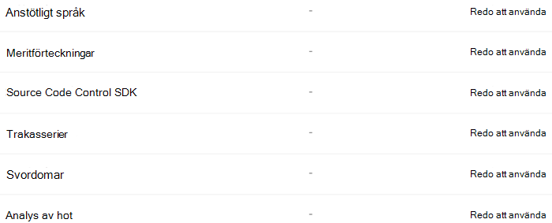
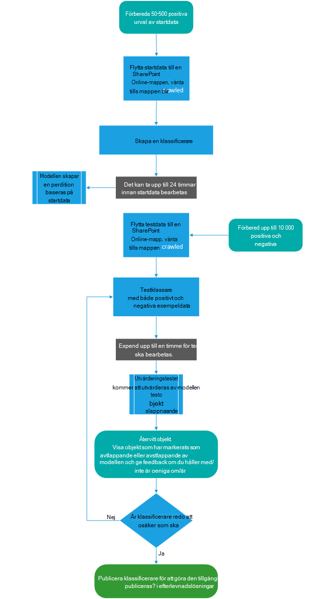
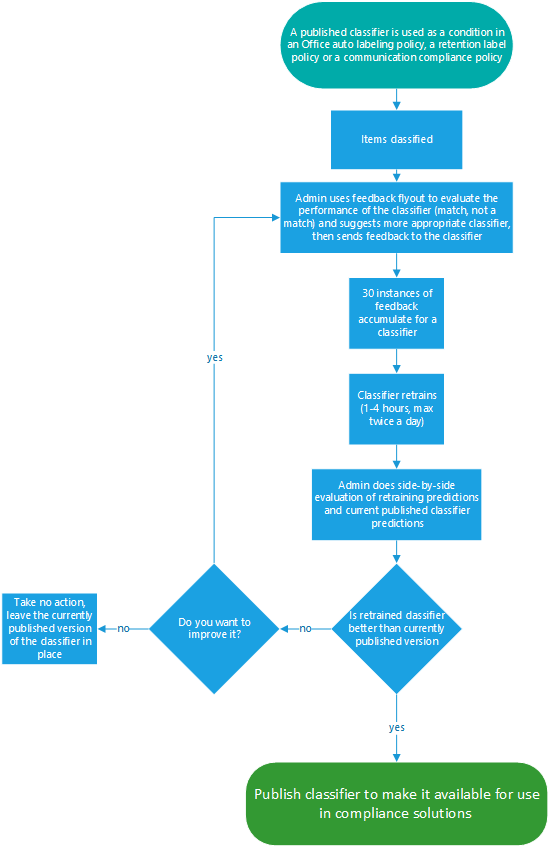

# Mer information om utbildningsbara klassificerareLearn about trainable classifiers

Att klassificera och märka innehåll så att det kan skyddas och hanteras korrekt är startpunkten för informationsskyddsgrenen.Classifying and labeling content so it can be protected and handled properly is the starting place for the information protection discipline. Microsoft 365 finns tre sätt att klassificera innehåll.Microsoft 365 has three ways to classify content.

## ManuelltManually

Den här metoden kräver en mänsklig bedömning och åtgärd.This method requires human judgment and action. En administratör kan antingen använda befintliga etiketter och typer av känslig information eller skapa egna och sedan publicera dem.An admin may either use the pre-existing labels and sensitive information types or create their own and then publish them. Användare och administratörer tillämpar dem på innehåll när de stöter på det.Users and admins apply them to content as they encounter it. Sedan kan du skydda innehållet och hantera dess disposition.You can then protect the content and manage its disposition.

## Automatiserad mönstermatchningAutomated pattern matching

Den här kategori av klassificeringsmetoder omfattar att söka efter innehåll genom:This category of classification mechanisms include finding content by:

- Nyckelord eller metadatavärden (frågespråk för nyckelord).Keywords or metadata values (keyword query language).
- Använda tidigare identifierade mönster för känslig information som personnummer, kreditkortsnummer och bankkontonummer (definitioner av [typ av känslig information).](sensitive-information-type-entity-definitions.md)Using previously identified patterns of sensitive information like social security, credit card or bank account numbers [(Sensitive information type entity definitions)](sensitive-information-type-entity-definitions.md).
- Känna igen ett objekt eftersom det är en variant på en mall [(fingerutskrift av dokument)](document-fingerprinting.md).Recognizing an item because it's a variation on a template [(document finger printing)](document-fingerprinting.md).
- Använda närvaro av exakta strängar [(exakta datamatchningar).](create-custom-sensitive-information-types-with-exact-data-match-based-classification.md)Using the presence of exact strings [(exact data match)](create-custom-sensitive-information-types-with-exact-data-match-based-classification.md).

Känslighets- och bevarandeetiketter kan sedan tillämpas automatiskt för att göra innehållet tillgängligt för användning i Läs mer om skydd mot [dataförlust](dlp-learn-about-dlp.md)) och tillämpa automatiskt [bevarandeprinciper för bevarandeetiketter.](apply-retention-labels-automatically.md)Sensitivity and retention labels can then be automatically applied to make the content available for use in [Learn about data loss prevention](dlp-learn-about-dlp.md)) and [auto-apply polices for retention labels](apply-retention-labels-automatically.md).

## KlassificerareClassifiers

Den här klassificeringsmetoden är särskilt väl lämpad för innehåll som inte lätt kan identifieras med de manuella eller automatiserade mönstermatchningsmetoderna.This classification method is particularly well suited to content that isn't easily identified by either the manual or automated pattern matching methods. Den här klassificeringsmetoden handlar mer om att utbilda en klassificerare att identifiera ett objekt baserat på vad objektet är, inte efter element som finns i objektet (mönstermatchning).This method of classification is more about training a classifier to identify an item based on what the item is, not by elements that are in the item (pattern matching). En klassificerare lär sig att identifiera en typ av innehåll genom att titta på hundratals exempel på innehåll som du är intresserad av att klassificera.A classifier learns how to identify a type of content by looking at hundreds of examples of the content you're interested in classifying. Du börjar med att mata in exempel som definitivt ligger i kategorin.You start by feeding it examples that are definitely in the category. När de har bearbetars testar du det genom att ge det en blandning av både matchande och icke-matchande exempel.Once it processes those, you test it by giving it a mix of both matching and non-matching examples. Klassificeraren gör sedan prognoser om huruvida ett visst objekt faller inom den kategori som du skapar.The classifier then makes predictions as to whether any given item falls into the category you're building. Sedan bekräftar du resultaten, sorterar sant positiva tal, sant negativa, falskt negativa och falskt negativa för att öka noggrannheten i dess prognoser.You then confirm its results, sorting out the true positives, true negatives, false positives, and false negatives to help increase the accuracy of its predictions. 

När du publicerar klassificeraren sorteras objekten på platser som SharePoint Online, Exchange och OneDrive, och klassificerar innehållet.When you publish the classifier, it sorts through items in locations like SharePoint Online, Exchange, and OneDrive, and classifies the content. När du har publicerat klassificeraren kan du fortsätta att utbilda den med hjälp av en feedbackprocess som liknar den första utbildningsprocessen.After you publish the classifier, you can continue to train it using a feedback process that is similar to the initial training process.

### Här kan du använda utbildande klassificerareWhere you can use trainable classifiers
Både inbyggda klassificerare och utbildare finns tillgängliga som ett villkor för [Office automatisk](apply-sensitivity-label-automatically.md)etiketter med känslighetsetiketter [,](apply-retention-labels-automatically.md#configuring-conditions-for-auto-apply-retention-labels) tillämpa bevarandeprincip automatiskt baserat på ett villkor och i [kommunikationsefterlevnad.](communication-compliance.md)Both built-in classifiers and trainable classifiers are available as a condition for [Office autolabeling with sensitivity labels](apply-sensitivity-label-automatically.md), [auto-apply retention label policy based on a condition](apply-retention-labels-automatically.md#configuring-conditions-for-auto-apply-retention-labels) and in [communication compliance](communication-compliance.md). 

Känslighetsetiketter kan använda klassificerare som villkor, se [Använda en känslighetsetikett på innehållet automatiskt.](apply-sensitivity-label-automatically.md)Sensitivity labels can use classifiers as conditions, see [Apply a sensitivity label to content automatically](apply-sensitivity-label-automatically.md).

> [!IMPORTANT]
> Klassificerare fungerar bara med objekt som inte är krypterade och är på engelska.Classifiers only work with items that are not encrypted and are in English.

## Typer av klassificerareTypes of classifiers

- **förskapade klassificerare** – Microsoft har skapat och i förväg utbildat ett antal klassificerare som du kan börja använda utan att ha utbildat dem.**pre-trained classifiers** - Microsoft has created and pre-trained a number of classifiers that you can start using without training them. De här klassificerarna visas med statusen `Ready to use` för .These classifiers will appear with the status of `Ready to use`.
- **Anpassade klassificerare** – Om du har klassificeringsbehov som omfattar mer än vad de i förväg utbildade klassificerarna omfattar kan du skapa och utbilda egna klassificerare.**custom classifiers** - If you have classification needs that extend beyond what the pre-trained classifiers cover, you can create and train your own classifiers.

### Förbaserade klassificerarePre-trained classifiers

Microsoft 365 levereras med fem försorterade klassificerare:Microsoft 365 comes with five pre-trained classifiers:

> [!CAUTION]
> Vi använder inte längre  den förinlärde klassificeraren för anstötligt språk eftersom det har ökat ett stort antal falska positiva resultat.We are deprecating the **Offensive Language** pre-trained classifier because it has been producing a high number of false positives. Använd den inte och om du använder den just nu bör du flytta bort dina affärsprocesser från den.Don't use it and if you are currently using it, you should move your business processes off of it. Vi rekommenderar att du i stället **använder** de förinpassade klassarna **Threat** , **Svoritet** och trakasserier.We recommend using the **Threat**, **Profanity**, and **Harassment** pre-trained classifiers instead.

- **Meritförteckningar:** identifierar objekt som är textbaserade konton för en sökandes personliga, utbildningsrelaterade, kvalifikationer, yrkeserfarenhet och annan personlig information**Resumes**: detects items that are textual accounts of an applicant's personal, educational, professional qualifications, work experience, and other personally identifying information
- **Källkod:** identifierar objekt som innehåller en uppsättning instruktioner och uttryck som skrivs på de 25 översta använda datorprogrammeringsspråken på GitHub**Source Code**: detects items that contain a set of instructions and statements written in the top 25 used computer programming languages on GitHub
    - ActionScriptActionScript
    - CC
    - C #C#
    - C++C++
    - ClojureClojure
    - CoffeeScriptCoffeeScript
    - Gå tillGo
    - HaskellHaskell
    - JavaJava
    - JavaScriptJavaScript
    - LuaLua
    - MATLABMATLAB
    - Objective-CObjective-C
    - PerlPerl
    - PHPPHP
    - PythonPython
    - RR
    - RubyRuby
    - ScalaScala
    - ShellShell
    - SwiftSwift
    - TexTex
    - Vim ScriptVim Script

> [!NOTE]
> Källkod används för att identifiera när större delen av texten är källkod.Source Code is trained to detect when the bulk of the text is source code. Den identifierar inte källkodstext som är översedd med oformaterad text.It does not detect source code text that is interspersed with plain text.

- **Trakasserier:** Upptäcker en specifik kategori med stötande språktextobjekt som är relaterade till stötande uppförande som är riktad mot en eller flera personer baserat på följande egenskaper: etnicitet, religion, nationella ursprung, kön, sexuell orientering, ålder, funktionshinder**Harassment**: detects a specific category of offensive language text items related to offensive conduct targeting one or multiple individuals based on the following traits: race, ethnicity, religion, national origin, gender, sexual orientation, age, disability
- **Svordomar:** identifierar en specifik kategori med stötande språktextobjekt som innehåller uttryck som är försämnande för de flesta**Profanity**: detects a specific category of offensive language text items that contain expressions that embarrass most people
- **Hot:** upptäcker en specifik kategori av anstötliga språktextobjekt som är relaterade till hot om våld eller att utföra fysisk skada eller skada en person eller egendom**Threat**: detects a specific category of offensive language text items related to threats to commit violence or do physical harm or damage to a person or property

De visas i **Microsoft 365 dataklassificeringsvyn** För utbildare  >    >   med statusen `Ready to use` .These appear in the **Microsoft 365 compliance center** > **Data classification** > **Trainable classifiers** view with the status of `Ready to use`.

> [!IMPORTANT]
> Observera att det stötande språket, trakasserier, svordomar och hotklassare endast fungerar med sökbar text inte är uttömmande eller fullständig.Please note that the offensive language, harassment, profanity, and threat classifiers only work with searchable text are not exhaustive or complete.  Ytterligare, språk och kulturstandarder ändras kontinuerligt, och mot bakgrund av dessa omotiv, förbehåller sig Microsoft rätten att uppdatera dessa klassificerare enligt eget gottfinnande.Further, language and cultural standards continually change, and in light of these realities, Microsoft reserves the right to update these classifiers in its discretion. Klassificerarna kan hjälpa organisationen att övervaka anstötligt och annat språk som används, men klassificerarna tar inte itu med konsekvenserna av ett sådant språk och är inte avsedda att ge din organisation enbart möjlighet att övervaka eller svara på användning av ett sådant språk.While the classifiers may assist your organization in monitoring offensive and other language used, the classifiers do not address consequences of such language and are not intended to provide your organization's sole means of monitoring or responding to the use of such language. Din organisation, och inte Microsoft eller dess dotterbolag, förblir ansvarig för alla beslut som rör övervakning, tillämpning, blockering, borttagning och lagring av innehåll som identifierats av en i förväg utbildad klassificerare.Your organization, and not Microsoft or its subsidiaries, remains responsible for all decisions related to monitoring, enforcement, blocking, removal and retention of any content identified by a pre-trained classifier.

### Anpassade klassificerareCustom classifiers

Om de i förväg utbildade klassificerarna inte uppfyller dina behov kan du skapa och utbilda dina egna klassificerare.When the pre-trained classifiers don't meet your needs, you can create and train your own classifiers. Det finns avsevärt mer arbete att skapa egna, men de kommer att bli mycket bättre skräddarsydda efter organisationens behov.There's significantly more work involved with creating your own, but they'll be much better tailored to your organizations needs. 

Du kan till exempel skapa utbildare för:For example you could create trainable classifiers for:
 
- Juridiska dokument – t.ex. juristklientbehörighet, avslutande uppsättningar, arbetsutdragLegal documents - such as attorney client privilege, closing sets, statement of work
- Strategiska affärsdokument – t.e. pressmeddelanden, sammanslagningar och förvärv, avtal, affärsplaner, immateriell egendom, patent, designdokumentStrategic business documents - like press releases, merger and acquisition, deals, business or marketing plans, intellectual property, patents, design docs
- Prisinformation – som fakturor, prisuppgifter, arbetsorder, dokument med hög prissättningPricing information - like invoices, price quotes, work orders, bidding documents 
- Ekonomisk information – till exempel investeringar i organisationen, kvartalsvisa eller årliga resultatFinancial information - such as organizational investments, quarterly or annual results    

#### Processflöde för att skapa anpassade klassificerareProcess flow for creating custom classifiers

Genom att skapa och publicera en klassificerare för användning i efterlevnadslösningar, till exempel kvarhållningsprinciper och kommunikations överanvändning, följer du det här flödet.Creating and publishing a classifier for use in compliance solutions, such as retention policies and communication supervision, follows this flow. Mer information om hur du skapar en egen utbildare finns i [Skapa en anpassad klassificerare](classifier-get-started-with.md).For more detail on creating a custom trainable classifier see, [Creating a custom classifier](classifier-get-started-with.md).

### Omklassning av klassificerareRetraining classifiers

Du kan förbättra noggrannheten för alla anpassade klassificerare och vissa i förväg utbildade klassificerare genom att ge dem feedback om hur korrekt klassificeringen de utför.You can help improve the accuracy of all custom classifiers and some pre-trained classifiers by providing them with feedback on the accuracy of the classification that they perform. Det kallas för att begränsa och följa det här arbetsflödet.This is called retraining and follow this workflow.

## Se ävenSee also

- [KvarhållningsetiketterRetention labels](retention.md)
- [Mer information om skydd mot dataförlustLearn about data loss prevention](dlp-learn-about-dlp.md)
- [KänslighetsetiketterSensitivity labels](sensitivity-labels.md)
- [Entitetsdefinitioner för typer av känslig informationSensitive information type entity definitions](sensitive-information-type-entity-definitions.md)
- [Dokumentutskrift med fingerDocument finger printing](document-fingerprinting.md)
- [Exakt datamatchningExact data match](create-custom-sensitive-information-types-with-exact-data-match-based-classification.md)
