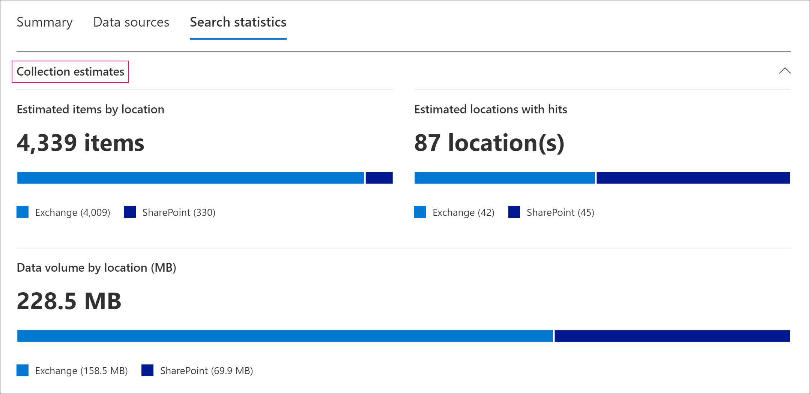
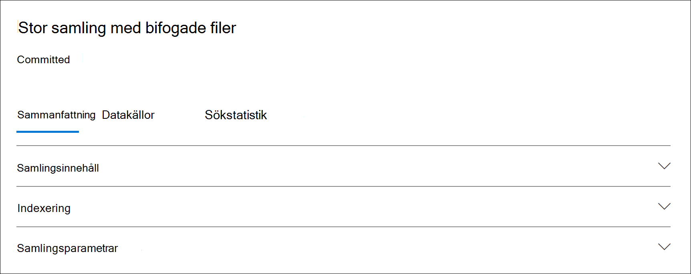

# Insamling av statistik och rapporter i Advanced eDiscovery

När du har skapat en utkastsamling kan du visa statistik för hämtade objekt, till exempel innehållsplatser som innehåller flest objekt som matchar sökvillkoren och antalet objekt som returneras av sökfrågan. Du kan också förhandsgranska en delmängd av resultaten.

När du har identifierat uppsättningen dokument som du vill undersöka ytterligare kan du lägga till sökresultatet i en granskningsuppsättning för att samla in och bearbeta.

## Statistik och rapporter för utkastsamlingar

I det här avsnittet beskrivs den statistik som är tillgänglig för utkastsamlingar. Statistiken finns på fliken **Sökstatistik på** den utfällsida som finns i ett utkast.

### Samlingsuppskattningar

I det här avsnittet visas en grafisk sammanfattning av de uppskattade objekt som returneras av samlingen. Här visas antalet objekt som matchar sökvillkoren för samlingen. Den här informationen ger dig en uppfattning om det uppskattade antalet objekt som returneras av samlingen.

- **Beräknade objekt efter platser**: Det totala antalet uppskattade objekt som returneras av samlingen. Det specifika antalet objekt i postlådor och på webbplatser visas också.

- **Uppskattade platser med träffar:** Det totala antalet innehållsplatser som innehåller objekt som returneras av samlingen. Det specifika antalet postlådor och webbplatser visas också.

- **Datavolym per plats (i MB)**: Den totala storleken för alla uppskattade objekt som returneras av samlingen. Den specifika storleken på postlådeobjekt och webbplatsobjekt visas också.

### Villkorsrapport

Det här avsnittet visar statistik om insamlingssökningsfrågan och antalet uppskattade objekt som matchade olika delar av sökfrågan. Du kan använda statistiken för att analysera antalet objekt som matchar varje komponent i sökfrågan. Det kan hjälpa dig att finjustera sökvillkoren för samlingen och vid behov begränsa samlingens omfattning.

- **Platstyp:** Den typ av innehållsplats som frågestatistiken gäller för. Värdet för en **Exchange** anger en postlådas plats. Värdet för en **SharePoint** anger en webbplatsplats.

- **Del**: Den del av sökfrågan som statistiken gäller för. **Primär** anger hela sökfrågan. **Nyckelord** anger att statistiken på raden är för ett visst nyckelord. Om du använder en nyckelordslista när det gäller sökfrågan i samlingen inkluderas statistik för varje komponent i frågan i den här tabellen.

- **Villkor:** Den faktiska komponenten (nyckelord eller villkor) i sökfrågan som körts för utkastsamlingen som returnerade statistiken som visas på motsvarande rad.

- **Platser med träffar:** Antalet innehållsplatser (anges av  kolumnen Platstyp) som innehåller objekt som matchar den primära frågan eller nyckelordsfrågan som visas i **kolumnen** Villkor.

- **Objekt:** Det antal objekt (från den angivna innehållsplatsen) som matchar frågan som visas i **kolumnen** Villkor. Som tidigare förklarats räknas ett objekt bara en gång i den här kolumnen om det innehåller flera förekomster av ett nyckelord som söks igenom.

- **Storlek (MB)**: Den totala storleken på alla objekt som hittades (på den angivna innehållsplatsen) som matchar sökfrågan i **kolumnen** Villkor.

### Mest populära platserna

I det här avsnittet visas statistik för specifika innehållsplatser med de flesta objekt som returneras av samlingen.

- Namnet på platsnamnet (postlådors e-postadress och webbplatsadressen).

- Platstyp (en postlåda eller webbplats).

- Beräknat antal objekt på innehållsplatsen som returneras av samlingen.

- Den totala storleken på uppskattade objekt på varje innehållsplats.

## Statistik och rapporter för engagerade samlingar

I det här avsnittet beskrivs den statistik som är tillgänglig när du har bekräftat en samling i en granskningsuppsättning, inklusive det faktiska antalet objekt som har lagts till i uppsättningen granska. Statistiken (förutom information om inläsningsuppsättningen) ger historisk information om innehåll som lagts till i ett ärende.

När du har sparat en samling i en granskningsuppsättning visas följande flikar på den utfällbar sida av den bekräftade anslutningen. Var och en av de här flikarna innehåller olika typer av information om samlingen.

### Samlingsinnehåll

Det här avsnittet på **fliken** Sammanfattning innehåller statistik och annan information om de objekt som har samlats in från datakällorna i samlingen och lagts till i granskningsuppsättningen.

- **Totalt extraherade objekt.** Det totala antalet objekt som lagts till i granskningsuppsättningen. Talet anger summan av överordnade objekt och underordnade objekt som lagts till i granskningsuppsättningen.

  > [!TIP]
  > Placera markören över de överordnade eller underordnade objektsfälten för att visa det totala antalet överordnade eller underordnade objekt.

- **Överordnade objekt.** Antalet objekt som returnerades av samlingen som användes för att samla in de objekt som har lagts till i granskningsuppsättningen. Det här antalet motsvarar (och är lika med) det uppskattade antalet objekt som visas i avsnittet **Samlingsparametrar.** Antalet överordnade objekt som han samlar in information som användes för att samla in de objekt som har lagts till i granskningsuppsättningen.
 
   Ett överordnat objekt kan innehålla flera underordnade objekt. Ett e-postmeddelande är till exempel ett överordnat objekt om det innehåller en bifogad fil eller har en molnbaserad bilaga. I det här fallet anses den bifogade filen eller målet för den molnbaserade bifogade filen vara underordnade objekt. När du sparar en samling läggs överordnade objekt och motsvarande underordnade objekt till i granskningsuppsättningen som enskilda objekt eller filer.

- **Underordnade objekt.** Antalet underordnade objekt som lagts till i granskningsuppsättningen. Underordnade objekt är bifogade filer eller andra delar av ett överordnat objekt. Underordnade objekt innehåller bifogade filer, molnbilagor, bilder och e-postsignaturer. När du sparar en samling i en granskningsuppsättning extraheras underordnade objekt, indexeras och läggs till i granskningsuppsättningen som enskilda filer.

- **Unika objekt.** Antalet unika objekt som lagts till i granskningsuppsättningen. Unika objekt är unika för granskningsuppsättningen. Alla objekt är unika när den första samlingen läggs till i en ny granskningsuppsättning eftersom det inte finns några tidigare objekt i granskningsuppsättningen.

- **Identifierade dubbletter av objekt.** Antalet objekt från samlingen som inte har lagts till i granskningsuppsättningen eftersom samma objekt redan finns i granskningsuppsättningen. Statistik om dubbletter kan hjälpa till att förklara skillnaderna mellan det uppskattade antalet objekt från en utkastsamling och det faktiska antalet objekt som lagts till i granskningsuppsättningen.

### Indexering

Avsnittet **Indexering** på fliken Sammanfattning **för en** kontrollerad granskningsuppsättning innehåller indexeringsinformation om de objekt som lagts till i granskningsuppsättningen.

**Nya indexerade objekt**. Antalet objekt som indexerats nyligen innan de lades till i granskningsuppsättningen. Ett exempel på ett nyligen indexerat objekt är underordnade objekt som extraheras från ett överordnat objekt och sedan indexeras innan de läggs till i granskningsuppsättningen. Objekt som inte finns i förfallna datakällor och platser för icke-infallande innehåll som visas på fliken **Datakällor** indexeras innan de läggs till i granskningen. Exempelvis skulle nya indexerade objekt innehålla objekt som samlats in från ytterligare platser.

**Uppdaterade indexerade objekt**. Antalet delvis indexerade objekt som har indexerats och lagts till i granskningsuppsättningen. Detta gjorde att objekt som delvis indexerats från platser för innehåll som inte är slutförda och som inte är slutförda visas på fliken **Datakällor** som indexerats när samlingen genomförts i granskningsuppsättningen.

**Indexeringsfel**. Antalet delvis indexerade objekt som inte kunde indexeras innan de lades till i granskningsuppsättningen. De här objekten kan kräva felåtgärder.

### Samlingsparametrar

I det här avsnittet visas den samlingsinformation som användes för att samla in de objekt som har lagts till i granskningsuppsättningen. På den här fliken visas information som liknar informationen på **fliken Sök efter** statistik. Det här avsnittet innehåller en snabb bild av sökfrågan som används av samlingen, de innehållsplatser som har sökts och det uppskattade samlingsresultatet. Som tidigare förklarats är det uppskattade antalet objekt i det här avsnittet lika med antalet överordnade objekt som visas i **avsnittet Samlingsinnehåll.**

### Fliken Sökstatistik

Den statistik som visas på **fliken Sök** statistik är samma statistik som den senaste gången en utkastsamling körts. Det här omfattar uppskattningar av samlingar, villkorsrapport och de främsta platserna. Den här informationen sparas från utkastsamlingen för historiska referenser och kan jämföras med den faktiska samlingen som har fastställts till granskningsuppsättningen.

## Skillnader mellan utkast till uppskattningar av samlingen och den faktiska föreslagna samlingen

När du kör en utkastsamling visas en uppskattning av antalet objekt (och deras totala  storlek)  som uppfyller samlingsvillkoren på fliken Sammanfattning och i avsnittet Samlingsuppskattningar på fliken **Sökstatistik.** När du har lagt till ett utkast till en granskningsuppsättning kommer det faktiska antalet objekt (och deras totala storlek) som lagts till ofta att skiljer sig från uppskattningarna. I de flesta fall läggs fler objekt till i granskningsuppsättningen än vad som beräknats från utkastsamlingen. I följande lista beskrivs de vanligaste orsakerna till dessa skillnader och tips för att identifiera dem:

- **Underordnade objekt.** Underordnade objekt som extraheras från deras överordnade objekt och läggs till som enskilda filer. Antalet underordnade objekt kan avsevärt öka antalet objekt som faktiskt läggs till i granskningsuppsättningen. I allmänhet bör antalet överordnade objekt  som identifieras  i avsnittet Samlingsinnehåll på fliken Sammanfattning för en beräknad samling vara lika med antalet uppskattade objekt från utkastsamlingen.

- **Duplicera objekt**. Objekt från utkastsamlingen som redan har lagts till i granskningsuppsättningen i en tidigare samling läggs inte till. Som tidigare förklarats visas antalet dubblettobjekt i samlingen i avsnittet **Samlingsinnehåll** på **fliken Sammanfattning.**

- **Konfigurationsalternativ för samling**. När du åtar dig att skapa ett utkast till en granskningsuppsättning måste du välja att inkludera konversationstrådar, molnbilagor och dokumentversioner. De här objekten som läggs till i granskningsuppsättningen ingår inte i uppskattningarna av utkastsamlingen. De identifieras och samlas bara in när du arkiverar samlingen. Om du väljer de här alternativen ökar troligen antalet objekt som läggs till i granskningsuppsättningen. 

    Till exempel tas inte SharePoint flera versioner av dokument i uppskattningen för utkastsamlingen. Men om du väljer alternativet att inkludera alla dokumentversioner när du exporterar sökresultatet ökar det faktiska antalet (och den totala storleken) för objekt som läggs till i granskningsuppsättningen. 

    Mer information om dessa alternativ finns i Spara [ett utkast till en granskningsuppsättning](commit-draft-collection.md#commit-a-draft-collection-to-a-review-set-in-advanced-ediscovery). 

Här är andra orsaker till varför det uppskattade resultatet från en utkastsamling kan vara annorlunda än de verkliga beräknade resultaten.

- **Hur resultat beräknas för utkastsamlingar**. En uppskattning av sökresultaten som returneras av en utkastsamling är just det, en uppskattning (och inte ett faktiskt antal) av de objekt som uppfyller villkoren för samlingsfrågan. För att sammanställa uppskattningen av e-postobjekt begärs en lista med meddelande-ID: er som uppfyller sökvillkoren i Exchange databas. Men när du har lagrat samlingen i en granskningsuppsättning kör samlingen igen och de faktiska meddelandena hämtas från Exchange databasen. Skillnaderna kan därför vara ett resultat av hur det uppskattade antalet objekt och det faktiska antalet objekt bestäms.

- **Ändringar som inträffar mellan tidpunkter när du uppskattar och åtar dig utkastsamlingar**. När du åtar dig att skapa ett utkast i en granskningsuppsättning kör du sökningen igen för att samla in de senaste objekten i sökindexet som uppfyller sökvillkoren. Det är möjligt att ytterligare objekt skapades, skickades eller togs bort som uppfyller sökvillkoren från det att utkastsamlingen körts senast och när utkastsamlingen har satts in i en granskningsuppsättning. Det är också möjligt att objekt som fanns i sökindexet när utkastsamlingsresultaten beräknades inte längre finns där eftersom de togs bort från en datakälla innan samlingen togs bort. Ett sätt att minimera det här problemet är att ange ett datumintervall för en samling. Ett annat sätt är att placera ett lager på innehållsplatser så att objekt bevaras och inte kan rensas.

- **Icke indexerade objekt.** Om utkastsamlingen inkluderade att söka i alla Exchange-postlådor eller alla SharePoint-webbplatser läggs bara icke indexerade objekt från innehållsplatser som innehåller objekt som uppfyller samlingsvillkoren till i granskningsuppsättningen. Med andra ord, om inga resultat hittas i en postlåda eller på en webbplats kommer icke indexerade objekt i postlådan eller webbplatsen inte att läggas till i granskningsuppsättningen. Icke indexerade objekt från alla innehållsplatser (även de som inte innehåller objekt som matchar samlingsfrågan) tas dock med i det uppskattade samlingsresultatet.

    Alternativt, om utkastsamlingen innehåller specifika innehållsplatser (vilket innebär att specifika postlådor eller webbplatser som anges på sidan Ytterligare platser i **utkastsamlingsguiden)** exporteras icke indexerade objekt (som inte utesluts av samlingsvillkoren) från innehållsplatserna som anges i sökningen. I det här fallet ska det uppskattade antalet icke indexerade objekt och antalet icke indexerade objekt som läggs till i granskningsuppsättningen vara detsamma.
