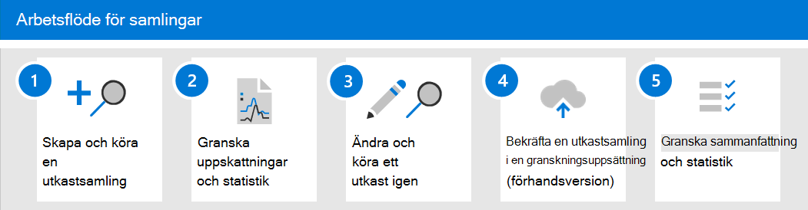

# Mer information om samlingar i Advanced eDiscovery

> [!NOTE]
> Vi distribuerar en ny upplevelse för samlingar i Advanced eDiscovery som beskrivs i den här artikeln. Den här utrullningen tar ett antal veckor innan den blir tillgänglig för alla organisationer. Om de nya samlingarna inte är tillgängligt i din organisation kan du fortfarande samla in ärendeinnehåll Advanced eDiscovery [sökverktyget.](create-search-to-collect-data.md)

När organisationer ställs inför en betydande utmaning när de ska samla in kommunikation och innehåll som kan vara relevant för en undersökning eller potentiella tvister, ställs de inför en betydande utmaning under de bästa omständigheterna. På dagens moderna arbetsplats möjliggör volym, variation och hastighet för innehåll innovation och distansarbete, samtidigt som kraven och processen för hantering av samlingar för eDiscovery-undersökningar utökas.

Samlingsarbetsflödet utgör betydande tekniska utmaningar när det gäller att extrahera innehåll från ursprungliga platser och källor. Det är också en viktig punkt i utvärderings- och strategi för vanliga rättstvister eller undersökningar. När organisationer börjar utvärdera en undersökning, är de första frågorna vilka som var inblandade? När de har identifierat vem som var inblandad kan de här biblioteken snabbt bli på plats för att bevara relevant innehåll. Nästa fråga är vad som ägde rum? För att kunna besvara den andra grundläggande frågan om en undersökning måste cheferna vända sig till data. För att snabbt bedöma det mest relevanta innehållet och frågan om vad som har skett börjar cheferna förfina målet för frågan för att säkerställa att samlingsresultaten är omfattande utan att vara för breda.

Samlingar i Advanced eDiscovery hjälper eDiscovery-hanterare att snabbt söka efter innehåll i e-post, dokument och annat innehåll i Microsoft 365. Samlingar ger hanterare en uppskattning av det innehåll som kan vara relevant för ärendet. På så sätt kan chefer fatta snabba, välgrundade beslut om storleken på och omfattningen av relevant innehåll för ett ärende. eDiscovery-hanterare kan skapa en samling för att söka i källor som kallas för sök (till exempel postlådor och SharePoint-webbplatser) och genom att använda specifika sökvillkor (till exempel nyckelord och datumintervall) för att snabbt definiera omfattningen av samlingen.

När samlingen har definierats kan eDiscovery-hanterare spara samlingen som ett utkast och få uppskattningar, inklusive uppskattningar av datavolym, innehållsplatser som innehåller resultat och antalet träffar för sökfrågevillkor. De här insikterna kan hjälpa dig att informera om samlingen bör revideras för att begränsa eller utöka samlingens omfattning innan du går vidare från gransknings- och analysstegen i eDiscovery-arbetsflödet.

När chefen är nöjd med samlingens omfattning och den uppskattade mängd innehåll som troligen  kommer att svara, kan chefen lägga till eller bekräfta innehållet i en granskningsuppsättning. När du väljer att använda en samling i en granskningsuppsättning har den chefen även alternativ för att inkludera chattkonversationer, molnbilagor och dokumentversioner. Innehållet i samlingen går också igenom en annan nivå av bearbetning vid ingestion i granskningsuppsättningen. och samlingen uppdateras med den slutliga sammanfattningen av samlingen. När innehåll har lagts till i granskningsuppsättningen kan eDiscovery-hanterare fortsätta att fråga, gruppera och förfina innehållet för att underlätta minimering och granskning. Samlingen uppdateras dessutom med information och statistik om det innehåll som har fastställts i uppsättningen. Det här är en historisk referens om innehållet i samlingen.

När samlingar släpps i ett Advanced eDiscovery  har fliken Sökningar bytt  namn till Samlingar i ett Advanced eDiscovery fall i Microsoft 365 efterlevnadscenter. Stegen för att definiera samlingens omfattning och storlek följer samma process som sökningen för att definiera platser och villkor. Spara som utkast och få uppskattningar av förhandsgranskningar möjliggör snabb validering av den riktade omfattningen av samlingar innan en fullständig sökning och samling sparas i granskningsuppsättningen. Detta möjliggör förbättrad hantering av jobb och riktade iterationer för att börja minimera innehåll under sök- och samlingsprocessen.

## Arbetsflöde för samlingar

Här är ett enkelt arbetsflöde och beskrivningar Advanced eDiscovery du vill komma igång med samlingar i Advanced eDiscovery som beskriver varje steg i processen.

1. **Skapa och kör en utkastsamling**. Det första steget är att skapa en utkastsamling och definiera de uppsövade och icke-uppsytliga datakällorna som ska sökas. Du kan också söka i andra datakällor som inte har lagts till i ärendet. När du har lagt till datakällorna konfigurerar du sökfrågan att söka i datakällorna efter relevant innehåll. Du kan använda nyckelord, egenskaper och villkor för att skapa sökfrågor som returnerar innehåll som troligen är mest relevant för ärendet. Mer information finns i Skapa [ett utkast till en samling](create-draft-collection.md).

2. **Granska uppskattningar och statistik.** När du har skapat en utkastsamling och kört den är nästa steg att visa samlingsstatistik som hjälper dig att kontrollera om relevant innehåll hittas och innehållsplatserna med flest träffar. Du kan också förhandsgranska ett urval av sökresultaten för att ytterligare hjälpa dig att avgöra om innehållet ligger inom undersökningens omfattning. Mer information finns i [Statistik och rapporter för utkastsamlingar](collection-statistics-reports.md#statistics-and-reports-for-draft-collections).

3. **Ändra och kör ett utkast igen.** Baserat på de uppskattningar och statistik som returneras av samlingen kan du redigera utkastsamlingen genom att ändra de datakällor som söks och sökfrågan för att utvidga eller begränsa samlingen. Du kan uppdatera och köra utkastsamlingen igen tills du är säker på att samlingen innehåller det innehåll som är mest relevant för ditt ärende.

4. **Spara ett utkast till en granskningsuppsättning**. När du är nöjd med att samlingen returnerar det relevanta typinnehållet kan du bekräfta samlingen i granskningsuppsättningen. När du åtar dig en samling kan du lägga till konversationstrådar, molnbilagor och dokumentversioner i granskningsuppsättningen, vilket kan vara relevant för ärendet. Följande saker händer när du åtar dig en samling:

   - Underordnade objekt (t.ex. e-postbilagor, e-postsignaturer och bilder) extraheras från ett överordnat objekt (t.ex. ett e-postmeddelande, ett chattmeddelande eller ett dokument), indexeras (i en process som kallas djupindexering) och läggs till i granskningsuppsättningen som separata filer.

   - Djupindexering utförs på objekt som samlats in från ytterligare datakällor. Dessa typer av datakällor är andra innehållsplatser än de förfallna och icke-förfallna datakällor som tidigare lagts till i ärendet.

   Mer information finns i Spara [ett utkast till en granskningsuppsättning.](commit-draft-collection.md)

5. **Granska sammanfattning av samling och statistik**. När du sparar en samling i en granskningsuppsättning sparas information om samlingen, till exempel statistik om extraherade objekt, djupindexering, sökfrågan som används för samlingen och innehållsplatser som objekten samlades in från. Det går inte heller att redigera eller köra samlingar igen. Du kan bara kopiera eller ta bort dem. Att bevara samlingar är en historisk post för de insamlade objekten som har lagts till i en granskningsuppsättning. Mer information finns i [Statistik och rapporter för engagerade samlingar.](collection-statistics-reports.md#statistics-and-reports-for-committed-collections)
