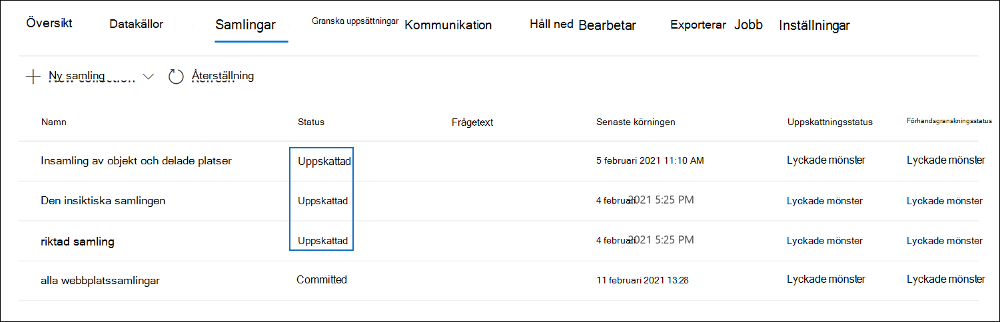

# Spara ett utkast till en granskningsuppsättning i Advanced eDiscovery

När du är nöjd med de objekt du har samlat in i en utkastsamling och är redo att analysera, tagga och granska dem kan du lägga till en samling i en granskningsuppsättning i ärendet. När du åtar dig att skapa ett utkast i en granskningsuppsättning kopieras insamlade objekt från den ursprungliga innehållsplatsen i Microsoft 365 till en granskningsuppsättning. En granskningsuppsättning är en säker, Microsoft-Azure Storage plats i Microsoft-molnet.

## Spara en utkastsamling till en granskningsuppsättning 

1. I Microsoft 365 Efterlevnadscenter öppnar du Advanced eDiscovery och väljer sedan fliken Samlingar  för att visa en lista med de aktuella samlingarna.

   

   > [!TIP]
   > Värdet i `Estimated` kolumnen Status **anger** vilka utkastsamlingar som kan läggas till i en granskningsuppsättning. En status för `Committed` anger att en samling redan har lagts till i en granskningsuppsättning.

2. På sidan **Samlingar** väljer du den utkastsamling som du vill spara i en granskningsuppsättning.

3. Längst ned på den utfällade sidan väljer du **Åtgärder**  >  **Redigera samling**.

4. I guiden för redigeringssamling klickar du **på Nästa** **tills sidan Spara utkast eller samla** in visas.

5. Konfigurera följande inställningar:

   1. Välj **Samla in objekt och lägg till i granskningsuppsättningen**.

   2. Bestäm om du vill lägga till samlingen i en ny granskningsuppsättning (som skapas efter att du har skickat in samlingen) eller lägga till den i en befintlig granskningsuppsättning. Fyll i det här avsnittet baserat på ditt beslut.

   3. Konfigurera ytterligare inställningar för samlingen:

       - **Teams och Yammer** meddelanden : Välj det här alternativet om du vill lägga till konversationstrådar i samlingen som innehåller de chattobjekt som returneras av sökfrågan i samlingen. Det innebär att chattkonversationen som innehåller objekt som matchar sökkriterierna återskapas. På så sätt kan du granska chattobjekt i samband med konversationen fram och tillbaka. Mer information finns i [Konversationstrådning i Advanced eDiscovery](conversation-review-sets.md).

       - **Molnbilagor:** Välj det här alternativet om du vill inkludera moderna bifogade filer eller länkade filer när samlingsresultatet läggs till i granskningsuppsättningen. Det innebär att målfilen för en modern bifogad fil eller länkad fil läggs till i granskningsuppsättningen.

       - **SharePoint versioner:** Välj det här alternativet om du vill aktivera samlingen av alla versioner av ett SharePoint-dokument enligt versionsbegränsningarna och sökparametrar för samlingen. Om du väljer det här alternativet ökar storleken på objekt som läggs till i granskningsuppsättningen avsevärt.

   4. Konfigurera inställningarna för att definiera skalan för samlingen som ska läggas till i granskningsuppsättningen:

      - **Lägg till alla samlingsresultat:** Välj det här alternativet om du vill lägga till alla objekt som matchar sökvillkoren för samlingen i granskningsuppsättningen.

      - **Lägg till ett urval av samlingsresultatet:** Välj det här alternativet om du vill lägga till ett urval av samlingsresultatet i granskningsuppsättningen i stället för att lägga till alla resultat. Om du väljer det här alternativet klickar **du på Redigera exempelparametrar** och väljer något av följande alternativ:

         - **Exempel baserat på konfidens:** Objekt från samlingen läggs till i granskningsuppsättningen bestäms av de statistiska parametrar som du anger. Om du normalt använder en konfidensnivå och intervall när samplingsresultat, anger du dem i listrutorna. I annat fall använder du standardinställningarna.

         - **Slumpmässigt exempel:** Objekt från samlingen läggs till i granskningsuppsättningen baserat på ett slumpmässigt urval av det angivna procenttalet av det totala antalet objekt som returneras av sökningen.

6. På sidan **Granska din** samling kan du granska inställningarna för samlingen som du konfigurerade på föregående sida. Klicka **på** Redigera om du vill ändra dem.

7. Klicka **på Skicka** för att skapa utkastsamlingen. En sida visas som bekräftar att samlingen har skapats.

## Vad händer efter att du har bekräftat ett utkast

När du åtar dig att skapa ett utkast i en granskningsuppsättning sker följande:

- Om du har skapat en ny granskningsuppsättning som den ska bekräfta så skapas uppsättningen och visas på fliken Granska **uppsättningar** för ärendet. Statusen för den nya granskningsuppsättningen är **Klar**. Det här statusvärdet innebär att granskningsuppsättningen har skapats. Det innebär inte att samlingen har lagts till i granskningsuppsättningen. Status för att lägga till objekt i samlingen i granskningsuppsättningen visas på **fliken** Samlingar.

- Sökfrågan för samlingen körs igen. Det innebär att de verkliga sökresultaten som kopierats till granskningsuppsättningen kan vara annorlunda än de uppskattade resultat som returnerades när samlingssökningen senast körts.

- Alla objekt i sökresultatet kopieras från den ursprungliga datakällan i livetjänsten och kopieras till en säker Azure Storage i Microsoft-molnet.

- Alla objekt (inklusive innehåll och metadata) som inte finns i icke-läsbara datakällor indexeras om (i en process som kallas *djupindexering)* så att alla data i granskningsuppsättningen är fullt sökbara vid granskning av ärendedata. Om du indexerar om innehållet i en samling görs en genomgående och snabb sökning när du söker efter eller filtrerar innehållet i den granskning som angetts under ärendets undersökning.

- Krypterade SharePoint och OneDrive-dokument samt krypterade bifogade filer e-postmeddelanden som returneras i sökresultaten dekrypteras när du sparar samlingen i en granskningsuppsättning. Du kan granska och köra frågor för de dekrypterade filerna i granskningsuppsättningen. Mer information finns i [Dekryptering i eDiscovery Microsoft 365 och eDiscovery-verktyg](ediscovery-decryption.md).

- Optisk teckenigenkänning (OCR) extraherar text från bilder och inkluderar bildtexten med det innehåll som har lagts till i en granskningsuppsättning. Mer information finns i avsnittet optisk [teckenläsning](#optical-character-recognition) i den här artikeln.

- När bekräfta har slutförts ändras värdet i statuskolumnen på **fliken Samlingar** till `Committed` .

## Optisk teckenläsning

När du åtar dig en samling i en granskningsuppsättning extraheras text från bilder automatiskt med optisk teckenläsning (OCR) i Advanced eDiscovery och bildtexten med det innehåll som läggs till i en granskningsuppsättning. Du kan visa den extraherade texten i textvisningsprogrammet för den valda bildfilen i granskningsuppsättningen. På så sätt kan du göra ytterligare granskning och analys av text i bilder. OCR stöds för lösa filer, e-postbilagor och inbäddade bilder. En lista över filformat som stöds för OCR finns i Filformat [som stöds i Advanced eDiscovery.](supported-filetypes-ediscovery20.md#image)

Du måste aktivera OCR-funktioner för varje ärende som du skapar i Advanced eDiscovery. Mer information finns i Konfigurera [sök- och analysinställningar.](configure-search-and-analytics-settings-in-advanced-ediscovery.md#optical-character-recognition-ocr)
