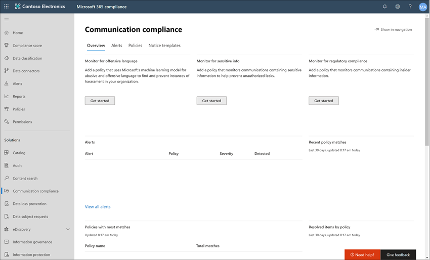
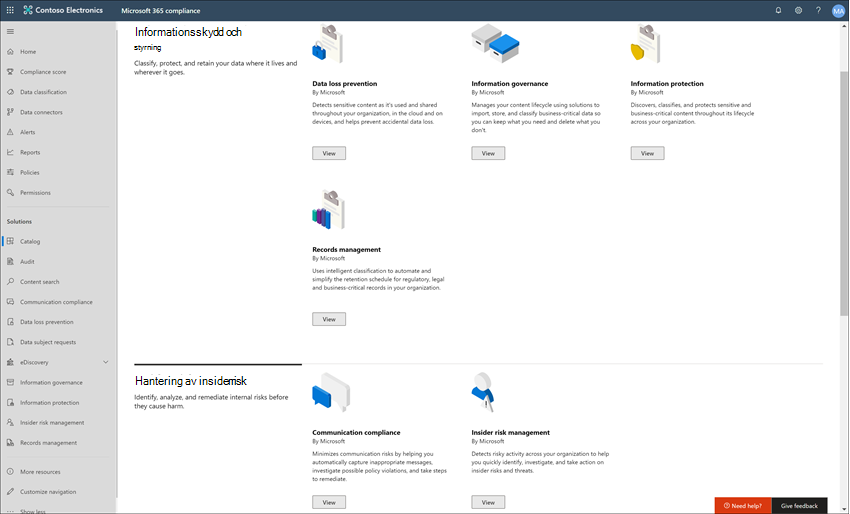
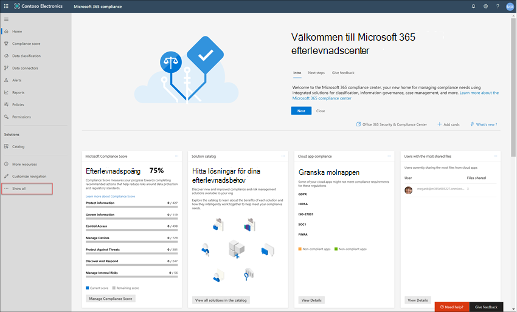
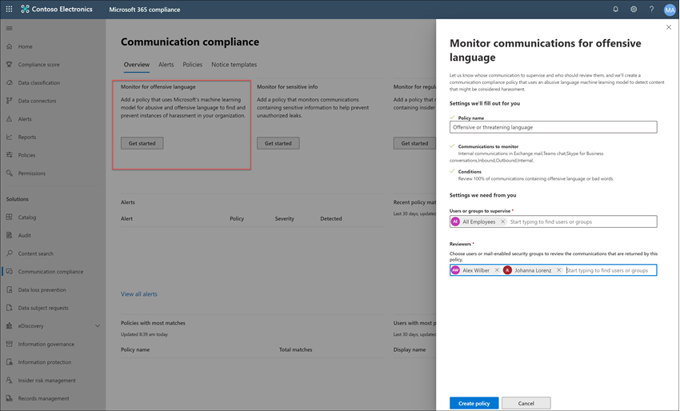

# Fallstudie – Contoso konfigurerar snabbt en anstötlig språkprincip för Microsoft Teams, Exchange och Yammer kommunikationer

Kommunikationsefterlevnad i Microsoft 365 hjälper till att minimera kommunikationsrisker genom att hjälpa dig att upptäcka, fånga in och agera på olämpliga meddelanden i organisationen. Med fördefinierade och anpassade principer kan du söka igenom intern och extern kommunikation efter principmatchningar så att de kan behandlas som nya granskare. Granskare kan undersöka skannad e-post, Microsoft Teams, Yammer eller kommunikation från tredje part i organisationen och vidta lämpliga åtgärder för att säkerställa att de följer organisationens meddelandestandarder.

Contoso Corporation är en fiktiv organisation som snabbt behöver konfigurera en princip för att övervaka anstötliga språk. De har främst använt Microsoft 365 e-post, Microsoft Teams och Yammer stöd för användarna, men har nya krav för att upprätthålla företagets policy kring arbetsplatsar beskr. Contoso IT-administratörer och efterlevnadsspecialister har en grundläggande förståelse av grunderna för att arbeta med Microsoft 365 och söker efter punkt till punkt-vägledning för hur du snabbt kommer igång med kommunikationsefterlevnad.

Den här fallstudien kommer att undersöka grunderna för att snabbt konfigurera en princip för kommunikationsefterlevnad för att övervaka kommunikation för anstötligt språk. Den här vägledningen omfattar:

- Steg 1 – Planera för kommunikationsefterlevnad
- Steg 2 – Komma åt kommunikationsefterlevnad i Microsoft 365
- Steg 3 – Konfigurera förutsättningar och skapa en princip för kommunikationsefterlevnad
- Steg 4 - Undersökning och åtgärd av aviseringar

## Steg 1: Planera för kommunikationsefterlevnad

Contoso IT-administratörer och efterlevnadsspecialister deltog i webbstuljningar om efterlevnadslösningar i Microsoft 365 och beslutade att policyer för kommunikationsefterlevnad kommer att hjälpa dem att uppfylla de uppdaterade företagsprincipkraven för att minska arbetsplatsens trakasserier. Genom att arbeta tillsammans har de utvecklat en plan för att skapa och möjliggöra en policy för kommunikationsefterlevnad som övervakar anstötligt språk för chattar som skickas i Microsoft Teams, privata meddelanden och community-konversationer i Yammer och i e-postmeddelanden som skickas i Exchange Online. Planen omfattar identifiering av:

- IT-administratörer som behöver åtkomst till funktioner för kommunikationsefterlevnad.
- Efterlevnadsspecialisterna som behöver skapa och hantera kommunikationsprinciper.
- De efterlevnadsspecialister och andra kollegor på andra avdelningar (Human Resources, Legal osv.) som behöver undersöka och åtgärda aviseringar om kommunikationsefterlevnad.
- De användare som kommer att omfattas av anstötlig språkprincip för kommunikationsefterlevnad.

### Licensiering

Det första steget är att bekräfta att Contosos licens för Microsoft 365 kommunikation innehåller stöd för lösningen för kommunikationsefterlevnad. För att komma åt och använda kommunikationsefterlevnad måste Contoso IT-administratörer verifiera att Contoso har något av följande:

- Microsoft 365 E5 prenumeration (betald version eller utvärderingsversion)
- Microsoft 365 E3-prenumeration + Microsoft 365 E5 Compliance-tillägget
- Microsoft 365 E3 -prenumerationen + Microsoft 365 E5-tillägget Insider Risk Management
- Microsoft 365 A5 prenumeration (betald version eller utvärderingsversion)
- Microsoft 365 A3 prenumeration + Microsoft 365 A5 tillägget efterlevnad
- Microsoft 365 A3 -prenumerationen + Microsoft 365 A5-tillägget Insider riskhantering
- Microsoft 365 G5-prenumeration (betald eller utvärderingsversion)
- Microsoft 365 G5-prenumeration + Microsoft 365 G5-tillägget för efterlevnad
- Microsoft 365 G5-prenumeration + Microsoft 365 G5 Insider Risk Management-tillägget
- Office 365 Enterprise E5-prenumeration (betald eller utvärderingsversion)
- Office 365 Enterprise E3-prenumeration + Office 365 Advanced Compliance-tillägget (inte längre tillgängligt för nya prenumerationer, se anteckningen)

De måste också bekräfta att användare som ingår i principer för kommunikationsefterlevnad måste tilldelas en av licenserna ovan.

> [!IMPORTANT]
> Office 365 Advanced Compliance säljs inte längre som en fristående prenumeration. När aktuella prenumerationer går ut bör kunderna gå över till en av prenumerationerna ovan, som innehåller samma eller ytterligare efterlevnadsfunktioner.

Contoso IT-administratörer kontrollerar licenssupporten för Contoso på följande sätt:

1. IT-administratörer loggar in på **Administrationscenter för Microsoft 365** <https://admin.microsoft.com> och navigerar till **Administrationscenter för Microsoft 365**  >  **faktureringslicenser.**  >  

2. Här bekräftar de att de har ett av [licensalternativen som](communication-compliance-configure.md#subscriptions-and-licensing) inkluderar stöd för kommunikationsefterlevnad.

### Behörigheter för kommunikationsefterlevnad

Det finns fem rollgrupper som används för att konfigurera behörigheter för att hantera funktioner för kommunikationsefterlevnad. För att **göra Kommunikationsefterlevnad** tillgängligt som ett menyalternativ i Microsoft 365 Efterlevnadscenter och för att fortsätta med de här konfigurationsstegen, tilldelas Contoso-administratörer rollen *Kommunikationsefterlevnadsadministratör.*

Contoso bestämmer sig  för att använda rollgruppen Kommunikationsefterlevnad som tilldelar alla administratörer för kommunikationsefterlevnad, analytiker, licenser och läsare till gruppen. Det gör det enklare för Contoso att komma igång snabbt och passar bäst för krav på efterlevnadshantering.

|**Roll**|**Rollbehörigheter**|
|:-----|:-----|
| **Efterlevnad av kommunikation** | Använd den här rollgruppen för att hantera kommunikationsefterlevnad för organisationen i en enda grupp. Genom att lägga till alla användarkonton för angivna administratörer, analytiker, slutanvändare och läsare kan du konfigurera behörigheter för kommunikationsefterlevnad i en enda grupp. Den här rollgruppen innehåller alla behörighetsroller för kommunikationsefterlevnad. Den här konfigurationen är det enklaste sättet att snabbt komma igång med kommunikationsefterlevnad och är en god passform för organisationer som inte behöver separata behörigheter som definierats för olika användargrupper. |
| **Admin för kommunikationsefterlevnad** | Använd den här rollgruppen till att först konfigurera kommunikationsefterlevnad och senare för att avgränsa administratörer för kommunikationsefterlevnad i en definierad grupp. Användare som tilldelats den här rollgruppen kan skapa, läsa, uppdatera och ta bort principer för kommunikationsefterlevnad, globala inställningar och tilldelningar av rollgrupper. Användare som tilldelats den här rollgruppen kan inte visa meddelandeaviseringar. |
| **Analytiker för kommunikationsefterlevnad** | Använd den här gruppen för att tilldela behörigheter till användare som fungerar som kommunikationsefterlevnadsanalytiker. Användare som har tilldelats den här rollgruppen kan visa principer där de har tilldelats som granskare, visa metadata för meddelanden (inte meddelandeinnehåll), eskalera till ytterligare granskare eller skicka meddelanden till användare. Analytiker kan inte lösa väntande aviseringar. |
| **Communication Compliance Investigator** | Använd den här gruppen för att tilldela behörigheter till användare som ska agera som kommunikationsefterlevnad. Användare som har tilldelats den här rollgruppen kan visa metadata och innehåll för meddelanden, eskalera till ytterligare granskare, eskalera till ett Advanced eDiscovery-ärende, skicka meddelanden till användare och lösa aviseringen. |
| **Visningsprogram för kommunikationsefterlevnad** | Använd den här gruppen för att tilldela behörigheter till användare som hanterar kommunikationsrapporter. Användare som har tilldelats den här rollgruppen har åtkomst till alla rapportwidgetar på kommunikationsefterlevnadens startsida och kan visa alla rapporter om kommunikationsefterlevnad. |

1. Contoso IT-administratörer loggar in på behörighetssidan för **Office 365 & Säkerhets-** och efterlevnadscenter [(med https://compliance.microsoft.com/permissions)](https://compliance.microsoft.com/permissions) autentiseringsuppgifter för ett globalt administratörskonto och väljer länken för att visa och hantera roller i Microsoft 365.
2. I **Säkerhets- & efterlevnadscenter** går  de till Behörigheter och väljer länken för att visa och hantera roller i Office 365.
3. Administratörerna väljer *rollgruppen Kommunikationsefterlevnad* och sedan **Redigera rollgrupp**.
4. Administratörerna väljer **Välj medlemmar** i det vänstra navigeringsfönstret och sedan **Redigera**.
5. De väljer **Lägg** till och markerar sedan kryssrutan för alla Contoso-användare som hanterar kommunikationsefterlevnad, undersöker och granskar aviseringar.
6. Administratörerna väljer **Lägg** till och sedan **Klar**.
7. De väljer **Spara för** att lägga till Contoso-användare i rollgruppen. De väljer **Stäng** för att slutföra stegen.

## Steg 2: Åtkomst till kommunikationsefterlevnad i Microsoft 365

När contoso IT-administratörer och efterlevnadsspecialister har konfigurerat behörigheterna för kommunikationsefterlevnad, kan de få åtkomst till kommunikationsefterlevnadslösningen i Microsoft 365. Contoso IT-administratörer och efterlevnadsspecialister har flera olika sätt att komma åt kommunikationsefterlevnad och komma igång med att skapa en ny princip:

- Börja direkt från lösningen för kommunikationsefterlevnad
- Startar från Microsoft 365 Efterlevnadscenter
- Från och med Microsoft 365-lösningskatalogen
- Startar från Administrationscenter för Microsoft 365

### Börja direkt från lösningen för kommunikationsefterlevnad

Det snabbaste sättet att komma åt lösningen är att logga in direkt till **lösningen för kommunikationsefterlevnad** <https://compliance.microsoft.com/supervisoryreview> (). Med den här länken dirigeras Contosos IT-administratörer och efterlevnadsspecialister till instrumentpanelen för översikt över kommunikation där du snabbt kan granska status för aviseringar och skapa nya principer från de fördefinierade mallarna.

### Startar från Microsoft 365 Efterlevnadscenter

Ett annat enkelt sätt för Contosos IT-administratörer och efterlevnadsspecialister att få åtkomst till kommunikationsefterlevnadslösningen är att logga in direkt till **Microsoft 365 Efterlevnadscenter** [( https://compliance.microsoft.com)](https://compliance.microsoft.com). När du har loggat in behöver användarna välja Visa **all** kontroll för att visa alla efterlevnadslösningar och sedan välja lösningen för **kommunikationsefterlevnad** för att komma igång.

### Från och med Microsoft 365-lösningskatalogen

Contoso IT-administratörer och efterlevnadsspecialister kan också välja att få åtkomst till lösningen för kommunikationsefterlevnad genom att välja Microsoft 365 lösningslösningskatalogen. Genom att **välja Katalog** **i** avsnittet Lösningar i det vänstra **navigeringsfältet i Microsoft 365 Efterlevnadscenter** kan de öppna lösningskatalogen med alla Microsoft 365 efterlevnadslösningar. Contoso **IT-administratörer kan välja** Kommunikationsefterlevnad för att komma igång genom att rulla ned till avsnittet för Insider-riskhantering. Contoso-IT-administratörer bestämmer sig också för att använda kontrollen Visa i navigering för att fästa lösningen för kommunikationsefterlevnad i det vänstra navigeringsfönstret för snabbare åtkomst när de loggar in i framtiden.

### Startar från Administrationscenter för Microsoft 365

För att komma åt kommunikationsefterlevnad när contoso IT-administratörer och efterlevnadsspecialister börjar på Administrationscenter för Microsoft 365 loggar Contoso IT-administratörer och efterlevnadsspecialister in på Administrationscenter för Microsoft 365 [ https://admin.microsoft.com) (](https://admin.microsoft.com) och navigerar till **Administrationscenter för Microsoft 365**  >  **efterlevnad.**

Med den här **åtgärden Office 365** säkerhets- och efterlevnadscentret, och de måste välja länken till Microsoft 365 Efterlevnadscenter som finns i **banderollen** högst upp på sidan.

I listan **Microsoft 365 Efterlevnadscenter**, Contoso IT-administratörer, väljer du **Visa alla** för att visa en fullständig lista över efterlevnadslösningar.

När **contoso** IT-administratörer har valt Visa alla kan de komma åt lösningen för kommunikationsefterlevnad.

## Steg 3: Konfigurera förutsättningar och skapa en princip för kommunikationsefterlevnad

För att komma igång med en policy för kommunikationsefterlevnad finns det flera förutsättningar som Contoso IT-administratörer måste konfigurera innan den nya principen konfigureras för att övervaka anstötliga språk. När dessa förutsättningar har slutförts kan Contoso IT-administratörer och efterlevnadsspecialister konfigurera de nya specialister på policy och efterlevnad kan påbörja undersökning och åtgärda alla genererade varningar.

### Aktivera granskning i Microsoft 365

För kommunikationsefterlevnad krävs granskningsloggar för att visa aviseringar och spåra åtgärder som granskarna har vidtagit. Granskningsloggarna är en sammanfattning av alla aktiviteter som är associerade med en definierad organisationsprincip eller när det finns en ändring i en policy för kommunikationsefterlevnad.

Contoso IT-administratörer granskar och [följer de stegvisa instruktionerna för](turn-audit-log-search-on-or-off.md) att aktivera granskning. När granskning har aktiverars visas ett meddelande om att granskningsloggen förbereds och att de kan köra en sökning om några timmar efter att förberedelserna har slutförts. Contosos IT-administratörer behöver bara göra den här åtgärden en gång.

### Konfigurera Yammer klientorganisation för inbyggt läge

För kommunikationsefterlevnad krävs att Yammer organisationens klientorganisation är i inbyggt läge för att övervaka anstötligt språk i privata meddelanden och offentliga community-konversationer.

Contoso IT-administratörer kontrollerar att de granskar informationen i översikten över [Yammer Native Mode](/yammer/configure-your-yammer-network/overview-native-mode) i Microsoft 365-artikeln och följer anvisningarna för att köra migreringsverktyget i artikeln Konfigurera Yammer-nätverket för enhetligt [läge för Microsoft 365.](/yammer/configure-your-yammer-network/native-mode)

### Konfigurera en grupp för användare inom omfattningen

Contosos efterlevnadsspecialister vill lägga till alla användare i kommunikationsprincipen som ska övervaka för anstötliga språk. De kan bestämma sig för att lägga till varje användarkonto i principen separat, men  de har kommit fram till att det är mycket enklare och sparar tid att använda distributionsgruppen Alla användare för användarna för den här principen.

De måste skapa en ny grupp för att ta med alla Contoso-användare, så de gör följande:

1. Contoso IT-administratörer IT-administratörer loggar in **på Administrationscenter för Microsoft 365** [ https://admin.microsoft.com) (](https://admin.microsoft.com) och navigerar till **Administrationscenter för Microsoft 365**  >  **Groups**  >  **Groups**.
2. De väljer **Lägg till en grupp** och slutför guiden för att skapa en Microsoft 365 *grupp* eller *distributionsgrupp.*

    

3. När den nya gruppen har skapats måste de lägga till alla Contoso-användare i den nya gruppen. De öppnar Exchange **(och** [navigerar https://outlook.office365.com/ecp)](https://outlook.office365.com/ecp) till mottagarna i **Exchange**  >    >  **administrationscentret.** Contoso-IT-administratörerna väljer området  Medlemskap och den nya  gruppen Alla anställda som de har skapat. Välj sedan redigeringskontrollen för att lägga till alla Contoso-användare i den nya gruppen i guiden.

    

### Skapa principen för att övervaka anstötligt språk

När alla krav har slutförts är IT-administratörerna och efterlevnadsspecialisterna för Contoso redo att konfigurera principen för kommunikationsefterlevnad för att övervaka för anstötligt språk. Med den nya stötande språkprincipmallen är det enkelt och snabbt att konfigurera den här principen.

1. Contosos IT-administratörer och efterlevnadsspecialister loggar in **i Microsoft 365 Efterlevnadscenter** och väljer **Kommunikationsefterlevnad** i det vänstra navigeringsfönstret. Med den här åtgärden öppnas **instrumentpanelen** Översikt som har snabblänkar för policymallar för kommunikationsefterlevnad. De väljer mallen **Övervaka för anstötligt** språk genom att **välja Kom igång** för mallen.

    

2. I guiden för principmall arbetar Contosos IT-administratörer och efterlevnadsspecialister tillsammans för att slutföra de tre obligatoriska fälten: **Principnamn,** Användare eller grupper som ska övervakas och **Granskare.**
3. Eftersom principguiden redan har föreslagit ett namn för principen bestämmer IT-administratörerna och efterlevnadsspecialisterna att behålla det föreslagna namnet och fokusera på de återstående fälten. De väljer gruppen Alla  *användare* i gruppen Användare eller grupper som ska övervaka fältet och väljer de efterlevnadsspecialister som ska undersöka och åtgärda principvarningar för **fältet** Granskare. Det sista steget för att konfigurera principen och börja samla in aviseringsinformation är att välja **Skapa princip.**

    

## Steg 4: Undersöka och åtgärda aviseringar

Nu när kommunikationsefterlevnadsprincipen för att övervaka anstötligt språk har konfigurerats blir nästa steg för Contosos efterlevnadsspecialister att undersöka och åtgärda eventuella varningar som genereras av principen. Det tar upp till 24 timmar innan principen har bearbetats helt i alla kommunikationskällkanaler och aviseringar visas i **instrumentpanelen för aviseringar.**

När aviseringar har skapats följer Contosos efterlevnadsspecialister arbetsflödesanvisningarna för att undersöka och åtgärda stötande språkproblem. 