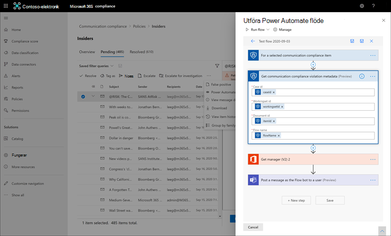
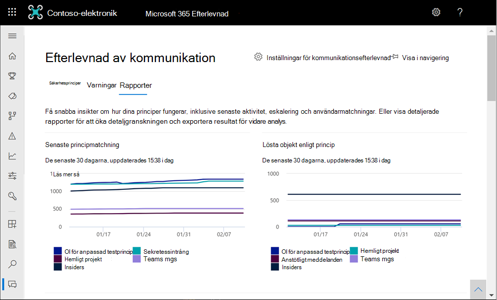

# <a name="communication-compliance-feature-reference"></a>Referens för funktioner för kommunikationsefterlevnad

## <a name="policies"></a>Principer

>[!Important]
>Det går inte att använda PowerShell för att skapa och hantera principer för kommunikationsefterlevnad. Om du vill skapa och hantera de här principerna måste du använda principhanteringskontrollerna [i Microsoft 365 för kommunikationsefterlevnad.](https://compliance.microsoft.com/supervisoryreview)

Du skapar principer för kommunikationsefterlevnad för Microsoft 365 organisationer i Microsoft 365 efterlevnadscenter. Principer för kommunikationsefterlevnad definierar vilken kommunikation och vilka användare som granskas i organisationen, definierar vilka anpassade villkor som måste uppfyllas av kommunikationen och anger vilka som ska granskas. Användare som *har* tilldelats rollen Administratör för kommunikation och efterlevnad kan  konfigurera principer, och alla som har den här rollen tilldelad kan komma åt sidan för kommunikationsefterlevnad och globala inställningar Microsoft 365 efterlevnadscentret. Om det behövs kan du exportera historiken över ändringar i en princip till en .csv-fil (kommaavgränsade värden) som även innehåller status för aviseringar som väntar på granskning, eskalerade objekt och lösta objekt. Det går inte att byta namn på principer och de kan tas bort när de inte längre behövs.

>[!NOTE]
>Skyddsprinciper som skapas i Säkerhets- & efterlevnadscenter för Office 365 prenumerationer kan inte migreras till Microsoft 365. Om du migrerar från en Office 365-prenumeration till en Microsoft 365-prenumeration måste du skapa nya principer för kommunikationsefterlevnad som ersätter befintliga efterlevnadsprinciper.

## <a name="policy-templates"></a>Principmallar

Principmallar är fördefinierade principinställningar som du kan använda för att snabbt skapa principer för att hantera vanliga efterlevnadsscenarier. Var och en av dessa mallar har skillnader i villkor och omfattning, och alla mallar använder samma typer av genomsökningssignaler. Du kan välja bland följande principmallar:

|**Område**|**Principmall**|**Information**|
|:-----|:-----|:-----|
| **Anstötligt språk och trakasserier** | Övervaka kommunikation för anstötligt språk | - Platser: Exchange Online, Microsoft Teams, Yammer, Skype för företag <br> - Riktning: Inkommande, Utgående, Intern <br> - Granska procent: 100 % <br> - Villkor: Anstötligt språkklassare |
| **Känslig information** | Övervaka kommunikationer för känslig information | - Platser: Exchange Online, Microsoft Teams, Yammer, Skype för företag <br> - Riktning: Inkommande, Utgående, Intern <br> - Granska procent: 10 % <br> - Villkor: Känslig information, inbokade innehållsmönster och typer, alternativ för egna ordlistor, bifogade filer större än 1 MB |
| **Regelefterlevnad** | Övervaka kommunikationer för information som är relaterad till ekonomisk regelefterlevnad | - Platser: Exchange Online, Microsoft Teams, Yammer, Skype för företag <br> - Riktning: Inkommande, utgående <br> - Granska procent: 10 % <br> - Villkor: alternativet för egen ordlista, bifogade filer som är större än 1 MB |
| **Intressekonflikt** | Övervaka kommunikationen mellan två grupper eller två användare för att undvika intressekonflikter | - Platser: Exchange Online, Microsoft Teams, Yammer, Skype för företag <br> - Riktning: Internt <br> - Granska procent: 100 % <br> - Villkor: Inga |

Kommunikationer skannas en gång per dygn från det att principerna har skapats. Om du till exempel skapar en anstötlig språkprincip klockan 11:00 samlar principen in kommunikationsefterlevnadssignaler var 24:e timme kl. 11:00 varje dag. Den här gången ändras inte redigeringen av en princip. Om du vill visa det senaste genomsökningsdatumet och tiden för en princip går du till kolumnen *Senaste* principsökning på **sidan** Princip. När du har skapat en ny princip kan det ta upp till 24 timmar innan den första principsökningens datum och tid visas. Datum och tid för den senaste genomsökningen konverteras till tidszonen för ditt lokala system.

## <a name="permissions"></a>Behörigheter

>[!Important]
>Som standard har globala administratörer inte tillgång till funktioner för kommunikationsefterlevnad. Rollerna som tilldelats i det här steget krävs för att alla funktioner för kommunikationsefterlevnad ska vara tillgängliga.

Det finns fem rollgrupper som används för att konfigurera behörigheter för att hantera funktioner för kommunikationsefterlevnad. För att göra **kommunikationsefterlevnad** tillgängligt som ett menyalternativ i Microsoft 365 efterlevnadscenter och för  att fortsätta med de här konfigurationsstegen måste du tilldelas rollgrupperna Administratör för kommunikationsefterlevnad *eller* kommunikationsefterlevnad. För att komma åt och hantera funktioner för kommunikationsefterlevnad efter den första konfigurationen måste användare vara medlemmar i minst en rollgrupp för kommunikationsefterlevnad.

Beroende på hur du vill hantera kommunikationsprinciper och aviseringar måste du tilldela användare till specifika rollgrupper. Du kan välja att tilldela användare med olika efterlevnadsansvar till specifika rollgrupper för att hantera olika områden av funktioner för kommunikationsefterlevnad. Eller så kanske du bestämmer dig för att tilldela alla användarkonton till administratörer, analytiker, slutanvändare och läsare till rollgruppen *för* kommunikationsefterlevnad. Använd en rollgrupp eller flera rollgrupper som bäst passar kraven på efterlevnadshantering.

Välj bland de här rollgruppsalternativen när du konfigurerar kommunikationsefterlevnad:

|**Rollgrupp**|**Rollgruppsbehörigheter**|
|:-----|:-----|
| **Kommunikationsefterlevnad** | Använd den här rollgruppen för att hantera kommunikationsefterlevnad för organisationen i en enda grupp. Genom att lägga till alla användarkonton för angivna administratörer, analytiker, slutanvändare och läsare kan du konfigurera behörigheter för kommunikationsefterlevnad i en enda grupp. Den här rollgruppen innehåller alla behörighetsroller för kommunikationsefterlevnad. Den här konfigurationen är det enklaste sättet att snabbt komma igång med kommunikationsefterlevnad och är en god passform för organisationer som inte behöver separata behörigheter som definierats för olika användargrupper. |
| **Admin för kommunikationsefterlevnad** | Använd den här rollgruppen till att först konfigurera kommunikationsefterlevnad och senare för att avgränsa administratörer för kommunikationsefterlevnad i en definierad grupp. Användare som tilldelats den här rollgruppen kan skapa, läsa, uppdatera och ta bort principer för kommunikationsefterlevnad, globala inställningar och tilldelningar av rollgrupper. Användare som tilldelats den här rollgruppen kan inte visa meddelandeaviseringar. |
| **Analytiker för kommunikationsefterlevnad** | Använd den här gruppen för att tilldela behörigheter till användare som fungerar som kommunikationsefterlevnadsanalytiker. Användare som har tilldelats den här rollgruppen kan visa principer där de har tilldelats som granskare, visa metadata för meddelanden (inte meddelandeinnehåll), eskalera till andra granskare eller skicka meddelanden till användare. Analytiker kan inte lösa väntande aviseringar. |
| **Communication Compliance Investigator** | Använd den här gruppen för att tilldela behörigheter till användare som ska agera som kommunikationsefterlevnad. Användare som har tilldelats den här rollgruppen kan visa metadata och innehåll för meddelanden, eskalera till andra granskare, eskalera till ett Advanced eDiscovery-ärende, skicka meddelanden till användare och lösa aviseringen. |
| **Visningsprogram för kommunikationsefterlevnad** | Använd den här gruppen för att tilldela behörigheter till användare som hanterar kommunikationsrapporter. Användare som har tilldelats den här rollgruppen har åtkomst till alla rapportwidgetar på kommunikationsefterlevnadens startsida och kan visa alla rapporter om kommunikationsefterlevnad. |

### <a name="for-organizations-using-the-original-permissions-and-role-groups"></a>För organisationer som använder de ursprungliga behörigheterna och rollgrupperna

Den nya rollgruppsstrukturen ersätter den ursprungliga rollgruppsstrukturen för kommunikationsefterlevnad. För organisationer som redan använder kommunikationsefterlevnad måste du tilldelas rollen Övervakande granskningsadministratör för att komma igång med kommunikationsefterlevnad i Microsoft 365 efterlevnadscenter. Dessutom var du tvungen att skapa en ny rollgrupp för granskare med övervakande granskningsadministratören, ärendehantering, efterlevnadsadministratör och granskningsroller för att undersöka och åtgärda meddelanden med principmatchningar. I princip fanns alla administratörer och granskare i en enda rollgrupp och alla hade samma åtkomst- och hanteringsbehörigheter. Med de senaste uppdateringarna för kommunikationsefterlevnad bör du planera att migrera från föregående rollgruppsstruktur till den nya strukturen för rollgrupper. Stödet för den tidigare rollgruppsstrukturen fasas ut.

Tänk på följande exempel som hjälp vid migreringsplaneringen. Du har för närvarande tre typer av användare i organisationen: IT-administratörer, triage och granskare. De här tre typerna av användare finns i den föregående rollgruppsstrukturen och är alla medlemmar i en rollgrupp med följande roller tilldelade:

- Övervakande granskningsadministratör
- Ärendehantering
- Efterlevnadsadministratör
- Granska

Om du vill uppdatera rollerna för de här användarna för den nya rollgruppsstrukturen och separera åtkomst- och hanteringsbehörigheterna för användarna, kan du överväga tre nya grupper och de associerade nya rollgruppstilldelningarna:

- **IT-administratörer:** Tilldelad till den nya *rollgruppen för kommunikationsefterlevnad* för administratörer.
- **Triage**: Tilldelad till *rollgruppen kommunikationsefterlevnadsanalytiker.*
- **Granskare:** Tilldelad till den nya *rollgruppen Kompatibilitetsroll för* kommunikation.

## <a name="supervised-users"></a>Övervakade användare

Innan du börjar använda kommunikationsefterlevnad måste du avgöra vem som behöver få sin kommunikation granskad. I principen identifierar användarnas e-postadresser personer eller grupper av personer som ska övervakas. Några exempel på sådana grupper Microsoft 365 grupper, Exchange distributionslistor, Yammer och Microsoft Teams distributionskanaler. Du kan även utesluta vissa användare eller grupper från genomsökning med en viss undantagsgrupp eller en lista med grupper. Mer information om grupptyper som stöds i principer för kommunikationsefterlevnad finns i [Komma igång med kommunikationsefterlevnad.](communication-compliance-configure.md#step-3-optional-set-up-groups-for-communication-compliance)

>[!IMPORTANT]
>Användare som omfattas av principer för kommunikationsefterlevnad måste ha antingen en Microsoft 365 E5 Compliance-licens, en Office 365 Enterprise E3-licens med tillägget Advanced Compliance eller ingå i en Office 365 Enterprise E5-prenumeration. Om du inte har ett befintligt Enterprise E5-abonnemang och vill prova kommunikationsefterlevnad kan du registrera dig för en [utvärderingsversion av Office 365 Enterprise E5.](https://go.microsoft.com/fwlink/p/?LinkID=698279)

## <a name="reviewers"></a>Granskare

När du skapar en princip för kommunikationsefterlevnad måste du bestämma vem som granskar meddelanden från de övervakade användarna. I principen identifierar användarnas e-postadresser personer eller grupper av personer som ska granska övervakad kommunikation. Alla granskare måste ha postlådor på Exchange Online och måste tilldelas rollerna Analys av kommunikationsefterlevnad eller Undersökning av *kommunikationsefterlevnad.*  Granskare (antingen analytiker eller så vidare) måste också ha rollen Case Management för *kommunikation* och efterlevnad tilldelad. När granskare läggs till i en princip får de automatiskt ett e-postmeddelande som meddelar dem om tilldelningen till principen och länkar till information om granskningsprocessen.

## <a name="groups-for-supervised-users-and-reviewers"></a>Grupper för övervakade användare och granskare

Du kan förenkla konfigurationen genom att skapa grupper för personer som behöver granska sin kommunikation och grupper för personer som granskar dessa meddelanden. Om du använder grupper kan du behöva flera. Till exempel om du vill söka igenom kommunikationen mellan två distinkta grupper av personer, eller om du vill ange en grupp som inte övervakas.

När du tilldelar en distributionsgrupp i principen övervakar principen alla e-postmeddelanden från varje användare i distributionsgruppen. När du tilldelar Microsoft 365 grupp i principen övervakar principen alla e-postmeddelanden som skickas till den gruppen, inte de enskilda e-postmeddelanden som tas emot av varje gruppmedlem.

Att lägga till grupper och distributionslistor i principer för kommunikationsefterlevnad är en del av de övergripande villkoren och regeluppsättningen, så det maximala antalet grupper och distributionslistor som en princip har stöd för varierar beroende på antalet villkor som även läggs till i principen. Varje princip bör ha stöd för ungefär 20 grupper eller distributionslistor, beroende på antalet ytterligare villkor som finns i principen.

## <a name="supported-communication-types"></a>Kommunikationstyper som stöds

Med principer för kommunikationsefterlevnad kan du välja att söka igenom meddelanden i en eller flera av följande kommunikationsplattformar som en grupp eller som fristående källor. Meddelanden som lagras över dessa plattformar behålls i sju år för varje princip som standard, även om användare lämnar organisationen och deras postlådor tas bort.

- **Microsoft Teams:** Chattkommunikation i både offentliga och privata Microsoft Teams och enskilda chattar kan skannas. När användare tilldelas en policy för kommunikationsefterlevnad med Microsoft Teams vald övervakas chattkommunikationen för användarna automatiskt i alla Microsoft Teams där användarna är medlemmar. Microsoft Teams ingår automatiskt för fördefinierade principmallar och väljs som standard i mallen för anpassad princip. Teams chattar som matchar policyvillkor för kommunikation kan ta upp till 48 timmar att bearbeta. Använd följande grupphanteringskonfigurationer för att övervaka enskilda användarchattar och kanalkommunikation i Teams:

    - **För Teams chattkommunikation:** Tilldela enskilda användare eller tilldela en [distributionsgrupp](https://support.office.com/article/Distribution-groups-E8BA58A8-FAB2-4AAF-8AA1-2A304052D2DE) till principen för kommunikationsefterlevnad. Den här inställningen är för 1:1- eller en-till-många-användare/chattrelationer.
    - **För Teams kanalkommunikation:** Tilldela varje Microsoft Teams kanal eller Microsoft 365 grupp som du vill söka igenom som innehåller en viss användare till principen för kommunikationsefterlevnad. Om du lägger till samma användare i andra Microsoft Teams kanaler eller Microsoft 365-grupper måste du lägga till dessa nya kanaler och grupper i principen för kommunikationsefterlevnad. Om en medlem i kanalen är en övervakad användare inom en princip och *inkommande* riktning konfigureras i en princip, granskas alla meddelanden som skickas i kanalen och potentiella principmatchor (även för användare i kanalen som inte uttryckligen övervakas). Till exempel är Användare A ägaren eller medlem i en kanal. Användare B och användare C är medlemmar i samma kanal och använder språk som matchas med den anstötliga språkprincip som endast övervakas av användare A. Användare B och användare C skapar principmatchningar för konversationer i kanalen även om de inte direkt övervakas i den anstötliga språkprincipen. Teams konversationer mellan användare B och användare C som finns utanför kanalen där användare A ingår omfattas inte av den stötande språkprincip som inkluderar användare A. Om du vill utesluta kanalmedlemmar från överlevnad när andra medlemmar i kanalen uttryckligen övervakas inaktiverar du *inställningen* för inkommande kommunikation i tillämplig policy för kommunikation.
    - **För Teams med chattkommunikation** med hybrid-e-postmiljöer : Kommunikationsefterlevnad kan övervaka chattmeddelanden för användare i organisationer med en lokal distribution av Exchange eller en extern e-postleverantör som har aktiverat Microsoft Teams. Du måste skapa en distributionsgrupp som ska övervakas av användare med lokala eller externa postlådor. När du skapar en princip för kommunikationsefterlevnad tilldelar du distributionsgruppen som ett val **för övervakade** användare och grupper i principguiden.

- **Exchange postmeddelande:** Postlådor som ligger på Exchange Online som en del av din Microsoft 365- Office 365-prenumeration är alla berättigade till meddelandesökning. Exchange e-postmeddelanden och bifogade filer som matchar villkoren för kommunikationsefterlevnad kan ta upp till 24 timmar att bearbeta. Typer av bifogade filer som stöds för kommunikationsefterlevnad är samma som de filtyper som stöds Exchange av regel för [e-postflödesregel](/exchange/security-and-compliance/mail-flow-rules/inspect-message-attachments#supported-file-types-for-mail-flow-rule-content-inspection)för innehåll.

- **Yammer:** Privata meddelanden och offentliga konversationer och tillhörande bifogade filer Yammer kan genomsökas i communityn. När en användare läggs till i policyn för kommunikationsefterlevnad som innehåller Yammer som en definierad kanal inkluderas kommunikationer över alla Yammer-communities om att användaren är medlem i skanningsprocessen. Yammer chattar och bifogade filer som matchar policyvillkor för kommunikation kan ta upp till 24 timmar att bearbeta. Yammer måste vara i [inbyggt läge för](/yammer/configure-your-yammer-network/overview-native-mode) principer för kommunikationsefterlevnad för att övervaka Yammer och bifogade filer. I det ursprungliga läget Yammer alla användare i Azure Active Directory (AAD), alla grupper Office 365 grupper och alla filer lagras i SharePoint Online.

- **Skype för företag Online:** Chattkommunikation och tillhörande bifogade filer i Skype för företag Online kan övervakas. Skype för företag Det kan ta upp till 24 timmar att behandla policyvillkor för onlinechattar som matchar kommunikationspolicyn. Övervakade chattkonversationer kommer från [tidigare konversationer som sparats Skype för företag Online.](https://support.office.com/article/Find-a-previous-Skype-for-Business-conversation-18892eba-5f18-4281-8c87-fd48bd72e6a2)  Använd följande grupphanteringskonfiguration för att övervaka användarnas chattkommunikation i Skype för företag Online:

    - **Mer Skype för företag onlinechattkommunikation:** Tilldela enskilda användare eller tilldela en [distributionsgrupp](https://support.office.com/article/Distribution-groups-E8BA58A8-FAB2-4AAF-8AA1-2A304052D2DE) till principen för kommunikationsefterlevnad. Den här inställningen är för 1:1- eller en-till-många-användare/chattrelationer.

- **Tredjepartskällor:** Du kan söka igenom kommunikationer efter data som importerats till postlådor i Microsoft 365-organisationen från tredjepartskällor, till exempel [Instant Bloomberg,](archive-instant-bloomberg-data.md) [Slack,](archive-slack-data.md) [Zoom](archive-zoommeetings-data.md), SMS och många fler. En fullständig lista över kopplingar som stöds i kommunikationsefterlevnad finns i [Arkivera data från tredje part.](archiving-third-party-data.md)

    Du måste konfigurera en anslutning från tredje part för organisationen Microsoft 365 organisationen innan du kan tilldela kopplingen till en princip för kommunikationsefterlevnad. Avsnittet **Tredjepartskällor i** guiden för kommunikationsefterlevnadsprincip visar endast för närvarande konfigurerade kopplingar från tredje part.

## <a name="policy-settings"></a>Principinställningar

### <a name="users"></a>Användare

Du kan välja att markera **Alla användare eller att** definiera specifika användare i en princip för kommunikationsefterlevnad. Om **du väljer** Alla användare tillämpas principen för alla användare och alla grupper som en användare är medlem i. Definiera specifika användare tillämpar principen på de definierade användarna och alla grupper som de definierade användarna är inkluderade i som medlem.

### <a name="direction"></a>Riktning

Som standard visas **villkoret Riktning** och kan inte tas bort. Inställningarna för kommunikationsriktning i en princip väljs individuellt eller tillsammans:

- **Inkommande:** Upptäcker kommunikation som **skickas** till övervakade användare från externa och interna avsändare, inklusive andra övervakade användare i principen.
- **Utgående:** Identifierar meddelanden som skickas **från** övervakade användare till externa och interna mottagare, inklusive andra övervakade användare i principen.
- **Internt**: Identifierar kommunikation **mellan övervakade** användare eller grupper i principen.

### <a name="sensitive-information-types"></a>Typer av känslig information

Du kan ta med typer av känslig information som en del av din policy för kommunikationsefterlevnad. Typer av känslig information är antingen fördefinierade eller anpassade datatyper som kan hjälpa dig att identifiera och skydda kreditkortsnummer, bankkontonummer, passnummer med mera. Som en del av Läs mer om [skydd](dlp-learn-about-dlp.md)mot dataförlust kan konfigurationen av känslig information använda mönster, teckennärhet, konfidensnivåer och till och med anpassade datatyper för att identifiera och flagga innehåll som kan vara känsligt. Standardtyperna för känslig information är:

- Ekonomi
- Hälsa och hälsa
- Sekretess
- Anpassad informationstyp

Mer information om känslig information och mönster som ingår i standardtyperna finns i Definitioner av typer [av känslig information.](sensitive-information-type-entity-definitions.md)

### <a name="custom-keyword-dictionaries"></a>Egna ordlistor för nyckelord

Konfigurera egna nyckelordsordlistor (eller lexsymboler) för att enkelt hantera nyckelord som är specifika för din organisation eller bransch. Nyckelordsordlistor stöder upp till 100 kB av termer (efter komprimering) i ordlistan och har stöd för alla språk. Klientorganisationsgränsen är också 100 kB efter komprimering. Om det behövs kan du använda flera egna ordlistor för en enda princip eller ha en enda nyckelordsordlista per princip. De här ordlistor tilldelas i en princip för kommunikationsefterlevnad och kan komma från en fil (t.ex. en .csv- eller .txt-lista) eller från en lista som du kan importera i [efterlevnadscentret.](create-a-keyword-dictionary.md) Använd egna ordlistor när du behöver stöd för termer eller språk som är specifika för din organisation och dina principer.

### <a name="classifiers"></a>Klassificerare

Inbyggda utbildare och globala klassificerare söker igenom skickade eller mottagna meddelanden i alla kommunikationskanaler i din organisation för olika typer av efterlevnadsproblem. Klassificerare använder en kombination av artificiell intelligens och nyckelord för att identifiera språk i meddelanden som kan bryta mot principer mot trakasserier. Inbyggda klassificerare har för närvarande stöd för identifiering av nyckelord på flera språk:

- Kinesiska (förenklad)
- Engelska
- French
- German
- Italian
- Japanska
- Portugisiska
- Spanish

Inbyggda, utbildande och globala klassificerare för kommunikationsefterlevnad söker igenom kommunikationen efter termer, bilder och känsla för följande typer av språk och innehåll:

- **Hot:** Söker efter hot för att bekräfta våld eller fysisk skada för en person eller egendom.
- **Riktade trakasserier**: Skanningar för stötande uppförande som riktar sig till personer inom etrering, färg, religion och nationella ursprung.
- **Svordomar:** Söker efter svordomar som gör att de flesta människor inte kan läsa det.
- **Vuxna bilder**: Söker efter bilder som är sexuellt explicita till sin natur.
- **Racybilder:** Söker efter bilder som är sexuellt suggestiva i sin natur, men som innehåller mindre explicit innehåll än bilder som anses vara vuxna.
- **Gory images**: Skanningar efter bilder som beskriver våld och gore.

*Bildklassarna* *Vuxen, Racy* och *Gory* skannar filer i JPEG-, .png-, .gif- och .bmp format. Storleken på bildfiler måste vara mindre än 4 MB (megabyte) och storleken på bilderna måste vara större än 50 x 50 bildpunkter och större än 50 kB för att bilden ska vara berättigad till utvärdering. Bildidentifiering stöds för Exchange Online e-postmeddelanden och Microsoft Teams och chattar.

Inbyggda utbildare och globala klassificerare tillhandahåller inte en uttömmande lista över termer eller bilder i dessa områden. Ytterligare, språk och kulturstandarder ändras kontinuerligt, och mot bakgrund av dessa ovidkomlighet förbehåller sig Microsoft rätten att uppdatera klassificerare enligt eget gottfinnande. Medan klassificerare kan hjälpa organisationen att övervaka dessa områden, är klassificerare inte avsedda att tillhandahålla organisationens enda sätt att övervaka eller adressera ett sådant språk eller sådana bilder. Din organisation, inte Microsoft, förblir ansvarig för alla beslut som rör övervakning, skanning och blockering av språk och bilder inom dessa områden, inklusive efterlevnad av lokal sekretess och andra tillämpliga lagar. Microsoft uppmuntrar konsultarbete med juridiska råd före distribution och användning.

>[!NOTE]
>Principer med klassificerare kontrollerar och utvärderar meddelanden med ordantalet 6 eller fler. Meddelanden som innehåller färre än sex ord utvärderas inte i principer med hjälp av klassificerare. För att identifiera och vidta åtgärder på kortare meddelanden som innehåller olämpligt innehåll rekommenderar vi att du tar med en egen nyckelordsordlista för övervakning av principer för kommunikationsefterlevnad för den här typen av innehåll.

Mer information om utbildare i Microsoft 365 finns i [Komma igång med utbildare.](classifier-get-started-with.md)

### <a name="optical-character-recognition-ocr-preview"></a>Optisk teckenläsning (OCR) (förhandsversion)

Konfigurera inbyggda eller anpassade principer för kommunikationsefterlevnad för att söka igenom och identifiera tryckt eller handskriven text från bilder som kan vara olämpliga i din organisation. Integrerade Azure-kognitivtjänster och optisk skanning för att identifiera text i bilder hjälper analytiker och fokuserar att identifiera och agera på fall där olämpliga uppförande kan missas i kommunikationer som främst inte är text.

Du kan aktivera optisk teckenläsning (OCR) i nya principer från mallar, anpassade principer eller uppdatera befintliga principer för att få utökat stöd för bearbetning av inbäddade bilder och bifogade filer. När den är aktiverad i en princip som skapats från en principmall stöds automatisk genomsökning för inbäddade eller bifogade bilder i e-Microsoft Teams och chattmeddelanden. För anpassade principer måste en eller flera villkorsstyrda inställningar som associeras med nyckelord, inbyggda klassificerare eller typer av känslig information konfigureras i principen för att det ska gå att välja OCR-skanning.

Bilder från 50 kB till 4 MB i följande bildformat skannas och bearbetas:

- .jpg/.jpeg (joint photographic experts group)
- .png (portable network graphics)
- .bmp (bitmapp)
- .tiff (tag image-filformat)
- .pdf (Portable Document Format)

>[!NOTE]
>Skanning och extrahering för inbäddade och .pdf bilder stöds för närvarande endast för e-postmeddelanden.

När du granskar väntande aviseringar för principer med OCR-aktiverat visas bilder som identifieras och matchas med principvillkor som underordnade objekt för associerade aviseringar. Du kan visa den ursprungliga bilden och utvärdera den identifierade texten i sitt sammanhang med det ursprungliga meddelandet. Det kan ta upp till 48 timmar innan identifierade bilder blir tillgängliga med aviseringar.

### <a name="conditional-settings"></a>Villkorsstyrda inställningar
<a name="ConditionalSettings"> </a>

De villkor du väljer för principen gäller för kommunikation från både e-post- och tredjepartskällor i organisationen (t.ex. från Instant Bloomberg).

I följande tabell beskrivs mer information om varje villkor.
  
|**Villkor**|**Så här använder du det här villkoret**|
|:-----|:-----|
| **Innehållet matchar någon av dessa klassificerare** | Gäller för principen när klassificerare inkluderas eller utesluts i ett meddelande. Vissa klassificerare är fördefinierade i klientorganisationen och anpassade klassificerare måste konfigureras separat innan de är tillgängliga för det här villkoret. Endast en klassificerare kan definieras som ett villkor i en princip. Mer information om hur du konfigurerar klassificerare finns i Läs mer om [utbildande klassificerare (förhandsversion).](classifier-learn-about.md) |
| **Innehållet innehåller någon av dessa typer av känslig information** | Tillämpa på principen när känslig information ingår eller utelämnas i ett meddelande. Vissa klassificerare är fördefinierade i klientorganisationen och anpassade klassificerare kan konfigureras separat eller som en del av villkorstilldelningsprocessen. Varje typ av känslig information som du väljer tillämpas separat och endast en av dessa typer av känslig information måste gälla för att principen ska gälla för meddelandet. Mer information om anpassade typer av känslig information finns i [Läs mer om typer av känslig information.](sensitive-information-type-learn-about.md) |
| **Meddelandet tas emot från någon av dessa domäner**  <br><br> **Meddelandet tas inte emot från någon av dessa domäner** | Tillämpa principen på att inkludera eller exkludera vissa domäner eller e-postadresser i mottagna meddelanden. Ange varje domän eller e-postadress och avgränsa flera domäner eller e-postadresser med kommatecken. Varje domän eller e-postadress som anges tillämpas separat och endast en domän eller e-postadress måste gälla för att principen ska gälla för meddelandet. <br><br> Om du vill söka igenom all e-post från en viss domän, men vill utesluta meddelanden som inte behöver  granskas (nyhetsbrev, meddelanden och så vidare), måste du konfigurera ett meddelande tas inte emot från något av dessa domänvillkor som exkluderar e-postadressen (exempel "newsletter@contoso.com"). |
| **Meddelandet skickas till någon av dessa domäner**  <br><br> **Meddelandet skickas inte till någon av dessa domäner** | Tillämpa principen på att inkludera eller exkludera vissa domäner eller e-postadresser i skickade meddelanden. Ange varje domän eller e-postadress och avgränsa flera domäner eller e-postadresser med kommatecken. Varje domän eller e-postadress tillämpas separat och endast en domän eller e-postadress måste gälla för att principen ska gälla för meddelandet. <br><br> Om du vill söka igenom all e-post som skickas till en viss domän, men vill utesluta skickade meddelanden som inte behöver granskas, måste du konfigurera två villkor: <br> - Ett **meddelande skickas till något av domänvillkoren** som definierar domänen ("contoso.com"), OCH <br> – Ett **meddelande skickas inte till något av dessa domänvillkor** som undantar e-postadressen ("subscriptions@contoso.com"). |
| **Meddelandet klassificeras med någon av dessa etiketter**  <br><br> **Meddelandet klassificeras inte med någon av dessa etiketter** | Tillämpa principen när vissa bevarandeetiketter tas med eller utesluts i ett meddelande. Bevarandeetiketter måste konfigureras separat och konfigurerade etiketter väljs som en del av det här villkoret. Varje etikett du väljer tillämpas separat (endast en av de här etiketterna måste gälla för principen ska gälla för meddelandet). Mer information om bevarandeetiketter finns i Läs [mer om bevarandeprinciper och bevarandeetiketter.](retention.md)|
| **Meddelandet innehåller något av följande ord**  <br><br> **Meddelandet innehåller inget av dessa ord** | Om du vill tillämpa principen när vissa ord eller fraser tas med eller utelämnas i ett meddelande skriver du varje ord avgränsat med kommatecken. Om du vill använda fraser med två eller fler ord använder du citattecken runt frasen. Varje ord eller fras du skriver tillämpas separat (endast ett ord måste gälla om principen ska gälla för meddelandet). Mer information om hur du anger ord eller fraser finns i nästa avsnitt Matcha ord [och fraser i e-postmeddelanden och bifogade filer](communication-compliance-feature-reference.md#Matchwords).|
| **Bifogad fil innehåller något av följande ord**  <br><br> **Bifogad fil innehåller inget av dessa ord** | Om du vill tillämpa principen när vissa ord eller fraser tas med eller utelämnas i en bifogad fil i ett meddelande (till exempel ett Word-dokument) anger du varje ord avgränsat med kommatecken. Om du vill använda fraser med två eller fler ord använder du citattecken runt frasen. Varje ord eller fras du skriver används separat (endast ett ord måste gälla för att principen ska gälla för den bifogade filen). Mer information om hur du anger ord eller fraser finns i nästa avsnitt Matcha ord [och fraser i e-postmeddelanden och bifogade filer](communication-compliance-feature-reference.md#Matchwords).|
| **Bifogad fil är någon av dessa filtyper**  <br><br> **Bifogad fil är ingen av de här filtyperna** | Som en övervakande kommunikation som omfattar eller utesluter specifika typer av bifogade filer anger du filnamnstilläggen (till exempel .exe eller .pdf). Om du vill inkludera eller exkludera flera filnamnstillägg anger du dem på separata rader. Bara ett tillägg till bifogade filer måste matcha för att principen ska tillämpas.|
| **Meddelandestorleken är större än**  <br><br> **Meddelandestorleken inte är större än** | Om du vill granska meddelanden som baseras på en viss storlek använder du dessa villkor för att ange den största eller minsta storlek som ett meddelande kan vara innan det kan granskas. Om du till  exempel anger att meddelandestorleken är större än \> **1,0 MB** kan alla meddelanden som är 1,01 MB och större granskas. Du kan välja byte, kilobyte, megabyte eller gigabyte för det här villkoret.|
| **Bifogad fil är större än**  <br><br> **Den bifogade filen är inte större än** | Om du vill granska meddelanden utifrån storleken på bifogade filer, anger du den största eller minsta storlek som en bifogad fil kan ha innan meddelandet och bifogade filer kan granskas. Om du till  exempel anger att Bifogad fil är större än 2,0 MB kommer alla meddelanden med bifogade \> filer 2,01 MB och mer att granskas. Du kan välja byte, kilobyte, megabyte eller gigabyte för det här villkoret.|
   
#### <a name="matching-words-and-phrases-to-emails-or-attachments"></a>Matcha ord och fraser i e-postmeddelanden och bifogade filer
<a name="Matchwords"> </a>

Varje ord som du anger och avgränsar med kommatecken tillämpas separat (endast ett ord måste gälla för att principvillkoret ska gälla för e-postmeddelandet eller den bifogade filen). Vi kan till exempel använda **villkoret,** Meddelandet innehåller något av dessa ord , med nyckelorden "bank", "konfidentiell" och "insider-handel" avgränsade med ett komma (bank, konfidentiellt", "insider-handel"). Principen gäller för alla meddelanden som innehåller ordet "bankman", "konfidentiellt" eller frasen "insider-handel". Endast ett av dessa ord eller fraser måste finnas för att det här principvillkoret ska tillämpas. Orden i meddelandet eller den bifogade filen måste exakt matcha det du skriver.

>[!IMPORTANT]
>När du importerar en egen ordlistefil måste varje ord eller fras avgränsas med en vagnretur och på en separat rad. <br> Till exempel: <br><br>
>*bank* <br>
>*konfidentiellt* <br>
>*insider handel*

Om du vill söka i både e-postmeddelanden och bifogade [](create-a-keyword-dictionary.md) filer efter samma nyckelord skapar du en princip för skydd mot [dataförlust](create-test-tune-dlp-policy.md) med en egen nyckelordsordlista för termer som du vill söka igenom i meddelanden. I den här principkonfigurationen identifieras definierade nyckelord som visas i e-postmeddelandet ELLER i e-postmeddelandebilagat.  Användning av standardinställningarna för villkorsstyrda principer *(Meddelandet* innehåller något av dessa ord och Bifogad fil innehåller  något av dessa ord *)* för att identifiera termer i meddelanden och i bifogade filer kräver att villkoren finns i både meddelandet och den bifogade filen.
  
#### <a name="enter-multiple-conditions"></a>Ange flera villkor

Om du anger flera villkor Microsoft 365 alla villkor tillsammans för att avgöra när kommunikationsefterlevnadsprincipen ska tillämpas på kommunikationsobjekt. När du anger flera villkor måste alla villkor vara uppfyllda för att principen ska tillämpas, såvida du inte anger ett undantag. Du behöver till exempel en princip som gäller om ett meddelande innehåller ordet "byta" och är större än 2 MB. Men om meddelandet även innehåller orden "Godkänd av Contoso ekonomi" ska policyn inte gälla. I det här exemplet skulle de tre villkoren definieras så här:
  
- **Meddelandet innehåller något av dessa ord** med nyckelordet "byta"
- **Meddelandestorleken är större än**, med värdet 2 MB
- **Meddelandet innehåller inget av dessa ord** med nyckelorden "Godkänd av Contoso ekonomiteam"

### <a name="review-percentage"></a>Granska procent

Om du vill minska mängden innehåll som ska granskas kan du ange en procentandel av all kommunikation som styrs av en policy för kommunikationsefterlevnad. Ett slumpmässigt urval av innehåll i realtid väljs från den totala procentandelen innehåll som matchar valda principvillkor. Om du vill att granskare ska granska alla objekt kan du konfigurera **100 % i** en princip för kommunikationsefterlevnad.

## <a name="privacy"></a>Sekretess

Det är viktigt att skydda integriteten för användare som har principmatchningar och kan öka objektligheten i dataundersökningen och analysgranskningar för aviseringar om kommunikationsefterlevnad. Den här inställningen gäller endast för användarnamn som visas lösningen för kommunikationsefterlevnad. Det påverkar inte hur namn visas i andra efterlevnadslösningar eller i administrationscentret.

För användare med en matchning av kommunikationsefterlevnad kan du välja någon av följande inställningar i inställningarna **för kommunikationsefterlevnad:**

- **Visa anonyma versioner av användarnamn:** Användarnamn anonymiseras för att förhindra att användare i rollgruppen för kommunikationsefterlevnadsanalys ser vem som är associerad med principaviseringar.  Användare i *rollgruppen Kompatibilitetsroll* för kommunikation ser alltid användarnamn, inte de anonymiserade versionerna. Till exempel skulle en användare av "Grace Taylor" visas med en slumpmässigt vald alias, till exempel "AnonIS8-988" i alla delar av kommunikationsefterlevnaden. Om du väljer den här inställningen anonymiseras alla användare med aktuella och tidigare principmatchningar, och alla principer gäller. Informationen i användarprofilen i information om kommunikationsefterlevnad är inte tillgänglig när du väljer det här alternativet. Användarnamn visas däremot när du lägger till nya användare i befintliga principer eller när du tilldelar användare till nya principer. Om du väljer att inaktivera den här inställningen visas användarnamn för alla användare som har aktuella eller tidigare principmatchning.
- **Visa inte anonyma versioner av användarnamn: Användarnamn visas** för alla aktuella och tidigare principmatchningar för aviseringar om kommunikationsefterlevnad. Information om användarprofilen (namn, titel, alias och organisation eller avdelning) visas för användaren för alla aviseringar om kommunikationsefterlevnad.

## <a name="notice-templates"></a>Meddelandemallar

Du kan skapa meddelandemallar om du vill skicka en e-postpåminnelse till användarna för principmatchning som en del av processen för att lösa problem. Meddelanden kan bara skickas till den e-postadress för användaren som är kopplad till principmatchningen som genererade en specifik avisering för åtgärd. När du väljer en meddelandemall som ska tillämpas på en principbrott som en del av arbetsflödet för åtgärd kan du välja att acceptera fältvärdena som definierats i mallen eller skriva över fälten efter behov.

Notices templates are custom email templates where you can define the following message fields in the **Communication compliance settings** area:

|**Fält**|**Obligatoriskt**| **Information** |
|:-----|:-----|:-----|
|**Mallnamn** | Ja | Eget namn på meddelandemallen som du väljer i meddelandearbetsflödet under åtgärder har stöd för texttecken. |
| **Avsändarens adress** | Ja | Adressen till en eller flera användare eller grupper som skickar meddelandet till användaren med en principmatchning som valts i Active Directory för din prenumeration. |
| **Adresser för Kopia och Hemlig kopia** | Nej | Valfria användare eller grupper som ska meddelas om principmatchning, som väljs i Active Directory för din prenumeration. |
| **Ämne** | Ja | Information som visas på ämnesraden i meddelandet har stöd för texttecken. |
| **Meddelandetext** | Ja | Information som visas i meddelandets brödtext har stöd för text eller HTML-värden. |

### <a name="html-for-notices"></a>HTML för meddelanden

Om du vill skapa mer än ett enkelt textbaserat e-postmeddelande för aviseringar kan du skapa ett mer detaljerat meddelande med hjälp av HTML i meddelandetextfältet i en meddelandemall. Följande exempel innehåller brödtexten för en grundläggande HTML-baserad e-postaviseringsmall:

```HTML
<!DOCTYPE html>
<html>
    <body>
        <h2>Action Required: Contoso Employee Code of Conduct Policy Training</h2>
        <p>A recent message you've sent has generated a policy alert for the Contoso Employee <a href='https://www.contoso.com'>Code of Conduct Policy</a>.</p>
        <p>You are required to attend the Contoso Employee Code of Conduct <a href='https://www.contoso.com'>training</a> within the next 14 days. Please contact <a href='mailto:hr@contoso.com'>Human Resources</a> with any questions about this training request.</p>
        <p>Thank you,</p>
        <p><em>Human Resources</em></p>
    </body>
</html>
```

>[!NOTE]
>Implementering av HTML href-attribut i meddelandemallarna för kommunikationsefterlevnad stöder för närvarande endast enkla citattecken i stället för dubbla citattecken för URL-referenser.

## <a name="filters"></a>Filter

Med filter för kommunikationsefterlevnad kan du filtrera och sortera varningsmeddelanden för snabbare undersökning och åtgärder. Filtrering är tillgängligt på **flikarna Väntande** **och Löst** för varje princip. Om du vill spara ett filter eller en filteruppsättning som en sparad filterfråga måste ett eller flera värden konfigureras som filterval. I följande tabell visas information om filter:

|**Filter**|**Information**|
|:-----|:-----|
| **Datum** | Datumet då meddelandet skickades eller togs emot av en användare i organisationen. Om du vill filtrera fram en enda dag väljer du ett datumintervall som börjar med den dag som du vill visa resultat för och slutar med följande dag. Om du till exempel vill filtrera resultaten för 2020-09-20, väljer du ett filterdatumintervall på 2020-09-2020.|
| **Filklass** | Klassen för meddelandet utifrån meddelandetyp, antingen meddelande *eller bifogad* *fil*. |
| **Har bifogad fil** | Närvaro av bifogad fil i meddelandet. |
| **Objektklass** | Källan till meddelandet baserat på typ av meddelande, e-post, Microsoft Team-chatt, Bloomberg osv. Mer information om vanliga objekttyper och meddelandeklasser finns i [Objekttyper och meddelandeklasser.](/office/vba/outlook/concepts/forms/item-types-and-message-classes) |
| **Mottagardomäner** | Den domän som meddelandet skickades till. Den här domänen är normalt Microsoft 365-prenumerationsdomänen som standard. |
| **Mottagare** | Användaren som meddelandet skickades till. |
| **Avsändare** | Den person som skickade meddelandet. |
| **Avsändningsdomän** | Domänen som skickade meddelandet. |
| **Storlek** | Storleken på meddelandet i KB. |
| **Ämne/rubrik** | Meddelandets ämne eller chattens rubrik. |
| **Taggar** | Taggarna som tilldelats ett meddelande, *antingen Questionable*, *Compliant* eller *Non-compliant*. |
| **Språk** | Textens språk har upptäckts i meddelandet. Meddelandet klassificeras enligt språket i det mesta av meddelandetexten. Om till exempel ett meddelande som innehåller både tysk och italienska text, men större delen av texten är tyska, klassificeras meddelandet som tyska (DE). Följande språk stöds: kinesiska (förenklad – ZH), engelska (EN), franska (FR), tyska (DE), italienska (IT), japanska (JP), portugisiska (PT) och spanska (ES). Om du till exempel vill filtrera meddelanden som klassificeras som tyska och italienska anger du DE,IT (de tvåsiffriga språkkoderna) i sökrutan Språkfilter. Om du vill visa en identifierad språkklassificering för ett meddelande markerar du ett meddelande, väljer Visa meddelandeinformation och bläddrar till fältet EmailDetectedLanguage. |
| **Eskalerad till** | Användarnamnet på den person som ingår i en eskaleringsåtgärd för meddelanden. |
| **Klassificerare** | Namnet på inbyggda och anpassade klassificerare som gäller för meddelandet. Några exempel är *anstötligt* *språk,* riktade trakasserier, *svordomar,* *hot* och mycket mer.

## <a name="alert-policies"></a>Aviseringsprinciper

När du har konfigurerat en princip skapas automatiskt en motsvarande aviseringsprincip och aviseringar genereras för meddelanden som matchar villkor som definierats i principen. Som standard tilldelas alla principmatchningar aviseringsutlösare en allvarlighetsnivå på medel i den associerade aviseringsprincipen. Aviseringar skapas för en princip för kommunikationsefterlevnad när aggregeringsutlösarens tröskelvärdesnivå uppfylls i den associerade aviseringsprincipen.

För principer för kommunikationsefterlevnad är följande aviseringsprincipvärden konfigurerade som standard:

|**Utlösare för aviseringsprincip**|**Standardvärde**|
|:-----|:-----|
| Aggregering | Enkel aggregering |
| Tröskelvärde | 4 aktiviteter |
| Fönster | 60 minuter |

>[!Note]
>Tröskelvärdet för aviseringsprincip utlöser inställningar för aktiviteter har ett minimivärde på 3 eller högre för principer för kommunikationsefterlevnad.

Du kan ändra standardinställningarna för utlösare för antal aktiviteter, period för aktiviteter och  för specifika användare i aviseringsprinciper på sidan Aviseringsprinciper i Säkerhets- & efterlevnadscenter.

### <a name="change-the-severity-level-for-an-alert-policy"></a>Ändra allvarlighetsnivån för en aviseringsprincip

Om du vill ändra allvarlighetsnivån som tilldelats i en aviseringsprincip för en viss princip för kommunikationsefterlevnad följer du de här stegen:

1. Logga in [https://compliance.microsoft.com](https://compliance.microsoft.com) med autentiseringsuppgifter för ett administratörskonto i Microsoft 365 organisation.

2. I Microsoft 365 information om efterlevnadscentret går du till **Principer.**

3. Välj **Office 365 avisering** på **sidan** Principer  för att öppna sidan Principer för aviseringar **Office 365 Säkerhets- & Efterlevnadscenter.**

4. Markera kryssrutan för den princip för kommunikationsefterlevnad som du vill uppdatera och välj sedan **Redigera princip.**

5. På fliken **Beskrivning** väljer du listrutan **Allvarlighetsgrad** för att konfigurera principaviseringsnivån.

6. Välj **Spara** för att tillämpa den nya allvarlighetsnivån på principen.

7. Välj **Stäng** för att stänga sidan med information om aviseringsprincipen.

## <a name="power-automate-flows"></a>Power Automate flöden

[Microsoft Power Automate är](/power-automate/getting-started) en arbetsflödestjänst som automatiserar åtgärder mellan program och tjänster. Genom att använda flöden från mallar eller skapat manuellt kan du automatisera vanliga uppgifter som är kopplade till dessa program och tjänster. När du Power Automate flöden för kommunikationsefterlevnad kan du automatisera viktiga uppgifter för aviseringar och användare. Du kan konfigurera Power Automate flöden för att meddela hanterare när användare har aviseringar om kommunikationsefterlevnad och andra program.

Kunder med Microsoft 365 prenumerationer som innehåller kommunikationsefterlevnad behöver inte ytterligare Power Automate licenser för att kunna använda den rekommenderade standardmallen för Power Automate kommunikationsefterlevnad. Standardmallen kan anpassas för att stödja din organisation och omfattar grundläggande scenarier för kommunikationsefterlevnad. Om du väljer att använda Premium Power Automate-funktionerna i dessa mallar kan du skapa en anpassad mall med hjälp av Microsoft 365-efterlevnadskopplingen eller använda Power Automate-mallar för andra efterlevnadsområden i Microsoft 365, men du kan behöva ytterligare Power Automate-licenser.

>[!IMPORTANT]
>Får du uppmaningar om ytterligare licensverifiering när du testar Power Automate flöden? Din organisation kanske inte har fått tjänstuppdateringar för den här förhandsversionen ännu. Uppdateringar distribueras och alla organisationer med Microsoft 365-prenumerationer som innehåller kommunikationsefterlevnad bör ha licensstöd för flöden som skapats från de rekommenderade Power Automate-mallarna senast den 30 oktober 2020.



Följande mall Power Automate för kunder som stöder process automation för aviseringar om kommunikationsefterlevnad:

- **Meddela chefen när en användare har en avisering** för kommunikationsefterlevnad: Vissa organisationer kan behöva få en omedelbar avisering om hantering när en användare har en avisering för kommunikationsefterlevnad. När det här flödet är konfigurerat och markerat skickas ett e-postmeddelande med följande information om alla aviseringar till chefen för ärendet:
    - Tillämplig princip för aviseringen
    - Datum/tid för aviseringen
    - Aviseringens allvarlighetsnivå

### <a name="create-a-power-automate-flow"></a>Skapa ett Power Automate flöde

Om du vill Power Automate ett flöde från en rekommenderad standardmall använder du alternativet Hantera **Power Automate** flöden från **Automate-kontrollen** när du arbetar direkt i en avisering. För att skapa Power Automate med **Hantera Power Automate**-flöden måste du vara medlem i minst en rollgrupp för kommunikationsefterlevnad.

Gör följande för att skapa en Power Automate flöde från en standardmall:

1. Gå till Microsoft 365 Policyer för kommunikation och välj principen med den avisering du vill granska i säkerhets- och  >   efterlevnadscentret.
2. I principen väljer du fliken **Väntande** och väljer en väntande avisering.
3. Välj **Power Automate** i åtgärdsmenyn för aviseringar.
4. På **Power Automate** väljer du en standardmall från de mallar för **kommunikationsefterlevnad som du kanske gillar** i avsnittet på sidan.
5. I flödet visas de inbäddade anslutningar som behövs för flödet och visas om anslutningsstatus är tillgänglig. Om det behövs uppdaterar du alla anslutningar som inte visas som tillgängliga. Välj **Fortsätt.**
6. Som standard är de rekommenderade flödena förkonfigurerade med den rekommenderade kommunikationsefterlevnaden och de Microsoft 365 datafält som krävs för att slutföra den tilldelade aktiviteten för flödet. Om det behövs kan du anpassa flödeskomponenterna med hjälp av **kontrollen Visa avancerade** alternativ och konfigurera de tillgängliga egenskaperna för flödeskomponenten.
7. Om det behövs lägger du till ytterligare steg i flödet genom att välja **knappen Nytt** steg. I de flesta fall behövs inte den här ändringen för de rekommenderade standardmallarna.
8. Välj **Spara utkast** för att spara flödet för ytterligare konfiguration senare eller välj **Spara** för att slutföra konfigurationen av flödet.
9. Välj **Stäng** för att återgå till Power Automate flödessidan. Den nya mallen visas som ett  flöde på fliken Mina flöden och är automatiskt tillgänglig från Power Automate-kontrollen för användaren som skapade flödet när de arbetade med aviseringar om kommunikationsefterlevnad.

### <a name="share-a-power-automate-flow"></a>Dela ett Power Automate flöde

Som standard är Power Automate som skapats av en användare bara tillgängliga för den användaren. För att andra kommunikationsefterlevnadsanvändare ska ha åtkomst till och använda ett flöde måste flödet delas av flödesskaparen. Om du vill dela ett flöde använder du Power Automate **när** du arbetar direkt i en avisering.

Om du vill Power Automate ett kommunikationsflöde måste du vara medlem i minst en rollgrupp för kommunikationsefterlevnad.
Gör följande för att dela ett Power Automate flöde:

1. Gå till Microsoft 365 Policyer för kommunikation och välj principen med den avisering du vill granska i säkerhets- och  >   efterlevnadscentret.
2. I principen väljer du fliken **Väntande** och väljer en väntande avisering.
3. Välj **Power Automate** i åtgärdsmenyn för aviseringar.
4. På sidan **Power Automate flöden** väljer du **fliken Mina flöden** **eller Teamflöden.**
5. Välj flödet du vill dela och välj sedan **Dela** på menyn flödesalternativ.
6. På sidan flödesdelning anger du namnet på den användare eller grupp du vill lägga till som ägare av flödet.
7. I dialogrutan **Anslutning som används** väljer du OK **för** att bekräfta att den tillagda användaren eller gruppen har fullständig åtkomst till flödet.

### <a name="edit-a-power-automate-flow"></a>Redigera Power Automate flöde

Om du behöver redigera ett flöde använder du Power Automate **när** du arbetar direkt i en avisering. Om du vill Power Automate ett arbetsflöde måste du vara medlem i minst en rollgrupp för kommunikationsefterlevnad.

Gör följande för att redigera ett Power Automate flöde:

1. Gå till Microsoft 365 Policyer för kommunikation och välj principen med den avisering du vill granska i säkerhets- och  >   efterlevnadscentret.
2. I principen väljer du fliken **Väntande** och väljer en väntande avisering.
3. Välj **Power Automate** i åtgärdsmenyn för aviseringar.
4. På sidan **Power Automate flöde väljer** du flöde för att redigera. Välj **Redigera** på flödeskontrollmenyn.
5. Markera **ellipsen för**  >  **Inställningar** ändra en flödeskomponentinställning eller **ellips Ta** bort för att ta bort en  >   flödeskomponent.
6. Välj **Spara** och sedan **Stäng för** att slutföra redigeringen av flödet.

### <a name="delete-a-power-automate-flow"></a>Ta bort ett Power Automate flöde

Om du behöver ta bort ett flöde använder du Power Automate **när** du arbetar direkt i en avisering. Om du vill Power Automate ett dataflöde måste du vara medlem i minst en rollgrupp för kommunikationsefterlevnad.

Gör följande för att ta bort ett Power Automate flöde:

1. Gå till Microsoft 365 Policyer för kommunikation och välj principen med den avisering du vill granska i säkerhets- och  >   efterlevnadscentret.
2. I principen väljer du fliken **Väntande** och väljer en väntande avisering.
3. Välj **Power Automate** i åtgärdsmenyn för aviseringar.
4. På sidan **Power Automate väljer** du flöde för att ta bort. Välj **Ta** bort på flödeskontrollmenyn.
5. I bekräftelsedialogrutan för borttagning väljer du **Ta bort för** att ta bort flödet eller så väljer du **Avbryt** för att avsluta borttagningsåtgärden.

## <a name="reports"></a>Rapporter

Den nya **instrumentpanelen** Rapporter är den centrala platsen för att visa alla rapporter om kommunikationsefterlevnad. Rapportwidgetar ger en snabb översikt över de insikter som behövs mest för en övergripande bedömning av status för kommunikationsefterlevnadsaktiviteter. Informationen i rapportwidgetarna kan inte exporteras. Detaljerade rapporter ger detaljerad information som är relaterad till specifika områden för kommunikationsefterlevnad och ger möjlighet att filtrera, gruppera, sortera och exportera information medan du granskar.



Instrumentpanelen **Rapporter** innehåller följande rapportwidgetar och detaljerade rapportlänkar:

- **Widget för senaste** principmatchning: visar antalet matchningar efter aktiv princip över tid.
- **Lösta objekt efter** principwidget: visar antalet varningar för principmatchningar som lösts med princip över tid.
- **Användare med de flesta principmatchningswidgeten** visar användarna (eller anonymiserade användarnamnen) och antalet principmatchningar för en viss period.
- **Princip med widgeten För** de flesta matchningar: visar principer och antalet matchningar för en viss period, rangordnade från högsta till lägsta för matchningar.
- **Eskalering med** principwidget: visar antalet eskaleringar per princip under en viss tid.
- **Principinställningar och detaljerad rapport** om status: ger en detaljerad titt på principkonfiguration och inställningar samt allmän status för varje princip (matchningar och åtgärder) i meddelanden. Innehåller principinformation och hur principer är kopplade till användare och grupper, platser, procentandelar för granskning, granskare, status och när principen senast ändrades. Använd alternativet *Exportera* om du vill skapa .csv fil som innehåller rapportinformationen.
- **Objekt och åtgärder per** principöversiktsrapport: Granska och exportera matchande objekt och åtgärdsåtgärder per princip. Innehåller principinformation och hur principer associeras med:

    - Objekt matchade
    - Eskalerade objekt
    - Lösta objekt
    - Märkt som kompatibel
    - Märkt som icke-kompatibel
    - Taggad som tveksam
    - Objekt som väntar på att granskas
    - Användaren meddelas
    - Skapat ärende
    
    Använd alternativet *Exportera* om du vill skapa .csv fil som innehåller rapportinformationen.
- **Objekt och åtgärder per plats,** detaljerad rapport: Granska och exportera matchande objekt och åtgärdsåtgärder per Microsoft 365 plats. Innehåller information om hur plattformar för arbetsbelastning är kopplade till:

    - Objekt matchade
    - Eskalerade objekt
    - Lösta objekt
    - Märkt som kompatibel
    - Märkt som icke-kompatibel
    - Taggad som tveksam
    - Objekt som väntar på att granskas
    - Användaren meddelas
    - Skapat ärende

    Använd alternativet *Exportera* om du vill skapa .csv fil som innehåller rapportinformationen.
- **Aktivitet efter** användaröversiktsrapport: Granska och exportera matchande objekt och åtgärdsåtgärder per användare. Innehåller information om hur användare associeras med:

    - Objekt matchade
    - Eskalerade objekt
    - Lösta objekt
    - Märkt som kompatibel
    - Märkt som icke-kompatibel
    - Taggad som tveksam
    - Objekt som väntar på att granskas
    - Användaren meddelas
    - Skapat ärende

    Använd alternativet *Exportera* om du vill skapa .csv fil som innehåller rapportinformationen.

## <a name="audit"></a>Granskning

I vissa fall måste du informera regel- eller efterlevnadsgranskningar för att bevisa att du är över över användaraktiviteter och kommunikation. Den här informationen kan vara en sammanfattning av alla aktiviteter som är associerade med en definierad organisationspolicy eller när en princip för kommunikationsefterlevnad ändras. Principer för kommunikationsefterlevnad har inbyggda granskningshistorik för fullständig beredskap för interna eller externa granskningar. Detaljerade granskningshistoriker för varje åtgärd för att skapa, redigera och ta bort fångas upp av dina kommunikationsprinciper för att tillhandahålla bevis på övervakande procedurer.

>[!Important]
>Granskning måste vara aktiverad för organisationen innan händelser för kommunikationsefterlevnad registreras. Information om hur du aktiverar granskning [finns i Aktivera granskningsloggen](communication-compliance-configure.md#step-2-required-enable-the-audit-log). När aktiviteter utlöser händelser som fångas i Microsoft 365-granskningsloggen kan det ta upp till 48 timmar innan dessa händelser kan visas i principer för kommunikationsefterlevnad.

Om du vill visa uppdateringsaktiviteter för kommunikationsefterlevnadsprincipen väljer du kontrollen Exportera principuppdateringar på huvudsidan för en princip.  Du måste vara global administratör *eller administratör för* *kommunikationsefterlevnad för att* kunna exportera uppdateringsaktiviteter. Den här åtgärden genererar en granskningsfil i .csv format som innehåller följande information:

|**Fält**|**Information**|
|:-----|:-----|
| **CreationDate** | Datumet då uppdateringsaktiviteten utfördes i en princip. |
| **UserIds** | Användaren som utförde uppdateringsaktiviteten i en princip. |
| **Drift** | Uppdateringsåtgärder som utförs för principen. |
| **AuditData** | Det här fältet är huvuddatakällan för alla aktiviteter för principuppdatering. Alla uppdateringsaktiviteter registreras och avgränsas med kommaavgränsare. |

Om du vill visa aktiviteter för  granskning av kommunikationsefterlevnad för en princip väljer du kontrollen Exportera granskningsaktiviteter **på sidan** Översikt för en viss princip. Du måste vara global administratör eller *administratör för* *kommunikationsefterlevnad för* att kunna exportera granskningsaktiviteter. Den här åtgärden genererar en granskningsfil i .csv format som innehåller följande information:

|**Fält**|**Information**|
|:-----|:-----|
| **CreationDate** | Det datum då granskningsaktiviteten utfördes i en princip. |
| **UserIds** | Användaren som utförde granskningsaktiviteten i en princip. |
| **Drift** | Granskningsåtgärder som utförs för principen. |
| **AuditData** | Det här fältet är huvuddatakällan för alla aktiviteter i principgranskningen. Alla granskningsaktiviteter registreras och avgränsas med kommaavgränsare. |

Du kan också visa granskningsaktiviteter i den enhetliga granskningsloggen eller med [PowerShell-cmdleten Search-UnifiedAuditLog.](/powershell/module/exchange/search-unifiedauditlog) Mer information om bevarandeprinciper för granskningsloggar finns i [Hantera bevarandeprinciper för granskningsloggar.](audit-log-retention-policies.md)

I följande exempel returneras exempelvis aktiviteterna för alla övervakande granskningsaktiviteter (principer och regler):

```PowerShell
Search-UnifiedAuditLog -StartDate $startDate -EndDate $endDate -RecordType AeD -Operations SupervisoryReviewTag
```

Det här exemplet returnerar uppdateringsaktiviteterna för dina principer för kommunikationsefterlevnad:

```PowerShell
Search-UnifiedAuditLog -StartDate $startDate -EndDate $endDate -RecordType Discovery -Operations SupervisionPolicyCreated,SupervisionPolicyUpdated,SupervisionPolicyDeleted
```

Det här exemplet returnerar aktiviteter som matchar dina aktuella principer för kommunikationsefterlevnad:

```PowerShell
Search-UnifiedAuditLog -StartDate $startDate -EndDate $endDate -Operations SupervisionRuleMatch 
```

Matchningar av policyer för kommunikation lagras i en översättpostlåda för varje princip. I vissa fall kan du behöva kontrollera storleken på din överstående postlåda för en princip för att se till att du inte närmar dig den aktuella gränsen på 50 GB. Om postlådegränsen har nåtts fångas inte principmatchningar, och du måste skapa en ny princip (med samma inställningar) för att kunna fortsätta samla in matchningar för samma aktiviteter.

Så här kontrollerar du storleken på en överstående postlåda för en princip:

1. Använd [Anslut-ExchangeOnline-cmdleten](/powershell/module/exchange/connect-exchangeonline) i Exchange Online PowerShell V2-modulen för att ansluta till Exchange Online PowerShell med modern autentisering.
2. Kör följande kommando i PowerShell:

    ```PowerShell
    ForEach ($p in Get-SupervisoryReviewPolicyV2 | Sort-Object Name) 
    {
       "<Name of your communication compliance policy>: " + $p.Name
       Get-MailboxStatistics $p.ReviewMailbox | ft ItemCount,TotalItemSize
    }
    ```

## <a name="transitioning-from-supervision-in-office-365"></a>Övergång från övertid i Office 365

Organisationer som använder överlevnadsprinciper i Office 365 bör omedelbart planera övergången till principer för kommunikationsefterlevnad i Microsoft 365 och måste förstå dessa viktiga punkter:

- Överlösningen i Office 365 har helt ersatts av kommunikationsefterlevnadslösningen i Microsoft 365. Vi rekommenderar att du skapar nya principer i kommunikationsefterlevnad som har samma inställningar som befintliga överlevnadsprinciper för att använda den nya förbättringen av undersökningen och åtgärder.
- Meddelanden som har sparats under Office 365 principmatchning kan inte flyttas eller delas in i kommunikationsefterlevnad i Microsoft 365.
- För organisationer med båda lösningarna som används sida vid sida under övergångsprocessen måste principer som används i varje lösning ha unika principnamn. Grupper och egna ordlistor för nyckelord kan delas mellan lösningar under en övergångsperiod.

Mer information om att ta Office 365 finns i [Microsoft 365 Översikt.](https://www.microsoft.com/microsoft-365/roadmap)

## <a name="ready-to-get-started"></a>Är du redo att börja?

Information om hur du konfigurerar kommunikationsefterlevnad Microsoft 365 organisationen finns i [Konfigurera kommunikationsefterlevnad för Microsoft 365 organisation.](communication-compliance-configure.md)
