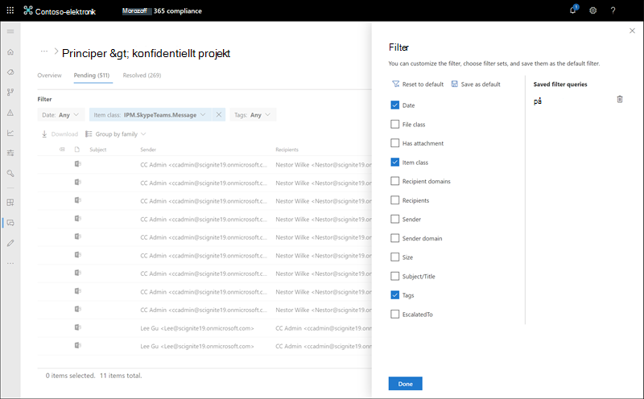
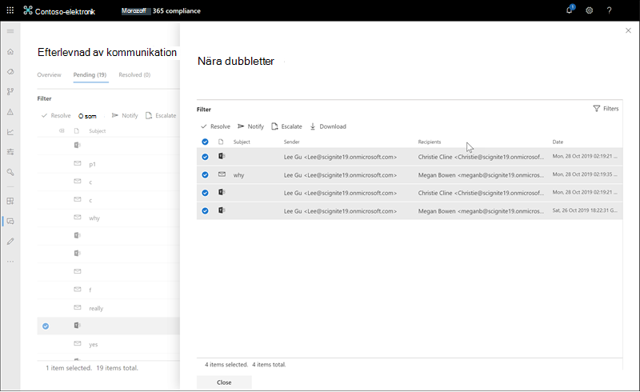
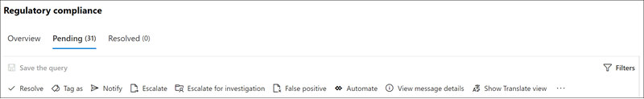

# Undersöka och åtgärda aviseringar för kommunikationsefterlevnad

När du har konfigurerat principer för kommunikationsefterlevnad kommer du att få aviseringar i Microsoft 365 Efterlevnadscenter om meddelandeproblem som matchar dina policyvillkor. Följ arbetsflödesanvisningarna här för att undersöka och åtgärda aviseringsproblem.

## Undersöka aviseringar

Det första steget för att undersöka problem som upptäckts av dina principer är att granska aviseringar om kommunikationsefterlevnad i Microsoft 365 Efterlevnadscenter. Det finns flera områden i området för kommunikationsefterlevnad för att hjälpa dig att snabbt undersöka aviseringar, beroende på hur du föredrar att visa aviseringsgrupperingar:

- **Sida för policy för** kommunikation som efterlevs: När du loggar in med autentiseringsuppgifter för ett administratörskonto i Microsoft 365-organisationen väljer du Kommunikationsefterlevnad för att visa sidan policy för [https://compliance.microsoft.com](https://compliance.microsoft.com) **kommunikation.**  På den här sidan visas principer för kommunikationsefterlevnad som Microsoft 365 organisationen har, samt länkar till rekommenderade principmallar. Varje princip som listas innehåller antalet aviseringar som behöver granskas, antalet eskalerade och lösta objekt, status för principen samt datum och tid för den senaste principsökningen. Om du väljer en princip visas alla väntande aviseringar för matchningar till principen, väljer du en specifik avisering för att starta sidan med principinformation och startar åtgärdsåtgärder.
- **Varningar**: Navigera till aviseringar **om**  >  **kommunikationsefterlevnad** för att visa de senaste 30 dagarna av aviseringar grupperade efter principmatchningar. I den här vyn kan du snabbt se vilka principer för kommunikationsefterlevnad som genererar de mest varningar som ordnas efter allvarlighetsgrad. Om du vill starta åtgärdsåtgärder väljer du den princip som är kopplad till aviseringen för att starta **sidan Principinformation.** Från sidan **Principinformation** kan du granska en sammanfattning  av aktiviteterna på sidan Översikt, granska och agera på varningsmeddelanden på sidan Väntande eller granska **historiken** för stängda aviseringar på sidan **Löst.**
- **Rapporter**: Gå till rapporten **om**  >  **kommunikationsefterlevnad för** att visa widgetar för kommunikationsrapporter. Varje widget ger en översikt över aktiviteter och status för kommunikationsefterlevnad, inklusive åtkomst till djupare insikter om principmatchningar och åtgärdsåtgärder.

### Använda filter

Nästa steg är att sortera meddelandena så att det blir enklare för dig att undersöka aviseringar. På sidan **Principinformation stöder** kommunikationsefterlevnad filtrering på flera nivåer för flera meddelandefält så att du snabbt kan undersöka och granska meddelanden med principmatchning. Filtrering är tillgängligt för väntande och lösta objekt för varje konfigurerad princip. Du kan konfigurera filterfrågor för en princip eller konfigurera och spara anpassade filterfrågor och standardfilterfrågor för användning i varje viss princip. När du har konfigurerat fälten för ett filter visas filterfälten högst upp i meddelandekön som du kan konfigurera för specifika filtervärden.

En fullständig lista över filter och fältinformation finns i [Filter](communication-compliance-feature-reference.md#filters) i funktionsreferensartikeln.

#### Så här konfigurerar du ett filter

1. Logga in [https://compliance.microsoft.com](https://compliance.microsoft.com) med autentiseringsuppgifter för ett administratörskonto i Microsoft 365 organisation.

2. I Microsoft 365 Efterlevnadscenter du till **Kommunikationsefterlevnad.**

3. Välj fliken **Principer** och välj sedan en princip för undersökning och dubbelklicka för att öppna **sidan** Princip.

4. På sidan **Princip** väljer du fliken **Väntande eller** **Löst för** att visa objekten för filtrering.

5. Välj kontrollen **Filter** för att öppna **informationssidan** Filter.

6. Markera en eller flera kryssrutor för att aktivera filter för dessa aviseringar. Du kan välja bland flera filter, bland annat *Datum,* *Avsändare,* *Ämne/Titel,* *Klassificerare, Språk.* 

7. Om du vill spara filtret som markerats som standardfilter väljer du **Spara som standard.** Om du vill använda filtret som ett sparat filter väljer du **Klar**.

8. Om du vill spara de valda filtren som  en filterfråga väljer du Spara frågekontrollen när du har konfigurerat minst ett filtervärde. Ange ett namn för filterfrågan och välj **Spara**. Filtret är bara tillgängligt att använda för den här principen och visas i **avsnittet Sparade filterfrågor** på **sidan Filterinformation.**

    

### Använda näranalys och exakt analys av dubbletter

Principer för kommunikationsefterlevnad söker automatiskt igenom och förgrupperar när och exakt meddelandedubbletter utan ytterligare konfigurationssteg. Den här vyn gör att du snabbt kan agera på liknande meddelanden en för en eller en grupp, vilket minskar belastningen på meddelandeundersökningen för granskare. När dubbletter identifieras visas kontrollerna Nära dubbletter och/eller Exakt dubbletter i **åtgärdsverktygsfältet.**  Den här vyn är inte tillgänglig om inga exakta dubbletter eller närbild hittas.

#### Så här åtgärdar du dubbletter

1. Logga in [https://compliance.microsoft.com](https://compliance.microsoft.com) med autentiseringsuppgifter för ett administratörskonto i Microsoft 365 organisation.

2. I Microsoft 365 Efterlevnadscenter du till **Kommunikationsefterlevnad.**

3. Välj fliken **Principer** och välj sedan en princip för undersökning och dubbelklicka för att öppna **sidan** Princip.

4. På sidan **Princip** väljer du fliken Väntande **eller** **Löst för att** visa dubbletter av meddelanden.

5. Markera kontrollerna **Nära dubbletter** eller **Exakt dubbletter** för att öppna informationssidan för dubbletter.

6. Markera ett eller flera meddelanden för att åtgärda åtgärdskontrollerna för dessa meddelanden.

7. Välj **Lös**, **Meddela**, **eskalera** **eller** Ladda ned för att tillämpa åtgärden på de markerade dubblettmeddelandena som standardfilter.

8. Välj **Stäng** när du har slutfört åtgärdsåtgärderna på meddelandena.

    

## Åtgärda aviseringar

Oavsett var du börjar granska aviseringar eller filtreringen du konfigurerar är nästa steg att vidta åtgärder för att åtgärda aviseringen. Starta aviseringsreparationen med hjälp av följande arbetsflöde på **sidan Princip** **eller Aviseringar.**

### Steg 1: Undersöka grunderna i meddelandet

 Ibland är det uppenbart för källan eller ämnet att ett meddelande kan åtgärdas omedelbart. Det kan vara så att meddelandet är felstavat eller felaktigt matchat med en princip och att det bör lösas som felaktigt klassificerat. Välj kontrollen **Rapportera som felaktig för att** dela felklassificerat innehåll med Microsoft, lös omedelbart aviseringen och ta bort från den väntande aviseringskön. Från käll- eller avsändarinformationen kanske du redan vet hur meddelandet ska dirigeras eller hanteras under dessa omständigheter. Överväg att använda **kontrollerna Tagga** som eller **Eskalera** för att tilldela en tagg till tillämpliga meddelanden eller skicka meddelanden till en för utsedd granskare.

### Steg 2: Granska meddelandeinformationen

När du har gått igenom grunderna i meddelandet är det dags att öppna ett meddelande för att undersöka informationen och avgöra ytterligare åtgärder. Välj ett meddelande för att visa den fullständiga meddelanderubriken och brödtexten. Det finns flera olika vyer som hjälper dig att avgöra hur du ska göra:

- **Källvy:** Den här vyn är den standardvy för meddelanden som vanligtvis visas på de flesta webbaserade meddelandeplattformar. Sidhuvudinformationen formateras i normalt format och meddelandetexten stöder bilder med imbededer och radbruten text. Om [optisk teckenläsning (OCR)](communication-compliance-feature-reference.md#optical-character-recognition-ocr) är aktiverad för principen visas bilder som innehåller tryckt eller handskriven text som matchar villkorsstyrd princip som ett underobjekt för det associerade meddelandet i den här vyn.
- **Textvy:** Textvyn visar en vy med endast radnumrerad text i meddelandet och innehåller nyckelordsmarkering i meddelanden och bifogade filer för termer eller nyckelord av typen känslig information som matchas i den associerade principen för kommunikationsefterlevnad. Med hjälp av nyckelordsmarkering kan du snabbt söka igenom långa meddelanden och bifogade filer efter det intresseområde som är av intresse. I vissa fall kan markerad text bara finnas i bifogade filer för meddelanden som matchar principvillkor. Nyckelordsmarkering stöds inte för termer som identifieras av inbyggda klassificerare som tilldelats till en princip. Inbäddade filer visas inte och radnumrering i den här vyn är användbart om du vill referera relevant information mellan flera granskare.
- **Kommentarsvyn:** I den här vyn kan granskare lägga till anteckningar direkt i meddelandet som sparas i meddelandets vy. Om [OCR](communication-compliance-feature-reference.md#optical-character-recognition-ocr) är aktiverat för principen visas bilder som innehåller tryckt eller handskriven text som matchar villkorsstyrd policy som ett underobjekt för det associerade meddelandet i den här vyn och kan komma att kommenteras.
- **Konversationsvyn (förhandsgranskning)**: Microsoft Teams-chattmeddelanden visas i den här vyn upp till fem meddelanden före och efter ett varningsmeddelande som hjälper granskare att se aktiviteten i konversationens sammanhang. Det här sammanhanget hjälper granskare att snabbt utvärdera meddelanden och fatta mer välgrundade beslut om meddelandeupplösning. Tilläggen till konversationer i realtid visas, inklusive alla infogade bilder, emojier och dekaler som finns i Teams. Bifogade filer, bilder eller text i meddelanden visas inte. Aviseringar visas automatiskt för meddelanden som har redigerats eller för meddelanden som har tagits bort från konversationsfönstret. När ett meddelande matchas behålls inte de tillhörande konversationsmeddelandena med det lösta meddelandet. Konversationsmeddelanden är tillgängliga i upp till 60 dagar efter att aviseringsmeddelandet har identifierats.
- **Användarhistorik:** Vyn Användarhistorik visar alla andra aviseringar som genereras av en princip för kommunikationsefterlevnad för användaren som skickar meddelandet.
- **Mönster som upptäckts** meddelande: Många trakasserings- och mobbningsåtgärder över tid och innebär att instanser av samma beteende upprepas av en användare. Det *mönster som upptäckts* aviseringen visas i aviseringsinformationen och uppmärksammar aviseringen. Identifiering av mönster per princip och utvärderar beteende under de senaste 30 dagarna när minst två meddelanden skickas till samma mottagare av en avsändare. Varningar och granskare kan använda det här meddelandet för att identifiera upprepat beteende för att utvärdera aviseringen efter behov.
- **Visa översättningsvyn:** I den här vyn konverteras automatiskt  aviseringstexten till det språk som har konfigurerats i inställningen För visningsspråk i Microsoft 365-prenumerationen för varje granskare. Översättningsvyn hjälper till att bredda stödet för organisationer med flerspråkiga användare och eliminerar behovet av ytterligare översättningstjänster utanför granskningsprocessen för kommunikationsefterlevnad. Med Microsoft Translate-tjänster kan du, om det behövs, stänga av och stänga av översättningsvyn och använda en mängd olika språk. En fullständig lista över språk som stöds finns i [Microsoft Translator Språk.](https://www.microsoft.com/translator/business/languages/) Språk som visas *Translator språklistan* stöds i vyn Översätt.

    

### Steg 3: Bestäm en åtgärdsåtgärd

Nu när du har granskat meddelandets information kan du välja flera åtgärder:

- **Lös:** Om du **väljer** kontrollen Lös  tas meddelandet omedelbart bort från kön väntande aviseringar och inga ytterligare åtgärder kan vidtas på meddelandet. Genom att **välja Lös** har du i princip stängt aviseringen utan ytterligare klassificering och det går inte att öppna den igen för ytterligare åtgärder. Alla lösta meddelanden visas på fliken **Löst.**
- **Rapportera som felaktigt (förhandsversion)**: Du kan alltid lösa ett meddelande som felaktigt klassificerat när som helst under arbetsflödet för meddelandegranskning. Felaktig klassificering anger att aviseringen inte kunde hanteras eller att aviseringen genererades felaktigt av aviseringsprocessen och eventuella utbildare. När du löser objektet som felaktigt klassificerat skickas meddelandeinnehåll, bifogade filer och meddelandets ämne (inklusive metadata) till Microsoft för att förbättra utbildare. Data som skickas till Microsoft innehåller inte information som kan identifiera eller användas för att identifiera användare i din organisation. Ytterligare åtgärder kan inte vidtas på meddelandet och alla felklassificerade meddelanden visas på fliken **Löst.**
- **Power Automate (förhandsversion)**: Använd ett Power Automate för att automatisera processuppgifter för ett varningsmeddelande. Som standard inkluderar kommunikationsefterlevnad meddelandehanteraren när en användare har en aviseringsflödesmall för kommunikationsefterlevnad som granskare kan använda för att automatisera meddelandeprocessen för användare med meddelandeaviseringar.  Mer information om hur du skapar och hanterar Power Automate flöden i kommunikationsefterlevnad finns i artikeln Om funktioner för [kommunikationsefterlevnad.](communication-compliance-feature-reference.md#power-automate-flows)
- **Tagga** som: Tagga meddelandet som *kompatibelt,*  *icke-kompatibelt* eller som tveksamt i enlighet med organisationens principer och standarder. Om du lägger till taggar och kommentarer som taggar kan du mikrofiltreringsprincipaviseringar för eskalering eller som en del av andra interna granskningsprocesser. När taggningen är klar kan du också välja att lösa meddelandet och flytta det från den väntande granskningskön.
- **Meddela:** Du kan använda kontrollen **Meddela** för att tilldela en anpassad meddelandemall till aviseringen och skicka ett varningsmeddelande till användaren. Välj lämplig meddelandemall som  konfigurerats i området  Inställningar för kommunikationsefterlevnad och välj Skicka för att skicka en påminnelse via e-post till den användare som har skickat meddelandet och för att lösa problemet.
- **Eskalera:** Med **hjälp av kontrollen** Eskalering kan du välja vilka andra i organisationen som ska granska meddelandet. Välj från en lista med granskare som konfigurerats i principen för kommunikationsefterlevnad för att skicka ett e-postmeddelande och begära ytterligare granskning av meddelandeaviseringen. Den valda granskaren kan använda en länk i e-postmeddelandet för att gå direkt till objekt som eskalerats till dem för granskning.
- **Eskalera för undersökning:** Med **hjälp** av kontrollen Eskalera för undersökning kan du skapa ett [Advanced eDiscovery ärende](overview-ediscovery-20.md) för enstaka eller flera meddelanden. Du kommer att ange ett namn och anteckningar för det nya ärendet, och användaren som skickade meddelandet som matchar principen tilldelas automatiskt som målsordnare. Du behöver inga ytterligare behörigheter för att hantera ärendet. Att skapa ett ärende löser inte eller skapar inte en ny tagg för meddelandet. Du kan välja totalt 100 meddelanden när du Advanced eDiscovery ett ärende under åtgärdsprocessen. Meddelanden i alla kommunikationskanaler som övervakas genom kommunikationsefterlevnad stöds. Du kan till exempel välja 50 Microsoft Teams chattar, 25 Exchange Online e-postmeddelanden och 25 Yammer-meddelanden när du öppnar ett nytt Advanced eDiscovery-ärende för en användare.
- Ta bort meddelanden **i Teams:** Med hjälp av kontrollen Ta bort meddelande i **Teams** kan du blockera olämpliga meddelanden och innehåll som identifieras i aviseringar från Microsoft Teams-kanaler och privat chattar och gruppchattar. Meddelanden och innehåll som tagits bort ersätts med ett principtips som förklarar att det blockerats och principen som gäller för borttagningen från vyn. Mottagarna får en länk i principtipset för att lära sig mer om tillämplig princip och granskningsprocessen. Avsändaren får ett principtips för det blockerade meddelandet och det blockerade innehållet men kan granska information om blockerade meddelanden och innehåll om borttagningen.

    

### Steg 4: Avgör om meddelandeinformationen ska arkiveras utanför kommunikationsefterlevnad

Meddelandeinformation kan exporteras eller hämtas om du behöver arkivera meddelandena i en separat lagringslösning. Om du **väljer** kontrollen Ladda ned läggs markerade meddelanden automatiskt .ZIP en fil som kan sparas i lagringen utanför Microsoft 365.
