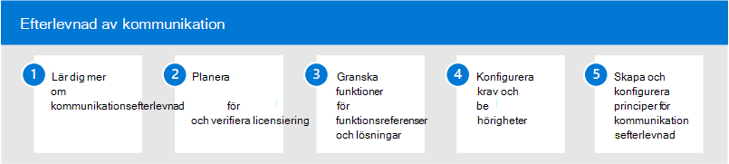

# Kommunikationsefterlevnad i Microsoft 365

Att skydda känslig information och identifiera och agera på arbetsplatsens trakasserier är en viktig del av efterlevnad av interna principer och standarder. Kommunikationsefterlevnad i Microsoft 365 hjälper till att minimera dessa risker genom att snabbt upptäcka, fånga in och vidta åtgärder för e-Microsoft Teams kommunikation. Det omfattar olämplig kommunikation som innehåller svordomar, hot, trakasserier och kommunikationer som delar känslig information inom och utanför organisationen.

## Konfigurera kommunikationsefterlevnad för Microsoft 365

Använd följande steg för att konfigurera kommunikationsefterlevnad för din organisation:

1. Läs mer [om kommunikationsefterlevnad](communication-compliance.md) i Microsoft 365
2. Planera för [kommunikationsefterlevnad](communication-compliance-plan.md) och [verifiera licensiering](communication-compliance-configure.md#subscriptions-and-licensing)
3. Granska [funktioner för funktionsreferenser och lösningar](communication-compliance-feature-reference.md)
4. Konfigurera [krav](communication-compliance-configure.md#step-2-required-enable-the-audit-log) och [behörigheter](communication-compliance-configure.md#step-1-required-enable-permissions-for-communication-compliance)
5. Skapa och konfigurera principer [för kommunikationsefterlevnad](communication-compliance-configure.md#step-5-required-create-a-communication-compliance-policy)

## Mer information om kommunikationsefterlevnad

- [Undersöka och åtgärda aviseringar](communication-compliance-investigate-remediate.md)
- [Fallstudie – Contoso konfigurerar snabbt en anstötlig språkprincip för Microsoft Teams, Exchange och Yammer kommunikationer](communication-compliance-case-study.md)