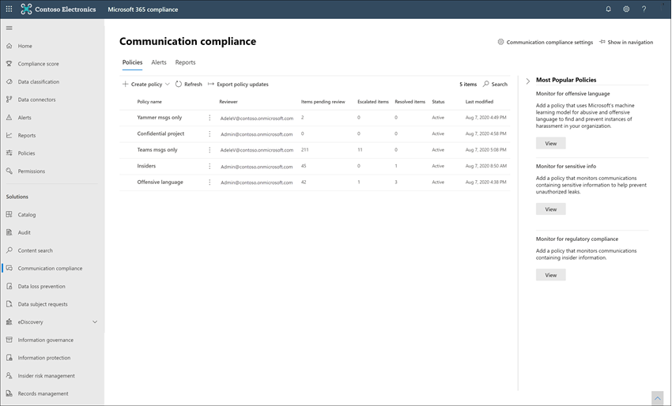
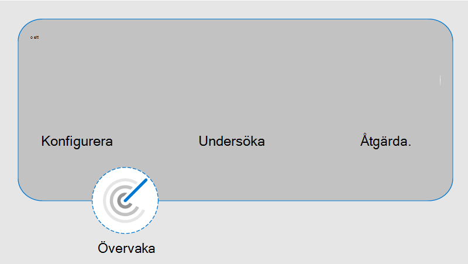

# Läs mer om kommunikationsefterlevnad i Microsoft 365Learn about communication compliance in Microsoft 365

Kommunikationsefterlevnad är en insider-risklösning i Microsoft 365 som bidrar till att minimera kommunikationsrisker genom att hjälpa dig att identifiera, fånga in och agera på olämpliga meddelanden i organisationen.Communication compliance is an insider risk solution in Microsoft 365 that helps minimize communication risks by helping you detect, capture, and act on inappropriate messages in your organization. Med fördefinierade och anpassade principer kan du söka igenom intern och extern kommunikation efter principmatchningar så att de kan behandlas som nya granskare.Pre-defined and custom policies allow you to scan internal and external communications for policy matches so they can be examined by designated reviewers. Granskare kan undersöka skannad e-post, Microsoft Teams, Yammer eller kommunikation från tredje part i organisationen och vidta lämpliga åtgärder för att säkerställa att de följer organisationens meddelandestandarder.Reviewers can investigate scanned email, Microsoft Teams, Yammer, or third-party communications in your organization and take appropriate actions to make sure they're compliant with your organization's message standards.

Principer för kommunikationsefterlevnad i Microsoft 365 hjälpa dig att hantera många moderna utmaningar som är kopplade till efterlevnad och intern och extern kommunikation, inklusive:Communication compliance policies in Microsoft 365 help you overcome many modern challenges associated with compliance and internal and external communications, including:

- Genomsökning av ökande typer av kommunikationskanalerScanning increasing types of communication channels
- Den växande volymen för meddelandedataThe increasing volume of message data
- Verkställande av regler och risk för böterRegulatory enforcement and the risk of fines

Det kan dessutom finnas en uppdelning av uppgifter mellan IT-administratörer och efterlevnadshanteringsteamet.Additionally, there may be a separation of duties between your IT admins and your compliance management team. Kommunikationsefterlevnaden stöder åtskillnad mellan konfiguration av principer och undersökning och granskning av meddelanden.Communication compliance supports the separation between configuration of policies and the investigation and review of messages. IT-gruppen för din organisation kan exempelvis ansvara för att ställa in rollbehörigheter för kommunikationsefterlevnad, grupper och principer samt huvudmän och granskare kan ansvara för meddelandesortering, granskning och åtgärder.For example, the IT group for your organization may be responsible for setting up communication compliance role permissions, groups, and policies and investigators and reviewers may be responsible for message triage, review, and mitigation actions.

De senaste Ignite-presentationerna för kommunikationsefterlevnad finns i följande videoklipp:For the latest Ignite presentations for communication compliance, see the following videos:

- [Främja en kultur för säkerhet och integrering med kommunikationsefterlevnadFoster a culture of safety and inclusion with communication compliance](https://www.youtube.com/watch?v=oLVzxcaef3w)
- [Lär dig hur du minskar kommunikationsriskerna inom organisationenLearn how to reduce communication risks within your organization](https://www.youtube.com/watch?v=vzARb1YaxGo)
- [Uppfylla kraven för regelefterlevnad med kommunikationsefterlevnadFulfill regulatory compliance requirements with communication compliance](https://www.youtube.com/watch?v=gagOhtCBfgU)
- [Bättre med Microsoft Teams – Lär dig mer om de senaste inbyggda Teams funktioner för kommunikationsefterlevnadBetter with Microsoft Teams - Learn more about the latest native Teams integrated features in communication compliance](https://www.youtube.com/watch?v=m4jukD5Fh-o)

En snabb överblick över kommunikationsefterlevnad finns i videon Identifiera trakasserier på arbetsplatsen och svara med [kommunikationsefterlevnad](https://youtu.be/z33ji7a7Zho) i Microsoft 365 i [Microsoft Mechanics-kanalen.](https://www.youtube.com/user/OfficeGarageSeries)For a quick overview of communication compliance, see the [Detect workplace harassment and respond with Communication Compliance in Microsoft 365](https://youtu.be/z33ji7a7Zho) video on the [Microsoft Mechanics channel](https://www.youtube.com/user/OfficeGarageSeries).

## Scenarier för kommunikationsefterlevnadScenarios for communication compliance

Principer för kommunikationsefterlevnad kan vara till hjälp när du granskar meddelanden i din organisation inom flera viktiga efterlevnadsområden:Communication compliance policies can assist with reviewing messages in your organization in several important compliance areas:

- **Företagspolicyer****Corporate policies**

    Användare måste följa rimligt använda, omsidande standarder och andra företagsprinciper i all affärsrelaterad kommunikation.Users must comply with acceptable use, ethical standards, and other corporate policies in all their business-related communications. Principer för kommunikationsefterlevnad kan identifiera principmatchning och hjälpa dig att vidta korrigerande åtgärder för att minimera dessa typer av incidenter.Communication compliance policies can detect policy matches and help you take corrective actions to help mitigate these types of incidents. Du kan till exempel söka igenom användarkommunikationen i organisationen efter potentiella personalfrågor som trakasserier eller användning av olämpligt eller stötande språk.For example, you could scan user communications in your organization for potential human resources concerns such as harassment or the use of inappropriate or offensive language.

- **Riskhantering****Risk management**

    Organisationer ansvarar för all kommunikation som är fördelad över deras infrastruktur och företagsnätverkssystem.Organizations are responsible to all communications distributed throughout their infrastructure and corporate network systems. Användning av principer för kommunikationsefterlevnad som hjälper till att identifiera och hantera potentiell exponering och risk för juridisk exponering kan minimera riskerna innan de kan skada företagets verksamhet.Using communication compliance policies to help identify and manage potential legal exposure and risk can help minimize risks before they can damage corporate operations. Du kan till exempel söka igenom meddelanden i organisationen efter obehörig kommunikation och intressekonflikter om konfidentiella projekt, t.ex. kommande förvärv, sammanslagningar, avslöjanden av intäkter, omorganisationar eller ändringar från ledningsgruppen.For example, you could scan messages in your organization for unauthorized communications and conflicts of interest about confidential projects such as upcoming acquisitions, mergers, earnings disclosures, reorganizations, or leadership team changes.

- **Regelefterlevnad****Regulatory compliance**

    De flesta organisationer måste följa någon typ av standarder för regelefterlevnad som en del av sina normala driftrutiner.Most organizations must comply with some type of regulatory compliance standards as part of their normal operating procedures. Dessa föreskrifter kräver ofta att organisationer implementerar någon typ av övervakande eller överblickande process för meddelanden som är lämpliga för deras bransch.These regulations often require organizations to implement some type of supervisory or oversight process for messaging that is appropriate for their industry. FinRA(Financial Industry Regulatory Authority) Rule 3110 är ett bra exempel på ett krav för organisationer att ha övervakande metoder för att söka igenom användarkommunikation och typer av företag som den engagerar sig i.The Financial Industry Regulatory Authority (FINRA) Rule 3110 is a good example of a requirement for organizations to have supervisory procedures in place to scan user communications and the types of businesses in which it engages. Ett annat exempel kan vara ett behov av att granska företag- och kommunikationer i din organisation för att skydda mot potentiella pengar som kan finnas, insider-handelsaktiviteter, sortering eller verksamhet.Another example may be a need to review broker-dealer communications in your organization to safeguard against potential money laundering, insider trading, collusion, or bribery activities. Principer för kommunikationsefterlevnad kan hjälpa din organisation att uppfylla de här kraven genom att tillhandahålla en process för både genomsökning och rapport om företagskommunikation.Communication compliance policies can help your organization meet these requirements by providing a process to both scan and report on corporate communications. Mer information om stöd för finansiella organisationer finns i Viktiga [efterlevnads- och säkerhetsöverväganden för banktjänster och marknader i USA.](../solutions/financial-services-secure-collaboration.md)For more information on support for financial organizations, see [Key compliance and security considerations for US banking and capital markets](../solutions/financial-services-secure-collaboration.md).

## Viktiga funktionsområdenKey feature areas

Kommunikationsefterlevnad i Microsoft 365 erbjuder flera viktiga funktioner som bidrar till att ta itu med efterlevnadsproblem på meddelandeplattformar:Communication compliance in Microsoft 365 offers several important features to help address compliance concerns on your messaging platforms:

- Intelligenta anpassningsbara mallarIntelligent customizable templates
- Flexibla arbetsflöden för åtgärderFlexible remediation workflows
- Handlingsbara insikterActionable insights

### Intelligenta anpassningsbara mallarIntelligent customizable templates

Med intelligenta anpassningsbara mallar för kommunikationsefterlevnad kan du använda maskininlärning för att intelligent identifiera kommunikationsbrott i organisationen.Intelligent customizable templates in communication compliance allow you to apply machine learning to intelligently detect communication violations in your organization.

- **Anpassningsbara förkonfigurerade mallar:** Nya principmallar hjälper dig att hantera de vanligaste kommunikationsriskerna.**Customizable pre-configured templates**: New policy templates help address the most common communications risks. Det går nu snabbare att skapa och följa upp nya policyer med fördefinierade mallar för skydd av trakasserier och anstötligt språk, känslig information, intressekonflikter och regelefterlevnad.Initial policy creation and follow-on updating are now quicker with pre-defined anti-harassment and offensive language, sensitive information, conflict of interest, and regulatory compliance templates.
- **Nytt stöd för** maskininlärning: Inbyggda hot,  trakasserier, svordomar och bildklassare hjälper till att minska antalet falska positiva resultat i genomsökta meddelanden, vilket sparar granskares tid under undersökning och åtgärder.**New machine learning support**: Built-in threat, harassment, profanity, and image [classifiers](classifier-get-started-with.md) help reduce false positives in scanned messages, saving reviewers time during the investigation and remediation process.
- **Bättre villkorsverktyget:** Konfigurering av principvillkor förenklas nu till en enda, integrerad miljö i principguiden, vilket minskar förvirringen i hur villkoren tillämpas för principer.**Improved condition builder**: Configuring policy conditions is now streamlined into a single, integrated experience in the policy wizard, reducing confusion in how conditions are applied for policies.

### Flexibla arbetsflöden för åtgärderFlexible remediation workflows

Med inbyggda arbetsflöden för åtgärder kan du snabbt identifiera och vidta åtgärder på meddelanden med principmatchningar i organisationen.Built-in remediation workflows allow you to quickly identify and take action on messages with policy matches in your organization. Följande nya funktioner ökar effektiviteten för undersöknings- och åtgärdsaktiviteter:The following new features increase efficiency for investigation and remediation activities:

- **Flexibelt arbetsflöde för** åtgärder : Med det nya arbetsflödet för åtgärder kan du snabbt vidta åtgärder för principmatchningar, inklusive nya alternativ för att e-postaviseringar till andra granskare och för att skicka e-postmeddelanden till användare med principmatchningar.**Flexible remediation workflow**: New remediation workflow helps you quickly take action on policy matches, including new options to escalate messages to other reviewers and to send email notifications to users with policy matches.
- **Matchning av konversationsprinciper:** Meddelanden i konversationer grupperas efter principmatchning så att du bättre kan se hur konversationer relaterar till dina kommunikationsprinciper.**Conversation policy matching**: Messages in conversations are grouped by policy matches to give you more visibility about how conversations relate to your communication policies. Till exempel kommer konversationsprincipmatchning i vyn Väntande aviseringar automatiskt att visa alla meddelanden i en Teams kanal som har matchningar för din policy för anstötligt språk. For example, conversation policy matching in the *Pending Alerts* view will automatically show all messages in a Teams channel that have matches for your Offensive Language policy. Andra meddelanden i konversationen som inte stämmer överens med principen anstötligt språk visades inte.Other messages in the conversation that don't match the Offensive Language policy would not be displayed.
- **Nyckelordsmarkering:** Villkor för matchning av policyer markeras i vyn med meddelandetext för att hjälpa granskare att snabbt hitta och åtgärda principaviseringar.**Keyword highlighting**: Terms matching policy conditions are highlighted in the message text view to help reviewers quickly locate and remediate policy alerts.
- **Exakt och nästan** dubblettidentifiering: Förutom att söka efter exakta termer som matchar principer för kommunikationsefterlevnad så kan grupper med liknande termer och meddelanden nästan som dubbletter tillsammans snabba upp granskningsprocessen.**Exact and near duplicate detection**: In addition to scanning for exact terms matching communication compliance policies, near duplicate detection groups textually similar terms and messages together to help speed up your review process.
- **Optisk teckenläsning (OCR) (förhandsversion)**: Skanna, identifiera och granska tryckt och handskriven text i bilder som är inbäddade eller bifogade i e-Microsoft Teams chattmeddelanden.**Optical character recognition (OCR) (preview)**: Scan, detect, and investigate printed and handwritten text within images embedded or attached to email or Microsoft Teams chat messages.
- **Nya filter:** Undersök och åtgärda principvarningar snabbare med meddelandefilter för flera fält, inklusive avsändare, mottagare, datum, domäner och många fler.**New filters**: Investigate and remediate policy alerts faster with message filters for several fields, including sender, recipient, date, domains, and many more.
- **Förbättrade meddelandevyer:** Undersöknings- och åtgärdsåtgärder går nu snabbare med nya vyer för meddelandekälla, text och anteckningar.**Improved message views**: Investigation and remediation actions are now quicker with new message source, text, and annotation views. Bifogade filer i meddelanden kan nu visas för att ge fullständig kontext vid åtgärder.Message attachments are now viewable to provide complete context when taking remediation actions.
- **Användarhistorikvy:** Den historiska vyn för alla åtgärder för användarmeddelanden, till exempel tidigare meddelanden och eskalering för principmatchningar, ger nu granskare mer kontext under reparationsarbetsflödet.**User history view**: Historical view of all user message remediation activities, such as past notifications and escalations for policy matches, now provides reviewers with more context during the remediation workflow process. Första gången eller upprepade förekomster av principmatchningar för användare arkiveras och är enkelt att visa.First-time or repeat instances of policy matches for users are now archived and easily viewable.
- **Meddelande upptäckt mönster:** Många trakasserings- och mobbningsåtgärder sker över tid och innebär att flera förekomster av samma beteende upprepas av en användare.**Pattern detected notification**: Many harassing and bullying actions take place over time and involve reoccurring instances of the same behavior by a user. Det nya mönster som upptäckts meddelande som visas i aviseringsinformation hjälper till att uppmärksamma dessa aviseringar och den här typen av beteende.The new pattern detected notification displayed in alert details helps raise attention to these alerts and this type of behavior.
- **Visa översättningsvyn:** Undersök meddelandeinformation snabbt på åtta språk med hjälp av översätt stöd i reparationsarbetsflödet.**Show Translate view**: Quickly investigate message details in eight languages using translate support in the remediation workflow. Meddelanden på andra språk konverteras automatiskt till granskarens visningsspråk.Messages in other languages are automatically converted to the display language of the reviewer.

### Handlingsbara insikterActionable insights

Nya interaktiva instrumentpaneler för aviseringar, principmatchningar, åtgärder och trender hjälper dig att snabbt visa status för väntande och lösta aviseringar i organisationen.New interactive dashboards for alerts, policy matches, actions, and trends help you quickly view the status of pending and resolved alerts in your organization.

- **Proaktiva intelligenta aviseringar:** Aviseringar för principmatchningar som kräver omedelbar uppmärksamhet är nya instrumentpaneler för väntande objekt som sorteras efter allvarlighetsgrad och nya automatiska e-postaviseringar som skickas till angivna granskare.**Proactive intelligent alerts**: Alerts for policy matches requiring immediate attention include new dashboards for pending items sorted by severity and new automatic email notifications sent to designated reviewers.
- **Interaktiva instrumentpaneler**: Nya instrumentpaneler visar principmatchningar, väntande och lösta åtgärder samt trender för användare och policyer.**Interactive dashboards**: New dashboards display policy matches, pending and resolved actions, and trends by users and policy.
- **Granskningssupport:** En fullständig logg med princip- och granskningsaktiviteter exporteras enkelt från Microsoft 365 för att det ska gå att stödja granskningsförfrågningar.**Auditing support**: A full log of policy and review activities is easily exported from the Microsoft 365 compliance center to help support audit review requests.

## Integrering med Microsoft 365 tjänsterIntegration with Microsoft 365 services

Principer för kommunikationsefterlevnad söker igenom och fångar meddelanden från flera kommunikationskanaler så att du snabbt kan granska och åtgärda efterlevnadsproblem:Communication compliance policies scan and capture messages across several communication channels to help you quickly review and remediate compliance issues:

- **Microsoft Teams:** Chattkommunikation för offentliga och privata [Microsoft Teams](/MicrosoftTeams/Teams-overview) kanaler och enskilda chattar stöds för kommunikationsefterlevnad som en fristående kanalkälla eller med andra Microsoft 365 tjänster.**Microsoft Teams**: Chat communications for public and private [Microsoft Teams](/MicrosoftTeams/Teams-overview) channels and individual chats are supported in communication compliance as a standalone channel source or with other Microsoft 365 services. Du måste manuellt lägga till enskilda användare, distributionsgrupper eller specifika Microsoft Teams när du väljer användare och grupper som ska övervakas i en princip för kommunikationsefterlevnad.You'll need to manually add individual users, distribution groups, or specific Microsoft Teams channels when you select users and groups to supervise in a communication compliance policy.
- **Exchange Online:** Alla postlådor på [Exchange Online](/Exchange/exchange-online) i din Microsoft 365 organisation är kvalificerade för genomsökning.**Exchange Online**: All mailboxes hosted on [Exchange Online](/Exchange/exchange-online) in your Microsoft 365 organization are eligible for scanning. E-postmeddelanden och bifogade filer som matchar policyvillkor för kommunikation är direkt tillgängliga för övervakning och efterlevnadsrapporter.Emails and attachments matching communication compliance policy conditions are instantly available for monitoring and in compliance reports. Exchange Online är nu en valfri källkanal och krävs inte längre i principer för kommunikationsefterlevnad.Exchange Online is now an optional source channel and is no longer required in communication compliance policies.
- **Yammer:** Privata meddelanden och offentliga community-konversationer i [Yammer](/yammer/yammer-landing-page) stöds i principer för kommunikationsefterlevnad.**Yammer**: Private messages and public community conversations in [Yammer](/yammer/yammer-landing-page) are supported in communication compliance policies. Yammer är en valfri kanal och måste vara i [inbyggt läge för att](/yammer/configure-your-yammer-network/overview-native-mode) stödja genomsökning av meddelanden och bifogade filer.Yammer is an optional channel and must be in [native mode](/yammer/configure-your-yammer-network/overview-native-mode) to support scanning of messages and attachments.
- **Skype för företag Online: Principer** för kommunikationsefterlevnad har stöd för genomsökning av chattkommunikation och tillhörande bifogade [filer Skype för företag Online.](/SkypeForBusiness/skype-for-business-online)**Skype for Business Online**: Communication compliance policies support scanning chat communications and associated attachments in [Skype for Business Online](/SkypeForBusiness/skype-for-business-online).
- **Tredjepartskällor: Du** kan söka igenom meddelanden från tredjepartskällor efter data [som](archiving-third-party-data.md) importerats till postlådor i din Microsoft 365 organisation.**Third-party sources**: You can scan messages from [third-party sources](archiving-third-party-data.md) for data imported into mailboxes in your Microsoft 365 organization. Kommunikationsefterlevnad ger stöd för anslutningar till flera populära plattformar, bland annat Instant Bloomberg och andra.Communication compliance supports connections to several popular platforms, including Instant Bloomberg and others.

Mer information om stöd för meddelandekanaler i principer för kommunikationsefterlevnad finns i [Kommunikationstyper som stöds.](communication-compliance-feature-reference.md#supported-communication-types)To learn more about messaging channel support in communication compliance policies, see [supported communication types](communication-compliance-feature-reference.md#supported-communication-types).

## ArbetsflödeWorkflow

Med hjälp av kommunikationsefterlevnad kan du hantera vanliga problem som är associerade med att följa interna policyer och efterlevnadskrav.Communication compliance helps you address common pain points associated with complying with internal policies and regulatory compliance requirements. Med fokuserade principmallar och ett flexibelt arbetsflöde kan du använda användbara insikter för att snabbt lösa identifierade efterlevnadsproblem.With focused policy templates and a flexible workflow, you can use actionable insights to quickly resolve detected compliance issues.

Att identifiera och lösa efterlevnadsproblem med kommunikationsefterlevnad i Microsoft 365 använder följande arbetsflöde:Identifying and resolving compliance issues with communication compliance in Microsoft 365 uses the following workflow:

### KonfigureraConfigure

I det här arbetsflödessteget identifierar du dina efterlevnadskrav och konfigurerar tillämpliga principer för kommunikationsefterlevnad.In this workflow step, you identify your compliance requirements and configure applicable communication compliance policies. Principmallar är ett bra sätt att inte bara snabbt konfigurera en ny efterlevnadsprincip, utan även snabbt ändra och uppdatera principer när dina krav ändras.Policy templates are a great way to not only quickly configure a new compliance policy, but to also quickly modify and update policies as your requirements change. Du kanske till exempel snabbt vill testa en princip för anstötligt språk och skydd mot trakasserier av kommunikation för en liten grupp användare innan du konfigurerar en princip för alla användare i organisationen.For example, you may want to quickly test a policy for offensive language and anti-harassment on communications for a small group of users before configuring a policy for all users in your organization.

>[!Important]
>Som standard har globala administratörer inte tillgång till funktioner för kommunikationsefterlevnad.By default, Global Administrators do not have access to communication compliance features. Information om hur du aktiverar behörigheter för funktioner för kommunikationsefterlevnad finns i Göra [kommunikationsefterlevnad tillgänglig i din organisation.](communication-compliance-configure.md#step-1-required-enable-permissions-for-communication-compliance)To enable permissions for communication compliance features, see [Make communication compliance available in your organization](communication-compliance-configure.md#step-1-required-enable-permissions-for-communication-compliance).

Du kan välja bland följande principmallar i kompatibilitetscentret Microsoft 365 principefterlevnad:You can choose from the following policy templates in the Microsoft 365 compliance center:

- **Stötande eller stötande** språk: Använd den här mallen för att snabbt skapa en princip som använder inbyggda klassificerare för att automatiskt identifiera innehåll som kan anses vara olämpligt eller stötande.**Offensive or threatening language**: Use this template to quickly create a policy that uses built-in classifiers to automatically detect content that may be considered abusive or offensive.
- **Känslig information:** Använd den här mallen för att snabbt skapa en princip för att söka igenom kommunikationer som innehåller definierade typer av känslig information eller nyckelord för att se till att viktiga data inte delas med personer som inte ska ha åtkomst.**Sensitive information**: Use this template to quickly create a policy to scan communications containing defined sensitive information types or keywords to help make sure that important data isn't shared with people that shouldn't have access.
- **Regelefterlevnad:** Använd den här mallen för att snabbt skapa en princip för att söka igenom kommunikationer efter referenser till standardiserade ekonomiska villkor kopplade till standarder.**Regulatory compliance**: Use this template to quickly create a policy to scan communications for references to standard financial terms associated with regulatory standards.
- **Intressekonflikt:** Använd den här mallen för att snabbt skapa en princip för att övervaka kommunikationen mellan två grupper eller två användare för att undvika intressekonflikter.**Conflict of interest**: Use this template to quickly create a policy to monitor communications between two groups or two users to help avoid conflicts of interest.
- **Anpassad princip:** Använd den här mallen för att konfigurera specifika kommunikationskanaler, villkor för enskilda identifieringar och mängden innehåll som ska övervakas och granskas i organisationen.**Custom policy**: Use this template to configure specific communication channels, individual detection conditions, and the amount of content to monitor and review in your organization.

### UndersökaInvestigate

I det här steget kan du titta närmare på de problem som identifierats när du matchar dina principer för kommunikationsefterlevnad.In this step, you look deeper into the issues detected as matching your communication compliance policies. Det här steget innehåller följande åtgärder som är tillgängliga i Microsoft 365 kompatibilitetscenter:This step includes the following actions available in the Microsoft 365 compliance center:

- **Aviseringar**: När ett meddelande matchar ett principvillkor genereras automatiskt en avisering.**Alerts**: When a message matches a policy condition, an alert is automatically generated. För varje avisering kan du se status, allvarlighetsgrad, tid och om ett Advanced eDiscovery har tilldelats och dess status.For each alert, you can see the status, the severity, the time detected, and if an Advanced eDiscovery case is assigned and its status. Nya aviseringar visas på startsidan för kommunikationsefterlevnad och **aviseringar,** och visas i allvarlighetsordning.New alerts are displayed on the communication compliance home page and the **Alerts** page and are listed in order of severity.
- **Problemhantering:** För varje avisering kan du vidta åtgärder som vidtas för att åtgärda problemet som upptäckts i meddelandet.**Issue management**: For each alert, you can take investigative actions to help remediate the issue detected in the message.
- **Dokumentgranskning:** Under undersökningen av ett problem kan du använda flera vyer av meddelandet för att få hjälp med att korrekt utvärdera det identifierade problemet.**Document review**: During the investigation of an issue, you can use several views of the message to help properly evaluate the detected issue. Vyerna innehåller en konversationssammanfattning, endast text, anteckningar och detaljvyer av kommunikationskonversationen.The views include a conversation summary, text-only, annotated, and detail views of the communication conversation.
- **Granska användaraktivitetshistorik:** Visa historik över användarmeddelandeaktiviteter och åtgärdsåtgärder, till exempel tidigare meddelanden och eskalering, för principmatchningar.**Reviewing user activity history**: View the history of user message activities and remediation actions, such as past notifications and escalations, for policy matches.
- **Filter:** Använd filter som avsändare, mottagare, datum och ämne för att snabbt begränsa vilka meddelandeaviseringar du vill granska.**Filters**: Use filters such as sender, recipient, date, and subject to quickly narrow down the message alerts that you want to review.

### ÅtgärdaRemediate

Nästa steg är att åtgärda problem med kommunikationsefterlevnad som du har undersökt med hjälp av följande alternativ:The next step is to remediate communication compliance issues you've investigated using the following options:

- **Lös:** När du har granskat ett problem kan du åtgärda det genom att åtgärda aviseringen.**Resolve**: After reviewing an issue, you can remediate by resolving the alert. När du löser en avisering tas den bort från den väntande aviseringskön, och åtgärden bevaras som en post i den lösta kön för matchande princip.Resolving an alert removes it from the pending alert queue, and the action is preserved as an entry in the Resolved queue for the matching policy. Aviseringar matchas automatiskt när aviseringen markeras som en falsk positiv markering, ett meddelande skickas till en användare om aviseringen eller ett nytt ärende för aviseringen öppnas.Alerts are automatically resolved after marking the alert as a false positive, sending a notice to a user about the alert, or opening a new case for the alert.
- **Tagga** ett meddelande: Som en del av lösningen på ett problem kan du tagga det identifierade meddelandet som kompatibelt, icke-kompatibelt eller som tveksamt i enlighet med organisationens principer och standarder.**Tag a message**: As part of the resolution of an issue, you can tag the detected message as compliant, non-compliant, or as questionable as it relates to the policies and standards for your organization. Taggningen kan hjälpa dig att få policyaviseringar för mikrofilter vid eskalering eller som en del av andra interna granskningsprocesser.Tagging can help you micro-filter policy alerts for escalations or as part of other internal review processes.
- **Meddela användaren:** Ofta av misstag eller av misstag bryter mot en princip för kommunikationsefterlevnad.**Notify the user**: Often, users accidentally or inadvertently violate a communication compliance policy. Du kan använda meddelandefunktionen för att skicka ett varningsmeddelande till användaren och lösa problemet.You can use the notify feature to provide a warning notice to the user and to resolve the issue.
- **Eskalera till en annan granskare**: Den som granskar ett problem behöver ibland input från andra granskare för att hjälpa till att lösa problemet.**Escalate to another reviewer**: Sometimes, the initial reviewer of an issue needs input from other reviewers to help resolve the incident. Du kan enkelt eskalera problem med meddelanden till granskare i andra delar av organisationen som en del av lösningsprocessen.You can easily escalate message issues to reviewers in other areas of your organization as part of the resolution process.
- **Markera som felaktigt :** Meddelanden som felaktigt identifierats som matchningar av efterlevnadsprinciper kommer ibland att gå vidare till granskningsprocessen.**Mark as a false positive**: Messages incorrectly detected as matches of compliance policies will occasionally slip through to the review process. Du kan markera dessa typer av aviseringar som falska positiva resultat och automatiskt lösa problemet.You can mark these types of alerts as false positives and automatically resolve the issue.
- **Ta bort meddelanden i Teams (förhandsgranskning):** Olämpliga meddelanden kan tas bort från att visas Microsoft Teams personliga kanaler och gruppchattmeddelanden.**Remove message in Teams (preview)**: Inappropriate messages may be removed from displaying in Microsoft Teams channels or personal and group chat messages. Olämpliga meddelanden som tas bort ersätts med ett meddelande om att meddelandet har tagits bort för en principbrott.Inappropriate messages that are removed are replaced with a notification that the message has been removed for a policy violation.
- **Eskalera för undersökning:** I de allvarligaste situationerna kan du behöva dela information om kommunikationsefterlevnad med andra granskare i organisationen.**Escalate for investigation**: In the most serious situations, you may need to share communication compliance information with other reviewers in your organization. Kommunikationsefterlevnad är nära integrerat med Microsoft 365 funktioner för efterlevnad som hjälper dig med end-to-end risk resolution.Communication compliance is tightly integrated with other Microsoft 365 compliance features to help you with end-to-end risk resolution. Om du eskalerar ett ärende för undersökning kan du överföra data och hanteringen av ärendet Advanced eDiscovery i Microsoft 365.Escalating a case for investigation allows you to transfer data and management of the case to Advanced eDiscovery in Microsoft 365. Advanced eDiscovery ett end-to-end-arbetsflöde för att bevara, samla in, granska, analysera och exportera innehåll som svarar på organisationens interna och externa undersökningar.Advanced eDiscovery provides an end-to-end workflow to preserve, collect, review, analyze, and export content that's responsive to your organization's internal and external investigations. Det gör att juridiska grupper kan hantera hela arbetsflödet för aviseringar om juridiska frågor.It allows legal teams to manage the entire legal hold notification workflow. Mer information om Advanced eDiscovery fall finns i [Översikt över Advanced eDiscovery i Microsoft 365](overview-ediscovery-20.md).To learn more about Advanced eDiscovery cases, see [Overview of Advanced eDiscovery in Microsoft 365](overview-ediscovery-20.md).

### ÖvervakaMonitor

Att hålla reda på och hantera efterlevnadsproblem som identifieras med principer för kommunikationsefterlevnad spänner över hela arbetsflödesprocessen.Keeping track and managing compliance issues identified by communication compliance policies spans the entire workflow process. När aviseringar skapas, undersöknings- och åtgärdsåtgärder implementeras, kan befintliga principer behöva granskas och uppdateras, och nya principer kan behöva skapas.As alerts are generated and investigation and remediation actions are implemented, existing policies may need review and updates, and new policies may need to be created.

- **Övervaka och rapportera:** Använd widgetar för instrumentpaneler för kommunikation och efterlevnad, exportloggar och händelser som registrerats i enhetliga granskningsloggar för att kontinuerligt utvärdera och förbättra efterlevnadsefterlevnaden.**Monitor and report**: Use communication compliance dashboard widgets, export logs, and events recorded in the unified audit logs to continually evaluate and improve your compliance posture.

## Är du redo att börja?Ready to get started?

- Information om hur du planerar finns [i Planera för kommunikationsefterlevnad.](communication-compliance-plan.md)For planning information, see [Plan for communication compliance](communication-compliance-plan.md).
- Ta en titta på fallstudien för [Contoso](communication-compliance-case-study.md) och se hur de snabbt konfigurerade en policy för kommunikationsefterlevnad för att övervaka anstötliga språk i Microsoft Teams, Exchange Online och Yammer kommunikation.Check out the [case study for Contoso](communication-compliance-case-study.md) and see how they quickly configured a communication compliance policy to monitor for offensive language in Microsoft Teams, Exchange Online, and Yammer communications.
- Information om hur du konfigurerar kommunikationsefterlevnad Microsoft 365 organisationen finns [i Konfigurera kommunikationsefterlevnad för Microsoft 365.](communication-compliance-configure.md)To configure communication compliance for your Microsoft 365 organization, see [Configure communication compliance for Microsoft 365](communication-compliance-configure.md).
