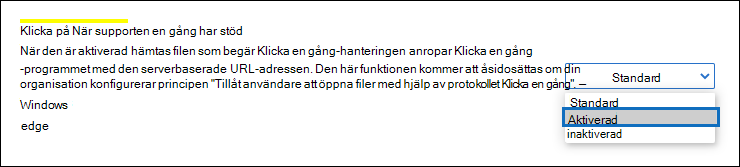
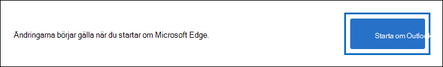
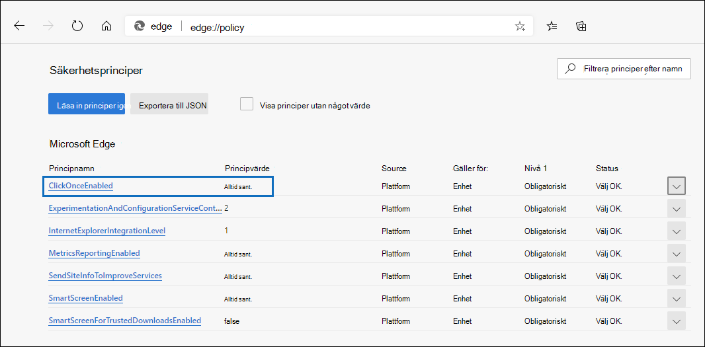
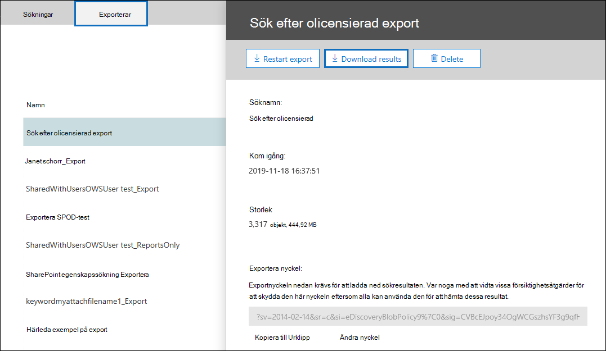
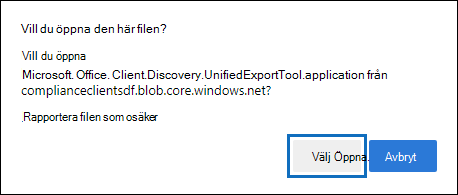
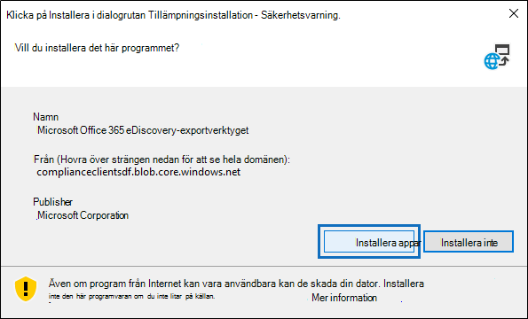

# Använda eDiscovery-exportverktyget i Microsoft EdgeUse the eDiscovery Export Tool in Microsoft Edge

På grund av de senaste ändringarna av den senaste Microsoft Edge är ClickOnce inte längre aktiverat som standard.As a result of recent changes to the newest version of Microsoft Edge, ClickOnce support is no longer enabled by default. Om du vill fortsätta att använda verktyget för eDiscovery-export för att ladda ned innehållssökning eller eDiscovery-sökresultat måste du antingen använda [Microsoft Internet Explorer](https://support.microsoft.com/help/17621/internet-explorer-downloads) eller aktivera ClickOnce stöd i den senaste versionen Microsoft Edge.To continue using the eDiscovery Export Tool to download Content Search or eDiscovery search results, you either need to use [Microsoft Internet Explorer](https://support.microsoft.com/help/17621/internet-explorer-downloads) or enable ClickOnce support in the newest version of Microsoft Edge.

## Aktivera ClickOnce i Microsoft EdgeEnable ClickOnce support in Microsoft Edge

1. I Microsoft Edge går du till **edge://flags/#edge-click-once**.In Microsoft Edge, go to **edge://flags/#edge-click-once**.

2. Om det befintliga värdet är **Inställt på Standard** **eller** Inaktiverat i listrutan ändrar du det till **Aktiverad.**If the existing value is set to **Default** or **Disabled** in the dropdown list, change it to **Enabled**.

   

3. Rulla ned till slutet av webbläsarfönstret och klicka på Starta om **för att** starta om Edge.Scroll down to the bottom of the browser window and click **Restart** to restart Edge.

   

**Obs!** Organisationer kan använda grupprinciper för att inaktivera ClickOnce support.**Note:** Organizations can use Group Policy to disable ClickOnce support. Om du vill kontrollera om det finns en organisationspolicy för ClickOnce support går du till **edge://policy**.To check if there is an organizational policy for ClickOnce support, go to **edge://policy**. Följande skärmbild visar att ClickOnce är aktiverat i hela organisationen.The following screenshot shows that ClickOnce is enabled across the entire organization. Om värdet för den här principen **är falskt** måste du kontakta en administratör i organisationen.If this policy value is set to **false**, you will need to contact an admin in your organization.

## Installera och köra eDiscovery-exportverktygetInstall and run the eDiscovery Export Tool

1. Klicka **på Ladda** ned resultat på den utfällsbara sidan för en export i Innehållssökning eller ett eDiscovery-ärende.Click **Download results** on the flyout page of an export in Content Search or an eDiscovery case.

   

2. Du uppmanas att bekräfta att du vill starta verktyget genom att klicka på **Öppna.**You will be prompted with a confirmation to launch the tool, Click **Open**.

   

   Om verktyget för eDiscovery-export inte är installerat visas en säkerhetsvarning därIf the eDiscovery Export Tool isn't installed, you will be prompted with a Security Warning, 

   

3. Klicka på **Installera**.Click **Install**. När det har installerats startas exportverktyget automatiskt.After it's installed, the export tool will launch automatically.

Mer information finns i följande avsnitt:For more information, see the following topics:

- [Exportera resultat för innehållssökningExport Content Search results](export-search-results.md)

- [Så här aktiverar du experimentflaggor i Microsoft EdgeHow to enable experiment flags in Microsoft Edge](https://microsoftedgesupport.microsoft.com/hc/articles/360034075294-How-to-enable-experiment-flags-in-Microsoft-Edge-Insider-channels)
