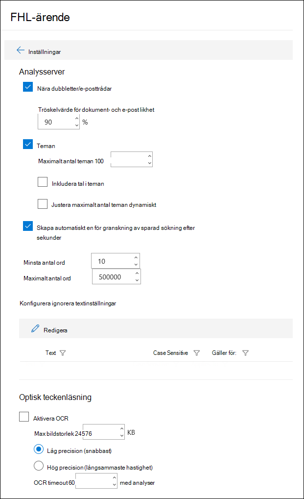
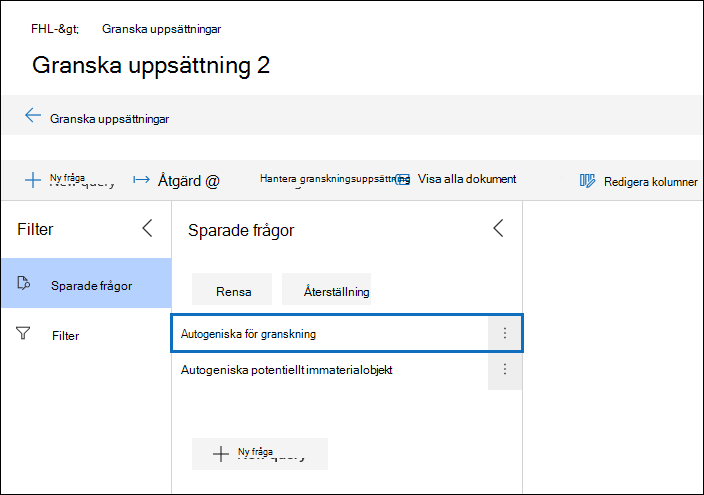

# Konfigurera sök- och analysinställningar i Advanced eDiscovery

Du kan konfigurera inställningar för varje Advanced eDiscovery för att styra följande funktioner.

- Nära dubbletter och e-posttrådning

- Teman

- Automatiskt genererad granskningsuppsättningsfråga

- Ignorera text

- Optisk teckenläsning

Så här konfigurerar du sök- och analysinställningar för ett ärende:

1. På **Advanced eDiscovery** väljer du ärendet.

2. På fliken **Inställningar,** under **Sök efter & klickar** du på **Välj**.

   Sidan med ärendeinställningar visas. De här inställningarna tillämpas på alla granskningsuppsättningar i ett ärende.

   

## Nära dubbletter och e-posttrådning

I det här avsnittet kan du ange parametrar för dubblettidentifiering, identifiering av nästan dubbletter och e-posttrådning. Mer information finns i Nära [dubblettidentifiering och](near-duplicate-detection-in-advanced-ediscovery.md) [E-posttrådning.](email-threading-in-advanced-ediscovery.md)

- **Nära dubbletter/e-posttrådar:** När kopiering av data, i närheten av dubblettidentifiering och e-posttrådning är aktiverat inkluderas det som en del av arbetsflödet när du kör analyser på data i en granskningsuppsättning.

- **Tröskelvärde för dokument- och e-post likhet:** Om likhetsnivån för två dokument är högre än tröskelvärdet sätts båda dokumenten i samma uppsättning som i närheten.

- **Lägsta/högsta antal ord:** De här inställningarna anger att när dubbletter och analys av e-posttrådning utförs endast på dokument som har minst antalet ord och som mest det maximala antalet ord.

## Teman

I det här avsnittet kan du ange parametrar för teman. Mer information finns i [Teman](themes-in-advanced-ediscovery.md).

- **Teman:** När temakluster aktiveras utförs temakluster som en del av arbetsflödet när du kör analyser på data i en granskningsuppsättning.

- **Maximalt antal teman:** Anger det maximala antalet teman som kan skapas när du kör analyser på data i en granskningsuppsättning.

- **Inkludera tal i teman:** När den är aktiverad inkluderas tal (som identifierar ett tema) när du skapar teman. 

- **Justera maximalt antal teman dynamiskt:** I vissa situationer kanske det inte finns tillräckligt många dokument i en granskningsuppsättning som ger önskat antal teman. När den här inställningen Advanced eDiscovery justeras det maximala antalet teman dynamiskt i stället för att försöka tillämpa det maximala antalet teman.

## Granska uppsättningsfråga

Om du markerar kryssrutan Skapa automatiskt en för granskning **sparad** sökning efter analys, Advanced eDiscovery automatiskt en granskningsuppsättningsfråga med namnet **För granskning.** 

Den här frågan filtrerar i princip ut dubbletter från granskningsuppsättningen. Då kan du granska unika objekt i granskningsuppsättningen. Den här frågan skapas bara när du kör analyser för en granskning som angetts i ärendet. Mer information om frågeuppsättningsfrågor finns i Skapa [en fråga för data i en granskningsuppsättning](review-set-search.md).

## Ignorera text

Det finns situationer där viss text försämrar kvaliteten på analyser, till exempel långa ansvarsfriskrivningar som läggs till i e-postmeddelanden oavsett innehållet i e-postmeddelandet. Om du känner till text som ska ignoreras kan du utesluta den från analyser genom att ange textsträngen och analysfunktionerna (Närdubbletter, E-posttrådning, Teman och Relevans) som texten ska undantas för. Du kan också använda reguljära uttryck (RegEx) som ignorerad text. 

## Optisk teckenläsning (OCR)

När den här inställningen är aktiverad körs OCR-bearbetningen på bildfiler. OCR-bearbetning körs i följande situationer:

- Om andrekterare [och icke-uppsagd datakälla](non-custodial-data-sources.md) läggs till i ett ärende. OCR-bearbetning utförs under indexeringsprocessen Avancerat. Det innebär att text i bildfiler som matchar sökvillkoren returneras i en samlingssökning.

- När innehåll från andra datakällor (som inte är kopplat till en vårdnadshavare och läggs till i ärendet i en datakälla som inte är sammanhängande) läggs till i en granskningsuppsättning.

När data läggs till i en granskningsuppsättning kan bildtext granskas, sökas, taggas och analyseras. Du kan visa den extraherade texten i textvisningsprogrammet för den valda bildfilen i granskningsuppsättningen. Mer information finns i:

- [Avancerad indexering av dokumentägardata](indexing-custodian-data.md)

- [Lägga till sökresultat i en granskningsuppsättning](add-data-to-review-set.md#optical-character-recognition)

- [Bildfiltyper som stöds](supported-filetypes-ediscovery20.md#image)
