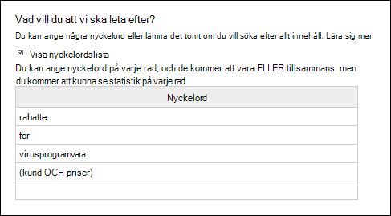
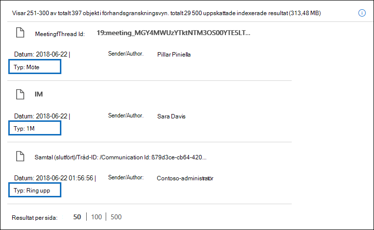
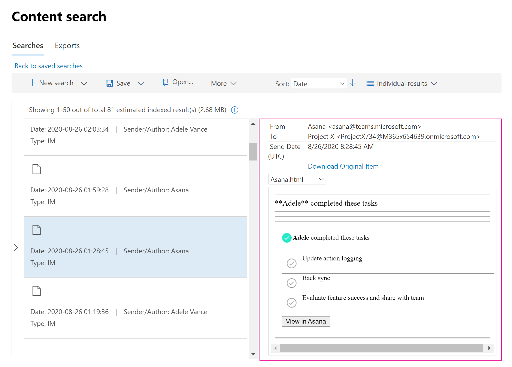
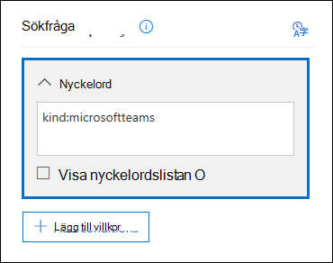
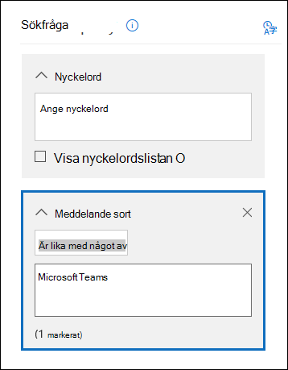
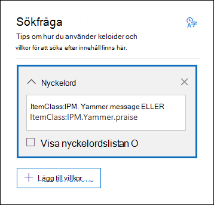
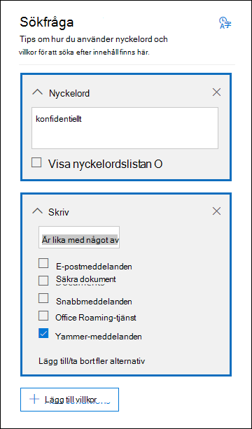

# <a name="feature-reference-for-content-search"></a><span data-ttu-id="320d9-103">Funktionsreferens för Innehållssökning</span><span class="sxs-lookup"><span data-stu-id="320d9-103">Feature reference for Content search</span></span>

<span data-ttu-id="320d9-104">I den här artikeln beskrivs funktioner och funktionalitet för innehållssökning.</span><span class="sxs-lookup"><span data-stu-id="320d9-104">This article describes features and functionality of Content search.</span></span>

## <a name="content-search-limits"></a><span data-ttu-id="320d9-105">Begränsningar för innehållssökning</span><span class="sxs-lookup"><span data-stu-id="320d9-105">Content search limits</span></span>

<span data-ttu-id="320d9-106">En beskrivning av begränsningarna för innehållssökning finns i [Begränsningar för innehållssökning](limits-for-content-search.md).</span><span class="sxs-lookup"><span data-stu-id="320d9-106">For a description of the limits that are applied to Content searches, see [Limits for Content search](limits-for-content-search.md).</span></span>

## <a name="building-a-search-query"></a><span data-ttu-id="320d9-107">Skapa en sökfråga</span><span class="sxs-lookup"><span data-stu-id="320d9-107">Building a search query</span></span>

<span data-ttu-id="320d9-108">Detaljerad information om hur du skapar en sökfråga, använder booleska sökoperatorer och sökvillkor samt söker efter olika typer av känslig information och innehåll som delas med användare utanför organisationen finns i [Nyckelordsfrågor och sökvillkor för innehållssökning ](keyword-queries-and-search-conditions.md).</span><span class="sxs-lookup"><span data-stu-id="320d9-108">For detailed information about creating a search query, using Boolean search operators and search conditions, and searching for sensitive information types and content shared with users outside your organization, see [Keyword queries and search conditions for Content Search](keyword-queries-and-search-conditions.md).</span></span>

<span data-ttu-id="320d9-109">Tänk på följande när du använder nyckelordslistan för att skapa en sökfråga.</span><span class="sxs-lookup"><span data-stu-id="320d9-109">Keep the following things in mind when using the keyword list to create a search query.</span></span>

- <span data-ttu-id="320d9-110">Du måste markera kryssrutan **Visa nyckelordslista** och sedan skriva varje nyckelord på en separat rad när du skapar en sökfråga där nyckelorden (eller nyckelordsfraserna) på varje rad har kopplats samman med operatorn **OR**.</span><span class="sxs-lookup"><span data-stu-id="320d9-110">You have to select the **Show keyword list** checkbox and then type each keyword in a separate row to create a search query where the keywords (or keyword phrases) in each row are connected by the **OR** operator.</span></span> <span data-ttu-id="320d9-111">Om du klistrar in en lista med nyckelord i nyckelordsrutan eller trycker på **Retur** när du har skrivit ett nyckelord kopplas de inte samman med operatorn **OR**.</span><span class="sxs-lookup"><span data-stu-id="320d9-111">If you paste a list of keywords in the keyword box or press the **Enter** key after typing a keyword, they won't be connected by the **OR** operator.</span></span> <span data-ttu-id="320d9-112">Här är ett felaktigt och ett korrekt exempel på hur du lägger till en lista med nyckelord.</span><span class="sxs-lookup"><span data-stu-id="320d9-112">Here are incorrect and correct examples of how to add a list of keywords.</span></span>

    <span data-ttu-id="320d9-113">**Fel**</span><span class="sxs-lookup"><span data-stu-id="320d9-113">**Incorrect**</span></span>

    

    <span data-ttu-id="320d9-115">**Rätt**</span><span class="sxs-lookup"><span data-stu-id="320d9-115">**Correct**</span></span>

    

- <span data-ttu-id="320d9-117">Du kan också förbereda en lista med nyckelord eller nyckelordsfraser i en Excel-fil eller en fil med oformaterad text och sedan kopiera och klistra in listan i nyckelordslistan.</span><span class="sxs-lookup"><span data-stu-id="320d9-117">You can also prepare a list of keywords or keyword phrases in an Excel file or a plain text file, and then copy and paste your list into the keyword list.</span></span> <span data-ttu-id="320d9-118">För att göra det måste du markera kryssrutan **Visa nyckelordslista**.</span><span class="sxs-lookup"><span data-stu-id="320d9-118">To do this, you have to select the **Show keyword list** check box.</span></span> <span data-ttu-id="320d9-119">Klicka sedan på den första raden i nyckelordslistan och klistra in listan.</span><span class="sxs-lookup"><span data-stu-id="320d9-119">Then, click the first row in the keyword list and paste your list.</span></span> <span data-ttu-id="320d9-120">Varje rad från Excel eller textfilen klistras in på en separat rad i nyckelordslistan.</span><span class="sxs-lookup"><span data-stu-id="320d9-120">Each line from the Excel or text file is pasted into separate row in the keyword list.</span></span>

- <span data-ttu-id="320d9-121">När du har skapat en fråga med hjälp av nyckelordslistan bör du kontrollera frågesyntaxen för att försäkra dig om att sökfrågan ser ut som du tänkt dig.</span><span class="sxs-lookup"><span data-stu-id="320d9-121">After you create a query using the keyword list, it's a good idea to verify the search query syntax to make the search query is what you intended.</span></span> <span data-ttu-id="320d9-122">I sökfrågan som visas under **Fråga** i informationsfönstret avgränsas nyckelorden med texten **(c:s)**.</span><span class="sxs-lookup"><span data-stu-id="320d9-122">In the search query that's displayed under **Query** in the details pane, the keywords are separated by the text **(c:s)**.</span></span> <span data-ttu-id="320d9-123">Detta anger att nyckelorden är sammankopplade med en logisk operator som har en liknande funktion som operatorn **OR**.</span><span class="sxs-lookup"><span data-stu-id="320d9-123">This indicates that the keywords are connected by a logical operator similar in functionality to the **OR** operator.</span></span> <span data-ttu-id="320d9-124">Och om sökfrågan innehåller villkor avgränsas nyckelorden och villkoren med texten **(c:c)**.</span><span class="sxs-lookup"><span data-stu-id="320d9-124">Similarly, if your search query includes conditions, the keywords and the conditions are separated by the text **(c:c)**.</span></span> <span data-ttu-id="320d9-125">Detta anger att nyckelorden är sammankopplade med en logisk operator som har en liknande funktion som operatorn **AND**.</span><span class="sxs-lookup"><span data-stu-id="320d9-125">This indicates that the keywords are connected to the conditions with a logical operator similar in functionality to the **AND** operator.</span></span> <span data-ttu-id="320d9-126">Här är ett exempel på hur en sökfråga (visas i informationsfönstret) kan se ut när du använder nyckelordslistan och ett villkor.</span><span class="sxs-lookup"><span data-stu-id="320d9-126">Here's an example of the search query (displayed in the Details pane) that results when using the keyword list and a condition.</span></span>

    

- <span data-ttu-id="320d9-128">När du kör en innehållssökning söker Microsoft 365 automatiskt igenom din sökfråga efter tecken som inte stöds och efter booleska operatorer som inte är versaler.</span><span class="sxs-lookup"><span data-stu-id="320d9-128">When you run a content search, Microsoft 365 automatically checks your search query for unsupported characters and for Boolean operators that may not be capitalized.</span></span> <span data-ttu-id="320d9-129">Tecken som inte stöds är ofta dolda och leder vanligtvis till sökfel eller returnerar oväntade resultat.</span><span class="sxs-lookup"><span data-stu-id="320d9-129">Unsupported characters are often hidden and typically cause a search error or return unintended results.</span></span> <span data-ttu-id="320d9-130">Mer information om vilka tecken som kontrolleras finns i [Kontrollera om det finns fel i din innehållssökningsfråga](check-your-content-search-query-for-errors.md).</span><span class="sxs-lookup"><span data-stu-id="320d9-130">For more information about the unsupported characters that are checked, see [Check your Content Search query for errors](check-your-content-search-query-for-errors.md).</span></span>

- <span data-ttu-id="320d9-131">Om din sökfråga innehåller nyckelord med icke-engelska tecken (till exempel kinesiska tecken) kan du klicka på **Frågespråk-land/region** och välja en kod (i formatet språk-land/region) för sökningen.</span><span class="sxs-lookup"><span data-stu-id="320d9-131">If you have a search query that contains keywords for non-English characters (such as Chinese characters), you can click **Query language-country/region** and select a language-country culture code value for the search.</span></span> <span data-ttu-id="320d9-132">Standardalternativet för språk/region är neutralt.</span><span class="sxs-lookup"><span data-stu-id="320d9-132">The default language/region is neutral.</span></span> <span data-ttu-id="320d9-133">Hur vet du om du behöver ändra språkinställningen för en innehållssökning?</span><span class="sxs-lookup"><span data-stu-id="320d9-133">How can you tell if you need to change the language setting for a content search?</span></span> <span data-ttu-id="320d9-134">Om du vet att vissa innehållsplatser som du söker på innehåller icke-engelska tecken och sökningen inte returnerar några resultat kan det bero på språkinställningen.</span><span class="sxs-lookup"><span data-stu-id="320d9-134">If you're certain content locations contain the non-English characters you're searching for, but the search returns no results, the language setting may be the cause.</span></span>

## <a name="partially-indexed-items"></a><span data-ttu-id="320d9-135">Delvis indexerade objekt</span><span class="sxs-lookup"><span data-stu-id="320d9-135">Partially indexed items</span></span>

- <span data-ttu-id="320d9-136">Delvis indexerade objekt i postlådor tas med i de uppskattade sökresultaten.</span><span class="sxs-lookup"><span data-stu-id="320d9-136">Partially indexed items in mailboxes are included in the estimated search results.</span></span> <span data-ttu-id="320d9-137">Delvis indexerade objekt från SharePoint och OneDrive tas inte med i de uppskattade sökresultaten.</span><span class="sxs-lookup"><span data-stu-id="320d9-137">Partially indexed items from SharePoint and OneDrive aren't included in the estimated search results.</span></span> <span data-ttu-id="320d9-138">Mer information finns i [Delvis indexerade objekt i eDiscovery](partially-indexed-items-in-content-search.md).</span><span class="sxs-lookup"><span data-stu-id="320d9-138">For more information, see [Partially indexed items in eDiscovery](partially-indexed-items-in-content-search.md).</span></span>

## <a name="searching-onedrive-accounts"></a><span data-ttu-id="320d9-139">Söka i OneDrive-konton</span><span class="sxs-lookup"><span data-stu-id="320d9-139">Searching OneDrive accounts</span></span>

- <span data-ttu-id="320d9-140">Information om hur du samlar in en lista med URL-adresser för OneDrive-webbplatserna i organisationen finns i [Skapa en lista över alla OneDrive-platser i organisationen](/onedrive/list-onedrive-urls).</span><span class="sxs-lookup"><span data-stu-id="320d9-140">To collect a list of the URLs for the OneDrive sites in your organization, see [Create a list of all OneDrive locations in your organization](/onedrive/list-onedrive-urls).</span></span> <span data-ttu-id="320d9-141">Med skriptet i den här artikeln skapas en textfil som innehåller en lista över alla OneDrive-webbplatser.</span><span class="sxs-lookup"><span data-stu-id="320d9-141">This script in this article creates a text file that contains a list of all OneDrive sites.</span></span> <span data-ttu-id="320d9-142">Om du vill köra det här skriptet måste du installera och använda SharePoint Online Management Shell.</span><span class="sxs-lookup"><span data-stu-id="320d9-142">To run this script, you have to install and use the SharePoint Online Management Shell.</span></span> <span data-ttu-id="320d9-143">Se till att du lägger till URL-adressen för organisationens Min Webbplats-domän för alla OneDrive-webbplatser som du vill söka på.</span><span class="sxs-lookup"><span data-stu-id="320d9-143">Be sure to append the URL for your organization's MySite domain to each OneDrive site that you want to search.</span></span> <span data-ttu-id="320d9-144">Det här är domänen som innehåller alla dina OneDrive-webbplatser, till exempel `https://contoso-my.sharepoint.com`.</span><span class="sxs-lookup"><span data-stu-id="320d9-144">This is the domain that contains all your OneDrive; for example,  `https://contoso-my.sharepoint.com`.</span></span> <span data-ttu-id="320d9-145">Exempel på en URL-adress för en användares OneDrive-webbplats: `https://contoso-my.sharepoint.com/personal/sarad_contoso_onmicrosoft.com`.</span><span class="sxs-lookup"><span data-stu-id="320d9-145">Here's an example of a URL for a user's OneDrive site:  `https://contoso-my.sharepoint.com/personal/sarad_contoso_onmicrosoft.com`.</span></span>

    <span data-ttu-id="320d9-146">Om ett användarhuvudnamn (UPN) ändras, vilket är ovanligt, ändras URL-adressen för användarens OneDrive-plats för att ta med det nya användarhuvudnamnet.</span><span class="sxs-lookup"><span data-stu-id="320d9-146">In the rare case of a person's user principal name (UPN) being changed, the URL for their OneDrive location is changed to incorporate the new UPN.</span></span> <span data-ttu-id="320d9-147">I så fall måste du ändra innehållssökningen genom att lägga till användarens nya OneDrive-URL och ta bort den gamla.</span><span class="sxs-lookup"><span data-stu-id="320d9-147">If this happens, you have to modify a content search by adding the user's new OneDrive URL and removing the old one.</span></span> <span data-ttu-id="320d9-148">Mer information finns i [Hur UPN-ändringar påverkar OneDrive-URL:en](/onedrive/upn-changes).</span><span class="sxs-lookup"><span data-stu-id="320d9-148">For more information, see [How UPN changes affect the OneDrive URL](/onedrive/upn-changes).</span></span>

## <a name="searching-microsoft-teams-and-microsoft-365-groups"></a><span data-ttu-id="320d9-149">Söka i Microsoft Teams och Microsoft 365-grupper</span><span class="sxs-lookup"><span data-stu-id="320d9-149">Searching Microsoft Teams and Microsoft 365 Groups</span></span>

<span data-ttu-id="320d9-150">Du kan söka i postlådan som är kopplad till ett Microsoft Teams-team eller en Microsoft 365-grupp.</span><span class="sxs-lookup"><span data-stu-id="320d9-150">You can search the mailbox that's associated with a Microsoft Team or Microsoft 365 Group.</span></span> <span data-ttu-id="320d9-151">Eftersom Microsoft Teams-team bygger på Microsoft 365-grupper fungerar sökningen i dem på liknande sätt.</span><span class="sxs-lookup"><span data-stu-id="320d9-151">Because Microsoft Teams is built on Microsoft 365 Groups, searching them is similar.</span></span> <span data-ttu-id="320d9-152">I båda fallen genomsöks bara gruppens eller teamets postlåda.</span><span class="sxs-lookup"><span data-stu-id="320d9-152">In both cases, only the group or team mailbox is searched.</span></span> <span data-ttu-id="320d9-153">Grupp- eller teammedlemmarnas postlådor genomsöks inte.</span><span class="sxs-lookup"><span data-stu-id="320d9-153">The mailboxes of the group or team members aren't searched.</span></span> <span data-ttu-id="320d9-154">Om du vill söka i dem måste du lägga till dem i sökningen.</span><span class="sxs-lookup"><span data-stu-id="320d9-154">To search them, you have to specifically add them to the search.</span></span>

<span data-ttu-id="320d9-155">Tänk på följande när du söker efter innehåll i Microsoft Teams-team och Microsoft 365-grupper.</span><span class="sxs-lookup"><span data-stu-id="320d9-155">Keep the following things in mind when searching for content in Microsoft Teams and Microsoft 365 Groups.</span></span>

- <span data-ttu-id="320d9-156">Om du vill söka efter innehåll i Teams-team och Microsoft 365-grupper måste du ange postlådan och SharePoint-webbplatsen som är kopplade till en grupp.</span><span class="sxs-lookup"><span data-stu-id="320d9-156">To search for content located in Teams and Microsoft 365 Groups, you have to specify the mailbox and SharePoint site that are associated with a team or group.</span></span>

- <span data-ttu-id="320d9-157">Innehåll från privata kanaler lagras i varje användares postlåda, inte i den gemensamma postlådan.</span><span class="sxs-lookup"><span data-stu-id="320d9-157">Content from private channels is stored in each user's mailbox, not the team mailbox.</span></span> <span data-ttu-id="320d9-158">Om du vill söka efter innehåll i privata kanaler kan du se [eDiscovery för privata kanaler](/microsoftteams/ediscovery-investigation#ediscovery-of-private-channels).</span><span class="sxs-lookup"><span data-stu-id="320d9-158">To search for content in private channels, see [eDiscovery of private channels](/microsoftteams/ediscovery-investigation#ediscovery-of-private-channels).</span></span>

- <span data-ttu-id="320d9-159">Kör cmdleten **Get-UnifiedGroup** i Exchange Online om du vill visa egenskaper för ett team eller en Microsoft 365-grupp.</span><span class="sxs-lookup"><span data-stu-id="320d9-159">Run the **Get-UnifiedGroup** cmdlet in Exchange Online to view properties for a team or a Microsoft 365 Group.</span></span> <span data-ttu-id="320d9-160">Det här är ett bra sätt att hämta URL-adressen för den webbplatsen som är kopplad till ett team eller en grupp.</span><span class="sxs-lookup"><span data-stu-id="320d9-160">This is a good way to get the URL for the site that's associated with a team or a group.</span></span> <span data-ttu-id="320d9-161">Följande kommando visar till exempel valda egenskaper för en Microsoft 365-grupp som heter Senior Leadership Team:</span><span class="sxs-lookup"><span data-stu-id="320d9-161">For example, the following command displays selected properties for a Microsoft 365 Group named Senior Leadership Team:</span></span>

  ```text
  Get-UnifiedGroup "Senior Leadership Team" | FL DisplayName,Alias,PrimarySmtpAddress,SharePointSiteUrl
  DisplayName            : Senior Leadership Team
  Alias                  : seniorleadershipteam
  PrimarySmtpAddress     : seniorleadershipteam@contoso.onmicrosoft.com
  SharePointSiteUrl      : https://contoso.sharepoint.com/sites/seniorleadershipteam
  ```

    > [!NOTE]
    > <span data-ttu-id="320d9-162">För att kunna köra cmdleten **Get-UnifiedGroup** måste du ha tilldelats rollen View-Only Recipients i Exchange Online eller vara medlem i en rollgrupp som har tilldelats rollen View-Only Recipients.</span><span class="sxs-lookup"><span data-stu-id="320d9-162">To run the **Get-UnifiedGroup** cmdlet, you have to be assigned the View-Only Recipients role in Exchange Online or be a member of a role group that's assigned the View-Only Recipients role.</span></span>

- <span data-ttu-id="320d9-163">Vid en genomsökning av en användares postlåda genomsöks inte något team eller någon Microsoft 365-grupp som användaren är medlem i.</span><span class="sxs-lookup"><span data-stu-id="320d9-163">When a user's mailbox is searched, any team or Microsoft 365 Group that the user is a member of won't be searched.</span></span> <span data-ttu-id="320d9-164">Och när du söker i ett team eller i en Microsoft 365-grupp genomsöks bara den gruppostlåda och gruppwebbplats som du anger.</span><span class="sxs-lookup"><span data-stu-id="320d9-164">Similarly, when you search a team or a Microsoft 365 Group, only the group mailbox and group site that you specify is searched.</span></span> <span data-ttu-id="320d9-165">Gruppmedlemmarnas postlådor och OneDrive för företag-konton genomsöks inte, såvida du inte uttryckligen lägger till dem i sökningen.</span><span class="sxs-lookup"><span data-stu-id="320d9-165">The mailboxes and OneDrive for Business accounts of group members aren't searched unless you explicitly add them to the search.</span></span>

- <span data-ttu-id="320d9-166">Om du vill hämta en lista över medlemmarna i ett team eller i en Microsoft 365-grupp kan du visa egenskaperna på sidan **Start \> Grupper** i Administrationscenter för Microsoft 365.</span><span class="sxs-lookup"><span data-stu-id="320d9-166">To get a list of the members of a team or a Microsoft 365 Group, you can view the properties on the **Home \> Groups** page in the Microsoft 365 admin center.</span></span> <span data-ttu-id="320d9-167">Eller så kan du köra följande kommando i Exchange Online PowerShell:</span><span class="sxs-lookup"><span data-stu-id="320d9-167">Alternatively, you can run the following command in Exchange Online PowerShell:</span></span>

  ```powershell
  Get-UnifiedGroupLinks <group or team name> -LinkType Members | FL DisplayName,PrimarySmtpAddress
  ```

    > [!NOTE]
    > <span data-ttu-id="320d9-168">För att kunna köra cmdleten **Get-UnifiedGroupLinks** måste du ha tilldelats rollen View-Only Recipients i Exchange Online eller vara medlem i en rollgrupp som har tilldelats rollen View-Only Recipients.</span><span class="sxs-lookup"><span data-stu-id="320d9-168">To run the **Get-UnifiedGroupLinks** cmdlet, you have to be assigned the View-Only Recipients role in Exchange Online or be a member of a role group that's assigned the View-Only Recipients role.</span></span>

- <span data-ttu-id="320d9-169">De konversationer som ingår i en Teams-kanal lagras i postlådan som är kopplad till teamet.</span><span class="sxs-lookup"><span data-stu-id="320d9-169">Conversations that are part of a Teams channel are stored in the mailbox that's associated with the team.</span></span> <span data-ttu-id="320d9-170">På samma sätt lagras filer som teammedlemmar delar i en kanal på teamets SharePoint-webbplats.</span><span class="sxs-lookup"><span data-stu-id="320d9-170">Similarly, files that team members share in a channel are stored on the team's SharePoint site.</span></span> <span data-ttu-id="320d9-171">Därför måste du lägga till teampostlådan och SharePoint-webbplatsen som en innehållsplats när du ska söka efter konversationer och filer i en kanal.</span><span class="sxs-lookup"><span data-stu-id="320d9-171">Therefore, you have to add the team mailbox and SharePoint site as a content location to search conversations and files in a channel.</span></span>

- <span data-ttu-id="320d9-172">Du kan också lagra konversationer som ingår i chattlistan i Teams i Exchange Online-postlådan för de användare som deltar i chatten.</span><span class="sxs-lookup"><span data-stu-id="320d9-172">Alternatively, conversations that are part of the Chat list in Teams are stored in the Exchange Online mailbox of the users who participate in the chat.</span></span> <span data-ttu-id="320d9-173">Och de filer som en användare delar i chattkonversationer lagras i OneDrive för företag-kontot för den användare som delar filen.</span><span class="sxs-lookup"><span data-stu-id="320d9-173">And files that a user shares in Chat conversations are stored in the OneDrive for Business account of the user who shares the file.</span></span> <span data-ttu-id="320d9-174">Därför måste du lägga till enskilda användarpostlådor och OneDrive för företag-konton som innehållsplatser när du söker i konversationer och filer i chattlistan.</span><span class="sxs-lookup"><span data-stu-id="320d9-174">Therefore, you have to add the individual user mailboxes and OneDrive for Business accounts as content locations to search conversations and files in the Chat list.</span></span>

    > [!NOTE]
    > <span data-ttu-id="320d9-175">I en Exchange-hybriddistribution kan användare med en lokal postlåda delta i konversationer som ingår i chattlistan i Teams.</span><span class="sxs-lookup"><span data-stu-id="320d9-175">In an Exchange hybrid deployment, users with an on-premises mailbox might participate in conversations that are part of the Chat list in Teams.</span></span> <span data-ttu-id="320d9-176">I så fall är innehållet i dessa konversationer också sökbart eftersom det sparas på en molnbaserad lagringsplats (en så kallad *molnbaserad postlåda för lokala användare*) för användare som har en lokal postlåda.</span><span class="sxs-lookup"><span data-stu-id="320d9-176">In this case, content from these conversations is also searchable because it's saved to a cloud-based storage area (called a *cloud-based mailbox for on-premises users*) for users who have an on-premises mailbox.</span></span> <span data-ttu-id="320d9-177">Mer information finns i [Söka efter Teams chattdata för lokala användare](search-cloud-based-mailboxes-for-on-premises-users.md).</span><span class="sxs-lookup"><span data-stu-id="320d9-177">For more information, see [Search for Teams chat data for on-premises users](search-cloud-based-mailboxes-for-on-premises-users.md).</span></span>

- <span data-ttu-id="320d9-178">Alla team- och gruppkanaler innehåller en wiki-sida för anteckningar och samarbete.</span><span class="sxs-lookup"><span data-stu-id="320d9-178">Every team or team channel contains a Wiki for note-taking and collaboration.</span></span> <span data-ttu-id="320d9-179">Wiki-innehållet sparas automatiskt i en MHT-fil.</span><span class="sxs-lookup"><span data-stu-id="320d9-179">The Wiki content is automatically saved to a file with a .mht format.</span></span> <span data-ttu-id="320d9-180">Den här filen lagras i dokumentbiblioteket för Teams-wikidata på teamets SharePoint-webbplats.</span><span class="sxs-lookup"><span data-stu-id="320d9-180">This file is stored in the Teams Wiki Data document library on the team's SharePoint site.</span></span> <span data-ttu-id="320d9-181">Med verktyget Innehållssökning kan du söka på wiki-sidan genom att ange teamets SharePoint-webbplats som innehållsplats för sökning.</span><span class="sxs-lookup"><span data-stu-id="320d9-181">You can use the Content Search tool to search the Wiki by specifying the team's SharePoint site as the content location to search.</span></span>

    > [!NOTE]
    > <span data-ttu-id="320d9-182">Möjligheten att söka på wiki-sidan för en grupp eller kanal (när du söker på teamets SharePoint-webbplats) släpptes den 22 juni 2017.</span><span class="sxs-lookup"><span data-stu-id="320d9-182">The capability to search the Wiki for a team or channel (when you search the team's SharePoint site) was released on June 22, 2017.</span></span> <span data-ttu-id="320d9-183">Du kan söka på wiki-sidor som sparats eller uppdaterats från och med det datumet.</span><span class="sxs-lookup"><span data-stu-id="320d9-183">Wiki pages that were saved or updated on that date or after are available to be searched.</span></span> <span data-ttu-id="320d9-184">Du kan inte söka på wiki-sidor som sparats eller uppdaterats före det datumet.</span><span class="sxs-lookup"><span data-stu-id="320d9-184">Wiki pages last saved or updated before that date aren't available for search.</span></span>

- <span data-ttu-id="320d9-185">Sammanfattningsinformation för möten och samtal i en Teams-kanal lagras också i postlådorna för de användare som har ringt in till mötet eller samtalet.</span><span class="sxs-lookup"><span data-stu-id="320d9-185">Summary information for meetings and calls in a Teams channel are also stored in the mailboxes of users who dialed into the meeting or call.</span></span> <span data-ttu-id="320d9-186">Det betyder att du kan använda innehållssökning för att söka i sammanfattningsposterna.</span><span class="sxs-lookup"><span data-stu-id="320d9-186">This means you can use Content Search to search these summary records.</span></span> <span data-ttu-id="320d9-187">Sammanfattningsinformation omfattar:</span><span class="sxs-lookup"><span data-stu-id="320d9-187">Summary information includes:</span></span>

  - <span data-ttu-id="320d9-188">Datum, startdatum, sluttid och varaktighet för ett möte eller samtal</span><span class="sxs-lookup"><span data-stu-id="320d9-188">Date, start time, end time, and duration of a meeting or call</span></span>

  - <span data-ttu-id="320d9-189">Datum och tid då varje deltagare gick med i eller lämnade mötet eller samtalet</span><span class="sxs-lookup"><span data-stu-id="320d9-189">The date and time when each participant joined or left the meeting or call</span></span>

  - <span data-ttu-id="320d9-190">Samtal som skickats till röstbrevlådan</span><span class="sxs-lookup"><span data-stu-id="320d9-190">Calls sent to voice mail</span></span>

  - <span data-ttu-id="320d9-191">Missade eller obesvarade samtal</span><span class="sxs-lookup"><span data-stu-id="320d9-191">Missed or unanswered calls</span></span>

  - <span data-ttu-id="320d9-192">Vidarekopplingar av samtal (visas som två separata samtal)</span><span class="sxs-lookup"><span data-stu-id="320d9-192">Call transfers, which are represented as two separate calls</span></span>

  <span data-ttu-id="320d9-193">Det kan ta upp till 8 timmar innan sammanfattningsposterna för möten och samtal blir tillgängliga för sökning.</span><span class="sxs-lookup"><span data-stu-id="320d9-193">It can take up to 8 hours for meeting and call summary records to be available to be searched.</span></span>

  <span data-ttu-id="320d9-194">Mötessammanfattningar identifieras som **Möte** i fältet **Typ** i sökresultat och samtalssammanfattningar identifieras som **Samtal**.</span><span class="sxs-lookup"><span data-stu-id="320d9-194">In the search results, meeting summaries are identified as **Meeting** in the **Type field**, and call summaries are identified as **Call**.</span></span> <span data-ttu-id="320d9-195">Konversationer som ingår i en Teams-kanal och gruppchattar identifieras som **Snabbmeddelande** i fältet **Typ**.</span><span class="sxs-lookup"><span data-stu-id="320d9-195">Also, conversations that are part of a Teams channel and 1xN chats are identified as **IM** in the **Type** field.</span></span>

  

   <span data-ttu-id="320d9-197">Mer information finns i artikeln [Microsoft Teams lanserar eDiscovery för samtal och möten](https://techcommunity.microsoft.com/t5/microsoft-teams-blog/microsoft-teams-launches-ediscovery-for-calling-and-meetings/ba-p/210947).</span><span class="sxs-lookup"><span data-stu-id="320d9-197">For more information, see [Microsoft Teams launches eDiscovery for calls and meetings](https://techcommunity.microsoft.com/t5/microsoft-teams-blog/microsoft-teams-launches-ediscovery-for-calling-and-meetings/ba-p/210947).</span></span>

- <span data-ttu-id="320d9-198">Kortinnehåll som genereras av appar i Teams-kanaler, enskilda chattar och gruppchattar lagras i postlådor och är sökbara.</span><span class="sxs-lookup"><span data-stu-id="320d9-198">Card content generated by apps in Teams channels, 1:1 chats, and 1xN chats is stored in mailboxes and can be searched.</span></span> <span data-ttu-id="320d9-199">Ett *kort* är en användargränssnittsbehållare för ett litet innehåll.</span><span class="sxs-lookup"><span data-stu-id="320d9-199">A *card* is a UI container for short pieces of content.</span></span> <span data-ttu-id="320d9-200">Kort kan ha flera egenskaper och bifogade filer, och kan innehålla knappar som kan utlösa kortåtgärder.</span><span class="sxs-lookup"><span data-stu-id="320d9-200">Cards can have multiple properties and attachments, and can include buttons that can trigger card actions.</span></span> <span data-ttu-id="320d9-201">Mer information finns i [Kort](/microsoftteams/platform/task-modules-and-cards/what-are-cards)</span><span class="sxs-lookup"><span data-stu-id="320d9-201">For more information, see [Cards](/microsoftteams/platform/task-modules-and-cards/what-are-cards)</span></span>

  <span data-ttu-id="320d9-202">Precis som annat Teams-innehåll beror lagringen av kortinnehållet på var kortet användes.</span><span class="sxs-lookup"><span data-stu-id="320d9-202">Like other Teams content, where card content is stored is based on where the card was used.</span></span> <span data-ttu-id="320d9-203">Innehållet för kort som används i en Teams-kanal lagras i Teams-gruppostlådan.</span><span class="sxs-lookup"><span data-stu-id="320d9-203">Content for cards used in a Teams channel is stored in the Teams group mailbox.</span></span> <span data-ttu-id="320d9-204">Kortinnehållet för enskilda chattar och gruppchattar lagras i chattdeltagarnas postlådor.</span><span class="sxs-lookup"><span data-stu-id="320d9-204">Card content for 1:1 and 1xN chats are stored in the mailboxes of the chat participants.</span></span>

  <span data-ttu-id="320d9-205">Om du vill söka efter kortinnehåll kan du använda `kind:microsoftteams`- eller `itemclass:IPM.SkypeTeams.Message`-sökvillkor.</span><span class="sxs-lookup"><span data-stu-id="320d9-205">To search for card content, you can use the `kind:microsoftteams` or `itemclass:IPM.SkypeTeams.Message` search conditions.</span></span> <span data-ttu-id="320d9-206">När du granskar sökresultat har kortinnehåll som genererats av robotar i en Teams-kanal **Avsändare/författare**-e-postegenskapen `<appname>@teams.microsoft.com`, där `appname` är namnet på appen som genererade kortinnehållet.</span><span class="sxs-lookup"><span data-stu-id="320d9-206">When reviewing search results, card content generated by bots in a Teams channel have the **Sender/Author** email property as `<appname>@teams.microsoft.com`, where `appname` is the name of the app that generated the card content.</span></span> <span data-ttu-id="320d9-207">Om kortinnehållet genererades av en användare identifierar **Avsändare/författare** användaren.</span><span class="sxs-lookup"><span data-stu-id="320d9-207">If card content was generated by a user, the value of **Sender/Author** identifies the user.</span></span>

  <span data-ttu-id="320d9-208">När du visar kortinnehåll i innehållssökningsresultat visas innehållet som en bifogad fil i meddelandet.</span><span class="sxs-lookup"><span data-stu-id="320d9-208">When viewing card content in Content search results, the content appears as an attachment to the message.</span></span> <span data-ttu-id="320d9-209">Den bifogade filen heter `appname.html`, där `appname` är namnet på appen som genererade kortinnehållet.</span><span class="sxs-lookup"><span data-stu-id="320d9-209">The attachment is named `appname.html`, where `appname` is the name of the app that generated the card content.</span></span> <span data-ttu-id="320d9-210">Följande skärmbilder visar hur kortinnehåll (för en app som heter Asana) visas i Teams och i resultatet av en sökning.</span><span class="sxs-lookup"><span data-stu-id="320d9-210">The following screenshots show how card content (for an app named Asana) appears in Teams and in the results of a search.</span></span>

  <span data-ttu-id="320d9-211">**Kortinnehåll i Teams**</span><span class="sxs-lookup"><span data-stu-id="320d9-211">**Card content in Teams**</span></span>

  

  <span data-ttu-id="320d9-213">**Kortinnehåll i sökresultat**</span><span class="sxs-lookup"><span data-stu-id="320d9-213">**Card content in search results**</span></span>

  

  > [!NOTE]
  > <span data-ttu-id="320d9-215">Om du vill visa bilder från kortinnehåll i sökresultat (till exempel bockmarkeringarna på föregående skärmbild) måste du vara inloggad i Teams (på https://teams.microsoft.com) på en annan flik i samma webbläsarsession som du använder för att visa sökresultaten.</span><span class="sxs-lookup"><span data-stu-id="320d9-215">To display images from card content in search results at this time (such as the checkmarks in the previous screenshot), you have to be signed into Teams (at https://teams.microsoft.com) in a different tab in the same browser session that you use to view the search results.</span></span> <span data-ttu-id="320d9-216">Annars visas bildplatshållare.</span><span class="sxs-lookup"><span data-stu-id="320d9-216">Otherwise, image placeholders are displayed.</span></span>

- <span data-ttu-id="320d9-217">Du kan använda e-postegenskapen **Kind** eller sökvillkoret **Meddelandetyp** för att söka specifikt efter innehåll i Teams.</span><span class="sxs-lookup"><span data-stu-id="320d9-217">You can use the **Kind** email property or the **Message kind** search condition to search specifically for content in Teams.</span></span>

  - <span data-ttu-id="320d9-218">Om du vill använda egenskapen **Kind** i en nyckelordsfråga skriver du `kind:microsoftteams` i rutan **Nyckelord** för en sökfråga.</span><span class="sxs-lookup"><span data-stu-id="320d9-218">To use the **Kind** property as part of the keyword search query, in the **Keywords** box of a search query, type `kind:microsoftteams`.</span></span>

    

  - <span data-ttu-id="320d9-220">Om du vill använda ett sökvillkor lägger du till **Meddelandetyp** och använder värdet `microsoftteams`.</span><span class="sxs-lookup"><span data-stu-id="320d9-220">To use a search condition, add the **Message kind** condition and use the value `microsoftteams`.</span></span>

    

   <span data-ttu-id="320d9-222">Villkor är logiskt kopplade till nyckelordsfrågan med operatorn **AND**.</span><span class="sxs-lookup"><span data-stu-id="320d9-222">Conditions are logically connected to the keyword query by the **AND** operator.</span></span> <span data-ttu-id="320d9-223">Det innebär att ett objekt måste matcha både nyckelordsfrågan och sökvillkoret för att returneras i sökresultatet.</span><span class="sxs-lookup"><span data-stu-id="320d9-223">That means an item must match both the keyword query and the search condition to be returned in the search results.</span></span> <span data-ttu-id="320d9-224">Mer information finns i avsnittet ”Riktlinjer för användning av villkor” i [Nyckelordsfrågor och sökvillkor för innehållssökning.](keyword-queries-and-search-conditions.md#guidelines-for-using-conditions)</span><span class="sxs-lookup"><span data-stu-id="320d9-224">For more information, see the "Guidelines for using conditions" section in [Keyword queries and search conditions for Content Search.](keyword-queries-and-search-conditions.md#guidelines-for-using-conditions)</span></span>

## <a name="searching-yammer-groups"></a><span data-ttu-id="320d9-225">Söka i Yammer-grupper</span><span class="sxs-lookup"><span data-stu-id="320d9-225">Searching Yammer Groups</span></span>

<span data-ttu-id="320d9-226">Du kan använda e-postegenskapen **ItemClass** eller sökvillkoret **Typ** för att söka specifikt efter konversationsobjekt i Yammer-grupper.</span><span class="sxs-lookup"><span data-stu-id="320d9-226">You can use the **ItemClass** email property or the **Type** search condition to search specifically for conversation items in Yammer Groups.</span></span>

  - <span data-ttu-id="320d9-227">Om du vill använda egenskapen **ItemClass** i nyckelordsfrågan kan du skriva ett (eller alla) av följande egenskap:värde-par i rutan **Nyckelord** i en sökfråga:</span><span class="sxs-lookup"><span data-stu-id="320d9-227">To use the **ItemClass** property as part of the keyword search query, in the **Keywords** box of a search query, you can type one (or all) of the following property:value pairs:</span></span>

     - <span data-ttu-id="320d9-228">ItemClass:IPM.Yammer.message</span><span class="sxs-lookup"><span data-stu-id="320d9-228">ItemClass:IPM.Yammer.message</span></span>
     - <span data-ttu-id="320d9-229">ItemClass:IPM.Yammer.poll</span><span class="sxs-lookup"><span data-stu-id="320d9-229">ItemClass:IPM.Yammer.poll</span></span>
     - <span data-ttu-id="320d9-230">ItemClass:IPM.Yammer.praise</span><span class="sxs-lookup"><span data-stu-id="320d9-230">ItemClass:IPM.Yammer.praise</span></span>
     - <span data-ttu-id="320d9-231">ItemClass:IPM.Yammer.question</span><span class="sxs-lookup"><span data-stu-id="320d9-231">ItemClass:IPM.Yammer.question</span></span>

    <span data-ttu-id="320d9-232">Du kan till exempel använda följande sökfråga för att returnera Yammer-meddelanden och Yammer-beröm:</span><span class="sxs-lookup"><span data-stu-id="320d9-232">For example, you can use the following search query to return Yammer messages and Yammer praise items:</span></span>

    

  - <span data-ttu-id="320d9-234">Du kan också använda e-postvillkoret **Typ** och välja **Yammer-meddelanden** om du vill returnera Yammer-objekt.</span><span class="sxs-lookup"><span data-stu-id="320d9-234">Alternatively, you can use the **Type** email condition and select **Yammer messages** to return Yammer items.</span></span> <span data-ttu-id="320d9-235">Följande sökfråga returnerar till exempel alla Yammer-konversationsobjekt som innehåller nyckelordet ”konfidentiellt”.</span><span class="sxs-lookup"><span data-stu-id="320d9-235">For example, the following search query will return all Yammer conversation items that contain the keyword "confidential".</span></span>

    

## <a name="searching-inactive-mailboxes"></a><span data-ttu-id="320d9-237">Söka i inaktiva postlådor</span><span class="sxs-lookup"><span data-stu-id="320d9-237">Searching inactive mailboxes</span></span>

<span data-ttu-id="320d9-238">Du kan söka i inaktiva postlådor i en innehållssökning.</span><span class="sxs-lookup"><span data-stu-id="320d9-238">You can search inactive mailboxes in a content search.</span></span> <span data-ttu-id="320d9-239">Om du vill hämta en lista över inaktiva postlådor i din organisation kör du kommandot `Get-Mailbox -InactiveMailboxOnly` i Exchange Online PowerShell.</span><span class="sxs-lookup"><span data-stu-id="320d9-239">To get a list of the inactive mailboxes in your organization, run the command  `Get-Mailbox -InactiveMailboxOnly` in Exchange Online PowerShell.</span></span> <span data-ttu-id="320d9-240">Du kan också gå till **Informationsstyrning** \> **Kvarhållning** i Säkerhets- och efterlevnadscenter och sedan klicka på **Mer** \> **Inaktiva postlådor**.</span><span class="sxs-lookup"><span data-stu-id="320d9-240">Alternatively, you can go to **Information governance** \> **Retention** in the Security & Compliance Center, and then click **More** \> **Inactive mailboxes**.</span></span>

<span data-ttu-id="320d9-241">Här är några saker att tänka på vid sökning i inaktiva postlådor.</span><span class="sxs-lookup"><span data-stu-id="320d9-241">Here are a few things to keep in mind when searching inactive mailboxes.</span></span>

- <span data-ttu-id="320d9-242">Om en användarpostlåda ingår i en befintlig innehållssökning och den postlådan inaktiveras kommer postlådan fortfarande att ingå i innehållssökningen efter att den har inaktiverats.</span><span class="sxs-lookup"><span data-stu-id="320d9-242">If an existing content search includes a user mailbox and that mailbox is made inactive, the content search will continue to search the inactive mailbox when you rerun the search after it becomes inactive.</span></span>

- <span data-ttu-id="320d9-243">Ibland kan en användare ha en aktiv postlåda och en inaktiv postlåda med samma SMTP-adress.</span><span class="sxs-lookup"><span data-stu-id="320d9-243">Sometimes a user may have an active mailbox and an inactive mailbox that have the same SMTP address.</span></span> <span data-ttu-id="320d9-244">I så fall genomsöks bara den specifika postlåda som du väljer som plats för innehållssökningen.</span><span class="sxs-lookup"><span data-stu-id="320d9-244">In this case, only the specific mailbox that you select as a location for a content search is searched.</span></span> <span data-ttu-id="320d9-245">Om du lägger till en användares postlåda i en sökning kan du med andra ord inte ta för givet att både användarens aktiva postlåda och inaktiva postlåda genomsöks.</span><span class="sxs-lookup"><span data-stu-id="320d9-245">In other words, if you add a user's mailbox to a search, you can't assume that both their active and inactive mailboxes are searched.</span></span> <span data-ttu-id="320d9-246">Endast den postlåda som du uttryckligen lägger till i sökningen genomsöks.</span><span class="sxs-lookup"><span data-stu-id="320d9-246">Only the mailbox that you explicitly add to the search is searched.</span></span>

- <span data-ttu-id="320d9-247">Om du vill söka i en inaktiv postlåda kan du skapa en innehållssökning med hjälp av Säkerhets- och efterlevnadscenter PowerShell.</span><span class="sxs-lookup"><span data-stu-id="320d9-247">You can use Security & Compliance Center PowerShell to create a content search to search an inactive mailbox.</span></span> <span data-ttu-id="320d9-248">Det gör du genom att lägga till en punkt (.</span><span class="sxs-lookup"><span data-stu-id="320d9-248">To do this, you have to pre-append a period ( .</span></span> <span data-ttu-id="320d9-249">) före e-postadressen för den inaktiva postlådan.</span><span class="sxs-lookup"><span data-stu-id="320d9-249">) to the email address of the inactive mailbox.</span></span> <span data-ttu-id="320d9-250">Följande kommando skapar till exempel en innehållssökning som söker i en inaktiv postlåda med e-postadressen pavelb@contoso.onmicrosoft.com:</span><span class="sxs-lookup"><span data-stu-id="320d9-250">For example, the following command creates a content search that searches an inactive mailbox with the email address pavelb@contoso.onmicrosoft.com:</span></span>

   ```powershell
   New-ComplianceSearch -Name InactiveMailboxSearch -ExchangeLocation .pavelb@contoso.onmicrosoft.com -AllowNotFoundExchangeLocationsEnabled $true
   ```

- <span data-ttu-id="320d9-251">Vi rekommenderar starkt att du undviker att ha en aktiv postlåda och inaktiv postlåda med samma SMTP-adress.</span><span class="sxs-lookup"><span data-stu-id="320d9-251">We strongly recommend that you avoid having an active mailbox and inactive mailbox with the same SMTP address.</span></span> <span data-ttu-id="320d9-252">Om du behöver återanvända en SMTP-adress som har tilldelats en inaktiv postlåda rekommenderar vi att du återställer den inaktiva postlådan eller återställer innehållet i den inaktiva postlådan till en aktiv postlåda (eller arkivet för en aktiv postlåda) och sedan tar bort den inaktiva postlådan.</span><span class="sxs-lookup"><span data-stu-id="320d9-252">If you need to reuse the SMTP address that is assigned to an inactive mailbox, we recommend that you recover the inactive mailbox or restore the contents of an inactive mailbox to an active mailbox (or the archive of an active mailbox), and then delete the inactive mailbox.</span></span> <span data-ttu-id="320d9-253">Mer information finns i något av följande avsnitt:</span><span class="sxs-lookup"><span data-stu-id="320d9-253">For more information, see one of the following topics:</span></span>

  - [<span data-ttu-id="320d9-254">Återskapa en inaktiv postlåda i Office 365</span><span class="sxs-lookup"><span data-stu-id="320d9-254">Recover an inactive mailbox in Office 365</span></span>](recover-an-inactive-mailbox.md)

  - [<span data-ttu-id="320d9-255">Återställa en inaktiv postlåda i Office 365</span><span class="sxs-lookup"><span data-stu-id="320d9-255">Restore an inactive mailbox in Office 365</span></span>](restore-an-inactive-mailbox.md)

  - [<span data-ttu-id="320d9-256">Ta bort en inaktiv postlåda i Office 365</span><span class="sxs-lookup"><span data-stu-id="320d9-256">Delete an inactive mailbox in Office 365</span></span>](delete-an-inactive-mailbox.md)

## <a name="searching-disconnected-or-de-licensed-mailboxes"></a><span data-ttu-id="320d9-257">Söka i frånkopplade eller avlicensierade postlådor</span><span class="sxs-lookup"><span data-stu-id="320d9-257">Searching disconnected or de-licensed mailboxes</span></span>

<span data-ttu-id="320d9-258">Om Exchange Online-licensen (eller hela Microsoft 365-licensen) tas bort från ett användarkonto eller i Azure Active Directory blir användarens postlåda en *frånkopplad* postlåda.</span><span class="sxs-lookup"><span data-stu-id="320d9-258">If the Exchange Online license (or the entire Microsoft 365 license) is removed from a user account or in Azure Active Directory, the user's mailbox becomes a *disconnected* mailbox.</span></span> <span data-ttu-id="320d9-259">Det innebär att postlådan inte längre är kopplad till användarkontot.</span><span class="sxs-lookup"><span data-stu-id="320d9-259">This means that the mailbox is no longer associated with the user account.</span></span> <span data-ttu-id="320d9-260">Det här händer när du söker i frånkopplade postlådor:</span><span class="sxs-lookup"><span data-stu-id="320d9-260">Here's what happens when searching disconnected mailboxes:</span></span>

- <span data-ttu-id="320d9-261">Om licensen tas bort från en postlåda blir postlådan inte längre sökbar.</span><span class="sxs-lookup"><span data-stu-id="320d9-261">If the license is removed from a mailbox, the mailbox is no longer searchable.</span></span>

- <span data-ttu-id="320d9-262">Om en befintlig innehållssökning innehåller en postlåda som licensen har tagits bort för, returneras inga sökresultat från den frånkopplade postlådan om du kör innehållssökningen igen.</span><span class="sxs-lookup"><span data-stu-id="320d9-262">If an existing content search includes a mailbox in which the license is removed, no search results from the disconnected mailbox will be returned if you rerun the content search.</span></span>

- <span data-ttu-id="320d9-263">Om du skapar en innehållssökning med cmdleten **New-ComplianceSearch** och anger en frånkopplad postlåda som den Exchange-innehållsplats som du ska söka på, returneras inga sökresultat från den frånkopplade postlådan.</span><span class="sxs-lookup"><span data-stu-id="320d9-263">If you use the **New-ComplianceSearch** cmdlet to create a content search and specify a disconnected mailbox as the Exchange content location to search, the content search won't return any search results from the disconnected mailbox.</span></span>

<span data-ttu-id="320d9-264">Om du behöver bevara data i en frånkopplad postlåda så att de är sökbara måste du skapa ett bevarande för postlådan innan du tar bort licensen.</span><span class="sxs-lookup"><span data-stu-id="320d9-264">If you need to preserve the data in a disconnected mailbox so that it's searchable, you must place a hold on the mailbox before removing the license.</span></span> <span data-ttu-id="320d9-265">På så sätt bevaras data och den frånkopplade postlådan är sökbar tills bevarandet tas bort.</span><span class="sxs-lookup"><span data-stu-id="320d9-265">This preserves the data and keeps the disconnected mailbox searchable until the hold is removed.</span></span> <span data-ttu-id="320d9-266">Mer information finns i [Identifiera typen av undantag som tillämpas på en Exchange Online-postlåda](identify-a-hold-on-an-exchange-online-mailbox.md).</span><span class="sxs-lookup"><span data-stu-id="320d9-266">For more information about holds, see [How to identify the type of hold placed on an Exchange Online mailbox](identify-a-hold-on-an-exchange-online-mailbox.md).</span></span>

## <a name="searching-for-content-in-a-sharepoint-multi-geo-environment"></a><span data-ttu-id="320d9-267">Söka efter innehåll i en SharePoint Multi-Geo-miljö</span><span class="sxs-lookup"><span data-stu-id="320d9-267">Searching for content in a SharePoint Multi-Geo environment</span></span>

<span data-ttu-id="320d9-268">Om en eDiscovery-hanterare behöver söka efter innehåll i SharePoint och OneDrive i olika regioner i en [SharePoint Multi-Geo-miljö](../enterprise/multi-geo-capabilities-in-onedrive-and-sharepoint-online-in-microsoft-365.md) måste du göra följande:</span><span class="sxs-lookup"><span data-stu-id="320d9-268">If it's necessary for an eDiscovery manager to search for content in SharePoint and OneDrive in different regions in a [SharePoint multi-geo environment](../enterprise/multi-geo-capabilities-in-onedrive-and-sharepoint-online-in-microsoft-365.md), then you need to do the following things to make that happen:</span></span>

1. <span data-ttu-id="320d9-269">Skapa ett separat användarkonto för varje satellitgeoplats som eDiscovery-hanteraren behöver söka i.</span><span class="sxs-lookup"><span data-stu-id="320d9-269">Create a separate user account for each satellite geo location that the eDiscovery manager needs to search.</span></span> <span data-ttu-id="320d9-270">Om du vill söka efter innehåll på webbplatser på den geoplatsen måste eDiscovery-hanteraren logga in på det konto som du skapade för platsen och sedan köra en innehållssökning.</span><span class="sxs-lookup"><span data-stu-id="320d9-270">To search for content in sites in that geo location, the eDiscovery manager must sign in to the account you created for that location and then run a content search.</span></span>

2. <span data-ttu-id="320d9-271">Skapa ett sökbehörighetsfilter för varje satellitgeoplats (och motsvarande användarkonto) som eDiscovery-hanteraren behöver söka i.</span><span class="sxs-lookup"><span data-stu-id="320d9-271">Create a search permissions filter for each satellite geo location (and corresponding user account) the eDiscovery manager needs to search.</span></span> <span data-ttu-id="320d9-272">Varje sökbehörighetsfilter begränsar innehållssökningens omfattning till en viss geoplats när eDiscovery-hanteraren är inloggad på det användarkonto som är kopplat till platsen.</span><span class="sxs-lookup"><span data-stu-id="320d9-272">Each of these search permissions filters limits the scope of the content search to a specific geo location when the eDiscovery manager is signed in to the user account associated with that location.</span></span>

> [!TIP]
> <span data-ttu-id="320d9-273">Du behöver inte använda den här strategin när du använder sökverktyget i [Advanced eDiscovery](overview-ediscovery-20.md).</span><span class="sxs-lookup"><span data-stu-id="320d9-273">You don't have to use this strategy when using the search tool in [Advanced eDiscovery](overview-ediscovery-20.md).</span></span> <span data-ttu-id="320d9-274">Det beror på att alla datacenter genomsöks när du söker på SharePoint-webbplatser och i OneDrive-konton i Advanced eDiscovery.</span><span class="sxs-lookup"><span data-stu-id="320d9-274">That's because all datacenters are searched when you search SharePoint sites and OneDrive accounts in Advanced eDiscovery.</span></span> <span data-ttu-id="320d9-275">Du behöver bara använda den här strategin med regionsspecifika användarkonton och sökbehörighetsfilter när du använder verktyget Innehållssökning och kör sökningar som är associerade med [eDiscovery-fall](./get-started-core-ediscovery.md).</span><span class="sxs-lookup"><span data-stu-id="320d9-275">You have to use this strategy of region-specific user accounts and search permissions filters only when using the Content Search tool and running searches associated with [eDiscovery cases](./get-started-core-ediscovery.md).</span></span>

<span data-ttu-id="320d9-276">Anta till exempel att en eDiscovery-hanterare behöver söka efter SharePoint- och OneDrive-innehåll på satellitplatser i Nordamerika, Europa och Asien/Stillahavsområdet.</span><span class="sxs-lookup"><span data-stu-id="320d9-276">For example, let's say that an eDiscovery manager needs to search for SharePoint and OneDrive content in satellite locations in North American, Europe, and Asia Pacific.</span></span> <span data-ttu-id="320d9-277">Det första steget är att skapa tre användarkonton, ett för varje plats.</span><span class="sxs-lookup"><span data-stu-id="320d9-277">The first step is to create three users accounts, one for each location.</span></span> <span data-ttu-id="320d9-278">Nästa steg är att skapa tre sökbehörighetsfilter, ett för varje plats *och* motsvarande användarkonto.</span><span class="sxs-lookup"><span data-stu-id="320d9-278">The next step is to create three search permissions filters, one for each location *and* corresponding user account.</span></span> <span data-ttu-id="320d9-279">Här är exempel på de tre sökbehörighetsfiltren för det här scenariot.</span><span class="sxs-lookup"><span data-stu-id="320d9-279">Here are examples of the three search permissions filters for this scenario.</span></span> <span data-ttu-id="320d9-280">I vart och ett av dessa exempel anger **Region** SharePoint-datacentrets plats för denna geo och parametern **Användare** anger motsvarande användarkonto.</span><span class="sxs-lookup"><span data-stu-id="320d9-280">In each of these examples, the **Region** specifies the SharePoint datacenter location for that geo and the **Users** parameter specifies the corresponding user account.</span></span>

<span data-ttu-id="320d9-281">**Nordamerika**</span><span class="sxs-lookup"><span data-stu-id="320d9-281">**North America**</span></span>

```powershell
New-ComplianceSecurityFilter -FilterName "SPMultiGeo-NAM" -Users ediscovery-nam@contoso.com -Region NAM -Action ALL
```

<span data-ttu-id="320d9-282">**Europa**</span><span class="sxs-lookup"><span data-stu-id="320d9-282">**Europe**</span></span>

```powershell
New-ComplianceSecurityFilter -FilterName "SPMultiGeo-EUR" -Users ediscovery-eur@contoso.com -Region EUR -Action ALL
```

<span data-ttu-id="320d9-283">**Asien/Stillahavsområdet**</span><span class="sxs-lookup"><span data-stu-id="320d9-283">**Asia Pacific**</span></span>

```powershell
New-ComplianceSecurityFilter -FilterName "SPMultiGeo-APC" -Users ediscovery-apc@contoso.com -Region APC -Action ALL
```

<span data-ttu-id="320d9-284">Tänk på följande när du söker efter innehåll i flera Multi-Geo-miljöer med hjälp av sökbehörighetsfilter:</span><span class="sxs-lookup"><span data-stu-id="320d9-284">Keep the following things in mind when using search permissions filters to search for content in multi-geo environments:</span></span>

- <span data-ttu-id="320d9-285">Parametern **Region** dirigerar sökningar till den angivna satellitplatsen.</span><span class="sxs-lookup"><span data-stu-id="320d9-285">The **Region** parameter directs searches to the specified satellite location.</span></span> <span data-ttu-id="320d9-286">Om en eDiscovery-hanterare endast söker på SharePoint- och OneDrive-webbplatser utanför den region som anges i sökbehörighetsfiltret returneras inga sökresultat.</span><span class="sxs-lookup"><span data-stu-id="320d9-286">If an eDiscovery manager only searches SharePoint and OneDrive sites outside of the region specified in the search permissions filter, no search results are returned.</span></span>

- <span data-ttu-id="320d9-287">Parametern **Region** kontrollerar inte sökningar i Exchange-postlådor.</span><span class="sxs-lookup"><span data-stu-id="320d9-287">The **Region** parameter doesn't control searches of Exchange mailboxes.</span></span> <span data-ttu-id="320d9-288">Alla datacenter genomsöks när du söker i postlådor.</span><span class="sxs-lookup"><span data-stu-id="320d9-288">All datacenters are searched when you search mailboxes.</span></span>

<span data-ttu-id="320d9-289">Mer information om hur du använder sökbehörighetsfilter i en Multi-Geo-miljö finns i avsnittet ”Söka och exportera innehåll i Multi-Geo-miljöer” i [Konfigurera efterlevnadsgränser för eDiscovery-undersökningar](set-up-compliance-boundaries.md#searching-and-exporting-content-in-multi-geo-environments).</span><span class="sxs-lookup"><span data-stu-id="320d9-289">For more information about using search permissions filters in a multi-geo environment, see the "Searching and exporting content in Multi-Geo environments" section in [Set up compliance boundaries for eDiscovery investigations](set-up-compliance-boundaries.md#searching-and-exporting-content-in-multi-geo-environments).</span></span>
