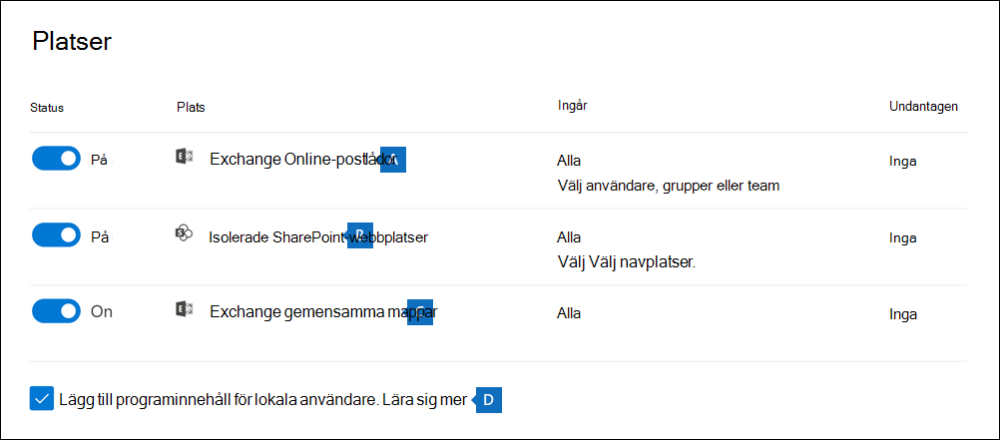
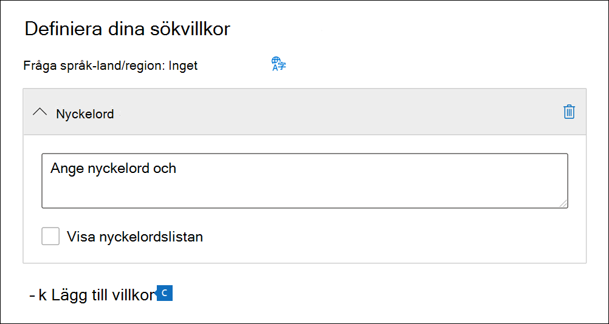

# Skapa en innehållssökningCreate a content search

Du kan använda eDiscovery-verktyget Innehållssökning Microsoft 365 Efterlevnadscenter för att söka efter lokalt innehåll, till exempel e-post, dokument och snabbmeddelandekonversationer i organisationen.You can use the Content search eDiscovery tool in the Microsoft 365 compliance center to search for in-place content such as email, documents, and instant messaging conversations in your organization. Använd det här verktyget för att söka efter innehåll i följande Microsoft 365-datakällor:Use this tool to search for content in these Microsoft 365 data sources:
  
- Exchange Online-postlådorExchange Online mailboxes

- SharePoint Online-webbplatser och OneDrive för företag-kontonSharePoint Online sites and OneDrive for Business accounts

- Microsoft TeamsMicrosoft Teams

- Microsoft 365-grupperMicrosoft 365 Groups

- Yammer-grupperYammer Groups

När du har kört en innehållssökning visas antalet innehållsplatser och ett uppskattat antal sökresultat den utfällbara söksidan.After you run a search, the number of content locations and an estimated number of search results are displayed on the search flyout page. Du kan snabbt visa statistik, till exempel vilka innehållsplatser som har flest objekt som matchar sökfrågan.You can quickly view statistics, such as the content locations that have the most items that match the search query. När du har kört en sökning kan du förhandsgranska resultaten eller exportera dem till en lokal dator.After you run a search, you can preview the results or export them to a local computer.

## Skapa och kör en sökningCreate and run a search

För att komma åt sidan **Innehållssökning** i Microsoft 365 Efterlevnadscenter (för att köra sökningar och för att förhandsgranska och exportera resultat) måste en administratör, efterlevnadsansvarig eller eDiscovery-hanterare vara medlem i rollgruppen eDiscovery Manager i Säkerhets- och efterlevnadscentret.To access to the **Content search** page in the Microsoft 365 compliance center (to run searches and preview results and export results), an administrator, compliance officer, or eDiscovery manager must be a member of the eDiscovery Manager role group in Security & Compliance Center. Mer information finns i [Tilldela eDiscovery-behörigheter](assign-ediscovery-permissions.md).For more information, see [Assign eDiscovery permissions](assign-ediscovery-permissions.md).
  
1. Gå till <https://compliance.microsoft.com> och logga in med autentiseringsuppgifterna för ett konto som har tilldelats rätt behörigheter.Go to <https://compliance.microsoft.com> and sign in using the credentials of an account that's been assigned the appropriate permissions.

2. I det vänstra navigeringsfönstret i Microsoft 365 Efterlevnadscenter klickar du på **Visa alla** och sedan på **Innehållssökning**.In the left navigation pane of the Microsoft 365 compliance center, click **Show all**, and then click **Content search**.

3. Klicka på **Ny sökning** på sidan **Innehållssökning**.On the **Content search** page, click **New search**.

   > [!NOTE]
   > Med **Sök efter ID-lista**-alternativet kan du söka efter specifika e-postmeddelanden och andra postlådeobjekt med hjälp av en lista med Exchange-ID:n.The **Search by ID list** option lets you search for specific email messages and other mailbox items using a list of Exchange IDs. Om du vill skapa en sökning med en ID-lista skickar du en fil med kommaavgränsade värden (CSV) som identifierar de specifika postlådeobjekt som du vill söka efter.To create an ID list search, you submit a comma-separated value (CSV) file that identifies the specific mailbox items to search for. Anvisningar finns i [Förbereda en CSV-fil för en ID-listsökning](csv-file-for-an-id-list-content-search.md).For instructions, see [Prepare a CSV file for an ID list search](csv-file-for-an-id-list-content-search.md).

4. Ange ett namn för sökningen, en valfri beskrivning som hjälper dig att identifiera sökningen.Type a name for the search, an optional description that helps identify the search. Namnet på sökningen måste vara unikt i din organisation.The name of the search must be unique in your organization.

5. På sidan **Platser** väljer du innehållsplatserna som du vill söka i.On the **Locations** page, choose the content locations that you want to search. Du kan söka i postlådor, webbplatser och gemensamma mappar.You can search mailboxes, sites, and public folders.

    
  
   1. **Exchange-postlådor**: Ställ in växlingsknappen på **På** och klicka sedan på **Välj användare, grupper eller teams** för att ange vilka postlådor som inte ska ingå.**Exchange mailboxes**: Set the toggle to **On** and then click **Choose users, groups, or teams** to specify the mailboxes to place on hold. Använd sökrutan för att hitta användarpostlådor och distributionsgrupper (för att undanta gruppmedlemmars postlådor) som ska uteslutas.Use the search box to find user mailboxes and distribution groups (to place a hold on the mailboxes of group members) to place on hold. Du kan också söka i postlådan som är kopplad till ett Microsoft-team (för kanalmeddelanden), Office 365-grupp och Yammer-grupp.You can also search the mailbox associated with a Microsoft Team (for channel messages), Office 365 Group, and Yammer Group. Mer information om programdata som har lagrats i postlådor finns i [Innehåll som lagras i postlådor för eDiscovery](what-is-stored-in-exo-mailbox.md).For more information about the application data stored in mailboxes, see [Content stored in mailboxes for eDiscovery](what-is-stored-in-exo-mailbox.md).

   2. **SharePoint-webbplatser**: Ställ in växlingsknappen på **På** och klicka sedan på **Välj webbplatser** för att ange SharePoint-webbplatser och OneDrive-konton som ska uteslutas.**SharePoint sites**: Set the toggle to **On** and then click **Choose sites** to specify SharePoint sites and OneDrive accounts to place on hold. Skriv in URL-adressen för varje webbplats som du vill utesluta.Type the URL for each site that you want to place on hold. Du kan också lägga till URL-adressen till SharePoint-webbplatsen för ett Microsoft-team, Office 365-grupp eller Yammer-grupp.You can also add the URL for the SharePoint site for a Microsoft Team, Office 365 Group, or Yammer Group.
  
   3. **Gemensamma Exchange-mappar**: Ställ in växlingsknappen på **På** för att utesluta alla gemensamma mappar i Exchange Online-organisationen.**Exchange public folders**: Set the toggle to **On** to put all public folders in your Exchange Online organization on hold. Du kan inte välja specifika gemensamma mappar att utesluta.You can't choose specific public folders to put on hold. Låt växlingsknappen stå på Av om du inte vill utesluta gemensamma mappar.Leave the toggle switch off if you don't want to put a hold on public folders.
  
   4. Låt den här kryssrutan vara markerad för att söka efter Teams-innehåll för lokala användare.Keep this checkbox selected to search for Teams content for on-premises users. Om du till exempel söker i alla Exchange-postlådor i organisationen när den här kryssrutan är markerad tas molnbaserad lagring som används för att lagra Teams-chattdata för lokala användare med i sökningen.For example, if you search all Exchange mailboxes in the organization and this checkbox is selected, the cloud-based storage used to store Teams chat data for on-premises users will be included in the scope of the search. Mer information finns i [Söka efter Teams-chattdata för lokala användare](search-cloud-based-mailboxes-for-on-premises-users.md).For more information, see [Search for Teams chat data for on-premises users](search-cloud-based-mailboxes-for-on-premises-users.md).

6. På sidan **Definiera dina sökvillkor** skriver du en nyckelordsfråga och lägger till villkor i sökfrågan om det behövs.On the **Define your search conditions** page, type a keyword query and add conditions to the search query if necessary.

   

   1. Ange nyckelord, meddelandeegenskaper, till exempel datum för skickade och mottagna meddelanden, eller dokumentegenskaper som filnamn eller det datum då ett dokument senast ändrades.Specify keywords, message properties such as sent and received dates, or document properties such as file names or the date that a document was last changed. Du kan använda mer komplexa frågor som innehåller booleska operatorer som **AND**, **OR**, **NOT**, och **NEAR**.You can use more complex queries that use a Boolean operator, such as **AND**, **OR**, **NOT**, and **NEAR**. Om du lämnar nyckelordsrutan tom inkluderas allt innehåll på den angivna innehållsplatsen i sökresultatet.If you leave the keyword box empty, all content located in the specified content locations is included in the search results. Mer information finns i [Nyckelordsfrågor och sökvillkor för eDiscovery](keyword-queries-and-search-conditions.md).For more information, see [Keyword queries and search conditions for eDiscovery](keyword-queries-and-search-conditions.md).

   2. Alternativt kan du klicka på kryssrutan **Visa nyckelordlista** och skriva ett nyckelord på varje rad.Alternatively, you can click the **Show keyword list** checkbox and the type a keyword in each row. Om du gör det kopplas nyckelorden på varje rad samman med en logisk operator (**c:s**) som fungerar ungefär som operatorn **OR** i sökfrågan som skapas.If you do this, the keywords on each row are connected by a logical operator (**c:s**) that is similar in functionality to the **OR** operator in the search query that's created.

      Varför ska jag använda nyckelordslistan?Why use the keyword list? Du kan få statistik som visar hur många objekt som matchar varje nyckelord.You can get statistics that show how many items match each keyword. Det kan hjälpa dig att snabbt ta reda på vilka nyckelord som är mest (och minst) effektiva.This can help you quickly identify which keywords are the most (and least) effective. Du kan också använda en nyckelordsfras (omgiven av parenteser) på en rad.You can also use a keyword phrase (surrounded by parentheses) in a row. Mer information om nycklelordslistor och sökstatistik finns i [Visa nyckelordsstatistik för sökningar](view-keyword-statistics-for-content-search.md#get-keyword-statistics-for-searches).For more information about the keyword list and search statistics, see [Get keyword statistics for searches](view-keyword-statistics-for-content-search.md#get-keyword-statistics-for-searches).

      > [!NOTE]
      > Eftersom stora nyckelordlistor kan orsaka problem kan du endast använda maximalt 20 rader i nyckelordslistan.To help reduce issues caused by large keyword lists, you're limited to a maximum of 20 rows in the keyword list.

   3. Du kan lägga till sökvillkor om du vill begränsa sökningen och få en mer förfinad uppsättning resultat.You can add search conditions to narrow a search and return a more refined set of results. Varje villkor lägger till en sats i sökfrågan som skapas och körs när du startar sökningen.Each condition adds a clause to the search query that is created and run when you start the search. Ett villkor kopplas till nyckelordsfrågan (anges i nyckelordsrutan) med en logisk operator (**c:c**) som fungerar ungefär som operatorn **AND**.A condition is logically connected to the keyword query (specified in the keyword box) by a logical operator (**c:c**) that is similar in functionality to the **AND** operator. Det innebär att objekten måste uppfylla både nyckelordsfrågan och ett eller flera villkor för att tas med i resultatet.That means that items have to satisfy both the keyword query and one or more conditions to be included in the results. Det är så du begränsar resultatet med hjälp av villkor.This is how conditions help to narrow your results. En lista och beskrivning av de villkor som du kan använda i en sökfråga finns i [Sökvillkor](keyword-queries-and-search-conditions.md#search-conditions).For a list and description of conditions that you can use in a search query, see [Search conditions](keyword-queries-and-search-conditions.md#search-conditions).

7. Granska sökinställningarna (och redigera om det behövs) och skicka sedan sökningen för att starta den.Review the search settings (and edit if necessary), and then submit the search to start it.
  
Du kommer åt den här innehållssökningen igen, eller andra innehållssökningar som visas på sidan **Innehållssökning**, genom att markera sökningen och klicka på **Öppna**.To access this content search again or access other content searches listed on the **Content search** page, select the search and then click **Open**.
  
## Nästa stegNext steps

Här är en lista över efterföljande steg som du kan utföra när du har skapat och kört en innehållssökning.Here's a list of next steps to perform after you create and run a Content search.

- [Förhandsgranska sökresultatenPreview search results](preview-ediscovery-search-results.md)

- [Visa statistik för sökresultatenView statistics for search results](view-keyword-statistics-for-content-search.md)

- [Exportera sökresultatenExport search results](export-search-results.md)

- [Exportera en sökrapportExport a search report](export-a-content-search-report.md)
