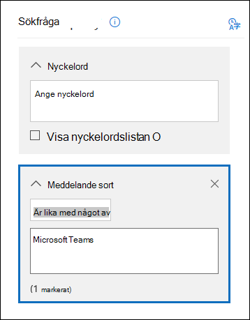
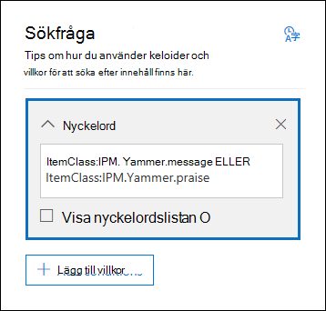
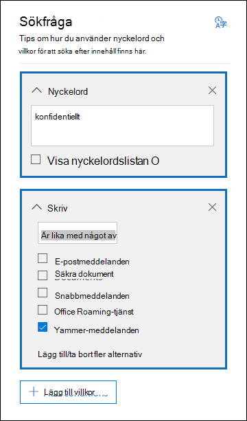

# <a name="content-search"></a><span data-ttu-id="15c0a-103">Innehållssökning</span><span class="sxs-lookup"><span data-stu-id="15c0a-103">Content Search</span></span>

<span data-ttu-id="15c0a-104">Med verktyget Innehållssökning i efterlevnadscentret i Office 365 eller Microsoft 365 kan du söka efter lokala objekt, till exempel e-post, dokument och snabbmeddelandekonversationer i organisationen.</span><span class="sxs-lookup"><span data-stu-id="15c0a-104">You can use the Content search eDiscovery tool in the compliance center in Office 365 or Microsoft 365 to search for in-place items such as email, documents, and instant messaging conversations in your organization.</span></span> <span data-ttu-id="15c0a-105">Du kan söka efter objekt i följande tjänster med verktyget:</span><span class="sxs-lookup"><span data-stu-id="15c0a-105">Use this tool to search for items in these services:</span></span>
  
- <span data-ttu-id="15c0a-106">Exchange Online-postlådor</span><span class="sxs-lookup"><span data-stu-id="15c0a-106">Exchange Online mailboxes</span></span>

- <span data-ttu-id="15c0a-107">SharePoint Online-webbplatser och OneDrive för företag-konton</span><span class="sxs-lookup"><span data-stu-id="15c0a-107">SharePoint Online sites and OneDrive for Business accounts</span></span>

- <span data-ttu-id="15c0a-108">Microsoft Teams</span><span class="sxs-lookup"><span data-stu-id="15c0a-108">Microsoft Teams</span></span>

- <span data-ttu-id="15c0a-109">Microsoft 365-grupper</span><span class="sxs-lookup"><span data-stu-id="15c0a-109">Microsoft 365 Groups</span></span>

- <span data-ttu-id="15c0a-110">Yammer-grupper</span><span class="sxs-lookup"><span data-stu-id="15c0a-110">Yammer Groups</span></span>

- <span data-ttu-id="15c0a-111">Skype för företag-konversationer</span><span class="sxs-lookup"><span data-stu-id="15c0a-111">Skype for Business conversations</span></span>

<span data-ttu-id="15c0a-112">När du har kört en innehållssökning visas antalet innehållsplatser och ett uppskattat antal sökresultat i sökstatistiken.</span><span class="sxs-lookup"><span data-stu-id="15c0a-112">After you run a Content search, the number of content locations and an estimated number of search results are displayed in the search statistics.</span></span> <span data-ttu-id="15c0a-113">Du kan också snabbt visa statistik, till exempel vilka innehållsplatser som har flest objekt som matchar sökfrågan.</span><span class="sxs-lookup"><span data-stu-id="15c0a-113">You can also quickly view statistics, such as the content locations that have the most items that match the search query.</span></span> <span data-ttu-id="15c0a-114">När du har kört en sökning kan du förhandsgranska resultatet eller exportera det till en lokal dator.</span><span class="sxs-lookup"><span data-stu-id="15c0a-114">After you run a search, you can preview the results or export them to a local computer.</span></span>

## <a name="create-a-search"></a><span data-ttu-id="15c0a-115">Skapa en sökning</span><span class="sxs-lookup"><span data-stu-id="15c0a-115">Create a search</span></span>

<span data-ttu-id="15c0a-116">För att få åtkomst till sidan **Innehållssökning** och kunna köra sökningar och förhandsgranska och exportera sökresultat måste administratören, den som ansvarar för uppfyllelse av myndighetskrav eller eDiscovery-hanteraren vara medlem i rollgruppen eDiscovery-hanterare i Säkerhets- och efterlevnadscentret.</span><span class="sxs-lookup"><span data-stu-id="15c0a-116">To have access to the **Content search** page to run searches and preview and export search results, an administrator, compliance officer, or eDiscovery manager must be a member of the eDiscovery Manager role group in the Security & Compliance Center.</span></span> <span data-ttu-id="15c0a-117">Mer information finns i [Tilldela eDiscovery-behörigheter](assign-ediscovery-permissions.md).</span><span class="sxs-lookup"><span data-stu-id="15c0a-117">For more information, see [Assign eDiscovery permissions](assign-ediscovery-permissions.md).</span></span>
  
1. <span data-ttu-id="15c0a-118">Gå till [https://compliance.microsoft.com](https://compliance.microsoft.com), logga in med din Microsoft-e-postadress och ditt lösenord.</span><span class="sxs-lookup"><span data-stu-id="15c0a-118">Go to [https://compliance.microsoft.com](https://compliance.microsoft.com) and sign in using your Microsoft email address and password.</span></span>

2. <span data-ttu-id="15c0a-119">I det vänstra navigeringsfönstret i Microsoft 365 Efterlevnadscenter klickar du på **Visa alla** och sedan på **Innehållssökning**.</span><span class="sxs-lookup"><span data-stu-id="15c0a-119">In the left navigation pane of the Microsoft 365 compliance center, click **Show all**, and then click **Content search**.</span></span>
    
3. <span data-ttu-id="15c0a-120">Klicka på **Ny sökning** på sidan **Innehållssökning**.</span><span class="sxs-lookup"><span data-stu-id="15c0a-120">On the **Content search** page, click **New search**.</span></span>
  
    <span data-ttu-id="15c0a-121">Du kan också välja något av de andra sökalternativen:</span><span class="sxs-lookup"><span data-stu-id="15c0a-121">You can also choose one of the other search options:</span></span>
    
    - <span data-ttu-id="15c0a-122">**Guidad sökning:** Det här alternativet startar en guide som hjälper dig att skapa sökningen.</span><span class="sxs-lookup"><span data-stu-id="15c0a-122">**Guided search:** This option starts a wizard that guides you through the creating the search.</span></span> <span data-ttu-id="15c0a-123">Användargränssnittet för att välja innehållsplatser och skapa sökfrågan är detsamma som för alternativet **Ny sökning**.</span><span class="sxs-lookup"><span data-stu-id="15c0a-123">The user interface to select content locations and build the search query are the same as the **New search** option.</span></span>
    
    - <span data-ttu-id="15c0a-124">**Sök efter ID-lista:** Med det här alternativet kan du söka efter specifika e-postmeddelanden och andra postlådeobjekt med en lista med Exchange-ID:n.</span><span class="sxs-lookup"><span data-stu-id="15c0a-124">**Search by ID list:** This option lets you search for specific email messages and other mailbox items using a list of Exchange IDs.</span></span> <span data-ttu-id="15c0a-125">Om du vill skapa en sökning med en ID-lista skickar du en fil med kommaavgränsade värden (CSV) som identifierar de specifika postlådeobjekt som du vill söka efter.</span><span class="sxs-lookup"><span data-stu-id="15c0a-125">To create an ID list search, you submit a comma-separated value (CSV) file that identifies the specific mailbox items to search for.</span></span> <span data-ttu-id="15c0a-126">Anvisningar finns i [Förbereda en CSV-fil för en ID-listsökning](csv-file-for-an-id-list-content-search.md).</span><span class="sxs-lookup"><span data-stu-id="15c0a-126">For instructions, see [Prepare a CSV file for an ID list search](csv-file-for-an-id-list-content-search.md).</span></span> 
    
4. <span data-ttu-id="15c0a-127">Ange följande under **Sökfråga**:</span><span class="sxs-lookup"><span data-stu-id="15c0a-127">Under **Search query**, specify the following things:</span></span>
    
    
  
   1. <span data-ttu-id="15c0a-129">**Nyckelord att söka efter:** Skriv en sökfråga i rutan **Nyckelord**.</span><span class="sxs-lookup"><span data-stu-id="15c0a-129">**Keywords to search for:** Type a search query in **Keywords** box.</span></span> <span data-ttu-id="15c0a-130">Du kan ange nyckelord, meddelandeegenskaper (till exempel datum för skickat och mottaget) eller dokumentegenskaper (till exempel filnamn eller det datum då ett dokument senast ändrades).</span><span class="sxs-lookup"><span data-stu-id="15c0a-130">You can specify keywords, message properties such as sent and received dates, or document properties such as file names or the date that a document was last changed.</span></span> <span data-ttu-id="15c0a-131">Du kan använda mer komplexa frågor som innehåller booleska operatorer som **AND**, **OR**, **NOT**, och **NEAR**.</span><span class="sxs-lookup"><span data-stu-id="15c0a-131">You can use more complex queries that use a Boolean operator, such as **AND**, **OR**, **NOT**, and **NEAR**.</span></span> <span data-ttu-id="15c0a-132">Du kan också söka efter känslig information (t.ex. personnummer) i dokument, eller söka efter dokument som delats externt.</span><span class="sxs-lookup"><span data-stu-id="15c0a-132">You can also search for sensitive information (such as social security numbers) in documents, or search for documents that have been shared externally.</span></span> <span data-ttu-id="15c0a-133">Om du lämnar nyckelordsrutan tom inkluderas allt innehåll på den angivna innehållsplatsen i sökresultatet.</span><span class="sxs-lookup"><span data-stu-id="15c0a-133">If you leave the keyword box empty, all content located in the specified content locations is included in the search results.</span></span>

      <span data-ttu-id="15c0a-134">Alternativt kan du klicka på kryssrutan **Visa nyckelordlista** och skriva ett nyckelord på varje rad.</span><span class="sxs-lookup"><span data-stu-id="15c0a-134">Alternatively, you can click the **Show keyword list** checkbox and the type a keyword in each row.</span></span> <span data-ttu-id="15c0a-135">Om du gör det kopplas nyckelorden på varje rad samman med en logisk operator (**c:s**) som fungerar ungefär som operatorn **OR** i sökfrågan som skapas.</span><span class="sxs-lookup"><span data-stu-id="15c0a-135">If you do this, the keywords on each row are connected by a logical operator (**c:s**) that is similar in functionality to the **OR** operator in the search query that's created.</span></span> 
    
      <span data-ttu-id="15c0a-136">Varför ska jag använda nyckelordslistan?</span><span class="sxs-lookup"><span data-stu-id="15c0a-136">Why use the keyword list?</span></span> <span data-ttu-id="15c0a-137">Du kan få statistik som visar hur många objekt som matchar varje nyckelord.</span><span class="sxs-lookup"><span data-stu-id="15c0a-137">You can get statistics that show how many items match each keyword.</span></span> <span data-ttu-id="15c0a-138">Det kan hjälpa dig att snabbt ta reda på vilka nyckelord som är mest (och minst) effektiva.</span><span class="sxs-lookup"><span data-stu-id="15c0a-138">This can help you quickly identify which keywords are the most (and least) effective.</span></span> <span data-ttu-id="15c0a-139">Du kan också använda en nyckelordsfras (omgiven av parenteser) på en rad.</span><span class="sxs-lookup"><span data-stu-id="15c0a-139">You can also use a keyword phrase (surrounded by parentheses) in a row.</span></span> <span data-ttu-id="15c0a-140">Mer information om sökstatistik finns i [Visa nyckelordsstatistik för resultat av innehållssökning](view-keyword-statistics-for-content-search.md).</span><span class="sxs-lookup"><span data-stu-id="15c0a-140">For more information about search statistics, see [View keyword statistics for Content Search results](view-keyword-statistics-for-content-search.md).</span></span>

      > [!NOTE]
      > <span data-ttu-id="15c0a-141">Eftersom stora nyckelordlistor kan orsaka problem kan du nu använda maximalt 20 rader i nyckelordslistan.</span><span class="sxs-lookup"><span data-stu-id="15c0a-141">To help reduce issues caused by large keyword lists, you're now limited to a maximum of 20 rows in the keyword list.</span></span>
    
    2. <span data-ttu-id="15c0a-142">**Villkor:** Du kan lägga till sökvillkor om du vill begränsa sökningen och få en mer förfinad uppsättning resultat.</span><span class="sxs-lookup"><span data-stu-id="15c0a-142">**Conditions:** You can add search conditions to narrow a search and return a more refined set of results.</span></span> <span data-ttu-id="15c0a-143">Varje villkor lägger till en sats i sökfrågan som skapas och körs när du startar sökningen.</span><span class="sxs-lookup"><span data-stu-id="15c0a-143">Each condition adds a clause to the search query that is created and run when you start the search.</span></span> <span data-ttu-id="15c0a-144">Ett villkor kopplas till nyckelordsfrågan (anges i nyckelordsrutan) med en logisk operator (**c:c**) som fungerar ungefär som operatorn **AND**.</span><span class="sxs-lookup"><span data-stu-id="15c0a-144">A condition is logically connected to the keyword query (specified in the keyword box) by a logical operator (**c:c**) that is similar in functionality to the **AND** operator.</span></span> <span data-ttu-id="15c0a-145">Det innebär att objekten måste uppfylla både nyckelordsfrågan och ett eller flera villkor för att tas med i resultatet.</span><span class="sxs-lookup"><span data-stu-id="15c0a-145">That means that items have to satisfy both the keyword query and one or more conditions to be included in the results.</span></span> <span data-ttu-id="15c0a-146">Det är så du begränsar resultatet med hjälp av villkor.</span><span class="sxs-lookup"><span data-stu-id="15c0a-146">This is how conditions help to narrow your results.</span></span> <span data-ttu-id="15c0a-147">En lista och en beskrivning av de villkor som du kan använda i en sökfråga finns i avsnittet Sökvillkor i [Nyckelordsfrågor och sökvillkor för Innehållssökning](keyword-queries-and-search-conditions.md#search-conditions).</span><span class="sxs-lookup"><span data-stu-id="15c0a-147">For a list and description of conditions that you can use in a search query, see the "Search conditions" section in [Keyword queries and search conditions for Content Search](keyword-queries-and-search-conditions.md#search-conditions).</span></span>
    
    3. <span data-ttu-id="15c0a-148">**Platser:** Välj innehållsplatser för sökning.</span><span class="sxs-lookup"><span data-stu-id="15c0a-148">**Locations:** Choose the content locations to search.</span></span>
    
      - <span data-ttu-id="15c0a-149">**Alla platser:** Använd det här alternativet om du vill söka på alla innehållsplatser i organisationen.</span><span class="sxs-lookup"><span data-stu-id="15c0a-149">**All locations:** Use this option to search all content locations in your organization.</span></span> <span data-ttu-id="15c0a-150">Det omfattar e-post i alla Exchange-postlådor (inklusive alla inaktiva postlådor, och postlådor för alla Microsoft Teams, Yammer-grupper och Microsoft 365-grupper), alla Skype för företag-konversationer, alla SharePoint- och OneDrive för företag-webbplatser (inklusive webbplatserna för alla Microsoft Teams, Yammer-grupper och Microsoft 365-grupper) och alla objekt i alla gemensamma Exchange-mappar.</span><span class="sxs-lookup"><span data-stu-id="15c0a-150">This includes email in all Exchange mailboxes (including all inactive mailboxes, and mailboxes for all Microsoft Teams, Yammer Groups, and Microsoft 365 Groups), all Skype for Business conversations, all SharePoint and OneDrive for Business sites (including the sites for all Microsoft Teams, Yammer Groups, and Microsoft 365 Groups), and items in all Exchange public folders.</span></span>
    
      - <span data-ttu-id="15c0a-151">**Särskilda platser:** Använd det här alternativet om du vill söka på särskilda innehållsplatser.</span><span class="sxs-lookup"><span data-stu-id="15c0a-151">**Specific locations:** Use this option to search specific content locations.</span></span> <span data-ttu-id="15c0a-152">Du kan söka på alla innehållsplatser för en viss Office 365-tjänst (t.ex. söka i alla Exchange-postlådor eller söka på alla SharePoint-webbplatser), eller så kan du söka efter innehåll på specifika platser i alla Office 365-tjänster som visas.</span><span class="sxs-lookup"><span data-stu-id="15c0a-152">You can search all content locations for a specific Office 365 service (such as searching all Exchange mailboxes or search all SharePoint sites) or you can search for content in specific locations of any of the Office 365 services that are displayed.</span></span> 
    
        
  
         <span data-ttu-id="15c0a-154">Du kan också lägga till distributionsgrupper i listan med Exchange-postlådor som du vill söka i.</span><span class="sxs-lookup"><span data-stu-id="15c0a-154">You can also add distribution groups to the list of Exchange mailboxes to search.</span></span> <span data-ttu-id="15c0a-155">För distributionsgrupper genomsöks postlådorna för gruppmedlemmarna.</span><span class="sxs-lookup"><span data-stu-id="15c0a-155">For distribution groups, the mailboxes of group members are searched.</span></span> <span data-ttu-id="15c0a-156">Dynamiska distributionsgrupper stöds inte.</span><span class="sxs-lookup"><span data-stu-id="15c0a-156">Dynamic distribution groups aren't supported.</span></span>
    
        > [!NOTE]
        > <span data-ttu-id="15c0a-157">När du söker i alla postlådor eller bara specifika postlådor tas data från andra Office 365-program som sparas i användarpostlådor med när du exporterar resultaten av en innehållssökning.</span><span class="sxs-lookup"><span data-stu-id="15c0a-157">When you search all mailbox locations or just specific mailboxes, data from other Office 365 applications that's saved to user mailboxes is included when you export the results of a Content Search.</span></span> <span data-ttu-id="15c0a-158">Dessa data tas inte med i de uppskattade sökresultaten och är inte tillgängliga för förhandsgranskning.</span><span class="sxs-lookup"><span data-stu-id="15c0a-158">This data won't be included in the estimated search results and isn't available for preview.</span></span> <span data-ttu-id="15c0a-159">De tas med när du exporterar och laddar ned sökresultatet.</span><span class="sxs-lookup"><span data-stu-id="15c0a-159">It is included when you export and download the search results.</span></span> <span data-ttu-id="15c0a-160">Mer information finns i [Innehåll som lagras i Exchange Online-postlådor](what-is-stored-in-exo-mailbox.md).</span><span class="sxs-lookup"><span data-stu-id="15c0a-160">For more information, see [Content stored in Exchange Online mailboxes](what-is-stored-in-exo-mailbox.md).</span></span>

   4. <span data-ttu-id="15c0a-161">**Lägg till appinnehåll för lokala användare:** Markera den här kryssrutan om du vill ta med Teams-innehåll för lokala användare i sökningen.</span><span class="sxs-lookup"><span data-stu-id="15c0a-161">**Add app content for on-premises users:** Select this checkbox to include Teams content for on-premises users in the search.</span></span> <span data-ttu-id="15c0a-162">Om du till exempel söker i alla Exchange-postlådor i organisationen och markerar den här kryssrutan tas molnbaserad lagring som används för att lagra Teams chattdata för lokala användare med i sökningen.</span><span class="sxs-lookup"><span data-stu-id="15c0a-162">For example if you search all Exchange mailboxes in the organization and also select this checkbox, cloud-based storage used to store Teams chat data for on-premises users will be included in the scope of the search.</span></span> <span data-ttu-id="15c0a-163">Mer information finns i [Söka efter Teams chattdata för lokala användare](search-cloud-based-mailboxes-for-on-premises-users.md).</span><span class="sxs-lookup"><span data-stu-id="15c0a-163">For more information, see [Search for Teams chat data for on-premises users](search-cloud-based-mailboxes-for-on-premises-users.md).</span></span>

5. <span data-ttu-id="15c0a-164">Klicka på **Spara och kör** när du har skapat din sökfråga.</span><span class="sxs-lookup"><span data-stu-id="15c0a-164">After you've set up your search query, click **Save & run**.</span></span>
    
6. <span data-ttu-id="15c0a-165">På sidan **Spara sökning** anger du ett namn för sökningen och en valfri beskrivning som hjälper dig att identifiera sökningen.</span><span class="sxs-lookup"><span data-stu-id="15c0a-165">On the **Save search** page, type a name for the search, and an optional description that helps identify the search.</span></span> <span data-ttu-id="15c0a-166">Namnet på sökningen måste vara unikt i din organisation.</span><span class="sxs-lookup"><span data-stu-id="15c0a-166">The name of the search has to be unique in your organization.</span></span> 
    
7. <span data-ttu-id="15c0a-167">Klicka på **Spara** för att starta sökningen.</span><span class="sxs-lookup"><span data-stu-id="15c0a-167">Click **Save** to start the search.</span></span> 
    
    <span data-ttu-id="15c0a-168">När du har sparat och kört sökningen visas alla resultat som returneras av sökningen i resultatfönstret.</span><span class="sxs-lookup"><span data-stu-id="15c0a-168">After you save and run the search, any results returned by the search are displayed in the results pane.</span></span> <span data-ttu-id="15c0a-169">Antingen visas sökresultatet eller så måste du klicka på **Förhandsgranska** för att visa det, beroende på hur du har konfigurerat förhandsgranskningsinställningen.</span><span class="sxs-lookup"><span data-stu-id="15c0a-169">Depending on how you have the preview setting configured, the search results are display or you have to click **Preview results** to view them.</span></span> <span data-ttu-id="15c0a-170">Se nästa avsnitt för mer information.</span><span class="sxs-lookup"><span data-stu-id="15c0a-170">See the next section for details.</span></span> 
    
<span data-ttu-id="15c0a-171">Du kommer åt den här innehållssökningen igen, eller andra innehållssökningar som visas på sidan **Innehållssökning**, genom att markera sökningen och klicka på **Öppna**.</span><span class="sxs-lookup"><span data-stu-id="15c0a-171">To access this content search again or access other content searches listed on the **Content search** page, select the search and then click **Open**.</span></span> 
  
<span data-ttu-id="15c0a-172">Klicka på  **Ny sökning** om du vill rensa resultatet eller skapa en annan sökning.</span><span class="sxs-lookup"><span data-stu-id="15c0a-172">To clear the results or create another search, click  **New search**.</span></span>
  
## <a name="preview-search-results"></a><span data-ttu-id="15c0a-173">Förhandsgranska sökresultat</span><span class="sxs-lookup"><span data-stu-id="15c0a-173">Preview search results</span></span>

<span data-ttu-id="15c0a-174">Det finns två konfigurationsinställningar för förhandsgranskning av sökresultat.</span><span class="sxs-lookup"><span data-stu-id="15c0a-174">There are two configuration settings for previewing search results.</span></span> <span data-ttu-id="15c0a-175">När du har kört en ny sökning eller öppnat en befintlig sökning kan du visa följande förhandsgranskningsinställningar genom att klicka på **Individuella resultat**:</span><span class="sxs-lookup"><span data-stu-id="15c0a-175">After you run a new search or open an existing search, click **Individual results** to view the following preview settings:</span></span> 
  

  
1. <span data-ttu-id="15c0a-177">**Förhandsgranska resultatet automatiskt:** Den här inställningen visar sökresultatet när du har kört en sökning.</span><span class="sxs-lookup"><span data-stu-id="15c0a-177">**Preview results automatically:** This setting displays the search results after you run a search.</span></span>
    
2. <span data-ttu-id="15c0a-178">**Förhandsgranska resultatet manuellt:** Den här inställningen visar platshållare i sökresultatfönstret och visar knappen **Förhandsgranska resultat** som du måste klicka på för att visa sökresultat.</span><span class="sxs-lookup"><span data-stu-id="15c0a-178">**Preview results manually:** This setting displays placeholders in the search results pane, and displays the **Preview results** button that you have to click to display the search results.</span></span> <span data-ttu-id="15c0a-179">Det här är standardinställningen.</span><span class="sxs-lookup"><span data-stu-id="15c0a-179">This is the default setting.</span></span> <span data-ttu-id="15c0a-180">Sökprestandan blir bättre eftersom sökresultaten inte visas automatiskt när du öppnar en befintlig sökning.</span><span class="sxs-lookup"><span data-stu-id="15c0a-180">It helps enhance search performance by not automatically displaying the search results when you open an existing search.</span></span> 
    
<span data-ttu-id="15c0a-181">Antalet objekt som är tillgängliga för förhandsgranskning är begränsat.</span><span class="sxs-lookup"><span data-stu-id="15c0a-181">There are limits related to how many items are available to be previewed.</span></span> <span data-ttu-id="15c0a-182">Mer information finns i [Begränsningar för innehållssökning](limits-for-content-search.md).</span><span class="sxs-lookup"><span data-stu-id="15c0a-182">For more information, see [Limits for Content Search](limits-for-content-search.md).</span></span> 
  
<span data-ttu-id="15c0a-183">En lista över filtyper som kan förhandsgranskas finns i avsnittet ”Mer information om innehållssökning” i [Förhandsgranska sökresultat](#previewing-search-results).</span><span class="sxs-lookup"><span data-stu-id="15c0a-183">For a list of supported file types that can be previewed, see [Previewing search results](#previewing-search-results) in the "More information about content search" section.</span></span> <span data-ttu-id="15c0a-184">Om en filtyp inte kan förhandsgranskas eller om du vill ladda ned en kopia av ett dokument kan du klicka på **Ladda ned original** för att ladda ned filen till din lokala dator.</span><span class="sxs-lookup"><span data-stu-id="15c0a-184">If a file type isn't supported for preview or to download a copy of a document, you can click **Download original file** to download it to your local computer.</span></span> <span data-ttu-id="15c0a-185">För ASPX-webbsidor ingår URL-adressen för sidan, men du kanske inte har behörighet att komma åt sidan.</span><span class="sxs-lookup"><span data-stu-id="15c0a-185">For .aspx Web pages, the URL for the page is included though you might not have permissions to access the page.</span></span> 
  
<span data-ttu-id="15c0a-186">Observera även att icke indexerade objekt inte är tillgängliga för förhandsgranskning.</span><span class="sxs-lookup"><span data-stu-id="15c0a-186">Also note that unindexed items aren't available for previewing.</span></span>
  
## <a name="view-information-and-statistics-about-a-search"></a><span data-ttu-id="15c0a-187">Visa information och statistik om en sökning</span><span class="sxs-lookup"><span data-stu-id="15c0a-187">View information and statistics about a search</span></span>

<span data-ttu-id="15c0a-188">När du har skapat och kört en innehållssökning kan du visa statistik om uppskattade sökresultat.</span><span class="sxs-lookup"><span data-stu-id="15c0a-188">After you create and run a content search, you can view statistics about the estimated search results.</span></span> <span data-ttu-id="15c0a-189">Det omfattar en sammanfattning av sökresultatet, frågestatistik (till exempel antalet innehållsplatser med objekt som matchar sökfrågan) och namnet på de innehållsplatser som har flest matchande objekt.</span><span class="sxs-lookup"><span data-stu-id="15c0a-189">This includes a summary of the search results, the query statistics such as the number of content locations with items that match the search query, and the name of content locations that have the most matching items.</span></span> <span data-ttu-id="15c0a-190">Du kan visa statistik för en eller flera innehållssökningar.</span><span class="sxs-lookup"><span data-stu-id="15c0a-190">You can display statistics for one or more content searches.</span></span> <span data-ttu-id="15c0a-191">Det gör att du snabbt kan jämföra resultaten för flera sökningar och avgöra hur effektiva dina sökfrågor är.</span><span class="sxs-lookup"><span data-stu-id="15c0a-191">This lets you quickly compare the results for multiple searches and make decisions about the effectiveness of your search queries.</span></span>
  
<span data-ttu-id="15c0a-192">Du kan också ladda ned sökstatistiken och nyckelordsstatistiken till en CSV-fil.</span><span class="sxs-lookup"><span data-stu-id="15c0a-192">You can also download the search statistics and keyword statistics to a CSV file.</span></span> <span data-ttu-id="15c0a-193">På så sätt kan du använda filtrerings- och sorteringsfunktionerna i Excel för att jämföra resultat och förbereda rapporter för sökresultaten.</span><span class="sxs-lookup"><span data-stu-id="15c0a-193">This lets you use the filtering and sorting features in Excel to compare results, and prepare reports for your search results.</span></span>
  
<span data-ttu-id="15c0a-194">Så här visar du sökstatistik:</span><span class="sxs-lookup"><span data-stu-id="15c0a-194">To view search statistics:</span></span>
  
1. <span data-ttu-id="15c0a-195">Klicka på **Öppna** på sidan **Innehållssökning** och klicka sedan på sökningen som du vill visa statistik för.</span><span class="sxs-lookup"><span data-stu-id="15c0a-195">On the **Content search** page, click **Open** and then click the search that you want to view the statistic for.</span></span>
  
2. <span data-ttu-id="15c0a-196">Klicka på **Öppna fråga** på den utfällbara sidan.</span><span class="sxs-lookup"><span data-stu-id="15c0a-196">On the flyout page, click **Open query**.</span></span> 
  
3. <span data-ttu-id="15c0a-197">Klicka på **Sökstatistik** i listrutan **Individuella resultat**.</span><span class="sxs-lookup"><span data-stu-id="15c0a-197">In the **Individual results** drop down list, click **Search statistics**.</span></span>
  
4. <span data-ttu-id="15c0a-198">I listrutan **Typ** klickar du på något av följande alternativ beroende på vilken sökstatistik du vill visa:</span><span class="sxs-lookup"><span data-stu-id="15c0a-198">In the **Type** drop down list, click one of the following options depending on the search statistics you want to view:</span></span>
  
    - <span data-ttu-id="15c0a-199">**Sammanfattning:** Visar statistik för varje typ av innehållsplats som genomsöks.</span><span class="sxs-lookup"><span data-stu-id="15c0a-199">**Summary:** Displays statistics for each type of content locations searched.</span></span> <span data-ttu-id="15c0a-200">Här visas antalet innehållsplatser som innehöll objekt som matchade sökfrågan samt det totala antalet och storleken på sökresultatobjekten.</span><span class="sxs-lookup"><span data-stu-id="15c0a-200">This contents the number of content locations that contained items that matched the search query, and the total number and size of search result items.</span></span> <span data-ttu-id="15c0a-201">Det här är standardinställningen.</span><span class="sxs-lookup"><span data-stu-id="15c0a-201">This is the default setting.</span></span>

    - <span data-ttu-id="15c0a-202">**Frågor:** Visar statistik om sökfrågan.</span><span class="sxs-lookup"><span data-stu-id="15c0a-202">**Queries:** Displays statistics about the search query.</span></span> <span data-ttu-id="15c0a-203">Det här omfattar den typ av innehållsplats som frågestatistiken avser, den del av sökfrågan som statistiken avser (observera att **Primär** anger att det är hela sökfrågan), antalet innehållsplatser som innehåller objekt som matchar sökfrågan och det totala antalet, storleken och objekten som hittades (på den angivna innehållsplatsen) som matchar sökfrågan.</span><span class="sxs-lookup"><span data-stu-id="15c0a-203">This includes the type of content location the query statistics are applicable to, part of the search query the statistics are applicable to (note that **Primary** indicates the entire search query), the number of the content locations that contain items that match the search query, and the total number and size and items that were found (in the specified content location) that match the search query.</span></span> <span data-ttu-id="15c0a-204">Statistik för icke indexerade objekt (även kallade *delvis indexerade objekt*) visas också.</span><span class="sxs-lookup"><span data-stu-id="15c0a-204">Statistics for unindexed items (also called *partially indexed items*) are also displayed.</span></span> <span data-ttu-id="15c0a-205">Men endast delvis indexerade objekt från postlådor tas med i statistiken.</span><span class="sxs-lookup"><span data-stu-id="15c0a-205">However, only partially indexed items from mailboxes are included in the statistics.</span></span> <span data-ttu-id="15c0a-206">Delvis indexerade objekt från SharePoint och OneDrive tas inte med i statistiken.</span><span class="sxs-lookup"><span data-stu-id="15c0a-206">Partially indexed items from SharePoint and OneDrive are not included in the statistics.</span></span>

    - <span data-ttu-id="15c0a-207">**Översta platser:** Visar statistik om antalet objekt som matchar sökfrågan på varje innehållsplats.</span><span class="sxs-lookup"><span data-stu-id="15c0a-207">**Top locations:** Displays statistics about the number of items that match the search query in each content location.</span></span> <span data-ttu-id="15c0a-208">De 1 000 översta platserna visas.</span><span class="sxs-lookup"><span data-stu-id="15c0a-208">The top 1,000 locations are displayed.</span></span>

<span data-ttu-id="15c0a-209">Mer detaljerad information om sökstatistik finns i [Visa nyckelordsstatistik för resultat av innehållssökning](view-keyword-statistics-for-content-search.md).</span><span class="sxs-lookup"><span data-stu-id="15c0a-209">For more detailed information about search statistics, see [View keyword statistics for Content Search results](view-keyword-statistics-for-content-search.md).</span></span>
  
## <a name="export-search-results"></a><span data-ttu-id="15c0a-210">Exportera sökresultat</span><span class="sxs-lookup"><span data-stu-id="15c0a-210">Export search results</span></span>

<span data-ttu-id="15c0a-211">När en sökning har körts kan du exportera sökresultatet till en lokal dator.</span><span class="sxs-lookup"><span data-stu-id="15c0a-211">After a search is successfully run, you can export the search results to a local computer.</span></span> <span data-ttu-id="15c0a-212">När du exporterar e-postresultat kan du ladda ned dem till datorn som PST-filer eller som enskilda meddelanden (MSG-filer).</span><span class="sxs-lookup"><span data-stu-id="15c0a-212">When you export email results, they can be downloaded to your computer as PST files or as individual messages (.msg files).</span></span> <span data-ttu-id="15c0a-213">När du exporterar innehåll från SharePoint- och OneDrive-webbplatser exporteras kopior av ursprungliga Office-dokument.</span><span class="sxs-lookup"><span data-stu-id="15c0a-213">When you export content from SharePoint and OneDrive sites, copies of native Office documents are exported.</span></span> <span data-ttu-id="15c0a-214">Det finns även andra dokument och rapporter som ingår i exporterade sökresultat.</span><span class="sxs-lookup"><span data-stu-id="15c0a-214">There are also other documents and reports that are included with the exported search results.</span></span> <span data-ttu-id="15c0a-215">Du kan också exportera sökresultatrapporten utan de faktiska objekten.</span><span class="sxs-lookup"><span data-stu-id="15c0a-215">You can also export the search results report and not the actual items.</span></span>
  
<span data-ttu-id="15c0a-216">Så här exporterar du sökresultat:</span><span class="sxs-lookup"><span data-stu-id="15c0a-216">To export search results:</span></span>
  
1. <span data-ttu-id="15c0a-217">På sidan **Innehållssökning** klickar du på den sökning som du vill exportera sökresultat för.</span><span class="sxs-lookup"><span data-stu-id="15c0a-217">On the **Content search** page, click the search that you want to export the search results for.</span></span> 

2. <span data-ttu-id="15c0a-218">Klicka på **Exportera resultat** på den utfällbara sidan.</span><span class="sxs-lookup"><span data-stu-id="15c0a-218">On the flyout page, click **Export results**.</span></span> <span data-ttu-id="15c0a-219">Du kan också exportera en sökresultatrapport.</span><span class="sxs-lookup"><span data-stu-id="15c0a-219">You can also export a search results report.</span></span>

3. <span data-ttu-id="15c0a-220">Slutför avsnitten på sidan **Exportera resultat**.</span><span class="sxs-lookup"><span data-stu-id="15c0a-220">Complete the sections on the **Export results** fly out page.</span></span> <span data-ttu-id="15c0a-221">Använd rullningslisten så att du ser alla exportalternativ.</span><span class="sxs-lookup"><span data-stu-id="15c0a-221">Be sure to use the scroll bar to view all export options.</span></span>

<span data-ttu-id="15c0a-222">Mer detaljerade instruktioner och felsökningstips finns i:</span><span class="sxs-lookup"><span data-stu-id="15c0a-222">For more detailed instructions and troubleshooting tips, see:</span></span>
  
- [<span data-ttu-id="15c0a-223">Exportera resultat av innehållssökning</span><span class="sxs-lookup"><span data-stu-id="15c0a-223">Export Content search results</span></span>](export-search-results.md)

- [<span data-ttu-id="15c0a-224">Exportera en innehållssökningsrapport</span><span class="sxs-lookup"><span data-stu-id="15c0a-224">Export a Content search report</span></span>](export-a-content-search-report.md)

## <a name="more-information-about-content-search"></a><span data-ttu-id="15c0a-225">Mer information om innehållssökning</span><span class="sxs-lookup"><span data-stu-id="15c0a-225">More information about content search</span></span>

<span data-ttu-id="15c0a-226">I följande avsnitt finns mer information om innehållssökning.</span><span class="sxs-lookup"><span data-stu-id="15c0a-226">See the following sections for more information about Content searches.</span></span>
  
[<span data-ttu-id="15c0a-227">Begränsningar för innehållssökning</span><span class="sxs-lookup"><span data-stu-id="15c0a-227">Content search limits</span></span>](#content-search-limits)
  
[<span data-ttu-id="15c0a-228">Skapa en sökfråga</span><span class="sxs-lookup"><span data-stu-id="15c0a-228">Building a search query</span></span>](#building-a-search-query)
  
[<span data-ttu-id="15c0a-229">Söka i OneDrive-konton</span><span class="sxs-lookup"><span data-stu-id="15c0a-229">Searching OneDrive accounts</span></span>](#searching-onedrive-accounts)
  
[<span data-ttu-id="15c0a-230">Söka i Microsoft Teams och Microsoft 365-grupper</span><span class="sxs-lookup"><span data-stu-id="15c0a-230">Searching Microsoft Teams and Microsoft 365 Groups</span></span>](#searching-microsoft-teams-and-microsoft-365-groups)

[<span data-ttu-id="15c0a-231">Söka i Yammer-grupper</span><span class="sxs-lookup"><span data-stu-id="15c0a-231">Searching Yammer Groups</span></span>](#searching-yammer-groups)
  
[<span data-ttu-id="15c0a-232">Söka i inaktiva postlådor</span><span class="sxs-lookup"><span data-stu-id="15c0a-232">Searching inactive mailboxes</span></span>](#searching-inactive-mailboxes)
  
[<span data-ttu-id="15c0a-233">Söka i frånkopplade eller avlicensierade postlådor</span><span class="sxs-lookup"><span data-stu-id="15c0a-233">Searching disconnected or de-licensed mailboxes</span></span>](#searching-disconnected-or-de-licensed-mailboxes)

[<span data-ttu-id="15c0a-234">Förhandsgranska sökresultat</span><span class="sxs-lookup"><span data-stu-id="15c0a-234">Previewing search results</span></span>](#previewing-search-results)
  
[<span data-ttu-id="15c0a-235">Delvis indexerade objekt</span><span class="sxs-lookup"><span data-stu-id="15c0a-235">Partially indexed items</span></span>](#partially-indexed-items)

[<span data-ttu-id="15c0a-236">Söka efter innehåll i en SharePoint Multi-Geo-miljö</span><span class="sxs-lookup"><span data-stu-id="15c0a-236">Searching for content in a SharePoint Multi-Geo environment</span></span>](#searching-for-content-in-a-sharepoint-multi-geo-environment)
  
### <a name="content-search-limits"></a><span data-ttu-id="15c0a-237">Begränsningar för innehållssökning</span><span class="sxs-lookup"><span data-stu-id="15c0a-237">Content search limits</span></span>

- <span data-ttu-id="15c0a-238">En beskrivning av begränsningarna för innehållssökning finns i [Begränsningar för innehållssökning](limits-for-content-search.md).</span><span class="sxs-lookup"><span data-stu-id="15c0a-238">For a description of the limits that are applied to Content search, see [Limits for Content search](limits-for-content-search.md).</span></span>
  
- <span data-ttu-id="15c0a-239">Microsoft samlar in prestandainformation om innehållssökningar som körs av alla organisationer.</span><span class="sxs-lookup"><span data-stu-id="15c0a-239">Microsoft collects performance information for Content searches run by all organizations.</span></span> <span data-ttu-id="15c0a-240">Sökfrågans komplexitet påverkar visserligen söktiden, men det är antalet postlådor som genomsöks som har störst påverkan på söktiden.</span><span class="sxs-lookup"><span data-stu-id="15c0a-240">While the complexity of the search query can impact search times, the biggest factor that affects how long searches take is the number of mailboxes searched.</span></span> <span data-ttu-id="15c0a-241">Microsoft tillhandahåller inte något servicenivåavtal för söktider, men i följande tabell kan du se de genomsnittliga söktiderna för en innehållssökning utifrån antalet postlådor som ingår i sökningen.</span><span class="sxs-lookup"><span data-stu-id="15c0a-241">Although Microsoft doesn't provide a Service Level Agreement for search times, the following table lists average search times for a Content Search based on the number of mailboxes included in the search.</span></span>
  
  |<span data-ttu-id="15c0a-242">**Antal postlådor**</span><span class="sxs-lookup"><span data-stu-id="15c0a-242">**Number of mailboxes**</span></span>|<span data-ttu-id="15c0a-243">**Genomsnittlig söktid**</span><span class="sxs-lookup"><span data-stu-id="15c0a-243">**Average search time**</span></span>|
  |:-----|:-----|
  |<span data-ttu-id="15c0a-244">100</span><span class="sxs-lookup"><span data-stu-id="15c0a-244">100</span></span>  <br/> |<span data-ttu-id="15c0a-245">30 sekunder</span><span class="sxs-lookup"><span data-stu-id="15c0a-245">30 seconds</span></span>  <br/> |
  |<span data-ttu-id="15c0a-246">1 000</span><span class="sxs-lookup"><span data-stu-id="15c0a-246">1,000</span></span>  <br/> |<span data-ttu-id="15c0a-247">45 sekunder</span><span class="sxs-lookup"><span data-stu-id="15c0a-247">45 seconds</span></span>  <br/> |
  |<span data-ttu-id="15c0a-248">10 000</span><span class="sxs-lookup"><span data-stu-id="15c0a-248">10,000</span></span>  <br/> |<span data-ttu-id="15c0a-249">4 minuter</span><span class="sxs-lookup"><span data-stu-id="15c0a-249">4 minutes</span></span>  <br/> |
  |<span data-ttu-id="15c0a-250">25 000</span><span class="sxs-lookup"><span data-stu-id="15c0a-250">25,000</span></span>  <br/> |<span data-ttu-id="15c0a-251">10 minuter</span><span class="sxs-lookup"><span data-stu-id="15c0a-251">10 minutes</span></span>  <br/> |
  |<span data-ttu-id="15c0a-252">50 000</span><span class="sxs-lookup"><span data-stu-id="15c0a-252">50,000</span></span>  <br/> |<span data-ttu-id="15c0a-253">20 minuter</span><span class="sxs-lookup"><span data-stu-id="15c0a-253">20 minutes</span></span>  <br/> |
  |<span data-ttu-id="15c0a-254">100 000</span><span class="sxs-lookup"><span data-stu-id="15c0a-254">100,000</span></span>  <br/> |<span data-ttu-id="15c0a-255">25 minuter</span><span class="sxs-lookup"><span data-stu-id="15c0a-255">25 minutes</span></span>  <br/> |
  |||
  
### <a name="building-a-search-query"></a><span data-ttu-id="15c0a-256">Skapa en sökfråga</span><span class="sxs-lookup"><span data-stu-id="15c0a-256">Building a search query</span></span>

<span data-ttu-id="15c0a-257">Detaljerad information om hur du skapar en sökfråga, använder booleska sökoperatorer och sökvillkor samt söker efter olika typer av känslig information och innehåll som delas med användare utanför organisationen finns i [Nyckelordsfrågor och sökvillkor för innehållssökning ](keyword-queries-and-search-conditions.md).</span><span class="sxs-lookup"><span data-stu-id="15c0a-257">For detailed information about creating a search query, using Boolean search operators and search conditions, and searching for sensitive information types and content shared with users outside your organization, see [Keyword queries and search conditions for Content Search ](keyword-queries-and-search-conditions.md).</span></span>
  
<span data-ttu-id="15c0a-258">Tänk på följande när du använder nyckelordslistan för att skapa en sökfråga.</span><span class="sxs-lookup"><span data-stu-id="15c0a-258">Keep the following things in mind when using the keyword list to create a search query.</span></span>
  
- <span data-ttu-id="15c0a-259">Du måste markera kryssrutan **Visa nyckelordslista** och sedan skriva varje nyckelord på en separat rad när du skapar en sökfråga där nyckelorden (eller nyckelordsfraserna) på varje rad har kopplats samman med operatorn **OR**.</span><span class="sxs-lookup"><span data-stu-id="15c0a-259">You have to select the **Show keyword list** checkbox and then type each keyword in a separate row to create a search query where the keywords (or keyword phrases) in each row are connected by the **OR** operator.</span></span> <span data-ttu-id="15c0a-260">Om du klistrar in en lista med nyckelord i nyckelordsrutan eller trycker på **Retur** när du har skrivit ett nyckelord kopplas de inte samman med operatorn **OR**.</span><span class="sxs-lookup"><span data-stu-id="15c0a-260">If you paste a list of keywords in the keyword box or press the **Enter** key after typing a keyword, they won't be connected by the **OR** operator.</span></span> <span data-ttu-id="15c0a-261">Här är ett felaktigt och ett korrekt exempel på hur du lägger till en lista med nyckelord.</span><span class="sxs-lookup"><span data-stu-id="15c0a-261">Here are incorrect and correct examples of how to add a list of keywords.</span></span> 
    
    <span data-ttu-id="15c0a-262">**Fel**</span><span class="sxs-lookup"><span data-stu-id="15c0a-262">**Incorrect**</span></span>
    
    
  
    <span data-ttu-id="15c0a-264">**Rätt**</span><span class="sxs-lookup"><span data-stu-id="15c0a-264">**Correct**</span></span>
    
    
  
- <span data-ttu-id="15c0a-266">Du kan också förbereda en lista med nyckelord eller nyckelordsfraser i en Excel-fil eller en fil med oformaterad text och sedan kopiera och klistra in listan i nyckelordslistan.</span><span class="sxs-lookup"><span data-stu-id="15c0a-266">You can also prepare a list of keywords or keyword phrases in an Excel file or a plain text file, and then copy and paste your list into the keyword list.</span></span> <span data-ttu-id="15c0a-267">För att göra det måste du markera kryssrutan **Visa nyckelordslista**.</span><span class="sxs-lookup"><span data-stu-id="15c0a-267">To do this, you have to select the **Show keyword list** check box.</span></span> <span data-ttu-id="15c0a-268">Klicka sedan på den första raden i nyckelordslistan och klistra in listan.</span><span class="sxs-lookup"><span data-stu-id="15c0a-268">Then, click the first row in the keyword list and paste your list.</span></span> <span data-ttu-id="15c0a-269">Varje rad från Excel eller textfilen klistras in på en separat rad i nyckelordslistan.</span><span class="sxs-lookup"><span data-stu-id="15c0a-269">Each line from the Excel or text file is pasted into separate row in the keyword list.</span></span> 
    
- <span data-ttu-id="15c0a-270">När du har skapat en fråga med hjälp av nyckelordslistan bör du kontrollera frågesyntaxen för att försäkra dig om att sökfrågan ser ut som du tänkt dig.</span><span class="sxs-lookup"><span data-stu-id="15c0a-270">After you create a query using the keyword list, it's a good idea to verify the search query syntax to make the search query is what you intended.</span></span> <span data-ttu-id="15c0a-271">I sökfrågan som visas under **Fråga** i informationsfönstret avgränsas nyckelorden med texten **(c:s)**.</span><span class="sxs-lookup"><span data-stu-id="15c0a-271">In the search query that's displayed under **Query** in the details pane, the keywords are separated by the text **(c:s)**.</span></span> <span data-ttu-id="15c0a-272">Detta anger att nyckelorden är sammankopplade med en logisk operator som har en liknande funktion som operatorn **OR**.</span><span class="sxs-lookup"><span data-stu-id="15c0a-272">This indicates that the keywords are connected by a logical operator similar in functionality to the **OR** operator.</span></span> <span data-ttu-id="15c0a-273">Och om sökfrågan innehåller villkor avgränsas nyckelorden och villkoren med texten **(c:c)**.</span><span class="sxs-lookup"><span data-stu-id="15c0a-273">Similarly, if your search query includes conditions, the keywords and the conditions are separated by the text **(c:c)**.</span></span> <span data-ttu-id="15c0a-274">Detta anger att nyckelorden är sammankopplade med en logisk operator som har en liknande funktion som operatorn **AND**.</span><span class="sxs-lookup"><span data-stu-id="15c0a-274">This indicates that the keywords are connected to the conditions with a logical operator similar in functionality to the **AND** operator.</span></span> <span data-ttu-id="15c0a-275">Här är ett exempel på hur en sökfråga (visas i informationsfönstret) kan se ut när du använder nyckelordslistan och ett villkor.</span><span class="sxs-lookup"><span data-stu-id="15c0a-275">Here's an example of the search query (displayed in the Details pane) that results when using the keyword list and a condition.</span></span> 
    
    
  
- <span data-ttu-id="15c0a-277">När du kör en innehållssökning söker Microsoft 365 automatiskt igenom din sökfråga efter tecken som inte stöds och efter booleska operatorer som inte är versaler.</span><span class="sxs-lookup"><span data-stu-id="15c0a-277">When you run a content search, Microsoft 365 automatically checks your search query for unsupported characters and for Boolean operators that may not be capitalized.</span></span> <span data-ttu-id="15c0a-278">Tecken som inte stöds är ofta dolda och leder vanligtvis till sökfel eller returnerar oväntade resultat.</span><span class="sxs-lookup"><span data-stu-id="15c0a-278">Unsupported characters are often hidden and typically cause a search error or return unintended results.</span></span> <span data-ttu-id="15c0a-279">Mer information om vilka tecken som kontrolleras finns i [Kontrollera om det finns fel i din innehållssökningsfråga](check-your-content-search-query-for-errors.md).</span><span class="sxs-lookup"><span data-stu-id="15c0a-279">For more information about the unsupported characters that are checked, see [Check your Content Search query for errors](check-your-content-search-query-for-errors.md).</span></span>
    
- <span data-ttu-id="15c0a-280">Om din sökfråga innehåller nyckelord med icke-engelska tecken (till exempel kinesiska tecken) kan du klicka på **Frågespråk-land/region** och välja en kod (i formatet språk-land/region) för sökningen.</span><span class="sxs-lookup"><span data-stu-id="15c0a-280">If you have a search query that contains keywords for non-English characters (such as Chinese characters), you can click **Query language-country/region** and select a language-country culture code value for the search.</span></span> <span data-ttu-id="15c0a-281">Standardalternativet för språk/region är neutralt.</span><span class="sxs-lookup"><span data-stu-id="15c0a-281">The default language/region is neutral.</span></span> <span data-ttu-id="15c0a-282">Hur vet du om du behöver ändra språkinställningen för en innehållssökning?</span><span class="sxs-lookup"><span data-stu-id="15c0a-282">How can you tell if you need to change the language setting for a content search?</span></span> <span data-ttu-id="15c0a-283">Om du vet att vissa innehållsplatser som du söker på innehåller icke-engelska tecken och sökningen inte returnerar några resultat kan det bero på språkinställningen.</span><span class="sxs-lookup"><span data-stu-id="15c0a-283">If you're certain content locations contain the non-English characters you're searching for, but the search returns no results, the language setting may be the cause.</span></span> 
  
### <a name="searching-onedrive-accounts"></a><span data-ttu-id="15c0a-284">Söka i OneDrive-konton</span><span class="sxs-lookup"><span data-stu-id="15c0a-284">Searching OneDrive accounts</span></span>

- <span data-ttu-id="15c0a-285">Information om hur du samlar in en lista med URL-adresser för OneDrive-webbplatserna i organisationen finns i [Skapa en lista över alla OneDrive-platser i organisationen](/onedrive/list-onedrive-urls).</span><span class="sxs-lookup"><span data-stu-id="15c0a-285">To collect a list of the URLs for the OneDrive sites in your organization, see [Create a list of all OneDrive locations in your organization](/onedrive/list-onedrive-urls).</span></span> <span data-ttu-id="15c0a-286">Med skriptet i den här artikeln skapas en textfil som innehåller en lista över alla OneDrive-webbplatser.</span><span class="sxs-lookup"><span data-stu-id="15c0a-286">This script in this article creates a text file that contains a list of all OneDrive sites.</span></span> <span data-ttu-id="15c0a-287">Om du vill köra det här skriptet måste du installera och använda SharePoint Online Management Shell.</span><span class="sxs-lookup"><span data-stu-id="15c0a-287">To run this script, you have to install and use the SharePoint Online Management Shell.</span></span> <span data-ttu-id="15c0a-288">Se till att du lägger till URL-adressen för organisationens Min Webbplats-domän för alla OneDrive-webbplatser som du vill söka på.</span><span class="sxs-lookup"><span data-stu-id="15c0a-288">Be sure to append the URL for your organization's MySite domain to each OneDrive site that you want to search.</span></span> <span data-ttu-id="15c0a-289">Det här är domänen som innehåller alla dina OneDrive-webbplatser, till exempel `https://contoso-my.sharepoint.com`.</span><span class="sxs-lookup"><span data-stu-id="15c0a-289">This is the domain that contains all your OneDrive; for example,  `https://contoso-my.sharepoint.com`.</span></span> <span data-ttu-id="15c0a-290">Exempel på en URL-adress för en användares OneDrive-webbplats: `https://contoso-my.sharepoint.com/personal/sarad_contoso_onmicrosoft.com`.</span><span class="sxs-lookup"><span data-stu-id="15c0a-290">Here's an example of a URL for a user's OneDrive site:  `https://contoso-my.sharepoint.com/personal/sarad_contoso_onmicrosoft.com`.</span></span>
    
    <span data-ttu-id="15c0a-291">Om ett användarhuvudnamn (UPN) ändras, vilket är ovanligt, ändras URL-adressen för användarens OneDrive-plats för att ta med det nya användarhuvudnamnet.</span><span class="sxs-lookup"><span data-stu-id="15c0a-291">In the rare case of a person's user principal name (UPN) being changed, the URL for their OneDrive location is changed to incorporate the new UPN.</span></span> <span data-ttu-id="15c0a-292">I så fall måste du ändra innehållssökningen genom att lägga till användarens nya OneDrive-URL och ta bort den gamla.</span><span class="sxs-lookup"><span data-stu-id="15c0a-292">If this happens, you have to modify a content search by adding the user's new OneDrive URL and removing the old one.</span></span> <span data-ttu-id="15c0a-293">Mer information finns i [Hur UPN-ändringar påverkar OneDrive-URL:en](/onedrive/upn-changes).</span><span class="sxs-lookup"><span data-stu-id="15c0a-293">For more information, see [How UPN changes affect the OneDrive URL](/onedrive/upn-changes).</span></span>
  
### <a name="searching-microsoft-teams-and-microsoft-365-groups"></a><span data-ttu-id="15c0a-294">Söka i Microsoft Teams och Microsoft 365-grupper</span><span class="sxs-lookup"><span data-stu-id="15c0a-294">Searching Microsoft Teams and Microsoft 365 Groups</span></span>

<span data-ttu-id="15c0a-295">Du kan söka i postlådan som är kopplad till ett Microsoft Teams-team eller en Microsoft 365-grupp.</span><span class="sxs-lookup"><span data-stu-id="15c0a-295">You can search the mailbox that's associated with a Microsoft Team or Microsoft 365 Group.</span></span> <span data-ttu-id="15c0a-296">Eftersom Microsoft Teams-team bygger på Microsoft 365-grupper fungerar sökningen i dem på liknande sätt.</span><span class="sxs-lookup"><span data-stu-id="15c0a-296">Because Microsoft Teams is built on Microsoft 365 Groups, searching them is similar.</span></span> <span data-ttu-id="15c0a-297">I båda fallen genomsöks bara gruppens eller teamets postlåda.</span><span class="sxs-lookup"><span data-stu-id="15c0a-297">In both cases, only the group or team mailbox is searched.</span></span> <span data-ttu-id="15c0a-298">Grupp- eller teammedlemmarnas postlådor genomsöks inte.</span><span class="sxs-lookup"><span data-stu-id="15c0a-298">The mailboxes of the group or team members aren't searched.</span></span> <span data-ttu-id="15c0a-299">Om du vill söka i dem måste du lägga till dem i sökningen.</span><span class="sxs-lookup"><span data-stu-id="15c0a-299">To search them, you have to specifically add them to the search.</span></span>
  
<span data-ttu-id="15c0a-300">Tänk på följande när du söker efter innehåll i Microsoft Teams-team och Microsoft 365-grupper.</span><span class="sxs-lookup"><span data-stu-id="15c0a-300">Keep the following things in mind when searching for content in Microsoft Teams and Microsoft 365 Groups.</span></span>
  
- <span data-ttu-id="15c0a-301">Om du vill söka efter innehåll i Teams-team och Microsoft 365-grupper måste du ange postlådan och SharePoint-webbplatsen som är kopplade till en grupp.</span><span class="sxs-lookup"><span data-stu-id="15c0a-301">To search for content located in Teams and Microsoft 365 Groups, you have to specify the mailbox and SharePoint site that are associated with a team or group.</span></span>

- <span data-ttu-id="15c0a-302">Innehåll från privata kanaler lagras i varje användares postlåda, inte i den gemensamma postlådan.</span><span class="sxs-lookup"><span data-stu-id="15c0a-302">Content from private channels is stored in each user's mailbox, not the team mailbox.</span></span> <span data-ttu-id="15c0a-303">Om du vill söka efter innehåll i privata kanaler kan du se [eDiscovery för privata kanaler](/microsoftteams/ediscovery-investigation#ediscovery-of-private-channels).</span><span class="sxs-lookup"><span data-stu-id="15c0a-303">To search for content in private channels, see [eDiscovery of private channels](/microsoftteams/ediscovery-investigation#ediscovery-of-private-channels).</span></span>
    
- <span data-ttu-id="15c0a-304">Kör cmdleten **Get-UnifiedGroup** i Exchange Online om du vill visa egenskaper för ett team eller en Microsoft 365-grupp.</span><span class="sxs-lookup"><span data-stu-id="15c0a-304">Run the **Get-UnifiedGroup** cmdlet in Exchange Online to view properties for a team or a Microsoft 365 Group.</span></span> <span data-ttu-id="15c0a-305">Det här är ett bra sätt att hämta URL-adressen för den webbplatsen som är kopplad till ett team eller en grupp.</span><span class="sxs-lookup"><span data-stu-id="15c0a-305">This is a good way to get the URL for the site that's associated with a team or a group.</span></span> <span data-ttu-id="15c0a-306">Följande kommando visar till exempel valda egenskaper för en Microsoft 365-grupp som heter Senior Leadership Team:</span><span class="sxs-lookup"><span data-stu-id="15c0a-306">For example, the following command displays selected properties for a Microsoft 365 Group named Senior Leadership Team:</span></span> 
    
  ```text
  Get-UnifiedGroup "Senior Leadership Team" | FL DisplayName,Alias,PrimarySmtpAddress,SharePointSiteUrl
  DisplayName            : Senior Leadership Team
  Alias                  : seniorleadershipteam
  PrimarySmtpAddress     : seniorleadershipteam@contoso.onmicrosoft.com
  SharePointSiteUrl      : https://contoso.sharepoint.com/sites/seniorleadershipteam
  ```

    > [!NOTE]
    > <span data-ttu-id="15c0a-307">För att kunna köra cmdleten **Get-UnifiedGroup** måste du ha tilldelats rollen View-Only Recipients i Exchange Online eller vara medlem i en rollgrupp som har tilldelats rollen View-Only Recipients.</span><span class="sxs-lookup"><span data-stu-id="15c0a-307">To run the **Get-UnifiedGroup** cmdlet, you have to be assigned the View-Only Recipients role in Exchange Online or be a member of a role group that's assigned the View-Only Recipients role.</span></span> 
  
- <span data-ttu-id="15c0a-308">Vid en genomsökning av en användares postlåda genomsöks inte något team eller någon Microsoft 365-grupp som användaren är medlem i.</span><span class="sxs-lookup"><span data-stu-id="15c0a-308">When a user's mailbox is searched, any team or Microsoft 365 Group that the user is a member of won't be searched.</span></span> <span data-ttu-id="15c0a-309">Och när du söker i ett team eller i en Microsoft 365-grupp genomsöks bara den gruppostlåda och gruppwebbplats som du anger.</span><span class="sxs-lookup"><span data-stu-id="15c0a-309">Similarly, when you search a team or a Microsoft 365 Group, only the group mailbox and group site that you specify is searched.</span></span> <span data-ttu-id="15c0a-310">Gruppmedlemmarnas postlådor och OneDrive för företag-konton genomsöks inte, såvida du inte uttryckligen lägger till dem i sökningen.</span><span class="sxs-lookup"><span data-stu-id="15c0a-310">The mailboxes and OneDrive for Business accounts of group members aren't searched unless you explicitly add them to the search.</span></span>

- <span data-ttu-id="15c0a-311">Om du vill hämta en lista över medlemmarna i ett team eller i en Microsoft 365-grupp kan du visa egenskaperna på sidan **Start \> Grupper** i Administrationscenter för Microsoft 365.</span><span class="sxs-lookup"><span data-stu-id="15c0a-311">To get a list of the members of a team or a Microsoft 365 Group, you can view the properties on the **Home \> Groups** page in the Microsoft 365 admin center.</span></span> <span data-ttu-id="15c0a-312">Eller så kan du köra följande kommando i Exchange Online PowerShell:</span><span class="sxs-lookup"><span data-stu-id="15c0a-312">Alternatively, you can run the following command in Exchange Online PowerShell:</span></span> 

  ```powershell
  Get-UnifiedGroupLinks <group or team name> -LinkType Members | FL DisplayName,PrimarySmtpAddress
  ```

    > [!NOTE]
    > <span data-ttu-id="15c0a-313">För att kunna köra cmdleten **Get-UnifiedGroupLinks** måste du ha tilldelats rollen View-Only Recipients i Exchange Online eller vara medlem i en rollgrupp som har tilldelats rollen View-Only Recipients.</span><span class="sxs-lookup"><span data-stu-id="15c0a-313">To run the **Get-UnifiedGroupLinks** cmdlet, you have to be assigned the View-Only Recipients role in Exchange Online or be a member of a role group that's assigned the View-Only Recipients role.</span></span> 
  
- <span data-ttu-id="15c0a-314">De konversationer som ingår i en Teams-kanal lagras i postlådan som är kopplad till teamet.</span><span class="sxs-lookup"><span data-stu-id="15c0a-314">Conversations that are part of a Teams channel are stored in the mailbox that's associated with the team.</span></span> <span data-ttu-id="15c0a-315">På samma sätt lagras filer som teammedlemmar delar i en kanal på teamets SharePoint-webbplats.</span><span class="sxs-lookup"><span data-stu-id="15c0a-315">Similarly, files that team members share in a channel are stored on the team's SharePoint site.</span></span> <span data-ttu-id="15c0a-316">Därför måste du lägga till teampostlådan och SharePoint-webbplatsen som en innehållsplats när du ska söka efter konversationer och filer i en kanal.</span><span class="sxs-lookup"><span data-stu-id="15c0a-316">Therefore, you have to add the team mailbox and SharePoint site as a content location to search conversations and files in a channel.</span></span>
    
- <span data-ttu-id="15c0a-317">Du kan också lagra konversationer som ingår i chattlistan i Teams i Exchange Online-postlådan för de användare som deltar i chatten.</span><span class="sxs-lookup"><span data-stu-id="15c0a-317">Alternatively, conversations that are part of the Chat list in Teams are stored in the Exchange Online mailbox of the users who participate in the chat.</span></span> <span data-ttu-id="15c0a-318">Och de filer som en användare delar i chattkonversationer lagras i OneDrive för företag-kontot för den användare som delar filen.</span><span class="sxs-lookup"><span data-stu-id="15c0a-318">And files that a user shares in Chat conversations are stored in the OneDrive for Business account of the user who shares the file.</span></span> <span data-ttu-id="15c0a-319">Därför måste du lägga till enskilda användarpostlådor och OneDrive för företag-konton som innehållsplatser när du söker i konversationer och filer i chattlistan.</span><span class="sxs-lookup"><span data-stu-id="15c0a-319">Therefore, you have to add the individual user mailboxes and OneDrive for Business accounts as content locations to search conversations and files in the Chat list.</span></span>
    
    > [!NOTE]
    > <span data-ttu-id="15c0a-320">I en Exchange-hybriddistribution kan användare med en lokal postlåda delta i konversationer som ingår i chattlistan i Teams.</span><span class="sxs-lookup"><span data-stu-id="15c0a-320">In an Exchange hybrid deployment, users with an on-premises mailbox might participate in conversations that are part of the Chat list in Teams.</span></span> <span data-ttu-id="15c0a-321">I så fall är innehållet i dessa konversationer också sökbart eftersom det sparas på en molnbaserad lagringsplats (en så kallad *molnbaserad postlåda för lokala användare*) för användare som har en lokal postlåda.</span><span class="sxs-lookup"><span data-stu-id="15c0a-321">In this case, content from these conversations is also searchable because it's saved to a cloud-based storage area (called a *cloud-based mailbox for on-premises users*) for users who have an on-premises mailbox.</span></span> <span data-ttu-id="15c0a-322">Mer information finns i [Söka efter Teams chattdata för lokala användare](search-cloud-based-mailboxes-for-on-premises-users.md).</span><span class="sxs-lookup"><span data-stu-id="15c0a-322">For more information, see [Search for Teams chat data for on-premises users](search-cloud-based-mailboxes-for-on-premises-users.md).</span></span>
  
- <span data-ttu-id="15c0a-323">Alla team- och gruppkanaler innehåller en wiki-sida för anteckningar och samarbete.</span><span class="sxs-lookup"><span data-stu-id="15c0a-323">Every team or team channel contains a Wiki for note-taking and collaboration.</span></span> <span data-ttu-id="15c0a-324">Wiki-innehållet sparas automatiskt i en MHT-fil.</span><span class="sxs-lookup"><span data-stu-id="15c0a-324">The Wiki content is automatically saved to a file with a .mht format.</span></span> <span data-ttu-id="15c0a-325">Den här filen lagras i dokumentbiblioteket för Teams-wikidata på teamets SharePoint-webbplats.</span><span class="sxs-lookup"><span data-stu-id="15c0a-325">This file is stored in the Teams Wiki Data document library on the team's SharePoint site.</span></span> <span data-ttu-id="15c0a-326">Med verktyget Innehållssökning kan du söka på wiki-sidan genom att ange teamets SharePoint-webbplats som innehållsplats för sökning.</span><span class="sxs-lookup"><span data-stu-id="15c0a-326">You can use the Content Search tool to search the Wiki by specifying the team's SharePoint site as the content location to search.</span></span>

    > [!NOTE]
    > <span data-ttu-id="15c0a-327">Möjligheten att söka på wiki-sidan för en grupp eller kanal (när du söker på teamets SharePoint-webbplats) släpptes den 22 juni 2017.</span><span class="sxs-lookup"><span data-stu-id="15c0a-327">The capability to search the Wiki for a team or channel (when you search the team's SharePoint site) was released on June 22, 2017.</span></span> <span data-ttu-id="15c0a-328">Du kan söka på wiki-sidor som sparats eller uppdaterats från och med det datumet.</span><span class="sxs-lookup"><span data-stu-id="15c0a-328">Wiki pages that were saved or updated on that date or after are available to be searched.</span></span> <span data-ttu-id="15c0a-329">Du kan inte söka på wiki-sidor som sparats eller uppdaterats före det datumet.</span><span class="sxs-lookup"><span data-stu-id="15c0a-329">Wiki pages last saved or updated before that date aren't available for search.</span></span>

- <span data-ttu-id="15c0a-330">Sammanfattningsinformation för möten och samtal i en Teams-kanal lagras också i postlådorna för de användare som har ringt in till mötet eller samtalet.</span><span class="sxs-lookup"><span data-stu-id="15c0a-330">Summary information for meetings and calls in a Teams channel are also stored in the mailboxes of users who dialed into the meeting or call.</span></span> <span data-ttu-id="15c0a-331">Det betyder att du kan använda innehållssökning för att söka i sammanfattningsposterna.</span><span class="sxs-lookup"><span data-stu-id="15c0a-331">This means you can use Content Search to search these summary records.</span></span> <span data-ttu-id="15c0a-332">Sammanfattningsinformation omfattar:</span><span class="sxs-lookup"><span data-stu-id="15c0a-332">Summary information includes:</span></span>
  
  - <span data-ttu-id="15c0a-333">Datum, startdatum, sluttid och varaktighet för ett möte eller samtal</span><span class="sxs-lookup"><span data-stu-id="15c0a-333">Date, start time, end time, and duration of a meeting or call</span></span>

  - <span data-ttu-id="15c0a-334">Datum och tid då varje deltagare gick med i eller lämnade mötet eller samtalet</span><span class="sxs-lookup"><span data-stu-id="15c0a-334">The date and time when each participant joined or left the meeting or call</span></span>

  - <span data-ttu-id="15c0a-335">Samtal som skickats till röstbrevlådan</span><span class="sxs-lookup"><span data-stu-id="15c0a-335">Calls sent to voice mail</span></span>

  - <span data-ttu-id="15c0a-336">Missade eller obesvarade samtal</span><span class="sxs-lookup"><span data-stu-id="15c0a-336">Missed or unanswered calls</span></span>

  - <span data-ttu-id="15c0a-337">Vidarekopplingar av samtal (visas som två separata samtal)</span><span class="sxs-lookup"><span data-stu-id="15c0a-337">Call transfers, which are represented as two separate calls</span></span>

  <span data-ttu-id="15c0a-338">Det kan ta upp till 8 timmar innan sammanfattningsposterna för möten och samtal blir tillgängliga för sökning.</span><span class="sxs-lookup"><span data-stu-id="15c0a-338">It can take up to 8 hours for meeting and call summary records to be available to be searched.</span></span>

  <span data-ttu-id="15c0a-339">Mötessammanfattningar identifieras som **Möte** i fältet **Typ** i sökresultat och samtalssammanfattningar identifieras som **Samtal**.</span><span class="sxs-lookup"><span data-stu-id="15c0a-339">In the search results, meeting summaries are identified as **Meeting** in the **Type field**, and call summaries are identified as **Call**.</span></span> <span data-ttu-id="15c0a-340">Konversationer som ingår i en Teams-kanal och gruppchattar identifieras som **Snabbmeddelande** i fältet **Typ**.</span><span class="sxs-lookup"><span data-stu-id="15c0a-340">Also, conversations that are part of a Teams channel and 1xN chats are identified as **IM** in the **Type** field.</span></span>
  
  

   <span data-ttu-id="15c0a-342">Mer information finns i artikeln [Microsoft Teams lanserar eDiscovery för samtal och möten](https://techcommunity.microsoft.com/t5/microsoft-teams-blog/microsoft-teams-launches-ediscovery-for-calling-and-meetings/ba-p/210947).</span><span class="sxs-lookup"><span data-stu-id="15c0a-342">For more information, see [Microsoft Teams launches eDiscovery for calls and meetings](https://techcommunity.microsoft.com/t5/microsoft-teams-blog/microsoft-teams-launches-ediscovery-for-calling-and-meetings/ba-p/210947).</span></span>

- <span data-ttu-id="15c0a-343">Kortinnehåll som genereras av appar i Teams-kanaler, enskilda chattar och gruppchattar lagras i postlådor och är sökbara.</span><span class="sxs-lookup"><span data-stu-id="15c0a-343">Card content generated by apps in Teams channels, 1:1 chats, and 1xN chats is stored in mailboxes and can be searched.</span></span> <span data-ttu-id="15c0a-344">Ett *kort* är en användargränssnittsbehållare för ett litet innehåll.</span><span class="sxs-lookup"><span data-stu-id="15c0a-344">A *card* is a UI container for short pieces of content.</span></span> <span data-ttu-id="15c0a-345">Kort kan ha flera egenskaper och bifogade filer, och kan innehålla knappar som kan utlösa kortåtgärder.</span><span class="sxs-lookup"><span data-stu-id="15c0a-345">Cards can have multiple properties and attachments, and can include buttons that can trigger card actions.</span></span> <span data-ttu-id="15c0a-346">Mer information finns i [Kort](/microsoftteams/platform/task-modules-and-cards/what-are-cards)</span><span class="sxs-lookup"><span data-stu-id="15c0a-346">For more information, see [Cards](/microsoftteams/platform/task-modules-and-cards/what-are-cards)</span></span>

  <span data-ttu-id="15c0a-347">Precis som annat Teams-innehåll beror lagringen av kortinnehållet på var kortet användes.</span><span class="sxs-lookup"><span data-stu-id="15c0a-347">Like other Teams content, where card content is stored is based on where the card was used.</span></span> <span data-ttu-id="15c0a-348">Innehållet för kort som används i en Teams-kanal lagras i Teams-gruppostlådan.</span><span class="sxs-lookup"><span data-stu-id="15c0a-348">Content for cards used in a Teams channel is stored in the Teams group mailbox.</span></span> <span data-ttu-id="15c0a-349">Kortinnehållet för enskilda chattar och gruppchattar lagras i chattdeltagarnas postlådor.</span><span class="sxs-lookup"><span data-stu-id="15c0a-349">Card content for 1:1 and 1xN chats are stored in the mailboxes of the chat participants.</span></span>

  <span data-ttu-id="15c0a-350">Om du vill söka efter kortinnehåll kan du använda `kind:microsoftteams`- eller `itemclass:IPM.SkypeTeams.Message`-sökvillkor.</span><span class="sxs-lookup"><span data-stu-id="15c0a-350">To search for card content, you can use the `kind:microsoftteams` or `itemclass:IPM.SkypeTeams.Message` search conditions.</span></span> <span data-ttu-id="15c0a-351">När du granskar sökresultat har kortinnehåll som genererats av robotar i en Teams-kanal **Avsändare/författare**-e-postegenskapen `<appname>@teams.microsoft.com`, där `appname` är namnet på appen som genererade kortinnehållet.</span><span class="sxs-lookup"><span data-stu-id="15c0a-351">When reviewing search results, card content generated by bots in a Teams channel have the **Sender/Author** email property as `<appname>@teams.microsoft.com`, where `appname` is the name of the app that generated the card content.</span></span> <span data-ttu-id="15c0a-352">Om kortinnehållet genererades av en användare identifierar **Avsändare/författare** användaren.</span><span class="sxs-lookup"><span data-stu-id="15c0a-352">If card content was generated by a user, the value of **Sender/Author** identifies the user.</span></span>

  <span data-ttu-id="15c0a-353">När du visar kortinnehåll i innehållssökningsresultat visas innehållet som en bifogad fil i meddelandet.</span><span class="sxs-lookup"><span data-stu-id="15c0a-353">When viewing card content in Content search results, the content appears as an attachment to the message.</span></span> <span data-ttu-id="15c0a-354">Den bifogade filen heter `appname.html`, där `appname` är namnet på appen som genererade kortinnehållet.</span><span class="sxs-lookup"><span data-stu-id="15c0a-354">The attachment is named `appname.html`, where `appname` is the name of the app that generated the card content.</span></span> <span data-ttu-id="15c0a-355">Följande skärmbilder visar hur kortinnehåll (för en app som heter Asana) visas i Teams och i resultatet av en sökning.</span><span class="sxs-lookup"><span data-stu-id="15c0a-355">The following screenshots show how card content (for an app named Asana) appears in Teams and in the results of a search.</span></span>

  <span data-ttu-id="15c0a-356">**Kortinnehåll i Teams**</span><span class="sxs-lookup"><span data-stu-id="15c0a-356">**Card content in Teams**</span></span>

  

  <span data-ttu-id="15c0a-358">**Kortinnehåll i sökresultat**</span><span class="sxs-lookup"><span data-stu-id="15c0a-358">**Card content in search results**</span></span>
  
  

  > [!NOTE]
  > <span data-ttu-id="15c0a-360">Om du vill visa bilder från kortinnehåll i sökresultat (till exempel bockmarkeringarna på föregående skärmbild) måste du vara inloggad i Teams (på https://teams.microsoft.com) på en annan flik i samma webbläsarsession som du använder för att visa sökresultaten.</span><span class="sxs-lookup"><span data-stu-id="15c0a-360">To display images from card content in search results at this time (such as the checkmarks in the previous screenshot), you have to be signed into Teams (at https://teams.microsoft.com) in a different tab in the same browser session that you use to view the search results.</span></span> <span data-ttu-id="15c0a-361">Annars visas bildplatshållare.</span><span class="sxs-lookup"><span data-stu-id="15c0a-361">Otherwise, image placeholders are displayed.</span></span>

- <span data-ttu-id="15c0a-362">Du kan använda e-postegenskapen **Kind** eller sökvillkoret **Meddelandetyp** för att söka specifikt efter innehåll i Teams.</span><span class="sxs-lookup"><span data-stu-id="15c0a-362">You can use the **Kind** email property or the **Message kind** search condition to search specifically for content in Teams.</span></span>
  
  - <span data-ttu-id="15c0a-363">Om du vill använda egenskapen **Kind** i en nyckelordsfråga skriver du `kind:microsoftteams` i rutan **Nyckelord** för en sökfråga.</span><span class="sxs-lookup"><span data-stu-id="15c0a-363">To use the **Kind** property as part of the keyword search query, in the **Keywords** box of a search query, type `kind:microsoftteams`.</span></span>

    
  
  - <span data-ttu-id="15c0a-365">Om du vill använda ett sökvillkor lägger du till **Meddelandetyp** och använder värdet `microsoftteams`.</span><span class="sxs-lookup"><span data-stu-id="15c0a-365">To use a search condition, add the **Message kind** condition and use the value `microsoftteams`.</span></span>

    

   <span data-ttu-id="15c0a-367">Villkor är logiskt kopplade till nyckelordsfrågan med operatorn **AND**.</span><span class="sxs-lookup"><span data-stu-id="15c0a-367">Conditions are logically connected to the keyword query by the **AND** operator.</span></span> <span data-ttu-id="15c0a-368">Det innebär att ett objekt måste matcha både nyckelordsfrågan och sökvillkoret för att returneras i sökresultatet.</span><span class="sxs-lookup"><span data-stu-id="15c0a-368">That means an item must match both the keyword query and the search condition to be returned in the search results.</span></span> <span data-ttu-id="15c0a-369">Mer information finns i avsnittet ”Riktlinjer för användning av villkor” i [Nyckelordsfrågor och sökvillkor för innehållssökning.](keyword-queries-and-search-conditions.md#guidelines-for-using-conditions)</span><span class="sxs-lookup"><span data-stu-id="15c0a-369">For more information, see the "Guidelines for using conditions" section in [Keyword queries and search conditions for Content Search.](keyword-queries-and-search-conditions.md#guidelines-for-using-conditions)</span></span>
  
### <a name="searching-yammer-groups"></a><span data-ttu-id="15c0a-370">Söka i Yammer-grupper</span><span class="sxs-lookup"><span data-stu-id="15c0a-370">Searching Yammer Groups</span></span>

<span data-ttu-id="15c0a-371">Du kan använda e-postegenskapen **ItemClass** eller sökvillkoret **Typ** för att söka specifikt efter konversationsobjekt i Yammer-grupper.</span><span class="sxs-lookup"><span data-stu-id="15c0a-371">You can use the **ItemClass** email property or the **Type** search condition to search specifically for conversation items in Yammer Groups.</span></span>

  - <span data-ttu-id="15c0a-372">Om du vill använda egenskapen **ItemClass** i nyckelordsfrågan kan du skriva ett (eller alla) av följande egenskap:värde-par i rutan **Nyckelord** i en sökfråga:</span><span class="sxs-lookup"><span data-stu-id="15c0a-372">To use the **ItemClass** property as part of the keyword search query, in the **Keywords** box of a search query, you can type one (or all) of the following property:value pairs:</span></span>

     - <span data-ttu-id="15c0a-373">ItemClass:IPM.Yammer.message</span><span class="sxs-lookup"><span data-stu-id="15c0a-373">ItemClass:IPM.Yammer.message</span></span>
     - <span data-ttu-id="15c0a-374">ItemClass:IPM.Yammer.poll</span><span class="sxs-lookup"><span data-stu-id="15c0a-374">ItemClass:IPM.Yammer.poll</span></span>
     - <span data-ttu-id="15c0a-375">ItemClass:IPM.Yammer.praise</span><span class="sxs-lookup"><span data-stu-id="15c0a-375">ItemClass:IPM.Yammer.praise</span></span>
     - <span data-ttu-id="15c0a-376">ItemClass:IPM.Yammer.question</span><span class="sxs-lookup"><span data-stu-id="15c0a-376">ItemClass:IPM.Yammer.question</span></span>
  
    <span data-ttu-id="15c0a-377">Du kan till exempel använda följande sökfråga för att returnera Yammer-meddelanden och Yammer-beröm:</span><span class="sxs-lookup"><span data-stu-id="15c0a-377">For example, you can use the following search query to return Yammer messages and Yammer praise items:</span></span>

    
  
  - <span data-ttu-id="15c0a-379">Du kan också använda e-postvillkoret **Typ** och välja **Yammer-meddelanden** om du vill returnera Yammer-objekt.</span><span class="sxs-lookup"><span data-stu-id="15c0a-379">Alternatively, you can use the **Type** email condition and select **Yammer messages** to return Yammer items.</span></span> <span data-ttu-id="15c0a-380">Följande sökfråga returnerar till exempel alla Yammer-konversationsobjekt som innehåller nyckelordet ”konfidentiellt”.</span><span class="sxs-lookup"><span data-stu-id="15c0a-380">For example, the following search query will return all Yammer conversation items that contain the keyword "confidential".</span></span> 

    

### <a name="searching-inactive-mailboxes"></a><span data-ttu-id="15c0a-382">Söka i inaktiva postlådor</span><span class="sxs-lookup"><span data-stu-id="15c0a-382">Searching inactive mailboxes</span></span>

<span data-ttu-id="15c0a-383">Du kan söka i inaktiva postlådor i en innehållssökning.</span><span class="sxs-lookup"><span data-stu-id="15c0a-383">You can search inactive mailboxes in a content search.</span></span> <span data-ttu-id="15c0a-384">Om du vill hämta en lista över inaktiva postlådor i din organisation kör du kommandot `Get-Mailbox -InactiveMailboxOnly` i Exchange Online PowerShell.</span><span class="sxs-lookup"><span data-stu-id="15c0a-384">To get a list of the inactive mailboxes in your organization, run the command  `Get-Mailbox -InactiveMailboxOnly` in Exchange Online PowerShell.</span></span> <span data-ttu-id="15c0a-385">Du kan också gå till **Informationsstyrning** \> **Kvarhållning** i Säkerhets- och efterlevnadscenter och sedan klicka på **Mer** \> **Inaktiva postlådor**.</span><span class="sxs-lookup"><span data-stu-id="15c0a-385">Alternatively, you can go to **Information governance** \> **Retention** in the Security & Compliance Center, and then click **More** \> **Inactive mailboxes**.</span></span>
  
<span data-ttu-id="15c0a-386">Här är några saker att tänka på vid sökning i inaktiva postlådor.</span><span class="sxs-lookup"><span data-stu-id="15c0a-386">Here are a few things to keep in mind when searching inactive mailboxes.</span></span>

- <span data-ttu-id="15c0a-387">Om en användarpostlåda ingår i en befintlig innehållssökning och den postlådan inaktiveras kommer postlådan fortfarande att ingå i innehållssökningen efter att den har inaktiverats.</span><span class="sxs-lookup"><span data-stu-id="15c0a-387">If an existing content search includes a user mailbox and that mailbox is made inactive, the content search will continue to search the inactive mailbox when you rerun the search after it becomes inactive.</span></span>

- <span data-ttu-id="15c0a-388">Ibland kan en användare ha en aktiv postlåda och en inaktiv postlåda med samma SMTP-adress.</span><span class="sxs-lookup"><span data-stu-id="15c0a-388">Sometimes a user may have an active mailbox and an inactive mailbox that have the same SMTP address.</span></span> <span data-ttu-id="15c0a-389">I så fall genomsöks bara den specifika postlåda som du väljer som plats för innehållssökningen.</span><span class="sxs-lookup"><span data-stu-id="15c0a-389">In this case, only the specific mailbox that you select as a location for a content search is searched.</span></span> <span data-ttu-id="15c0a-390">Om du lägger till en användares postlåda i en sökning kan du med andra ord inte ta för givet att både användarens aktiva postlåda och inaktiva postlåda genomsöks.</span><span class="sxs-lookup"><span data-stu-id="15c0a-390">In other words, if you add a user's mailbox to a search, you can't assume that both their active and inactive mailboxes are searched.</span></span> <span data-ttu-id="15c0a-391">Endast den postlåda som du uttryckligen lägger till i sökningen genomsöks.</span><span class="sxs-lookup"><span data-stu-id="15c0a-391">Only the mailbox that you explicitly add to the search is searched.</span></span>

- <span data-ttu-id="15c0a-392">Om du vill söka i en inaktiv postlåda kan du skapa en innehållssökning med hjälp av Säkerhets- och efterlevnadscenter PowerShell.</span><span class="sxs-lookup"><span data-stu-id="15c0a-392">You can use Security & Compliance Center PowerShell to create a content search to search an inactive mailbox.</span></span> <span data-ttu-id="15c0a-393">Det gör du genom att lägga till en punkt (.</span><span class="sxs-lookup"><span data-stu-id="15c0a-393">To do this, you have to pre-append a period ( .</span></span> <span data-ttu-id="15c0a-394">) före e-postadressen för den inaktiva postlådan.</span><span class="sxs-lookup"><span data-stu-id="15c0a-394">) to the email address of the inactive mailbox.</span></span> <span data-ttu-id="15c0a-395">Följande kommando skapar till exempel en innehållssökning som söker i en inaktiv postlåda med e-postadressen pavelb@contoso.onmicrosoft.com:</span><span class="sxs-lookup"><span data-stu-id="15c0a-395">For example, the following command creates a content search that searches an inactive mailbox with the email address pavelb@contoso.onmicrosoft.com:</span></span>

   ```powershell
   New-ComplianceSearch -Name InactiveMailboxSearch -ExchangeLocation .pavelb@contoso.onmicrosoft.com -AllowNotFoundExchangeLocationsEnabled $true
   ```

- <span data-ttu-id="15c0a-396">Vi rekommenderar starkt att du undviker att ha en aktiv postlåda och inaktiv postlåda med samma SMTP-adress.</span><span class="sxs-lookup"><span data-stu-id="15c0a-396">We strongly recommend that you avoid having an active mailbox and inactive mailbox with the same SMTP address.</span></span> <span data-ttu-id="15c0a-397">Om du behöver återanvända en SMTP-adress som har tilldelats en inaktiv postlåda rekommenderar vi att du återställer den inaktiva postlådan eller återställer innehållet i den inaktiva postlådan till en aktiv postlåda (eller arkivet för en aktiv postlåda) och sedan tar bort den inaktiva postlådan.</span><span class="sxs-lookup"><span data-stu-id="15c0a-397">If you need to reuse the SMTP address that is assigned to an inactive mailbox, we recommend that you recover the inactive mailbox or restore the contents of an inactive mailbox to an active mailbox (or the archive of an active mailbox), and then delete the inactive mailbox.</span></span> <span data-ttu-id="15c0a-398">Mer information finns i något av följande avsnitt:</span><span class="sxs-lookup"><span data-stu-id="15c0a-398">For more information, see one of the following topics:</span></span>

  - [<span data-ttu-id="15c0a-399">Återskapa en inaktiv postlåda i Office 365</span><span class="sxs-lookup"><span data-stu-id="15c0a-399">Recover an inactive mailbox in Office 365</span></span>](recover-an-inactive-mailbox.md)

  - [<span data-ttu-id="15c0a-400">Återställa en inaktiv postlåda i Office 365</span><span class="sxs-lookup"><span data-stu-id="15c0a-400">Restore an inactive mailbox in Office 365</span></span>](restore-an-inactive-mailbox.md)

  - [<span data-ttu-id="15c0a-401">Ta bort en inaktiv postlåda i Office 365</span><span class="sxs-lookup"><span data-stu-id="15c0a-401">Delete an inactive mailbox in Office 365</span></span>](delete-an-inactive-mailbox.md)

### <a name="searching-disconnected-or-de-licensed-mailboxes"></a><span data-ttu-id="15c0a-402">Söka i frånkopplade eller avlicensierade postlådor</span><span class="sxs-lookup"><span data-stu-id="15c0a-402">Searching disconnected or de-licensed mailboxes</span></span>

<span data-ttu-id="15c0a-403">Om Exchange Online-licensen (eller hela Microsoft 365-licensen) tas bort från ett användarkonto eller i Azure Active Directory blir användarens postlåda en *frånkopplad* postlåda.</span><span class="sxs-lookup"><span data-stu-id="15c0a-403">If the Exchange Online license (or the entire Microsoft 365 license) is removed from a user account or in Azure Active Directory, the user's mailbox becomes a *disconnected* mailbox.</span></span> <span data-ttu-id="15c0a-404">Det innebär att postlådan inte längre är kopplad till användarkontot.</span><span class="sxs-lookup"><span data-stu-id="15c0a-404">This means that the mailbox is no longer associated with the user account.</span></span> <span data-ttu-id="15c0a-405">Det här händer när du söker i frånkopplade postlådor:</span><span class="sxs-lookup"><span data-stu-id="15c0a-405">Here's what happens when searching disconnected mailboxes:</span></span>

- <span data-ttu-id="15c0a-406">Om licensen tas bort från en postlåda blir postlådan inte längre sökbar.</span><span class="sxs-lookup"><span data-stu-id="15c0a-406">If the license is removed from a mailbox, the mailbox is no longer searchable.</span></span> 

- <span data-ttu-id="15c0a-407">Om en befintlig innehållssökning innehåller en postlåda som licensen har tagits bort för, returneras inga sökresultat från den frånkopplade postlådan om du kör innehållssökningen igen.</span><span class="sxs-lookup"><span data-stu-id="15c0a-407">If an existing content search includes a mailbox in which the license is removed, no search results from the disconnected mailbox will be returned if you rerun the content search.</span></span>

- <span data-ttu-id="15c0a-408">Om du skapar en innehållssökning med cmdleten **New-ComplianceSearch** och anger en frånkopplad postlåda som den Exchange-innehållsplats som du ska söka på, returneras inga sökresultat från den frånkopplade postlådan.</span><span class="sxs-lookup"><span data-stu-id="15c0a-408">If you use the **New-ComplianceSearch** cmdlet to create a content search and specify a disconnected mailbox as the Exchange content location to search, the content search won't return any search results from the disconnected mailbox.</span></span>

<span data-ttu-id="15c0a-409">Om du behöver bevara data i en frånkopplad postlåda så att de är sökbara måste du skapa ett bevarande för postlådan innan du tar bort licensen.</span><span class="sxs-lookup"><span data-stu-id="15c0a-409">If you need to preserve the data in a disconnected mailbox so that it's searchable, you must place a hold on the mailbox before removing the license.</span></span> <span data-ttu-id="15c0a-410">På så sätt bevaras data och den frånkopplade postlådan är sökbar tills bevarandet tas bort.</span><span class="sxs-lookup"><span data-stu-id="15c0a-410">This preserves the data and keeps the disconnected mailbox searchable until the hold is removed.</span></span> <span data-ttu-id="15c0a-411">Mer information finns i [Identifiera typen av undantag som tillämpas på en Exchange Online-postlåda](identify-a-hold-on-an-exchange-online-mailbox.md).</span><span class="sxs-lookup"><span data-stu-id="15c0a-411">For more information about holds, see [How to identify the type of hold placed on an Exchange Online mailbox](identify-a-hold-on-an-exchange-online-mailbox.md).</span></span>

### <a name="previewing-search-results"></a><span data-ttu-id="15c0a-412">Förhandsgranska sökresultat</span><span class="sxs-lookup"><span data-stu-id="15c0a-412">Previewing search results</span></span>

<span data-ttu-id="15c0a-413">Du kan förhandsgranska de filtyper som stöds i förhandsgranskningsfönstret.</span><span class="sxs-lookup"><span data-stu-id="15c0a-413">You can preview supported file types in the preview pane.</span></span> <span data-ttu-id="15c0a-414">Om filtypen inte stöds måste du ladda ned en kopia av filen till den lokala datorn för att kunna visa den.</span><span class="sxs-lookup"><span data-stu-id="15c0a-414">If a file type isn't supported, you have to download a copy of the file to your local computer to view it.</span></span> <span data-ttu-id="15c0a-415">Följande filtyper stöds och kan förhandsgranskas i sökresultatfönstret.</span><span class="sxs-lookup"><span data-stu-id="15c0a-415">The following file types are supported and can be previewed in the search results pane.</span></span>
  
- <span data-ttu-id="15c0a-416">.txt, .html, .mhtml</span><span class="sxs-lookup"><span data-stu-id="15c0a-416">.txt, .html, .mhtml</span></span>
    
- <span data-ttu-id="15c0a-417">.eml</span><span class="sxs-lookup"><span data-stu-id="15c0a-417">.eml</span></span>
    
- <span data-ttu-id="15c0a-418">.doc, .docx, .docm</span><span class="sxs-lookup"><span data-stu-id="15c0a-418">.doc, .docx, .docm</span></span>
    
- <span data-ttu-id="15c0a-419">.pptm, .pptx</span><span class="sxs-lookup"><span data-stu-id="15c0a-419">.pptm, .pptx</span></span>
    
- <span data-ttu-id="15c0a-420">.pdf</span><span class="sxs-lookup"><span data-stu-id="15c0a-420">.pdf</span></span>
    
<span data-ttu-id="15c0a-421">Följande filbehållartyper stöds också.</span><span class="sxs-lookup"><span data-stu-id="15c0a-421">Also, the following file container types are supported.</span></span> <span data-ttu-id="15c0a-422">Du kan visa listan med filer i behållaren i förhandsgranskningsfönstret.</span><span class="sxs-lookup"><span data-stu-id="15c0a-422">You can view the list of files in the container in the preview pane.</span></span>
  
- <span data-ttu-id="15c0a-423">.zip</span><span class="sxs-lookup"><span data-stu-id="15c0a-423">.zip</span></span>

- <span data-ttu-id="15c0a-424">.gzip</span><span class="sxs-lookup"><span data-stu-id="15c0a-424">.gzip</span></span>

### <a name="partially-indexed-items"></a><span data-ttu-id="15c0a-425">Delvis indexerade objekt</span><span class="sxs-lookup"><span data-stu-id="15c0a-425">Partially indexed items</span></span>

- <span data-ttu-id="15c0a-426">Som vi nämnde tidigare tas delvis indexerade objekt i postlådor med i de uppskattade sökresultaten.</span><span class="sxs-lookup"><span data-stu-id="15c0a-426">As previously explained, partially indexed items in mailboxes are included in the estimated search results.</span></span> <span data-ttu-id="15c0a-427">Delvis indexerade objekt från SharePoint och OneDrive tas inte med i de uppskattade sökresultaten.</span><span class="sxs-lookup"><span data-stu-id="15c0a-427">Partially indexed items from SharePoint and OneDrive aren't included in the estimated search results.</span></span>

- <span data-ttu-id="15c0a-428">Om ett delvis indexerat objekt matchar sökfrågan (eftersom andra meddelande- eller dokumentegenskaper uppfyller sökvillkoren) tas det inte med i det uppskattade antalet icke indexerade objekt.</span><span class="sxs-lookup"><span data-stu-id="15c0a-428">If a partially indexed item matches the search query (because other message or document properties meet the search criteria), it isn't included in the estimated number of unindexed items.</span></span> <span data-ttu-id="15c0a-429">Om ett delvis indexerat objekt undantas av sökvillkoren tas det inte med i det uppskattade antalet icke indexerade objekt.</span><span class="sxs-lookup"><span data-stu-id="15c0a-429">If a partially indexed item is excluded by the search criteria, it isn't included in the estimated number of unindexed items.</span></span> <span data-ttu-id="15c0a-430">Mer information finns i artikeln [Delvis indexerade objekt i Innehållssökning i Office 365](partially-indexed-items-in-content-search.md).</span><span class="sxs-lookup"><span data-stu-id="15c0a-430">For more information, see [Partially indexed items in Content Search in Office 365](partially-indexed-items-in-content-search.md).</span></span>

### <a name="searching-for-content-in-a-sharepoint-multi-geo-environment"></a><span data-ttu-id="15c0a-431">Söka efter innehåll i en SharePoint Multi-Geo-miljö</span><span class="sxs-lookup"><span data-stu-id="15c0a-431">Searching for content in a SharePoint Multi-Geo environment</span></span>

<span data-ttu-id="15c0a-432">Om en eDiscovery-hanterare behöver söka efter innehåll i SharePoint och OneDrive i olika regioner i en [SharePoint Multi-Geo-miljö](../enterprise/multi-geo-capabilities-in-onedrive-and-sharepoint-online-in-microsoft-365.md) måste du göra följande:</span><span class="sxs-lookup"><span data-stu-id="15c0a-432">If it's necessary for an eDiscovery manager to search for content in SharePoint and OneDrive in different regions in a [SharePoint multi-geo environment](../enterprise/multi-geo-capabilities-in-onedrive-and-sharepoint-online-in-microsoft-365.md), then you need to do the following things to make that happen:</span></span>

1. <span data-ttu-id="15c0a-433">Skapa ett separat användarkonto för varje satellitgeoplats som eDiscovery-hanteraren behöver söka i.</span><span class="sxs-lookup"><span data-stu-id="15c0a-433">Create a separate user account for each satellite geo location that the eDiscovery manager needs to search.</span></span> <span data-ttu-id="15c0a-434">Om du vill söka efter innehåll på webbplatser på den geoplatsen måste eDiscovery-hanteraren logga in på det konto som du skapade för platsen och sedan köra en innehållssökning.</span><span class="sxs-lookup"><span data-stu-id="15c0a-434">To search for content in sites in that geo location, the eDiscovery manager must sign in to the account you created for that location and then run a content search.</span></span>

2. <span data-ttu-id="15c0a-435">Skapa ett sökbehörighetsfilter för varje satellitgeoplats (och motsvarande användarkonto) som eDiscovery-hanteraren behöver söka i.</span><span class="sxs-lookup"><span data-stu-id="15c0a-435">Create a search permissions filter for each satellite geo location (and corresponding user account) the eDiscovery manager needs to search.</span></span> <span data-ttu-id="15c0a-436">Varje sökbehörighetsfilter begränsar innehållssökningens omfattning till en viss geoplats när eDiscovery-hanteraren är inloggad på det användarkonto som är kopplat till platsen.</span><span class="sxs-lookup"><span data-stu-id="15c0a-436">Each of these search permissions filters limits the scope of the content search to a specific geo location when the eDiscovery manager is signed in to the user account associated with that location.</span></span>

> [!TIP]
> <span data-ttu-id="15c0a-437">Du behöver inte använda den här strategin när du använder sökverktyget i [Advanced eDiscovery](overview-ediscovery-20.md).</span><span class="sxs-lookup"><span data-stu-id="15c0a-437">You don't have to use this strategy when using the search tool in [Advanced eDiscovery](overview-ediscovery-20.md).</span></span> <span data-ttu-id="15c0a-438">Det beror på att alla datacenter genomsöks när du söker på SharePoint-webbplatser och i OneDrive-konton i Advanced eDiscovery.</span><span class="sxs-lookup"><span data-stu-id="15c0a-438">That's because all datacenters are searched when you search SharePoint sites and OneDrive accounts in Advanced eDiscovery.</span></span> <span data-ttu-id="15c0a-439">Du behöver bara använda den här strategin med regionsspecifika användarkonton och sökbehörighetsfilter när du använder verktyget Innehållssökning och kör sökningar som är associerade med [eDiscovery-fall](./get-started-core-ediscovery.md).</span><span class="sxs-lookup"><span data-stu-id="15c0a-439">You have to use this strategy of region-specific user accounts and search permissions filters only when using the Content Search tool and running searches associated with [eDiscovery cases](./get-started-core-ediscovery.md).</span></span>

<span data-ttu-id="15c0a-440">Anta till exempel att en eDiscovery-hanterare behöver söka efter SharePoint- och OneDrive-innehåll på satellitplatser i Nordamerika, Europa och Asien/Stillahavsområdet.</span><span class="sxs-lookup"><span data-stu-id="15c0a-440">For example, let's say that an eDiscovery manager needs to search for SharePoint and OneDrive content in satellite locations in North American, Europe, and Asia Pacific.</span></span> <span data-ttu-id="15c0a-441">Det första steget är att skapa tre användarkonton, ett för varje plats.</span><span class="sxs-lookup"><span data-stu-id="15c0a-441">The first step is to create three users accounts, one for each location.</span></span> <span data-ttu-id="15c0a-442">Nästa steg är att skapa tre sökbehörighetsfilter, ett för varje plats *och* motsvarande användarkonto.</span><span class="sxs-lookup"><span data-stu-id="15c0a-442">The next step is to create three search permissions filters, one for each location *and* corresponding user account.</span></span> <span data-ttu-id="15c0a-443">Här är exempel på de tre sökbehörighetsfiltren för det här scenariot.</span><span class="sxs-lookup"><span data-stu-id="15c0a-443">Here are examples of the three search permissions filters for this scenario.</span></span> <span data-ttu-id="15c0a-444">I vart och ett av dessa exempel anger **Region** SharePoint-datacentrets plats för denna geo och parametern **Användare** anger motsvarande användarkonto.</span><span class="sxs-lookup"><span data-stu-id="15c0a-444">In each of these examples, the **Region** specifies the SharePoint datacenter location for that geo and the **Users** parameter specifies the corresponding user account.</span></span>

<span data-ttu-id="15c0a-445">**Nordamerika**</span><span class="sxs-lookup"><span data-stu-id="15c0a-445">**North America**</span></span>

```powershell
New-ComplianceSecurityFilter -FilterName "SPMultiGeo-NAM" -Users ediscovery-nam@contoso.com -Region NAM -Action ALL
```

<span data-ttu-id="15c0a-446">**Europa**</span><span class="sxs-lookup"><span data-stu-id="15c0a-446">**Europe**</span></span>

```powershell
New-ComplianceSecurityFilter -FilterName "SPMultiGeo-EUR" -Users ediscovery-eur@contoso.com -Region EUR -Action ALL
```

<span data-ttu-id="15c0a-447">**Asien/Stillahavsområdet**</span><span class="sxs-lookup"><span data-stu-id="15c0a-447">**Asia Pacific**</span></span>

```powershell
New-ComplianceSecurityFilter -FilterName "SPMultiGeo-APC" -Users ediscovery-apc@contoso.com -Region APC -Action ALL
```

<span data-ttu-id="15c0a-448">Tänk på följande när du söker efter innehåll i flera Multi-Geo-miljöer med hjälp av sökbehörighetsfilter:</span><span class="sxs-lookup"><span data-stu-id="15c0a-448">Keep the following things in mind when using search permissions filters to search for content in multi-geo environments:</span></span>

- <span data-ttu-id="15c0a-449">Parametern **Region** dirigerar sökningar till den angivna satellitplatsen.</span><span class="sxs-lookup"><span data-stu-id="15c0a-449">The **Region** parameter directs searches to the specified satellite location.</span></span> <span data-ttu-id="15c0a-450">Om en eDiscovery-hanterare endast söker på SharePoint- och OneDrive-webbplatser utanför den region som anges i sökbehörighetsfiltret returneras inga sökresultat.</span><span class="sxs-lookup"><span data-stu-id="15c0a-450">If an eDiscovery manager only searches SharePoint and OneDrive sites outside of the region specified in the search permissions filter, no search results are returned.</span></span> 

- <span data-ttu-id="15c0a-451">Parametern **Region** kontrollerar inte sökningar i Exchange-postlådor.</span><span class="sxs-lookup"><span data-stu-id="15c0a-451">The **Region** parameter doesn't control searches of Exchange mailboxes.</span></span> <span data-ttu-id="15c0a-452">Alla datacenter genomsöks när du söker i postlådor.</span><span class="sxs-lookup"><span data-stu-id="15c0a-452">All datacenters are searched when you search mailboxes.</span></span>

<span data-ttu-id="15c0a-453">Mer information om hur du använder sökbehörighetsfilter i en Multi-Geo-miljö finns i avsnittet ”Söka och exportera innehåll i Multi-Geo-miljöer” i [Konfigurera efterlevnadsgränser för eDiscovery-undersökningar](set-up-compliance-boundaries.md#searching-and-exporting-content-in-multi-geo-environments).</span><span class="sxs-lookup"><span data-stu-id="15c0a-453">For more information about using search permissions filters in a multi-geo environment, see the "Searching and exporting content in Multi-Geo environments" section in [Set up compliance boundaries for eDiscovery investigations](set-up-compliance-boundaries.md#searching-and-exporting-content-in-multi-geo-environments).</span></span>