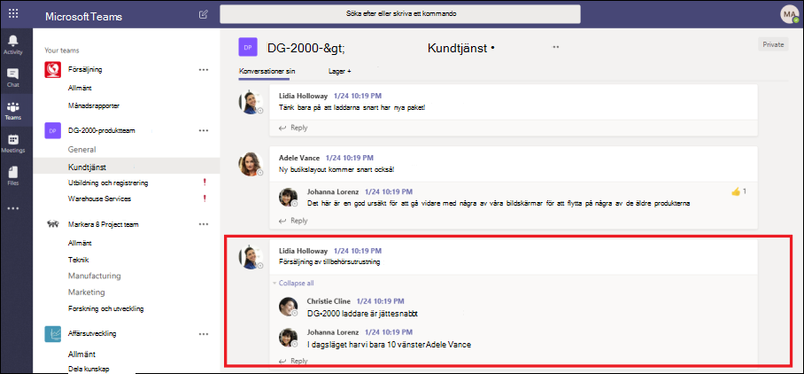
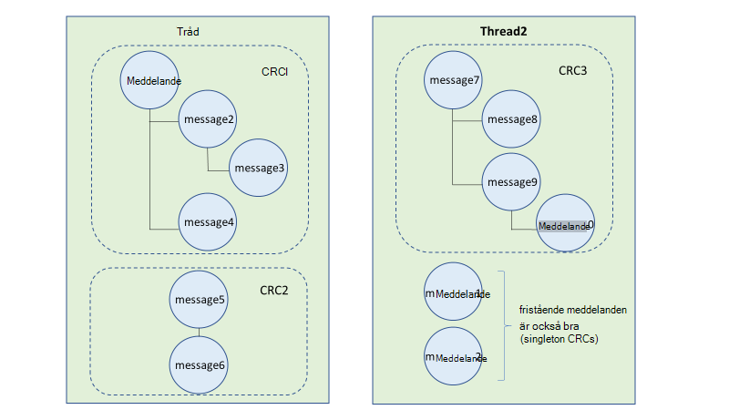
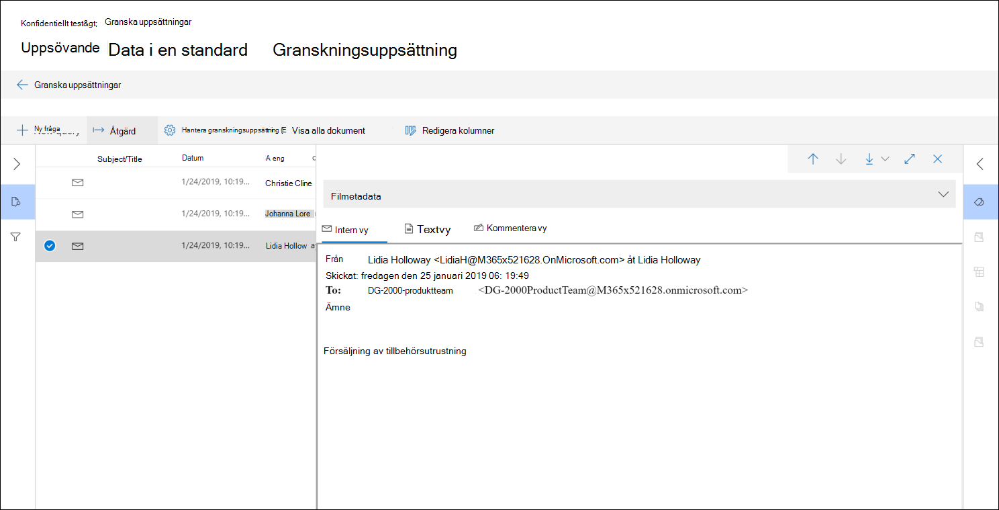
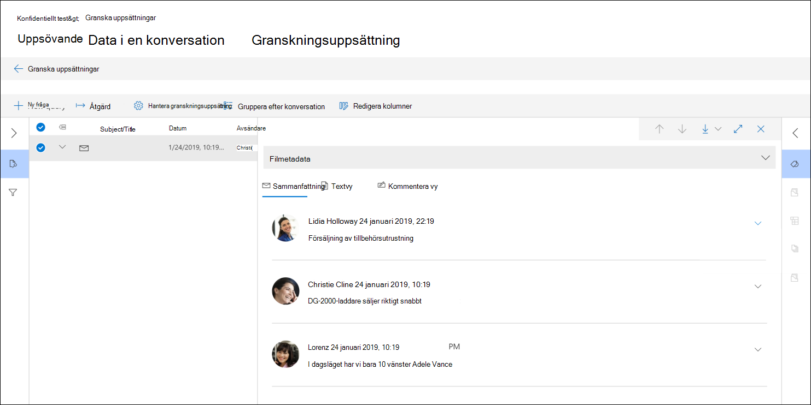
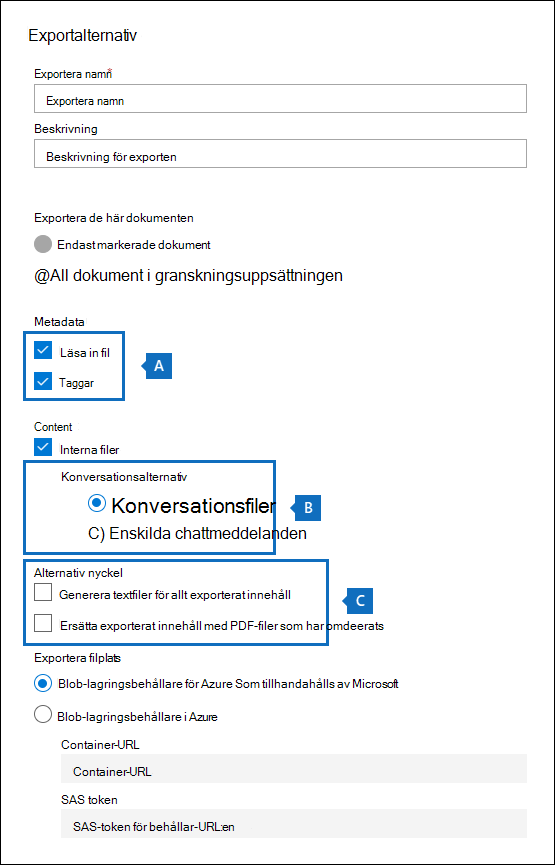

# Konversationstrådning i Advanced eDiscovery

Snabbmeddelanden är ett bekvämt sätt att ställa frågor, dela idéer eller snabbt kommunicera med en stor publik. Som snabbmeddelandeplattformar, till exempel Microsoft Teams- och Yammer-grupper, blir grundläggande för samarbete inom företaget måste organisationer utvärdera hur deras eDiscovery-arbetsflöden hanterar dessa nya former av kommunikation och samarbete.

Funktionen Konversationsbyggnad i Advanced eDiscovery är utformad för att hjälpa dig att identifiera sammanhangsberoende innehåll och skapa unika konversationsvyer. Med den här funktionen kan du snabbt och effektivt granska fullständiga snabbmeddelandekonversationer (även kallade trådade konversationer) som genereras på plattformar som Microsoft Teams.

Med Konversationsbyggnad kan du använda inbyggda funktioner för att återskapa, granska och exportera trådade konversationer. Använd Advanced eDiscovery konversation och se till att:

- Bevara unika metadata på meddelandenivå för alla meddelanden i en konversation.

- Samla in sammanhangsbaserade meddelanden runt sökresultaten.

- Granska, kommentera och redactera trådade konversationer.

- Exportera enskilda meddelanden eller trådade konversationer

## Terminologi

Här är några definitioner som hjälper dig att komma igång med konversationsbyggnad.

- **Meddelanden:** Representerar den minsta enheten i en konversation. Meddelanden kan variera i storlek, struktur och metadata. 

- **Konversation:** Representerar en gruppering av ett eller flera meddelanden. Konversationer kan representeras på olika sätt i olika program. I vissa program finns det en explicit åtgärd som resulterar i att svara på ett befintligt meddelande. Konversationer skapas explicit som ett resultat av den här användaråtgärden. Här är till exempel en skärmbild av en kanalkonversation i Microsoft Teams.

   

   I andra program (till exempel 1xN-chattmeddelanden i Teams) finns det inte en formell svarskedjan utan i stället visas meddelanden som en "platt flod av meddelanden" i en enda tråd. I de här typerna av appar härförs konversationer från en grupp meddelanden som inträffar inom en viss tid. Den här "mjuka gruppering" av meddelanden (i motsats till en svarskedjan) representerar "fram och tillbaka"-konversationen om ett särskilt intresse.

## Steg 1: Skapa ett utkast

När du har identifierat relevanta sökfunktionen och innehållsplatser kan du skapa en sökning för att hitta potentiellt relevant innehåll. På fliken **Samlingar** i det Advanced eDiscovery ärende kan du skapa en samling genom att klicka på **Ny samling** och följa guiden. Mer information om hur du kan skapa en samling, skapa en sökfråga och förhandsgranska sökresultaten finns i [Skapa en utkastsamling](create-draft-collection.md).

## Steg 2: Spara ett utkast till en granskningsuppsättning

När du har granskat och färdigställt sökfrågan i en samling kan du lägga till sökresultatet i en granskningsuppsättning. När du lägger till dina sökresultat i en granskningsuppsättning kopieras ursprungliga data till ett Azure Storage för att underlätta gransknings- och analysprocessen. Mer information om hur du lägger till sökresultat i en granskningsuppsättning finns i [Spara ett utkast till en granskningsuppsättning.](commit-draft-collection.md)

När du lägger till objekt från konversationer i en granskningsuppsättning kan du använda alternativet trådade konversationer för att samla in sammanhangsbaserade meddelanden från konversationer som innehåller objekt som matchar sökvillkoren i samlingen. När du har valt alternativet trådkonversationer kan följande saker hända:

  
  
1. Med hjälp av ett nyckelord och en datumintervallfråga returnerade sökningen en träff *i meddelande 3.* Det här meddelandet var en del av en större konversation, illustrerad av *CRC1*.
  
2. När du lägger till data i en granskningsuppsättning och aktiverar alternativ för konversationshämtning går Advanced eDiscovery tillbaka och samlar in andra objekt i *CRC1.*
  
3. När objekten har lagts till i granskningsuppsättningen kan du granska alla enskilda meddelanden från *CRC1.*

Information om hur du aktiverar alternativet trådade konversationer finns i [Spara ett utkast till en granskningsuppsättning](commit-draft-collection.md#commit-a-draft-collection-to-a-review-set).
  
## Steg 3: Granska och exportera trådade konversationer

När innehållet har bearbetats och lagts till i granskningsuppsättningen kan du börja granska data i granskningsuppsättningen. Granskningsfunktionerna skiljer sig åt beroende på om innehållet har lagts till i en standardgranskningsuppsättning eller en uppsättning konversationsgranskningar.

### Granska konversationer i en standardgranskningsuppsättning

I en standardgranskningsuppsättning bearbetas och visas meddelanden som enskilda objekt, ungefär på samma sätt som de lagras i en postlådemapp. I det här arbetsflödet behandlas varje meddelande som ett separat objekt. Därför är de trådade sammanfattnings- och exportalternativen inte tillgängliga i en standarduppsättning för granskning.

  

### Granska konversationer i en uppsättning med konversationsgranskning

När en konversationsgranskning har ställts in trådas enskilda meddelanden samman och visas som konversationer. På så sätt kan du granska och exportera sammanhangsberoende konversationer. 

  

I följande avsnitt beskrivs hur du granskar och exporterar konversationer i en uppsättning konversationsgranskning.

#### Granska konversationer

I en uppsättning med konversationsgranskning kan du använda följande alternativ för att underlätta granskningsprocessen.

- **Gruppera efter konversation:** Grupperar meddelanden i samma konversation tillsammans för att hjälpa användare att förenkla och underlätta granskningsprocessen.

- **Sammanfattningsvy:** Visar den trådade konversationen. I den här vyn kan du se hela konversationen och även komma åt metadata för varje enskilt meddelande.  
  
   - Visa metadata för enskilda meddelanden
   
   - Ladda ned enskilda meddelanden

- **Textvy:** Ger extraherad text för hela konversationen.

- **Kommentera vyn:** Med det här alternativet kan du markera en trådad vy av konversationen. Alla meddelanden i konversationen delar samma kommenterade dokument.

- **Märkning:** När du visar konversationer i en granskningsuppsättning kan du visa och använda taggar genom att klicka **på Taggningspanel** i panelen Kodning.

- **Kör konversationskonvertering igen:** När meddelanden läggs till i en uppsättning med konversationsgranskning körs ett konverteringsjobb automatiskt för att skapa den trådade sammanfattningen och kommentera vyerna. Om jobbet Konversationsbyggnad inte fungerar kan du köra det här jobbet igen genom att klicka på Åtgärd **> Skapa konversations-PDF-filer** i granskningsuppsättningen.

#### Exportera konversationer

I en konversationsgranskning kan du ange följande alternativ för att exportera konversationer:

a. Metadataalternativ

   - **Läs in fil:** Metadata ingår för varje enskilt meddelande, e-postmeddelande och dokument. Det finns en rad för varje meddelande i en konversation. 

   - **Taggar:** Taggar från din granskningsprocess ingår i metadatafilen. Meddelanden i en konversation har samma taggar. 

b. Konversationsalternativ
  
   - **Konversationsfiler:** När du exporterar konversationsfiler konverteras den kommenterade vyn till en PDF-fil och laddas ned till exportmappen. Meddelanden i en konversationsfil pekar på PDF-versionen av samma konversationsfil.  
  
   - **Enskilda chattmeddelanden:** När du exporterar enskilda meddelanden exporteras varje unikt meddelande i konversationen som ett fristående objekt. Filen exporteras i samma format som den sparades som i postlådan. För en viss konversation får du flera MSG-filer.

     >[!NOTE]
     > Om du har använt anteckningar i konversationsfilen överförs inte de här anteckningarna till de enskilda meddelandena.

c. Andra alternativ

   - **Generera textfiler för allt exporterat innehåll:** Genererar en textfil för varje konversation som exporteras från granskningsuppsättningen.

   - **Ersätta exporterat innehåll med pdf-filer som har omaktiverats:** Om omaktade konversationsfiler genereras under granskningsprocessen är dessa filer tillgängliga under exporten. Du kan bestämma dig för om du bara vill exportera originalfilerna (genom att inte välja det här alternativet) eller ersätta de ursprungliga filerna med de omdrekventa versionerna av de ursprungliga filerna (genom att välja det här alternativet), som exporteras som PDF-filer.

## Mer information

Mer information om hur du granskar ärendedata i Advanced eDiscovery finns i följande artiklar:

- [Visa ärendedata](view-documents-in-review-set.md)

- [Analysera ärendedata](analyzing-data-in-review-set.md)

- [Exportera ärendedata](exporting-data-ediscover20.md)
