# <a name="create-a-custom-sensitive-information-type-using-powershell"></a><span data-ttu-id="801e1-103">Skapa en anpassad typ av känslig information med PowerShell</span><span class="sxs-lookup"><span data-stu-id="801e1-103">Create a custom sensitive information type using PowerShell</span></span>

<span data-ttu-id="801e1-104">I det här avsnittet beskrivs hur du använder PowerShell för att skapa en XML-fil för *regelpaket* som definierar dina egna [typer av känslig information](sensitive-information-type-entity-definitions.md).</span><span class="sxs-lookup"><span data-stu-id="801e1-104">This topic shows you how to use PowerShell to create an XML *rule package* file that defines your own custom [sensitive information types](sensitive-information-type-entity-definitions.md).</span></span> <span data-ttu-id="801e1-105">Du behöver veta hur du skapar ett reguljärt uttryck.</span><span class="sxs-lookup"><span data-stu-id="801e1-105">You need to know how to create a regular expression.</span></span> <span data-ttu-id="801e1-106">I det här avsnittet skapas exempelvis en anpassad typ av känslig information som identifierar ett medarbetar-ID.</span><span class="sxs-lookup"><span data-stu-id="801e1-106">As an example, this topic creates a custom sensitive information type that identifies an employee ID.</span></span> <span data-ttu-id="801e1-107">Du kan använda det här XML-exemplet som utgångspunkt för din egen XML-fil.</span><span class="sxs-lookup"><span data-stu-id="801e1-107">You can use this example XML as a starting point for your own XML file.</span></span> <span data-ttu-id="801e1-108">Se [Läs mer om typer av känslig information](sensitive-information-type-learn-about.md) om du inte har använt typer av känslig information tidigare.</span><span class="sxs-lookup"><span data-stu-id="801e1-108">If you are new to sensitive information types, see [Learn about sensitive information types](sensitive-information-type-learn-about.md).</span></span>

<span data-ttu-id="801e1-109">När du har skapat en korrekt formaterad XML-fil kan du ladda upp den till Microsoft 365 med hjälp av Microsoft 365 PowerShell.</span><span class="sxs-lookup"><span data-stu-id="801e1-109">After you've created a well-formed XML file, you can upload it to Microsoft 365 by using Microsoft 365 PowerShell.</span></span> <span data-ttu-id="801e1-110">Sedan är du redo att använda din anpassade typ av känslig information i dina principer och testa att den identifierar denna känsliga information på det sätt som du tänkt dig.</span><span class="sxs-lookup"><span data-stu-id="801e1-110">Then you're ready to use your custom sensitive information type in your policies and test that it's detecting the sensitive information as you intended.</span></span>

> [!NOTE]
> <span data-ttu-id="801e1-111">Om du inte behöver den detaljerade kontroll som du får med PowerShell kan du skapa anpassade typer av känslig information i efterlevnadscentret.</span><span class="sxs-lookup"><span data-stu-id="801e1-111">If you don't need the fine grained control that PowerShell provides, you can create custom sensitive information types in the Compliance center.</span></span> <span data-ttu-id="801e1-112">Mer information finns i [Skapa en anpassad typ av känslig information](create-a-custom-sensitive-information-type.md).</span><span class="sxs-lookup"><span data-stu-id="801e1-112">For more information, see [Create a custom sensitive information type](create-a-custom-sensitive-information-type.md).</span></span>

## <a name="important-disclaimer"></a><span data-ttu-id="801e1-113">Viktig ansvarsfriskrivning</span><span class="sxs-lookup"><span data-stu-id="801e1-113">Important disclaimer</span></span>

<span data-ttu-id="801e1-114">På grund av skillnaderna mellan olika kundmiljöer och innehållsmatchningskrav kan Microsoft Support inte hjälpa till med att ge anpassade definitioner för innehållsmatchning, till exempel definiera anpassade klassificeringar eller mönster för reguljära uttryck (även kallade RegEx).</span><span class="sxs-lookup"><span data-stu-id="801e1-114">Due to the variances in customer environments and content match requirements, Microsoft Support cannot assist in providing custom content-matching definitions; e.g., defining custom classifications or regular expression (also known as RegEx) patterns.</span></span> <span data-ttu-id="801e1-115">För utveckling, testning och felsökning av anpassad innehållsmatchning måste Microsoft 365-kunder förlita sig på interna IT-resurser, eller använda en extern konsultresurs som Microsoft Consulting Services (MCS).</span><span class="sxs-lookup"><span data-stu-id="801e1-115">For custom content-matching development, testing, and debugging, Microsoft 365 customers will need to rely upon internal IT resources, or use an external consulting resource such as Microsoft Consulting Services (MCS).</span></span> <span data-ttu-id="801e1-116">Supporttekniker kan ge begränsad support för funktionen, men kan inte garantera att utvecklingen av anpassad innehållsmatchning uppfyller kundens krav eller skyldigheter.</span><span class="sxs-lookup"><span data-stu-id="801e1-116">Support engineers can provide limited support for the feature, but cannot provide assurances that any custom content-matching development will fulfill the customer's requirements or obligations.</span></span>  <span data-ttu-id="801e1-117">En typ av support som kan tillhandahållas är exempelmönster för reguljära uttryck för testningsändamål.</span><span class="sxs-lookup"><span data-stu-id="801e1-117">As an example of the type of support that can be provided, sample regular expression patterns may be provided for testing purposes.</span></span> <span data-ttu-id="801e1-118">Eller så kan supporten hjälpa till att felsöka ett befintligt RegEx-mönster som inte utlöses som förväntat med ett enskilt specifikt innehållsexempel.</span><span class="sxs-lookup"><span data-stu-id="801e1-118">Or, support can assist with troubleshooting an existing RegEx pattern which is not triggering as expected with a single specific content example.</span></span>

<span data-ttu-id="801e1-119">Se [Möjliga verifieringsproblem som du bör känna till ](#potential-validation-issues-to-be-aware-of) i det här avsnittet.</span><span class="sxs-lookup"><span data-stu-id="801e1-119">See [Potential validation issues to be aware of](#potential-validation-issues-to-be-aware-of) in this topic.</span></span>

<span data-ttu-id="801e1-120">Mer information om Boost.RegEx-motorn (tidigare kallad RegEx++) som används för att bearbeta texten finns i [Boost.Regex 5.1.3](https://www.boost.org/doc/libs/1_68_0/libs/regex/doc/html/).</span><span class="sxs-lookup"><span data-stu-id="801e1-120">For more information about the Boost.RegEx (formerly known as RegEx++) engine that's used for processing the text, see [Boost.Regex 5.1.3](https://www.boost.org/doc/libs/1_68_0/libs/regex/doc/html/).</span></span>

> [!NOTE]
> <span data-ttu-id="801e1-121">Om du använder ett et-tecken (&) som en del av ett nyckelord i din anpassade typ av känslig information, observera att det finns ett känt problem.</span><span class="sxs-lookup"><span data-stu-id="801e1-121">If you use an ampersand character (&) as part of a keyword in your custom sensitive information type, please note that there is a known issue.</span></span> <span data-ttu-id="801e1-122">Du bör lägga till ytterligare en term med blanksteg runt tecknet för att se till att tecknet identifieras korrekt, till exempel L & P _inte_ L&P.</span><span class="sxs-lookup"><span data-stu-id="801e1-122">You should add an additional term with spaces around the character to make sure that the character is properly identified, for example, L & P _not_ L&P.</span></span>

## <a name="sample-xml-of-a-rule-package"></a><span data-ttu-id="801e1-123">XML-exempel för regelpaket</span><span class="sxs-lookup"><span data-stu-id="801e1-123">Sample XML of a rule package</span></span>

<span data-ttu-id="801e1-124">Här är XML-exempelkoden för det regelpaketet som vi skapar i det här avsnittet.</span><span class="sxs-lookup"><span data-stu-id="801e1-124">Here's the sample XML of the rule package that we'll create in this topic.</span></span> <span data-ttu-id="801e1-125">Element och attribut förklaras i avsnitten nedan.</span><span class="sxs-lookup"><span data-stu-id="801e1-125">Elements and attributes are explained in the sections below.</span></span>
  
```xml
<?xml version="1.0" encoding="UTF-16"?>
<RulePackage xmlns="http://schemas.microsoft.com/office/2011/mce">
<RulePack id="DAD86A92-AB18-43BB-AB35-96F7C594ADAA">
  <Version build="0" major="1" minor="0" revision="0"/>
  <Publisher id="619DD8C3-7B80-4998-A312-4DF0402BAC04"/>
  <Details defaultLangCode="en-us">
    <LocalizedDetails langcode="en-us">
      <PublisherName>Contoso</PublisherName>
      <Name>Employee ID Custom Rule Pack</Name>
      <Description>
      This rule package contains the custom Employee ID entity.
      </Description>
    </LocalizedDetails>
  </Details>
</RulePack>
<Rules>
<!-- Employee ID -->
  <Entity id="E1CC861E-3FE9-4A58-82DF-4BD259EAB378" patternsProximity="300" recommendedConfidence="75">
    <Pattern confidenceLevel="65">
      <IdMatch idRef="Regex_employee_id"/>
    </Pattern>
    <Pattern confidenceLevel="75">
      <IdMatch idRef="Regex_employee_id"/>
      <Match idRef="Func_us_date"/>
    </Pattern>
    <Pattern confidenceLevel="85">
      <IdMatch idRef="Regex_employee_id"/>
      <Match idRef="Func_us_date"/>
      <Any minMatches="1">
        <Match idRef="Keyword_badge" minCount="2"/>
        <Match idRef="Keyword_employee"/>
      </Any>
      <Any minMatches="0" maxMatches="0">
        <Match idRef="Keyword_false_positives_local"/>
        <Match idRef="Keyword_false_positives_intl"/>
      </Any>
    </Pattern>
  </Entity>
  <Regex id="Regex_employee_id">(\s)(\d{9})(\s)</Regex>
  <Keyword id="Keyword_employee">
    <Group matchStyle="word">
      <Term>Identification</Term>
      <Term>Contoso Employee</Term>
    </Group>
  </Keyword>
  <Keyword id="Keyword_badge">
    <Group matchStyle="string">
      <Term>card</Term>
      <Term>badge</Term>
      <Term caseSensitive="true">ID</Term>
    </Group>
  </Keyword>
  <Keyword id="Keyword_false_positives_local">
    <Group matchStyle="word">
      <Term>credit card</Term>
      <Term>national ID</Term>
    </Group>
  </Keyword>
  <Keyword id="Keyword_false_positives_intl">
    <Group matchStyle="word">
      <Term>identity card</Term>
      <Term>national ID</Term>
      <Term>EU debit card</Term>
    </Group>
  </Keyword>
  <LocalizedStrings>
    <Resource idRef="E1CC861E-3FE9-4A58-82DF-4BD259EAB378">
      <Name default="true" langcode="en-us">Employee ID</Name>
      <Description default="true" langcode="en-us">
      A custom classification for detecting Employee IDs.
      </Description>
      <Description default="false" langcode="de-de">
      Description for German locale.
      </Description>
    </Resource>
  </LocalizedStrings>
</Rules>
</RulePackage>
```

## <a name="what-are-your-key-requirements-rule-entity-pattern-elements"></a><span data-ttu-id="801e1-126">Vilka är dina viktigaste krav?</span><span class="sxs-lookup"><span data-stu-id="801e1-126">What are your key requirements?</span></span> <span data-ttu-id="801e1-127">[elementen Rule, Entity, Pattern]</span><span class="sxs-lookup"><span data-stu-id="801e1-127">[Rule, Entity, Pattern elements]</span></span>

<span data-ttu-id="801e1-128">Innan du börjar är det bra om du förstår den grundläggande strukturen i XML-schemat för en regel och hur du kan använda den här strukturen för att definiera en anpassad typ av känslig information så att rätt innehåll identifieras.</span><span class="sxs-lookup"><span data-stu-id="801e1-128">Before you get started, it's helpful to understand the basic structure of the XML schema for a rule, and how you can use this structure to define your custom sensitive information type so that it will identify the right content.</span></span>
  
<span data-ttu-id="801e1-129">En regel definierar en eller flera entiteter (typer av känslig information) och varje entitet definierar ett eller flera mönster.</span><span class="sxs-lookup"><span data-stu-id="801e1-129">A rule defines one or more entities (sensitive information types), and each entity defines one or more patterns.</span></span> <span data-ttu-id="801e1-130">En princip söker efter mönster när den utvärderar innehåll som e-post och dokument.</span><span class="sxs-lookup"><span data-stu-id="801e1-130">A pattern is what a policy looks for when it evaluates content such as email and documents.</span></span>

<span data-ttu-id="801e1-131">I det här avsnittet med XML-kod avser regel de mönster som definierar en entitet, även kallad typ av känslig information.</span><span class="sxs-lookup"><span data-stu-id="801e1-131">In this topic, the XML markup uses rule to mean the patterns that define an entity, also known as a sensitive information type.</span></span> <span data-ttu-id="801e1-132">När du ser en regel i det här avsnittet motsvarar den alltså entitet eller typ av känslig information, inte villkor och åtgärder.</span><span class="sxs-lookup"><span data-stu-id="801e1-132">So in this topic, when you see rule, think entity or sensitive information type, not conditions and actions.</span></span>
  
### <a name="simplest-scenario-entity-with-one-pattern"></a><span data-ttu-id="801e1-133">Enklaste scenariot: entitet med ett mönster</span><span class="sxs-lookup"><span data-stu-id="801e1-133">Simplest scenario: entity with one pattern</span></span>

<span data-ttu-id="801e1-134">Här är det enklaste scenariot.</span><span class="sxs-lookup"><span data-stu-id="801e1-134">Here's the simplest scenario.</span></span> <span data-ttu-id="801e1-135">Du vill att principen ska identifiera innehåll som innehåller organisationens medarbetar-ID, som är formaterat som ett niosiffrigt nummer.</span><span class="sxs-lookup"><span data-stu-id="801e1-135">You want your policy to identify content that contains your organization's employee ID, which is formatted as a nine-digit number.</span></span> <span data-ttu-id="801e1-136">Mönstret refererar därför till ett reguljärt uttryck som finns i en regel som identifierar niosiffriga nummer.</span><span class="sxs-lookup"><span data-stu-id="801e1-136">So the pattern refers to a regular expression contained in the rule that identifies nine-digit numbers.</span></span> <span data-ttu-id="801e1-137">Allt innehåll som innehåller ett niosiffrigt nummer uppfyller mönstret.</span><span class="sxs-lookup"><span data-stu-id="801e1-137">Any content containing a nine-digit number satisfies the pattern.</span></span>
  
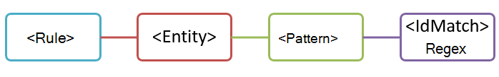
  
<span data-ttu-id="801e1-139">Det här är ett enkelt mönster som riskerar att identifiera många falska positiva identifieringar eftersom det matchar alla niosiffriga nummer, inte bara medarbetar-ID:n.</span><span class="sxs-lookup"><span data-stu-id="801e1-139">However, while simple, this pattern may identify many false positives by matching content that contains any nine-digit number that is not necessarily an employee ID.</span></span>
  
### <a name="more-common-scenario-entity-with-multiple-patterns"></a><span data-ttu-id="801e1-140">Ett vanligare scenario: entitet med flera mönster</span><span class="sxs-lookup"><span data-stu-id="801e1-140">More common scenario: entity with multiple patterns</span></span>

<span data-ttu-id="801e1-141">Därför är det vanligare att definiera en entitet med hjälp av flera mönster, där mönster identifierar bevis (till exempel ett nyckelord eller datum) utöver enheten (till exempel ett niosiffrigt nummer).</span><span class="sxs-lookup"><span data-stu-id="801e1-141">For this reason, it's more common to define an entity by using more than one pattern, where the patterns identify supporting evidence (such as a keyword or date) in addition to the entity (such as a nine-digit number).</span></span>
  
<span data-ttu-id="801e1-142">Om du vill öka sannolikheten att exempelvis identifiera ett faktiskt medarbetar-ID i ett visst innehåll kan du definiera ett annat mönster som även identifierar anställningsdatum, och definiera ytterligare ett mönster som identifierar både ett anställningsdatum och ett nyckelord (till exempel ”medarbetar-ID”), utöver det niosiffriga numret.</span><span class="sxs-lookup"><span data-stu-id="801e1-142">For example, to increase the likelihood of identifying content that contains an employee ID, you can define another pattern that also identifies a hire date, and define yet another pattern that identifies both a hire date and a keyword (such as "employee ID"), in addition to the nine-digit number.</span></span>
  
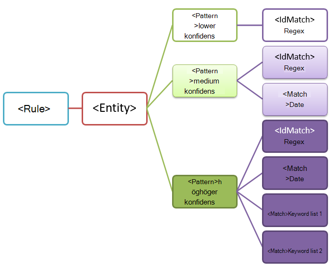
  
<span data-ttu-id="801e1-144">Observera några viktiga aspekter av den här strukturen:</span><span class="sxs-lookup"><span data-stu-id="801e1-144">Note a couple of important aspects of this structure:</span></span>
  
- <span data-ttu-id="801e1-145">Mönster som kräver fler bevis har högre konfidensnivå.</span><span class="sxs-lookup"><span data-stu-id="801e1-145">Patterns that require more evidence have a higher confidence level.</span></span> <span data-ttu-id="801e1-146">Du kan ha nytta av detta senare när du använder den här typen av känslig information i en princip då du kan använda mer begränsande åtgärder (till exempel blockera innehåll) med endast matchningar med högre säkerhet och du kan använda mindre begränsande åtgärder (till exempel skicka meddelande) med matchningar med lägre säkerhet.</span><span class="sxs-lookup"><span data-stu-id="801e1-146">This is useful because when you later use this sensitive information type in a policy, you can use more restrictive actions (such as block content) with only the higher-confidence matches, and you can use less restrictive actions (such as send notification) with the lower-confidence matches.</span></span>

- <span data-ttu-id="801e1-147">Stödelementen IdMatch och Match refererar till regex och nyckelord som är underordnade Rules-elementet, inte Pattern-elementet.</span><span class="sxs-lookup"><span data-stu-id="801e1-147">The supporting IdMatch and Match elements reference regexes and keywords that are actually children of the Rule element, not the Pattern.</span></span> <span data-ttu-id="801e1-148">De här stödelementen refereras till av Pattern-elementet men tas med i Rules-elementet.</span><span class="sxs-lookup"><span data-stu-id="801e1-148">These supporting elements are referenced by the Pattern but included in the Rule.</span></span> <span data-ttu-id="801e1-149">Det innebär att en enda definition av ett stödelement, till exempel ett reguljärt uttryck eller en nyckelordslista, kan refereras till av flera entiteter och mönster.</span><span class="sxs-lookup"><span data-stu-id="801e1-149">This means that a single definition of a supporting element, like a regular expression or a keyword list, can be referenced by multiple entities and patterns.</span></span>

## <a name="what-entity-do-you-need-to-identify-entity-element-id-attribute"></a><span data-ttu-id="801e1-150">Vilken entitet behöver du identifiera?</span><span class="sxs-lookup"><span data-stu-id="801e1-150">What entity do you need to identify?</span></span> <span data-ttu-id="801e1-151">[elementet Entity, attributet id]</span><span class="sxs-lookup"><span data-stu-id="801e1-151">[Entity element, id attribute]</span></span>

<span data-ttu-id="801e1-152">En entitet är en typ av känslig information, till exempel kreditkortsnummer, som har ett väldefinierat mönster.</span><span class="sxs-lookup"><span data-stu-id="801e1-152">An entity is a sensitive information type, such as a credit card number, that has a well-defined pattern.</span></span> <span data-ttu-id="801e1-153">Varje entitet har ett unikt GUID som ID.</span><span class="sxs-lookup"><span data-stu-id="801e1-153">Each entity has a unique GUID as its ID.</span></span>
  
### <a name="name-the-entity-and-generate-its-guid"></a><span data-ttu-id="801e1-154">Namnge entiteten och generera dess GUID</span><span class="sxs-lookup"><span data-stu-id="801e1-154">Name the entity and generate its GUID</span></span>

1. <span data-ttu-id="801e1-155">Lägg till elementen Rules och Entity i valfri XML-redigerare.</span><span class="sxs-lookup"><span data-stu-id="801e1-155">In your XML editor of choice, add the Rules and Entity elements.</span></span>
2. <span data-ttu-id="801e1-156">Lägg till en kommentar som innehåller namnet på ditt anpassade entitet – i det här exemplet Employee ID (medarbetar-ID).</span><span class="sxs-lookup"><span data-stu-id="801e1-156">Add a comment that contains the name of your custom entity — in this example, Employee ID.</span></span> <span data-ttu-id="801e1-157">Senare lägger du till entitetsnamnet i avsnittet för lokaliserade strängar. Det namnet visas i användargränssnittet när du skapar en princip.</span><span class="sxs-lookup"><span data-stu-id="801e1-157">Later, you'll add the entity name to the localized strings section, and that name is what appears in the UI when you create a policy.</span></span>
3. <span data-ttu-id="801e1-158">Generera ett GUID för entiteten.</span><span class="sxs-lookup"><span data-stu-id="801e1-158">Generate a GUID for your entity.</span></span> <span data-ttu-id="801e1-159">Det finns flera sätt att generera GUID. Ett enkelt sätt är att skriva **[guid]::NewGuid()** i PowerShell.</span><span class="sxs-lookup"><span data-stu-id="801e1-159">There are several ways to generate GUIDs, but you can do it easily in PowerShell by typing **[guid]::NewGuid()**.</span></span> <span data-ttu-id="801e1-160">Senare lägger du även till GUID för entiteten i avsnittet för lokaliserade strängar.</span><span class="sxs-lookup"><span data-stu-id="801e1-160">Later, you'll also add the entity GUID to the localized strings section.</span></span>
  
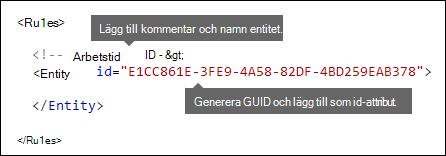
  
## <a name="what-pattern-do-you-want-to-match-pattern-element-idmatch-element-regex-element"></a><span data-ttu-id="801e1-162">Vilket mönster vill du matcha?</span><span class="sxs-lookup"><span data-stu-id="801e1-162">What pattern do you want to match?</span></span> <span data-ttu-id="801e1-163">[elementet Pattern, elementet IdMatch, elementet Regex]</span><span class="sxs-lookup"><span data-stu-id="801e1-163">[Pattern element, IdMatch element, Regex element]</span></span>

<span data-ttu-id="801e1-164">Mönstret innehåller en lista över vad typen av känslig information söker efter.</span><span class="sxs-lookup"><span data-stu-id="801e1-164">The pattern contains the list of what the sensitive information type is looking for.</span></span> <span data-ttu-id="801e1-165">Det kan vara regex, nyckelord och inbyggda funktioner (som utför uppgifter som att köra regex för att hitta datum eller adresser).</span><span class="sxs-lookup"><span data-stu-id="801e1-165">This can include regexes, keywords, and built-in functions (which perform tasks like running regexes to find dates or addresses).</span></span> <span data-ttu-id="801e1-166">Typer av känslig information kan ha flera mönster med unika konfidenser.</span><span class="sxs-lookup"><span data-stu-id="801e1-166">Sensitive information types can have multiple patterns with unique confidences.</span></span>
  
<span data-ttu-id="801e1-167">Gemensamt för alla mönster nedan är att de refererar till samma reguljära uttryck, som söker efter ett niosiffrigt nummer (\d{9}) omgivet av tomt utrymme (\s) …</span><span class="sxs-lookup"><span data-stu-id="801e1-167">What all of the below patterns have in common is that they all reference the same regular expression, which looks for a nine-digit number (\d{9}) surrounded by white space (\s) …</span></span> <span data-ttu-id="801e1-168">(\s).</span><span class="sxs-lookup"><span data-stu-id="801e1-168">(\s).</span></span> <span data-ttu-id="801e1-169">Det här reguljära uttrycket refereras av IdMatch-elementet och är det vanliga kravet för alla mönster som letar efter entiteten Employee ID (medarbetar-ID).</span><span class="sxs-lookup"><span data-stu-id="801e1-169">This regular expression is referenced by the IdMatch element and is the common requirement for all patterns that look for the Employee ID entity.</span></span> <span data-ttu-id="801e1-170">IdMatch är identifieraren som mönstret försöker matcha, till exempel medarbetar-ID, kreditkortsnummer eller personnummer.</span><span class="sxs-lookup"><span data-stu-id="801e1-170">IdMatch is the identifier that the pattern is to trying to match, such as Employee ID or credit card number or social security number.</span></span> <span data-ttu-id="801e1-171">Ett Pattern-element måste ha exakt ett IdMatch-element.</span><span class="sxs-lookup"><span data-stu-id="801e1-171">A Pattern element must have exactly one IdMatch element.</span></span>
  
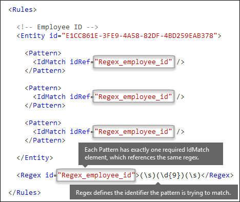
  
<span data-ttu-id="801e1-173">Om mönstret uppfylls returneras ett antal och konfidensnivån, som du kan använda i villkoren i din princip.</span><span class="sxs-lookup"><span data-stu-id="801e1-173">When satisfied, a pattern returns a count and confidence level, which you can use in the conditions in your policy.</span></span> <span data-ttu-id="801e1-174">När du lägger till ett villkor för att identifiera en typ av känslig information i en princip kan du redigera antalet och konfidensnivån på det sätt som visas här.</span><span class="sxs-lookup"><span data-stu-id="801e1-174">When you add a condition for detecting a sensitive information type to a policy, you can edit the count and confidence level as shown here.</span></span> <span data-ttu-id="801e1-175">Konfidensnivån (kallas även matchningsnoggrannhet) förklaras senare i det här avsnittet.</span><span class="sxs-lookup"><span data-stu-id="801e1-175">Confidence level (also called match accuracy) is explained later in this topic.</span></span>
  

  
<span data-ttu-id="801e1-177">När du skapar ett reguljärt uttryck finns det möjliga problem som du bör känna till.</span><span class="sxs-lookup"><span data-stu-id="801e1-177">When you create your regular expression, keep in mind that there are potential issues to be aware of.</span></span> <span data-ttu-id="801e1-178">Om du till exempel skriver och laddar upp en regex som identifierar för mycket innehåll kan det påverka prestanda.</span><span class="sxs-lookup"><span data-stu-id="801e1-178">For example, if you write and upload a regex that identifies too much content, this can impact performance.</span></span> <span data-ttu-id="801e1-179">Mer information om möjliga problem finns i avsnittet [Möjliga verifieringsproblem som du bör känna till](#potential-validation-issues-to-be-aware-of).</span><span class="sxs-lookup"><span data-stu-id="801e1-179">To learn more about these potential issues, see the later section [Potential validation issues to be aware of](#potential-validation-issues-to-be-aware-of).</span></span>
  
## <a name="do-you-want-to-require-additional-evidence-match-element-mincount-attribute"></a><span data-ttu-id="801e1-180">Vill du kräva ytterligare bevis?</span><span class="sxs-lookup"><span data-stu-id="801e1-180">Do you want to require additional evidence?</span></span> <span data-ttu-id="801e1-181">[elementet Match, attributet minCount]</span><span class="sxs-lookup"><span data-stu-id="801e1-181">[Match element, minCount attribute]</span></span>

<span data-ttu-id="801e1-182">Förutom IdMatch kan ett mönster använda elementet Match för att kräva ytterligare bevis, till exempel nyckelord, regex, datum eller adress.</span><span class="sxs-lookup"><span data-stu-id="801e1-182">In addition to the IdMatch, a pattern can use the Match element to require additional supporting evidence, such as a keyword, regex, date, or address.</span></span>
  
<span data-ttu-id="801e1-183">Ett mönster kan innehålla flera Match-element. De kan tas med direkt i Pattern-elementet eller kombineras med hjälp av elementet Any.</span><span class="sxs-lookup"><span data-stu-id="801e1-183">A Pattern can include multiple Match elements; they can be included directly in the Pattern element or combined by using the Any element.</span></span> <span data-ttu-id="801e1-184">Match-element sammanfogas av en implicit OCH-operator. Alla Match-element måste vara uppfyllda för att mönstret ska matchas.</span><span class="sxs-lookup"><span data-stu-id="801e1-184">Match elements are joined by an implicit AND operator; all Match elements must be satisfied for the pattern to be matched.</span></span> <span data-ttu-id="801e1-185">Du kan använda elementet Any till att introducera OCH- eller ELLER-operatorer (mer om det i ett senare avsnitt).</span><span class="sxs-lookup"><span data-stu-id="801e1-185">You can use the Any element to introduce AND or OR operators (more on that in a later section).</span></span>
  
<span data-ttu-id="801e1-186">Du kan använda det valfria attributet minCount till att ange hur många instanser av en matchning som behöver hittas för varje Match-element.</span><span class="sxs-lookup"><span data-stu-id="801e1-186">You can use the optional minCount attribute to specify how many instances of a match need to be found for each of the Match elements.</span></span> <span data-ttu-id="801e1-187">Du kan till exempel ange att ett mönster bara är uppfyllt när minst två nyckelord från en nyckelordslista hittas.</span><span class="sxs-lookup"><span data-stu-id="801e1-187">For example, you can specify that a pattern is satisfied only when at least two keywords from a keyword list are found.</span></span>
  
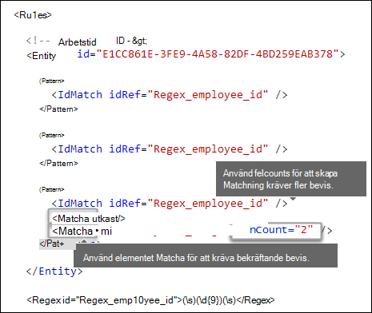
  
### <a name="keywords-keyword-group-and-term-elements-matchstyle-and-casesensitive-attributes"></a><span data-ttu-id="801e1-189">Nyckelord [elementen Keyword, Group och Term elements, attributen matchStyle och caseSensitive]</span><span class="sxs-lookup"><span data-stu-id="801e1-189">Keywords [Keyword, Group, and Term elements, matchStyle and caseSensitive attributes]</span></span>

<span data-ttu-id="801e1-190">När du identifierar känslig information, t.ex. medarbetar-ID, är det vanligt att kräva nyckelord som samarbetsbevis.</span><span class="sxs-lookup"><span data-stu-id="801e1-190">When you identify sensitive information, like an employee ID, you often want to require keywords as corroborative evidence.</span></span> <span data-ttu-id="801e1-191">Förutom att matcha ett niosiffrigt nummer kanske du vill söka efter ord som ”kort”, ”bricka” eller ”ID”.</span><span class="sxs-lookup"><span data-stu-id="801e1-191">For example, in addition to matching a nine-digit number, you may want to look for words like "card", "badge", or "ID".</span></span> <span data-ttu-id="801e1-192">Det gör du med hjälp av elementet Keyword.</span><span class="sxs-lookup"><span data-stu-id="801e1-192">To do this, you use the Keyword element.</span></span> <span data-ttu-id="801e1-193">Keyword-elementet har ett ID-attribut som kan refereras av flera Match-element i flera mönster eller entiteter.</span><span class="sxs-lookup"><span data-stu-id="801e1-193">The Keyword element has an ID attribute that can be referenced by multiple Match elements in multiple patterns or entities.</span></span>
  
<span data-ttu-id="801e1-194">Keyword-element ingår som en lista över Term-element i ett Group-element.</span><span class="sxs-lookup"><span data-stu-id="801e1-194">Keywords are included as a list of Term elements in a Group element.</span></span> <span data-ttu-id="801e1-195">Group-elementet har ett matchStyle-attribut med två möjliga värden:</span><span class="sxs-lookup"><span data-stu-id="801e1-195">The Group element has a matchStyle attribute with two possible values:</span></span>
  
- <span data-ttu-id="801e1-196">**matchStyle="word"** Word-matchningen identifierar hela ord omgivna av tomt utrymme eller andra avgränsare.</span><span class="sxs-lookup"><span data-stu-id="801e1-196">**matchStyle="word"** Word match identifies whole words surrounded by white space or other delimiters.</span></span> <span data-ttu-id="801e1-197">Du bör alltid använda ”word” om du inte behöver matcha delar av ord eller matcha ord på asiatiska språk.</span><span class="sxs-lookup"><span data-stu-id="801e1-197">You should always use word unless you need to match parts of words or match words in Asian languages.</span></span> 
    
- <span data-ttu-id="801e1-198">**matchStyle="string"** identifierar strängar oavsett vad de omges av.</span><span class="sxs-lookup"><span data-stu-id="801e1-198">**matchStyle="string"** String match identifies strings no matter what they're surrounded by.</span></span> <span data-ttu-id="801e1-199">"id" matchar till exempel "sida" och "idé".</span><span class="sxs-lookup"><span data-stu-id="801e1-199">For example, "id" will match "bid" and "idea".</span></span> <span data-ttu-id="801e1-200">Använd ”string” endast när du behöver matcha asiatiska ord eller om ditt nyckelord kan ingå som en del av andra strängar.</span><span class="sxs-lookup"><span data-stu-id="801e1-200">Use string only when you need to match Asian words or if your keyword may be included as part of other strings.</span></span> 
    
<span data-ttu-id="801e1-201">Slutligen kan du använda attributet CaseSensitive för Term-elementet för att ange att innehållet måste matcha nyckelordet exakt, inklusive gemener och versaler.</span><span class="sxs-lookup"><span data-stu-id="801e1-201">Finally, you can use the caseSensitive attribute of the Term element to specify that the content must match the keyword exactly, including lower- and upper-case letters.</span></span>
  
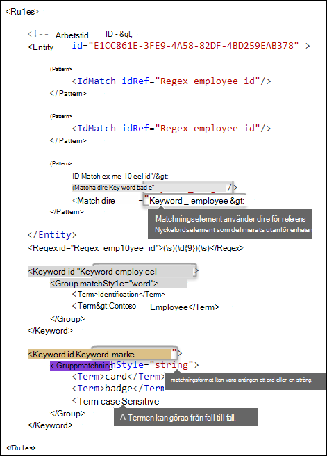
  
### <a name="regular-expressions-regex-element"></a><span data-ttu-id="801e1-203">Reguljära uttryck [elementet Regex]</span><span class="sxs-lookup"><span data-stu-id="801e1-203">Regular expressions [Regex element]</span></span>

<span data-ttu-id="801e1-204">I det här exemplet använder employee ID-entiteten redan elementet IdMatch för att referera till ett regex för mönstret, dvs. ett niosiffrigt nummer omgivet av tomt utrymme.</span><span class="sxs-lookup"><span data-stu-id="801e1-204">In this example, the employee ID entity already uses the IdMatch element to reference a regex for the pattern — a nine-digit number surrounded by whitespace.</span></span> <span data-ttu-id="801e1-205">Ett mönster kan dessutom använda ett Match-element för att referera till ett ytterligare Regex-element för att identifiera samarbetsbevis, till exempel ett fem- eller niosiffrigt nummer i ett amerikanskt postnummerformat.</span><span class="sxs-lookup"><span data-stu-id="801e1-205">In addition, a pattern can use a Match element to reference an additional Regex element to identify corroborative evidence, such as a five- or nine-digit number in the format of a US zip code.</span></span>
  
### <a name="additional-patterns-such-as-dates-or-addresses-built-in-functions"></a><span data-ttu-id="801e1-206">Ytterligare mönster, till exempel datum eller adresser [inbyggda funktioner]</span><span class="sxs-lookup"><span data-stu-id="801e1-206">Additional patterns such as dates or addresses [built-in functions]</span></span>

<span data-ttu-id="801e1-207">Utöver de inbyggda typerna av känslig information, kan typer av känslig information även använda inbyggda funktioner som kan identifiera samarbetsbevis, till exempel ett amerikanskt datum, ett utgångsdatum eller en adress i USA.</span><span class="sxs-lookup"><span data-stu-id="801e1-207">In addition to the built-in sensitive information types, sensitive information types can also use built-in functions that can identify corroborative evidence such as a US date, EU date, expiration date, or US address.</span></span> <span data-ttu-id="801e1-208">Microsoft 365 stöder inte uppladdning av egna anpassade funktioner, men när du skapar en anpassad typ av känslig information kan entiteten referera till de inbyggda funktionerna.</span><span class="sxs-lookup"><span data-stu-id="801e1-208">Microsoft 365 does not support uploading your own custom functions, but when you create a custom sensitive information type, your entity can reference the built-in functions.</span></span>
  
<span data-ttu-id="801e1-209">På ett id-kort för personal (”employee ID badge”) finns ett anställningsdatum, så den anpassade entiteten kan använda den inbyggda funktionen `Func_us_date` för att identifiera ett datum i det format som vanligtvis används i USA.</span><span class="sxs-lookup"><span data-stu-id="801e1-209">For example, an employee ID badge has a hire date on it, so this custom entity can use the built-in function  `Func_us_date` to identify a date in the format commonly used in the US.</span></span> 
  
<span data-ttu-id="801e1-210">Mer information finns i [Vad DLP-funktionerna letar efter](what-the-dlp-functions-look-for.md).</span><span class="sxs-lookup"><span data-stu-id="801e1-210">For more information, see [What the DLP functions look for](what-the-dlp-functions-look-for.md).</span></span>
  
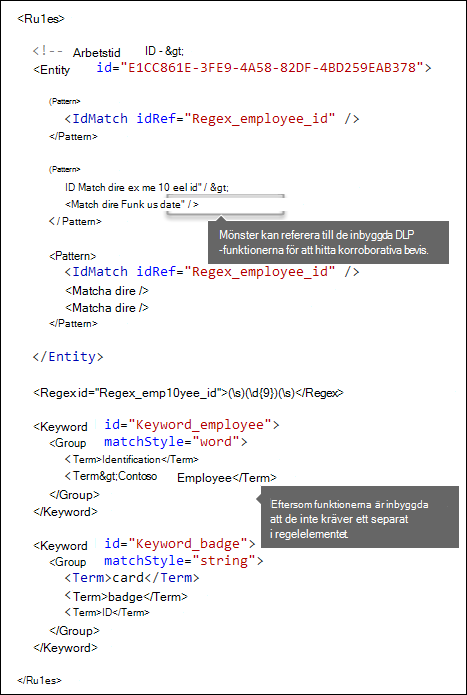
  
## <a name="different-combinations-of-evidence-any-element-minmatches-and-maxmatches-attributes"></a><span data-ttu-id="801e1-212">Olika kombinationer av bevis [elementet Any, attributen minMatches och maxMatches]</span><span class="sxs-lookup"><span data-stu-id="801e1-212">Different combinations of evidence [Any element, minMatches and maxMatches attributes]</span></span>

<span data-ttu-id="801e1-213">I ett Pattern-element är alla IdMatch- och Match-element sammanfogade av en implicit AND-operator och alla matchningar måste uppfyllas innan mönstret kan uppfyllas.</span><span class="sxs-lookup"><span data-stu-id="801e1-213">In a Pattern element, all IdMatch and Match elements are joined by an implicit AND operator — all of the matches must be satisfied before the pattern can be satisfied.</span></span> <span data-ttu-id="801e1-214">Men du kan skapa en mer flexibel matchningslogik genom att gruppera Match-element med elementet Any.</span><span class="sxs-lookup"><span data-stu-id="801e1-214">However, you can create more flexible matching logic by using the Any element to group Match elements.</span></span> <span data-ttu-id="801e1-215">Med elementet Any kan du till exempel matcha alla, inga eller en exakt delmängd av dess underordnade Match-element.</span><span class="sxs-lookup"><span data-stu-id="801e1-215">For example, you can use the Any element to match all, none, or an exact subset of its children Match elements.</span></span>
  
<span data-ttu-id="801e1-216">Elementet Any har valfria minMatches- och maxMatches-attribut som du kan använda till att definiera hur många av de underordnade Match-elementen som behöver uppfyllas innan mönstret matchas.</span><span class="sxs-lookup"><span data-stu-id="801e1-216">The Any element has optional minMatches and maxMatches attributes that you can use to define how many of the children Match elements must be satisfied before the pattern is matched.</span></span> <span data-ttu-id="801e1-217">Observera att dessa attribut definierar antalet Match-element som måste uppfyllas, inte antalet instanser av bevis som hittas för matchningarna.</span><span class="sxs-lookup"><span data-stu-id="801e1-217">Note that these attributes define the number of Match elements that must be satisfied, not the number of instances of evidence found for the matches.</span></span> <span data-ttu-id="801e1-218">Om du vill definiera ett minsta antal instanser för en viss matchning, till exempel två nyckelord från en lista använder du attributet minCount för ett Match-element (se ovan).</span><span class="sxs-lookup"><span data-stu-id="801e1-218">To define a minimum number of instances for a specific match, such as two keywords from a list, use the minCount attribute for a Match element (see above).</span></span>
  
### <a name="match-at-least-one-child-match-element"></a><span data-ttu-id="801e1-219">Matcha minst ett underordnat Match-element</span><span class="sxs-lookup"><span data-stu-id="801e1-219">Match at least one child Match element</span></span>

<span data-ttu-id="801e1-220">Om du vill kräva att ett minsta antal Match-element måste uppfyllas kan du använda attributet minMatches.</span><span class="sxs-lookup"><span data-stu-id="801e1-220">If you want to require that only a minimum number of Match elements must be met, you can use the minMatches attribute.</span></span> <span data-ttu-id="801e1-221">I praktiken är dessa Match-element sammanfogade av en implicit ELLER-operator.</span><span class="sxs-lookup"><span data-stu-id="801e1-221">In effect, these Match elements are joined by an implicit OR operator.</span></span> <span data-ttu-id="801e1-222">Ett Any-element uppfylls om ett datum i amerikanskt format eller ett nyckelord i någon av listorna hittas.</span><span class="sxs-lookup"><span data-stu-id="801e1-222">This Any element is satisfied if a US-formatted date or a keyword from either list is found.</span></span>

```xml
<Any minMatches="1" >
     <Match idRef="Func_us_date" />
     <Match idRef="Keyword_employee" />
     <Match idRef="Keyword_badge" />
</Any>
```
    
### <a name="match-an-exact-subset-of-any-children-match-elements"></a><span data-ttu-id="801e1-223">Matcha en exakt delmängd av underordnade Match-element</span><span class="sxs-lookup"><span data-stu-id="801e1-223">Match an exact subset of any children Match elements</span></span>

<span data-ttu-id="801e1-224">Om du vill kräva att ett exakt antal Match-element måste uppfyllas kan du ange samma värde för minMatches och maxMatches.</span><span class="sxs-lookup"><span data-stu-id="801e1-224">If you want to require that an exact number of Match elements must be met, you can set minMatches and maxMatches to the same value.</span></span> <span data-ttu-id="801e1-225">Det här Any-elementet uppfylls bara om exakt ett datum eller nyckelord hittas – om fler hittas matchas inte mönstret.</span><span class="sxs-lookup"><span data-stu-id="801e1-225">This Any element is satisfied only if exactly one date or keyword is found — any more than that, and the pattern won't be matched.</span></span>

```xml
<Any minMatches="1" maxMatches="1" >
     <Match idRef="Func_us_date" />
     <Match idRef="Keyword_employee" />
     <Match idRef="Keyword_badge" />
</Any>
```
  
### <a name="match-none-of-children-match-elements"></a><span data-ttu-id="801e1-226">Matcha inget av underordnade Match-element</span><span class="sxs-lookup"><span data-stu-id="801e1-226">Match none of children Match elements</span></span>

<span data-ttu-id="801e1-227">Om du vill kräva att specifika bevis inte får finnas för att ett mönster ska uppfyllas kan du ange värdet 0 för både minMatches och maxMatches.</span><span class="sxs-lookup"><span data-stu-id="801e1-227">If you want to require the absence of specific evidence for a pattern to be satisfied, you can set both minMatches and maxMatches to 0.</span></span> <span data-ttu-id="801e1-228">Det kan vara användbart om du har en nyckelordslista eller andra bevis som troligen ger en falsk positiv identifiering.</span><span class="sxs-lookup"><span data-stu-id="801e1-228">This can be useful if you have a keyword list or other evidence that are likely to indicate a false positive.</span></span>
  
<span data-ttu-id="801e1-229">Entiteten employee ID (medarbetar-ID) letar till exempel efter nyckelordet ”card” (kort) eftersom det kan referera till ett ”ID card” (ID-kort).</span><span class="sxs-lookup"><span data-stu-id="801e1-229">For example, the employee ID entity looks for the keyword "card" because it might refer to an "ID card".</span></span> <span data-ttu-id="801e1-230">Men om ”card” endast förekommer i frasen ”credit card” (kreditkort) är det inte sannolikt att “card” i det här innehållet betyder “ID card”.</span><span class="sxs-lookup"><span data-stu-id="801e1-230">However, if card appears only in the phrase "credit card", "card" in this content is unlikely to mean "ID card".</span></span> <span data-ttu-id="801e1-231">Du kan alltså lägga till ”credit card” som ett nyckelord i en lista med termer som inte får finnas för att mönstret ska uppfyllas.</span><span class="sxs-lookup"><span data-stu-id="801e1-231">So you can add "credit card" as a keyword to a list of terms that you want to exclude from satisfying the pattern.</span></span>
  
```xml
<Any minMatches="0" maxMatches="0" >
    <Match idRef="Keyword_false_positives_local" />
    <Match idRef="Keyword_false_positives_intl" />
</Any>
```

### <a name="match-a-number-of-unique-terms"></a><span data-ttu-id="801e1-232">Matcha ett antal unika termer</span><span class="sxs-lookup"><span data-stu-id="801e1-232">Match a number of unique terms</span></span>

<span data-ttu-id="801e1-233">Om du vill matcha ett antal unika termer använder du parametern *uniqueResults* inställd på *true*, som i följande exempel:</span><span class="sxs-lookup"><span data-stu-id="801e1-233">If you want to match a number of unique terms, use the *uniqueResults* parameter, set to *true*, as shown in the following example:</span></span>

```xml
<Pattern confidenceLevel="75">
    <IdMatch idRef="Salary_Revision_terms" />
    <Match idRef=" Salary_Revision_ID " minCount="3" uniqueResults="true" />
</Pattern>
```

<span data-ttu-id="801e1-234">I det här exemplet definieras ett mönster för lönerevision med minst tre unika matchningar.</span><span class="sxs-lookup"><span data-stu-id="801e1-234">In this example, a pattern is defined for salary revision using at least three unique matches.</span></span> 
  
## <a name="how-close-to-the-entity-must-the-other-evidence-be-patternsproximity-attribute"></a><span data-ttu-id="801e1-235">Hur nära entiteten måste det andra beviset vara?</span><span class="sxs-lookup"><span data-stu-id="801e1-235">How close to the entity must the other evidence be?</span></span> <span data-ttu-id="801e1-236">[attributet patternsProximity]</span><span class="sxs-lookup"><span data-stu-id="801e1-236">[patternsProximity attribute]</span></span>

<span data-ttu-id="801e1-237">Din typ av känslig information letar efter ett mönster som representerar ett medarbetar-ID, och som en del i mönstret letar den även efter samarbetsbevis, till exempel ett nyckelord som ”ID”.</span><span class="sxs-lookup"><span data-stu-id="801e1-237">Your sensitive information type is looking for a pattern that represents an employee ID, and as part of that pattern it's also looking for corroborative evidence like a keyword such as "ID".</span></span> <span data-ttu-id="801e1-238">Det är logiskt att ju närmare detta bevis är, desto troligare är det att mönstret är ett faktiskt medarbetar-ID.</span><span class="sxs-lookup"><span data-stu-id="801e1-238">It makes sense that the closer together this evidence is, the more likely the pattern is to be an actual employee ID.</span></span> <span data-ttu-id="801e1-239">Du kan ange hur nära andra bevis i mönstret måste vara i förhållande till entiteten med hjälp av det obligatoriska attributet patternsProximity i elementet Entity.</span><span class="sxs-lookup"><span data-stu-id="801e1-239">You can determine how close other evidence in the pattern must be to the entity by using the required patternsProximity attribute of the Entity element.</span></span>
  
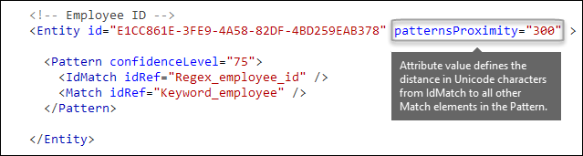
  
<span data-ttu-id="801e1-241">För varje mönster i entiteten definierar värdet för attributet patternsProximity avståndet (i Unicode-tecken) från platsen för IdMatch för alla andra Match-element som angetts för mönstret.</span><span class="sxs-lookup"><span data-stu-id="801e1-241">For each pattern in the entity, the patternsProximity attribute value defines the distance (in Unicode characters) from the IdMatch location for all other Matches specified for that Pattern.</span></span> <span data-ttu-id="801e1-242">Närhetsfönstret är förankrat vid IdMatch-platsen, och fortsätter till vänster och höger om IdMatch.</span><span class="sxs-lookup"><span data-stu-id="801e1-242">The proximity window is anchored by the IdMatch location, with the window extending to the left and right of the IdMatch.</span></span>
  
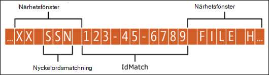
  
<span data-ttu-id="801e1-244">Exemplet nedan visar hur närhetsfönstret påverkar mönstermatchningen där elementet IdMatch för den anpassade entiteten medarbetar-ID kräver minst en samarbetsmatchning av nyckelord eller datum.</span><span class="sxs-lookup"><span data-stu-id="801e1-244">The example below illustrates how the proximity window affects the pattern matching where IdMatch element for the employee ID custom entity requires at least one corroborating match of keyword or date.</span></span> <span data-ttu-id="801e1-245">Endast ID1 matchar eftersom inget eller bara delvisa samarbetsbevis hittas för ID2 och ID3 inom närhetsfönstret.</span><span class="sxs-lookup"><span data-stu-id="801e1-245">Only ID1 matches because for ID2 and ID3, either no or only partial corroborating evidence is found within the proximity window.</span></span>
  
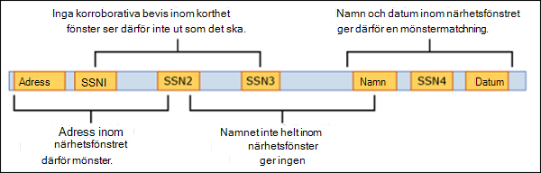
  
<span data-ttu-id="801e1-247">Observera att för e-post behandlas meddelandetexten och varje bifogad fil som separata objekt.</span><span class="sxs-lookup"><span data-stu-id="801e1-247">Note that for email, the message body and each attachment are treated as separate items.</span></span> <span data-ttu-id="801e1-248">Det innebär att närhetsfönstret inte fortsätter utanför slutet av de här objekten.</span><span class="sxs-lookup"><span data-stu-id="801e1-248">This means that the proximity window does not extend beyond the end of each of these items.</span></span> <span data-ttu-id="801e1-249">Både idMatch och samarbetsbevis måste finnas i varje objekt (bifogad fil eller brödtext).</span><span class="sxs-lookup"><span data-stu-id="801e1-249">For each item (attachment or body), both the idMatch and corroborative evidence needs to reside in that item.</span></span>
  
## <a name="what-are-the-right-confidence-levels-for-different-patterns-confidencelevel-attribute-recommendedconfidence-attribute"></a><span data-ttu-id="801e1-250">Vad är rätt konfidensnivåer för olika mönster?</span><span class="sxs-lookup"><span data-stu-id="801e1-250">What are the right confidence levels for different patterns?</span></span> <span data-ttu-id="801e1-251">[attributet confidenceLevel, attributet recommendedConfidence]</span><span class="sxs-lookup"><span data-stu-id="801e1-251">[confidenceLevel attribute, recommendedConfidence attribute]</span></span>

<span data-ttu-id="801e1-252">Ju mer bevis ett mönster kräver, desto större blir konfidensen att en faktisk entitet (till exempel ett medarbetar-ID) har identifierats när mönstret matchas.</span><span class="sxs-lookup"><span data-stu-id="801e1-252">The more evidence that a pattern requires, the more confidence you have that an actual entity (such as employee ID) has been identified when the pattern is matched.</span></span> <span data-ttu-id="801e1-253">Du har till exempel mer konfidens i ett mönster som kräver ett niosiffrigt ID-nummer, anställningsdatum och nyckelord i närheten än i ett mönster som endast kräver ett niosiffrigt ID-nummer.</span><span class="sxs-lookup"><span data-stu-id="801e1-253">For example, you have more confidence in a pattern that requires a nine-digit ID number, hire date, and keyword in close proximity, than you do in a pattern that requires only a nine-digit ID number.</span></span>
  
<span data-ttu-id="801e1-254">Pattern-elementet har ett obligatoriskt confidenceLevel-attribut.</span><span class="sxs-lookup"><span data-stu-id="801e1-254">The Pattern element has a required confidenceLevel attribute.</span></span> <span data-ttu-id="801e1-255">Du kan tänka på värdet för confidenceLevel (ett heltal mellan 1 och 100) som ett unikt ID för varje mönster i en entitet – mönster i en entitet måste ha olika konfidensnivåer, som du tilldelar.</span><span class="sxs-lookup"><span data-stu-id="801e1-255">You can think of the value of confidenceLevel (an integer between 1 and 100) as a unique ID for each pattern in an entity — the patterns in an entity must have different confidence levels that you assign.</span></span> <span data-ttu-id="801e1-256">Det exakta värdet för heltalet spelar ingen roll. Välj bara ett värde som är logiskt för ditt efterlevnadsteam.</span><span class="sxs-lookup"><span data-stu-id="801e1-256">The precise value of the integer doesn't matter — simply pick numbers that make sense to your compliance team.</span></span> <span data-ttu-id="801e1-257">När du har laddat upp din anpassade typ av känslig information och sedan skapar en princip kan du referera till dessa konfidensnivåer i villkoren i den regel som du skapar.</span><span class="sxs-lookup"><span data-stu-id="801e1-257">After you upload your custom sensitive information type and then create a policy, you can reference these confidence levels in the conditions of the rules that you create.</span></span>
  
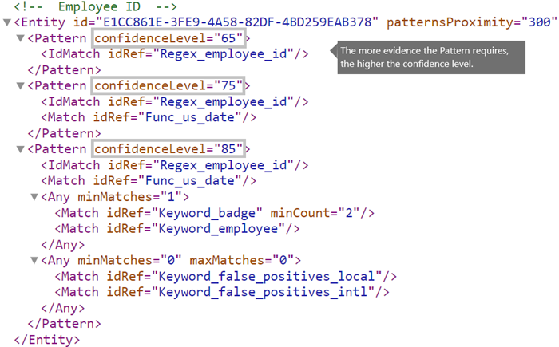
  
<span data-ttu-id="801e1-259">Utöver confidenceLevel för varje mönster har entiteten också ett recommendedConfidence-attribut.</span><span class="sxs-lookup"><span data-stu-id="801e1-259">In addition to confidenceLevel for each Pattern, the Entity has a recommendedConfidence attribute.</span></span> <span data-ttu-id="801e1-260">Det rekommenderade konfidensattributet kan ses som standardkonfidensnivå för regeln.</span><span class="sxs-lookup"><span data-stu-id="801e1-260">The recommended confidence attribute can be thought of as the default confidence level for the rule.</span></span> <span data-ttu-id="801e1-261">Om du inte anger en konfidensnivå för en regel när du skapar regeln i en princip utförs matchningen av regeln baserat på den rekommenderade konfidensnivån för entiteten.</span><span class="sxs-lookup"><span data-stu-id="801e1-261">When you create a rule in a policy, if you don't specify a confidence level for the rule to use, that rule will match based on the recommended confidence level for the entity.</span></span> <span data-ttu-id="801e1-262">Observera att attributet recommendedConfidence är obligatoriskt för varje entitets-ID i regelpaketet. Om det saknas kan du inte spara principer som använder typen av känslig information.</span><span class="sxs-lookup"><span data-stu-id="801e1-262">Please note that the recommendedConfidence attribute is mandatory for each Entity ID in the Rule Package, if missing you won't be able to save policies that use the Sensitive Information Type.</span></span> 
  
## <a name="do-you-want-to-support-other-languages-in-the-ui-of-the-compliance-center-localizedstrings-element"></a><span data-ttu-id="801e1-263">Vill du använda andra språk i användargränssnittet i efterlevnadscentret?</span><span class="sxs-lookup"><span data-stu-id="801e1-263">Do you want to support other languages in the UI of the Compliance center?</span></span> <span data-ttu-id="801e1-264">[elementet LocalizedStrings]</span><span class="sxs-lookup"><span data-stu-id="801e1-264">[LocalizedStrings element]</span></span>

<span data-ttu-id="801e1-265">Om ditt efterlevnadsteam använder Microsoft 365 Efterlevnadscenter för att skapa principer på olika språk kan du tillhandahålla lokaliserade versioner av namnet och beskrivningen av din anpassade typ av känslig information.</span><span class="sxs-lookup"><span data-stu-id="801e1-265">If your compliance team uses the Microsoft 365 Compliance center to create polices policies in different locales and in different languages, you can provide localized versions of the name and description of your custom sensitive information type.</span></span> <span data-ttu-id="801e1-266">När efterlevnadsteamet använder Microsoft 365 på ett språk som du stöder ser de det lokaliserade namnet i användargränssnittet.</span><span class="sxs-lookup"><span data-stu-id="801e1-266">When your compliance team uses Microsoft 365 in a language that you support, they'll see the localized name in the UI.</span></span>
  
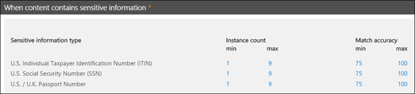
  
<span data-ttu-id="801e1-268">Elementet Rules måste innehålla ett localizedStrings-element som innehåller ett Resource-element som refererar till GUID för din anpassade entitet.</span><span class="sxs-lookup"><span data-stu-id="801e1-268">The Rules element must contain a LocalizedStrings element, which contains a Resource element that references the GUID of your custom entity.</span></span> <span data-ttu-id="801e1-269">I sin tur innehåller varje Resource-element ett eller flera namn- och beskrivningselement som vart och ett använder attributet langcode för att tillhandahålla en lokaliserad sträng för ett visst språk.</span><span class="sxs-lookup"><span data-stu-id="801e1-269">In turn, each Resource element contains one or more Name and Description elements that each use the langcode attribute to provide a localized string for a specific language.</span></span>
  
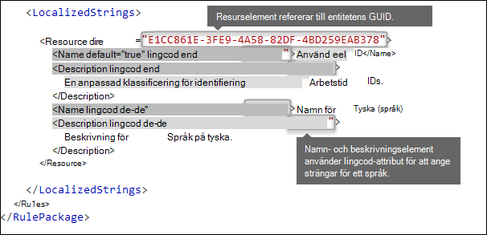
  
<span data-ttu-id="801e1-271">Observera att de lokaliserade strängarna endast påverkar hur din anpassade typ av känslig information visas i användargränssnittet i efterlevnadscentret.</span><span class="sxs-lookup"><span data-stu-id="801e1-271">Note that you use localized strings only for how your custom sensitive information type appears in the UI of the Compliance center.</span></span> <span data-ttu-id="801e1-272">Du kan inte använda lokaliserade strängar för att tillhandahålla olika lokaliserade versioner av en nyckelordslista eller ett reguljärt uttryck.</span><span class="sxs-lookup"><span data-stu-id="801e1-272">You can't use localized strings to provide different localized versions of a keyword list or regular expression.</span></span>
  
## <a name="other-rule-package-markup-rulepack-guid"></a><span data-ttu-id="801e1-273">Annan regelpaketkod [RulePack GUID]</span><span class="sxs-lookup"><span data-stu-id="801e1-273">Other rule package markup [RulePack GUID]</span></span>

<span data-ttu-id="801e1-274">I början av varje RulePackage finns viss allmän information som du behöver fylla i.</span><span class="sxs-lookup"><span data-stu-id="801e1-274">Finally, the beginning of each RulePackage contains some general information that you need to fill in.</span></span> <span data-ttu-id="801e1-275">Du kan använda följande kod som mall och ersätta platshållarna ".</span><span class="sxs-lookup"><span data-stu-id="801e1-275">You can use the following markup as a template and replace the ".</span></span> <span data-ttu-id="801e1-276">.</span><span class="sxs-lookup"><span data-stu-id="801e1-276">.</span></span> <span data-ttu-id="801e1-277">."</span><span class="sxs-lookup"><span data-stu-id="801e1-277">."</span></span> <span data-ttu-id="801e1-278">med egen information.</span><span class="sxs-lookup"><span data-stu-id="801e1-278">placeholders with your own info.</span></span>
  
<span data-ttu-id="801e1-279">Det viktigaste är att du skapar ett GUID för RulePack.</span><span class="sxs-lookup"><span data-stu-id="801e1-279">Most importantly, you'll need to generate a GUID for the RulePack.</span></span> <span data-ttu-id="801e1-280">Ovan genererade du ett GUID för entiteten. Detta är ett andra GUID för RulePack.</span><span class="sxs-lookup"><span data-stu-id="801e1-280">Above, you generated a GUID for the entity; this is a second GUID for the RulePack.</span></span> <span data-ttu-id="801e1-281">Det finns flera sätt att generera GUID. Ett enkelt sätt är att skriva [guid]::NewGuid() i PowerShell.</span><span class="sxs-lookup"><span data-stu-id="801e1-281">There are several ways to generate GUIDs, but you can do it easily in PowerShell by typing [guid]::NewGuid().</span></span>
  
<span data-ttu-id="801e1-282">Versionselementet är också viktigt.</span><span class="sxs-lookup"><span data-stu-id="801e1-282">The Version element is also important.</span></span> <span data-ttu-id="801e1-283">När du laddar upp regelpaketet för första gången registrerar Microsoft 365 versionsnumret.</span><span class="sxs-lookup"><span data-stu-id="801e1-283">When you upload your rule package for the first time, Microsoft 365 notes the version number.</span></span> <span data-ttu-id="801e1-284">Om du uppdaterar regelpaketet senare och laddar upp en ny version måste du uppdatera versionsnumret, annars distribuerar Microsoft 365 inte regelpaketet.</span><span class="sxs-lookup"><span data-stu-id="801e1-284">Later, if you update the rule package and upload a new version, make sure to update the version number or Microsoft 365 won't deploy the rule package.</span></span>
  
```xml
<?xml version="1.0" encoding="utf-16"?>
<RulePackage xmlns="http://schemas.microsoft.com/office/2011/mce">
  <RulePack id=". . .">
    <Version major="1" minor="0" build="0" revision="0" />
    <Publisher id=". . ." /> 
    <Details defaultLangCode=". . .">
      <LocalizedDetails langcode=" . . . ">
         <PublisherName>. . .</PublisherName>
         <Name>. . .</Name>
         <Description>. . .</Description>
      </LocalizedDetails>
    </Details>
  </RulePack>
  
 <Rules>
  . . .
 </Rules>
</RulePackage>

```

<span data-ttu-id="801e1-285">När allt är klart bör ditt RulePack-element se ut så här.</span><span class="sxs-lookup"><span data-stu-id="801e1-285">When complete, your RulePack element should look like this.</span></span>
  
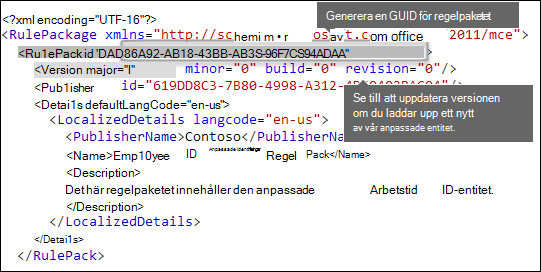

## <a name="validators"></a><span data-ttu-id="801e1-287">Validerare</span><span class="sxs-lookup"><span data-stu-id="801e1-287">Validators</span></span>

<span data-ttu-id="801e1-288">Microsoft 365 kan använda funktionsprocessorer för vanliga SITs som validatorer.</span><span class="sxs-lookup"><span data-stu-id="801e1-288">Microsoft 365 exposes function processors for commonly used SITs as validators.</span></span> <span data-ttu-id="801e1-289">Här är en lista över dem.</span><span class="sxs-lookup"><span data-stu-id="801e1-289">Here's a list of them.</span></span> 

### <a name="list-of-validators-currently-available"></a><span data-ttu-id="801e1-290">Lista över tillgängliga validerare</span><span class="sxs-lookup"><span data-stu-id="801e1-290">List of validators currently available</span></span>

- <span data-ttu-id="801e1-291">Func_credit_card</span><span class="sxs-lookup"><span data-stu-id="801e1-291">Func_credit_card</span></span>
- <span data-ttu-id="801e1-292">Func_ssn</span><span class="sxs-lookup"><span data-stu-id="801e1-292">Func_ssn</span></span>
- <span data-ttu-id="801e1-293">Func_unformatted_ssn</span><span class="sxs-lookup"><span data-stu-id="801e1-293">Func_unformatted_ssn</span></span>
- <span data-ttu-id="801e1-294">Func_randomized_formatted_ssn</span><span class="sxs-lookup"><span data-stu-id="801e1-294">Func_randomized_formatted_ssn</span></span>
- <span data-ttu-id="801e1-295">Func_randomized_unformatted_ssn</span><span class="sxs-lookup"><span data-stu-id="801e1-295">Func_randomized_unformatted_ssn</span></span>
- <span data-ttu-id="801e1-296">Func_aba_routing</span><span class="sxs-lookup"><span data-stu-id="801e1-296">Func_aba_routing</span></span>
- <span data-ttu-id="801e1-297">Func_south_africa_identification_number</span><span class="sxs-lookup"><span data-stu-id="801e1-297">Func_south_africa_identification_number</span></span>
- <span data-ttu-id="801e1-298">Func_brazil_cpf</span><span class="sxs-lookup"><span data-stu-id="801e1-298">Func_brazil_cpf</span></span>
- <span data-ttu-id="801e1-299">Func_iban</span><span class="sxs-lookup"><span data-stu-id="801e1-299">Func_iban</span></span>
- <span data-ttu-id="801e1-300">Func_brazil_cnpj</span><span class="sxs-lookup"><span data-stu-id="801e1-300">Func_brazil_cnpj</span></span>
- <span data-ttu-id="801e1-301">Func_swedish_national_identifier</span><span class="sxs-lookup"><span data-stu-id="801e1-301">Func_swedish_national_identifier</span></span>
- <span data-ttu-id="801e1-302">Func_india_aadhaar</span><span class="sxs-lookup"><span data-stu-id="801e1-302">Func_india_aadhaar</span></span>
- <span data-ttu-id="801e1-303">Func_uk_nhs_number</span><span class="sxs-lookup"><span data-stu-id="801e1-303">Func_uk_nhs_number</span></span>
- <span data-ttu-id="801e1-304">Func_Turkish_National_Id</span><span class="sxs-lookup"><span data-stu-id="801e1-304">Func_Turkish_National_Id</span></span>
- <span data-ttu-id="801e1-305">Func_australian_tax_file_number</span><span class="sxs-lookup"><span data-stu-id="801e1-305">Func_australian_tax_file_number</span></span>
- <span data-ttu-id="801e1-306">Func_usa_uk_passport</span><span class="sxs-lookup"><span data-stu-id="801e1-306">Func_usa_uk_passport</span></span>
- <span data-ttu-id="801e1-307">Func_canadian_sin</span><span class="sxs-lookup"><span data-stu-id="801e1-307">Func_canadian_sin</span></span>
- <span data-ttu-id="801e1-308">Func_formatted_itin</span><span class="sxs-lookup"><span data-stu-id="801e1-308">Func_formatted_itin</span></span>
- <span data-ttu-id="801e1-309">Func_unformatted_itin</span><span class="sxs-lookup"><span data-stu-id="801e1-309">Func_unformatted_itin</span></span>
- <span data-ttu-id="801e1-310">Func_dea_number_v2</span><span class="sxs-lookup"><span data-stu-id="801e1-310">Func_dea_number_v2</span></span>
- <span data-ttu-id="801e1-311">Func_dea_number</span><span class="sxs-lookup"><span data-stu-id="801e1-311">Func_dea_number</span></span>
- <span data-ttu-id="801e1-312">Func_japanese_my_number_personal</span><span class="sxs-lookup"><span data-stu-id="801e1-312">Func_japanese_my_number_personal</span></span>
- <span data-ttu-id="801e1-313">Func_japanese_my_number_corporate</span><span class="sxs-lookup"><span data-stu-id="801e1-313">Func_japanese_my_number_corporate</span></span>

<span data-ttu-id="801e1-314">På så sätt kan du definiera en egen regex och verifiera dem.</span><span class="sxs-lookup"><span data-stu-id="801e1-314">This gives you the ability to define your own regex and validate them.</span></span> <span data-ttu-id="801e1-315">Om du vill använda verifierare definierar du egna regex och när du definierar regex använder du egenskapen validator för att lägga till valfri funktionsbehandlare.</span><span class="sxs-lookup"><span data-stu-id="801e1-315">To use validators, define your own regex and while defining the regex use the validator property to add the function processor of your choice.</span></span> <span data-ttu-id="801e1-316">När den är definierad kan du använda denna regex i en SIT.</span><span class="sxs-lookup"><span data-stu-id="801e1-316">Once defined, you can use this regex in an SIT.</span></span> 

<span data-ttu-id="801e1-317">I exemplet nedan har ett vanligt uttryck - Regex_credit_card_AdditionalDelimiters definierats för kreditkort som sedan valideras med funktionen checksumma för kreditkort genom att använda Func_credit_card som validerare.</span><span class="sxs-lookup"><span data-stu-id="801e1-317">In the example below, a regular expression - Regex_credit_card_AdditionalDelimiters is defined for Credit card which is then validated using the checksum function for credit card by using Func_credit_card as a validator.</span></span>

```xml
<Regex id="Regex_credit_card_AdditionalDelimiters" validators="Func_credit_card"> (?:^|[\s,;\:\(\)\[\]"'])([0-9]{4}[ -_][0-9]{4}[ -_][0-9]{4}[ -_][0-9]{4})(?:$|[\s,;\:\(\)\[\]"'])</Regex>
<Entity id="675634eb7-edc8-4019-85dd-5a5c1f2bb085" patternsProximity="300" recommendedConfidence="85">
<Pattern confidenceLevel="85">
<IdMatch idRef="Regex_credit_card_AdditionalDelimiters" />
<Any minMatches="1">
<Match idRef="Keyword_cc_verification" />
<Match idRef="Keyword_cc_name" />
<Match idRef="Func_expiration_date" />
</Any>
</Pattern>
</Entity>
```

<span data-ttu-id="801e1-318">Microsoft 365 finns två allmänna validerare</span><span class="sxs-lookup"><span data-stu-id="801e1-318">Microsoft 365 provides two generic validators</span></span>

### <a name="checksum-validator"></a><span data-ttu-id="801e1-319">Kontrollerasummator</span><span class="sxs-lookup"><span data-stu-id="801e1-319">Checksum validator</span></span>

<span data-ttu-id="801e1-320">I det här exemplet har en kontrollsumma för anställnings-ID definierats för att verifiera regex för EmployeeID.</span><span class="sxs-lookup"><span data-stu-id="801e1-320">In this example, a checksum validator for employee ID is defined to validate the regex for EmployeeID.</span></span>

```xml
<Validators id="EmployeeIDChecksumValidator">
<Validator type="Checksum">
<Param name="Weights">2, 2, 2, 2, 2, 1</Param>
<Param name="Mod">28</Param>
<Param name="CheckDigit">2</Param> <!-- Check 2nd digit -->
<Param name="AllowAlphabets">1</Param> <!— 0 if no Alphabets -->
</Validator>
</Validators>
<Regex id="Regex_EmployeeID" validators="ChecksumValidator">(\d{5}[A-Z])</Regex>
<Entity id="675634eb7-edc8-4019-85dd-5a5c1f2bb085" patternsProximity="300" recommendedConfidence="85">
<Pattern confidenceLevel="85">
<IdMatch idRef="Regex_EmployeeID"/>
</Pattern>
</Entity>
```

### <a name="date-validator"></a><span data-ttu-id="801e1-321">Datum giltiga</span><span class="sxs-lookup"><span data-stu-id="801e1-321">Date Validator</span></span>

<span data-ttu-id="801e1-322">I det här exemplet definieras ett datum validator för en regex-del som är datum.</span><span class="sxs-lookup"><span data-stu-id="801e1-322">In this example, a date validator is defined for a regex part of which is date.</span></span>

```xml
<Validators id="date_validator_1"> <Validator type="DateSimple"> <Param name="Pattern">DDMMYYYY</Param> <!—supported patterns DDMMYYYY, MMDDYYYY, YYYYDDMM, YYYYMMDD, DDMMYYYY, DDMMYY, MMDDYY, YYDDMM, YYMMDD --> </Validator> </Validators>
<Regex id="date_regex_1" validators="date_validator_1">\d{8}</Regex>
```
  
## <a name="changes-for-exchange-online"></a><span data-ttu-id="801e1-323">Ändringar för Exchange Online</span><span class="sxs-lookup"><span data-stu-id="801e1-323">Changes for Exchange Online</span></span>

<span data-ttu-id="801e1-324">Tidigare kanske du använde Exchange Online PowerShell för att importera anpassade typer av känslig information för DLP.</span><span class="sxs-lookup"><span data-stu-id="801e1-324">Previously, you might have used Exchange Online PowerShell to import your custom sensitive information types for DLP.</span></span> <span data-ttu-id="801e1-325">Nu kan dina anpassade typer av känslig information användas i både administrationscentret för Exchange och i efterlevnadscentret.</span><span class="sxs-lookup"><span data-stu-id="801e1-325">Now your custom sensitive information types can be used in both the Exchange admin center and the Compliance center.</span></span> <span data-ttu-id="801e1-326">Som en del av den här förbättringen bör du använda Compliance Center PowerShell för att importera anpassade typer av känslig information – du kan inte importera dem från Exchange PowerShell längre.</span><span class="sxs-lookup"><span data-stu-id="801e1-326">As part of this improvement, you should use Compliance center PowerShell to import your custom sensitive information types — you can't import them from the Exchange PowerShell anymore.</span></span> <span data-ttu-id="801e1-327">Dina anpassade typer av känslig information fortsätter att fungera som vanligt, men det kan ta upp till en timme innan ändringar av anpassade typer av känslig information som gjorts i efterlevnadscentret visas i administrationscentret för Exchange. </span><span class="sxs-lookup"><span data-stu-id="801e1-327">Your custom sensitive information types will continue to work just like before; however, it may take up to one hour for changes made to custom sensitive information types in the Compliance center to appear in the Exchange admin center.</span></span>
  
<span data-ttu-id="801e1-328">Observera att du kan ladda upp ett regelpaket med cmdleten **[New-DlpSensitiveInformationTypeRulePackage](/powershell/module/exchange/new-dlpsensitiveinformationtyperulepackage)** i efterlevnadscentret.</span><span class="sxs-lookup"><span data-stu-id="801e1-328">Note that in the Compliance center, you use the **[New-DlpSensitiveInformationTypeRulePackage](/powershell/module/exchange/new-dlpsensitiveinformationtyperulepackage)** cmdlet to upload a rule package.</span></span> <span data-ttu-id="801e1-329">(Tidigare kunde du använda cmdleten **ClassificationRuleCollection** i administrationscentret för Exchange.)</span><span class="sxs-lookup"><span data-stu-id="801e1-329">(Previously, in the Exchange admin center, you used the  **ClassificationRuleCollection**\` cmdlet.)</span></span> 
  
## <a name="upload-your-rule-package"></a><span data-ttu-id="801e1-330">Ladda upp regelpaketet</span><span class="sxs-lookup"><span data-stu-id="801e1-330">Upload your rule package</span></span>

<span data-ttu-id="801e1-331">Gör så här om du vill ladda upp regelpaketet:</span><span class="sxs-lookup"><span data-stu-id="801e1-331">To upload your rule package, do the following steps:</span></span>
  
1. <span data-ttu-id="801e1-332">Spara det som en XML-fil med Unicode-kodning.</span><span class="sxs-lookup"><span data-stu-id="801e1-332">Save it as an .xml file with Unicode encoding.</span></span>
    
2. [<span data-ttu-id="801e1-333">Ansluta till Compliance Center PowerShell</span><span class="sxs-lookup"><span data-stu-id="801e1-333">Connect to Compliance center PowerShell</span></span>](/powershell/exchange/exchange-online-powershell)
    
3. <span data-ttu-id="801e1-334">Använd följande syntax:</span><span class="sxs-lookup"><span data-stu-id="801e1-334">Use the following syntax:</span></span>

   ```powershell
   New-DlpSensitiveInformationTypeRulePackage -FileData (Get-Content -Path "PathToUnicodeXMLFile" -Encoding Byte -ReadCount 0)
   ```

   <span data-ttu-id="801e1-335">I det här exemplet överförs Unicode XML-filen med namnet MyNewRulePack.xml från C:\My Documents.</span><span class="sxs-lookup"><span data-stu-id="801e1-335">This example uploads the Unicode XML file named MyNewRulePack.xml from C:\My Documents.</span></span>

   ```powershell
   New-DlpSensitiveInformationTypeRulePackage -FileData (Get-Content -Path "C:\My Documents\MyNewRulePack.xml" -Encoding Byte -ReadCount 0)
   ```

   <span data-ttu-id="801e1-336">Se [New-DlpSensitiveInformationTypeRulePackage](/powershell/module/exchange/new-dlpsensitiveinformationtyperulepackage) för detaljerad information om syntax och parametrar.</span><span class="sxs-lookup"><span data-stu-id="801e1-336">For detailed syntax and parameter information, see [New-DlpSensitiveInformationTypeRulePackage](/powershell/module/exchange/new-dlpsensitiveinformationtyperulepackage).</span></span>

   > [!NOTE]
   > <span data-ttu-id="801e1-337">Det maximala antalet regelpaket som stöds är tio, men varje paket kan innehålla en definition för flera typer av känslig information.</span><span class="sxs-lookup"><span data-stu-id="801e1-337">The maximum number of rule packages supported is 10, but each package can contain the definition of multiple sensitive information types.</span></span>

4. <span data-ttu-id="801e1-338">Gör något av följande för att kontrollera att du har skapat en ny typ av känslig information:</span><span class="sxs-lookup"><span data-stu-id="801e1-338">To verify that you've successfully created a new sensitive information type, do any of the following steps:</span></span>

   - <span data-ttu-id="801e1-339">Kör cmdleten [Get-DlpSensitiveInformationTypeRulePackage](/powershell/module/exchange/get-dlpsensitiveinformationtyperulepackage) och kontrollera att det nya regelpaketet visas:</span><span class="sxs-lookup"><span data-stu-id="801e1-339">Run the [Get-DlpSensitiveInformationTypeRulePackage](/powershell/module/exchange/get-dlpsensitiveinformationtyperulepackage) cmdlet to verify the new rule package is listed:</span></span>

     ```powershell
     Get-DlpSensitiveInformationTypeRulePackage
     ``` 

   - <span data-ttu-id="801e1-340">Kör cmdleten [Get-DlpSensitiveInformationType](/powershell/module/exchange/get-dlpsensitiveinformationtype) och kontrollera att typen av känslig information visas:</span><span class="sxs-lookup"><span data-stu-id="801e1-340">Run the [Get-DlpSensitiveInformationType](/powershell/module/exchange/get-dlpsensitiveinformationtype) cmdlet to verify the sensitive information type is listed:</span></span>

     ```powershell
     Get-DlpSensitiveInformationType
     ``` 

     <span data-ttu-id="801e1-341">För anpassade typer av känslig information är egenskapsvärdet för utgivare något annat än Microsoft Corporation.</span><span class="sxs-lookup"><span data-stu-id="801e1-341">For custom sensitive information types, the Publisher property value will be something other than Microsoft Corporation.</span></span>

   - <span data-ttu-id="801e1-342">Ersätt \<Name\> med namnvärdet för typen av känslig information (till exempel: medarbetar-ID) och kör cmdleten [Get-DlpSensitiveInformationType](/powershell/module/exchange/get-dlpsensitiveinformationtype):</span><span class="sxs-lookup"><span data-stu-id="801e1-342">Replace \<Name\> with the Name value of the sensitive information type (example: Employee ID) and run the [Get-DlpSensitiveInformationType](/powershell/module/exchange/get-dlpsensitiveinformationtype) cmdlet:</span></span>

     ```powershell
     Get-DlpSensitiveInformationType -Identity "<Name>"
     ```
    
## <a name="potential-validation-issues-to-be-aware-of"></a><span data-ttu-id="801e1-343">Möjliga verifieringsproblem som du bör känna till</span><span class="sxs-lookup"><span data-stu-id="801e1-343">Potential validation issues to be aware of</span></span>

<span data-ttu-id="801e1-344">När du laddar upp din XML-fil för regelpaket verifierar systemet XML-koden och söker efter kända felaktiga mönster och tydliga prestandaproblem.</span><span class="sxs-lookup"><span data-stu-id="801e1-344">When you upload your rule package XML file, the system validates the XML and checks for known bad patterns and obvious performance issues.</span></span> <span data-ttu-id="801e1-345">Här är några kända problem som verifieringen söker efter – ett reguljärt uttryck:</span><span class="sxs-lookup"><span data-stu-id="801e1-345">Here are some known issues that the validation checks for — a regular expression:</span></span>
  
- <span data-ttu-id="801e1-346">Kan inte börja eller sluta med ”|”, som matchar allt eftersom den betraktas som en tom matchning.</span><span class="sxs-lookup"><span data-stu-id="801e1-346">Cannot begin or end with alternator "|", which matches everything because it's considered an empty match.</span></span>
    
  <span data-ttu-id="801e1-347">Till exempel godkänns inte ”|a” eller ”b|”.</span><span class="sxs-lookup"><span data-stu-id="801e1-347">For example, "|a" or "b|" will not pass validation.</span></span>
    
- <span data-ttu-id="801e1-348">Kan inte börja eller sluta med ett ”.{0,m}”-mönster, som inte har något funktionssyfte utan bara försämrar prestanda.</span><span class="sxs-lookup"><span data-stu-id="801e1-348">Cannot begin or end with a ".{0,m}" pattern, which has no functional purpose and only impairs performance.</span></span>
    
  <span data-ttu-id="801e1-349">Till exempel godkänns inte ”.{0,50}ASDF” eller ”ASDF.{0,50}”.</span><span class="sxs-lookup"><span data-stu-id="801e1-349">For example, ".{0,50}ASDF" or "ASDF.{0,50}" will not pass validation.</span></span>
    
- <span data-ttu-id="801e1-350">Kan inte ha ”.{0,m}” eller ”.{1,m}” i grupper, och kan inte ha ”.\*” eller ”.+” i grupper.</span><span class="sxs-lookup"><span data-stu-id="801e1-350">Cannot have ".{0,m}" or ".{1,m}" in groups, and cannot have ".\*" or ".+" in groups.</span></span>
    
  <span data-ttu-id="801e1-351">Till exempel godkänns inte ”(.{0,50000})”.</span><span class="sxs-lookup"><span data-stu-id="801e1-351">For example, "(.{0,50000})" will not pass validation.</span></span>
    
- <span data-ttu-id="801e1-352">Kan inte ha något tecken med ”{0,m}”- eller ”{1,m}”-repeaters i grupper.</span><span class="sxs-lookup"><span data-stu-id="801e1-352">Cannot have any character with "{0,m}" or "{1,m}" repeaters in groups.</span></span>
    
  <span data-ttu-id="801e1-353">Till exempel godkänns inte ” (a\*)”.</span><span class="sxs-lookup"><span data-stu-id="801e1-353">For example, "(a\*)" will not pass validation.</span></span>
    
- <span data-ttu-id="801e1-354">Kan inte börja eller sluta med ”. {1,m}”. I stället använder du bara ”.”.</span><span class="sxs-lookup"><span data-stu-id="801e1-354">Cannot begin or end with ".{1,m}"; instead, use just "."</span></span>
    
  <span data-ttu-id="801e1-355">Till exempel godkänns inte ”.{1,m}asdf”. I stället använder du bara ”.asdf”.</span><span class="sxs-lookup"><span data-stu-id="801e1-355">For example, ".{1,m}asdf" will not pass validation; instead, use just ".asdf".</span></span>
    
- <span data-ttu-id="801e1-356">Kan inte ha en obunden repeater (till exempel ”\*” eller ”+”) i en grupp.</span><span class="sxs-lookup"><span data-stu-id="801e1-356">Cannot have an unbounded repeater (such as "\*" or "+") on a group.</span></span>
    
  <span data-ttu-id="801e1-357">Till exempel godkänns inte ”(xx)\*” och ”(xx)+”.</span><span class="sxs-lookup"><span data-stu-id="801e1-357">For example, "(xx)\*" and "(xx)+" will not pass validation.</span></span>
  
- <span data-ttu-id="801e1-358">Nyckelorden får vara högst 50 tecken långa.</span><span class="sxs-lookup"><span data-stu-id="801e1-358">Keywords have a maximum of 50 characters in Length.</span></span>  <span data-ttu-id="801e1-359">Om du ett nyckelord i en grupp som överskrider den här gränsen föreslår vi att du skapar en grupp med termer, till exempel en [nyckelordsordlista](./create-a-keyword-dictionary.md) och refererar till GUID för nyckelordsordlistan i XML-strukturen som en del i entiteten för Match eller idMatch i filen.</span><span class="sxs-lookup"><span data-stu-id="801e1-359">If you have a keyword within a Group exceeding this, a suggested solution is to create the Group of terms as a [Keyword Dictionary](./create-a-keyword-dictionary.md) and reference the GUID of the Keyword Dictionary within the XML structure as part of the Entity for Match or idMatch in the file.</span></span>

- <span data-ttu-id="801e1-360">Varje anpassad typ av känslig information kan innehålla maximalt 2 048 nyckelord.</span><span class="sxs-lookup"><span data-stu-id="801e1-360">Each Custom Sensitive Information Type can have a maximum of 2048 keywords total.</span></span>

- <span data-ttu-id="801e1-361">Den maximala storleken på nyckelordsordlistor i en enskild klientorganisation är 1 MB komprimerad.</span><span class="sxs-lookup"><span data-stu-id="801e1-361">The maximum size of Keyword Dictionaries in a single tenant is 1 MB compressed.</span></span> <span data-ttu-id="801e1-362">Du kan referera till samma ordlista så många gånger som behövs när du skapar anpassade typer av känslig information.</span><span class="sxs-lookup"><span data-stu-id="801e1-362">Reference the same dictionary as many times as necessary when creating custom sensitive information types.</span></span> <span data-ttu-id="801e1-363">Börja med att skapa anpassade nyckelordslistor i typen av känslig information och använd nyckelordsordlistor om du har fler än 2 048 nyckelord i en nyckelordslista eller om ett nyckelord är längre än 50 tecken.</span><span class="sxs-lookup"><span data-stu-id="801e1-363">Start with creating custom keyword lists in the sensitive information type and use keyword dictionaries if you have more than 2048 keywords in a keyword list or a keyword is larger than 50 characters in length.</span></span>

- <span data-ttu-id="801e1-364">Högst 50 nyckelordsordlistebaserade typer av känslig information tillåts i en klientorganisation.</span><span class="sxs-lookup"><span data-stu-id="801e1-364">A maximum of 50 keyword dictionary based sensitive information types are allowed in a tenant.</span></span>

- <span data-ttu-id="801e1-365">Kontrollera att varje Entity-element innehåller ett recommendedConfidence-attribut.</span><span class="sxs-lookup"><span data-stu-id="801e1-365">Ensure each Entity element contains a recommendedConfidence attribute.</span></span>

- <span data-ttu-id="801e1-366">När du använder PowerShell-cmdleten finns en maximal returstorlek för deserialiserade data på ungefär 1 MB.</span><span class="sxs-lookup"><span data-stu-id="801e1-366">When using the PowerShell Cmdlet there is a maximum return size of the Deserialized Data of approximately 1 megabyte.</span></span>   <span data-ttu-id="801e1-367">Det här påverkar storleken på XML-filen för regelpaketet.</span><span class="sxs-lookup"><span data-stu-id="801e1-367">This will affect the size of your rule pack XML file.</span></span> <span data-ttu-id="801e1-368">Vi föreslår att du begränsar den uppladdade filen till högst 770 kB så att du får konsekventa resultat utan fel vid bearbetningen.</span><span class="sxs-lookup"><span data-stu-id="801e1-368">Keep the uploaded file limited to a 770 kilobyte maximum as a suggested limit for consistent results without error when processing.</span></span>

- <span data-ttu-id="801e1-369">XML-strukturen kräver inte formateringstecken som blanksteg, tabbar eller poster för vagnretur/radmatning.</span><span class="sxs-lookup"><span data-stu-id="801e1-369">The XML structure does not require formatting characters such as spaces, tabs, or carriage return/linefeed entries.</span></span>  <span data-ttu-id="801e1-370">Tänk på det när du optimerar utrymme för uppladdningar.</span><span class="sxs-lookup"><span data-stu-id="801e1-370">Take note of this when optimizing for space on uploads.</span></span> <span data-ttu-id="801e1-371">Verktyg som Microsoft Visual Code tillhandahåller kopplingslinjefunktioner för att komprimera XML-filen.</span><span class="sxs-lookup"><span data-stu-id="801e1-371">Tools such as Microsoft Visual Code provide join line features to compact the XML file.</span></span>
    
<span data-ttu-id="801e1-372">Om en anpassad typ av känslig information innehåller ett problem som kan påverka prestanda laddas den inte upp och något av följande felmeddelanden visas:</span><span class="sxs-lookup"><span data-stu-id="801e1-372">If a custom sensitive information type contains an issue that may affect performance, it won't be uploaded and you may see one of these error messages:</span></span>
  
- <span data-ttu-id="801e1-373">**Allmänna kvantifierare som matchar mer innehåll än förväntat (t.ex. ”+”, ”\*”)**</span><span class="sxs-lookup"><span data-stu-id="801e1-373">**Generic quantifiers which match more content than expected (e.g., '+', '\*')**</span></span>
    
- <span data-ttu-id="801e1-374">**Påståenden för sökning**</span><span class="sxs-lookup"><span data-stu-id="801e1-374">**Lookaround assertions**</span></span>
    
- <span data-ttu-id="801e1-375">**Komplex gruppering tillsammans med allmänna kvantifierare**</span><span class="sxs-lookup"><span data-stu-id="801e1-375">**Complex grouping in conjunction with general quantifiers**</span></span>
    
## <a name="recrawl-your-content-to-identify-the-sensitive-information"></a><span data-ttu-id="801e1-376">Du måste crawla innehållet igen för att identifiera känslig information</span><span class="sxs-lookup"><span data-stu-id="801e1-376">Recrawl your content to identify the sensitive information</span></span>

<span data-ttu-id="801e1-377">I Microsoft 365 används Search Crawler för att identifiera och klassificera känslig information i webbplatsinnehåll.</span><span class="sxs-lookup"><span data-stu-id="801e1-377">Microsoft 365 uses the search crawler to identify and classify sensitive information in site content.</span></span> <span data-ttu-id="801e1-378">Innehållet i SharePoint Online- och OneDrive för företag-webbplatserna crawlas igen automatiskt när det uppdateras.</span><span class="sxs-lookup"><span data-stu-id="801e1-378">Content in SharePoint Online and OneDrive for Business sites is recrawled automatically whenever it's updated.</span></span> <span data-ttu-id="801e1-379">Men för att identifiera den nya anpassade typen av känslig information i allt befintligt innehåll måste innehållet crawlas på nytt.</span><span class="sxs-lookup"><span data-stu-id="801e1-379">But to identify your new custom type of sensitive information in all existing content, that content must be recrawled.</span></span>
  
<span data-ttu-id="801e1-380">I Microsoft 365 kan du inte begära en ny crawlning av en hel klientorganisation manuellt, men du kan göra det för en webbplatssamling, en lista eller ett bibliotek. Se [Manuellt begära crawlning och omindexering av en webbplats, ett bibliotek eller en lista](/sharepoint/crawl-site-content).</span><span class="sxs-lookup"><span data-stu-id="801e1-380">In Microsoft 365, you can't manually request a recrawl of an entire tenant, but you can do this for a site collection, list, or library — see [Manually request crawling and re-indexing of a site, a library or a list](/sharepoint/crawl-site-content).</span></span>
  
## <a name="reference-rule-package-xml-schema-definition"></a><span data-ttu-id="801e1-381">Referens: XML-schemadefinition för regelpaket</span><span class="sxs-lookup"><span data-stu-id="801e1-381">Reference: Rule package XML schema definition</span></span>

<span data-ttu-id="801e1-382">Du kan kopiera den här koden, spara den som en XSD-fil och använda den för att verifiera XML-filen för regelpaketet.</span><span class="sxs-lookup"><span data-stu-id="801e1-382">You can copy this markup, save it as an XSD file, and use it to validate your rule package XML file.</span></span>
  
```xml
<?xml version="1.0" encoding="utf-8"?>
<xs:schema xmlns:mce="http://schemas.microsoft.com/office/2011/mce"
           targetNamespace="http://schemas.microsoft.com/office/2011/mce"
           xmlns:xs="https://www.w3.org/2001/XMLSchema"
           elementFormDefault="qualified"
           attributeFormDefault="unqualified"
           id="RulePackageSchema">
  <!-- Use include if this schema has the same target namespace as the schema being referenced, otherwise use import -->
  <xs:element name="RulePackage" type="mce:RulePackageType"/>
  <xs:simpleType name="LangType">
    <xs:union memberTypes="xs:language">
      <xs:simpleType>
        <xs:restriction base="xs:string">
          <xs:enumeration value=""/>
        </xs:restriction>
      </xs:simpleType>
    </xs:union>
  </xs:simpleType>
  <xs:simpleType name="GuidType" final="#all">
    <xs:restriction base="xs:token">
      <xs:pattern value="[0-9a-fA-F]{8}\-([0-9a-fA-F]{4}\-){3}[0-9a-fA-F]{12}"/>
    </xs:restriction>
  </xs:simpleType>
  <xs:complexType name="RulePackageType">
    <xs:sequence>
      <xs:element name="RulePack" type="mce:RulePackType"/>
      <xs:element name="Rules" type="mce:RulesType">
        <xs:key name="UniqueRuleId">
          <xs:selector xpath="mce:Entity|mce:Affinity|mce:Version/mce:Entity|mce:Version/mce:Affinity"/>
          <xs:field xpath="@id"/>
        </xs:key>
        <xs:key name="UniqueProcessorId">
          <xs:selector xpath="mce:Regex|mce:Keyword|mce:Fingerprint"></xs:selector>
          <xs:field xpath="@id"/>
        </xs:key>
        <xs:key name="UniqueResourceIdRef">
          <xs:selector xpath="mce:LocalizedStrings/mce:Resource"/>
          <xs:field xpath="@idRef"/>
        </xs:key>
        <xs:keyref name="ReferencedRuleMustExist" refer="mce:UniqueRuleId">
          <xs:selector xpath="mce:LocalizedStrings/mce:Resource"/>
          <xs:field xpath="@idRef"/>
        </xs:keyref>
        <xs:keyref name="RuleMustHaveResource" refer="mce:UniqueResourceIdRef">
          <xs:selector xpath="mce:Entity|mce:Affinity|mce:Version/mce:Entity|mce:Version/mce:Affinity"/>
          <xs:field xpath="@id"/>
        </xs:keyref>
      </xs:element>
    </xs:sequence>
  </xs:complexType>
  <xs:complexType name="RulePackType">
    <xs:sequence>
      <xs:element name="Version" type="mce:VersionType"/>
      <xs:element name="Publisher" type="mce:PublisherType"/>
      <xs:element name="Details" type="mce:DetailsType">
        <xs:key name="UniqueLangCodeInLocalizedDetails">
          <xs:selector xpath="mce:LocalizedDetails"/>
          <xs:field xpath="@langcode"/>
        </xs:key>
        <xs:keyref name="DefaultLangCodeMustExist" refer="mce:UniqueLangCodeInLocalizedDetails">
          <xs:selector xpath="."/>
          <xs:field xpath="@defaultLangCode"/>
        </xs:keyref>
      </xs:element>
      <xs:element name="Encryption" type="mce:EncryptionType" minOccurs="0" maxOccurs="1"/>
    </xs:sequence>
    <xs:attribute name="id" type="mce:GuidType" use="required"/>
  </xs:complexType>
  <xs:complexType name="VersionType">
    <xs:attribute name="major" type="xs:unsignedShort" use="required"/>
    <xs:attribute name="minor" type="xs:unsignedShort" use="required"/>
    <xs:attribute name="build" type="xs:unsignedShort" use="required"/>
    <xs:attribute name="revision" type="xs:unsignedShort" use="required"/>
  </xs:complexType>
  <xs:complexType name="PublisherType">
    <xs:attribute name="id" type="mce:GuidType" use="required"/>
  </xs:complexType>
  <xs:complexType name="LocalizedDetailsType">
    <xs:sequence>
      <xs:element name="PublisherName" type="mce:NameType"/>
      <xs:element name="Name" type="mce:RulePackNameType"/>
      <xs:element name="Description" type="mce:OptionalNameType"/>
    </xs:sequence>
    <xs:attribute name="langcode" type="mce:LangType" use="required"/>
  </xs:complexType>
  <xs:complexType name="DetailsType">
    <xs:sequence>
      <xs:element name="LocalizedDetails" type="mce:LocalizedDetailsType" maxOccurs="unbounded"/>
    </xs:sequence>
    <xs:attribute name="defaultLangCode" type="mce:LangType" use="required"/>
  </xs:complexType>
  <xs:complexType name="EncryptionType">
    <xs:sequence>
      <xs:element name="Key" type="xs:normalizedString"/>
      <xs:element name="IV" type="xs:normalizedString"/>
    </xs:sequence>
  </xs:complexType>
  <xs:simpleType name="RulePackNameType">
    <xs:restriction base="xs:token">
      <xs:minLength value="1"/>
      <xs:maxLength value="64"/>
    </xs:restriction>
  </xs:simpleType>
  <xs:simpleType name="NameType">
    <xs:restriction base="xs:normalizedString">
      <xs:minLength value="1"/>
      <xs:maxLength value="256"/>
    </xs:restriction>
  </xs:simpleType>
  <xs:simpleType name="OptionalNameType">
    <xs:restriction base="xs:normalizedString">
      <xs:minLength value="0"/>
      <xs:maxLength value="256"/>
    </xs:restriction>
  </xs:simpleType>
  <xs:simpleType name="RestrictedTermType">
    <xs:restriction base="xs:string">
      <xs:minLength value="1"/>
      <xs:maxLength value="100"/>
    </xs:restriction>
  </xs:simpleType>
  <xs:complexType name="RulesType">
    <xs:sequence>
      <xs:choice maxOccurs="unbounded">
        <xs:element name="Entity" type="mce:EntityType"/>
        <xs:element name="Affinity" type="mce:AffinityType"/>
        <xs:element name="Version" type="mce:VersionedRuleType"/>
      </xs:choice>
      <xs:choice minOccurs="0" maxOccurs="unbounded">
        <xs:element name="Regex" type="mce:RegexType"/>
        <xs:element name="Keyword" type="mce:KeywordType"/>
        <xs:element name="Fingerprint" type="mce:FingerprintType"/>
        <xs:element name="ExtendedKeyword" type="mce:ExtendedKeywordType"/>
      </xs:choice>
      <xs:element name="LocalizedStrings" type="mce:LocalizedStringsType"/>
    </xs:sequence>
  </xs:complexType>
  <xs:complexType name="EntityType">
    <xs:sequence>
      <xs:element name="Pattern" type="mce:PatternType" maxOccurs="unbounded"/>
      <xs:element name="Version" type="mce:VersionedPatternType" minOccurs="0" maxOccurs="unbounded" />
    </xs:sequence>
    <xs:attribute name="id" type="mce:GuidType" use="required"/>
    <xs:attribute name="patternsProximity" type="mce:ProximityType" use="required"/>
    <xs:attribute name="recommendedConfidence" type="mce:ProbabilityType"/>
    <xs:attribute name="workload" type="mce:WorkloadType"/>
  </xs:complexType>
  <xs:complexType name="PatternType">
    <xs:sequence>
      <xs:element name="IdMatch" type="mce:IdMatchType"/>
      <xs:choice minOccurs="0" maxOccurs="unbounded">
        <xs:element name="Match" type="mce:MatchType"/>
        <xs:element name="Any" type="mce:AnyType"/>
      </xs:choice>
    </xs:sequence>
    <xs:attribute name="confidenceLevel" type="mce:ProbabilityType" use="required"/>
  </xs:complexType>
  <xs:complexType name="AffinityType">
    <xs:sequence>
      <xs:element name="Evidence" type="mce:EvidenceType" maxOccurs="unbounded"/>
      <xs:element name="Version" type="mce:VersionedEvidenceType" minOccurs="0" maxOccurs="unbounded" />
    </xs:sequence>
    <xs:attribute name="id" type="mce:GuidType" use="required"/>
    <xs:attribute name="evidencesProximity" type="mce:ProximityType" use="required"/>
    <xs:attribute name="thresholdConfidenceLevel" type="mce:ProbabilityType" use="required"/>
    <xs:attribute name="workload" type="mce:WorkloadType"/>
  </xs:complexType>
  <xs:complexType name="EvidenceType">
    <xs:sequence>
      <xs:choice maxOccurs="unbounded">
        <xs:element name="Match" type="mce:MatchType"/>
        <xs:element name="Any" type="mce:AnyType"/>
      </xs:choice>
    </xs:sequence>
    <xs:attribute name="confidenceLevel" type="mce:ProbabilityType" use="required"/>
  </xs:complexType>
  <xs:complexType name="IdMatchType">
    <xs:attribute name="idRef" type="xs:string" use="required"/>
  </xs:complexType>
  <xs:complexType name="MatchType">
    <xs:attribute name="idRef" type="xs:string" use="required"/>
    <xs:attribute name="minCount" type="xs:positiveInteger" use="optional"/>
    <xs:attribute name="uniqueResults" type="xs:boolean" use="optional"/>
  </xs:complexType>
  <xs:complexType name="AnyType">
    <xs:sequence>
      <xs:choice maxOccurs="unbounded">
        <xs:element name="Match" type="mce:MatchType"/>
        <xs:element name="Any" type="mce:AnyType"/>
      </xs:choice>
    </xs:sequence>
    <xs:attribute name="minMatches" type="xs:nonNegativeInteger" default="1"/>
    <xs:attribute name="maxMatches" type="xs:nonNegativeInteger" use="optional"/>
  </xs:complexType>
  <xs:simpleType name="ProximityType">
    <xs:union>
      <xs:simpleType>
        <xs:restriction base='xs:string'>
          <xs:enumeration value="unlimited"/>
        </xs:restriction>
      </xs:simpleType>
      <xs:simpleType>
        <xs:restriction base="xs:positiveInteger">
          <xs:minInclusive value="1"/>
        </xs:restriction>
      </xs:simpleType>
    </xs:union>
  </xs:simpleType>
  <xs:simpleType name="ProbabilityType">
    <xs:restriction base="xs:integer">
      <xs:minInclusive value="1"/>
      <xs:maxInclusive value="100"/>
    </xs:restriction>
  </xs:simpleType>
  <xs:simpleType name="WorkloadType">
    <xs:restriction base="xs:string">
      <xs:enumeration value="Exchange"/>
      <xs:enumeration value="Outlook"/>
    </xs:restriction>
  </xs:simpleType>
  <xs:simpleType name="EngineVersionType">
    <xs:restriction base="xs:token">
      <xs:pattern value="^\d{2}\.01?\.\d{3,4}\.\d{1,3}$"/>
    </xs:restriction>
  </xs:simpleType>
  <xs:complexType name="VersionedRuleType">
    <xs:choice maxOccurs="unbounded">
      <xs:element name="Entity" type="mce:EntityType"/>
      <xs:element name="Affinity" type="mce:AffinityType"/>
    </xs:choice>
    <xs:attribute name="minEngineVersion" type="mce:EngineVersionType" use="required" />
  </xs:complexType>
  <xs:complexType name="VersionedPatternType">
    <xs:sequence>
      <xs:element name="Pattern" type="mce:PatternType" maxOccurs="unbounded"/>
    </xs:sequence>
    <xs:attribute name="minEngineVersion" type="mce:EngineVersionType" use="required" />
  </xs:complexType>
  <xs:complexType name="VersionedEvidenceType">
    <xs:sequence>
      <xs:element name="Evidence" type="mce:EvidenceType" maxOccurs="unbounded"/>
    </xs:sequence>
    <xs:attribute name="minEngineVersion" type="mce:EngineVersionType" use="required" />
  </xs:complexType>
  <xs:simpleType name="FingerprintValueType">
    <xs:restriction base="xs:string">
      <xs:minLength value="2732"/>
      <xs:maxLength value="2732"/>
    </xs:restriction>
  </xs:simpleType>
  <xs:complexType name="FingerprintType">
    <xs:simpleContent>
      <xs:extension base="mce:FingerprintValueType">
        <xs:attribute name="id" type="xs:token" use="required"/>
        <xs:attribute name="threshold" type="mce:ProbabilityType" use="required"/>
        <xs:attribute name="shingleCount" type="xs:positiveInteger" use="required"/>
        <xs:attribute name="description" type="xs:string" use="optional"/>
      </xs:extension>
    </xs:simpleContent>
  </xs:complexType>
  <xs:complexType name="RegexType">
    <xs:simpleContent>
      <xs:extension base="xs:string">
        <xs:attribute name="id" type="xs:token" use="required"/>
      </xs:extension>
    </xs:simpleContent>
  </xs:complexType>
  <xs:complexType name="KeywordType">
    <xs:sequence>
      <xs:element name="Group" type="mce:GroupType" maxOccurs="unbounded"/>
    </xs:sequence>
    <xs:attribute name="id" type="xs:token" use="required"/>
  </xs:complexType>
  <xs:complexType name="GroupType">
    <xs:sequence>
      <xs:choice>
        <xs:element name="Term" type="mce:TermType" maxOccurs="unbounded"/>
      </xs:choice>
    </xs:sequence>
    <xs:attribute name="matchStyle" default="word">
      <xs:simpleType>
        <xs:restriction base="xs:NMTOKEN">
          <xs:enumeration value="word"/>
          <xs:enumeration value="string"/>
        </xs:restriction>
      </xs:simpleType>
    </xs:attribute>
  </xs:complexType>
  <xs:complexType name="TermType">
    <xs:simpleContent>
      <xs:extension base="mce:RestrictedTermType">
        <xs:attribute name="caseSensitive" type="xs:boolean" default="false"/>
      </xs:extension>
    </xs:simpleContent>
  </xs:complexType>
  <xs:complexType name="ExtendedKeywordType">
    <xs:simpleContent>
      <xs:extension base="xs:string">
        <xs:attribute name="id" type="xs:token" use="required"/>
      </xs:extension>
    </xs:simpleContent>
  </xs:complexType>
  <xs:complexType name="LocalizedStringsType">
    <xs:sequence>
      <xs:element name="Resource" type="mce:ResourceType" maxOccurs="unbounded">
      <xs:key name="UniqueLangCodeUsedInNamePerResource">
        <xs:selector xpath="mce:Name"/>
        <xs:field xpath="@langcode"/>
      </xs:key>
      <xs:key name="UniqueLangCodeUsedInDescriptionPerResource">
        <xs:selector xpath="mce:Description"/>
        <xs:field xpath="@langcode"/>
      </xs:key>
    </xs:element>
    </xs:sequence>
  </xs:complexType>
  <xs:complexType name="ResourceType">
    <xs:sequence>
      <xs:element name="Name" type="mce:ResourceNameType" maxOccurs="unbounded"/>
      <xs:element name="Description" type="mce:DescriptionType" minOccurs="0" maxOccurs="unbounded"/>
    </xs:sequence>
    <xs:attribute name="idRef" type="mce:GuidType" use="required"/>
  </xs:complexType>
  <xs:complexType name="ResourceNameType">
    <xs:simpleContent>
      <xs:extension base="xs:string">
        <xs:attribute name="default" type="xs:boolean" default="false"/>
        <xs:attribute name="langcode" type="mce:LangType" use="required"/>
      </xs:extension>
    </xs:simpleContent>
  </xs:complexType>
  <xs:complexType name="DescriptionType">
    <xs:simpleContent>
      <xs:extension base="xs:string">
        <xs:attribute name="default" type="xs:boolean" default="false"/>
        <xs:attribute name="langcode" type="mce:LangType" use="required"/>
      </xs:extension>
    </xs:simpleContent>
  </xs:complexType>
</xs:schema>
```

## <a name="more-information"></a><span data-ttu-id="801e1-383">Mer information</span><span class="sxs-lookup"><span data-stu-id="801e1-383">More information</span></span>

- [<span data-ttu-id="801e1-384">Mer information om skydd mot dataförlust</span><span class="sxs-lookup"><span data-stu-id="801e1-384">Learn about data loss prevention</span></span>](dlp-learn-about-dlp.md)

- [<span data-ttu-id="801e1-385">Entitetsdefinitioner för typer av känslig information</span><span class="sxs-lookup"><span data-stu-id="801e1-385">Sensitive information type entity definitions</span></span>](sensitive-information-type-entity-definitions.md)

- [<span data-ttu-id="801e1-386">Vad DLP-funktionerna letar efter</span><span class="sxs-lookup"><span data-stu-id="801e1-386">What the DLP functions look for</span></span>](what-the-dlp-functions-look-for.md)
