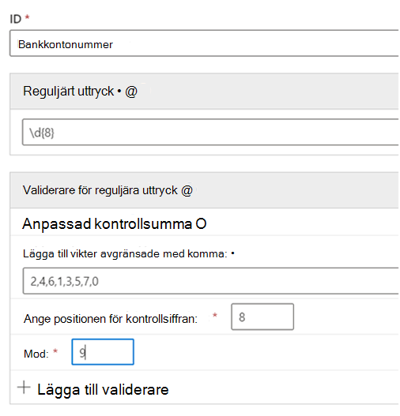
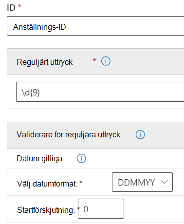

# Komma igång med anpassade typer av känslig information

Om de förkonfigurerade typerna av känslig information inte uppfyller dina behov kan du skapa egna anpassade typer av känslig information som du definierar helt och hållet, eller så kan du kopiera någon som är förkonfigurerad och ändra den.

Anpassade typer av känslig information som du skapar med den här metoden läggs till i regelpaketet med namnet `Microsoft.SCCManaged.CustomRulePack`.

Det finns två sätt att skapa en ny typ av känslig information:

- [från början där du definierar alla element helt](#create-a-custom-sensitive-information-type)
- [kopiera och ändra en befintlig typ av känslig information](#copy-and-modify-a-sensitive-information-type)

## Innan du börjar

- Du bör känna till olika typer av känslig information och vad de består av. Gå till [Mer information om typer av känslig information](sensitive-information-type-learn-about.md). Det är viktigt att förstå rollerna med:
    - [reguljära uttryck](https://www.boost.org/doc/libs/1_68_0/libs/regex/doc/html/) – Microsoft 365-typer av känslig information använder motorn Boost.RegEx 5.1.3
    - nyckelordslistor – du kan skapa en egen när du definierar typen av känslig information eller välja från befintliga nyckelordslistor
    - [nyckelordsordlista](create-a-keyword-dictionary.md)
    - [funktioner](what-the-dlp-functions-look-for.md)
    - [konfidensnivåer](sensitive-information-type-learn-about.md#more-on-confidence-levels)
 
- Du måste ha behörighet som global administratör eller efterlevnadsadministratör för att skapa, testa och distribuera en anpassad typ av känslig information via användargränssnittet. Gå till [Om administratörsroller](/office365/admin/add-users/about-admin-roles) i Office 365.

- Organisationen måste ha en prenumeration, till exempel Office 365 Enterprise, som omfattar dataförlustskydd (DLP). Gå till [Tjänstbeskrivning för meddelandeprincip och efterlevnad](/office365/servicedescriptions/exchange-online-protection-service-description/messaging-policy-and-compliance-servicedesc). 

> [!IMPORTANT]
> Microsofts kundtjänst och support kan inte hjälpa dig att skapa anpassade klassificeringar eller mönster för reguljära uttryck. Supporttekniker kan ge begränsat stöd för funktionen, till exempel genom att tillhandahålla exempel på mönster för reguljära uttryck i testningssyfte eller hjälpa till med felsökning av ett befintligt mönster för reguljära uttryck som inte utlöses som förväntat, men kan inte garantera att anpassad innehållsmatchning kommer att uppfylla dina krav eller åtaganden.

## Skapa en anpassad typ av känslig information

Använd den här proceduren för att skapa en ny typ av känslig information som du definierar helt. 

1. I Efterlevnadscenter går du till **Dataklassificering** \> **Typer av känslig information** och väljer **Skapa informationstyp**.
2. Fyll i värden för **Namn** och **Beskrivning** och välj **Nästa**.
3. Välj **Skapa mönster**. Du kan skapa flera mönster, var och en med olika element och konfidensnivåer, när du definierar din nya typ av känslig information.
4. Välj standardkonfidensnivån för mönstret. Värdena är **Låg konfidens**, **Medelhög konfidens** och **Hög konfidens**.
5. Välja och definiera **primärelement**. Primärelementet kan vara ett **reguljärt uttryck** med en valfri verifierare, en **nyckelordslista**, en **nyckelordsordlista** eller någon av de förkonfigurerade **funktionerna**. Mer information om DLP-funktioner finns i [Vad DLP-funktionerna letar efter](what-the-dlp-functions-look-for.md). Mer information om datum och kontrollsummatorerna finns i Mer information om [validerare för reguljära uttryck.](#more-information-on-regular-expression-validators)
6. Fyll i ett värde för **Teckennärhet**.
7. (Valfritt) Lägg till stödelement om du har några sådana. Stödelement kan vara ett reguljärt uttryck med en valfri verifierare, en nyckelordslista, en nyckelordsordlista eller någon av de fördefinierade funktionerna. Stödelement kan ha en egen **konfiguration för tecken närhet.** 
8. (Valfritt) Lägg till [**ytterligare kontroller**](#more-information-on-additional-checks) från listan över tillgängliga kontroller.
9. Välj **Skapa**.
10. Välj **Nästa**.
11. Välj den **rekommenderade konfidensnivån** för den här typen av känslig information.
12. Kontrollera inställningen och välj **Skicka**.

> [!IMPORTANT]
> Microsoft 365 använder Search Crawler för att identifiera och klassificera känslig information på SharePoint Online- och OneDrive för företag-webbplatser. För att identifiera den nya anpassade typen av känslig information i befintligt innehåll måste innehållet återcrawlas. Innehållet crawlas enligt ett schema men du kan manuellt återcrawla innehåll för en webbplatssamling, en lista eller ett bibliotek. Mer information finns i [Manuellt begära crawlning och omindexering av en webbplats, ett bibliotek eller en lista](/sharepoint/crawl-site-content).

13. På sidan **Dataklassificering** visas alla typer av känslig information. Välj **Uppdatera** och bläddra sedan efter eller använd sökverktyget för att hitta den typ av känslig information som du har skapat.

## Testa en typ av känslig information

Du kan testa olika typer av känslig information i listan. Vi föreslår att du testar alla typer av känslig information som du skapar innan du använder dem i en princip.

1. Förbered två filer, till exempel ett Word-dokument. Ett med innehåll som matchar de element du angav i din typ av känslig information och ett som inte matchar.
2. I Efterlevnadscenter går du till **Dataklassificering** \> **Typer av känslig information** och väljer typen av känslig information i listan för att öppna informationsfönstret. Välj sedan **Testa**.
3. Ladda upp en fil och välj **Testa**.
4. Granska resultatet på sidan **Matchar resultat** och välj **Slutför**.

## Ändra anpassade typer av känslig information i Efterlevnadscenter

1. I Efterlevnadscenter går du till **Dataklassificering** \> **Typer av känslig information** och väljer den typ av känslig information i listan som du vill ändra. Välj sedan **Redigera**.
2. Du kan lägga till andra mönster, med unika primära element och stödelement, konfidensnivåer, teckennärhet och [**ytterligare kontroller**](#more-information-on-additional-checks) eller redigera/ta bort befintliga.

## Ta bort anpassade typer av känslig information i Efterlevnadscenter 

> [!NOTE]
> Du kan bara ta bort anpassade typer av känslig information. Du kan inte ta bort inbyggda typer av känslig information.

> [!IMPORTANT]
> Innan du tar bort en anpassad typ av känslig information ska du kontrollera att inga DLP-principer eller e-postflödesregler i Exchange (kallas även transportregler) fortfarande refererar till den typ av känslig information som finns.

1. I Efterlevnadscenter går du till **Dataklassificering** \> **Typer av känslig information** och väljer den typ av känslig information i listan som du vill ta bort.
2. På den utfällbara menyn som öppnas väljer du **Ta bort**.

## Kopiera och ändra en typ av känslig information

Använd den här proceduren för att skapa en ny typ av känslig information som baseras på en befintlig typ av känslig information. 

1. I Efterlevnadscenter går du till **Dataklassificering** \> **Typer av känslig information** och väljer den typ av känslig information som du vill kopiera.
2. Välj **Kopiera** på den utfällbara menyn.
3. Välj **Uppdatera** i listan med typer av känslig information och bläddra eller sök efter kopian du just skapade. Sökning efter partiella strängar fungerar, så du kan söka efter bara `copy` så returnerar sökningen alla typer av känslig information med ordet `copy` i namnet. 
4. Fyll i värden för **Namn** och **Beskrivning** och välj **Nästa**.
5. Välj din kopia av typen av känslig information och välj **Redigera**. 
6. Ge den nya typen av känslig information ett nytt **namn** och en **beskrivning**.
7. Du kan välja att redigera eller ta bort befintliga mönster och lägga till nya. Välj standardkonfidensnivån för det nya mönstret. Värdena är **Låg konfidens**, **Medelhög konfidens** och **Hög konfidens**.
8. Välja och definiera **primärelement**. Primärelementet kan vara ett **reguljärt uttryck**, en **nyckelordslista**, en **nyckelordsordlista** eller någon av de förkonfigurerade **funktionerna**. Se [Vad DLP-funktionerna letar efter](what-the-dlp-functions-look-for.md).
9. Fyll i ett värde för **Teckennärhet**.
10. (Valfritt) Om du har **stödelement** eller några [**ytterligare kontroller**](#more-information-on-additional-checks) lägger du till dem. Om det behövs kan du gruppera dina **stödelement**.
11. Välj **Skapa**.
12. Välj **Nästa**.
13. Välj den **rekommenderade konfidensnivån** för den här typen av känslig information.
14. Kontrollera inställningen och välj **Skicka**.

Du kan också skapa anpassade typer av känslig information med hjälp av PowerShell- och Exact Data Match-funktioner. Mer information om dessa metoder finns i:
- [Skapa en anpassad typ av känslig information i Säkerhets- och efterlevnadscenter PowerShell](create-a-custom-sensitive-information-type-in-scc-powershell.md)
- [Skapa en anpassad typ av känslig information för DLP med Exact Data Match (EDM)](create-custom-sensitive-information-types-with-exact-data-match-based-classification.md)

## Mer information om validerare för reguljära uttryck

### Kontrollerasummator

Om du behöver köra en kontrollsumma för en siffra i ett reguljärt uttryck kan du använda *giltigt kontrollsumma.* Säg till exempel att du behöver skapa en SIT för ett åttasiffrigt licensnummer där den sista siffran är en kontrollsummassiffra som valideras med en mod 9-beräkning. Du har ställt in algoritmen för kontrollsumma så här:
 
Sum = digit 1 * Weight 1 + digit 2 * weight 2 + digit 3 * weight 3 + digit 4 * weight 4 + digit 5 * weight 5 + digit 6 * weight 6 + digit 7 * weight 7 + digit 8 * weight 8 Mod value = Sum % 9 If Mod value == digit 8 Account number is valid If Mod value != digit 8 Account number is invalid

1. Definiera det primära elementet med det här reguljära uttrycket:

`\d{8}`

2. Lägg sedan till valideraren för kontrollsumma.
3. Lägg till viktvärdena avgränsade med kommatecken, bchecksiffrans position och värdet Mod. Mer information om Modulo-åtgärden finns i [Modulo-åtgärden](https://en.wikipedia.org/wiki/Modulo_operation).

> [!NOTE]
> Om kontrollsiffran inte ingår i beräkningen av kontrollsumman använder du 0 som vikt för checksiffran. I exemplet ovan blir till exempel vikt 8 lika med 0 om kontrollsiffran inte ska användas för att beräkna kontrollsiffran.  Modulo_operation).

### Datum validerare

Om ett datumvärde som är inbäddat i ett reguljärt uttryck ingår i ett nytt mönster som du skapar kan du använda *datum-giltigt* datum för att testa att det uppfyller villkoren. Säg till exempel att du vill skapa en SIT för ett niosiffrigt anställningsnummer. De första sex siffrorna är anställningsdatumet i DDMMYY-format och de sista tre är slumpgenererade siffror. Verifiera att de första sex siffrorna har rätt format. 

1. Definiera det primära elementet med det här reguljära uttrycket:

`\d{9}`

2. Lägg sedan till datum giltigare.
3. Välj datumformat och startförskjutning. Eftersom datumsträngen är de första sex siffrorna är förskjutningen `0` .

### Funktionella processorer som verifierare

Du kan använda funktionsprocessorer för några av de vanligaste validatorerna för sit-funktioner. På så sätt kan du definiera ditt eget reguljära uttryck samtidigt som du säkerställer att de klarar de ytterligare kontroller som krävs av SIT. Till exempel kan Func_India_Aadhar att det anpassade reguljära uttrycket som definieras av dig klarar den verifieringslogik som krävs för indisk Aadhar-kort. Mer information om DLP-funktioner som kan användas som validerare finns i [Vad DLP-funktionerna söker efter.](what-the-dlp-functions-look-for.md#what-the-dlp-functions-look-for) 

### Luhn-kontroll validerare

Du kan använda Luhn-kontroll valideraren om du har en anpassad typ av känslig information som innehåller ett reguljärt uttryck som ska överföra [Luhn-algoritmen.](https://en.wikipedia.org/wiki/Luhn_algorithm)

## Mer information om ytterligare kontroller

Här finns definitioner och några exempel för tillgängliga ytterligare kontroller.

**Exkludera specifika matchningar**: Med den här kontrollen kan du definiera nyckelord som ska uteslutas när matchningar identifieras för det mönster du redigerar. Du kan till exempel utesluta testkreditkortsnummer som "4111111111111111" så att de inte matchas som ett giltigt nummer.

**Börjar eller börjar inte med tecken**: Med den här kontrollen kan du definiera vilka tecken de matchande objekten måste eller inte får börja med. Om du till exempel vill att mönstret bara ska identifiera kreditkortsnummer som börjar med 41, 42 eller 43, markerar du **Börjar med** och lägger till 41, 42 och 43 i listan, avgränsade med kommatecken. 

**Slutar eller slutar inte med tecken**: Med den här kontrollen kan du definiera vilka tecken de matchande objekten måste eller inte får sluta med. Om ditt medarbetar-ID-nummer inte får sluta med 0 eller 1 väljer du **Slutar inte med** och lägger till 0 och 1 i listan, avgränsade med kommatecken.

**Exkludera dubblettecken**: Med den här kontrollen kan du ignorera matchningar där alla siffror är samma. Om till exempel alla siffror i det sexsiffriga medarbetar-ID-numret inte får vara samma kan du välja **Exkludera dubblettecken** för att utesluta 111111, 222222, 333333, 444444, 555555, 666666, 777777, 888888, 999999 och 000000 i listan med giltiga matchningar för medarbetar-ID.

**Inkludera eller exkludera prefix**: Med den här kontrollen kan du definiera de nyckelord som måste eller inte får hittas omedelbart före den matchande enheten. Beroende på ditt val matchas enheter, eller matchas inte, om de föregås av de prefix du tar med här. Om du till exempel **exkluderar** prefixet **GUID:** betraktas inte en enhet som föregås av **GUID:** som en matchning.

**Inkludera eller exkludera suffix**: Med den här kontrollen kan du definiera de nyckelord som måste eller inte får hittas omedelbart efter den matchande enheten. Beroende på ditt val matchas enheter, eller matchas inte, om de följs av de suffix du tar med här. Om du till exempel **exkluderar** suffixet **:GUID** matchas inte text som följs av **:GUID**.

> [!NOTE]
> Microsoft 365 Informationsskydd har stöd för språk med dubbla byte-teckenuppsättning för:
> - Kinesiska (förenklad)
> - Kinesiska (traditionell)
> - Koreanska
> - Japanska
>
>Stödet är tillgängligt för typer av känslig information. Se [Viktig information gällande stöd i Information Protection för teckenuppsättningar med dubbla byte (förhandsversion)](mip-dbcs-relnotes.md) för mer information.

> [!TIP]
> Om du vill identifiera mönster som innehåller kinesiska/japanska tecken och single byte-tecken eller för att identifiera mönster som innehåller kinesiska/japanska och engelska definierar du två varianter av nyckelordet eller regex. Om du till exempel vill identifiera ett nyckelord som "机密的document" använder du två varianter av nyckelordet: En med ett blanksteg mellan japansk och engelsk text och en annan utan blanksteg mellan japansk och engelsk text. Nyckelorden som ska läggas till i SIT bör därför vara "机密的 document" och "机密的document". Om du vill hitta frasen "リ京オリンピック2020" bör du använda två varianter. "リ京オリンピック 2020" och "リ京オリンピック2020".
> När du skapar ett regex med ett bindestreck med dubbla byte eller en punkt med dubbla byte, måste du undvika båda tecknen som ett bindestreck eller punkt i en regex. Här är ett exempel på en regex som referens:
    - (?<!\d) ([4][0–9] {3} [ \- ?\-\t]*[0-9]{4}
> Vi rekommenderar att du använder en strängmatchning i stället för en matchning mellan ord i en nyckelordslista.
