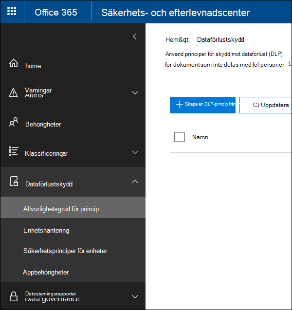
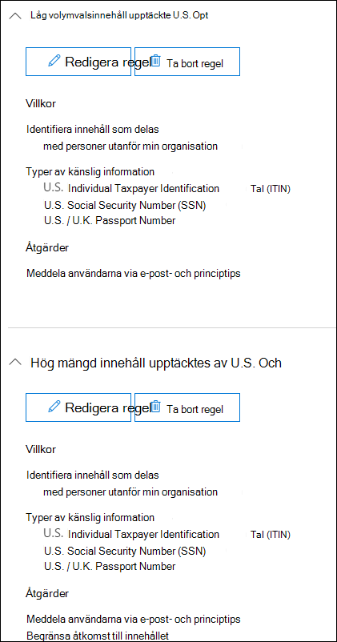
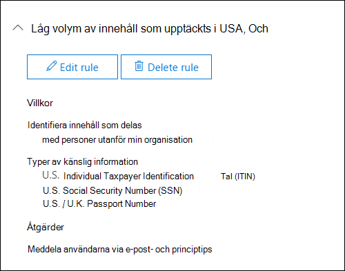
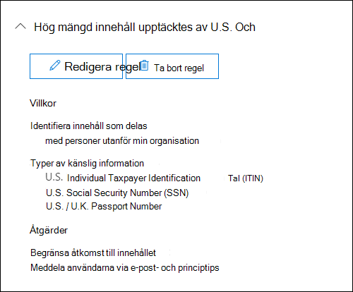
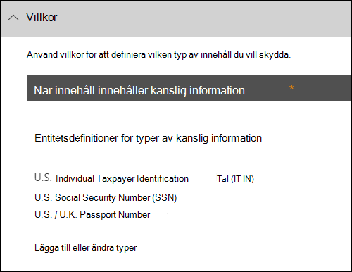
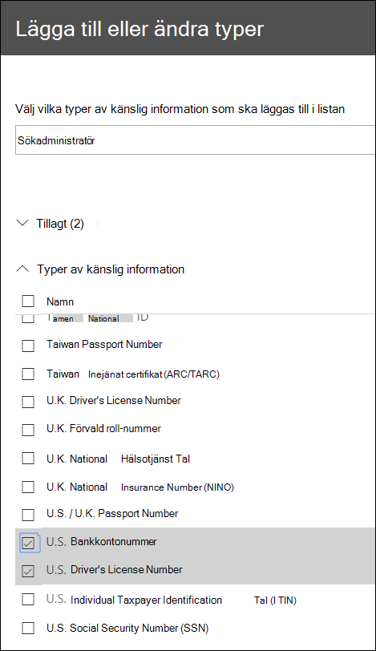
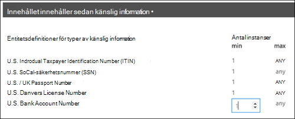
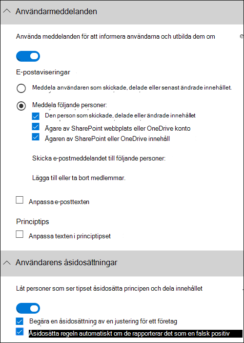

# Skapa en DLP-princip från en mallCreate a DLP policy from a template

Det enklaste sättet att komma igång med DLP-principer är att använda någon av mallarna som ingår i Office 365.The easiest, most common way to get started with DLP policies is to use one of the templates included in Office 365. Du kan använda någon av mallarna som den är eller anpassa reglerna så att de uppfyller organisationens specifika efterlevnadskrav.You can use one of these templates as is, or customize the rules to meet your organization's specific compliance requirements.
  
Microsoft 365 finns fler än 40 färdiga mallar som kan hjälpa dig att uppfylla en mängd vanliga regel- och affärspolicybehov.Microsoft 365 includes over 40 ready-to-use templates that can help you meet a wide range of common regulatory and business policy needs. Det finns till exempel DLP-principmallar för:For example, there are DLP policy templates for:
  
- Gramm-Leach-Bliley Act (GLBA)Gramm-Leach-Bliley Act (GLBA)
    
- Datasäkerhetsstandard för betalningskort (SÄTT-DSS)Payment Card Industry Data Security Standard (PCI-DSS)
    
- Personlig information i USA (PII)United States Personally Identifiable Information (U.S. PII)
    
- United States Health Insurance Act (HIPAA)United States Health Insurance Act (HIPAA)
    
Du kan finjustera en mall genom att ändra någon av de befintliga reglerna eller lägga till nya.You can fine tune a template by modifying any of the existing rules or adding new ones. Du kan till exempel lägga till nya typer av känslig information i en regel, ändra antalet i en regel för att göra det svårare eller enklare att utlösa, tillåta personer att åsidosätta åtgärder i en regel genom att ange en justering för verksamheten eller ändra vem aviseringar och incidentrapporter skickas till.For example, you can add new types of sensitive information to a rule, modify the counts in a rule to make it harder or easier to trigger, allow people to override the actions in a rule by providing a business justification, or change who notifications and incident reports are sent to. En DLP-principmall är en flexibel utgångspunkt för många vanliga scenarier för efterlevnad.A DLP policy template is a flexible starting point for many common compliance scenarios.
  
Du kan också välja mallen Anpassad, som inte har några standardregler, och konfigurera din DLP-princip från grunden för att uppfylla organisationens specifika efterlevnadskrav.You can also choose the Custom template, which has no default rules, and configure your DLP policy from scratch, to meet the specific compliance requirements for your organization.
  
## Exempel: Identifiera känslig information på alla OneDrive för företag och begränsa åtkomsten för personer utanför organisationenExample: Identify sensitive information across all OneDrive for Business sites and restrict access for people outside your organization

OneDrive för företag-konton gör det enkelt för personer i organisationen att samarbeta och dela dokument.OneDrive for Business accounts make it easy for people across your organization to collaborate and share documents. Men ett vanligt problem för efterlevnadsansvariga är att känslig information som lagras i OneDrive för företag-konton kan oavsiktligt delas med personer utanför organisationen.But a common concern for compliance officers is that sensitive information stored in OneDrive for Business accounts may be inadvertently shared with people outside your organization. En DLP-princip kan minska den här risken.A DLP policy can help mitigate this risk.
  
I det här exemplet skapar du en DLP-princip som identifierar amerikanska PII-data, som omfattar INDIVIDUAL Taxpayer Identification Numbers (ITIN), personnummer och amerikanska passnummer.In this example, you'll create a DLP policy that identifies U.S. PII data, which includes Individual Taxpayer Identification Numbers (ITIN), Social Security Numbers, and U.S. passport numbers. Du börjar med att använda en mall och sedan ändrar du mallen så att den uppfyller organisationens efterlevnadskrav, och mer specifikt:You'll get started by using a template, and then you'll modify the template to meet your organization's compliance requirements—specifically, you'll:
  
- Lägg till ett par olika typer av känslig information – bankkontonummer och amerikanska körkort – så att DLP-policyn skyddar ännu mer av dina känsliga data.Add a couple of types of sensitive information—U.S. bank account numbers and U.S. driver's license numbers—so that the DLP policy protects even more of your sensitive data.
    
- Gör principen mer känslig, så att en enda förekomst av känslig information räcker för att begränsa åtkomsten för externa användare.Make the policy more sensitive, so that a single occurrence of sensitive information is enough to restrict access for external users.
    
- Tillåt att användare åsidosätter åtgärderna genom att ange en justering för ett företag eller rapportera en felaktig positiv inställning.Allow users to override the actions by providing a business justification or reporting a false positive. På så sätt hindrar inte DLP-principen användare i organisationen från att få jobbet gjort, förutsatt att de har en giltig affärsorsak för att dela känslig information.This way, your DLP policy won't prevent people in your organization from getting their work done, provided they have a valid business reason for sharing the sensitive information.
    
### Skapa en DLP-princip från en mallCreate a DLP policy from a template

1. Gå till [https://protection.office.com](https://protection.office.com).Go to [https://protection.office.com](https://protection.office.com).
    
2. Logga in med ditt arbets- eller skolkonto.Sign in using your work or school account. Nu är du i &amp; säkerhetsefterlevnadscentret.You're now in the Security &amp; Compliance Center.
    
3. I det vänstra &amp; \> navigeringscentret för \> **säkerhetsefterlevnad finns Policy för** \> **dataförlustskydd** + Skapa en \> **princip.**In the Security &amp; Compliance Center \> left navigation \> **Data loss prevention** \> **Policy** \> **+ Create a policy**.
    
    
  
4. Välj den DLP-principmall som skyddar de typer av känslig information som du behöver \> **.**Choose the DLP policy template that protects the types of sensitive information that you need \> **Next**.
    
    I det här exemplet  väljer du Personligt identifierbar information \> **(PII),** eftersom den redan innehåller de flesta typer av känslig information som du vill skydda, och lägger till några senare.In this example, you'll select **Privacy** \> **U.S. Personally Identifiable Information ‎(PII)‎ Data** because it already includes most of the types of sensitive information that you want to protect—you'll add a couple later. 
    
    När du väljer en mall kan du läsa beskrivningen till höger om du vill veta vilka typer av känslig information som mallen skyddar.When you select a template, you can read the description on the right to learn what types of sensitive information the template protects.
    
    
  
5. Namnge principen \> **Nästa.**Name the policy \> **Next**.
    
6. Välj platser som du vill att DLP-principen ska skydda genom att göra något av följande:To choose the locations that you want the DLP policy to protect, do one of the following:
    
  - Välj **Alla platser i Office 365** \> **Nästa.**Choose **All locations in Office 365** \> **Next**.
    
  - Välj **Let me choose specific locations** \> **Next**.Choose **Let me choose specific locations** \> **Next**. I det här exemplet väljer du det här.For this example, choose this.
    
    Om du vill inkludera eller exkludera en hel plats, till exempel all e Exchange post eller alla OneDrive-konton, ska du slå på eller stänga av **statusen** för den platsen.To include or exclude an entire location such as all Exchange email or all OneDrive accounts, switch the **Status** of that location on or off. 
    
    Om du bara vill SharePoint specifika webbplatser eller OneDrive för företag-konton, växlar du status till på och klickar sedan på länkarna **under** Inkludera för att välja specifika webbplatser eller konton. To include only specific SharePoint sites or OneDrive for Business accounts, switch the **Status** to on, and then click the links under **Include** to choose specific sites or accounts. När du tillämpar en princip på en webbplats tillämpas reglerna som konfigurerats i den principen automatiskt på alla underwebbplatser till den webbplatsen.When you apply a policy to a site, the rules configured in that policy are automatically applied to all subsites of that site. 
    
    
  
    I det här exemplet ska du inaktivera **Status** för både Exchange-e-post och SharePoint-webbplatser för att skydda känslig information som lagras i alla OneDrive för företag-konton och lämna **Status** på för  **OneDrive-konton.** In this example, to protect sensitive information stored in all OneDrive for Business accounts, turn off the **Status** for both **Exchange email** and **SharePoint sites**, and leave the **Status** on for **OneDrive accounts**.
    
7. Välj **Använd avancerade inställningar** \> **Nästa.**Choose **Use advanced settings** \> **Next**.
    
8. En DLP-principmall innehåller fördefinierade regler med villkor och åtgärder som identifierar och agerar på vissa typer av känslig information.A DLP policy template contains predefined rules with conditions and actions that detect and act upon specific types of sensitive information. Du kan redigera, ta bort eller inaktivera befintliga regler eller lägga till nya.You can edit, delete, or turn off any of the existing rules, or add new ones. Klicka på Nästa när du är **klar.**When done, click **Next**.
    
    
  
    I det här exemplet innehåller mallen U.S. PII Data två fördefinierade regler:In this example, the U.S. PII Data template includes two predefined rules:
    
  - **Låg volym av upptäckt U.S. PII** Den här regeln söker efter filer som innehåller mellan 1 och 10 förekomster av var och en av tre typer av känslig information (ITIN, SSN och amerikanska passnummer), där filerna delas med personer utanför organisationen.**Low volume of content detected U.S. PII** This rule looks for files containing between 1 and 10 occurrences of each of three types of sensitive information (ITIN, SSN, and U.S. passport numbers), where the files are shared with people outside the organization. Om den hittas skickar regeln ett e-postmeddelande till den primära administratören för webbplatssamlingen, dokumentägaren och personen som senast ändrade dokumentet.If found, the rule sends an email notification to the primary site collection administrator, document owner, and person who last modified the document. 
    
  - **Hög volym av upptäckt U.S. PII** Den här regeln söker efter filer som innehåller 10 eller fler förekomster av samma tre typer av känslig information, där filerna delas med personer utanför organisationen.**High volume of content detected U.S. PII** This rule looks for files containing 10 or more occurrences of each of the same three sensitive information types, where the files are shared with people outside the organization. Om den hittas skickas även ett e-postmeddelande med den här åtgärden, och åtkomsten till filen begränsas.If found, this action also sends an email notification, plus it restricts access to the file. För innehåll i ett OneDrive för företag-konto innebär det att behörigheterna för dokumentet är begränsade för alla utom den primära administratören för webbplatssamlingen, dokumentägaren och den person som senast ändrade dokumentet.For content in a OneDrive for Business account, this means that permissions for the document are restricted for everyone except the primary site collection administrator, document owner, and person who last modified the document. 
    
    För att uppfylla organisationens specifika krav kanske du vill göra reglerna lättare att utlösa, så att en enda förekomst av känslig information räcker för att blockera åtkomst för externa användare.To meet your organization's specific requirements, you may want to make the rules easier to trigger, so that a single occurrence of sensitive information is enough to block access for external users. När du har tittat på dessa regler förstår du att du inte behöver regler för lågt och högt antal – du behöver bara en enda regel som blockerar åtkomst om du hittar någon förekomst av känslig information.After looking at these rules, you understand that you don't need low and high count rules—you need only a single rule that blocks access if any occurrence of sensitive information is found.
    
    Du expanderar alltså regeln Låg **volym innehåll som identifierats av U.S. PII** \> **Delete-regeln**.So you expand the rule named **Low volume of content detected U.S. PII** \> **Delete rule**.
    
    
  
9. I det här exemplet behöver du nu lägga till två typer av känslig information (bankkontonummer och amerikanska körkort), tillåta personer att åsidosätta en regel och ändra antalet till förekomster.Now, in this example, you need to add two sensitive information types (U.S. bank account numbers and U.S. driver's license numbers), allow people to override a rule, and change the count to any occurrence. Du kan göra allt detta genom att redigera en regel, så välj Hög volym innehåll som upptäckts i **U.S.** \> **PII-redigeringsregel**.You can do all of this by editing one rule, so select **High volume of content detected U.S. PII** \> **Edit rule**.
    
    
  
10. Om du vill lägga till en typ av känslig information går **du till avsnittet Villkor** Lägga till eller ändra \> **typer**.To add a sensitive information type, in the **Conditions** section \> **Add or change types**. Under Lägg **till eller ändra typer** väljer du Lägg till välj \>  \> **U.S. Bank Account Number** och **U.S. Driver's License Number** \> **Add** \> **Done.**Then, under **Add or change types** \> choose **Add** \> select **U.S. Bank Account Number** and **U.S. Driver's License Number** \> **Add** \> **Done**.
    
    
  
    
  
11. Om du vill ändra antalet (antalet förekomster av känslig information som krävs för att utlösa regeln) **väljer** du min-värdet för varje typ under Antal instanser \> för varje typ genom att ange  \> 1.To change the count (the number of instances of sensitive information required to trigger the rule), under **Instance count** \> choose the **min** value for each type \> enter 1. Minimiantalet kan inte vara tomt.The minimum count cannot be empty. Maxantalet kan vara tomt. ett tomt **maxvärde** konverteras till **ett**.The maximum count can be empty; an empty **max** value convert to **any**.
    
    När det är klart ska det minsta antalet för alla typer av känslig information vara **1** och maxantalet ska vara **vilket som helst.**When finished, the min count for all of the sensitive information types should be **1** and the max count should be **any**. Alla förekomster av den här typen av känslig information uppfyller med andra ord detta villkor.In other words, any occurrence of this type of sensitive information will satisfy this condition.
    
    
  
12. För den slutliga anpassningen vill du inte att DLP-principerna ska blockera personer från att göra sitt arbete när de har en giltig affärs motivering eller stöter på en felaktig positiv inställning, så du vill att användarmeddelandet ska innehålla alternativ för att åsidosätta blockeringen.For the final customization, you don't want your DLP policies to block people from doing their work when they have a valid business justification or encounter a false positive, so you want the user notification to include options to override the blocking action.
    
    I avsnittet **Användarmeddelanden** ser du att e-postmeddelanden och principtips är aktiverat som standard för den här regeln i mallen.In the **User notifications** section, you can see that email notifications and policy tips are turned on by default for this rule in the template. 
    
    I avsnittet **Åsidosättningar för** användare kan du se att åsidosättningar för en justering för företag är aktiverat, men åsidosättningar för att rapportera falska positiva resultat är inte aktiverat.In the **User overrides** section, you can see that overrides for a business justification are turned on, but overrides to report false positives are not. Välj **Åsidosätt regeln automatiskt om de rapporterar den som en felaktig positiv inställning.**Choose **Override the rule automatically if they report it as a false positive**.
    
    
  
13. Högst upp i regelredigeraren ändrar du namnet på  regeln från standardvolymen Hög innehåll som upptäckts i USA till Allt innehåll som upptäckts med **amerikanskT PII** eftersom det nu utlöses av alla förekomster av känslig information.At the top of the rule editor, change the name of this rule from the default **High volume of content detected U.S. PII** to **Any content detected with U.S. PII** because it's now triggered by any occurrence of its sensitive information types. 
    
14. Längst ned i regelredigeraren \> **Spara**.At the bottom of the rule editor \> **Save**.
    
15. Granska villkoren och åtgärderna för den här regeln \> **Nästa.**Review the conditions and actions for this rule \> **Next**.
    
    Observera växeln **Status till** höger för regeln.On the right, notice the **Status** switch for the rule. Om du inaktiverar en hel princip inaktiveras även alla regler som finns i principen.If you turn off an entire policy, all rules contained in the policy are also turned off. Här kan du inaktivera en viss regel utan att inaktivera hela principen.However, here you can turn off a specific rule without turning off the entire policy. Det kan vara användbart när du behöver undersöka en regel som genererar ett stort antal falska positiva resultat.This can be useful when you need to investigate a rule that is generating a large number of false positives. 
    
16. På nästa sida läser och förstår du följande och väljer sedan om du vill aktivera regeln eller testa den först \> **Nästa.**On the next page, read and understand the following, and then choose whether to turn on the rule or test it out first \> **Next**.
    
     Innan du skapar DLP-principerna bör du överväga att lansera dem gradvis för att bedöma deras påverkan och testa deras effektivitet innan du tillämpar dem helt.Before you create your DLP policies, you should consider rolling them out gradually to assess their impact and test their effectiveness before you fully enforce them. Du kanske till exempel inte vill att en ny DLP-princip oavsiktligt ska blockera åtkomst till tusentals dokument som personer behöver för att få jobbet gjort.For example, you don't want a new DLP policy to unintentionally block access to thousands of documents that people require to get their work done. 
    
    Om du skapar DLP-principer med stor potential rekommenderar vi att du följer den här ordningen:If you're creating DLP policies with a large potential impact, we recommend following this sequence:
    
17. Börja i testläge utan Tips och använd sedan DLP-rapporterna för att bedöma påverkan.Start in test mode without Policy Tips and then use the DLP reports to assess the impact. Du kan använda DLP-rapporter för att visa antal, plats, typ och allvarlighetsgrad för principmatchningar.You can use DLP reports to view the number, location, type, and severity of policy matches. Baserat på resultatet kan du finjustera reglerna efter behov.Based on the results, you can fine tune the rules as needed. I testläge påverkar inte DLP-principerna produktiviteten för personer som arbetar i organisationen.In test mode, DLP policies will not impact the productivity of people working in your organization. 
    
18. Flytta till testläget med meddelanden och princip Tips så att du kan börja lära användarna om dina efterlevnadsprinciper och förbereda dem för de regler som kommer att tillämpas.Move to Test mode with notifications and Policy Tips so that you can begin to teach users about your compliance policies and prepare them for the rules that are going to be applied. I det här läget kan du också be användarna att rapportera falska positiva resultat så att du kan ytterligare förfina reglerna.At this stage, you can also ask users to report false positives so that you can further refine the rules.
    
19. Aktivera principerna så att reglerna tillämpas och innehållet skyddas.Turn on the policies so that the rules are enforced and the content's protected. Fortsätt att övervaka DLP-rapporterna och eventuella incidentrapporter och -aviseringar för att se till att du får de resultat du vill ha.Continue to monitor the DLP reports and any incident reports or notifications to make sure that the results are what you intend. 
    
    
  
20. Granska inställningarna för den här principen \> genom att välja **Skapa**.Review your settings for this policy \> choose **Create**.
    
När du har skapat och aktiverar en DLP-princip distribueras den till alla innehållskällor som den innehåller, till exempel SharePoint Online-webbplatser eller OneDrive för företag-konton, där principen börjar tillämpa regler automatiskt på innehållet.After you create and turn on a DLP policy, it's deployed to any content sources that it includes, such as SharePoint Online sites or OneDrive for Business accounts, where the policy begins automatically enforcing its rules on that content.
  
## Visa status för en DLP-principView the status of a DLP policy

Du kan när som helst visa status för  DLP-principerna på sidan Princip i avsnittet Skydd mot **dataförlust** i &amp; Säkerhetsefterlevnad.At any time, you can view the status of your DLP policies on the **Policy** page in the **Data loss prevention** section of the Security &amp; Compliance Center. Här hittar du viktig information, till exempel om en princip har aktiverats eller inaktiverats eller om principen är i testläge.Here you can find important information, such as whether a policy was successfully enabled or disabled, or whether the policy is in test mode. 
  
Här är de olika statusarna och vad de betyder.Here are the different statuses and what they mean.
  
|**Status****Status**|**Förklaring****Explanation**|
|:-----|:-----|
|**Aktivera...****Turning on…**   |Principen distribueras till de innehållskällor som den innehåller.The policy is being deployed to the content sources that it includes. Principen tillämpas ännu inte på alla källor.The policy is not yet enforced on all sources.    |
|**Testa, med meddelanden****Testing, with notifications**   |Principen är i testläge.The policy is in test mode. Åtgärderna i en regel tillämpas inte, men principmatchningar samlas in och kan visas med hjälp av DLP-rapporterna.The actions in a rule are not applied, but policy matches are collected and can be viewed by using the DLP reports. Meddelanden om principmatchningar skickas till de angivna mottagarna.Notifications about policy matches are sent to the specified recipients.    |
|**Testar, utan aviseringar****Testing, without notifications**   |Principen är i testläge.The policy is in test mode. Åtgärderna i en regel tillämpas inte, men principmatchningar samlas in och kan visas med hjälp av DLP-rapporterna.The actions in a rule are not applied, but policy matches are collected and can be viewed by using the DLP reports. Meddelanden om principmatchningar skickas inte till de angivna mottagarna.Notifications about policy matches are not sent to the specified recipients.    |
|**På****On**   |Principen är aktiv och används.The policy is active and enforced. Principen har distribuerats till alla dess innehållskällor.The policy was successfully deployed to all its content sources.    |
|**Stänger av...****Turning off…**   |Principen tas bort från de innehållskällor som den innehåller.The policy is being removed from the content sources that it includes. Principen kan fortfarande vara aktiv och tillämpad på vissa källor.The policy may still be active and enforced on some sources. Det kan ta upp till 45 minuter att inaktivera en princip.Turning off a policy may take up to 45 minutes.    |
|**Av****Off**   |Principen är inte aktiv och tillämpas inte.The policy is not active and not enforced. Inställningarna för principen (källor, nyckelord, varaktighet osv.) sparas.The settings for the policy (sources, keywords, duration, etc) are saved.    |
|**Tar bort...****Deleting…**   |Principen håller på att tas bort.The policy is in the process of being deleted. Principen är inte aktiv och tillämpas inte.The policy is not active and not enforced. Det tar normalt en timme för en princip att deletIt normally takes an hour for a policy to delet   |
   
## Inaktivera en DLP-principTurn off a DLP policy

Du kan redigera eller inaktivera en DLP-princip när som helst.You can edit or turn off a DLP policy at any time. Om du stänger av en princip inaktiveras alla regler i principen.Turning off a policy disables all of the rules in the policy.
  
Om du vill redigera eller inaktivera en DLP-princip markerar du **principen** Redigera \> princip på sidan \> **Princip.**To edit or turn off a DLP policy, on the **Policy** page \> select the policy \> **Edit policy**.
  

  
Du kan dessutom inaktivera varje regel individuellt genom att redigera principen och sedan inaktivera **status** för den regeln, enligt beskrivningen ovan.In addition, you can turn off each rule individually by editing the policy and then toggling off the **Status** of that rule, as described above. 
  
## Mer informationMore information

- [Mer information om skydd mot dataförlustLearn about data loss prevention](dlp-learn-about-dlp.md)
- [Skicka meddelanden och visa principtips för DLP-principerSend notifications and show policy tips for DLP policies](use-notifications-and-policy-tips.md)
- [Skapa en DLP-princip för att skydda dokument med FCI eller andra egenskaperCreate a DLP policy to protect documents with FCI or other properties](protect-documents-that-have-fci-or-other-properties.md)
- [Det här innehåller DLP-principmallarnaWhat the DLP policy templates include](what-the-dlp-policy-templates-include.md)
- [Entitetsdefinitioner för typer av känslig informationSensitive information type entity definitions](sensitive-information-type-entity-definitions.md)
