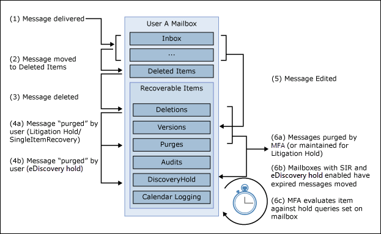

# <a name="create-a-litigation-hold"></a><span data-ttu-id="f6ac8-103">Skapa ett bevarande av juridiska skäl</span><span class="sxs-lookup"><span data-stu-id="f6ac8-103">Create a Litigation Hold</span></span>

<span data-ttu-id="f6ac8-104">Du kan placera en postlåda i Bevarande av juridiska skäl för att behålla allt innehåll i postlådan, inklusive borttagna objekt och de ursprungliga versionerna av ändrade objekt.</span><span class="sxs-lookup"><span data-stu-id="f6ac8-104">You can place a mailbox on Litigation Hold to retain all mailbox content, including deleted items and the original versions of modified items.</span></span> <span data-ttu-id="f6ac8-105">När du placerar en användarpostlåda i Bevarande av juridiska skäl bevaras även innehållet i användarens arkivpostlåda (om det är aktiverat).</span><span class="sxs-lookup"><span data-stu-id="f6ac8-105">When you place a user mailbox on Litigation Hold, content in the user's archive mailbox (if it's enabled) is also retained.</span></span> <span data-ttu-id="f6ac8-106">När du skapar ett hold-up kan du ange varaktigheten för ett varaktighets bevaras (kallas även ett tidsbaserat is) så att borttagna och ändrade objekt bevaras under en angiven period och sedan tas bort permanent från postlådan.</span><span class="sxs-lookup"><span data-stu-id="f6ac8-106">When you create a hold, you can specify a hold duration (also called a *time-based hold*) so that deleted and modified items are retained for a specified period and then permanently deleted from the mailbox.</span></span> <span data-ttu-id="f6ac8-107">Du kan också bara behålla innehåll på obestämd tid (kallas oändligt *bevarande)* eller tills Bevarande av juridiska skäl har tagits bort.</span><span class="sxs-lookup"><span data-stu-id="f6ac8-107">Or you can just retain content indefinitely (called an *infinite hold*) or until the Litigation Hold is removed.</span></span> <span data-ttu-id="f6ac8-108">Om du anger en varaktighet för att hålla kvar beräknas det utifrån datumet då ett meddelande togs emot eller ett postlådeobjekt skapas.</span><span class="sxs-lookup"><span data-stu-id="f6ac8-108">If you do specify a hold duration period, it's calculated from the date a message is received or a mailbox item is created.</span></span> 
  
<span data-ttu-id="f6ac8-109">Det här händer när du skapar bevarande av juridiska skäl.</span><span class="sxs-lookup"><span data-stu-id="f6ac8-109">Here's what happens when you create a Litigation Hold.</span></span>
  
- <span data-ttu-id="f6ac8-110">Objekt som tas bort permanent av användaren finns kvar i mappen Återställningsbara objekt i användarens postlåda under tiden som det är kvar.</span><span class="sxs-lookup"><span data-stu-id="f6ac8-110">Items that are permanently deleted by the user are retained in the Recoverable Items folder in the user's mailbox for the duration of the hold.</span></span>

- <span data-ttu-id="f6ac8-111">Objekt som rensas från mappen Återställningsbara objekt av användaren behålls under tiden som det är kvar.</span><span class="sxs-lookup"><span data-stu-id="f6ac8-111">Items that are purged from the Recoverable Items folder by the user are retained for the duration of the hold.</span></span>

- <span data-ttu-id="f6ac8-112">Lagringskvoten för mappen Återställningsbara objekt ökar från 30 GB till 110 GB.</span><span class="sxs-lookup"><span data-stu-id="f6ac8-112">The storage quota for the Recoverable Items folder is increased from 30 GB to 110 GB.</span></span>

- <span data-ttu-id="f6ac8-113">Objekt i användarens primära postlådor och arkivpostlådor behålls</span><span class="sxs-lookup"><span data-stu-id="f6ac8-113">Items in the user's primary and the archive mailboxes are retained</span></span>

## <a name="assign-an-exchange-online-plan-2-license"></a><span data-ttu-id="f6ac8-114">Tilldela en licens Exchange Online abonnemang 2</span><span class="sxs-lookup"><span data-stu-id="f6ac8-114">Assign an Exchange Online Plan 2 license</span></span>

<span data-ttu-id="f6ac8-115">För att kunna placera Exchange Online postlåda i bevarande av juridiska skäl måste den tilldelas en licens Exchange Online abonnemang 2.</span><span class="sxs-lookup"><span data-stu-id="f6ac8-115">To place an Exchange Online mailbox on Litigation Hold, it must be assigned an Exchange Online Plan 2 license.</span></span> <span data-ttu-id="f6ac8-116">Om en postlåda har tilldelats en Exchange Online abonnemang 1-licens måste du tilldela den en separat licens Exchange Online - arkivering den behöver för att kunna skapa en väntande licens.</span><span class="sxs-lookup"><span data-stu-id="f6ac8-116">If a mailbox is assigned an Exchange Online Plan 1 license, you would have to assign it a separate Exchange Online Archiving license to place it on hold.</span></span>

> [!NOTE]
> <span data-ttu-id="f6ac8-117">För Office 365 Education organisationer stöds bevarande av juridiska skäl i Office 365 A1-prenumerationer, som omfattar en licens Exchange Online abonnemang 1 med kompletterande funktioner.</span><span class="sxs-lookup"><span data-stu-id="f6ac8-117">For Office 365 Education organizations, Litigation Hold is supported in Office 365 A1 subscriptions, which include an Exchange Online Plan 1 license with supplemental features.</span></span> <span data-ttu-id="f6ac8-118">Mer information finns i avsnittet "Exchange Online" i avsnittet om [Office 365 Education tjänstbeskrivning](/office365/servicedescriptions/office-365-platform-service-description/office-365-education#exchange-online-features).</span><span class="sxs-lookup"><span data-stu-id="f6ac8-118">For more information, see the "Exchange Online features" section in the [Office 365 Education service description](/office365/servicedescriptions/office-365-platform-service-description/office-365-education#exchange-online-features).</span></span>

## <a name="place-a-mailbox-on-litigation-hold"></a><span data-ttu-id="f6ac8-119">Placera en postlåda i Bevarande av juridiska skäl</span><span class="sxs-lookup"><span data-stu-id="f6ac8-119">Place a mailbox on Litigation Hold</span></span>

<span data-ttu-id="f6ac8-120">Här är stegen för att placera en postlåda i Bevarande av juridiska skäl med hjälp Exchange administrationscenter.</span><span class="sxs-lookup"><span data-stu-id="f6ac8-120">Here are the steps to place a mailbox on Litigation Hold using the Exchange admin center.</span></span>

1. <span data-ttu-id="f6ac8-121">Gå till [https://outlook.office.com/ecp](https://outlook.office.com/ecp) och logga in med ditt globala administratörskonto.</span><span class="sxs-lookup"><span data-stu-id="f6ac8-121">Go to [https://outlook.office.com/ecp](https://outlook.office.com/ecp) and sign in using your global administrator account.</span></span>

2. <span data-ttu-id="f6ac8-122">Klicka **på > postlådor** i det vänstra navigeringsfönstret.</span><span class="sxs-lookup"><span data-stu-id="f6ac8-122">Click **Recipients > Mailboxes** in the left navigation pane.</span></span>

3. <span data-ttu-id="f6ac8-123">Markera postlådan som du vill placera i Bevarande av juridiska skäl och klicka sedan på **Redigera**.</span><span class="sxs-lookup"><span data-stu-id="f6ac8-123">Select the mailbox that you want to place on Litigation Hold, and then click **Edit**.</span></span>

4. <span data-ttu-id="f6ac8-124">Klicka på Postlådefunktioner på **sidan med postlådeegenskaper.**</span><span class="sxs-lookup"><span data-stu-id="f6ac8-124">On the mailbox properties page, click **Mailbox features**.</span></span>
    
5. <span data-ttu-id="f6ac8-125">Under **Bevarande av juridiska skäl: Inaktiverad** klickar du **på** Aktivera för att placera postlådan i bevarande av juridiska skäl.</span><span class="sxs-lookup"><span data-stu-id="f6ac8-125">Under **Litigation hold: Disabled**, click **Enable** to place the mailbox on Litigation Hold.</span></span>
    
6. <span data-ttu-id="f6ac8-126">På sidan **Bevarande av juridiska** skäl anger du följande valfria information:</span><span class="sxs-lookup"><span data-stu-id="f6ac8-126">On the **Litigation hold** page, enter the following optional information:</span></span> 
    
    - <span data-ttu-id="f6ac8-127">**Bevarande av juridiska skäl varaktighet (dagar)** – Använd den här rutan för att skapa ett tidsbaserat bevarande och ange hur länge postlådeobjekt ska behållas när postlådan hålls i bevarande av juridiska skäl.</span><span class="sxs-lookup"><span data-stu-id="f6ac8-127">**Litigation hold duration (days)** - Use this box to create a time-based hold and specify how long mailbox items are held when the mailbox is placed on Litigation Hold.</span></span> <span data-ttu-id="f6ac8-128">Varaktigheten beräknas från det datum då ett postlådeobjekt togs emot eller skapades.</span><span class="sxs-lookup"><span data-stu-id="f6ac8-128">The duration is calculated from the date a mailbox item is received or created.</span></span> <span data-ttu-id="f6ac8-129">När varaktigheten för undantaget upphör att gälla för ett visst objekt bevaras inte längre objektet.</span><span class="sxs-lookup"><span data-stu-id="f6ac8-129">When the hold duration expires for a specific item, that item will no longer be preserved.</span></span> <span data-ttu-id="f6ac8-130">Om du låter rutan vara tom bevaras objekten ett obestämt sätt eller tills det att fältet tas bort.</span><span class="sxs-lookup"><span data-stu-id="f6ac8-130">If you leave this box blank, items are preserved indefinitely or until the hold is removed.</span></span> <span data-ttu-id="f6ac8-131">Ange varaktigheten genom att använda dagar.</span><span class="sxs-lookup"><span data-stu-id="f6ac8-131">Use days to specify the duration.</span></span>
    
    - <span data-ttu-id="f6ac8-132">**Obs!** – Använd den här rutan om du vill informera användaren om att användarens postlåda har bevarande av juridiska skäl.</span><span class="sxs-lookup"><span data-stu-id="f6ac8-132">**Note** - Use this box to inform the user their mailbox is on Litigation Hold.</span></span> <span data-ttu-id="f6ac8-133">Anteckningen visas på sidan Kontoinformation i användarens postlåda om han eller hon använder Outlook 2010 eller senare.</span><span class="sxs-lookup"><span data-stu-id="f6ac8-133">The note will appear on the Account Information page in the user's mailbox if they're using Outlook 2010 or later.</span></span> <span data-ttu-id="f6ac8-134">För att komma åt den här sidan kan användarna **klicka på Arkiv** i Outlook.</span><span class="sxs-lookup"><span data-stu-id="f6ac8-134">To access this page, users can click **File** in Outlook.</span></span>
    
    - <span data-ttu-id="f6ac8-135">**URL** – Använd den här rutan om du vill dirigera användaren till en webbplats för mer information om bevarande av juridiska skäl.</span><span class="sxs-lookup"><span data-stu-id="f6ac8-135">**URL** - Use this box to direct the user to a website for more information about Litigation Hold.</span></span> <span data-ttu-id="f6ac8-136">Den här URL-adressen visas på sidan Kontoinformation i användarens postlåda om de använder Outlook 2010 eller senare.</span><span class="sxs-lookup"><span data-stu-id="f6ac8-136">This URL appears on the Account Information page in the user's mailbox if they are using Outlook 2010 or later.</span></span> <span data-ttu-id="f6ac8-137">För att komma åt den här sidan kan användarna **klicka på** Arkiv Outlook..</span><span class="sxs-lookup"><span data-stu-id="f6ac8-137">To access this page, users can click **File** in Outlook..</span></span>

7. <span data-ttu-id="f6ac8-138">Klicka **på** Spara på **sidan Bevarande av** juridiska skäl och klicka sedan **på** Spara på egenskapssidan för postlådan.</span><span class="sxs-lookup"><span data-stu-id="f6ac8-138">Click **Save** on the **Litigation hold** page, and then click **Save** on the mailbox properties page.</span></span>

### <a name="create-a-litigation-hold-using-powershell"></a><span data-ttu-id="f6ac8-139">Skapa bevarande av juridiska skäl med PowerShell</span><span class="sxs-lookup"><span data-stu-id="f6ac8-139">Create a Litigation Hold using PowerShell</span></span>

<span data-ttu-id="f6ac8-140">Du kan också skapa ett bevarande av juridiska skäl genom att köra följande kommando [i Exchange Online PowerShell:](/powershell/exchange/connect-to-exchange-online-powershell)</span><span class="sxs-lookup"><span data-stu-id="f6ac8-140">You can also create a Litigation Hold by running the following command in [Exchange Online PowerShell](/powershell/exchange/connect-to-exchange-online-powershell):</span></span>

```powershell
Set-Mailbox <username> -LitigationHoldEnabled $true
```

<span data-ttu-id="f6ac8-141">Det föregående kommandot bevarar objekt ett obestämt antal objekt eftersom varaktigheten för bevarande inte har angetts.</span><span class="sxs-lookup"><span data-stu-id="f6ac8-141">The previous command preserves items indefinitely because the hold duration isn't specified.</span></span> <span data-ttu-id="f6ac8-142">Så här skapar du ett tidsbaserat väntande kommando:</span><span class="sxs-lookup"><span data-stu-id="f6ac8-142">To create a time-based hold, using the following command:</span></span>

```powershell
Set-Mailbox <username> -LitigationHoldEnabled $true -LitigationHoldDuration <number of days>
```

<span data-ttu-id="f6ac8-143">Mer information finns i [Set-Mailbox](/powershell/module/exchange/set-mailbox).</span><span class="sxs-lookup"><span data-stu-id="f6ac8-143">For more information, see [Set-Mailbox](/powershell/module/exchange/set-mailbox).</span></span>

## <a name="how-does-litigation-hold-work"></a><span data-ttu-id="f6ac8-144">Hur fungerar Bevarande av juridiska skäl?</span><span class="sxs-lookup"><span data-stu-id="f6ac8-144">How does Litigation Hold work?</span></span>

<span data-ttu-id="f6ac8-145">I det normala arbetsflödet för borttaget flyttas ett postlådeobjekt till undermappen Borttagningar i mappen Återställningsbara objekt när en användare tar bort det permanent (Skift+Delete) eller tar bort det från mappen Borttaget.</span><span class="sxs-lookup"><span data-stu-id="f6ac8-145">In the normal deleted item workflow, a mailbox item is moved to the Deletions subfolder in the Recoverable Items folder when a user permanently deletes it (Shift + Delete) or deletes it from the Deleted Items folder.</span></span> <span data-ttu-id="f6ac8-146">En borttagningsprincip (som är en bevarandetagg som konfigurerats med åtgärden Ta bort bevarande) flyttar också objekt till undermappen Borttagningar när bevarandetiden löper ut.</span><span class="sxs-lookup"><span data-stu-id="f6ac8-146">A deletion policy (which is a retention tag configured with a Delete retention action) also moves items to the Deletions subfolder when the retention period expires.</span></span> <span data-ttu-id="f6ac8-147">När en användare rensar ett objekt i mappen för permanent borttagna objekt eller när bevarandeperioden för borttagna objekt löper ut för ett objekt flyttas det till undermappen Rensningar i mappen Återställningsbara objekt och markeras för permanent borttagning.</span><span class="sxs-lookup"><span data-stu-id="f6ac8-147">When a user purges an item in the Recoverable Items folder or when the deleted item retention period expires for an item, it's moved to the Purges subfolder in the Recoverable Items folder and marked for permanent deletion.</span></span> <span data-ttu-id="f6ac8-148">Den rensas från Exchange nästa gång postlådan bearbetas av assistenten för hanterade mappar (MFA).</span><span class="sxs-lookup"><span data-stu-id="f6ac8-148">It will be purged from Exchange the next time the mailbox is processed by the Managed Folder Assistant (MFA).</span></span>

<span data-ttu-id="f6ac8-149">När en postlåda placeras i Bevarande av juridiska skäl bevaras objekt i undermappen Rensningar under den bevarandetid som anges av Bevarande av juridiska skäl.</span><span class="sxs-lookup"><span data-stu-id="f6ac8-149">When a mailbox is placed on Litigation Hold, items in the Purges subfolder are preserved for the hold duration specified by the Litigation Hold.</span></span> <span data-ttu-id="f6ac8-150">Varaktigheten för håll beräknas från det ursprungliga datumet som ett objekt togs emot eller skapades och definierar hur länge objekten i undermappen Rensningar hålls kvar.</span><span class="sxs-lookup"><span data-stu-id="f6ac8-150">The hold duration is calculated from the original date an item was received or created, and defines how long items in the Purges subfolder are held.</span></span> <span data-ttu-id="f6ac8-151">När varaktigheten för undantaget för ett objekt i undermappen Rensningar förfaller markeras objektet för permanent borttagning och rensas från Exchange nästa gång postlådan bearbetas av MFA.</span><span class="sxs-lookup"><span data-stu-id="f6ac8-151">When the hold duration expires for an item in the Purges subfolder, the item is marked for permanent deletion and will be purged from Exchange the next time the mailbox is processed by the MFA.</span></span> <span data-ttu-id="f6ac8-152">Om ett obestämt sätt sätts på en postlåda rensas aldrig objekten från undermappen Rensningar.</span><span class="sxs-lookup"><span data-stu-id="f6ac8-152">If an indefinite hold is placed on a mailbox, items will never be purged from the Purges subfolder.</span></span>

<span data-ttu-id="f6ac8-153">Följande bild visar undermappar i mapparna för återställningsbara objekt och arbetsflödet för att hålla kvar.</span><span class="sxs-lookup"><span data-stu-id="f6ac8-153">The following illustration shows the subfolders in the Recoverable Items folders and the hold workflow process.</span></span>



> [!NOTE]
> <span data-ttu-id="f6ac8-155">Om ett undantat objekt som är kopplat till ett eDiscovery-ärende placeras i en postlåda flyttas bortrensade objekt från undermappen Borttagningar till undermappen DiscoveryHolds och bevaras tills postlådan släpps från eDiscovery-undantas.</span><span class="sxs-lookup"><span data-stu-id="f6ac8-155">If a hold associated with an eDiscovery case is placed on a mailbox, purged items are moved from the Deletions subfolder to the DiscoveryHolds subfolder and are preserved until the mailbox is released from the eDiscovery hold.</span></span>
