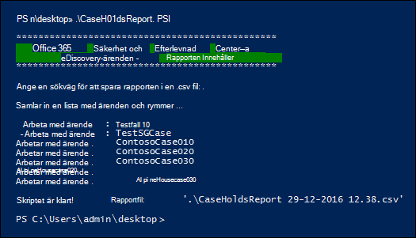

# <a name="create-a-report-on-holds-in-ediscovery-cases"></a>Skapa en rapport om spärrade eDiscovery-ärenden

Skriptet i den här artikeln gör att eDiscovery-administratörer och eDiscovery-hanterare kan generera en rapport som innehåller information om alla innehåll som är kopplade till eDiscovery-ärenden i efterlevnadscentret i Office 365 eller Microsoft 365. Rapporten innehåller information som namnet på det ärende som ett ärende som ett ärende är kopplat till, vilka innehållsplatser som är placerade som väntande och om fältet är frågebaserat. Om det finns fall som inte har något som kan spärras skapas en rapport med en lista över ärenden utan rymmer.

I avsnittet [Mer information](#more-information) finns en detaljerad beskrivning av informationen i rapporten.

## <a name="admin-requirements-and-script-information"></a>Administratörskrav och skriptinformation

- Om du vill skapa en rapport över alla eDiscovery-ärenden i organisationen måste du vara eDiscovery-administratör i organisationen. Om du är en eDiscovery-hanterare innehåller rapporten endast information om de fall som du kan komma åt. Mer information om eDiscovery-behörigheter finns i [Tilldela eDiscovery-behörigheter.](assign-ediscovery-permissions.md)

- Skriptet i den här artikeln har minimal felhantering. Det primära syftet är att snabbt skapa en rapport om de kvarhåller information som är kopplade till eDiscovery-ärenden i organisationen.

- Exempelskripten som tillhandahålls i det här avsnittet stöds inte under något standardsupportprogram eller någon standardsupporttjänst från Microsoft. Exempelskripten ges i befintligt skick utan garantier av något slag. Vidare frånsäger sig Microsoft alla underförstådda garantier, inklusive, utan begränsning, underförstådda garantier om säljbarhet eller lämplighet för ett visst ändamål. Hela risken i samband med användningen av eller prestandan hos exempelskripten och dokumentationen vilar på dig. Under inga omständigheter ska Microsoft, dess upphovspersoner eller någon annan som är involverad i skapandet, produktionen eller leveransen av skripten hållas ansvariga för någon som helst skada (inklusive, men inte begränsat till, skador avseende utebliven vinst, driftavbrott, förlust av affärsinformation eller annan ekonomisk skada) som uppstår till följd av användning eller svårighet eller omöjlighet att använda exempelskripten eller dokumentationen, även om Microsoft har fått information om att sådana skador kan uppstå.

## <a name="step-1-connect-to-the-security--compliance-center-powershell"></a>Steg 1: Anslut säkerhets- och & Säkerhets- och efterlevnadscenter PowerShell

Det första steget är att ansluta till PowerShell för Säkerhets- och efterlevnadscenter för din organisation. Stegvisa anvisningar finns i [Ansluta till PowerShell för Säkerhets- och efterlevnadscenter](/powershell/exchange/connect-to-scc-powershell).

## <a name="step-2-run-the-script-to-report-on-holds-associated-with-ediscovery-cases"></a>Steg 2: Kör skriptet för att rapportera om eDiscovery-ärenden

När du har anslutit till Security & Compliance Center PowerShell är nästa steg att skapa och köra skriptet som samlar in information om eDiscovery-ärenden i organisationen.

1. Spara följande text i en Windows PowerShell skriptfil med hjälp av ett filnamnssuffix .ps1; till exempel CaseHoldsReport.ps1.

   ```powershell
   #script begin
   " "
   write-host "***********************************************"
   write-host "   Security & Compliance Center   " -foregroundColor yellow -backgroundcolor darkgreen
   write-host "        eDiscovery cases - Holds report         " -foregroundColor yellow -backgroundcolor darkgreen
   write-host "***********************************************"
   " "
   #prompt users to specify a path to store the output files
   $time=get-date
   $Path = Read-Host 'Enter a file path to save the report to a .csv file'
   $outputpath=$Path+'\'+'CaseHoldsReport'+' '+$time.day+'-'+$time.month+'-'+$time.year+' '+$time.hour+'.'+$time.minute+'.csv'
   $noholdsfilepath=$Path+'\'+'CaseswithNoHolds'+' '+$time.day+'-'+$time.month+'-'+$time.year+' '+$time.hour+'.'+$time.minute+'.csv'
   #add case details to the csv file
   function add-tocasereport{
   Param([string]$casename,
   [String]$casestatus,
   [datetime]$casecreatedtime,
   [string]$casemembers,
   [datetime]$caseClosedDateTime,
   [string]$caseclosedby,
   [string]$holdname,
   [String]$Holdenabled,
   [string]$holdcreatedby,
   [string]$holdlastmodifiedby,
   [string]$ExchangeLocation,
   [string]$sharePointlocation,
   [string]$ContentMatchQuery,
   [datetime]$holdcreatedtime,
   [datetime]$holdchangedtime
   )
   $addRow = New-Object PSObject
   Add-Member -InputObject $addRow -MemberType NoteProperty -Name "Case name" -Value $casename
   Add-Member -InputObject $addRow -MemberType NoteProperty -Name "Case status" -Value $casestatus
   Add-Member -InputObject $addRow -MemberType NoteProperty -Name "Case members" -Value $casemembers
   Add-Member -InputObject $addRow -MemberType NoteProperty -Name "Case created time" -Value $casecreatedtime
   Add-Member -InputObject $addRow -MemberType NoteProperty -Name "Case closed time" -Value $caseClosedDateTime
   Add-Member -InputObject $addRow -MemberType NoteProperty -Name "Case closed by" -Value $caseclosedby
   Add-Member -InputObject $addRow -MemberType NoteProperty -Name "Hold name" -Value $holdname
   Add-Member -InputObject $addRow -MemberType NoteProperty -Name "Hold enabled" -Value $Holdenabled
   Add-Member -InputObject $addRow -MemberType NoteProperty -Name "Hold created by" -Value $holdcreatedby
   Add-Member -InputObject $addRow -MemberType NoteProperty -Name "Hold last changed by" -Value $holdlastmodifiedby
   Add-Member -InputObject $addRow -MemberType NoteProperty -Name "Exchange locations" -Value  $ExchangeLocation
   Add-Member -InputObject $addRow -MemberType NoteProperty -Name "SharePoint locations" -Value $sharePointlocation
   Add-Member -InputObject $addRow -MemberType NoteProperty -Name "Hold query" -Value $ContentMatchQuery
   Add-Member -InputObject $addRow -MemberType NoteProperty -Name "Hold created time (UTC)" -Value $holdcreatedtime
   Add-Member -InputObject $addRow -MemberType NoteProperty -Name "Hold changed time (UTC)" -Value $holdchangedtime
   $allholdreport = $addRow | Select-Object "Case name","Case status","Hold name","Hold enabled","Case members", "Case created time","Case closed time","Case closed by","Exchange locations","SharePoint locations","Hold query","Hold created by","Hold created time (UTC)","Hold last changed by","Hold changed time (UTC)"
   $allholdreport | export-csv -path $outputPath -notypeinfo -append -Encoding ascii
   }
   #get information on the cases and pass values to the case report function
   " "
   write-host "Gathering a list of cases and holds..."
   " "
   $edc =Get-ComplianceCase -ErrorAction SilentlyContinue
   foreach($cc in $edc)
   {
   write-host "Working on case :" $cc.name
   if($cc.status -eq 'Closed')
   {
   $cmembers = ((Get-ComplianceCaseMember -Case $cc.name).windowsLiveID)-join ';'
   add-tocasereport -casename $cc.name -casestatus $cc.Status -caseclosedby $cc.closedby -caseClosedDateTime $cc.ClosedDateTime -casemembers $cmembers
   }
   else{
   $cmembers = ((Get-ComplianceCaseMember -Case $cc.name).windowsLiveID)-join ';'
   $policies = Get-CaseHoldPolicy -Case $cc.Name | %{ Get-CaseHoldPolicy $_.Name -Case $_.CaseId -DistributionDetail}
   if ($policies -ne $NULL)
   {
   foreach ($policy in $policies)
   {
   $rule=Get-CaseHoldRule -Policy $policy.name
   add-tocasereport -casename $cc.name -casemembers $cmembers -casestatus $cc.Status -casecreatedtime $cc.CreatedDateTime -holdname $policy.name -holdenabled $policy.enabled -holdcreatedby $policy.CreatedBy -holdlastmodifiedby $policy.LastModifiedBy -ExchangeLocation (($policy.exchangelocation.name)-join ';') -SharePointLocation (($policy.sharePointlocation.name)-join ';') -ContentMatchQuery $rule.ContentMatchQuery -holdcreatedtime $policy.WhenCreatedUTC -holdchangedtime $policy.WhenChangedUTC
   }
   }
   else{
   write-host "No hold policies found in case:" $cc.name -foregroundColor 'Yellow'
   " "
   [string]$cc.name | out-file -filepath $noholdsfilepath -append
   }
   }
   }

   " "
   Write-host "Script complete! Report files saved to this folder: '$Path'"
   " "
   #script end
   ```

2. I den Windows PowerShell som öppnades i steg 1 går du till mappen där du sparade skriptet.

3. Kör skriptet. till exempel:

   ```powershell
   .\CaseHoldsReport.ps1
   ```

   Skriptet uppmanar dig att ange en målmapp där rapporten ska sparas.

4. Skriv den fullständiga sökvägen till den mapp du vill spara rapporten till och tryck sedan på **Retur.**

   > [!TIP]
   > Om du vill spara rapporten i samma mapp som skriptet finns i skriver du en punkt (".") när du uppmanas att ange en målmapp. Om du vill spara rapporten i en undermapp i mappen där skriptet finns skriver du bara namnet på undermappen.

   Skriptet börjar samla in information om alla eDiscovery-ärenden i organisationen. Kom inte åt rapportfilen medan skriptet körs. När skriptet är klart visas ett bekräftelsemeddelande under Windows PowerShell session. När det här meddelandet visas kan du komma åt rapporten i den mapp som du angav i steg 4. Filnamnet för rapporten är `CaseHoldsReport<DateTimeStamp>.csv` .

   Skriptet skapar även en rapport med en lista med ärenden som inte innehåller några mål. Filnamnet för den här rapporten är `CaseswithNoHolds<DateTimeStamp>.csv` .

   Här är ett exempel på hur skriptet CaseHoldsReport.ps1 körs.

   

## <a name="more-information"></a>Mer information

Rapporten om ärende som skapas när du kör skriptet i den här artikeln innehåller följande information om varje enskilt ärende. Som tidigare förklarats måste du vara eDiscovery-administratör för att returnera information för alla som finns i organisationen. Mer information om fall som kan spärras finns i [eDiscovery-ärenden.](./get-started-core-ediscovery.md)

- Namnet på kvarten och namnet på det eDiscovery-ärende som är kopplat till det.

- Om eDiscovery-ärendet är aktivt eller stängt eller inte.

- Om alternativet för att hålla på en enhet är aktiverat eller inte.

- Medlemmarna i eDiscovery-ärendet som är kopplat till det. Ärendemedlemmar kan visa eller hantera ett ärende beroende på vilka eDiscovery-behörigheter de har tilldelats.

- Den tid och det datum då ärendet skapades.

- Om ett ärende är stängt stänger personen som stängde det samt tiden och datumet då det stängdes.

- Den Exchange postlådor SharePoint har platser som är väntande.

- Om hold är frågebaserad, ska frågans syntax vara.

- Den tid och det datum då det skapades och den person som skapade det.

- Den tid och det datum då lasten ändrades och den person som ändrade det.