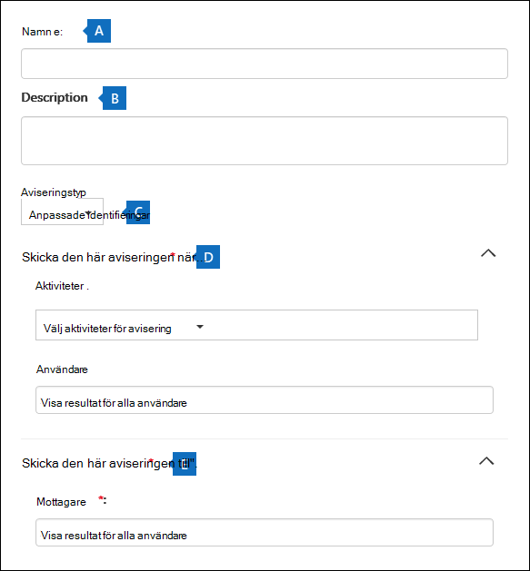
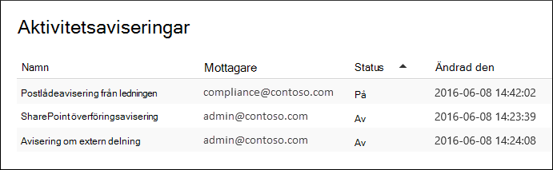
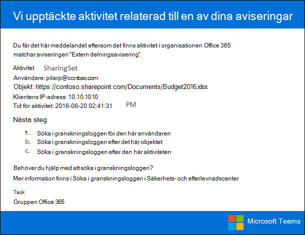

# Skapa aktivitetsaviseringarCreate activity alerts

Du kan skapa en aktivitetsavisering som skickar ett e-postmeddelande när användare utför specifika aktiviteter i Office 365.You can create an activity alert that will send you an email notification when users perform specific activities in Office 365. Aktivitetsaviseringar påminner om att söka efter händelser i granskningsloggen, förutom att du får ett e-postmeddelande när en händelse för en aktivitet som du har skapat en avisering för inträffar.Activity alerts are similar to searching for events in the audit log, except that you'll be sent an email message when an event for an activity that you've created an alert for happens. 
  
 **Varför ska jag använda aktivitetsaviseringar i stället för att söka i granskningsloggen?****Why use activity alerts instead of searching the audit log?** Det kan finnas vissa typer av aktivitet eller aktivitet som utförs av specifika användare som du verkligen vill veta om.There might be certain kinds of activity or activity performed by specific users that you really want to know about. I stället för att behöva komma ihåg att söka i granskningsloggen efter dessa aktiviteter kan du använda aktivitetsaviseringar för att Microsoft 365 ett e-postmeddelande när användarna utför de aktiviteterna.Instead of having to remember to search the audit log for those activities, you can use activity alerts to have Microsoft 365 send you an email message when users perform those activities. Du kan till exempel skapa en aktivitetsavisering för att meddela dig när en användare tar bort filer i SharePoint, eller så kan du skapa en avisering för att meddela dig när en användare permanent tar bort meddelanden från postlådan.For example, you can create an activity alert to notify you when a user deletes files in SharePoint or you can create an alert to notify you when a user permanently deletes messages from their mailbox. E-postmeddelandet som skickas till dig innehåller information om vilken aktivitet som utförts och användaren som utförde den.The email notification sent to you includes information about which activity was performed and the user who performed it.

> [!NOTE]
> Aktivitetsaviseringar är föråldrade.Activity alerts are being deprecated. Vi rekommenderar att du börjar använda aviseringsprinciper i säkerhets- och efterlevnadscentret i stället för att skapa nya aktivitetsaviseringar.We recommend that you start using alert policies in the security and compliance center instead of creating new activity alerts. Aviseringsprinciper ger ytterligare funktioner, till exempel möjligheten att skapa en aviseringsprincip som utlöser en  avisering när en användare utför en angiven aktivitet, och visa aviseringar på sidan Visa aviseringar i säkerhets- och efterlevnadscentret.Alert policies provide addition functionality such as the ability to create an alert policy that triggers an alert when any user performs a specified activity, and displaying alerts on the **View alerts** page in the security and compliance center. Mer information finns i [Aviseringsprinciper](alert-policies.md).For more information, see [Alert policies](alert-policies.md).
  
## Bekräfta roller och konfigurera granskningsloggningConfirm roles and configure audit logging

- Du måste ha tilldelats rollen Organisationskonfiguration i Säkerhets- & säkerhets- och efterlevnadscenter för att hantera aktivitetsaviseringar.You must be assigned the Organization Configuration role in the Security & Compliance Center to manage activity alerts. Som standard är den här rollen tilldelad rollgrupperna Efterlevnadsadministratör och Organisationshantering.By default, this role is assigned to the Compliance Administrator and Organization Management role groups. Mer information om hur du lägger till medlemmar i rollgrupper finns i Ge [användare åtkomst till Säkerhets- & Efterlevnadscenter.](../security/defender-365-security/grant-access-to-the-security-and-compliance-center.md)For more information about adding members to role groups, see [Give users access to the Security & Compliance Center](../security/defender-365-security/grant-access-to-the-security-and-compliance-center.md).
    
- Du (eller någon annan administratör) måste först aktivera granskningsloggning för organisationen innan du kan börja använda aktivitetsaviseringar.You (or another admin) must first turn on audit logging for your organization before you can start using activity alerts. Det gör du genom att klicka på **Starta inspelning av användar- och administratörsaktivitet** på **sidan Aktivitetsaviseringar.**To do this, just click **Start recording user and admin activity** on the **Activity alerts** page. (Om du inte ser länken har granskning redan aktiverats för organisationen.) Du kan också aktivera granskning på sidan **Granskningsloggsökning** i Säkerhets- och & (gå till **Sök** \> **granskningsloggsökning**).(If you don't see this link, auditing has already been turned on for your organization.) You can also turn on auditing on the **Audit log search** page in the Security & Compliance Center (go to **Search** \> **Audit log search**). Du behöver bara göra det här en gång för din organisation.You only have to do this once for your organization.
  
- Du kan skapa aviseringar för samma aktiviteter som du kan söka efter i granskningsloggen.You can create alerts for the same activities that you can search for in the audit log. I avsnittet [Mer information](#more-information) finns en lista över vanliga scenarier (och den specifika aktivitet som ska övervakas) som du kan skapa aviseringar för.See the [More information](#more-information) section for a list of common scenarios (and the specific activity to monitor) that you can create alerts for. 
    
- Du kan  använda sidan Aktivitetsaviseringar i Säkerhets- och efterlevnadscenter för & för att skapa aviseringar endast för aktiviteter som utförs av användare som finns med i organisationens adressbok.You can use the **Activity alerts** page in the Security & Compliance Center to create alerts only for activity performed by users who are listed in your organization's address book. Du kan inte använda den här sidan för att skapa aviseringar om aktiviteter som utförs av externa användare som inte finns med i adressboken.You can't use this page to create alerts for activity performed by external users who aren't listed in the address book. 
    
## Skapa en aktivitetsaviseringCreate an activity alert

1. Gå till [https://protection.office.com/managealerts](https://protection.office.com/managealerts).Go to [https://protection.office.com/managealerts](https://protection.office.com/managealerts).
    
2. Logga in med ditt arbets- eller skolkonto.Sign in using your work or school account.
    
3. På sidan **Aktivitetsaviseringar** klickar du på  **Ny.**On the **Activity alerts** page, click  **New**.

   Den utfällna sidan för att skapa en aktivitetsavisering visas.The flyout page to create an activity alert is displayed.

    
    
  
4. Skapa en aktivitetsavisering genom att fylla i följande fält:Complete the following fields to create an activity alert:
    
    a.a. **Namn** – Ange ett namn på aviseringen.**Name** - Type a name for the alert. Aviseringsnamnen måste vara unika inom organisationen.Alert names must be unique within your organization.
    
    b.b. **Beskrivning** (valfritt) – Beskriv aviseringen, t.ex. de aktiviteter och användare som spåras, och vilka användare som e-postaviseringar skickas till.**Description** (Optional) - Describe the alert, such as the activities and users being tracked, and the users that email notifications are sent to. Beskrivningar är ett snabbt och enkelt sätt att beskriva syftet med aviseringen för andra administratörer.Descriptions provide a quick and easy way to describe the purpose of the alert to other admins.
    
    c.c. **Aviseringstyp** – kontrollera att **alternativet** Anpassad är markerat.**Alert type** - Make sure the **Custom** option is selected. 

    d.d. **Skicka den här aviseringen när** – Klicka **på Skicka den här aviseringen när** och sedan konfigurera de här två fälten:**Send this alert when** - Click **Send this alert when** and then configure these two fields:
    
    - **Aktiviteter** – Klicka på listrutan för att visa de aktiviteter som du kan skapa en avisering för.**Activities** - Click the drop-down list to display the activities that you can create an alert for. Det här är samma aktivitetslista som visas när du söker i granskningsloggen.This is the same activities list that's displayed when you search the audit log. Du kan välja en eller flera specifika aktiviteter eller så kan du klicka på aktivitetsgruppnamnet för att markera alla aktiviteter i gruppen.You can select one or more specific activities or you can click the activity group name to select all activities in the group. En beskrivning av de här aktiviteterna finns i avsnittet "Granskade aktiviteter" i [Söka i granskningsloggen.](search-the-audit-log-in-security-and-compliance.md#audited-activities)For a description of these activities, see the "Audited activities" section in [Search the audit log](search-the-audit-log-in-security-and-compliance.md#audited-activities). När en användare utför någon av de aktiviteter som du har lagt till i aviseringen skickas en e-postavisering.When a user performs any of the activities that you've added to the alert, an email notification is sent. 
    
     - **Användare** – Klicka i den här rutan och välj sedan en eller flera användare.**Users** - Click this box and then select one or more users. Om användarna i den här rutan utför de aktiviteter som du har lagt till **i** rutan Aktiviteter skickas en avisering.If the users in this box perform the activities that you added to the **Activities** box, an alert will be sent. Lämna rutan **Användare** tom för att skicka en avisering när en användare i organisationen utför de aktiviteter som anges av aviseringen.Leave the **Users** box blank to send an alert when any user in your organization performs the activities specified by the alert. 

    e.e. Skicka den **här** aviseringen till – Klicka  på Skicka den här aviseringen och klicka sedan i rutan Mottagare  och skriv ett namn för att lägga till en användare som kommer att få en e-postavisering när en användare (anges i rutan Användare) utför en aktivitet (anges i **rutan** Aktiviteter). **Send this alert to** - Click **Send this alert**, and then click in the **Recipients** box and type a name to add a users who will receive an email notification when a user (specified in the **Users** box) performs an activity (specified in the **Activities** box). Observera att du som standard läggs till i listan över mottagare.Note that you are added to the list of recipients by default. Du kan ta bort ditt namn från den här listan.You can remove your name from this list.
    
5. Klicka **på Spara** för att skapa aviseringen.Click **Save** to create the alert. 
    
    Den nya aviseringen visas i listan på sidan **Aktivitetsaviseringar.**The new alert is displayed in the list on the **Activity alerts** page. 
    
    
  
    Status för aviseringen är På **.**The status of the alert is set to **On**. Observera att de mottagare som får en e-postavisering när en avisering skickas också visas.Note that the recipients who will received an email notification when an alert is sent are also listed. 
  
## Inaktivera en aktivitetsaviseringTurn off an activity alert

Du kan inaktivera en aktivitetsavisering så att en e-postavisering inte skickas.You can turn off an activity alert so that an email notification isn't sent. När du har inaktiverat aktivitetsaviseringen visas den fortfarande i listan med aktivitetsaviseringar för organisationen, och du kan fortfarande visa dess egenskaper.After you turn off the activity alert, it's still displayed in the list of activity alerts for your organization, and you can still view its properties.
  
1. Gå till Gå till [https://protection.office.com/managealerts](https://protection.office.com/managealerts) .Go to Go to [https://protection.office.com/managealerts](https://protection.office.com/managealerts).
    
2. Logga in med ditt arbets- eller skolkonto.Sign in using your work or school account.
    
3. Klicka på den avisering du vill inaktivera i listan med aktivitetsaviseringar för organisationen.In the list of activity alerts for your organization, click the alert that you want to turn off.
    
4. På sidan **Redigera avisering** klickar du på **växlingsknappen** På för att ändra status till **Av** och klickar sedan på **Spara**.On the **Edit alert** page, click the **On** toggle switch to change the status to **Off**, and then click **Save**.
    
    Statusen för aviseringen på sidorna **Aktivitetsaviseringar** är inställd på **Av**.The status of the alert on the **Activity alerts** pages is set to **Off**. 
    
Om du vill aktivera en aktivitetsavisering igen  upprepar du dessa steg och klickar på växlingsknappen Av för att ändra status till **På.**To turn an activity alert back on, just repeat these steps and click the **Off** toggle switch to change the status to **On**.
  
## Mer informationMore information

- Här är ett exempel på e-postmeddelandet som skickas till användare som anges i fältet Skickat  denna avisering till (och visas **under** Mottagare på sidan Aktivitetsaviseringar ) i efterlevnadscentret för säkerhet och &.Here's an example of the email notification that is sent to the users that are specified in the Sent this alert to field (and listed under **Recipients** on the **Activity alerts** page ) in the Security & Compliance Center. 
    
    
  
- Här är några vanliga dokument- och e-postaktiviteter som du kan skapa aktivitetsaviseringar för.Here's are some common document and email activities that you can create an activity alerts for. I tabellerna beskrivs aktiviteten, namnet på aktiviteten som du vill skapa en avisering för och  namnet på aktivitetsgruppen som aktiviteten visas under i listrutan Aktiviteter.The tables describes the activity, the name of the activity to create an alert for, and the name of the activity group that the activity is listed under in the **Activities** drop-down list. En fullständig lista med aktiviteter som du kan skapa aktivitetsaviseringar för finns i avsnittet "Granskade aktiviteter" i [Söka i granskningsloggen.](search-the-audit-log-in-security-and-compliance.md#audited-activities)To see a complete list of the activities that you can create activity alerts for, see the "Audited activities" section in [Search the audit log](search-the-audit-log-in-security-and-compliance.md#audited-activities).
    
    > [!TIP]
    > Du kanske vill skapa en aktivitetsavisering för bara en aktivitet som utförs av en användare.You might want to create an activity alert for just one activity that's performed by any user. Eller så kanske du vill skapa en aktivitetsavisering som spårar flera aktiviteter som utförts av en eller flera användare.Or you might want to create an activity alert that track multiple activities performed by one or mores users. 
  
    I följande tabell visas några vanliga dokumentrelaterade aktiviteter i SharePoint eller OneDrive för företag.The following table lists some common document-related activities in SharePoint or OneDrive for Business.
    
    |**När en användare gör det här ...****When a user does this...**|**Skapa en avisering för den här aktiviteten****Create an alert for this activity**|**Aktivitetsgrupp****Activity group**|
    |:-----|:-----|:-----|
    |Visar ett dokument på en webbplats.Views a document on a site.    |Öppnad filAccessed file    |Fil- och mappaktiviteterFile and folder activities    |
    |Redigerar eller ändrar ett dokument.Edits or changes a document.    |Ändrad filModified file    |Fil- och mappaktiviteterFile and folder activities    |
    |Delar ett dokument med en användare utanför organisationen.Shares a document with a user outside of your organization.    |Dela fil, mapp eller webbplatsShare file, folder, or site    OchAnd    Delningsinbjudan skapadCreated sharing invitation    Mer information finns i Använda [delningsgranskning i granskningsloggen](use-sharing-auditing.md).For more information, see [Use sharing auditing in the audit log](use-sharing-auditing.md).    |Aktiviteter för delning och åtkomstbegäranSharing and access request activities    |
    |Laddar upp eller laddar ned ett dokument.Uploads or downloads a document.    |Uppladdad filUploaded file    Och/ellerAnd/or    Nedladdad filDownloaded file    |Fil- och mappaktiviteterFile and folder activities    |
    |Ändrar åtkomstbehörigheter till en webbplats.Changes the access permissions to a site.    |Webbplatsbehörigheter ändradeModified site permissions    |Aktiviteter för webbplatsadministrationSite administration activities    |

    I följande tabell visas några vanliga e-postrelaterade aktiviteter i Exchange Online.The following table lists some common email-related activities in Exchange Online.

    |**När en användare gör det här ...****When a user does this...**|**Skapa en avisering för den här aktiviteten****Create an alert for this activity**|**Aktivitetsgrupp****Activity group**|
    |:-----|:-----|:-----|
    |Tar bort (rensar) ett e-postmeddelande permanent från postlådan.Permanently deletes (purges) an email message from their mailbox.    |Meddelanden rensades från postlådanPurged messages from mailbox    | Exchange postlådeaktiviteterExchange mailbox activities    |
    |Skickar ett e-postmeddelande från en delad postlåda.Sends an email message from a shared mailbox.    |Meddelande skickades med behörigheten Skicka somSent message using Send As permissions    OchAnd    Meddelande skickades med behörigheten Skicka förSent message using Send On Behalf permissions    | Exchange postlådeaktiviteterExchange mailbox activities    |
   
- Du kan också använda cmdletarna **New-ActivityAlert** och **Set-ActivityAlert** i Security & Compliance Center PowerShell för att skapa och redigera aktivitetsaviseringar.You can also use the **New-ActivityAlert** and **Set-ActivityAlert** cmdlets in Security & Compliance Center PowerShell to create and edit activity alerts. Tänk på följande om du använder dessa cmdlets för att skapa eller redigera aktivitetsaviseringar:Keep the following things in mind if you use these cmdlets to create or edit activity alerts: 
    
  - Om du använder en cmdlet för att lägga till en  aktivitet i aviseringen som inte visas i listrutan Aktiviteter visas ett meddelande på egenskapssidan för aviseringen med meddelandet "Den här aviseringen har anpassade åtgärder som inte visas i väljaren".If you use a cmdlet to add an activity to the alert that isn't listed in the **Activities** drop-down list, a message is displayed in on the property page for the alert that says, "This alert has custom operations not listed in the picker." 
    
  - En god anledning att använda cmdlet:arna för att skapa eller redigera en aktivitetsavisering är att skicka e-postaviseringar till någon utanför organisationen.A good reason to use the cmdlets to create or edit an activity alert is to send email notifications to someone outside of your organization. Den externa användaren visas i listan med mottagare för aviseringen.This external user will be listed in the list of recipients for the alert. Men om du tar bort den externa användaren från aviseringen kan användaren inte läggas till i aviseringen på ny sida med hjälp av **sidan Redigera** avisering.But if you remove this external user from the alert, that user can't be re-added to the alert by using the **Edit alert** page. Du måste lägga till den externa användaren på nytt med hjälp av cmdleten **Set-ActivityAlert** eller använda cmdleten **New-ActivityAlert** för att lägga till samma (eller andra) externa användare i en ny avisering.You'll have to re-add the external user using the **Set-ActivityAlert** cmdlet, or use the **New-ActivityAlert** cmdlet to add the same (or different) external user to a new alert. 
