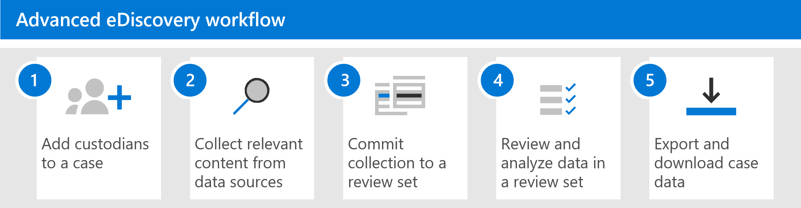

# Skapa och hantera ett Advanced eDiscovery ärendeCreate and manage an Advanced eDiscovery case

När du Advanced eDiscovery och tilldelar behörigheter till [eDiscovery-hanterare](get-started-with-advanced-ediscovery.md#step-2-assign-ediscovery-permissions) i organisationen som hanterar ärenden är nästa steg att skapa och hantera ett ärende.After setting up Advanced eDiscovery and [assigning permissions to eDiscovery managers](get-started-with-advanced-ediscovery.md#step-2-assign-ediscovery-permissions) in your organization that will manage cases, the next step is to create and manage a case.

Den här artikeln innehåller också en översikt över hur ärenden kan hanteras Advanced eDiscovery ett juridiskt ärende eller andra typer av undersökningar.This article also provides a high-level overview of using cases to manage the Advanced eDiscovery workflow for a legal case or other types of investigations.

## Skapa ett ärendeCreate a case

Så här skapar du ett ärende och lägger till medlemmar.Complete the following steps to create a case and add members. Den användare som skapar ärendet läggs automatiskt till som medlem.The user who creates the case is automatically added as a member. Medlemmar i ärendet kan komma åt ärendet i Microsoft 365 och utföra Advanced eDiscovery uppgifter.Members of the case can access the case in the Microsoft 365 compliance center and perform Advanced eDiscovery tasks.

1. Gå till <https://compliance.microsoft.com> och logga in med autentiseringsuppgifterna för användarkontot som har tilldelats eDiscovery-behörigheter.Go to <https://compliance.microsoft.com> and sign in using the credentials for user account that has been assigned eDiscovery permissions. Medlemmar i rollgruppen Organisationshantering kan också skapa Advanced eDiscovery ärenden.Members of the Organization Management role group can also create Advanced eDiscovery cases.

2. I det vänstra navigeringsfönstret i Microsoft 365 kompatibilitetscenter klickar du på **Visa alla** och sedan på **eDiscovery > Advanced**.In the left navigation pane of the Microsoft 365 compliance center, click **Show all**, and then click **eDiscovery > Advanced**.

3. På **Advanced eDiscovery** klickar du på **fliken Ärenden** och sedan på Skapa ett **ärende.**On the **Advanced eDiscovery** page, click the **Cases** tab, and then click **Create a case**.

4. På den **utfällbara sidan Nytt eDiscovery-ärende** ger du ärendet ett namn (obligatoriskt) och skriver ett alternativt ärendenummer och en beskrivning.On the **New eDiscovery case** flyout page, give the case a name (required), and then type an optional case number and description. Namnet på ärendet måste vara unikt inom organisationen.The case name must be unique in your organization.

5. Klicka **på Spara** för att skapa ärendet.Click **Save** to create the case.

   Det nya ärendet skapas och **Inställningar** i det nya ärendet visas.The new case is created and the **Settings** tab in the new case is displayed.

6. Klicka på & på fliken **Inställningar** behörighet **i** **Access.**In the **Access & permissions** tile on the **Settings** tab, click **Select**.

7. På sidan **Hantera detta ärende,** under Hantera **medlemmar, klickar du på** Lägg till **för** att lägga till medlemmar i ärendet.On the **Manage this case** flyout page, under **Manage members**, click **Add** to add members to the case.

8. I listan över personer markerar du kryssrutan bredvid namnen på de personer som du vill lägga till i ärendet.In the list of people, select the check box next to the names of the people that you want to add to the case. Som tidigare förklarats bör du se till att de personer som du lägger till i ärendet har tilldelats rätt eDiscovery-behörigheter.As previously explained, be sure that the people you add to the case have been assigned the appropriate eDiscovery permissions.

9. När du har valt de personer som ska läggas till som medlemmar i ärendet klickar du på Lägg **till**.After you've selected the people to add as members of the case, click **Add**.

10. Klicka på **Spara på sidan Hantera** det här ärendet för **att** spara den nya listan med ärendemedlemmar.In the **Manage this case** flyout page, click **Save** to save the new list of case members.

11. Klicka på **fliken** Start för att gå till startsidan för ärendet.Click the **Home** tab to go to the case home page.

## Hantera arbetsflödetManage the workflow

Här är ett enkelt arbetsflöde som Advanced eDiscovery för att komma igång med att använda [eDiscovery-metoder.](advanced-ediscovery-edrm.md)To get you started using Advanced eDiscovery, here's a basic workflow that aligns with [common eDiscovery practices](advanced-ediscovery-edrm.md). I vart och ett av de här stegen kommer vi också att belysa Advanced eDiscovery funktioner som du kan utforska.In each of these steps, we'll also highlight some extended Advanced eDiscovery functionality that you can explore.

1. **[Lägg till](add-custodians-to-case.md) andrekterare och [icke-tilläggsdatakällor](non-custodial-data-sources.md) i ärendet.****[Add custodians](add-custodians-to-case.md) and [non-custodial data sources](non-custodial-data-sources.md) to the case**. När ett ärende har skapats är det första steget att lägga till målsare.The first step after creating a case is to add custodians. En *vårdnadshavare är* en person som har administrativ kontroll över ett dokument eller en elektronisk fil som kan vara relevant för ärendet.A *custodian* is a person having administrative control of a document or electronic file that may be relevant to the case. Du kan dessutom lägga till datakällor som inte är kopplade till en viss användare men som kan vara relevanta för ärendet.Additionally, you can add data sources that aren't associated with a specific user but may be relevant to the case.

   Här är några saker som händer (eller som du kan göra) när du lägger till vårdnadshavare i ett ärende:Here are some things that happen (or that you can do) when you add custodians to a case:

   - Data i den andres Exchange-postlåda, OneDrive-konto och alla Microsoft Teams- eller Yammer-grupper som den insikande medlemmen är medlem i kan "markeras" som följddata i det aktuella fallet.Data in the custodian's Exchange mailbox, OneDrive account, and any Microsoft Teams or Yammer groups that the custodian is a member of can be "marked" as custodial data in the case.
  
   - Omindexerade data (genom en process som kallas *Avancerad indexering).*Custodian data is reindexed (by a process called *Advanced indexing*). Det gör det lättare att söka efter den i nästa steg.This helps optimize searching for it in the next step.
  
   - Du kan lägga ett förvaringsarknr på data i samma anda.You can place a hold on custodian data. Då bevaras data som kan vara relevanta för ärendet under undersökningen.This preserves data that may be relevant to the case during the investigation.
  
   - Du kan koppla andra datakällor till en användare (du kan t.ex. associera en SharePoint-webbplats eller Microsoft 365-grupp med en vårdnadshavare) så att dessa data kan indexeras om, placeras i förvaring och sökas, precis som data i den postlådan eller i OneDrive-kontot.You can associate other data sources with a custodian (for example, you can associate a SharePoint site or Microsoft 365 Group with a custodian) so this data can be reindexed, placed on hold, and searched, just like the data in the custodian's mailbox or OneDrive account.

   - Du kan använda [arbetsflödet för kommunikation](managing-custodian-communications.md) i Advanced eDiscovery skicka ett meddelande om juridiskt förvaring till dokumenterare.You can use the [communications workflow](managing-custodian-communications.md) in Advanced eDiscovery to send a legal hold notification to custodians.

2. **[Samla in relevant innehåll från datakällor.](create-draft-collection.md)****[Collect relevant content from data sources](create-draft-collection.md)**. När du har lagt till inbyggda datakällor och icke-förfallna datakällor i ett ärende kan du använda det inbyggda samlingsverktyget för att söka i dessa datakällor efter innehåll som kan vara relevant för ärendet.After you add custodians and non-custodial data sources to a case, use the built-in collections tool to search these data sources for content that may be relevant to the case. Du använder nyckelord, egenskaper  och villkor för att skapa sökfrågor som returnerar sökresultat med de data som troligen är relevanta för ärendet.You use keywords, properties, and conditions to [build search queries](building-search-queries.md) that return search results with the data that's most likely relevant to the case. Du kan också:You can also:

   - Visa [samlingsstatistik](collection-statistics-reports.md) som kan hjälpa dig att förfina resultatet i en samling.View [collection statistics](collection-statistics-reports.md) that may help you refine a collection to narrow the results.

   - Förhandsgranska ett urval av samlingen för att snabbt kontrollera om relevanta data hittas.Preview a sample of the collection to quickly verify whether the relevant data is being found.

   - Ändra en fråga och kör samlingen igen.Revise a query and rerun the collection.

3. **[Spara samlingen i en granskningsuppsättning](commit-draft-collection.md)**.**[Commit collection to a review set](commit-draft-collection.md)**. När du har konfigurerat och verifierat att en sökning returnerar önskade data är nästa steg att lägga till sökresultatet i en granskningsuppsättning.Once you've configured and verified that a search returns the desired data, the next step is to add the search results to a review set. När du lägger till data i en granskningsuppsättning kopieras objekt från den ursprungliga platsen till en säker Azure Storage plats.When you add data to a review set, items are copied from their original location to a secure Azure Storage location. Data indexeras om igen för att optimera dem för genomgående och snabba sökningar vid granskning och analys av objekt i granskningsuppsättningen.The data is reindexed again to optimize it for thorough and fast searches when reviewing and analyzing items in the review set. Du kan också lägga till [icke-Office 365 data i en granskningsuppsättning](load-non-office-365-data-into-a-review-set.md).Additionally, you can also [add non-Office 365 data into a review set](load-non-office-365-data-into-a-review-set.md).

   Det finns även en särskild typ av granskningsuppsättning som du kan lägga till data i, en så kallad uppsättning *för konversationsgranskning.*There's also a special kind of review set that you can add data to, called a *conversation review set*. De här typerna av granskningsuppsättningar ger möjlighet att återskapa, granska och exportera trådade konversationer som de i Microsoft Teams.These types of reviews sets provide conversation reconstruction capabilities to reconstruct, review, and export threaded conversations like those in Microsoft Teams. Mer information finns i Granska [konversationer i Advanced eDiscovery](conversation-review-sets.md).For more information, see [Review conversations in Advanced eDiscovery](conversation-review-sets.md).

4. **Granska och analysera data i en granskningsuppsättning**.**Review and analyze data in a review set**. Nu när data finns i en granskningsuppsättning kan du använda en mängd olika verktyg och funktioner för att visa och analysera ärendedata med målet att minska datauppsättningen till det som är mest relevant för det ärende du undersöker.Now that data is in a review set, you can use a wide-variety of tools and capabilities to view and analyze the case data with the goal of reducing the data set to what is most relevant to the case you're investigating. Här är en lista över några verktyg och funktioner som du kan använda i den här processen.Here's a list of some tools and capabilities that you can use during this process.

   - [Visa dokument](view-documents-in-review-set.md).[View documents](view-documents-in-review-set.md). Det omfattar att visa metadata för varje dokument i en granskningsuppsättning och visa dokumentet i dess ursprungliga version eller textversion.This includes viewing the metadata for each document in a review set, and viewing the document in its native version or text version.

   - [Skapa frågor och filter.](review-set-search.md)[Create queries and filters](review-set-search.md). Du skapar sökfrågor med hjälp av olika sökvillkor (som möjligheten att söka i alla metadataegenskaper för [filer)](document-metadata-fields-in-advanced-ediscovery.md)för att ytterligare förfina och finjustera ärendedata till det som är mest relevant för ärendet.You create search queries using various search criteria (including the ability to search all [file metadata properties](document-metadata-fields-in-advanced-ediscovery.md)) to further refine and cull the case data to what is most relevant to the case. Du kan också använda filter för att snabbt tillämpa andra villkor på resultatet av en sökfråga för att ytterligare förfina resultaten.You can also use review set filters to quickly apply other conditions to the results of a search query to further refine those results. 

   - [Skapa och använda taggar](tagging-documents.md).[Create and use tags](tagging-documents.md). Du kan använda taggar för dokument i en granskningsuppsättning för att identifiera vilka som svarar på ärendet (eller inte svarar på ärendet) och sedan använda de taggarna när du skapar sökfrågor för att inkludera eller exkludera de taggade dokumenten.You can apply tags to documents in a review set to identify which are responsive (or non-responsive to the case) and then use those tags when creating search queries to include or exclude the tagged documents. Du kan även tagga för att avgöra vilka dokument som ska exporteras.You can also tagging to determine which documents to export.

   - [Kommentera och göra om dokument](view-documents-in-review-set.md#annotate-view).[Annotate and redact documents](view-documents-in-review-set.md#annotate-view). Du kan använda anteckningsverktyget i en granskning för att kommentera dokument och ändra om innehåll i dokument som arbetsprodukt.You can use the annotation tool in a review to annotate documents and redact content in documents as work product. Vi genererar en PDF-version av ett kommenterat eller omdreakterat dokument under granskning för att minska risken för att exportera den odokumenterade inbyggda versionen av dokumentet.We generate a PDF version of an annotated or redacted document during review to reduce the risk of exporting the unredacted native version of the document.

   - [Analysera falldata](analyzing-data-in-review-set.md).[Analyze case data](analyzing-data-in-review-set.md). Analysfunktionerna i Advanced eDiscovery är kraftfulla.The analytics functionality in Advanced eDiscovery is powerful. När du har kört analyser på data i granskningsuppsättningen utför vi analyser, till exempel nästan dubblettidentifiering, e-posttrådning och teman, som kan minska volymen för dokument som du måste granska.After you run analytics on the data in review set, we perform analysis such as near duplicate detection, email threading, and themes that can help reduce the volume of documents that you have to review. Vi genererar även en analysrapporter som sammanfattar resultatet av att köra analyser.We also generate an Analytics reports that summarize the result of running analytics. Som tidigare förklarats körs även modellen för identifiering av [juristklienter för analys.](attorney-privilege-detection.md#use-the-attorney-client-privilege-detection-model)As previously explained, running analytics also runs [the attorney-client privilege detection model](attorney-privilege-detection.md#use-the-attorney-client-privilege-detection-model).

5. **Exportera och ladda ned ärendedata**.**Export and download case data**. Ett sista steg efter att ha samlat in, granskat och analyserat ärendedata är att exportera dem från Advanced eDiscovery för extern granskning eller för granskning av personer utanför undersökningsteamet.A final step after collecting, reviewing, and analyzing case data is to export it out of Advanced eDiscovery for external review or for review by people outside of the investigation team. Att exportera data är en process i två steg.Exporting data is a two-step process. Det första steget är [att](export-documents-from-review-set.md) exportera data från granskningsuppsättningen och kopiera dem till en annan Azure Storage plats (en som tillhandahålls av Microsoft eller en som hanteras av din organisation).The first step is to [export](export-documents-from-review-set.md) data out of the review set and copy it to a different Azure Storage location (one provided by Microsoft or one managed by your organization). Sedan använder du Azure Storage Explorer för [att ladda](download-export-jobs.md) ned data till en lokal dator.Then you use Azure Storage Explorer to [download](download-export-jobs.md) the data to a local computer. Förutom de exporterade datafilerna innehåller innehåller exportpaketet även en exportrapport, en sammanfattningsrapport och en felrapport.In addition to the exported data files, the contains of the export package also contains an export report, a summary report, and an error report.

## Advanced eDiscovery arkitekturAdvanced eDiscovery architecture

Här är ett arkitekturdiagram som visar hela Advanced eDiscovery-arbetsflödet i en enda geomiljö och i en geomiljö, och det end-to-end-dataflöde som överensstämmer med [Electronic Discovery Reference Model.](overview-ediscovery-20.md#advanced-ediscovery-alignment-with-the-electronic-discovery-reference-model)Here's an architecture diagram that shows the Advanced eDiscovery end-to-end workflow in a single-geo environment and in a multi-geo environment, and the end-to-end data flow that's aligned with the [Electronic Discovery Reference Model](overview-ediscovery-20.md#advanced-ediscovery-alignment-with-the-electronic-discovery-reference-model).

[Visa som en bildView as an image](../media/solutions-architecture-center/m365-advanced-ediscovery-architecture.png)

[Ladda ned som PDF-filDownload as a PDF file](https://download.microsoft.com/download/d/1/c/d1ce536d-9bcf-4d31-b75b-fcf0dc560665/m365-advanced-ediscovery-architecture.pdf)

[Ladda ned som Visio filDownload as a Visio file](https://download.microsoft.com/download/d/1/c/d1ce536d-9bcf-4d31-b75b-fcf0dc560665/m365-advanced-ediscovery-architecture.vsdx)
