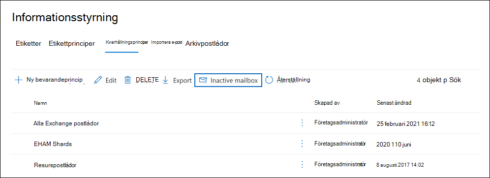
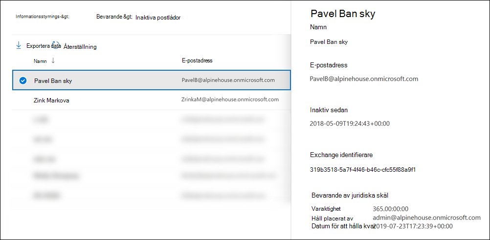

# <a name="create-and-manage-inactive-mailboxes"></a>Skapa och hantera inaktiva postlådor

Microsoft 365 det möjligt att behålla innehållet i borttagna postlådor. Den här funktionen kallas [inaktiva postlådor.](inactive-mailboxes-in-office-365.md) Med inaktiva postlådor kan du behålla tidigare anställdas e-post när de har lämnar organisationen. En postlåda blir inaktiv när bevarande av juridiska skäl eller en bevarandeprincip (skapas i säkerhets- och efterlevnadscentret i Office 365 eller Microsoft 365) tillämpas på postlådan innan motsvarande användarkonto tas bort. Innehållet i en inaktiv postlåda behålls under det kvarhållna antalet som gjordes för postlådan innan den gjordes inaktiv. På så sätt kan administratörer, efterlevnadsansvariga och hanterare av arkivhandlingar använda innehållssökning för att söka efter och exportera innehåll i en inaktiv postlåda. Inaktiva postlådor kan inte ta emot e-post och visas inte i organisationens delade adressbok och andra listor.
  
> [!IMPORTANT]
> Medan vi fortsätter att investera på olika sätt för att bevara postlådeinnehållet presenterar vi att innehållet i In-Place Holds har Exchange i administrationscentret. Det innebär att du bör använda principer för kvarhållning av juridiska skäl och bevarandeprinciper för att skapa en inaktiv postlåda. Från och med den 1 juli 2020 kan du inte skapa nya In-Place i Exchange Online. Men du kan fortfarande ändra varaktigheten för ett aktivt In-Place som gjorts på en inaktiv postlåda. Men med början den 1 oktober 2020 kan du inte ändra varaktigheten för varaktigheten. Du kan bara ta bort en inaktiv postlåda genom att ta bort In-Place inaktiv. Befintliga inaktiva postlådor som finns på In-Place behålls fortfarande tills brytningen tas bort. Mer information om hur du tar In-Place [eDiscovery-verktyg finns i Slutet av äldre eDiscovery-verktyg.](legacy-ediscovery-retirement.md)
  
## <a name="preparations-before-creating-an-inactive-mailbox"></a>Förberedelser innan en inaktiv postlåda skapas

- För att göra en postlåda inaktiv måste den tilldelas en licens för Exchange Online abonnemang 2 så att bevarande av juridiska skäl eller en bevarandeprincip kan tillämpas på postlådan innan den tas bort. Exchange Online Abonnemang 2-licenser ingår i ett abonnemang Office 365 Enterprise E3 och E5. Om en postlåda har tilldelats en Exchange Online abonnemang 1- eller Exchange Online – kiosk-licens (som är en del av en Office 365 E1- respektive F1-prenumeration), måste du tilldela den en separat Exchange Online - arkivering-licens så att ett sådant tillstånd kan tillämpas på postlådan innan den tas bort. Mer information finns i [Exchange Online - arkivering](https://go.microsoft.com/fwlink/p/?LinkId=286153).

- De licenser som är kopplade till den Exchange Online postlådan blir tillgängliga när du tar bort motsvarande användarkonto. Du kan sedan [tilldela licenserna till en annan användare.](../admin/manage/assign-licenses-to-users.md)

- Om en bevarandeprincip för bevarande av juridiska skäl eller en bevarandeprincip (som är konfigurerad för att behålla eller behålla och sedan ta bort innehåll) inte tillämpas på en postlåda innan den tas bort, behålls eller kan inte innehållet i postlådan upptäckas. Men den borttagna postlådan kan återställas inom 30 dagar efter borttagningen, men postlådan och dess innehåll kommer att tas bort permanent efter 30 dagar om den inte kan återställas.

- Mer information om bevarande av juridiska skäl finns i Bevarande [av juridiska skäl.](/exchange/security-and-compliance/in-place-and-litigation-holds) Mer information om bevarandeprinciper finns i Läs [mer om bevarandeprinciper och bevarandeetiketter.](retention.md)
  
## <a name="create-an-inactive-mailbox"></a>Skapa en inaktiv postlåda

Att göra en postlåda inaktiv innebär två steg: 1) placera postlådan i Bevarande av juridiska skäl eller tillämpa en bevarandeprincip på den och 2) ta bort postlådan eller motsvarande användarkonto. När postlådan är inaktiv behålls innehållet tills bevarande- eller bevarandeprincipen tas bort.
  
### <a name="step-1-place-a-mailbox-on-litigation-hold-or-apply-a-retention-policy"></a>Steg 1: Placera en postlåda i Bevarande av juridiska skäl eller tillämpa en bevarandeprincip

Om du placerar en postlåda i Bevarande av juridiska skäl eller tillämpar en bevarandeprincip (som är konfigurerad för att behålla eller behålla och sedan ta bort innehåll) bevaras innehållet i postlådan innan den tas bort. Båda typerna av innehåll behålls allt innehåll i postlådan, inklusive borttagna objekt och ursprungliga versioner av ändrade objekt. Borttagna och ändrade objekt behålls i den inaktiva postlådan under en angiven tidsperiod eller tills du tar bort den inaktiva postlådan permanent genom att ta bort den bevarande- eller kvarhållningsprincip som används för den inaktiva postlådan.
  
Om ett bevarande redan har placerats i en postlåda, eller om en bevarandeprincip redan används för en postlåda, är allt du behöver göra att ta bort motsvarande användarkonto, så som beskrivs i steg 2.
  
Stegvisa instruktioner för hur du placerar en postlåda i bevarande av juridiska skäl eller tillämpar en bevarandeprincip finns i:
  
- [Placera en postlåda i Bevarande av juridiska skäl](create-a-litigation-hold.md)

- [Läs mer om bevarandeprinciper och bevarandeetiketter](retention.md)

> [!NOTE]
> För principer för kvarhållning av juridiska skäl kan du skapa ett obegränsat bevarande eller ett tidsbaserat bevarande. När ett obegränsat antal sparas innehållet i den inaktiva postlådan i all evighet, eller tills du tar bort det eller tills varaktigheten för varaktigheten ändras. När bevarande- eller bevarandeprincipen har tagits bort (förutsatt att postlådan togs bort för mer än 183 dagar sedan) markeras den inaktiva postlådan för permanent borttagning och innehållet i postlådan kommer inte längre att behållas eller upptäckas. I en tidsbaserad bevarandeprincip eller bevarandeprincip anger du varaktigheten för bevarandet. Varaktigheten beräknas per objekt och beräknas från det datum då ett postlådeobjekt togs emot eller skapades. När undantaget för ett postlådeobjekt upphör att gälla och objektet flyttas till eller finns i mappen Återställningsbara objekt i den inaktiva postlådan tas objektet bort permanent (rensas) från den inaktiva postlådan när bevarandeperioden för borttagna objekt löper ut. 
  
### <a name="step-2-delete-the-mailbox"></a>Steg 2: Ta bort postlådan

När postlådan är satt på bevarande eller en bevarandeprincip tillämpas på den är nästa steg att ta bort postlådan. Det bästa sättet att ta bort en postlåda är att ta bort motsvarande användarkonto Microsoft 365 administrationscentret. Information om hur du tar bort användarkonton finns [i Ta bort en användare från organisationen.](../admin/add-users/delete-a-user.md)
  
> [!NOTE]
> Du kan också ta bort postlådan med hjälp av **cmdleten Remove-Mailbox** Exchange Online PowerShell. Mer information finns i Ta [bort eller återställa användarpostlådor i Exchange Online](/exchange/recipients-in-exchange-online/delete-or-restore-mailboxes). 
  
## <a name="view-a-list-of-inactive-mailboxes"></a>Visa en lista över inaktiva postlådor

Så här visar du en lista över inaktiva postlådor i organisationen:

1. Gå till <https://compliance.microsoft.com> och logga in med autentiseringsuppgifterna för ett administratörskonto i din organisation.

2. I det vänstra navigeringsfönstret i Microsoft 365 kompatibilitetscenter klickar du på Visa **alla** och sedan på **Informationsstyrning > Bevarande.**

   

3. På sidan **Bevarande** klickar du på **Inaktiv postlåda för** att visa en lista över inaktiva postlådor.

4. Välj en inaktiv postlåda om du vill visa en utfällsida med information om den inaktiva postlådan.

     

Du kan klicka på Exportera sökresultatikonen Exportera för att visa eller ladda ned en CSV-fil som innehåller ytterligare information om   inaktiva postlådor i organisationen.

Alternativt kan du köra följande kommando i Exchange Online PowerShell för att visa listan över inaktiva postlådor.

```powershell
 Get-Mailbox -InactiveMailboxOnly | FT DisplayName,PrimarySMTPAddress,WhenSoftDeleted
```

Du kan också köra följande kommando för att exportera listan över inaktiva postlådor och annan information till en CSV-fil. I det här exemplet skapas CSV-filen i den aktuella katalogen.

```powershell
Get-Mailbox -InactiveMailboxOnly | Select Displayname,PrimarySMTPAddress,DistinguishedName,ExchangeGuid,WhenSoftDeleted | Export-Csv InactiveMailboxes.csv -NoType
```

> [!NOTE]
> Det är möjligt att en inaktiv postlåda kan ha samma SMTP-adress som en aktiv användarpostlåda. I det här fallet kan värdet för **egenskapen DistinguishedName** eller **ExchangeGuid** användas för att unikt identifiera en inaktiv postlåda.
  
## <a name="search-and-export-the-contents-of-an-inactive-mailbox"></a>Söka efter och exportera innehållet i en inaktiv postlåda

Du kan komma åt innehållet i den inaktiva postlådan med hjälp av verktyget Innehållssökning i säkerhets- & kompatibilitetscentret. När du söker i en inaktiv postlåda kan du skapa en nyckelordssökningsfråga för att söka efter specifika objekt eller returnera hela innehållet i den inaktiva postlådan. Du kan förhandsgranska sökresultatet eller exportera sökresultatet till en PST-Outlook (Data) eller som enskilda e-postmeddelanden. Stegvisa instruktioner för att söka efter postlådor och exportera sökresultat finns i följande avsnitt:
  
- [Innehållssökning](content-search.md)

- [Exportera sökresultat](export-search-results.md)

Här är några saker att tänka på när du söker i inaktiva postlådor.
  
- Om en innehållssökning inkluderar en användarpostlåda och postlådan görs inaktiv fortsätter innehållssökningen att söka i den inaktiva postlådan när du kör sökningen igen efter att den blivit inaktiv.

- I vissa fall kan en användare ha en aktiv postlåda och en inaktiv postlåda med samma SMTP-adress. I det här fallet söks endast den specifika postlåda som du väljer som plats för en innehållssökning igenom. Med andra ord, om du lägger till en användares postlåda i en sökning kan du inte förutsätta att både deras aktiva och inaktiva postlådor genomsöks. Endast postlådan som du uttryckligen lägger till i sökningen genomsöks.

- Vi rekommenderar starkt att du undviker att ha en aktiv postlåda och inaktiv postlåda med samma SMTP-adress. Om du behöver återanvända den SMTP-adress som för närvarande är tilldelad till en inaktiv postlåda rekommenderar vi att du återställer den inaktiva postlådan eller återställer innehållet i en inaktiv postlåda till en aktiv postlåda (eller arkivet för en aktiv postlåda) och sedan tar bort den inaktiva postlådan.

## <a name="change-the-hold-duration-for-an-inactive-mailbox"></a>Ändra kvarhållningstiden för en inaktiv postlåda

När en postlåda har gjorts inaktiv kan du ändra varaktigheten för bevarandet eller bevarandeprincipen som används för den inaktiva postlådan. Stegvisa instruktioner finns i Ändra [varaktigheten för varaktigheten för en inaktiv postlåda i Office 365](change-the-hold-duration-for-an-inactive-mailbox.md).
  
## <a name="recover-an-inactive-mailbox"></a>Återställa en inaktiv postlåda

Om en tidigare anställd återgår till organisationen, eller om en ny anställd anställs för att ta på sig arbetsansvaret för den avs avlidna medarbetaren, kan du återställa innehållet i den inaktiva postlådan. När du återställer en inaktiv postlåda konverteras postlådan till en ny postlåda, innehållet och mappstrukturen för den inaktiva postlådan behålls och postlådan länkas till ett nytt användarkonto. När den har återställts finns den inaktiva postlådan inte längre. Stegvisa instruktioner och mer information om hur du återställer en inaktiv postlåda finns i Återställa en [inaktiv postlåda i Office 365.](recover-an-inactive-mailbox.md)
  
## <a name="restore-the-contents-of-an-inactive-mailbox-to-another-mailbox"></a>Återställa innehållet i en inaktiv postlåda till en annan postlåda

Om en annan anställd tar på sig arbetsansvaret som en tidigare anställd har, eller om någon annan behöver åtkomst till innehållet i den inaktiva postlådan, kan du återställa (eller sammanfoga) innehållet i den inaktiva postlådan till en befintlig postlåda. När du återställer en inaktiv postlåda kopieras innehållet till en annan postlåda. Den inaktiva postlådan behålls och förblir en inaktiv postlåda. Du kan fortfarande söka i den inaktiva postlådan med hjälp av eDiscovery, innehållet kan återställas till en annan postlåda eller återställas eller tas bort senare. Stegvisa instruktioner finns i Återställa en [inaktiv postlåda i Office 365](restore-an-inactive-mailbox.md).
  
## <a name="delete-an-inactive-mailbox"></a>Ta bort en inaktiv postlåda

Om du inte längre behöver behålla innehållet i en inaktiv postlåda kan du ta bort den inaktiva postlådan permanent genom att ta bort bevarandet eller ta bort bevarandeprincipen för den inaktiva postlådan. Postlådan behålls i 183 dagar efter att du har tagit bort bevarande- eller bevarandeprincipen. Efter 183 dagar markeras postlådan för permanent borttagning och postlådan blir inte återställningsbar. Om den inaktiva postlådan har tagits bort under de senaste 183 dagarna kan du fortfarande återställa den. Stegvisa instruktioner för att ta bort en bevarandeprincip eller en bevarandeprincip för att ta bort en inaktiv postlåda permanent finns i Ta bort [en inaktiv postlåda.](delete-an-inactive-mailbox.md)
