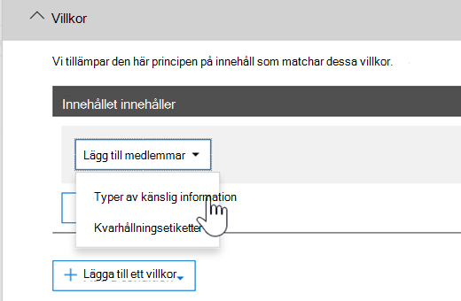

# <a name="create-custom-sensitive-information-types-with-exact-data-match-based-classification"></a>Skapa anpassade typer av känslig information med Exact Data Match-baserad klassificering


[Anpassade typer av känslig information](sensitive-information-type-learn-about.md) används för att identifiera känsliga objekt och förhindra att du delar dem oavsiktligt eller på ett olämpligt sätt. Du definierar en anpassad typ av känslig information (SIT) baserat på:

- mönster
- nyckelordsbevis som *anställd*, *märke* eller *ID*
- teckennärhet till bevis i ett visst mönster
- konfidensnivåer

 Dessa anpassade typer av känslig information uppfyller behoven i många organisationer.

Men hur gör du om du vill ha en anpassad typ av känslig information (SIT) som använder exakta datavärden i stället för att hitta matchningar utifrån allmänna mönster? Med en Exact Data Match-baserad klassificering (EDM) kan du skapa en anpassad typ av känslig information som är utformad för att:

- vara dynamisk och enkel att uppdatera
- vara mer skalbar
- ge färre falska positiva resultat
- arbeta med strukturerade känsliga data
- hantera känslig information på ett säkrare sätt
- användas med flera Microsoft-molntjänster


Med en EDM-baserad klassificering kan du skapa anpassade typer av känslig information som refererar till exakta värden i en databas med känslig information. Databasen kan uppdateras varje dag och innehålla upp till 100 miljoner rader med data. När anställda, patienter eller kunder kommer och går och poster ändras förblir de anpassade typerna av känslig information aktuella och tillämpliga. Och du kan använda EDM-baserad klassificering med principer, till exempel [principer för dataförlustskydd](dlp-learn-about-dlp.md) eller [Microsoft Cloud App Security-filprinciper](/cloud-app-security/data-protection-policies).

> [!NOTE]
> Microsoft 365 Informationsskydd har stöd för språk med dubbla byte-teckenuppsättning för:
> - Kinesiska (förenklad)
> - Kinesiska (traditionell)
> - Koreanska
> - Japanska
> 
> Stödet är tillgängligt för typer av känslig information. Se [Viktig information gällande stöd i Information Protection för teckenuppsättningar med dubbla byte (förhandsversion)](mip-dbcs-relnotes.md) för mer information.


## <a name="required-licenses-and-permissions"></a>Obligatoriska licenser och behörigheter

Du måste vara global administratör, efterlevnadsadministratör eller Exchange Online-administratör för att utföra de uppgifter som beskrivs i den här artikeln. Läs mer om DLP-behörigheter i [Behörigheter](data-loss-prevention-policies.md#permissions).

EDM-baserad klassificering ingår i dessa prenumerationer

- Office 365 E5
- Microsoft 365 E5
- Microsoft 365 E5 Compliance
- Microsoft E5/A5 Information Protection och styrning

## <a name="portal-links-for-your-subscription"></a>Portallänkar för prenumerationen


|Portal  |World Wide/GCC  |GCC-High  |DOD  |
|---------|---------|---------|---------|
|Office SCC     |  protection.office.com       |scc.office365.us         |scc.protection.apps.mil |
|Microsoft 365 Säkerhetscenter     |security.microsoft.com         |security.microsoft.us         |security.apps.mil|
|Microsoft 365 Efterlevnadscenter     |compliance.microsoft.com         |compliance.microsoft.us         |compliance.apps.mil|


## <a name="the-work-flow-at-a-glance"></a>Överblick över arbetsflödet

|Fas  |Det här behövs  |
|---------|---------|
|[Del 1: Konfigurera EDM-baserad klassificering](#part-1-set-up-edm-based-classification)<br/><br/>(vid behov)<br/>- [Redigera databasschemat](#editing-the-schema-for-edm-based-classification) <br/>- [Ta bort schemat](#removing-the-schema-for-edm-based-classification) |- Läsåtkomst till känsliga data<br/>- Databasschema i XML-format (exempel tillhandahålls)<br/>- Regelpaket i XML-format (exempel tillhandahålls)<br/>- Administratörsbehörigheter till Säkerhets- och efterlevnadscenter (med PowerShell) |
|[Del 2: Hasha och ladda upp känsliga data](#part-2-hash-and-upload-the-sensitive-data)<br/><br/>(vid behov)<br/>[Uppdatera data](#refreshing-your-sensitive-information-database) |- Anpassad säkerhetsgrupp och användarkonto<br/>- Lokal administratörsåtkomst till datorn med EDM-uppladdningsagenten<br/>- Läsåtkomst till känsliga data<br/>- Process och schema för uppdatering av data|
|[Del 3: Använda EDM-baserad klassificering med dina Microsoft-molntjänster](#part-3-use-edm-based-classification-with-your-microsoft-cloud-services) |- Microsoft 365-prenumeration med DLP<br/>- Aktiverad funktion för EDM-baserad klassificering |

### <a name="part-1-set-up-edm-based-classification"></a>Del 1: Konfigurera EDM-baserad klassificering

I konfigurationen av EDM-baserad klassificering ingår att:

1. [Spara känsliga data i .csv eller .tsv-format](#save-sensitive-data-in-csv-or-tsv-format)
2. [Definiera ett databasschema för känslig information](#define-the-schema-for-your-database-of-sensitive-information)
3. [Skapa ett regelpaket](#set-up-a-rule-package)


#### <a name="save-sensitive-data-in-csv-or-tsv-format"></a>Spara känsliga data i .csv eller .tsv-format

1. Identifiera den känsliga information du vill använda. Exportera data till ett program, till exempel Microsoft Excel, och spara filen i en textfil. Filen kan sparas i .csv (kommaavgränsade värden), .tsv (tabbavgränsade värden) eller pipe-avgränsade (|) format. TSV-formatet rekommenderas i fall där datavärdena kan innehålla kommatecken, till exempel gatuadresser.
Datafilen kan innehålla högst:
      - 100 miljoner rader med känsliga data
      - 32 kolumner (fält) per datakälla
      - 5 kolumner (fält) markerade som sökbara

2. Strukturera känsliga data i .csv- eller .tsv-filen så att den första raden innehåller namnen på de fält som används för EDM-baserad klassificering. I filen kan du ha fältnamn som "ssn", "födelsedatum", "förnamn", "efternamn". Kolumnrubriknamn får inte innehålla blanksteg eller understreck. Exempelfilen i CSV-format som vi använder i den här artikeln heter till exempel *PatientRecords.csv*, och innehåller kolumnerna *PatientID*, *MRN*, *LastName*, *FirstName*, *SSN* med flera.

3. Var uppmärksam på formatet för fälten med känsliga data. I synnerhet fält som kan innehålla kommatecken i innehållet, t.ex. en gatuadress som innehåller värdet "Seattle,WA" kommer att tolkas som två separata fält om det .csv format väljs. Du kan undvika detta genom att använda .tsv-formatet eller omgivet av kommatecken som innehåller värden med dubbla citattecken i tabellen över känsliga data. Om kommatecken som innehåller värden också innehåller blanksteg, måste du skapa en anpassad SIT som matchar motsvarande format. Till exempel en SIT som identifierar flera ordsträngar med kommatecken och blanksteg.

#### <a name="define-the-schema-for-your-database-of-sensitive-information"></a>Definiera schemat för databasen med känslig information

Om du av affärsmässiga eller tekniska skäl inte vill använda PowerShell eller kommandoraden för att skapa ditt schema och mönster för EDM-baserade typer av känslig information (regelpaket) kan du skapa dem med [guiden för Exact Data Match-schema och typ av känslig information](sit-edm-wizard.md). När du är klar med att skapa schemat och mönstret för den EDM-baserade typen av känslig information går du tillbaka och slutför alla steg som behövs för att göra din EDM-baserade typ av känslig information tillgänglig för användning.

> [!NOTE]
> Guiden för Exact Data Match-schema och typ av känslig information är endast tillgänglig för molnen World Wide och GCC.

1. Definiera schemat för databasen med känslig information i XML-format (ungefär som i exemplet nedan). Ge schemafilen namnet **edm.xml** och konfigurera den så att det finns en rad med följande syntax för varje kolumn i databasen: 

      `\<Field name="" searchable=""/\>`.

      - Ange kolumnnamn som *fältnamnsvärde*.
      - Ange *searchable="true"* för de fält som du vill ska vara sökbara (högst fem fält). Minst ett fält måste vara sökbart.

      I följande exempel definierar XML-filen schemat för en databas för patientjournaler varav fem fält har angetts som sökbara: *PatientID*, *MRN*, *SSN*, *Phone* och *DOB*.

      (Du kan kopiera, ändra och använda vårt exempel.)

      ```xml
      <EdmSchema xmlns="http://schemas.microsoft.com/office/2018/edm">
            <DataStore name="PatientRecords" description="Schema for patient records" version="1">
                  <Field name="PatientID" searchable="true" caseInsensitive="true" ignoredDelimiters="-,/,*,#,^" />
                  <Field name="MRN" searchable="true" />
                  <Field name="FirstName" />
                  <Field name="LastName" />
                  <Field name="SSN" searchable="true" />
                  <Field name="Phone" searchable="true" />
                  <Field name="DOB" searchable="true" />
                  <Field name="Gender" />
                  <Field name="Address" />
            </DataStore>
      </EdmSchema>
      ```

##### <a name="configurable-match-using-the-caseinsensitive-and-ignoreddelimiters-fields"></a>Konfigurerbar matchning med fälten caseInsensitive och ignoredDelimiters

I XML-exemplet ovan används fälten `caseInsensitive` och `ignoredDelimiters`. 

När du tar med fältet ***caseInsensitive** _ inställt på värdet `true` i din schemadefinition exkluderar EDM inte objekt på grund av skillnader i skiftläge i fältet `PatientID`. EDM tolkar `PatientID` _ *FOO-1234** och **fOo-1234** som identiska.

Om du tar med fältet ***ignoredDelimiters** _ med tecken som stöds ignorerar EDM dessa tecken i `PatientID`. EDM tolkar `PatientID` _ *FOO-1234** och `PatientID` **FOO#1234** som identiska. Flaggan `ignoredDelimiters` stöder alla icke-alfanumeriska tecken. Här är några exempel:
- \.
- \-
- \/
- \_
- \*
- \^
- \#
- \!
- \?
- \[
- \]
- \{
- \}
- \\
- \~
- \; 

Flaggan `ignoredDelimiters` stöder inte:
- tecknen 0–9
- A–Z
- a–z
- \"
- \,

I det här exempel använder vi både `caseInsensitive` och `ignoredDelimiters` vilket innebär att EDM skulle se **FOO-1234** och **fOo#1234** som identiska och klassificera objektet som känslig information av typen patientjournal. 

4. Anslut till Säkerhets- och efterlevnadscenter med hjälp av metoderna i [Ansluta till Säkerhets- och efterlevnadscentret i PowerShell](/powershell/exchange/connect-to-scc-powershell).

5. Om du vill ladda upp databasschemat kör du följande cmdletar, en i taget:

      ```powershell
      $edmSchemaXml=Get-Content .\\edm.xml -Encoding Byte -ReadCount 0
      New-DlpEdmSchema -FileData $edmSchemaXml -Confirm:$true
      ```

      Du uppmanas att bekräfta på följande sätt:

      > Bekräfta
      >
      > Vill du utföra den här åtgärden?
      >
      > Det nya EDM-schemat för datalagret ”patientrecords” importeras.
      >
      > \[Y\] Yes (Ja) \[A\] Yes to All (Ja för alla) \[N\] No (Nej) \[L\] No to All (Nej för alla) \[?\] Help (Hjälp)  (standardinställningen är Y):

> [!TIP]
> Om du vill att ändringarna ska förekomma utan bekräftelse använder du den här cmdleten i stället i steg 5: New-DlpEdmSchema -FileData $edmSchemaXml

> [!NOTE]
> Det kan ta mellan 10–60 minuter att uppdatera EDMSchema med tillägg. Uppdateringen måste slutföras innan du utför de steg där tilläggen används.

#### <a name="set-up-a-rule-package"></a>Skapa ett regelpaket

1. Skapa ett regelpaket i XML-format (med Unicode-kodning), ungefär som i följande exempel. (Du kan kopiera, ändra och använda vårt exempel.)

      När du konfigurera ditt regelpaket ska du se till att referera till din .csv- eller .tsv-fil **ochedm.xml** filen. Du kan kopiera, ändra och använda vårt exempel. I det här XML-exemplet måste följande fält anpassas för att skapa en EDM-känslig typ:

      - **RulePack id och ExactMatch id**: Använd [New-GUID](/powershell/module/microsoft.powershell.utility/new-guid?view=powershell-6) för att generera ett GUID.

      - **Datastore**: Det här fältet anger vilket datalager för EDM-sökning som ska användas. Ange namnet på datakällan för ett konfigurerat EDM-schema.

      - **idMatch**: Det här fältet pekar på det primära elementet för EDM.
        - Matches: Anger vilket fält som ska användas i en exakt sökning. Ange ett sökbart fältnamn i EDM-schemat för DataStore.
        - Classification: Det här fältet anger den matchning av känslig typ som utlöser en EDM-sökning. Du kan ange namnet eller GUID för en befintlig inbyggd eller anpassad typ av känslig information. Observera att alla strängar som matchar den angivna typen av känslig information kommer att hashas och jämföras med varje post i tabellen med känslig information. För att det inte ska uppstå prestandaproblem bör du undvika att använda en typ som matchar en hög procent av innehållet (till exempel “alla siffror” eller “alla ord med fem bokstäver”) om du använder en anpassad typ av känslig information som klassificeringselement i EDM. Lägg i så fall till nyckelord eller inkludera formatering i definitionen av den anpassade typen av känslig information. 

      - **Match:** Det här fältet pekar på ytterligare bevis som hittats i närheten av idMatch.
        - Matches: Ange valfritt fältnamn i EDM-schemat för DataStore.
      - **Resource:** Det här avsnittet anger ett namn och en beskrivning för den känslig typen på flera språk.
        - idRef: Du anger GUID för ExactMatch ID.
        - Name och description: anpassa efter behov.

      ```xml
      <RulePackage xmlns="http://schemas.microsoft.com/office/2018/edm">
        <RulePack id="fd098e03-1796-41a5-8ab6-198c93c62b11">
          <Version build="0" major="2" minor="0" revision="0" />
          <Publisher id="eb553734-8306-44b4-9ad5-c388ad970528" />
          <Details defaultLangCode="en-us">
            <LocalizedDetails langcode="en-us">
              <PublisherName>IP DLP</PublisherName>
              <Name>Health Care EDM Rulepack</Name>
              <Description>This rule package contains the EDM sensitive type for health care sensitive types.</Description>
            </LocalizedDetails>
          </Details>
        </RulePack>
        <Rules>
          <ExactMatch id = "E1CC861E-3FE9-4A58-82DF-4BD259EAB371" patternsProximity = "300" dataStore ="PatientRecords" recommendedConfidence = "65" >
            <Pattern confidenceLevel="65">
              <idMatch matches = "SSN" classification = "U.S. Social Security Number (SSN)" />
            </Pattern>
            <Pattern confidenceLevel="75">
              <idMatch matches = "SSN" classification = "U.S. Social Security Number (SSN)" />
              <Any minMatches ="3" maxMatches ="6">
                <match matches="PatientID" />
                <match matches="MRN"/>
                <match matches="FirstName"/>
                <match matches="LastName"/>
                <match matches="Phone"/>
                <match matches="DOB"/>
              </Any>
            </Pattern>
          </ExactMatch>
          <LocalizedStrings>
            <Resource idRef="E1CC861E-3FE9-4A58-82DF-4BD259EAB371">
              <Name default="true" langcode="en-us">Patient SSN Exact Match.</Name>
              <Description default="true" langcode="en-us">EDM Sensitive type for detecting Patient SSN.</Description>
            </Resource>
          </LocalizedStrings>
        </Rules>
      </RulePackage>
      ```

2. Ladda upp regelpaketet genom att köra följande PowerShell-cmdletar, en i taget:

      ```powershell
      $rulepack=Get-Content .\\rulepack.xml -Encoding Byte -ReadCount 0
      New-DlpSensitiveInformationTypeRulePackage -FileData $rulepack
      ```

Nu har du ställt in en EDM-baserad klassificering. Nästa steg är att hasha känsliga data och sedan ladda upp hasharna för indexering.

Du kommer kanske ihåg att vi definierade fem fält som sökbara i PatientRecords-schemat i föregående procedur: *PatientID*, *MRN*, *SSN*, *Phone* och *DOB*. Vårt exempelregelpaket innehåller dessa fält och refererar till databasschemafilen (**edm.xml**), med ett *ExactMatch*-objekt per sökbart fält. Begrunda följande ExactMatch-objekt:

```xml
<ExactMatch id = "E1CC861E-3FE9-4A58-82DF-4BD259EAB371" patternsProximity = "300" dataStore ="PatientRecords" recommendedConfidence = "65" >
      <Pattern confidenceLevel="65">
        <idMatch matches = "SSN" classification = "U.S. Social Security Number (SSN)" />
      </Pattern>
      <Pattern confidenceLevel="75">
        <idMatch matches = "SSN" classification = "U.S. Social Security Number (SSN)" />
        <Any minMatches ="3" maxMatches ="100">
          <match matches="PatientID" />
          <match matches="MRN"/>
          <match matches="FirstName"/>
          <match matches="LastName"/>
          <match matches="Phone"/>
          <match matches="DOB"/>
        </Any>
      </Pattern>
    </ExactMatch>
```

Observera i det här exemplet att:

- DataStore-namnet refererar till den CSV-fil som vi skapade tidigare: **dataStore = "PatientRecords"**.

- IdMatch-värdet refererar till ett sökbart fält som finns i databasschemafilen: **idMatch matches = "SSN"**.

- Klassificeringsvärdet refererar till en befintlig eller anpassad typ av känslig information: **classification = "U.S. Social Security Number (SSN)"**. (I det här fallet använder vi U.S. Social Security Number som är en befintlig typ av känslig information.)

> [!NOTE]
> Det kan ta mellan 10–60 minuter att uppdatera EDMSchema med tillägg. Uppdateringen måste slutföras innan du utför de steg där tilläggen används.
 
När du har importerat ditt regelpaket med den EDM-baserade typen av känslig information och har importerat din tabell med känsliga data kan du testa den nya typen med **testfunktionen** i EDM-guiden i efterlevnadscentret. Instruktioner för hur du använder den här funktionen finns i [Använda guiden för Exact Data Match-schema och typ av känslig information](sit-edm-wizard.md).

#### <a name="editing-the-schema-for-edm-based-classification"></a>Redigera schemat för EDM-baserad klassificering

Följ stegen nedan om du vill göra ändringar i **edm.xml**-filen, till exempel ändra vilka fält som används för EDM-baserad klassificering:

> [!TIP]
> Du kan ändra ditt EDM-schema och din datafil för att dra nytta av **konfigurerbar matchning**. Efter konfigurationen ignoreras skillnader i skiftläge och vissa avgränsare när ett objekt utvärderas. Det gör det enklare att definiera XML-schemat och filer med känslig information. Mer information finns i [Ändra Exact Data Match-schemat till att använda konfigurerbar matchning](sit-modify-edm-schema-configurable-match.md).

1. Redigera filen **edm.xml** (det här är filen som diskuteras i avsnittet [Definiera schema](#define-the-schema-for-your-database-of-sensitive-information) i den här artikeln).

2. Anslut till Säkerhets- och efterlevnadscenter med hjälp av metoderna i [Ansluta till Säkerhets- och efterlevnadscentret i PowerShell](/powershell/exchange/connect-to-scc-powershell).

3. Om du vill uppdatera databasschemat kör du följande cmdletar, en i taget:

      ```powershell
      $edmSchemaXml=Get-Content .\\edm.xml -Encoding Byte -ReadCount 0
      Set-DlpEdmSchema -FileData $edmSchemaXml -Confirm:$true
      ```

      Du uppmanas att bekräfta på följande sätt:

      > Bekräfta
      >
      > Vill du utföra den här åtgärden?
      >
      > EDM-schemat för datalagret ”patientrecords” uppdateras.
      >
      > \[Y\] Yes (Ja) \[A\] Yes to All (Ja för alla) \[N\] No (Nej) \[L\] No to All (Nej för alla) \[?\] Help (Hjälp)  (standardinställningen är Y):

      > [!TIP]
      > Om du vill att ändringarna ska förekomma utan bekräftelse använder du den här cmdleten i stället i steg 3: Set-DlpEdmSchema -FileData $edmSchemaXml

      > [!NOTE]
      > Det kan ta mellan 10–60 minuter att uppdatera EDMSchema med tillägg. Uppdateringen måste slutföras innan du utför de steg där tilläggen används.

#### <a name="removing-the-schema-for-edm-based-classification"></a>Ta bort schemat för EDM-baserad klassificering

(Vid behov) Om du vill ta bort schemat som du använder för en EDM-baserad klassificering gör du så här:

1. Anslut till Säkerhets- och efterlevnadscenter med hjälp av metoderna i [Ansluta till Säkerhets- och efterlevnadscentret i PowerShell](/powershell/exchange/connect-to-scc-powershell).

2. Kör följande PowerShell-cmdlet som ersätter datalagernamnet ”patient records” med det som du vill ta bort:

      ```powershell
      Remove-DlpEdmSchema -Identity patientrecords
      ```

      Du ombeds bekräfta:

      > Bekräfta
      >
      > Vill du utföra den här åtgärden?
      >
      > EDM-schemat för datalagret ”patientrecords” tas bort.
      >
      > \[Y\] Yes (Ja) \[A\] Yes to All (Ja för alla) \[N\] No (Nej) \[L\] No to All (Nej för alla) \[?\] Help (Hjälp)  (standardinställningen är Y):

      > [!TIP]
      >  Om du vill att ändringarna ska förekomma utan bekräftelse använder du den här cmdleten i stället i steg 2: Remove-DlpEdmSchema -Identity patientrecords -Confirm:$false

### <a name="part-2-hash-and-upload-the-sensitive-data"></a>Del 2: Hasha och ladda upp känsliga data

I den här fasen konfigurerar du en anpassad säkerhetsgrupp och ett användarkonto och konfigurerar EDM-uppladdningsagenten. Sedan använder du det här verktyget till att hasha känslig information och ladda upp dem.

Hashningen och uppladdningen kan göras på en dator eller så kan du separera hashningssteget från uppladdningssteget för större säkerhet.

Om du vill hasha och ladda upp från en dator måste du göra det från en dator som kan ansluta direkt till din Microsoft 365-klientorganisation. Dina filer med känsliga data måste finnas på datorn för hashning.

Om du inte vill exponera en fil med känsliga data kan du hasha den på en dator på en säker plats och sedan kopiera hashfilen och saltfilen till en dator som kan ansluta direkt till din Microsoft 365-klientorganisation för uppladdning. I det här scenariot behöver du EDMUploadAgent på båda datorerna.

> [!IMPORTANT]
> Om du skapade schemat och mönsterfilerna med guiden för Exact Data Match-schema och typ av känslig information ***måste*** du ladda ned schemat för den här proceduren.

> [!NOTE]
> Om din organisation har ställt in [kundnyckel för Microsoft 365](customer-key-overview.md)på klientnivå används exakt datamatchning för krypteringsfunktionen automatiskt. Det här är endast tillgängligt för E5-licensierade klientorganisationer i det kommersiella molnet.

#### <a name="prerequisites"></a>Förutsättningar

- ett arbets- eller skolkonto för Microsoft 365 som läggs till i säkerhetsgruppen **EDM\_DataUploaders**
- en dator med Windows 10 eller Windows Server 2016 med .NET version 4.6.2 för att köra EDMUploadAgent
- en katalog på uppladdningsdatorn för:
  - EDMUploadAgent
  - Din fil med känsligt objekt .csv .tsv-format, **PatientRecords.csv** i våra exempel
  - Hash-utdata och saltfiler
  - namnet för datalagret från filen **edm.xml**, `PatientRecords` i vårt exempel
- Om du använder [guiden för Exact Data Match-schema och typ av känslig information](sit-edm-wizard.md) ***måste*** du ladda ned den

#### <a name="set-up-the-security-group-and-user-account"></a>Konfigurera säkerhetsgruppen och användarkontot

1. Gå till administrationscentret som global administratör med lämplig [länk för din prenumeration](#portal-links-for-your-subscription) och [skapa en säkerhetsgrupp](/office365/admin/email/create-edit-or-delete-a-security-group) med namnet **EDM\_DataUploaders**.

2. Lägg till en eller flera användare i säkerhetsgruppen **EDM\_DataUploaders**. (De här användarna kommer att hantera databasen med känslig information.)

#### <a name="hash-and-upload-from-one-computer"></a>Hasha och ladda upp från en dator

Den här datorn måste ha direkt åtkomst till din Microsoft 365-klientorganisation.

> [!NOTE]
>
> Innan du börjar försäkrar du dig om att du är medlem i säkerhetsgruppen **EDM\_DataUploaders**.
>
> Om du vill kan du köra en verifiering mot .csv- eller .tsv-filen innan du laddar upp den genom att köra:
>
> `EdmUploadAgent.exe /ValidateData /DataFile [data file] /Schema [schema file]`
>
> Mer information om alla parametrar som stöds av EdmUploadAgent.exe får du genom att köra
>
> `EdmUploadAgent.exe /?`

#### <a name="links-to-edm-upload-agent-by-subscription-type"></a>Länkar till EDM-uppladdningsagenten efter prenumerationstyp

- [Commercial + GCC](https://go.microsoft.com/fwlink/?linkid=2088639) – De flesta kommersiella kunder bör använda denna
- [GCC-High](https://go.microsoft.com/fwlink/?linkid=2137521) – Specifikt för myndighetsmolnprenumeranter som kräver hög säkerhet
- [DoD](https://go.microsoft.com/fwlink/?linkid=2137807) – Specifikt för USA:s försvarsdepartement (Department of Defense)

1. Skapa en arbetskatalog för EDMUploadAgent. Till exempel **C:\EDM\Data**. Placera filen **PatientRecords.csv** där.

2. Ladda ned och installera rätt [EDM-uppladdningsagent](#links-to-edm-upload-agent-by-subscription-type) för din prenumeration till katalogen som du skapade i steg 1.

   > [!NOTE]
   > EDMUploadAgent som nås via länkarna ovan har uppdaterats för att automatiskt lägga till ett saltvärde i hashade data. Alternativt kan du ange ett eget saltvärde. När du har använt den här versionen kommer du inte att kunna använda den föregående versionen av EDMUploadAgent.
   >
   > Du kan ladda upp data med EDMUploadAgent till ett datalager endast två gånger per dag.

   > [!TIP]
   > Om du vill visa en lista över de kommandoparametrar som stöds kör du agenten utan argument. Till exempel ”EdmUploadAgent.exe”.

2. Godkänn EDM-uppladdningsagenten, öppna kommandotolken (som administratör), växla till katalogen **C:\EDM\Data** och kör följande kommando:

   `EdmUploadAgent.exe /Authorize`

3. Logga in med det arbets- eller skolkonto för Microsoft 365 som du lade till i säkerhetsgruppen EDM_DataUploaders. Din innehavarinformation extraheras från användarkontot för att upprätta anslutningen.

   VALFRITT: Om du skapade schemat och mönsterfilerna med guiden för Exact Data Match-schema och typ av känslig information kör du följande kommando i ett kommandotolksfönster:

   `EdmUploadAgent.exe /SaveSchema /DataStoreName <schema name> /OutputDir <path to output folder>`

4. Om du vill hasha och ladda upp känsliga data kör du följande kommando i kommandotolksfönstret:

   `EdmUploadAgent.exe /UploadData /DataStoreName [DS Name] /DataFile [data file] /HashLocation [hash file location] /Schema [Schema file] /ColumnSeparator ["{Tab}"|"|"]`

   Exempel: **EdmUploadAgent.exe /UploadData /DataStoreName PatientRecords /DataFile C:\Edm\Hash\PatientRecords.csv /HashLocation C:\Edm\Hash /Schema edm.xml**

   Standardformatet för den känsliga datafilen är kommaavgränsade värden. Du kan ange en tabbavgränsad fil genom att ange alternativet "{Tab}" med parametern /ColumnSeparator, eller så kan du ange en röravgränsad fil genom att ange alternativet "|".  
   Det här kommandot lägger automatiskt till ett slumpmässigt genererat saltvärde i hashtaggen för bättre säkerhet. Om du vill använda ett eget saltvärde lägger du till **/Salt <saltvalue>** i kommandot. Det här värdet måste vara 64 tecken långt och får endast innehåll tecknen a–z och 0–9.

5. Kontrollera uppladdningsstatus genom att köra det här kommandot:

   `EdmUploadAgent.exe /GetSession /DataStoreName \<DataStoreName\>`

   Exempel: **EdmUploadAgent.exe /GetSession /DataStoreName PatientRecords**

   Kontrollera statusen i **ProcessingInProgress**. Kontrollera igen var femte minut tills statusen ändras till **Completed** (Slutförd). När statusen är slutförd är dina EDM-data redo att användas.

#### <a name="separate-hash-and-upload"></a>Separat hashning och uppladdning

Utför hashningen på en dator i en säker miljö.

VALFRITT: Om du skapade schemat och mönsterfilerna med guiden för Exact Data Match-schema och typ av känslig information kör du följande kommando i ett kommandotolksfönster:

`EdmUploadAgent.exe /SaveSchema /DataStoreName <schema name> /OutputDir <path to output folder>`

1. Kör följande kommando i ett kommandotolksfönster:

   `EdmUploadAgent.exe /CreateHash /DataFile [data file] /HashLocation [hash file location] /Schema [Schema file] >`

   Till exempel:

   > **EdmUploadAgent.exe /CreateHash /DataFile C:\Edm\Data\PatientRecords.csv /HashLocation C:\Edm\Hash /Schema edm.xml**

   Då matas en hashad fil och en saltfil ut med dessa filnamnstillägg om du inte har angett alternativet **/Salt <saltvalue>**:
   - .EdmHash
   - .EdmSalt

2. Kopiera dessa filer på ett säkert sätt till den dator som du använder för att ladda upp dina känsliga objekt .csv- eller .tsv-fil (PatientRecords) till klientorganisationen.

   Om du vill ladda upp hashade data kör du följande kommando i kommandotolken i Windows:

   `EdmUploadAgent.exe /UploadHash /DataStoreName \<DataStoreName\> /HashFile \<HashedSourceFilePath\>`

   Till exempel:

   > **EdmUploadAgent.exe /UploadHash /DataStoreName PatientRecords /HashFile C:\\Edm\\Hash\\PatientRecords.EdmHash**


   Om du vill kontrollera att känsliga data har laddats upp kör du följande kommando i kommandotolksfönstret:

   `EdmUploadAgent.exe /GetDataStore`

   Du ser en lista med datalager och när de uppdaterades senast.

   Om du vill se alla datauppladdningar till ett visst lager kör du följande kommando i en kommandotolk i Windows:

   `EdmUploadAgent.exe /GetSession /DataStoreName <DataStoreName>`

   Fortsätt med att konfigurera din process och ditt schemat för [uppdatering av din databas för känslig information](#refreshing-your-sensitive-information-database).

Nu är du redo att använda EDM-baserad klassificering med dina Microsoft-molntjänster. Du kan till exempel [konfigurera en DLP-princip med hjälp av EDM-baserad klassificering](#to-create-a-dlp-policy-with-edm).

#### <a name="refreshing-your-sensitive-information-database"></a>Uppdatera din databas för känslig information

Du kan uppdatera databasen för känslig information dagligen och EDM-uppladdningsverktyget kan indexera om känsliga data och sedan ladda upp indexerade data på nytt.

1. Bestäm processen och frekvensen (varje dag eller vecka) för uppdatering av databasen med känslig information.

2. Exportera känsliga data till en app igen, till exempel Microsoft Excel, och spara filen i .csv- eller .tsv-format. Behåll samma filnamn och plats som du använde när du följde stegen i [Hasha och ladda upp känsliga data](#part-2-hash-and-upload-the-sensitive-data).

      > [!NOTE]
      > Om det inte finns några ändringar i strukturen (fältnamnen) för .csv- eller .tsv-filen behöver du inte göra några ändringar i databasschemafilen när du uppdaterar data. Men om du måste göra ändringar måste du redigera databasschemat och regelpaketet enligt detta.

3. Använd [Schemaläggaren](/windows/desktop/TaskSchd/task-scheduler-start-page) för att automatisera steg 2 och 3 i [Hasha och ladda upp känsliga data](#part-2-hash-and-upload-the-sensitive-data). Du kan schemalägga aktiviteter på flera sätt:

      | Metod             | Lämplig åtgärd |
      | ---------------------- | ---------------- |
      | Windows PowerShell     | Se dokumentationen för [ScheduledTasks](/powershell/module/scheduledtasks/?view=win10-ps) och [PowerShell-exempelskriptet](#example-powershell-script-for-task-scheduler) i den här artikeln |
      | API för Schemaläggaren     | Se dokumentationen för [Schemaläggaren](/windows/desktop/TaskSchd/using-the-task-scheduler)                                                                                                                                                                                                                                                                                |
      | Windows-användargränssnittet | Klicka på **Start** i Windows och skriv Schemaläggaren. Högerklicka sedan på **Schemaläggaren** i listan med resultat och välj **Kör som administratör**.                                                                                                                                                                                                                                                                           |

#### <a name="example-powershell-script-for-task-scheduler"></a>PowerShell-exempelskript för Schemaläggaren

Det här avsnittet innehåller ett PowerShell-exempelskript som du kan använda för att schemalägga aktiviteter för hashning av data och uppladdning av hashade data:

##### <a name="to-schedule-hashing-and-upload-in-a-combined-step"></a>Schemalägga hashning och uppladdning i ett kombinerat steg

```powershell
param(\[string\]$dataStoreName,\[string\]$fileLocation)
\# Assuming current user is also the user context to run the task
$user = "$env:USERDOMAIN\\$env:USERNAME"
$edminstallpath = 'C:\\Program Files\\Microsoft\\EdmUploadAgent\\'
$edmuploader = $edminstallpath + 'EdmUploadAgent.exe'
$csvext = '.csv'
$schemaext = '.xml'
\# Assuming file name is same as data store name and file is in .csv format
$dataFile = "$fileLocation\\$dataStoreName$csvext"
\# Assuming location to store hash file is same as the location of csv file
$hashLocation = $fileLocation
\# Assuming Schema file name is same as data store name
$schemaFile = "$fileLocation\\$dataStoreName$schemaext"
$uploadDataArgs = '/UploadData /DataStoreName ' + $dataStoreName + ' /DataFile ' + $dataFile + ' /HashLocation' + $hashLocation + ' /Schema ' + $schemaFile
\# Set up actions associated with the task
$actions = @()
$actions += New-ScheduledTaskAction -Execute $edmuploader -Argument $uploadDataArgs -WorkingDirectory $edminstallpath
\# Set up trigger for the task
$trigger = New-ScheduledTaskTrigger -Weekly -DaysOfWeek Sunday -At 2am
\# Set up task settings
$principal = New-ScheduledTaskPrincipal -UserId $user -LogonType S4U -RunLevel Highest
$settings = New-ScheduledTaskSettingsSet -RunOnlyIfNetworkAvailable -StartWhenAvailable -WakeToRun
\# Create the scheduled task
$scheduledTask = New-ScheduledTask -Action $actions -Principal $principal -Trigger $trigger -Settings $settings
\# Get credentials to run the task
$creds = Get-Credential -UserName $user -Message "Enter credentials to run the task"
$password=\[Runtime.InteropServices.Marshal\]::PtrToStringAuto(\[Runtime.InteropServices.Marshal\]::SecureStringToBSTR($creds.Password))
\# Register the scheduled task
$taskName = 'EDMUpload\_' + $dataStoreName
Register-ScheduledTask -TaskName $taskName -InputObject $scheduledTask -User $user -Password $password
```

#### <a name="to-schedule-hashing-and-upload-as-separate-steps"></a>Schemalägga hashning och uppladdning i separata steg

```powershell
param(\[string\]$dataStoreName,\[string\]$fileLocation)
\# Assuming current user is also the user context to run the task
$user = "$env:USERDOMAIN\\$env:USERNAME"
$edminstallpath = 'C:\\Program Files\\Microsoft\\EdmUploadAgent\\'
$edmuploader = $edminstallpath + 'EdmUploadAgent.exe'
$csvext = '.csv'
$edmext = '.EdmHash'
$schemaext = '.xml'
\# Assuming file name is same as data store name and file is in .csv format
$dataFile = "$fileLocation\\$dataStoreName$csvext"
$hashFile = "$fileLocation\\$dataStoreName$edmext"
\# Assuming Schema file name is same as data store name
$schemaFile = "$fileLocation\\$dataStoreName$schemaext "

\# Assuming location to store hash file is same as the location of csv file
$hashLocation = $fileLocation
$createHashArgs = '/CreateHash' + ' /DataFile ' + $dataFile + ' /HashLocation ' + $hashLocation + ' /Schema ' + $schemaFile
$uploadHashArgs = '/UploadHash /DataStoreName ' + $dataStoreName + ' /HashFile ' + $hashFile
\# Set up actions associated with the task
$actions = @()
$actions += New-ScheduledTaskAction -Execute $edmuploader -Argument $createHashArgs -WorkingDirectory $edminstallpath
$actions += New-ScheduledTaskAction -Execute $edmuploader -Argument $uploadHashArgs -WorkingDirectory $edminstallpath
\# Set up trigger for the task
$trigger = New-ScheduledTaskTrigger -Weekly -DaysOfWeek Sunday -At 2am
\# Set up task settings
$principal = New-ScheduledTaskPrincipal -UserId $user -LogonType S4U -RunLevel Highest
$settings = New-ScheduledTaskSettingsSet -RunOnlyIfNetworkAvailable -StartWhenAvailable -WakeToRun
\# Create the scheduled task
$scheduledTask = New-ScheduledTask -Action $actions -Principal $principal -Trigger $trigger -Settings $settings
\# Get credentials to run the task
$creds = Get-Credential -UserName $user -Message "Enter credentials to run the task"
$password=\[Runtime.InteropServices.Marshal\]::PtrToStringAuto(\[Runtime.InteropServices.Marshal\]::SecureStringToBSTR($creds.Password))
\# Register the scheduled task
$taskName = 'EDMUpload\_' + $dataStoreName
Register-ScheduledTask -TaskName $taskName -InputObject $scheduledTask -User $user -Password $password

```

### <a name="part-3-use-edm-based-classification-with-your-microsoft-cloud-services"></a>Del 3: Använda EDM-baserad klassificering med dina Microsoft-molntjänster

De här platserna har stöd för EDM-baserade typer av känslig information:

- DLP för Exchange Online (e-post)
- OneDrive för företag (filer)
- Microsoft Teams (konversationer)
- DLP för SharePoint (filer)
- DLP-principer för Microsoft Cloud App Security
- Principer för automatisk märkning på serversidan – tillgängligt för kommersiella molnkunder och myndighetsmolnkunder

#### <a name="to-create-a-dlp-policy-with-edm"></a>Skapa en DLP-princip med EDM

1. Gå till Säkerhets- och efterlevnadscenter med [länken för din prenumeration](#portal-links-for-your-subscription).

2. Välj **Dataförlustskydd** \> **Princip**.

3. Välj **Skapa en princip** \> **Anpassad** \> **Nästa**.

4. Ange ett namn och en beskrivning på fliken **Namnge principen** och välj sedan **Nästa**.

5. Välj **Låt mig välja specifika platser** på fliken **Välj platser** och välj sedan **Nästa**.

6. Välj **Exchange-e-post, OneDrive-konton, Teams-chatt och kanalmeddelande** i kolumnen **Status** och välj sedan **Nästa**.

7. Välj **Använd avancerade inställningar** på fliken **Principinställningar** och välj sedan **Nästa**.

8. Välj **+ Ny regel**.

9. Ange ett namn och en beskrivning för regeln i avsnittet **Namn**.

10. Välj **Innehållet har typer av känslig information** i avsnittet **Villkor** i listan **+ Lägg till ett villkor**.

      

11. Sök efter den typ av känslig information som du skapade när du konfigurerade regelpaketet och välj sedan **+ Lägg till**.  
    Välj **Klar**.

12. Välj alternativ för din regel, till exempel **Användarmeddelanden**, **Användaråsidosättningar** och **Incidentrapporter**, och välj sedan **Spara**.

13. Granska dina regler på fliken **Principinställningar** och välj sedan **Nästa**.

14. Ange om du vill aktivera principen direkt, testa den eller låta den vara inaktiverad. Välj sedan **Nästa**.

15. Granska principen på fliken **Granska inställningarna**. Gör de ändringar som behövs. Välj **Skapa** när du är klar.

> [!NOTE]
> Det tar ungefär en timme för den nya DLP-principen att arbeta sig fram genom datacentret.

## <a name="related-articles"></a>Relaterade artiklar

- [Entitetsdefinitioner för typer av känslig information](sensitive-information-type-entity-definitions.md)
- [Läs mer om typer av känslig information](sensitive-information-type-learn-about.md)
- [Mer information om skydd mot dataförlust](dlp-learn-about-dlp.md)
- [Microsoft Cloud App Security](/cloud-app-security)
- [New-DlpEdmSchema](/powershell/module/exchange/new-dlpedmschema)
- [Ändra Exact Data Match-schemat till att använda konfigurerbar matchning](sit-modify-edm-schema-configurable-match.md)
