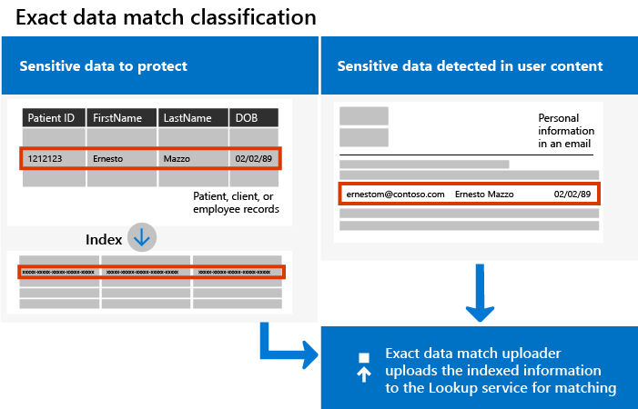

# <a name="create-custom-sensitive-information-types-with-exact-data-match-based-classification"></a><span data-ttu-id="01c85-103">Skapa anpassade typer av känslig information med Exact Data Match-baserad klassificering</span><span class="sxs-lookup"><span data-stu-id="01c85-103">Create custom sensitive information types with Exact Data Match based classification</span></span>


<span data-ttu-id="01c85-104">[Anpassade typer av känslig information](sensitive-information-type-learn-about.md) används för att identifiera känsliga objekt och förhindra att du delar dem oavsiktligt eller på ett olämpligt sätt.</span><span class="sxs-lookup"><span data-stu-id="01c85-104">[Custom sensitive information types](sensitive-information-type-learn-about.md) are used to help identify sensitive items so that you can prevent them from being inadvertently or inappropriately shared.</span></span> <span data-ttu-id="01c85-105">Du definierar en anpassad känslig informationstyp utifrån:</span><span class="sxs-lookup"><span data-stu-id="01c85-105">You define a custom sensitive information type based on:</span></span>

- <span data-ttu-id="01c85-106">mönster</span><span class="sxs-lookup"><span data-stu-id="01c85-106">patterns</span></span>
- <span data-ttu-id="01c85-107">nyckelordsbevis som *anställd*, *märke* eller *ID*</span><span class="sxs-lookup"><span data-stu-id="01c85-107">keyword evidence such as *employee*, *badge*, or *ID*</span></span>
- <span data-ttu-id="01c85-108">teckennärhet till bevis i ett visst mönster</span><span class="sxs-lookup"><span data-stu-id="01c85-108">character proximity to evidence in a particular pattern</span></span>
- <span data-ttu-id="01c85-109">konfidensnivåer</span><span class="sxs-lookup"><span data-stu-id="01c85-109">confidence levels</span></span>

 <span data-ttu-id="01c85-110">Dessa anpassade typer av känslig information uppfyller behoven i många organisationer.</span><span class="sxs-lookup"><span data-stu-id="01c85-110">Such custom sensitive information types meet business needs for many organizations.</span></span>

<span data-ttu-id="01c85-111">Men hur gör du om du vill ha en anpassad typ av känslig information (SIT) som använder exakta datavärden i stället för att hitta matchningar utifrån allmänna mönster?</span><span class="sxs-lookup"><span data-stu-id="01c85-111">But what if you wanted a custom sensitive information type (SIT) that uses exact data values, instead of one that found matches based on generic patterns?</span></span> <span data-ttu-id="01c85-112">Med en Exact Data Match-baserad klassificering (EDM) kan du skapa en anpassad typ av känslig information som är utformad för att:</span><span class="sxs-lookup"><span data-stu-id="01c85-112">With Exact Data Match (EDM)-based classification, you can create a custom sensitive information type that is designed to:</span></span>

- <span data-ttu-id="01c85-113">vara dynamisk och enkel att uppdatera</span><span class="sxs-lookup"><span data-stu-id="01c85-113">be dynamic and easily refreshed</span></span>
- <span data-ttu-id="01c85-114">vara mer skalbar</span><span class="sxs-lookup"><span data-stu-id="01c85-114">be more scalable</span></span>
- <span data-ttu-id="01c85-115">ge färre falska positiva resultat</span><span class="sxs-lookup"><span data-stu-id="01c85-115">result in fewer false-positives</span></span>
- <span data-ttu-id="01c85-116">arbeta med strukturerade känsliga data</span><span class="sxs-lookup"><span data-stu-id="01c85-116">work with structured sensitive data</span></span>
- <span data-ttu-id="01c85-117">hantera känslig information på ett säkrare sätt</span><span class="sxs-lookup"><span data-stu-id="01c85-117">handle sensitive information more securely</span></span>
- <span data-ttu-id="01c85-118">användas med flera Microsoft-molntjänster</span><span class="sxs-lookup"><span data-stu-id="01c85-118">be used with several Microsoft cloud services</span></span>



<span data-ttu-id="01c85-120">Med en EDM-baserad klassificering kan du skapa anpassade typer av känslig information som refererar till exakta värden i en databas med känslig information.</span><span class="sxs-lookup"><span data-stu-id="01c85-120">EDM-based classification enables you to create custom sensitive information types that refer to exact values in a database of sensitive information.</span></span> <span data-ttu-id="01c85-121">Databasen kan uppdateras varje dag och innehålla upp till 100 miljoner rader med data.</span><span class="sxs-lookup"><span data-stu-id="01c85-121">The database can be refreshed daily, and contain up to 100 million rows of data.</span></span> <span data-ttu-id="01c85-122">När anställda, patienter eller kunder kommer och går och poster ändras förblir de anpassade typerna av känslig information aktuella och tillämpliga.</span><span class="sxs-lookup"><span data-stu-id="01c85-122">So as employees, patients, or clients come and go, and records change, your custom sensitive information types remain current and applicable.</span></span> <span data-ttu-id="01c85-123">Och du kan använda EDM-baserad klassificering med principer, till exempel [principer för dataförlustskydd](dlp-learn-about-dlp.md) eller [Microsoft Cloud App Security-filprinciper](/cloud-app-security/data-protection-policies).</span><span class="sxs-lookup"><span data-stu-id="01c85-123">And, you can use EDM-based classification with policies, such as [data loss prevention policies](dlp-learn-about-dlp.md) or [Microsoft Cloud App Security file policies](/cloud-app-security/data-protection-policies).</span></span>

> [!NOTE]
> <span data-ttu-id="01c85-124">Microsoft 365 Information Protection har stöd för teckenuppsättningsspråk med dubbla byte i förhandsgranskning för:</span><span class="sxs-lookup"><span data-stu-id="01c85-124">Microsoft 365 Information Protection supports in preview double byte character set languages for:</span></span>
> - <span data-ttu-id="01c85-125">Kinesiska (förenklad)</span><span class="sxs-lookup"><span data-stu-id="01c85-125">Chinese (simplified)</span></span>
> - <span data-ttu-id="01c85-126">Kinesiska (traditionell)</span><span class="sxs-lookup"><span data-stu-id="01c85-126">Chinese (traditional)</span></span>
> - <span data-ttu-id="01c85-127">Koreanska</span><span class="sxs-lookup"><span data-stu-id="01c85-127">Korean</span></span>
> - <span data-ttu-id="01c85-128">Japanska</span><span class="sxs-lookup"><span data-stu-id="01c85-128">Japanese</span></span>
> 
> <span data-ttu-id="01c85-129">Stödet är tillgängligt för typer av känslig information.</span><span class="sxs-lookup"><span data-stu-id="01c85-129">This support is available for sensitive information types.</span></span> <span data-ttu-id="01c85-130">Se [Viktig information gällande stöd i Information Protection för teckenuppsättningar med dubbla byte (förhandsversion)](mip-dbcs-relnotes.md) för mer information.</span><span class="sxs-lookup"><span data-stu-id="01c85-130">See, [Information protection support for double byte character sets release notes (preview)](mip-dbcs-relnotes.md) for more information.</span></span>
 

## <a name="required-licenses-and-permissions"></a><span data-ttu-id="01c85-131">Obligatoriska licenser och behörigheter</span><span class="sxs-lookup"><span data-stu-id="01c85-131">Required licenses and permissions</span></span>

<span data-ttu-id="01c85-132">Du måste vara global administratör, efterlevnadsadministratör eller Exchange Online-administratör för att utföra de uppgifter som beskrivs i den här artikeln.</span><span class="sxs-lookup"><span data-stu-id="01c85-132">You must be a global admin, compliance administrator, or Exchange Online administrator to perform the tasks described in this article.</span></span> <span data-ttu-id="01c85-133">Läs mer om DLP-behörigheter i [Behörigheter](data-loss-prevention-policies.md#permissions).</span><span class="sxs-lookup"><span data-stu-id="01c85-133">To learn more about DLP permissions, see [Permissions](data-loss-prevention-policies.md#permissions).</span></span>

<span data-ttu-id="01c85-134">EDM-baserad klassificering ingår i dessa prenumerationer</span><span class="sxs-lookup"><span data-stu-id="01c85-134">EDM-based classification is included in these subscriptions</span></span>

- <span data-ttu-id="01c85-135">Office 365 E5</span><span class="sxs-lookup"><span data-stu-id="01c85-135">Office 365 E5</span></span>
- <span data-ttu-id="01c85-136">Microsoft 365 E5</span><span class="sxs-lookup"><span data-stu-id="01c85-136">Microsoft 365 E5</span></span>
- <span data-ttu-id="01c85-137">Microsoft 365 E5 Compliance</span><span class="sxs-lookup"><span data-stu-id="01c85-137">Microsoft 365 E5 Compliance</span></span>
- <span data-ttu-id="01c85-138">Microsoft E5/A5 Information Protection och styrning</span><span class="sxs-lookup"><span data-stu-id="01c85-138">Microsoft E5/A5 Information Protection and Governance</span></span>

## <a name="portal-links-for-your-subscription"></a><span data-ttu-id="01c85-139">Portallänkar för prenumerationen</span><span class="sxs-lookup"><span data-stu-id="01c85-139">Portal links for your subscription</span></span>


|<span data-ttu-id="01c85-140">Portal</span><span class="sxs-lookup"><span data-stu-id="01c85-140">Portal</span></span>  |<span data-ttu-id="01c85-141">World Wide/GCC</span><span class="sxs-lookup"><span data-stu-id="01c85-141">World Wide/GCC</span></span>  |<span data-ttu-id="01c85-142">GCC-High</span><span class="sxs-lookup"><span data-stu-id="01c85-142">GCC-High</span></span>  |<span data-ttu-id="01c85-143">DOD</span><span class="sxs-lookup"><span data-stu-id="01c85-143">DOD</span></span>  |
|---------|---------|---------|---------|
|<span data-ttu-id="01c85-144">Office SCC</span><span class="sxs-lookup"><span data-stu-id="01c85-144">Office SCC</span></span>     |  <span data-ttu-id="01c85-145">protection.office.com</span><span class="sxs-lookup"><span data-stu-id="01c85-145">protection.office.com</span></span>       |<span data-ttu-id="01c85-146">scc.office365.us</span><span class="sxs-lookup"><span data-stu-id="01c85-146">scc.office365.us</span></span>         |<span data-ttu-id="01c85-147">scc.protection.apps.mil</span><span class="sxs-lookup"><span data-stu-id="01c85-147">scc.protection.apps.mil</span></span> |
|<span data-ttu-id="01c85-148">Microsoft 365 Säkerhetscenter</span><span class="sxs-lookup"><span data-stu-id="01c85-148">Microsoft 365 Security center</span></span>     |<span data-ttu-id="01c85-149">security.microsoft.com</span><span class="sxs-lookup"><span data-stu-id="01c85-149">security.microsoft.com</span></span>         |<span data-ttu-id="01c85-150">security.microsoft.us</span><span class="sxs-lookup"><span data-stu-id="01c85-150">security.microsoft.us</span></span>         |<span data-ttu-id="01c85-151">security.apps.mil</span><span class="sxs-lookup"><span data-stu-id="01c85-151">security.apps.mil</span></span>|
|<span data-ttu-id="01c85-152">Microsoft 365 Efterlevnadscenter</span><span class="sxs-lookup"><span data-stu-id="01c85-152">Microsoft 365 Compliance center</span></span>     |<span data-ttu-id="01c85-153">compliance.microsoft.com</span><span class="sxs-lookup"><span data-stu-id="01c85-153">compliance.microsoft.com</span></span>         |<span data-ttu-id="01c85-154">compliance.microsoft.us</span><span class="sxs-lookup"><span data-stu-id="01c85-154">compliance.microsoft.us</span></span>         |<span data-ttu-id="01c85-155">compliance.apps.mil</span><span class="sxs-lookup"><span data-stu-id="01c85-155">compliance.apps.mil</span></span>|


## <a name="the-work-flow-at-a-glance"></a><span data-ttu-id="01c85-156">Överblick över arbetsflödet</span><span class="sxs-lookup"><span data-stu-id="01c85-156">The work flow at a glance</span></span>

|<span data-ttu-id="01c85-157">Fas</span><span class="sxs-lookup"><span data-stu-id="01c85-157">Phase</span></span>  |<span data-ttu-id="01c85-158">Det här behövs</span><span class="sxs-lookup"><span data-stu-id="01c85-158">What's needed</span></span>  |
|---------|---------|
|[<span data-ttu-id="01c85-159">Del 1: Konfigurera EDM-baserad klassificering</span><span class="sxs-lookup"><span data-stu-id="01c85-159">Part 1: Set up EDM-based classification</span></span>](#part-1-set-up-edm-based-classification)<br/><br/><span data-ttu-id="01c85-160">(vid behov)</span><span class="sxs-lookup"><span data-stu-id="01c85-160">(As needed)</span></span><br/><span data-ttu-id="01c85-161">- [Redigera databasschemat](#editing-the-schema-for-edm-based-classification)</span><span class="sxs-lookup"><span data-stu-id="01c85-161">- [Edit the database schema](#editing-the-schema-for-edm-based-classification)</span></span> <br/><span data-ttu-id="01c85-162">- [Ta bort schemat](#removing-the-schema-for-edm-based-classification)</span><span class="sxs-lookup"><span data-stu-id="01c85-162">- [Remove the schema](#removing-the-schema-for-edm-based-classification)</span></span> |<span data-ttu-id="01c85-163">- Läsåtkomst till känsliga data</span><span class="sxs-lookup"><span data-stu-id="01c85-163">- Read access to the sensitive data</span></span><br/><span data-ttu-id="01c85-164">- Databasschema i XML-format (exempel tillhandahålls)</span><span class="sxs-lookup"><span data-stu-id="01c85-164">- Database schema in XML format (example provided)</span></span><br/><span data-ttu-id="01c85-165">- Regelpaket i XML-format (exempel tillhandahålls)</span><span class="sxs-lookup"><span data-stu-id="01c85-165">- Rule package in XML format (example provided)</span></span><br/><span data-ttu-id="01c85-166">- Administratörsbehörigheter till Säkerhets- och efterlevnadscenter (med PowerShell)</span><span class="sxs-lookup"><span data-stu-id="01c85-166">- Admin permissions to the Security & Compliance Center (using PowerShell)</span></span> |
|[<span data-ttu-id="01c85-167">Del 2: Hasha och ladda upp känsliga data</span><span class="sxs-lookup"><span data-stu-id="01c85-167">Part 2: Hash and upload the sensitive data</span></span>](#part-2-hash-and-upload-the-sensitive-data)<br/><br/><span data-ttu-id="01c85-168">(vid behov)</span><span class="sxs-lookup"><span data-stu-id="01c85-168">(As needed)</span></span><br/>[<span data-ttu-id="01c85-169">Uppdatera data</span><span class="sxs-lookup"><span data-stu-id="01c85-169">Refresh the data</span></span>](#refreshing-your-sensitive-information-database) |<span data-ttu-id="01c85-170">- Anpassad säkerhetsgrupp och användarkonto</span><span class="sxs-lookup"><span data-stu-id="01c85-170">- Custom security group and user account</span></span><br/><span data-ttu-id="01c85-171">- Lokal administratörsåtkomst till datorn med EDM-uppladdningsagenten</span><span class="sxs-lookup"><span data-stu-id="01c85-171">- Local admin access to machine with EDM Upload Agent</span></span><br/><span data-ttu-id="01c85-172">- Läsåtkomst till känsliga data</span><span class="sxs-lookup"><span data-stu-id="01c85-172">- Read access to the sensitive data</span></span><br/><span data-ttu-id="01c85-173">- Process och schema för uppdatering av data</span><span class="sxs-lookup"><span data-stu-id="01c85-173">- Process and schedule for refreshing the data</span></span>|
|[<span data-ttu-id="01c85-174">Del 3: Använda EDM-baserad klassificering med dina Microsoft-molntjänster</span><span class="sxs-lookup"><span data-stu-id="01c85-174">Part 3: Use EDM-based classification with your Microsoft cloud services</span></span>](#part-3-use-edm-based-classification-with-your-microsoft-cloud-services) |<span data-ttu-id="01c85-175">- Microsoft 365-prenumeration med DLP</span><span class="sxs-lookup"><span data-stu-id="01c85-175">- Microsoft 365 subscription with DLP</span></span><br/><span data-ttu-id="01c85-176">- Aktiverad funktion för EDM-baserad klassificering</span><span class="sxs-lookup"><span data-stu-id="01c85-176">- EDM-based classification feature enabled</span></span> |

### <a name="part-1-set-up-edm-based-classification"></a><span data-ttu-id="01c85-177">Del 1: Konfigurera EDM-baserad klassificering</span><span class="sxs-lookup"><span data-stu-id="01c85-177">Part 1: Set up EDM-based classification</span></span>

<span data-ttu-id="01c85-178">I konfigurationen av EDM-baserad klassificering ingår att:</span><span class="sxs-lookup"><span data-stu-id="01c85-178">Setting up and configuring EDM-based classification involves:</span></span>

1. [<span data-ttu-id="01c85-179">Spara känsliga data i CSV-format</span><span class="sxs-lookup"><span data-stu-id="01c85-179">Saving sensitive data in .csv format</span></span>](#save-sensitive-data-in-csv-format)
2. [<span data-ttu-id="01c85-180">Definiera ett databasschema för känslig information</span><span class="sxs-lookup"><span data-stu-id="01c85-180">Define your sensitive information database schema</span></span>](#define-the-schema-for-your-database-of-sensitive-information)
3. [<span data-ttu-id="01c85-181">Skapa ett regelpaket</span><span class="sxs-lookup"><span data-stu-id="01c85-181">Create a rule package</span></span>](#set-up-a-rule-package)


#### <a name="save-sensitive-data-in-csv-format"></a><span data-ttu-id="01c85-182">Spara känsliga data i CSV-format</span><span class="sxs-lookup"><span data-stu-id="01c85-182">Save sensitive data in .csv format</span></span>

1. <span data-ttu-id="01c85-183">Identifiera den känsliga information du vill använda.</span><span class="sxs-lookup"><span data-stu-id="01c85-183">Identify the sensitive information you want to use.</span></span> <span data-ttu-id="01c85-184">Exportera data till ett program, till exempel Microsoft Excel, och spara filen i CSV-format.</span><span class="sxs-lookup"><span data-stu-id="01c85-184">Export the data to an app, such as Microsoft Excel, and save the file in .csv format.</span></span> <span data-ttu-id="01c85-185">Datafilen kan innehålla högst:</span><span class="sxs-lookup"><span data-stu-id="01c85-185">The data file can include a maximum of:</span></span>
      - <span data-ttu-id="01c85-186">100 miljoner rader med känsliga data</span><span class="sxs-lookup"><span data-stu-id="01c85-186">Up to 100 million rows of sensitive data</span></span>
      - <span data-ttu-id="01c85-187">32 kolumner (fält) per datakälla</span><span class="sxs-lookup"><span data-stu-id="01c85-187">Up to 32 columns (fields) per data source</span></span>
      - <span data-ttu-id="01c85-188">5 kolumner (fält) markerade som sökbara</span><span class="sxs-lookup"><span data-stu-id="01c85-188">Up to 5 columns (fields) marked as searchable</span></span>

2. <span data-ttu-id="01c85-189">Strukturera känsliga data i CSV-filen så att den första raden innehåller namnen på de fält som används för EDM-baserad klassificering.</span><span class="sxs-lookup"><span data-stu-id="01c85-189">Structure the sensitive data in the .csv file such that the first row includes the names of the fields used for EDM-based classification.</span></span> <span data-ttu-id="01c85-190">I CSV-filen kan du ha fältnamn, till exempel ”personnummer”, ”födelsedatum”, ”förnamn”, ”efternamn”.</span><span class="sxs-lookup"><span data-stu-id="01c85-190">In your .csv file, you might have field names, such as "ssn", "birthdate", "firstname", "lastname".</span></span> <span data-ttu-id="01c85-191">Kolumnrubriknamn får inte innehålla blanksteg eller understreck.</span><span class="sxs-lookup"><span data-stu-id="01c85-191">The column header names can't include spaces or underscores.</span></span> <span data-ttu-id="01c85-192">Exempelfilen i CSV-format som vi använder i den här artikeln heter till exempel *PatientRecords.csv*, och innehåller kolumnerna *PatientID*, *MRN*, *LastName*, *FirstName*, *SSN* med flera.</span><span class="sxs-lookup"><span data-stu-id="01c85-192">For example, the sample .csv file that we use in this article is named *PatientRecords.csv*, and its columns include *PatientID*, *MRN*, *LastName*, *FirstName*, *SSN*, and more.</span></span>

3. <span data-ttu-id="01c85-193">Var uppmärksam på formatet för fälten med känsliga data.</span><span class="sxs-lookup"><span data-stu-id="01c85-193">Pay attention to the format of the sensitive data fields.</span></span> <span data-ttu-id="01c85-194">Det gäller i synnerhet fält med kommatecken i innehållet (t.ex. en gatuadress som innehåller värdet ”Seattle,WA”) eftersom de skulle tolkas som två separata fält av EDM-verktyget.</span><span class="sxs-lookup"><span data-stu-id="01c85-194">In particular, fields that may contain commas in their content (e.g. a street address that contains the value "Seattle,WA") would be parsed as two separate fields when parsed by the EDM tool.</span></span> <span data-ttu-id="01c85-195">För att undvika detta måste du se till att sådana fält omges av ett eller två citattecken i tabellen med känsliga data.</span><span class="sxs-lookup"><span data-stu-id="01c85-195">In order to avoid this, you need to ensure such fields are surrounded by single or double quotes in the sensitive data table.</span></span> <span data-ttu-id="01c85-196">Om fält med kommatecken även innehåller blanksteg måste du skapa en anpassad typ av känslig information som matchar motsvarande format (till exempel en stäng med flera ord som innehåller kommatecken och blanksteg) för att säkerställa att strängen matchas korrekt när dokumentet genomsöks.</span><span class="sxs-lookup"><span data-stu-id="01c85-196">If fields with commas in them may also contain spaces, you would need to create a custom Sensitive Information Type that matches the corresponding format (e.g. a multi-word string with commas and spaces in it) to ensure the string is correctly matched when the document is scanned.</span></span>

#### <a name="define-the-schema-for-your-database-of-sensitive-information"></a><span data-ttu-id="01c85-197">Definiera schemat för databasen med känslig information</span><span class="sxs-lookup"><span data-stu-id="01c85-197">Define the schema for your database of sensitive information</span></span>

<span data-ttu-id="01c85-198">Om du av affärsmässiga eller tekniska skäl inte vill använda PowerShell eller kommandoraden för att skapa ditt schema och mönster för EDM-baserade typer av känslig information (regelpaket) kan du skapa dem med [guiden för Exact Data Match-schema och typ av känslig information](sit-edm-wizard.md).</span><span class="sxs-lookup"><span data-stu-id="01c85-198">If for business or technical reasons, you prefer not to use PowerShell or command line to create your schema and EDM sensitive info type pattern (rule package), you can use the [Exact Data Match Schema and Sensitive Information Type Wizard](sit-edm-wizard.md) to create them.</span></span> <span data-ttu-id="01c85-199">När du är klar med att skapa schemat och mönstret för den EDM-baserade typen av känslig information går du tillbaka och slutför alla steg som behövs för att göra din EDM-baserade typ av känslig information tillgänglig för användning.</span><span class="sxs-lookup"><span data-stu-id="01c85-199">When you are done creating the schema and EDM sensitive info type pattern, return to complete all the steps necessary to make your EDM based sensitive information type available for use.</span></span>

> [!NOTE]
> <span data-ttu-id="01c85-200">Guiden för Exact Data Match-schema och typ av känslig information är endast tillgänglig för molnen World Wide och GCC.</span><span class="sxs-lookup"><span data-stu-id="01c85-200">The Exact Data Match Schema and Sensitive Information Type Wizard is only available for the World Wide and GCC clouds only.</span></span>

1. <span data-ttu-id="01c85-201">Definiera schemat för databasen med känslig information i XML-format (ungefär som i exemplet nedan).</span><span class="sxs-lookup"><span data-stu-id="01c85-201">Define the schema for the database of sensitive information in XML format (similar to our example below).</span></span> <span data-ttu-id="01c85-202">Ge schemafilen namnet **edm.xml** och konfigurera den så att det finns en rad med följande syntax för varje kolumn i databasen:</span><span class="sxs-lookup"><span data-stu-id="01c85-202">Name this schema file **edm.xml**, and configure it such that for each column in the database, there is a line that uses the syntax:</span></span> 

      <span data-ttu-id="01c85-203">`\<Field name="" searchable=""/\>`.</span><span class="sxs-lookup"><span data-stu-id="01c85-203">`\<Field name="" searchable=""/\>`.</span></span>

      - <span data-ttu-id="01c85-204">Ange kolumnnamn som *fältnamnsvärde*.</span><span class="sxs-lookup"><span data-stu-id="01c85-204">Use column names for *Field name* values.</span></span>
      - <span data-ttu-id="01c85-205">Ange *searchable="true"* för de fält som du vill ska vara sökbara (högst fem fält).</span><span class="sxs-lookup"><span data-stu-id="01c85-205">Use *searchable="true"* for the fields that you want to be searchable up to a maximum of 5 fields.</span></span> <span data-ttu-id="01c85-206">Minst ett fält måste vara sökbart.</span><span class="sxs-lookup"><span data-stu-id="01c85-206">At least one field must be searchable.</span></span>

      <span data-ttu-id="01c85-207">I följande exempel definierar XML-filen schemat för en databas för patientjournaler varav fem fält har angetts som sökbara: *PatientID*, *MRN*, *SSN*, *Phone* och *DOB*.</span><span class="sxs-lookup"><span data-stu-id="01c85-207">As an example, the following XML file defines the schema for a patient records database, with five fields specified as searchable: *PatientID*, *MRN*, *SSN*, *Phone*, and *DOB*.</span></span>

      <span data-ttu-id="01c85-208">(Du kan kopiera, ändra och använda vårt exempel.)</span><span class="sxs-lookup"><span data-stu-id="01c85-208">(You can copy, modify, and use our example.)</span></span>

      ```xml
      <EdmSchema xmlns="http://schemas.microsoft.com/office/2018/edm">
            <DataStore name="PatientRecords" description="Schema for patient records" version="1">
                  <Field name="PatientID" searchable="true" caseInsensitive="true" ignoredDelimiters="-,/,*,#,^" />
                  <Field name="MRN" searchable="true" />
                  <Field name="FirstName" />
                  <Field name="LastName" />
                  <Field name="SSN" searchable="true" />
                  <Field name="Phone" searchable="true" />
                  <Field name="DOB" searchable="true" />
                  <Field name="Gender" />
                  <Field name="Address" />
            </DataStore>
      </EdmSchema>
      ```

##### <a name="configurable-match-using-the-caseinsensitive-and-ignoreddelimiters-fields"></a><span data-ttu-id="01c85-209">Konfigurerbar matchning med fälten caseInsensitive och ignoredDelimiters</span><span class="sxs-lookup"><span data-stu-id="01c85-209">Configurable match using the caseInsensitive and ignoredDelimiters fields</span></span>

<span data-ttu-id="01c85-210">I XML-exemplet ovan används fälten `caseInsensitive` och `ignoredDelimiters`.</span><span class="sxs-lookup"><span data-stu-id="01c85-210">The above XML sample makes use of the `caseInsensitive` and the `ignoredDelimiters` fields.</span></span> 

<span data-ttu-id="01c85-211">När du tar med fältet \***caseInsensitive** _ inställt på värdet `true` i din schemadefinition exkluderar EDM inte objekt på grund av skillnader i skiftläge i fältet `PatientID`.</span><span class="sxs-lookup"><span data-stu-id="01c85-211">When you include the \***caseInsensitive** _ field set to the value of `true` in your schema definition, EDM will not exclude an item based on case differences for `PatientID` field.</span></span> <span data-ttu-id="01c85-212">EDM tolkar `PatientID` _ *FOO-1234*\* och **fOo-1234** som identiska.</span><span class="sxs-lookup"><span data-stu-id="01c85-212">So EDM will see, `PatientID` _ *FOO-1234*\* and **fOo-1234** as being identical.</span></span>

<span data-ttu-id="01c85-213">Om du tar med fältet \***ignoredDelimiters** _ med tecken som stöds ignorerar EDM dessa tecken i `PatientID`.</span><span class="sxs-lookup"><span data-stu-id="01c85-213">When you include the \***ignoredDelimiters** _ field with supported characters,  EDM will ignore those characters in the `PatientID`.</span></span> <span data-ttu-id="01c85-214">EDM tolkar `PatientID` _ *FOO-1234*\* och `PatientID` **FOO#1234** som identiska.</span><span class="sxs-lookup"><span data-stu-id="01c85-214">So EDM will see, `PatientID` _ *FOO-1234*\* and `PatientID` **FOO#1234** as being identical.</span></span> <span data-ttu-id="01c85-215">Flaggan `ignoredDelimiters` stöder alla icke-alfanumeriska tecken. Här är några exempel:</span><span class="sxs-lookup"><span data-stu-id="01c85-215">The `ignoredDelimiters` flag supports any non-alphanumeric character, here are some examples:</span></span>
- <span data-ttu-id="01c85-216">\.</span><span class="sxs-lookup"><span data-stu-id="01c85-216">\.</span></span>
- \-
- \/
- \_
- \*
- \^
- \#
- \!
- \?
- \[
- \]
- \{
- \}
- \\
- \~
- \; 

<span data-ttu-id="01c85-217">Flaggan `ignoredDelimiters` stöder inte:</span><span class="sxs-lookup"><span data-stu-id="01c85-217">The `ignoredDelimiters` flag doesn't support:</span></span>
- <span data-ttu-id="01c85-218">tecknen 0–9</span><span class="sxs-lookup"><span data-stu-id="01c85-218">characters 0-9</span></span>
- <span data-ttu-id="01c85-219">A–Z</span><span class="sxs-lookup"><span data-stu-id="01c85-219">A-Z</span></span>
- <span data-ttu-id="01c85-220">a–z</span><span class="sxs-lookup"><span data-stu-id="01c85-220">a-z</span></span>
- \"
- \,

<span data-ttu-id="01c85-221">I det här exempel använder vi både `caseInsensitive` och `ignoredDelimiters` vilket innebär att EDM skulle se **FOO-1234** och **fOo#1234** som identiska och klassificera objektet som känslig information av typen patientjournal.</span><span class="sxs-lookup"><span data-stu-id="01c85-221">In this example, where both `caseInsensitive` and `ignoredDelimiters` are used, EDM would see **FOO-1234** and **fOo#1234** as  identical and classify the item as a patient record sensitive information type.</span></span> 

4. <span data-ttu-id="01c85-222">Anslut till Säkerhets- och efterlevnadscenter med hjälp av metoderna i [Ansluta till Säkerhets- och efterlevnadscentret i PowerShell](/powershell/exchange/connect-to-scc-powershell).</span><span class="sxs-lookup"><span data-stu-id="01c85-222">Connect to the Security & Compliance center using the procedures in [Connect to Security & Compliance Center PowerShell](/powershell/exchange/connect-to-scc-powershell).</span></span>

5. <span data-ttu-id="01c85-223">Om du vill ladda upp databasschemat kör du följande cmdletar, en i taget:</span><span class="sxs-lookup"><span data-stu-id="01c85-223">To upload the database schema, run the following cmdlets, one at a time:</span></span>

      ```powershell
      $edmSchemaXml=Get-Content .\\edm.xml -Encoding Byte -ReadCount 0
      New-DlpEdmSchema -FileData $edmSchemaXml -Confirm:$true
      ```

      <span data-ttu-id="01c85-224">Du uppmanas att bekräfta på följande sätt:</span><span class="sxs-lookup"><span data-stu-id="01c85-224">You will be prompted to confirm, as follows:</span></span>

      > <span data-ttu-id="01c85-225">Bekräfta</span><span class="sxs-lookup"><span data-stu-id="01c85-225">Confirm</span></span>
      >
      > <span data-ttu-id="01c85-226">Vill du utföra den här åtgärden?</span><span class="sxs-lookup"><span data-stu-id="01c85-226">Are you sure you want to perform this action?</span></span>
      >
      > <span data-ttu-id="01c85-227">Det nya EDM-schemat för datalagret ”patientrecords” importeras.</span><span class="sxs-lookup"><span data-stu-id="01c85-227">New EDM Schema for the data store 'patientrecords' will be imported.</span></span>
      >
      > <span data-ttu-id="01c85-228">\[Y\] Yes (Ja) \[A\] Yes to All (Ja för alla) \[N\] No (Nej) \[L\] No to All (Nej för alla) \[?\] Help (Hjälp)  (standardinställningen är Y):</span><span class="sxs-lookup"><span data-stu-id="01c85-228">\[Y\] Yes \[A\] Yes to All \[N\] No \[L\] No to All \[?\] Help (default is "Y"):</span></span>

> [!TIP]
> <span data-ttu-id="01c85-229">Om du vill att ändringarna ska förekomma utan bekräftelse använder du den här cmdleten i stället i steg 5: New-DlpEdmSchema -FileData $edmSchemaXml</span><span class="sxs-lookup"><span data-stu-id="01c85-229">If you want your changes to occur without confirmation, in Step 5, use this cmdlet instead: New-DlpEdmSchema -FileData $edmSchemaXml</span></span>

> [!NOTE]
> <span data-ttu-id="01c85-230">Det kan ta mellan 10–60 minuter att uppdatera EDMSchema med tillägg.</span><span class="sxs-lookup"><span data-stu-id="01c85-230">It can take between 10-60 minutes to update the EDMSchema with additions.</span></span> <span data-ttu-id="01c85-231">Uppdateringen måste slutföras innan du utför de steg där tilläggen används.</span><span class="sxs-lookup"><span data-stu-id="01c85-231">The update must complete before you execute steps that use the additions.</span></span>

#### <a name="set-up-a-rule-package"></a><span data-ttu-id="01c85-232">Skapa ett regelpaket</span><span class="sxs-lookup"><span data-stu-id="01c85-232">Set up a rule package</span></span>

1. <span data-ttu-id="01c85-233">Skapa ett regelpaket i XML-format (med Unicode-kodning), ungefär som i följande exempel.</span><span class="sxs-lookup"><span data-stu-id="01c85-233">Create a rule package in XML format (with Unicode encoding), similar to the following example.</span></span> <span data-ttu-id="01c85-234">(Du kan kopiera, ändra och använda vårt exempel.)</span><span class="sxs-lookup"><span data-stu-id="01c85-234">(You can copy, modify, and use our example.)</span></span>

      <span data-ttu-id="01c85-235">När du har skapat ditt regelpaket måste du referera till CSV-filen och filen **edm.xml** på korrekt sätt.</span><span class="sxs-lookup"><span data-stu-id="01c85-235">When you set up your rule package, make sure to correctly reference your .csv file and **edm.xml** file.</span></span> <span data-ttu-id="01c85-236">Du kan kopiera, ändra och använda vårt exempel.</span><span class="sxs-lookup"><span data-stu-id="01c85-236">You can copy, modify, and use our example.</span></span> <span data-ttu-id="01c85-237">I det här XML-exemplet måste följande fält anpassas för att skapa en EDM-känslig typ:</span><span class="sxs-lookup"><span data-stu-id="01c85-237">In this sample xml the following fields needs to be customized to create your EDM sensitive type:</span></span>

      - <span data-ttu-id="01c85-238">**RulePack id och ExactMatch id**: Använd [New-GUID](/powershell/module/microsoft.powershell.utility/new-guid?view=powershell-6) för att generera ett GUID.</span><span class="sxs-lookup"><span data-stu-id="01c85-238">**RulePack id & ExactMatch id**: Use [New-GUID](/powershell/module/microsoft.powershell.utility/new-guid?view=powershell-6) to generate a GUID.</span></span>

      - <span data-ttu-id="01c85-239">**Datastore**: Det här fältet anger vilket datalager för EDM-sökning som ska användas.</span><span class="sxs-lookup"><span data-stu-id="01c85-239">**Datastore**: This field specifies EDM lookup data store to be used.</span></span> <span data-ttu-id="01c85-240">Ange namnet på datakällan för ett konfigurerat EDM-schema.</span><span class="sxs-lookup"><span data-stu-id="01c85-240">You provide a data source name of a configured EDM Schema.</span></span>

      - <span data-ttu-id="01c85-241">**idMatch**: Det här fältet pekar på det primära elementet för EDM.</span><span class="sxs-lookup"><span data-stu-id="01c85-241">**idMatch**: This field points to the primary element for EDM.</span></span>
        - <span data-ttu-id="01c85-242">Matches: Anger vilket fält som ska användas i en exakt sökning.</span><span class="sxs-lookup"><span data-stu-id="01c85-242">Matches: Specifies the field to be used in exact lookup.</span></span> <span data-ttu-id="01c85-243">Ange ett sökbart fältnamn i EDM-schemat för DataStore.</span><span class="sxs-lookup"><span data-stu-id="01c85-243">You provide a searchable field name in EDM Schema for the DataStore.</span></span>
        - <span data-ttu-id="01c85-244">Classification: Det här fältet anger den matchning av känslig typ som utlöser en EDM-sökning.</span><span class="sxs-lookup"><span data-stu-id="01c85-244">Classification: This field specifies the sensitive type match that triggers EDM lookup.</span></span> <span data-ttu-id="01c85-245">Du kan ange namnet eller GUID för en befintlig inbyggd eller anpassad typ av känslig information.</span><span class="sxs-lookup"><span data-stu-id="01c85-245">You can provide the Name or GUID of an existing built-in or custom sensitive information type.</span></span> <span data-ttu-id="01c85-246">Observera att alla strängar som matchar den angivna typen av känslig information kommer att hashas och jämföras med varje post i tabellen med känslig information.</span><span class="sxs-lookup"><span data-stu-id="01c85-246">Be aware that any string that matches the sensitive information type provided will be hashed and compared to every entry in the sensitive information table.</span></span> <span data-ttu-id="01c85-247">För att det inte ska uppstå prestandaproblem bör du undvika att använda en typ som matchar en hög procent av innehållet (till exempel “alla siffror” eller “alla ord med fem bokstäver”) om du använder en anpassad typ av känslig information som klassificeringselement i EDM. Lägg i så fall till nyckelord eller inkludera formatering i definitionen av den anpassade typen av känslig information.</span><span class="sxs-lookup"><span data-stu-id="01c85-247">In order to avoid causing performance issues, if you use a custom sensitive information type as the Classification element in EDM, avoid using one that will match a large percentage of content (such as "any number" or "any five-letter word") by adding supporting keywords or including formatting in the definition of the custom classification sensitive information type.</span></span> 

      - <span data-ttu-id="01c85-248">**Match:** Det här fältet pekar på ytterligare bevis som hittats i närheten av idMatch.</span><span class="sxs-lookup"><span data-stu-id="01c85-248">**Match:** This field points to additional evidence found in proximity of idMatch.</span></span>
        - <span data-ttu-id="01c85-249">Matches: Ange valfritt fältnamn i EDM-schemat för DataStore.</span><span class="sxs-lookup"><span data-stu-id="01c85-249">Matches: You provide any field name in EDM Schema for DataStore.</span></span>
      - <span data-ttu-id="01c85-250">**Resource:** Det här avsnittet anger ett namn och en beskrivning för den känslig typen på flera språk.</span><span class="sxs-lookup"><span data-stu-id="01c85-250">**Resource:** This section specifies the name and description for sensitive type in multiple locales.</span></span>
        - <span data-ttu-id="01c85-251">idRef: Du anger GUID för ExactMatch ID.</span><span class="sxs-lookup"><span data-stu-id="01c85-251">idRef: You provide GUID for ExactMatch ID.</span></span>
        - <span data-ttu-id="01c85-252">Name och description: anpassa efter behov.</span><span class="sxs-lookup"><span data-stu-id="01c85-252">Name & descriptions: customize as required.</span></span>

      ```xml
      <RulePackage xmlns="http://schemas.microsoft.com/office/2018/edm">
        <RulePack id="fd098e03-1796-41a5-8ab6-198c93c62b11">
          <Version build="0" major="2" minor="0" revision="0" />
          <Publisher id="eb553734-8306-44b4-9ad5-c388ad970528" />
          <Details defaultLangCode="en-us">
            <LocalizedDetails langcode="en-us">
              <PublisherName>IP DLP</PublisherName>
              <Name>Health Care EDM Rulepack</Name>
              <Description>This rule package contains the EDM sensitive type for health care sensitive types.</Description>
            </LocalizedDetails>
          </Details>
        </RulePack>
        <Rules>
          <ExactMatch id = "E1CC861E-3FE9-4A58-82DF-4BD259EAB371" patternsProximity = "300" dataStore ="PatientRecords" recommendedConfidence = "65" >
            <Pattern confidenceLevel="65">
              <idMatch matches = "SSN" classification = "U.S. Social Security Number (SSN)" />
            </Pattern>
            <Pattern confidenceLevel="75">
              <idMatch matches = "SSN" classification = "U.S. Social Security Number (SSN)" />
              <Any minMatches ="3" maxMatches ="6">
                <match matches="PatientID" />
                <match matches="MRN"/>
                <match matches="FirstName"/>
                <match matches="LastName"/>
                <match matches="Phone"/>
                <match matches="DOB"/>
              </Any>
            </Pattern>
          </ExactMatch>
          <LocalizedStrings>
            <Resource idRef="E1CC861E-3FE9-4A58-82DF-4BD259EAB371">
              <Name default="true" langcode="en-us">Patient SSN Exact Match.</Name>
              <Description default="true" langcode="en-us">EDM Sensitive type for detecting Patient SSN.</Description>
            </Resource>
          </LocalizedStrings>
        </Rules>
      </RulePackage>
      ```

2. <span data-ttu-id="01c85-253">Ladda upp regelpaketet genom att köra följande PowerShell-cmdletar, en i taget:</span><span class="sxs-lookup"><span data-stu-id="01c85-253">Upload the rule package by running the following PowerShell cmdlets, one at a time:</span></span>

      ```powershell
      $rulepack=Get-Content .\\rulepack.xml -Encoding Byte -ReadCount 0
      New-DlpSensitiveInformationTypeRulePackage -FileData $rulepack
      ```

<span data-ttu-id="01c85-254">Nu har du ställt in en EDM-baserad klassificering.</span><span class="sxs-lookup"><span data-stu-id="01c85-254">At this point, you have set up EDM-based classification.</span></span> <span data-ttu-id="01c85-255">Nästa steg är att hasha känsliga data och sedan ladda upp hasharna för indexering.</span><span class="sxs-lookup"><span data-stu-id="01c85-255">The next step is to hash the sensitive data, and then upload the hashes for indexing.</span></span>

<span data-ttu-id="01c85-256">Du kommer kanske ihåg att vi definierade fem fält som sökbara i PatientRecords-schemat i föregående procedur: *PatientID*, *MRN*, *SSN*, *Phone* och *DOB*.</span><span class="sxs-lookup"><span data-stu-id="01c85-256">Recall from the previous procedure that our PatientRecords schema defines five fields as searchable: *PatientID*, *MRN*, *SSN*, *Phone*, and *DOB*.</span></span> <span data-ttu-id="01c85-257">Vårt exempelregelpaket innehåller dessa fält och refererar till databasschemafilen (**edm.xml**), med ett *ExactMatch*-objekt per sökbart fält.</span><span class="sxs-lookup"><span data-stu-id="01c85-257">Our example rule package includes those fields and references the database schema file (**edm.xml**), with one *ExactMatch* item per searchable field.</span></span> <span data-ttu-id="01c85-258">Begrunda följande ExactMatch-objekt:</span><span class="sxs-lookup"><span data-stu-id="01c85-258">Consider the following ExactMatch item:</span></span>

```xml
<ExactMatch id = "E1CC861E-3FE9-4A58-82DF-4BD259EAB371" patternsProximity = "300" dataStore ="PatientRecords" recommendedConfidence = "65" >
      <Pattern confidenceLevel="65">
        <idMatch matches = "SSN" classification = "U.S. Social Security Number (SSN)" />
      </Pattern>
      <Pattern confidenceLevel="75">
        <idMatch matches = "SSN" classification = "U.S. Social Security Number (SSN)" />
        <Any minMatches ="3" maxMatches ="100">
          <match matches="PatientID" />
          <match matches="MRN"/>
          <match matches="FirstName"/>
          <match matches="LastName"/>
          <match matches="Phone"/>
          <match matches="DOB"/>
        </Any>
      </Pattern>
    </ExactMatch>
```

<span data-ttu-id="01c85-259">Observera i det här exemplet att:</span><span class="sxs-lookup"><span data-stu-id="01c85-259">In this example, note that:</span></span>

- <span data-ttu-id="01c85-260">DataStore-namnet refererar till den CSV-fil som vi skapade tidigare: **dataStore = "PatientRecords"**.</span><span class="sxs-lookup"><span data-stu-id="01c85-260">The dataStore name references the .csv file we created earlier: **dataStore = "PatientRecords"**.</span></span>

- <span data-ttu-id="01c85-261">IdMatch-värdet refererar till ett sökbart fält som finns i databasschemafilen: **idMatch matches = "SSN"**.</span><span class="sxs-lookup"><span data-stu-id="01c85-261">The idMatch value references a searchable field that is listed in the database schema file: **idMatch matches = "SSN"**.</span></span>

- <span data-ttu-id="01c85-262">Klassificeringsvärdet refererar till en befintlig eller anpassad typ av känslig information: **classification = "U.S. Social Security Number (SSN)"**.</span><span class="sxs-lookup"><span data-stu-id="01c85-262">The classification value references an existing or custom sensitive information type: **classification = "U.S. Social Security Number (SSN)"**.</span></span> <span data-ttu-id="01c85-263">(I det här fallet använder vi U.S. Social Security Number som är en befintlig typ av känslig information.)</span><span class="sxs-lookup"><span data-stu-id="01c85-263">(In this case, we use the existing sensitive information type of U.S. Social Security Number.)</span></span>

> [!NOTE]
> <span data-ttu-id="01c85-264">Det kan ta mellan 10–60 minuter att uppdatera EDMSchema med tillägg.</span><span class="sxs-lookup"><span data-stu-id="01c85-264">It can take between 10-60 minutes to update the EDMSchema with additions.</span></span> <span data-ttu-id="01c85-265">Uppdateringen måste slutföras innan du utför de steg där tilläggen används.</span><span class="sxs-lookup"><span data-stu-id="01c85-265">The update must complete before you execute steps that use the additions.</span></span>
 
<span data-ttu-id="01c85-266">När du har importerat ditt regelpaket med den EDM-baserade typen av känslig information och har importerat din tabell med känsliga data kan du testa den nya typen med **testfunktionen** i EDM-guiden i efterlevnadscentret.</span><span class="sxs-lookup"><span data-stu-id="01c85-266">After you have imported your rule package with your EDM sensitive info type and have imported your sensitive data table, you can test your newly created type by using the **Test** function in the EDM wizard in the compliance center.</span></span> <span data-ttu-id="01c85-267">Instruktioner för hur du använder den här funktionen finns i [Använda guiden för Exact Data Match-schema och typ av känslig information](sit-edm-wizard.md).</span><span class="sxs-lookup"><span data-stu-id="01c85-267">See [Use the Exact Data Match Schema and Sensitive Information Type Wizard](sit-edm-wizard.md) for instructions on using this functionality.</span></span>

#### <a name="editing-the-schema-for-edm-based-classification"></a><span data-ttu-id="01c85-268">Redigera schemat för EDM-baserad klassificering</span><span class="sxs-lookup"><span data-stu-id="01c85-268">Editing the schema for EDM-based classification</span></span>

<span data-ttu-id="01c85-269">Följ stegen nedan om du vill göra ändringar i **edm.xml**-filen, till exempel ändra vilka fält som används för EDM-baserad klassificering:</span><span class="sxs-lookup"><span data-stu-id="01c85-269">If you want to make changes to your **edm.xml** file, such as changing which fields are used for EDM-based classification, follow these steps:</span></span>

> [!TIP]
> <span data-ttu-id="01c85-270">Du kan ändra ditt EDM-schema och din datafil för att dra nytta av **konfigurerbar matchning**.</span><span class="sxs-lookup"><span data-stu-id="01c85-270">You can change your EDM schema and data file to take advantage of **configurable match**.</span></span> <span data-ttu-id="01c85-271">Efter konfigurationen ignoreras skillnader i skiftläge och vissa avgränsare när ett objekt utvärderas.</span><span class="sxs-lookup"><span data-stu-id="01c85-271">When configured, EDM will ignore case differences and some delimiters when it evaluates an item.</span></span> <span data-ttu-id="01c85-272">Det gör det enklare att definiera XML-schemat och filer med känslig information.</span><span class="sxs-lookup"><span data-stu-id="01c85-272">This makes defining your xml schema and your sensitive data files easier.</span></span> <span data-ttu-id="01c85-273">Mer information finns i [Ändra Exact Data Match-schemat till att använda konfigurerbar matchning](sit-modify-edm-schema-configurable-match.md).</span><span class="sxs-lookup"><span data-stu-id="01c85-273">To learn more see, [Modify Exact Data Match schema to use configurable match](sit-modify-edm-schema-configurable-match.md).</span></span>

1. <span data-ttu-id="01c85-274">Redigera filen **edm.xml** (det här är filen som diskuteras i avsnittet [Definiera schema](#define-the-schema-for-your-database-of-sensitive-information) i den här artikeln).</span><span class="sxs-lookup"><span data-stu-id="01c85-274">Edit your **edm.xml** file (this is the file discussed in the [Define the schema](#define-the-schema-for-your-database-of-sensitive-information) section of this article).</span></span>

2. <span data-ttu-id="01c85-275">Anslut till Säkerhets- och efterlevnadscenter med hjälp av metoderna i [Ansluta till Säkerhets- och efterlevnadscentret i PowerShell](/powershell/exchange/connect-to-scc-powershell).</span><span class="sxs-lookup"><span data-stu-id="01c85-275">Connect to the Security & Compliance center using the procedures in [Connect to Security & Compliance Center PowerShell](/powershell/exchange/connect-to-scc-powershell).</span></span>

3. <span data-ttu-id="01c85-276">Om du vill uppdatera databasschemat kör du följande cmdletar, en i taget:</span><span class="sxs-lookup"><span data-stu-id="01c85-276">To update your database schema, run the following cmdlets, one at a time:</span></span>

      ```powershell
      $edmSchemaXml=Get-Content .\\edm.xml -Encoding Byte -ReadCount 0
      Set-DlpEdmSchema -FileData $edmSchemaXml -Confirm:$true
      ```

      <span data-ttu-id="01c85-277">Du uppmanas att bekräfta på följande sätt:</span><span class="sxs-lookup"><span data-stu-id="01c85-277">You will be prompted to confirm, as follows:</span></span>

      > <span data-ttu-id="01c85-278">Bekräfta</span><span class="sxs-lookup"><span data-stu-id="01c85-278">Confirm</span></span>
      >
      > <span data-ttu-id="01c85-279">Vill du utföra den här åtgärden?</span><span class="sxs-lookup"><span data-stu-id="01c85-279">Are you sure you want to perform this action?</span></span>
      >
      > <span data-ttu-id="01c85-280">EDM-schemat för datalagret ”patientrecords” uppdateras.</span><span class="sxs-lookup"><span data-stu-id="01c85-280">EDM Schema for the data store 'patientrecords' will be updated.</span></span>
      >
      > <span data-ttu-id="01c85-281">\[Y\] Yes (Ja) \[A\] Yes to All (Ja för alla) \[N\] No (Nej) \[L\] No to All (Nej för alla) \[?\] Help (Hjälp)  (standardinställningen är Y):</span><span class="sxs-lookup"><span data-stu-id="01c85-281">\[Y\] Yes \[A\] Yes to All \[N\] No \[L\] No to All \[?\] Help (default is "Y"):</span></span>

      > [!TIP]
      > <span data-ttu-id="01c85-282">Om du vill att ändringarna ska förekomma utan bekräftelse använder du den här cmdleten i stället i steg 3: Set-DlpEdmSchema -FileData $edmSchemaXml</span><span class="sxs-lookup"><span data-stu-id="01c85-282">If you want your changes to occur without confirmation, in Step 3, use this cmdlet instead: Set-DlpEdmSchema -FileData $edmSchemaXml</span></span>

      > [!NOTE]
      > <span data-ttu-id="01c85-283">Det kan ta mellan 10–60 minuter att uppdatera EDMSchema med tillägg.</span><span class="sxs-lookup"><span data-stu-id="01c85-283">It can take between 10-60 minutes to update the EDMSchema with additions.</span></span> <span data-ttu-id="01c85-284">Uppdateringen måste slutföras innan du utför de steg där tilläggen används.</span><span class="sxs-lookup"><span data-stu-id="01c85-284">The update must complete before you execute steps that use the additions.</span></span>

#### <a name="removing-the-schema-for-edm-based-classification"></a><span data-ttu-id="01c85-285">Ta bort schemat för EDM-baserad klassificering</span><span class="sxs-lookup"><span data-stu-id="01c85-285">Removing the schema for EDM-based classification</span></span>

<span data-ttu-id="01c85-286">(Vid behov) Om du vill ta bort schemat som du använder för en EDM-baserad klassificering gör du så här:</span><span class="sxs-lookup"><span data-stu-id="01c85-286">(As needed) If you want to remove the schema you're using for EDM-based classification, follow these steps:</span></span>

1. <span data-ttu-id="01c85-287">Anslut till Säkerhets- och efterlevnadscenter med hjälp av metoderna i [Ansluta till Säkerhets- och efterlevnadscentret i PowerShell](/powershell/exchange/connect-to-scc-powershell).</span><span class="sxs-lookup"><span data-stu-id="01c85-287">Connect to the Security & Compliance center using the procedures in [Connect to Security & Compliance Center PowerShell](/powershell/exchange/connect-to-scc-powershell).</span></span>

2. <span data-ttu-id="01c85-288">Kör följande PowerShell-cmdlet som ersätter datalagernamnet ”patient records” med det som du vill ta bort:</span><span class="sxs-lookup"><span data-stu-id="01c85-288">Run the following PowerShell cmdlets, substituting the data store name of "patient records" with the one you want to remove:</span></span>

      ```powershell
      Remove-DlpEdmSchema -Identity patientrecords
      ```

      <span data-ttu-id="01c85-289">Du ombeds bekräfta:</span><span class="sxs-lookup"><span data-stu-id="01c85-289">You will be prompted to confirm:</span></span>

      > <span data-ttu-id="01c85-290">Bekräfta</span><span class="sxs-lookup"><span data-stu-id="01c85-290">Confirm</span></span>
      >
      > <span data-ttu-id="01c85-291">Vill du utföra den här åtgärden?</span><span class="sxs-lookup"><span data-stu-id="01c85-291">Are you sure you want to perform this action?</span></span>
      >
      > <span data-ttu-id="01c85-292">EDM-schemat för datalagret ”patientrecords” tas bort.</span><span class="sxs-lookup"><span data-stu-id="01c85-292">EDM Schema for the data store 'patientrecords' will be removed.</span></span>
      >
      > <span data-ttu-id="01c85-293">\[Y\] Yes (Ja) \[A\] Yes to All (Ja för alla) \[N\] No (Nej) \[L\] No to All (Nej för alla) \[?\] Help (Hjälp)  (standardinställningen är Y):</span><span class="sxs-lookup"><span data-stu-id="01c85-293">\[Y\] Yes \[A\] Yes to All \[N\] No \[L\] No to All \[?\] Help (default is "Y"):</span></span>

      > [!TIP]
      >  <span data-ttu-id="01c85-294">Om du vill att ändringarna ska förekomma utan bekräftelse använder du den här cmdleten i stället i steg 2: Remove-DlpEdmSchema -Identity patientrecords -Confirm:$false</span><span class="sxs-lookup"><span data-stu-id="01c85-294">If you want your changes to occur without confirmation, in Step 2, use this cmdlet instead: Remove-DlpEdmSchema -Identity patientrecords -Confirm:$false</span></span>

### <a name="part-2-hash-and-upload-the-sensitive-data"></a><span data-ttu-id="01c85-295">Del 2: Hasha och ladda upp känsliga data</span><span class="sxs-lookup"><span data-stu-id="01c85-295">Part 2: Hash and upload the sensitive data</span></span>

<span data-ttu-id="01c85-296">I den här fasen konfigurerar du en anpassad säkerhetsgrupp och ett användarkonto och konfigurerar EDM-uppladdningsagenten.</span><span class="sxs-lookup"><span data-stu-id="01c85-296">In this phase, you set up a custom security group and user account, and set up the EDM Upload Agent tool.</span></span> <span data-ttu-id="01c85-297">Sedan använder du det här verktyget till att hasha känslig information och ladda upp dem.</span><span class="sxs-lookup"><span data-stu-id="01c85-297">Then, you use the tool to hash with salt value the sensitive data, and upload it.</span></span>

<span data-ttu-id="01c85-298">Hashningen och uppladdningen kan göras på en dator eller så kan du separera hashningssteget från uppladdningssteget för större säkerhet.</span><span class="sxs-lookup"><span data-stu-id="01c85-298">The hashing and uploading can be done using one computer or you can separate the hashing step from the upload step for greater security.</span></span>

<span data-ttu-id="01c85-299">Om du vill hasha och ladda upp från en dator måste du göra det från en dator som kan ansluta direkt till din Microsoft 365-klientorganisation.</span><span class="sxs-lookup"><span data-stu-id="01c85-299">If you want to hash and upload from one computer, you need to do it from a computer that can directly connect to your Microsoft 365 tenant.</span></span> <span data-ttu-id="01c85-300">Dina filer med känsliga data måste finnas på datorn för hashning.</span><span class="sxs-lookup"><span data-stu-id="01c85-300">This requires that your clear text sensitive data files are on that computer for hashing.</span></span>

<span data-ttu-id="01c85-301">Om du inte vill exponera en fil med känsliga data kan du hasha den på en dator på en säker plats och sedan kopiera hashfilen och saltfilen till en dator som kan ansluta direkt till din Microsoft 365-klientorganisation för uppladdning.</span><span class="sxs-lookup"><span data-stu-id="01c85-301">If you do not want to expose your clear text sensitive data file, you can hash it on a computer in a secure location and then copy the hash file and the salt file to a computer that can directly connect to your Microsoft 365 tenant for upload.</span></span> <span data-ttu-id="01c85-302">I det här scenariot behöver du EDMUploadAgent på båda datorerna.</span><span class="sxs-lookup"><span data-stu-id="01c85-302">In this scenario, you will need the EDMUploadAgent on both computers.</span></span>

> [!IMPORTANT]
> <span data-ttu-id="01c85-303">Om du skapade schemat och mönsterfilerna med guiden för Exact Data Match-schema och typ av känslig information ***måste*** du ladda ned schemat för den här proceduren.</span><span class="sxs-lookup"><span data-stu-id="01c85-303">If you used the Exact Data Match schema and sensitive information type wizard to create your schema and pattern files, you ***must*** download the schema for this procedure.</span></span>

> [!NOTE]
> <span data-ttu-id="01c85-304">Om din organisation har ställt in [kundnyckel för Microsoft 365](customer-key-overview.md)på klientnivå används exakt datamatchning för krypteringsfunktionen automatiskt.</span><span class="sxs-lookup"><span data-stu-id="01c85-304">If your organization has set up [Customer Key for Microsoft 365 at the tenant level](customer-key-overview.md), Exact data match will make use of its encryption functionality automatically.</span></span> <span data-ttu-id="01c85-305">Det här är endast tillgängligt för E5-licensierade klientorganisationer i det kommersiella molnet.</span><span class="sxs-lookup"><span data-stu-id="01c85-305">This is available only to E5 licensed tenants in the Commercial cloud.</span></span>

#### <a name="prerequisites"></a><span data-ttu-id="01c85-306">Förutsättningar</span><span class="sxs-lookup"><span data-stu-id="01c85-306">Prerequisites</span></span>

- <span data-ttu-id="01c85-307">ett arbets- eller skolkonto för Microsoft 365 som läggs till i säkerhetsgruppen **EDM\_DataUploaders**</span><span class="sxs-lookup"><span data-stu-id="01c85-307">a work or school account for Microsoft 365  that will be added to the **EDM\_DataUploaders** security group</span></span>
- <span data-ttu-id="01c85-308">en dator med Windows 10 eller Windows Server 2016 med .NET version 4.6.2 för att köra EDMUploadAgent</span><span class="sxs-lookup"><span data-stu-id="01c85-308">a Windows 10 or Windows Server 2016 machine with .NET version 4.6.2 for running the EDMUploadAgent</span></span>
- <span data-ttu-id="01c85-309">en katalog på uppladdningsdatorn för:</span><span class="sxs-lookup"><span data-stu-id="01c85-309">a directory on your upload machine for the:</span></span>
    -  <span data-ttu-id="01c85-310">EDMUploadAgent</span><span class="sxs-lookup"><span data-stu-id="01c85-310">EDMUploadAgent</span></span>
    - <span data-ttu-id="01c85-311">filen med känsliga objekt i CSV-format, **PatientRecords.csv** i vårt exempel</span><span class="sxs-lookup"><span data-stu-id="01c85-311">your sensitive item file in csv format **PatientRecords.csv** in our examples</span></span>
    -  <span data-ttu-id="01c85-312">och hash- och saltutdatafilerna</span><span class="sxs-lookup"><span data-stu-id="01c85-312">and the output hash and salt files</span></span>
    - <span data-ttu-id="01c85-313">namnet för datalagret från filen **edm.xml**, `PatientRecords` i vårt exempel</span><span class="sxs-lookup"><span data-stu-id="01c85-313">the datastore name from the **edm.xml** file, for this example its `PatientRecords`</span></span>
- <span data-ttu-id="01c85-314">Om du använder [guiden för Exact Data Match-schema och typ av känslig information](sit-edm-wizard.md) ***måste*** du ladda ned den</span><span class="sxs-lookup"><span data-stu-id="01c85-314">If you used the [Exact Data Match schema and sensitive information type wizard](sit-edm-wizard.md) you ***must*** download it</span></span>

#### <a name="set-up-the-security-group-and-user-account"></a><span data-ttu-id="01c85-315">Konfigurera säkerhetsgruppen och användarkontot</span><span class="sxs-lookup"><span data-stu-id="01c85-315">Set up the security group and user account</span></span>

1. <span data-ttu-id="01c85-316">Gå till administrationscentret som global administratör med lämplig [länk för din prenumeration](#portal-links-for-your-subscription) och [skapa en säkerhetsgrupp](/office365/admin/email/create-edit-or-delete-a-security-group?view=o365-worldwide) med namnet **EDM\_DataUploaders**.</span><span class="sxs-lookup"><span data-stu-id="01c85-316">As a global administrator, go to the admin center using the appropriate [link for your subscription](#portal-links-for-your-subscription) and [create a security group](/office365/admin/email/create-edit-or-delete-a-security-group?view=o365-worldwide) called **EDM\_DataUploaders**.</span></span>

2. <span data-ttu-id="01c85-317">Lägg till en eller flera användare i säkerhetsgruppen **EDM\_DataUploaders**.</span><span class="sxs-lookup"><span data-stu-id="01c85-317">Add one or more users to the **EDM\_DataUploaders** security group.</span></span> <span data-ttu-id="01c85-318">(De här användarna kommer att hantera databasen med känslig information.)</span><span class="sxs-lookup"><span data-stu-id="01c85-318">(These users will manage the database of sensitive information.)</span></span>

#### <a name="hash-and-upload-from-one-computer"></a><span data-ttu-id="01c85-319">Hasha och ladda upp från en dator</span><span class="sxs-lookup"><span data-stu-id="01c85-319">Hash and upload from one computer</span></span>

<span data-ttu-id="01c85-320">Den här datorn måste ha direkt åtkomst till din Microsoft 365-klientorganisation.</span><span class="sxs-lookup"><span data-stu-id="01c85-320">This computer must have direct access to your Microsoft 365 tenant.</span></span>

>[!NOTE]
> <span data-ttu-id="01c85-321">Innan du börjar försäkrar du dig om att du är medlem i säkerhetsgruppen **EDM\_DataUploaders**.</span><span class="sxs-lookup"><span data-stu-id="01c85-321">Before you begin this procedure, make sure that you are a member of the **EDM\_DataUploaders** security group.</span></span>

> [!TIP]
> <span data-ttu-id="01c85-322">Du kan även köra en validering av CSV-filen innan du laddar upp den genom att köra:</span><span class="sxs-lookup"><span data-stu-id="01c85-322">Optionally, you can run a validation against your csv file before uploading by running:</span></span>
>
>`EdmUploadAgent.exe /ValidateData /DataFile [data file] /Schema [schema file]`
>
><span data-ttu-id="01c85-323">Mer information om alla parametrar som stöds av EdmUploadAgent.exe får du genom att köra</span><span class="sxs-lookup"><span data-stu-id="01c85-323">For more information on all the EdmUploadAgent.exe >supported parameters run</span></span>
>
> `EdmUploadAgent.exe /?`


#### <a name="links-to-edm-upload-agent-by-subscription-type"></a><span data-ttu-id="01c85-324">Länkar till EDM-uppladdningsagenten efter prenumerationstyp</span><span class="sxs-lookup"><span data-stu-id="01c85-324">Links to EDM upload agent by subscription type</span></span>

- <span data-ttu-id="01c85-325">[Commercial + GCC](https://go.microsoft.com/fwlink/?linkid=2088639) – De flesta kommersiella kunder bör använda denna</span><span class="sxs-lookup"><span data-stu-id="01c85-325">[Commercial + GCC](https://go.microsoft.com/fwlink/?linkid=2088639) - most commercial customers should use this</span></span>
- <span data-ttu-id="01c85-326">[GCC-High](https://go.microsoft.com/fwlink/?linkid=2137521) – Specifikt för myndighetsmolnprenumeranter som kräver hög säkerhet</span><span class="sxs-lookup"><span data-stu-id="01c85-326">[GCC-High](https://go.microsoft.com/fwlink/?linkid=2137521) - This is specifically for high security government cloud subscribers</span></span>
- <span data-ttu-id="01c85-327">[DoD](https://go.microsoft.com/fwlink/?linkid=2137807) – Specifikt för USA:s försvarsdepartement (Department of Defense)</span><span class="sxs-lookup"><span data-stu-id="01c85-327">[DoD](https://go.microsoft.com/fwlink/?linkid=2137807) - this is specifically for United States Department of Defense cloud customers</span></span>

1. <span data-ttu-id="01c85-328">Skapa en arbetskatalog för EDMUploadAgent.</span><span class="sxs-lookup"><span data-stu-id="01c85-328">Create a working directory for the EDMUploadAgent.</span></span> <span data-ttu-id="01c85-329">Till exempel **C:\EDM\Data**.</span><span class="sxs-lookup"><span data-stu-id="01c85-329">For example, **C:\EDM\Data**.</span></span> <span data-ttu-id="01c85-330">Placera filen **PatientRecords.csv** där.</span><span class="sxs-lookup"><span data-stu-id="01c85-330">Place the **PatientRecords.csv** file there.</span></span>

2. <span data-ttu-id="01c85-331">Ladda ned och installera rätt [EDM-uppladdningsagent](#links-to-edm-upload-agent-by-subscription-type) för din prenumeration till katalogen som du skapade i steg 1.</span><span class="sxs-lookup"><span data-stu-id="01c85-331">Download and install the appropriate [EDM Upload Agent](#links-to-edm-upload-agent-by-subscription-type) for your subscription into the directory you created in step 1.</span></span>

   > [!NOTE]
   > <span data-ttu-id="01c85-332">EDMUploadAgent som nås via länkarna ovan har uppdaterats för att automatiskt lägga till ett saltvärde i hashade data.</span><span class="sxs-lookup"><span data-stu-id="01c85-332">The EDMUploadAgent at the above links has been updated to automatically add a salt value to the hashed data.</span></span> <span data-ttu-id="01c85-333">Alternativt kan du ange ett eget saltvärde.</span><span class="sxs-lookup"><span data-stu-id="01c85-333">Alternately, you can provide your own salt value.</span></span> <span data-ttu-id="01c85-334">När du har använt den här versionen kommer du inte att kunna använda den föregående versionen av EDMUploadAgent.</span><span class="sxs-lookup"><span data-stu-id="01c85-334">Once you have used this version, you will not be able to use the previous version of the EDMUploadAgent.</span></span>
   >
   > <span data-ttu-id="01c85-335">Du kan ladda upp data med EDMUploadAgent till ett datalager endast två gånger per dag.</span><span class="sxs-lookup"><span data-stu-id="01c85-335">You can upload data with the EDMUploadAgent to any given data store only twice per day.</span></span>

   > [!TIP]
   > <span data-ttu-id="01c85-336">Om du vill visa en lista över de kommandoparametrar som stöds kör du agenten utan argument.</span><span class="sxs-lookup"><span data-stu-id="01c85-336">To a get a list out of the supported command parameters, run the agent no arguments.</span></span> <span data-ttu-id="01c85-337">Till exempel ”EdmUploadAgent.exe”.</span><span class="sxs-lookup"><span data-stu-id="01c85-337">For example 'EdmUploadAgent.exe'.</span></span>

2. <span data-ttu-id="01c85-338">Godkänn EDM-uppladdningsagenten, öppna kommandotolken (som administratör), växla till katalogen **C:\EDM\Data** och kör följande kommando:</span><span class="sxs-lookup"><span data-stu-id="01c85-338">Authorize the EDM Upload Agent, open  Command Prompt window (as an administrator), switch to the **C:\EDM\Data** directory and then run the following command:</span></span>

   `EdmUploadAgent.exe /Authorize`

3. <span data-ttu-id="01c85-339">Logga in med det arbets- eller skolkonto för Microsoft 365 som du lade till i säkerhetsgruppen EDM_DataUploaders.</span><span class="sxs-lookup"><span data-stu-id="01c85-339">Sign in with your work or school account for Microsoft 365 that was added to the EDM_DataUploaders security group.</span></span> <span data-ttu-id="01c85-340">Din innehavarinformation extraheras från användarkontot för att upprätta anslutningen.</span><span class="sxs-lookup"><span data-stu-id="01c85-340">Your tenant information is extracted from the user account to make the connection.</span></span>

   <span data-ttu-id="01c85-341">VALFRITT: Om du skapade schemat och mönsterfilerna med guiden för Exact Data Match-schema och typ av känslig information kör du följande kommando i ett kommandotolksfönster:</span><span class="sxs-lookup"><span data-stu-id="01c85-341">OPTIONAL: If you used the Exact Data Match schema and sensitive information type wizard to create your schema and pattern files, run the following command in a Command Prompt window:</span></span>

   `EdmUploadAgent.exe /SaveSchema /DataStoreName <schema name> /OutputDir <path to output folder>`

4. <span data-ttu-id="01c85-342">Om du vill hasha och ladda upp känsliga data kör du följande kommando i kommandotolksfönstret:</span><span class="sxs-lookup"><span data-stu-id="01c85-342">To hash and upload the sensitive data, run the following command in Command Prompt window:</span></span>

   `EdmUploadAgent.exe /UploadData /DataStoreName [DS Name] /DataFile [data file] /HashLocation [hash file location] /Schema [Schema file]`

   <span data-ttu-id="01c85-343">Exempel: **EdmUploadAgent.exe /UploadData /DataStoreName PatientRecords /DataFile C:\Edm\Hash\PatientRecords.csv /HashLocation C:\Edm\Hash /Schema edm.xml**</span><span class="sxs-lookup"><span data-stu-id="01c85-343">Example: **EdmUploadAgent.exe /UploadData /DataStoreName PatientRecords /DataFile C:\Edm\Hash\PatientRecords.csv /HashLocation C:\Edm\Hash /Schema edm.xml**</span></span>

   <span data-ttu-id="01c85-344">Detta gör att ett slumpmässigt genererat saltvärde automatiskt läggs till i hashen för att öka säkerheten.</span><span class="sxs-lookup"><span data-stu-id="01c85-344">This will automatically add a randomly generated salt value to the hash for greater security.</span></span> <span data-ttu-id="01c85-345">Om du vill använda ett eget saltvärde lägger du till **/Salt <saltvalue>** i kommandot.</span><span class="sxs-lookup"><span data-stu-id="01c85-345">Optionally, if you want to use your own salt value, add the **/Salt <saltvalue>** to the command.</span></span> <span data-ttu-id="01c85-346">Det här värdet måste vara 64 tecken långt och får endast innehåll tecknen a–z och 0–9.</span><span class="sxs-lookup"><span data-stu-id="01c85-346">This value must be 64 characters in length and can only contain the a-z characters and 0-9 characters.</span></span>

5. <span data-ttu-id="01c85-347">Kontrollera uppladdningsstatus genom att köra det här kommandot:</span><span class="sxs-lookup"><span data-stu-id="01c85-347">Check the upload status by running this command:</span></span>

   `EdmUploadAgent.exe /GetSession /DataStoreName \<DataStoreName\>`

   <span data-ttu-id="01c85-348">Exempel: **EdmUploadAgent.exe /GetSession /DataStoreName PatientRecords**</span><span class="sxs-lookup"><span data-stu-id="01c85-348">Example: **EdmUploadAgent.exe /GetSession /DataStoreName PatientRecords**</span></span>

   <span data-ttu-id="01c85-349">Kontrollera statusen i **ProcessingInProgress**.</span><span class="sxs-lookup"><span data-stu-id="01c85-349">Look for the status to be in **ProcessingInProgress**.</span></span> <span data-ttu-id="01c85-350">Kontrollera igen var femte minut tills statusen ändras till **Completed** (Slutförd).</span><span class="sxs-lookup"><span data-stu-id="01c85-350">Check again every few minutes until the status changes to **Completed**.</span></span> <span data-ttu-id="01c85-351">När statusen är slutförd är dina EDM-data redo att användas.</span><span class="sxs-lookup"><span data-stu-id="01c85-351">Once the status is completed, your EDM data is ready for use.</span></span>

#### <a name="separate-hash-and-upload"></a><span data-ttu-id="01c85-352">Separat hashning och uppladdning</span><span class="sxs-lookup"><span data-stu-id="01c85-352">Separate Hash and upload</span></span>

<span data-ttu-id="01c85-353">Utför hashningen på en dator i en säker miljö.</span><span class="sxs-lookup"><span data-stu-id="01c85-353">Perform the hash on a computer in a secure environment.</span></span>

<span data-ttu-id="01c85-354">VALFRITT: Om du skapade schemat och mönsterfilerna med guiden för Exact Data Match-schema och typ av känslig information kör du följande kommando i ett kommandotolksfönster:</span><span class="sxs-lookup"><span data-stu-id="01c85-354">OPTIONAL: If you used the Exact Data Match schema and sensitive information type wizard to create your schema and pattern files, run the following command in a Command Prompt window:</span></span>

`EdmUploadAgent.exe /SaveSchema /DataStoreName <schema name> /OutputDir <path to output folder>`

1. <span data-ttu-id="01c85-355">Kör följande kommando i ett kommandotolksfönster:</span><span class="sxs-lookup"><span data-stu-id="01c85-355">Run the following command in Command Prompt windows:</span></span>

   `EdmUploadAgent.exe /CreateHash /DataFile [data file] /HashLocation [hash file location] /Schema [Schema file] >`

   <span data-ttu-id="01c85-356">Till exempel:</span><span class="sxs-lookup"><span data-stu-id="01c85-356">For example:</span></span>

   > <span data-ttu-id="01c85-357">**EdmUploadAgent.exe /CreateHash /DataFile C:\Edm\Data\PatientRecords.csv /HashLocation C:\Edm\Hash /Schema edm.xml**</span><span class="sxs-lookup"><span data-stu-id="01c85-357">**EdmUploadAgent.exe /CreateHash /DataFile C:\Edm\Data\PatientRecords.csv /HashLocation C:\Edm\Hash /Schema edm.xml**</span></span>

   <span data-ttu-id="01c85-358">Då matas en hashad fil och en saltfil ut med dessa filnamnstillägg om du inte har angett alternativet **/Salt <saltvalue>**:</span><span class="sxs-lookup"><span data-stu-id="01c85-358">This will output a hashed file and a salt file with these extensions if you didn't specify the **/Salt <saltvalue>** option:</span></span>
   - <span data-ttu-id="01c85-359">.EdmHash</span><span class="sxs-lookup"><span data-stu-id="01c85-359">.EdmHash</span></span>
   - <span data-ttu-id="01c85-360">.EdmSalt</span><span class="sxs-lookup"><span data-stu-id="01c85-360">.EdmSalt</span></span>

2. <span data-ttu-id="01c85-361">Kopiera dessa filer på ett säkert sätt till den dator som du ska använda för att ladda upp CSV-filen med känsliga objekt (PatientRecords) till klientorganisationen.</span><span class="sxs-lookup"><span data-stu-id="01c85-361">Copy these files in a secure fashion to the computer you will use to upload your sensitive items csv file (PatientRecords) to your tenant.</span></span>

   <span data-ttu-id="01c85-362">Om du vill ladda upp hashade data kör du följande kommando i kommandotolken i Windows:</span><span class="sxs-lookup"><span data-stu-id="01c85-362">To upload the hashed data, run the following command in Windows Command Prompt:</span></span>

   `EdmUploadAgent.exe /UploadHash /DataStoreName \<DataStoreName\> /HashFile \<HashedSourceFilePath\>`

   <span data-ttu-id="01c85-363">Till exempel:</span><span class="sxs-lookup"><span data-stu-id="01c85-363">For example:</span></span>

   > <span data-ttu-id="01c85-364">**EdmUploadAgent.exe /UploadHash /DataStoreName PatientRecords /HashFile C:\\Edm\\Hash\\PatientRecords.EdmHash**</span><span class="sxs-lookup"><span data-stu-id="01c85-364">**EdmUploadAgent.exe /UploadHash /DataStoreName PatientRecords /HashFile C:\\Edm\\Hash\\PatientRecords.EdmHash**</span></span>


   <span data-ttu-id="01c85-365">Om du vill kontrollera att känsliga data har laddats upp kör du följande kommando i kommandotolksfönstret:</span><span class="sxs-lookup"><span data-stu-id="01c85-365">To verify that your sensitive data has been uploaded, run the following command in Command Prompt window:</span></span>

   `EdmUploadAgent.exe /GetDataStore`

   <span data-ttu-id="01c85-366">Du ser en lista med datalager och när de uppdaterades senast.</span><span class="sxs-lookup"><span data-stu-id="01c85-366">You'll see a list of data stores and when they were last updated.</span></span>

   <span data-ttu-id="01c85-367">Om du vill se alla datauppladdningar till ett visst lager kör du följande kommando i en kommandotolk i Windows:</span><span class="sxs-lookup"><span data-stu-id="01c85-367">If you want to see all the data uploads to a particular store, run the following command in a Windows command prompt:</span></span>

   `EdmUploadAgent.exe /GetSession /DataStoreName <DataStoreName>`

   <span data-ttu-id="01c85-368">Fortsätt med att konfigurera din process och ditt schemat för [uppdatering av din databas för känslig information](#refreshing-your-sensitive-information-database).</span><span class="sxs-lookup"><span data-stu-id="01c85-368">Proceed to set up your process and schedule for [Refreshing your sensitive information database](#refreshing-your-sensitive-information-database).</span></span>

<span data-ttu-id="01c85-369">Nu är du redo att använda EDM-baserad klassificering med dina Microsoft-molntjänster.</span><span class="sxs-lookup"><span data-stu-id="01c85-369">At this point, you are ready to use EDM-based classification with your Microsoft cloud services.</span></span> <span data-ttu-id="01c85-370">Du kan till exempel [konfigurera en DLP-princip med hjälp av EDM-baserad klassificering](#to-create-a-dlp-policy-with-edm).</span><span class="sxs-lookup"><span data-stu-id="01c85-370">For example, you can [set up a DLP policy using EDM-based classification](#to-create-a-dlp-policy-with-edm).</span></span>

#### <a name="refreshing-your-sensitive-information-database"></a><span data-ttu-id="01c85-371">Uppdatera din databas för känslig information</span><span class="sxs-lookup"><span data-stu-id="01c85-371">Refreshing your sensitive information database</span></span>

<span data-ttu-id="01c85-372">Du kan uppdatera databasen för känslig information dagligen och EDM-uppladdningsverktyget kan indexera om känsliga data och sedan ladda upp indexerade data på nytt.</span><span class="sxs-lookup"><span data-stu-id="01c85-372">You can refresh your sensitive information database daily, and the EDM Upload Tool can reindex the sensitive data and then reupload the indexed data.</span></span>

1. <span data-ttu-id="01c85-373">Bestäm processen och frekvensen (varje dag eller vecka) för uppdatering av databasen med känslig information.</span><span class="sxs-lookup"><span data-stu-id="01c85-373">Determine your process and frequency (daily or weekly) for refreshing the database of sensitive information.</span></span>

2. <span data-ttu-id="01c85-374">Exportera om känsliga data till ett program, till exempel Microsoft Excel, och spara filen i CSV-format.</span><span class="sxs-lookup"><span data-stu-id="01c85-374">Re-export the sensitive data to an app, such as Microsoft Excel, and save the file in .csv format.</span></span> <span data-ttu-id="01c85-375">Behåll samma filnamn och plats som du använde när du följde stegen i [Hasha och ladda upp känsliga data](#part-2-hash-and-upload-the-sensitive-data).</span><span class="sxs-lookup"><span data-stu-id="01c85-375">Keep the same file name and location you used when you followed the steps described in [Hash and upload the sensitive data](#part-2-hash-and-upload-the-sensitive-data).</span></span>

      > [!NOTE]
      > <span data-ttu-id="01c85-376">Om det inte finns några ändringar i strukturen (fältnamn) för CSV-filen behöver du inte göra några ändringar i databasschemafilen när du uppdaterar data.</span><span class="sxs-lookup"><span data-stu-id="01c85-376">If there are no changes to the structure (field names) of the .csv file, you won't need to make any changes to your database schema file when you refresh the data.</span></span> <span data-ttu-id="01c85-377">Men om du måste göra ändringar måste du redigera databasschemat och regelpaketet enligt detta.</span><span class="sxs-lookup"><span data-stu-id="01c85-377">But if you must make changes, make sure to edit the database schema and your rule package accordingly.</span></span>

3. <span data-ttu-id="01c85-378">Använd [Schemaläggaren](/windows/desktop/TaskSchd/task-scheduler-start-page) för att automatisera steg 2 och 3 i [Hasha och ladda upp känsliga data](#part-2-hash-and-upload-the-sensitive-data).</span><span class="sxs-lookup"><span data-stu-id="01c85-378">Use [Task Scheduler](/windows/desktop/TaskSchd/task-scheduler-start-page) to automate steps 2 and 3 in the [Hash and upload the sensitive data](#part-2-hash-and-upload-the-sensitive-data) procedure.</span></span> <span data-ttu-id="01c85-379">Du kan schemalägga aktiviteter på flera sätt:</span><span class="sxs-lookup"><span data-stu-id="01c85-379">You can schedule tasks using several methods:</span></span>

      | <span data-ttu-id="01c85-380">Metod</span><span class="sxs-lookup"><span data-stu-id="01c85-380">Method</span></span>             | <span data-ttu-id="01c85-381">Lämplig åtgärd</span><span class="sxs-lookup"><span data-stu-id="01c85-381">What to do</span></span> |
      | ---------------------- | ---------------- |
      | <span data-ttu-id="01c85-382">Windows PowerShell</span><span class="sxs-lookup"><span data-stu-id="01c85-382">Windows PowerShell</span></span>     | <span data-ttu-id="01c85-383">Se dokumentationen för [ScheduledTasks](/powershell/module/scheduledtasks/?view=win10-ps) och [PowerShell-exempelskriptet](#example-powershell-script-for-task-scheduler) i den här artikeln</span><span class="sxs-lookup"><span data-stu-id="01c85-383">See the [ScheduledTasks](/powershell/module/scheduledtasks/?view=win10-ps) documentation and the [example PowerShell script](#example-powershell-script-for-task-scheduler) in this article</span></span> |
      | <span data-ttu-id="01c85-384">API för Schemaläggaren</span><span class="sxs-lookup"><span data-stu-id="01c85-384">Task Scheduler API</span></span>     | <span data-ttu-id="01c85-385">Se dokumentationen för [Schemaläggaren](/windows/desktop/TaskSchd/using-the-task-scheduler)</span><span class="sxs-lookup"><span data-stu-id="01c85-385">See the [Task Scheduler](/windows/desktop/TaskSchd/using-the-task-scheduler) documentation</span></span>                                                                                                                                                                                                                                                                                |
      | <span data-ttu-id="01c85-386">Windows-användargränssnittet</span><span class="sxs-lookup"><span data-stu-id="01c85-386">Windows user interface</span></span> | <span data-ttu-id="01c85-387">Klicka på **Start** i Windows och skriv Schemaläggaren.</span><span class="sxs-lookup"><span data-stu-id="01c85-387">In Windows, click **Start**, and type Task Scheduler.</span></span> <span data-ttu-id="01c85-388">Högerklicka sedan på **Schemaläggaren** i listan med resultat och välj **Kör som administratör**.</span><span class="sxs-lookup"><span data-stu-id="01c85-388">Then, in the list of results, right-click **Task Scheduler**, and choose **Run as administrator**.</span></span>                                                                                                                                                                                                                                                                           |

#### <a name="example-powershell-script-for-task-scheduler"></a><span data-ttu-id="01c85-389">PowerShell-exempelskript för Schemaläggaren</span><span class="sxs-lookup"><span data-stu-id="01c85-389">Example PowerShell script for Task Scheduler</span></span>

<span data-ttu-id="01c85-390">Det här avsnittet innehåller ett PowerShell-exempelskript som du kan använda för att schemalägga aktiviteter för hashning av data och uppladdning av hashade data:</span><span class="sxs-lookup"><span data-stu-id="01c85-390">This section includes an example PowerShell script you can use to schedule your tasks for hashing data and uploading the hashed data:</span></span>

##### <a name="to-schedule-hashing-and-upload-in-a-combined-step"></a><span data-ttu-id="01c85-391">Schemalägga hashning och uppladdning i ett kombinerat steg</span><span class="sxs-lookup"><span data-stu-id="01c85-391">To schedule hashing and upload in a combined step</span></span>

```powershell
param(\[string\]$dataStoreName,\[string\]$fileLocation)
\# Assuming current user is also the user context to run the task
$user = "$env:USERDOMAIN\\$env:USERNAME"
$edminstallpath = 'C:\\Program Files\\Microsoft\\EdmUploadAgent\\'
$edmuploader = $edminstallpath + 'EdmUploadAgent.exe'
$csvext = '.csv'
$schemaext = '.xml'
\# Assuming CSV file name is same as data store name
$dataFile = "$fileLocation\\$dataStoreName$csvext"
\# Assuming location to store hash file is same as the location of csv file
$hashLocation = $fileLocation
\# Assuming Schema file name is same as data store name
$schemaFile = "$fileLocation\\$dataStoreName$schemaext"
$uploadDataArgs = '/UploadData /DataStoreName ' + $dataStoreName + ' /DataFile ' + $dataFile + ' /HashLocation' + $hashLocation + ' /Schema ' + $schemaFile
\# Set up actions associated with the task
$actions = @()
$actions += New-ScheduledTaskAction -Execute $edmuploader -Argument $uploadDataArgs -WorkingDirectory $edminstallpath
\# Set up trigger for the task
$trigger = New-ScheduledTaskTrigger -Weekly -DaysOfWeek Sunday -At 2am
\# Set up task settings
$principal = New-ScheduledTaskPrincipal -UserId $user -LogonType S4U -RunLevel Highest
$settings = New-ScheduledTaskSettingsSet -RunOnlyIfNetworkAvailable -StartWhenAvailable -WakeToRun
\# Create the scheduled task
$scheduledTask = New-ScheduledTask -Action $actions -Principal $principal -Trigger $trigger -Settings $settings
\# Get credentials to run the task
$creds = Get-Credential -UserName $user -Message "Enter credentials to run the task"
$password=\[Runtime.InteropServices.Marshal\]::PtrToStringAuto(\[Runtime.InteropServices.Marshal\]::SecureStringToBSTR($creds.Password))
\# Register the scheduled task
$taskName = 'EDMUpload\_' + $dataStoreName
Register-ScheduledTask -TaskName $taskName -InputObject $scheduledTask -User $user -Password $password
```

#### <a name="to-schedule-hashing-and-upload-as-separate-steps"></a><span data-ttu-id="01c85-392">Schemalägga hashning och uppladdning i separata steg</span><span class="sxs-lookup"><span data-stu-id="01c85-392">To schedule hashing and upload as separate steps</span></span>

```powershell
param(\[string\]$dataStoreName,\[string\]$fileLocation)
\# Assuming current user is also the user context to run the task
$user = "$env:USERDOMAIN\\$env:USERNAME"
$edminstallpath = 'C:\\Program Files\\Microsoft\\EdmUploadAgent\\'
$edmuploader = $edminstallpath + 'EdmUploadAgent.exe'
$csvext = '.csv'
$edmext = '.EdmHash'
$schemaext = '.xml'
\# Assuming CSV file name is same as data store name
$dataFile = "$fileLocation\\$dataStoreName$csvext"
$hashFile = "$fileLocation\\$dataStoreName$edmext"
\# Assuming Schema file name is same as data store name
$schemaFile = "$fileLocation\\$dataStoreName$schemaext "

\# Assuming location to store hash file is same as the location of csv file
$hashLocation = $fileLocation
$createHashArgs = '/CreateHash' + ' /DataFile ' + $dataFile + ' /HashLocation ' + $hashLocation + ' /Schema ' + $schemaFile
$uploadHashArgs = '/UploadHash /DataStoreName ' + $dataStoreName + ' /HashFile ' + $hashFile
\# Set up actions associated with the task
$actions = @()
$actions += New-ScheduledTaskAction -Execute $edmuploader -Argument $createHashArgs -WorkingDirectory $edminstallpath
$actions += New-ScheduledTaskAction -Execute $edmuploader -Argument $uploadHashArgs -WorkingDirectory $edminstallpath
\# Set up trigger for the task
$trigger = New-ScheduledTaskTrigger -Weekly -DaysOfWeek Sunday -At 2am
\# Set up task settings
$principal = New-ScheduledTaskPrincipal -UserId $user -LogonType S4U -RunLevel Highest
$settings = New-ScheduledTaskSettingsSet -RunOnlyIfNetworkAvailable -StartWhenAvailable -WakeToRun
\# Create the scheduled task
$scheduledTask = New-ScheduledTask -Action $actions -Principal $principal -Trigger $trigger -Settings $settings
\# Get credentials to run the task
$creds = Get-Credential -UserName $user -Message "Enter credentials to run the task"
$password=\[Runtime.InteropServices.Marshal\]::PtrToStringAuto(\[Runtime.InteropServices.Marshal\]::SecureStringToBSTR($creds.Password))
\# Register the scheduled task
$taskName = 'EDMUpload\_' + $dataStoreName
Register-ScheduledTask -TaskName $taskName -InputObject $scheduledTask -User $user -Password $password

```

### <a name="part-3-use-edm-based-classification-with-your-microsoft-cloud-services"></a><span data-ttu-id="01c85-393">Del 3: Använda EDM-baserad klassificering med dina Microsoft-molntjänster</span><span class="sxs-lookup"><span data-stu-id="01c85-393">Part 3: Use EDM-based classification with your Microsoft cloud services</span></span>

<span data-ttu-id="01c85-394">De här platserna har stöd för EDM-baserade typer av känslig information:</span><span class="sxs-lookup"><span data-stu-id="01c85-394">These locations are support EDM sensitive information types:</span></span>

- <span data-ttu-id="01c85-395">DLP för Exchange Online (e-post)</span><span class="sxs-lookup"><span data-stu-id="01c85-395">DLP for Exchange Online (email)</span></span>
- <span data-ttu-id="01c85-396">OneDrive för företag (filer)</span><span class="sxs-lookup"><span data-stu-id="01c85-396">OneDrive for Business (files)</span></span>
- <span data-ttu-id="01c85-397">Microsoft Teams (konversationer)</span><span class="sxs-lookup"><span data-stu-id="01c85-397">Microsoft Teams (conversations)</span></span>
- <span data-ttu-id="01c85-398">DLP för SharePoint (filer)</span><span class="sxs-lookup"><span data-stu-id="01c85-398">DLP for SharePoint (files)</span></span>
- <span data-ttu-id="01c85-399">DLP-principer för Microsoft Cloud App Security</span><span class="sxs-lookup"><span data-stu-id="01c85-399">Microsoft Cloud App Security DLP policies</span></span>
- <span data-ttu-id="01c85-400">Principer för automatisk etikettering på serversidan</span><span class="sxs-lookup"><span data-stu-id="01c85-400">Server-side auto-labeling policies</span></span>

#### <a name="to-create-a-dlp-policy-with-edm"></a><span data-ttu-id="01c85-401">Skapa en DLP-princip med EDM</span><span class="sxs-lookup"><span data-stu-id="01c85-401">To create a DLP policy with EDM</span></span>

1. <span data-ttu-id="01c85-402">Gå till Säkerhets- och efterlevnadscenter med [länken för din prenumeration](#portal-links-for-your-subscription).</span><span class="sxs-lookup"><span data-stu-id="01c85-402">Go to the Security & Compliance Center using the appropriate [link for your subscription](#portal-links-for-your-subscription).</span></span>

2. <span data-ttu-id="01c85-403">Välj **Dataförlustskydd** \> **Princip**.</span><span class="sxs-lookup"><span data-stu-id="01c85-403">Choose **Data loss prevention** \> **Policy**.</span></span>

3. <span data-ttu-id="01c85-404">Välj **Skapa en princip** \> **Anpassad** \> **Nästa**.</span><span class="sxs-lookup"><span data-stu-id="01c85-404">Choose **Create a policy** \> **Custom** \> **Next**.</span></span>

4. <span data-ttu-id="01c85-405">Ange ett namn och en beskrivning på fliken **Namnge principen** och välj sedan **Nästa**.</span><span class="sxs-lookup"><span data-stu-id="01c85-405">On the **Name your policy** tab, specify a name and description, and then choose **Next**.</span></span>

5. <span data-ttu-id="01c85-406">Välj **Låt mig välja specifika platser** på fliken **Välj platser** och välj sedan **Nästa**.</span><span class="sxs-lookup"><span data-stu-id="01c85-406">On the **Choose locations** tab, select **Let me choose specific locations**, and then choose **Next**.</span></span>

6. <span data-ttu-id="01c85-407">Välj **Exchange-e-post, OneDrive-konton, Teams-chatt och kanalmeddelande** i kolumnen **Status** och välj sedan **Nästa**.</span><span class="sxs-lookup"><span data-stu-id="01c85-407">In the **Status** column, select **Exchange email, OneDrive accounts, Teams chat and channel message**, and then choose **Next**.</span></span>

7. <span data-ttu-id="01c85-408">Välj **Använd avancerade inställningar** på fliken **Principinställningar** och välj sedan **Nästa**.</span><span class="sxs-lookup"><span data-stu-id="01c85-408">On the **Policy settings** tab, choose **Use advanced settings**, and then choose **Next**.</span></span>

8. <span data-ttu-id="01c85-409">Välj **+ Ny regel**.</span><span class="sxs-lookup"><span data-stu-id="01c85-409">Choose **+ New rule**.</span></span>

9. <span data-ttu-id="01c85-410">Ange ett namn och en beskrivning för regeln i avsnittet **Namn**.</span><span class="sxs-lookup"><span data-stu-id="01c85-410">In the **Name** section, specify a name and description for the rule.</span></span>

10. <span data-ttu-id="01c85-411">Välj **Innehållet har typer av känslig information** i avsnittet **Villkor** i listan **+ Lägg till ett villkor**.</span><span class="sxs-lookup"><span data-stu-id="01c85-411">In the **Conditions** section, in the **+ Add a condition** list, choose **Content contains sensitive type**.</span></span>

      

11. <span data-ttu-id="01c85-413">Sök efter den typ av känslig information som du skapade när du konfigurerade regelpaketet och välj sedan **+ Lägg till**.</span><span class="sxs-lookup"><span data-stu-id="01c85-413">Search for the sensitive information type you created when you set up your rule package, and then choose **+ Add**.</span></span>  
    <span data-ttu-id="01c85-414">Välj **Klar**.</span><span class="sxs-lookup"><span data-stu-id="01c85-414">Then choose **Done**.</span></span>

12. <span data-ttu-id="01c85-415">Välj alternativ för din regel, till exempel **Användarmeddelanden**, **Användaråsidosättningar** och **Incidentrapporter**, och välj sedan **Spara**.</span><span class="sxs-lookup"><span data-stu-id="01c85-415">Finish selecting options for your rule, such as **User notifications**, **User overrides**, **Incident reports**, and so on, and then choose **Save**.</span></span>

13. <span data-ttu-id="01c85-416">Granska dina regler på fliken **Principinställningar** och välj sedan **Nästa**.</span><span class="sxs-lookup"><span data-stu-id="01c85-416">On the **Policy settings** tab, review your rules, and then choose **Next**.</span></span>

14. <span data-ttu-id="01c85-417">Ange om du vill aktivera principen direkt, testa den eller låta den vara inaktiverad.</span><span class="sxs-lookup"><span data-stu-id="01c85-417">Specify whether to turn on the policy right away, test it out, or keep it turned off.</span></span> <span data-ttu-id="01c85-418">Välj sedan **Nästa**.</span><span class="sxs-lookup"><span data-stu-id="01c85-418">Then choose **Next**.</span></span>

15. <span data-ttu-id="01c85-419">Granska principen på fliken **Granska inställningarna**.</span><span class="sxs-lookup"><span data-stu-id="01c85-419">On the **Review your settings** tab, review your policy.</span></span> <span data-ttu-id="01c85-420">Gör de ändringar som behövs.</span><span class="sxs-lookup"><span data-stu-id="01c85-420">Make any needed changes.</span></span> <span data-ttu-id="01c85-421">Välj **Skapa** när du är klar.</span><span class="sxs-lookup"><span data-stu-id="01c85-421">When you're ready, choose **Create**.</span></span>

> [!NOTE]
> <span data-ttu-id="01c85-422">Det tar ungefär en timme för den nya DLP-principen att arbeta sig fram genom datacentret.</span><span class="sxs-lookup"><span data-stu-id="01c85-422">Allow approximately one hour for your new DLP policy to work its way through your data center.</span></span>

## <a name="related-articles"></a><span data-ttu-id="01c85-423">Relaterade artiklar</span><span class="sxs-lookup"><span data-stu-id="01c85-423">Related articles</span></span>

- [<span data-ttu-id="01c85-424">Entitetsdefinitioner för typer av känslig information</span><span class="sxs-lookup"><span data-stu-id="01c85-424">Sensitive information type-entity definitions</span></span>](sensitive-information-type-entity-definitions.md)
- [<span data-ttu-id="01c85-425">Läs mer om typer av känslig information</span><span class="sxs-lookup"><span data-stu-id="01c85-425">Learn about sensitive information types</span></span>](sensitive-information-type-learn-about.md)
- [<span data-ttu-id="01c85-426">Mer information om skydd mot dataförlust</span><span class="sxs-lookup"><span data-stu-id="01c85-426">Learn about data loss prevention</span></span>](dlp-learn-about-dlp.md)
- [<span data-ttu-id="01c85-427">Microsoft Cloud App Security</span><span class="sxs-lookup"><span data-stu-id="01c85-427">Microsoft Cloud App Security</span></span>](/cloud-app-security)
- [<span data-ttu-id="01c85-428">New-DlpEdmSchema</span><span class="sxs-lookup"><span data-stu-id="01c85-428">New-DlpEdmSchema</span></span>](/powershell/module/exchange/new-dlpedmschema)
- [<span data-ttu-id="01c85-429">Ändra Exact Data Match-schemat till att använda konfigurerbar matchning</span><span class="sxs-lookup"><span data-stu-id="01c85-429">Modify Exact Data Match schema to use configurable match</span></span>](sit-modify-edm-schema-configurable-match.md)
