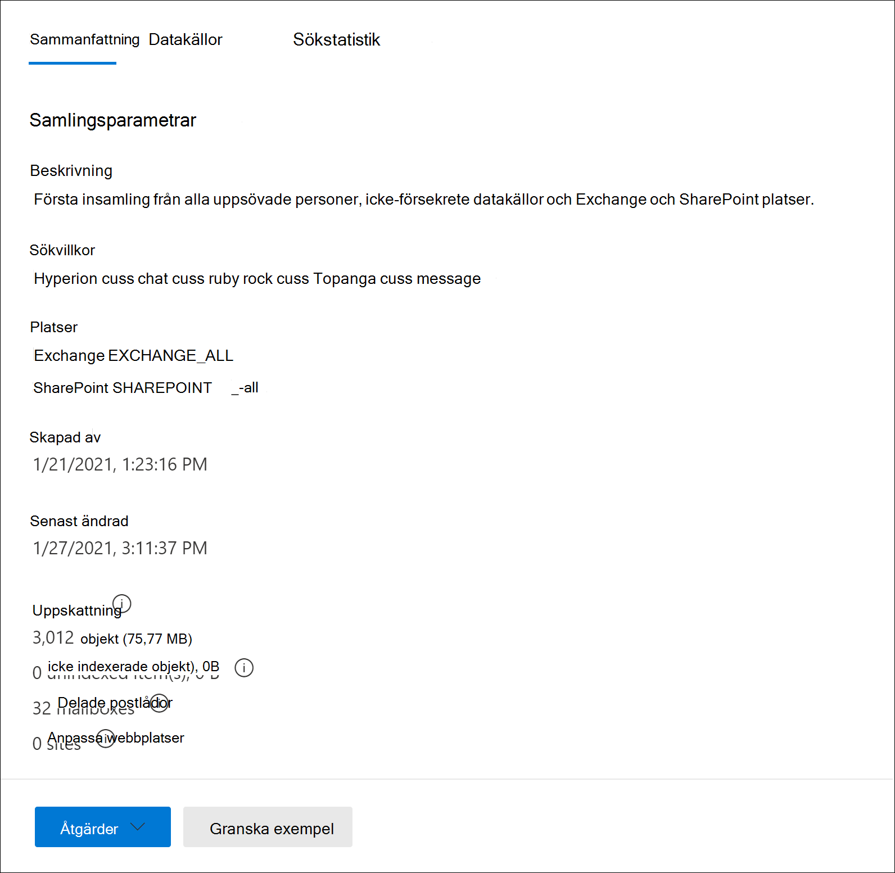
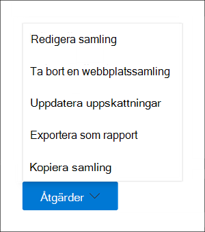

# Skapa ett utkast i Advanced eDiscoveryCreate a draft collection in Advanced eDiscovery

När du har identifierat dokument dokument och andra icke-dokumentbaserade datakällor för ärendet är du redo att identifiera och hitta en uppsättning dokument som är relevanta.After you've identified custodians and any non-custodian data sources for the case, you're ready to identify and locate a set of documents that are relevant. Det gör du genom att använda verktyget Samlingar för att söka efter relevant innehåll i datakällor.You do this by using the Collections tool to search data sources for relevant content. Det gör du genom att skapa en samling som söker i angivna datakällor efter innehåll som matchar dina sökvillkor.You do this by creating a collection that searches specified data sources for content that matches your search criteria. Du kan skapa ett utkast med en uppskattning av objekten, eller så kan du skapa en samling som automatiskt lägger till objekt i en granskningsuppsättning.You have the option to create a *draft collection*, which is an estimate of the items are found or you can create a collection that automatically adds the items to a review set. När du skapar en utkastsamling kan du visa information om det uppskattade resultat som matchade sökfrågan, till exempel det totala antalet hittade objekt och storleken på de hittade objekten, de olika datakällorna där de hittades och statistik om sökfrågan.When you create a draft collection, you can views information about the estimated results that matched the search query, such as the total number and size of items found, the different data sources where they were found, and statistics about the search query. Du kan också förhandsgranska ett exempel på objekt som har returnerats av samlingen.You can also preview a sample of items that were returned by the collection. Med hjälp av den här statistiken kan du ändra sökfrågan och köra utkastsamlingen igen för att begränsa resultatet.Using these statistics, you can change the search query and rerun the draft collection to narrow your results. När du är nöjd med samlingsresultatet kan du bekräfta samlingen i en granskningsuppsättning.Once you're satisfied with the collection results, you can commit the collection to a review set. När du åtar dig att skapa ett utkast kommer de objekt som returneras av samlingen att läggas till i en granskningsuppsättning för granskning, analys och export.When you commit a draft collection, the items returned by the collection are added to a review set for review, analysis, and export.

## Innan du skapar en utkastsamlingBefore you create a draft collection

- Lägg till andrekterare och icke-tilläggsdatakällor till ärendet innan du skapar ett utkast till en samling.Add custodians and non-custodial data sources to the case before you create a draft collection. Detta krävs för att du ska kunna välja datakällor när du skapar ett utkast till en samling.This is required so that you can select the data sources when you create a draft collection. Mer information finns i:For more information, see:

  - [Lägga till dokumentägare i ett ärendeAdd custodians to a case](add-custodians-to-case.md)

  - [Lägga till datakällor utan dokumentägare i ett ärendeAdd non-custodial data sources to a case](non-custodial-data-sources.md)

- Du kan söka efter ytterligare datakällor (sådana som inte har lagts till i ärendet som förfallna platser eller platser där de inte finns tillgängliga) i en utkastsamling efter innehåll som kan vara relevant för ärendet.You can search additional data sources (ones that haven't been added to the case as custodial or non-custodial locations) in a draft collection for content that may be relevant to the case. Dessa datakällor kan omfatta postlådor, SharePoint webbplatser och Teams.These data sources might include mailboxes, SharePoint sites, and Teams. Om det här är relevant för ditt ärende ska du sammanställa en lista över dessa datakällor så att du kan lägga till dem i samlingen.If this situation is applicable to your case, compile a list of these data sources so you can add them to the collection.

## Skapa en utkastsamlingCreate a draft collection

1. I Microsoft 365 säkerhets- och efterlevnadscenter öppnar Advanced eDiscovery och väljer sedan **fliken** Samlingar.In the Microsoft 365 compliance center, open the Advanced eDiscovery case, and then select the **Collections** tab.

2. På sidan **Samlingar** väljer du **Ny samling**  >  **Standardsamling**.On the **Collections** page, select **New collection** > **Standard collection**.

3. Skriv ett namn (obligatoriskt) och en beskrivning (valfritt) för samlingen.Type a name (required) and description (optional) for the collection. När samlingen har skapats kan du inte ändra namnet, men du kan ändra beskrivningen.After the collection is created, you can't change the name, but you can modify the description.

4. Gör något **av följande på sidan** Autentiseringsdatakällor om du vill identifiera de autentiseringsdatakällor som du vill samla in innehåll från:On the **Custodial data sources** page, do one of the following things to identify the custodial data sources to collect content from:

   - Klicka **på Välj vårdnadshavare om** du vill söka i specifika bibliotek som lagts till i ärendet.Click **Select custodians** to search specific custodians that were added to the case. Om du använder det här alternativet visas en lista över de objekt som inte kan det.If you use this option, a list of the case custodians is displayed. Välj en eller flera vårdnadshavare.Select one or more custodians. När du har valt och lagt till programianerna kan du också välja specifika datakällor för att söka efter varje enskild person.After you select and add the custodians, you can also select the specific data sources to search for each custodian. Dessa datakällor som visas har angetts när den som var den som förser meddelandet lades till i ärendet.These data sources that are displayed were specified when the custodian was added to the case.

   - Klicka på **växlingsknappen** Markera alla för att söka i alla objekt som lagts till i ärendet.Click the **Select all** toggle to search all custodians that were added to the case. När du väljer det här alternativet söks alla datakällor för alla objekt i biblioteken igenom.When you select this option, all data sources for all custodians are searched.

5. På sidan **Icke-uppslagna datakällor** gör du något av följande för att identifiera de datakällor som inte är avsides och samlar in innehåll från:On the **Non-custodial data sources** page, do one of the following things to identify the non-custodial data sources to collect content from:

   - Klicka **på Markera icke-förfallna datakällor** om du vill välja specifika datakällor som inte är aktuella och som har lagts till i ärendet.Click **Select non-custodial data sources** to select specific non-custodial data sources that were added to the case. Om du använder det här alternativet visas en lista med datakällor.If you use this option, a list of data sources displayed. Markera en eller flera av dessa datakällor.Select one or more of these data sources.

   - Klicka på **växlingsknappen** Markera alla om du vill markera alla icke-förfallna datakällor som lagts till i ärendet.Click the **Select all** toggle to select all non-custodial data sources that were added to the case.

6. På sidan **Ytterligare datakällor** kan du välja andra postlådor och webbplatser att söka efter som en del av samlingen.On the **Additional data sources** page, you can select other mailboxes and sites to search as part of the collection. Dessa typer av datakällor lades inte till som förfallna eller icke-förfallna dataplatser.These types of data sources weren't added as custodial or non-custodial data locations in the case. Du har också två alternativ när du söker i ytterligare datakällor:You also have two options when searching additional data sources:

   - Om du vill söka efter en viss tjänst på alla innehållsplatser (Exchange-postlådor, SharePoint- och OneDrive-webbplatser eller Exchange gemensamma mappar) klickar du på motsvarande **Markera** alla i **kolumnen Status.**To search all content locations for a specific service (Exchange mailboxes, SharePoint and OneDrive sites, or Exchange public folders), click the corresponding **Select all** toggle in the **Status** column. Med det här alternativet söker du efter alla innehållsplatser i den valda tjänsten.This option will search all content locations in the selected service.

   - Om du vill söka efter en  specifik innehållsplats för en tjänst klickar du på motsvarande Växlingsknapp Markera alla  i kolumnen **Status** och klickar sedan på **Användare,** grupper eller team (för Exchange-postlådor) eller Välj webbplatser för (SharePoint- och OneDrive-webbplatser) för att söka efter specifika innehållsplatser.To search specific content location for a service, click the corresponding **Select all** toggle in the **Status** column, and then click **Users, groups or teams** (for Exchange mailboxes) or **Choose sites** for (SharePoint and OneDrive sites) to search specific content locations.

7. På sidan **Villkor** kan du skapa sökfrågan som används för att samla in objekt från de datakällor som du har identifierat på tidigare sidor i guiden.On the **Conditions** page, you can create the search query that is used to collect items from the data sources that you've identified in the previous wizard pages. Du kan söka efter nyckelord, property:value-par eller använda en nyckelordslista.You can search for keywords, property:value pairs, or use a keyword list. Du kan också lägga till olika sökvillkor för att begränsa samlingens omfattning.You can also add various search conditions to narrow the scope of the collection. Mer information finns i [Skapa sökfrågor för samlingar.](building-search-queries.md)For more information, see [Build search queries for collections](building-search-queries.md).

8. På sidan **Spara som utkast eller lägg till i granskningsuppsättning** väljer du Spara samling som **utkast**.On the **Save as draft or add to review set** page, select **Save collection as draft**.

   > [!NOTE]
   > Med det andra alternativet på den här sidan kan du samla in objekt och lägga till dem direkt i en granskningsuppsättning.The other option on this page lets you collect items and add them direct to a review set. I stället för att skapa en utkastsamling som du kan granska statistik för och förhandsgranska ett urval av samlingsresultatet hoppar det här alternativet över processen och lägger automatiskt till samlingen i en granskningsuppsättning.Instead of creating a draft collection that you can review statistics for and preview a sample of the collection results, this option skips that process and automatically adds the collection to a review set. Om du väljer det andra alternativet för att lägga till samlingen i en granskningsuppsättning har du ytterligare inställningar att konfigurera, till exempel samla in hela chattkonversationstrådar i Microsoft Teams och Yammer och samla in molnbilagor (kallas även moderna bifogade *filer).*If you select the second option to add the collection to a review set, you have additional settings to configure, such as collecting entire chat conversation threads in Microsoft Teams and Yammer and collecting cloud attachments (also called *modern attachments*). Mer information om de här inställningarna finns i [Spara ett utkast till en granskningsuppsättning](commit-draft-collection.md).For more information about these settings, see [Commit a draft collection to a review set](commit-draft-collection.md).

9. På sidan **Granska din** samling kan du granska och uppdatera de samlingsinställningar som du konfigurerat på föregående sidor.On the **Review your collection** page, you can review and update the collection settings that you configured on the previous pages.

   -  Sammanfattningsflik: Granska och ändra namn och beskrivning för samlingen, sökvillkoren för samlingen, ytterligare dataplatser och samlingstypen.**Summary** tab:  Review and modify the name and description of the collection, the collection search criteria, additional data locations, and the collection type.

   - **Fliken** Källor: Granska och ändra uppslagna och icke-uppsmövade datakällor för samlingen.**Sources** tab: Review and modify the custodial and non-custodial data sources for the collection.

10. Klicka **på Skicka** för att skapa utkastsamlingen.Click **Submit** to create the draft collection. En sida visas som bekräftar att samlingen har skapats.A page is displayed confirming that the collection was created.

## Vad händer när du har skapat en utkastsamlingWhat happens after you create a draft collection

När du har skapat en utkastsamling visas den på aktuella sidan Samlingar och statusen visar att den pågår. After you create a draft collection, it listed on the **Collections** page in the case and the status shows that it's in progress. Ett jobb med **namnet Förbereda förhandsgranskning och** uppskattningar skapas och visas också på **sidan** Jobb för ärendet.A job named **Preparing search preview and estimates** is also created and displayed on the **Jobs** page in the case.

Under utkastsamlingsprocessen utför Advanced eDiscovery en sökberäkning med hjälp av de sökvillkor och datakällor som du angav i samlingen.During the draft collection process, Advanced eDiscovery performs a search estimate using the search criteria and data sources that you specified in the collection. Advanced eDiscovery förbereder också ett urval av objekt som du kan förhandsgranska.Advanced eDiscovery also prepares a sampling of items that you can preview. När samlingen är klar uppdateras följande kolumner och motsvarande värden **på** sidan Samling:When the collection is complete, the following columns and corresponding values on the **Collection** page are updated:

- **Status**: Anger status och typ av samling.**Status**: Indicates the status and type of collection. Värdet Uppskattad **anger att** ett utkast har slutförts.A value of **Estimated** indicates that a draft collection is complete. Samma värde anger också att samlingen är ett utkast och att den inte har lagts till i en granskningsuppsättning.This same value also indicates that the collection is a draft collection, and that it hasn't been added to a review set. Värdet Committed **i kolumnen** Status **anger** att samlingen har lagts till i en granskningsuppsättning.A value of **Committed** in the **Status** column indicates that the collection has been added to a review set.

- **Uppskattningsstatus:** Anger statusen för de uppskattade sökresultaten och om sökberäkningarna och statistiken är klara att granskas.**Estimate status**: Indicates the status of the estimated search results and whether or not the search estimates and statistics are ready for review. Värdet Lyckades **anger att** resultatet av utkastsamlingen är klart för granskning.A value of **Successful** indicates the results of the draft collection are ready for review. När du först skickar in en utkastsamling visas värdet **Pågår** för att visa att samlingen fortfarande körsAfter you first submit a draft collection, a value of **In progress** is displayed to indicate the collection is still running

- **Förhandsgranskningsstatus:** Anger statusen för de exempelobjekt som du kan förhandsgranska.**Preview status**: Indicates the status of the sample items that you can preview. Värdet Lyckades **anger att** objekten är klara för förhandsgranskning.A value of **Successful** indicates the items are ready for preview. När du först skickar in en utkastsamling visas värdet **Pågår** för att indikera att samlingen fortfarande körs.After you first submit a draft collection, a value of **In progress** is displayed to indicate that the collection is still running.

## Nästa steg när en utkastsamling är klarNext steps after a draft collection is complete

När utkastsamlingen är klar kan du utföra olika uppgifter.After the draft collection is successfully completed, you can perform various tasks. För att utföra de flesta av dessa uppgifter går du till **fliken** Samlingar och klickar på namnet på utkastsamlingen för att visa den utfällade sidan.To perform most of these tasks, just go the **Collections** tab and click the name of the draft collection to display the flyout page.

Här är en lista över saker du kan göra från samlingssidan:Here's a list of things you can do from the collection flyout page:

- Välj fliken **Sammanfattning** för att visa sammanfattningsinformation om samlingen och det uppskattade sökresultatet som returneras av samlingen.Select the **Summary** tab to view summary information about the collection and the estimated search results returned by the collection. Det omfattar det totala antalet objekt och storleken på det uppskattade sökresultatet, antalet postlådor och webbplatser som innehåller sökresultat och sökvillkoren (om de används) som används för samlingens omfattning.This includes that total number of items and size of the estimated search results, the number of mailboxes and sites contained search results, and the search conditions (if used) used to scope the collection.

- Välj fliken **Datakällor** om du vill visa en lista över objekt som inte är inskanningsdatakällor som har sökts igenom i samlingen.Select the **Data sources** tab to view a list of custodians and non-custodial data sources) that were searched in the collection. Alla ytterligare innehållsplatser som har sökts visas under **Platser** **på** fliken Sammanfattning.Any additional content locations that were search are listed under **Locations** on the **Summary** tab.

- Välj fliken **Sök i** statistik om du vill visa statistik om samlingen.Select the **Search statistics** tab to view statistics about the collection. Det här omfattar det totala antalet och storleken på objekten i varje tjänst (till exempel Exchange-postlådor eller SharePoint-webbplatser) och en villkorsrapport som visar statistik om antalet objekt som returneras av olika komponenter i sökfrågan som används av samlingen.This includes the total number and size of items found in each service (for example, Exchange mailboxes or SharePoint sites) and a condition report that displays statistics about the number of items returned by different components of the search query used by the collection. Mer information finns i Insamling [av statistik och rapporter.](collection-statistics-reports.md)For more information, see [Collection statistics and reports](collection-statistics-reports.md).

- Klicka **på Granska exempel** (längst ned på den utfällade sidan) om du vill förhandsgranska ett exempel på de objekt som returneras av samlingen.Click **Review sample** (located at the bottom of the flyout page) to preview a sample of the items returned by the collection.

- Spara utkastsamlingen i en granskningsuppsättning (genom att klicka på   >  **Åtgärder, redigera samling**).Commit the draft collection to a review set (by clicking **Actions** > **Edit collection**). Det innebär att du kör samlingen igen (med de aktuella inställningarna) och lägger till de objekt som returneras av samlingen i en granskningsuppsättning.This means that you rerun the collection (using the current settings) and add the items returned by the collection to a review set. Som tidigare förklarats kan du också konfigurera ytterligare inställningar (till exempel konversationstrådning och molnbaserade bifogade filer) när du lägger till samlingen i en granskningsuppsättning.As previously explained, you can also configure additional settings (such as conversation threading and cloud-based attachments) when you add the collection to a review set. Mer information och stegvisa instruktioner finns i Spara ett utkast till en uppsättning [granskare.](commit-draft-collection.md)For more information and step-by-step instructions, see [Commit a draft collection to a review set](commit-draft-collection.md).

## Hantera en utkastsamlingManage a draft collection

Du kan använda alternativen i menyn **Åtgärder på** den utfällade sidan i en utkastsamling till att utföra olika hanteringsuppgifter.You can use the options in the **Actions** menu on the flyout page of a draft collection to perform various management tasks.

Här är beskrivningar av hanteringsalternativen.Here's are descriptions of the management options.

- **Redigera samling:** Ändra inställningarna för utkastsamlingen.**Edit collection**: Change the settings of the draft collection. När du har gjort ändringar kan du köra samlingen igen och uppdatera sökberäkningarna och statistiken.After you make changes, you can rerun the collection and update the search estimates and statistics. Som tidigare förklarats använder du det här alternativet för att bekräfta en utkastsamling i en granskningsuppsättning.As previously explained, you use this option to commit a draft collection to a review set.  

- **Ta bort samling**: Ta bort en utkastsamling.**Delete collection**: Delete a draft collection. Observera att när en utkastsamling har satts in i en granskningsuppsättning kan den inte tas bort.Note that after a draft collection is committed to a review set, it can't be deleted.

- **Uppdatera uppskattningar:** Kör frågan igen (mot datakällorna) som anges i utkastsamlingen för att uppdatera sökuppskattningar och statistik.**Refresh estimates**: Rerun the query (against the data sources) specified in the draft collection to update the search estimates and statistics.

- **Exportera som rapport:** Exporterar information om utkastsamlingen till en CSV-fil som du kan ladda ned till din lokala dator.**Export as report**: Exports information about the draft collection to a CSV file that you can download to your local computer. Exportrapporten innehåller följande information:The export report contains the following information:

  - Identiteten för varje innehållsplats som innehåller objekt som matchar sökfrågan i utkastsamlingen.The identity of each content location that contains items that match the search query in the draft collection. De här platserna är vanligtvis postlådor eller webbplatser.These locations are typically mailboxes or sites.
  
  - Det totala antalet objekt på varje innehållsplats.The total number of items in each content location.
  
  - Den totala storleken (i byte) på objekten på varje innehållsplats.The total size (in bytes) of the items in each content location.

  - Tjänsten (till exempel Exchange eller SharePoint) där innehållsplatsen finns.The service (such as Exchange or SharePoint) in which the content location is located.

- **Kopiera samling:** Skapa en ny utkastsamling genom att kopiera inställningarna från en befintlig samling.**Copy collection**: Create a new draft collection by copying the settings from an existing collection. Du måste använda ett annat namn för den nya samlingen.You have to use a different name for the new collection. Du kan också ändra inställningarna innan du skickar in den nya samlingen.You also have the option to modify the settings before you submit the new collection. När du har skickat in den körs sökfrågan och nya uppskattningar och statistik genereras.After you submit it, the search query is run and new estimates and statistics are generated. Det här är ett bra sätt att snabbt skapa ytterligare utkastsamling och sedan ändra valda inställningar efter behov, samtidigt som informationen i den ursprungliga samlingen bevaras.The is a good way to quickly create additional draft collection and then modify selected settings as necessary while still preserving information in the original collection. På så sätt kan du också enkelt jämföra resultatet av två liknande samlingar.This also lets you easily compare the results of two similar collections.

> [!NOTE]
> När en utkastsamling har angetts för en granskningsuppsättning kan du bara kopiera samlingen och exportera en rapport.After a draft collection is committed to a review set, you can only copy the collection and export a report.
