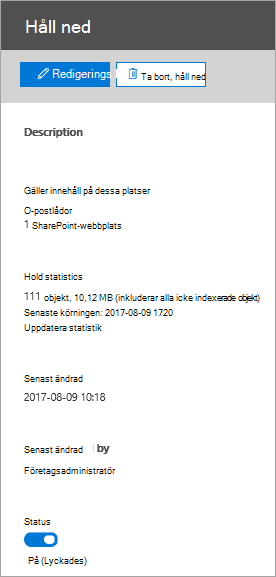

# <a name="create-an-ediscovery-hold"></a><span data-ttu-id="4c2c8-103">Skapa en eDiscovery-hold</span><span class="sxs-lookup"><span data-stu-id="4c2c8-103">Create an eDiscovery hold</span></span>

<span data-ttu-id="4c2c8-104">Du kan använda ett grundläggande eDiscovery-ärende för att skapa innehåll som kan vara relevant för ärendet.</span><span class="sxs-lookup"><span data-stu-id="4c2c8-104">You can use a Core eDiscovery case to create holds to preserve content that might be relevant to the case.</span></span> <span data-ttu-id="4c2c8-105">Du kan skapa ett väntande Exchange postlådor OneDrive för företag konton för personer som du undersöker i ärendet.</span><span class="sxs-lookup"><span data-stu-id="4c2c8-105">You can place a hold on the Exchange mailboxes and OneDrive for Business accounts of people you're investigating in the case.</span></span> <span data-ttu-id="4c2c8-106">Du kan också skapa ett hold för postlådor och webbplatser som är kopplade till Microsoft Teams, Office 365 Grupper och Yammer Grupper.</span><span class="sxs-lookup"><span data-stu-id="4c2c8-106">You can also place a hold on the mailboxes and sites that are associated with Microsoft Teams, Office 365 Groups, and Yammer Groups.</span></span> <span data-ttu-id="4c2c8-107">När du placerar innehållsplatser i en lista behålls innehållet tills du tar bort det från innehållsplatsen eller tills du tar bort det.</span><span class="sxs-lookup"><span data-stu-id="4c2c8-107">When you place content locations on hold, content is preserved until you remove the hold from the content location or until you delete the hold.</span></span>

<span data-ttu-id="4c2c8-108">När du har skapat ett eDiscovery-håll kan det ta upp till 24 timmar innan holden verkställs.</span><span class="sxs-lookup"><span data-stu-id="4c2c8-108">After you create an eDiscovery hold, it may take up to 24 hours for the hold to take effect.</span></span> 

<span data-ttu-id="4c2c8-109">När du skapar ett område kan du välja mellan följande alternativ för att begränsa innehållet som bevaras på de angivna innehållsplatserna:</span><span class="sxs-lookup"><span data-stu-id="4c2c8-109">When you create a hold, you have the following options to scope the content that is preserved in the specified content locations:</span></span>
  
- <span data-ttu-id="4c2c8-110">Du skapar ett oändligt område där allt innehåll på de angivna platserna har satts på en plats.</span><span class="sxs-lookup"><span data-stu-id="4c2c8-110">You create an infinite hold where all content in the specified locations is placed on hold.</span></span> <span data-ttu-id="4c2c8-111">Alternativt kan du skapa ett frågebaserat område där endast innehållet på de angivna platserna som matchar en sökfråga har satts i hold-läge.</span><span class="sxs-lookup"><span data-stu-id="4c2c8-111">Alternatively, you can create a query-based hold where only the content in the specified locations that matches a search query is placed on hold.</span></span>

- <span data-ttu-id="4c2c8-112">Du kan ange ett datumintervall för att endast bevara innehållet som har skickats, tagits emot eller skapats inom det datumintervallet.</span><span class="sxs-lookup"><span data-stu-id="4c2c8-112">You can specify a date range to preserve only the content that was sent, received, or created within that date range.</span></span> <span data-ttu-id="4c2c8-113">Alternativt kan du hålla allt innehåll på angivna platser oavsett när det skickades, togs emot eller skapades.</span><span class="sxs-lookup"><span data-stu-id="4c2c8-113">Alternatively, you can hold all content in specified locations regardless of when it was sent, received, or created.</span></span>
  
## <a name="how-to-create-an-ediscovery-hold"></a><span data-ttu-id="4c2c8-114">Så här skapar du ett eDiscovery-håll</span><span class="sxs-lookup"><span data-stu-id="4c2c8-114">How to create an eDiscovery hold</span></span>

<span data-ttu-id="4c2c8-115">Så här skapar du ett eDiscovery-värde som är kopplat till ett Core eDiscovery-ärende:</span><span class="sxs-lookup"><span data-stu-id="4c2c8-115">To create an eDiscovery hold that's associated with a Core eDiscovery case:</span></span>
  
1. <span data-ttu-id="4c2c8-116">Gå till [https://compliance.microsoft.com](https://compliance.microsoft.com) och logga in med inloggningsuppgifterna för användarkontot som har tilldelats lämpliga eDiscovery-behörigheter.</span><span class="sxs-lookup"><span data-stu-id="4c2c8-116">Go to [https://compliance.microsoft.com](https://compliance.microsoft.com) and sign in using the credentials for user account that has been assigned the appropriate eDiscovery permissions.</span></span>

2. <span data-ttu-id="4c2c8-117">I det vänstra navigeringsfönstret i Microsoft 365 kompatibilitetscenter klickar du på Visa alla **och** sedan på **eDiscovery > Core**.</span><span class="sxs-lookup"><span data-stu-id="4c2c8-117">In the left navigation pane of the Microsoft 365 compliance center, click **Show all**, and then click **eDiscovery > Core**.</span></span>

3. <span data-ttu-id="4c2c8-118">På sidan **Bas-e-dataidentifiering** markerar du det ärende du vill skapa plats för och klickar sedan på **Öppna ärende.**</span><span class="sxs-lookup"><span data-stu-id="4c2c8-118">On the **Core eDiscovery** page, select the case that you want to create the hold in, and then click **Open case**.</span></span>

4. <span data-ttu-id="4c2c8-119">På startsidan **för** ärendet klickar du på fliken **Spärrar.**</span><span class="sxs-lookup"><span data-stu-id="4c2c8-119">On the **Home** page for the case, click the **Holds** tab.</span></span>
  
5. <span data-ttu-id="4c2c8-120">På sidan **Som innehåller** klickar du på **Skapa**.</span><span class="sxs-lookup"><span data-stu-id="4c2c8-120">On the **Holds** page, click **Create**.</span></span>

6. <span data-ttu-id="4c2c8-121">På sidan **Namnge din hold-guide** ger du plats åt sidan ett namn, lägger till en valfri beskrivning och klickar sedan på **Nästa.**</span><span class="sxs-lookup"><span data-stu-id="4c2c8-121">On the **Name your hold** wizard page, give the hold a name and add an optional description, and then click **Next**.</span></span> <span data-ttu-id="4c2c8-122">Namnet på det hållna måste vara unikt inom organisationen.</span><span class="sxs-lookup"><span data-stu-id="4c2c8-122">The name of the hold must be unique in your organization.</span></span>

7. <span data-ttu-id="4c2c8-123">På **sidan Innehållsplatser** väljer du de innehållsplatser som du vill skapa en plats för.</span><span class="sxs-lookup"><span data-stu-id="4c2c8-123">On the **Content locations** page, choose the content locations that you want to place on hold.</span></span> <span data-ttu-id="4c2c8-124">Du kan placera postlådor, webbplatser och gemensamma mappar i arkivet.</span><span class="sxs-lookup"><span data-stu-id="4c2c8-124">You can place mailboxes, sites, and public folders on hold.</span></span>

    
  
   1. <span data-ttu-id="4c2c8-126">**Postlådeplatser** – Klicka på Välj **användare,** grupper eller team och klicka sedan på Välj **användare,** grupper eller team igen för att ange vilka postlådor som ska vara på plats.</span><span class="sxs-lookup"><span data-stu-id="4c2c8-126">**Mailbox locations** - Click **Choose users, groups, or teams** and then click **Choose users, groups, or teams** again to specify the mailboxes to place on hold.</span></span> <span data-ttu-id="4c2c8-127">Använd sökrutan för att hitta användarnas postlådor och distributionsgrupper (för att skapa ett väntande på postlådorna för gruppmedlemmar).</span><span class="sxs-lookup"><span data-stu-id="4c2c8-127">Use the search box to find user mailboxes and distribution groups (to place a hold on the mailboxes of group members) to place on hold.</span></span> <span data-ttu-id="4c2c8-128">Du kan också placera ett is i den associerade postlådan för en Microsoft-grupp, Office 365 grupp eller Yammer grupp.</span><span class="sxs-lookup"><span data-stu-id="4c2c8-128">You can also place a hold on the associated mailbox for a Microsoft Team, Office 365 Group, or Yammer Group.</span></span> <span data-ttu-id="4c2c8-129">Markera kryssrutan användare, grupp och grupp, klicka **på Välj** och klicka sedan på **Klar**.</span><span class="sxs-lookup"><span data-stu-id="4c2c8-129">Select the user, group, team check box, click **Choose**, and then click **Done**.</span></span>

   1. <span data-ttu-id="4c2c8-130">**Webbplatser – Klicka** på Välj **webbplatser** och klicka sedan på Välj **webbplatser** igen för att ange vilka SharePoint OneDrive-konton som ska vara i lager.</span><span class="sxs-lookup"><span data-stu-id="4c2c8-130">**Site locations** - Click **Choose sites** and then click **Choose sites** again to specify SharePoint and OneDrive accounts to place on hold.</span></span> <span data-ttu-id="4c2c8-131">Skriv URL-adressen för varje webbplats som du vill skapa en plats för.</span><span class="sxs-lookup"><span data-stu-id="4c2c8-131">Type the URL for each site that you want to place on hold.</span></span> <span data-ttu-id="4c2c8-132">Du kan också lägga till URL-adressen för SharePoint för ett Microsoft-team, en Office 365 grupp eller en Yammer grupp.</span><span class="sxs-lookup"><span data-stu-id="4c2c8-132">You can also add the URL for the SharePoint site for a Microsoft Team, Office 365 Group or a Yammer Group.</span></span> <span data-ttu-id="4c2c8-133">Klicka **på** Välj och sedan på **Klar**.</span><span class="sxs-lookup"><span data-stu-id="4c2c8-133">Click **Choose**, and then click **Done**.</span></span>
  
   1. <span data-ttu-id="4c2c8-134">**Exchange gemensamma mappar.**</span><span class="sxs-lookup"><span data-stu-id="4c2c8-134">**Exchange public folders.**</span></span> <span data-ttu-id="4c2c8-135">Flytta växlingsknappen Växlingsknapp till positionen Alla för att sätta alla gemensamma mappar i  Exchange Online organisationen på plats. </span><span class="sxs-lookup"><span data-stu-id="4c2c8-135">Move the toggle switch  to the **All** position to put all public folders in your Exchange Online organization on hold.</span></span> <span data-ttu-id="4c2c8-136">Du kan inte välja att vissa gemensamma mappar ska vara på plats.</span><span class="sxs-lookup"><span data-stu-id="4c2c8-136">You can't choose specific public folders to put on hold.</span></span> <span data-ttu-id="4c2c8-137">Låt växlingsknappen vara inställd **på** Ingen om du inte vill använda gemensamma mappar.</span><span class="sxs-lookup"><span data-stu-id="4c2c8-137">Leave the toggle switch set to **None** if you don't want to put a hold on public folders.</span></span>

   > [!NOTE]
   > <span data-ttu-id="4c2c8-138">Du måste lägga till minst en innehållsplats i rymmert.</span><span class="sxs-lookup"><span data-stu-id="4c2c8-138">You must add at least one content location to the hold.</span></span> <span data-ttu-id="4c2c8-139">Annars kommer hållna eDiscovery-innehåll att visa att inga objekt är på plats.</span><span class="sxs-lookup"><span data-stu-id="4c2c8-139">Otherwise, the eDiscovery hold statics will show that no items are on hold.</span></span>

8. <span data-ttu-id="4c2c8-140">När du är klar med att lägga till innehållsplatser i rymmer klickar du på **Nästa**.</span><span class="sxs-lookup"><span data-stu-id="4c2c8-140">When you're done adding content locations to the hold, click **Next**.</span></span>

9. <span data-ttu-id="4c2c8-141">Så här skapar du ett frågebaserat tillstånd med villkor:</span><span class="sxs-lookup"><span data-stu-id="4c2c8-141">To create a query-based hold with conditions, complete the following.</span></span> <span data-ttu-id="4c2c8-142">Annars klickar du på Nästa om du vill behålla allt innehåll på de angivna **innehållsplatserna.**</span><span class="sxs-lookup"><span data-stu-id="4c2c8-142">Otherwise, to preserve all content in the specified content locations, click **Next**.</span></span>

    
  
    1. <span data-ttu-id="4c2c8-144">Skriv en sökfråga **i** rutan under Nyckelord så att endast det innehåll som uppfyller sökvillkoren bevaras.</span><span class="sxs-lookup"><span data-stu-id="4c2c8-144">In the box under **Keywords**, type a search query so that only the content that meets the search criteria is preserved.</span></span> <span data-ttu-id="4c2c8-145">Du kan ange nyckelord, egenskaper för e-postmeddelanden och dokumentegenskaper, till exempel filnamn.</span><span class="sxs-lookup"><span data-stu-id="4c2c8-145">You can specify keywords, email message properties, or document properties, such as file names.</span></span> <span data-ttu-id="4c2c8-146">Du kan också använda mer komplexa frågor som använder en boolesk operator som **AND**, **OR** eller **NOT.**</span><span class="sxs-lookup"><span data-stu-id="4c2c8-146">You can also use more complex queries that use a Boolean operator, such as **AND**, **OR**, or **NOT**.</span></span>

    1. <span data-ttu-id="4c2c8-147">Klicka **på Lägg till** villkor om du vill lägga till ett eller flera villkor för att begränsa sökningen efter holden.</span><span class="sxs-lookup"><span data-stu-id="4c2c8-147">Click **Add conditions** to add one or more conditions to narrow the search query for the hold.</span></span> <span data-ttu-id="4c2c8-148">Varje villkor lägger till en sats i KQL-sökfrågan som skapas och körs när du skapar villkoret.</span><span class="sxs-lookup"><span data-stu-id="4c2c8-148">Each condition adds a clause to the KQL search query that is created and run when you create the hold.</span></span> <span data-ttu-id="4c2c8-149">Du kan till exempel ange ett datumintervall så att e-post- eller webbplatsdokument som skapats inom det datumintervallet sätts på plats.</span><span class="sxs-lookup"><span data-stu-id="4c2c8-149">For example, you can specify a date range so that email or site documents that were created within the date ranged are placed on hold.</span></span> <span data-ttu-id="4c2c8-150">Ett villkor är logiskt kopplat till nyckelordsfrågan (anges i **rutan Nyckelord)** av **OPERATORN.**</span><span class="sxs-lookup"><span data-stu-id="4c2c8-150">A condition is logically connected to the keyword query (specified in the **Keywords** box) by the **AND** operator.</span></span> <span data-ttu-id="4c2c8-151">Det innebär att objekt måste uppfylla både nyckelordsfrågan och villkoret som ska bevaras.</span><span class="sxs-lookup"><span data-stu-id="4c2c8-151">That means that items have to satisfy both the keyword query and the condition to be preserved.</span></span>

    <span data-ttu-id="4c2c8-152">Mer information om hur du skapar en sökfråga och använder villkor finns [i Nyckelordsfrågor och sökvillkor för Innehållssökning.](keyword-queries-and-search-conditions.md)</span><span class="sxs-lookup"><span data-stu-id="4c2c8-152">For more information about creating a search query and using conditions, see [Keyword queries and search conditions for Content Search](keyword-queries-and-search-conditions.md).</span></span>

10. <span data-ttu-id="4c2c8-153">När du har konfigurerat ett frågebaserat håll klickar du på **Nästa.**</span><span class="sxs-lookup"><span data-stu-id="4c2c8-153">After configuring a query-based hold, click **Next**.</span></span>

11. <span data-ttu-id="4c2c8-154">Granska inställningarna (och redigera dem om det behövs) och klicka sedan på **Skapa det här standardinställningarna**.</span><span class="sxs-lookup"><span data-stu-id="4c2c8-154">Review your settings (and edit them if necessary), and then click **Create this hold**.</span></span>

## <a name="query-based-holds-placed-on-site-documents"></a><span data-ttu-id="4c2c8-155">Frågebaserade spärrade dokument i webbplatsdokument</span><span class="sxs-lookup"><span data-stu-id="4c2c8-155">Query-based holds placed on site documents</span></span>

<span data-ttu-id="4c2c8-156">Tänk på följande när du placerar ett frågebaserat eDiscovery-kvar på dokument som finns på SharePoint webbplatser:</span><span class="sxs-lookup"><span data-stu-id="4c2c8-156">Keep the following things in mind when you place a query-based eDiscovery hold on documents located in SharePoint sites:</span></span>

- <span data-ttu-id="4c2c8-157">Ett frågebaserat bevarande bevarar först alla dokument på en webbplats under en kort tidsperiod efter att de har tagits bort.</span><span class="sxs-lookup"><span data-stu-id="4c2c8-157">A query-based hold initially preserves all documents in a site for a short period of time after they are deleted.</span></span> <span data-ttu-id="4c2c8-158">Det innebär att när ett dokument tas bort flyttas det till biblioteket för bevarande av dokument även om det inte matchar villkoren för det frågebaserade bevarandet.</span><span class="sxs-lookup"><span data-stu-id="4c2c8-158">That means when a document is deleted, it will be moved to the Preservation Hold library even if it doesn't match the criteria of the query-based hold.</span></span> <span data-ttu-id="4c2c8-159">Men borttagna dokument som inte matchar ett frågebaserat bevarande tas bort med ett tidsinställt jobb som bearbetar biblioteket för bevarande av dokument.</span><span class="sxs-lookup"><span data-stu-id="4c2c8-159">However, deleted documents that don't match a query-based hold will be removed by a timer job that processes the Preservation Hold library.</span></span> <span data-ttu-id="4c2c8-160">Det tidsinställda jobbet körs regelbundet och jämför alla dokument i biblioteket för bevarande av dokument med de frågebaserade eDiscovery-objekten (och andra typer av kvarhållnings- och kvarhållningsprinciper).</span><span class="sxs-lookup"><span data-stu-id="4c2c8-160">The timer job runs periodically and compares all documents in the Preservation Hold library to your query-based eDiscovery holds (and other types of holds and retention policies).</span></span> <span data-ttu-id="4c2c8-161">Det tidsinställda jobbet tar bort de dokument som inte matchar ett frågebaserat bevarande och bevarar de dokument som gör det.</span><span class="sxs-lookup"><span data-stu-id="4c2c8-161">The timer job deletes the documents that don't match a query-based hold and preserves the documents that do.</span></span>

- <span data-ttu-id="4c2c8-162">Frågebaserade bevaranden ska inte användas för att bevara dokument i en viss mapp eller på en viss webbplats eller genom att använda andra platsbaserade bevarandevillkor.</span><span class="sxs-lookup"><span data-stu-id="4c2c8-162">Query-based holds should not be used to perform targeted preservation, like preserving documents in a specific folder or site or by using other location-based hold criteria.</span></span> <span data-ttu-id="4c2c8-163">Det kan leda till oavsiktliga resultat.</span><span class="sxs-lookup"><span data-stu-id="4c2c8-163">Doing so may have unintended results.</span></span> <span data-ttu-id="4c2c8-164">Vi rekommenderar att du använder icke-platsbaserade bevarandevillkor, till exempel nyckelord, datumintervall eller andra dokumentegenskaper för att bevara webbplatsdokumenten.</span><span class="sxs-lookup"><span data-stu-id="4c2c8-164">We recommend using non-location based hold criteria such as keywords, date ranges, or other document properties to preserve site documents.</span></span>

## <a name="ediscovery-hold-statistics"></a><span data-ttu-id="4c2c8-165">statistik för att bli insnäckt för e-dataidentifiering</span><span class="sxs-lookup"><span data-stu-id="4c2c8-165">eDiscovery hold statistics</span></span>

<span data-ttu-id="4c2c8-166">När du har skapat ett eDiscovery-hold visas information om det nya holden på den utfällande sidan för det markerade antalet.</span><span class="sxs-lookup"><span data-stu-id="4c2c8-166">After you create an eDiscovery hold, information about the new hold is displayed on the flyout page for the selected hold.</span></span> <span data-ttu-id="4c2c8-167">Den här informationen omfattar antalet postlådor och webbplatser som är på plats och statistik om innehållet som har satts i is hold, t.ex. det totala antalet och storleken på objekt som har placerats som väntande och den senaste gången statistik för hållen beräknades.</span><span class="sxs-lookup"><span data-stu-id="4c2c8-167">This information includes the number of mailboxes and sites on hold and statistics about the content that was placed on hold, such as the total number and size of items placed on hold and the last time the hold statistics were calculated.</span></span> <span data-ttu-id="4c2c8-168">Med hjälp av denna statistik över hållen kan du se hur mycket innehåll som är relaterat till ärendet bevaras.</span><span class="sxs-lookup"><span data-stu-id="4c2c8-168">These hold statistics help you identify the amount of content related to the case is being preserved.</span></span>
  

  
<span data-ttu-id="4c2c8-170">Tänk på följande när det gäller statistik för eDiscovery-plats:</span><span class="sxs-lookup"><span data-stu-id="4c2c8-170">Keep the following things in mind about eDiscovery hold statistics:</span></span>
  
- <span data-ttu-id="4c2c8-171">Det totala antalet objekt som är på plats anger antalet objekt från alla innehållskällor som har satts på plats.</span><span class="sxs-lookup"><span data-stu-id="4c2c8-171">The total number of items on hold indicates the number of items from all content sources that are placed on hold.</span></span> <span data-ttu-id="4c2c8-172">Om du har skapat ett frågebaserat rymmer visar den här statistiken antalet objekt som matchar frågan.</span><span class="sxs-lookup"><span data-stu-id="4c2c8-172">If you've created a query-based hold, this statistic indicates the number of items that match the query.</span></span>

- <span data-ttu-id="4c2c8-173">I antalet objekt som är i lager ingår även icke indexerade objekt på innehållsplatserna.</span><span class="sxs-lookup"><span data-stu-id="4c2c8-173">The number of items on hold also includes unindexed items found in the content locations.</span></span> <span data-ttu-id="4c2c8-174">Om du skapar ett frågebaserat rymmer sätts alla icke indexerade objekt på innehållsplatserna i lager.</span><span class="sxs-lookup"><span data-stu-id="4c2c8-174">If you create a query-based hold, all unindexed items in the content locations are placed on hold.</span></span> <span data-ttu-id="4c2c8-175">Det omfattar icke indexerade objekt som inte uppfyller sökvillkoren för ett frågebaserat område och icke indexerade objekt som kan hamna utanför ett datumintervallsvillkor.</span><span class="sxs-lookup"><span data-stu-id="4c2c8-175">This includes unindexed items that don't match the search criteria of a query-based hold and unindexed items that might fall outside of a date range condition.</span></span> <span data-ttu-id="4c2c8-176">Det här skiljer sig från vad som händer när du kör en sökning, där icke indexerade objekt som inte matchar sökfrågan eller utesluts av ett datumintervallvillkor inte tas med i sökresultaten.</span><span class="sxs-lookup"><span data-stu-id="4c2c8-176">This is different than what happens when you run a search, in which unindexed items that don't match the search query or are excluded by a date range condition aren't included in the search results.</span></span> <span data-ttu-id="4c2c8-177">Mer information om icke indexerade objekt finns i [Delvis indexerade objekt.](partially-indexed-items-in-content-search.md)</span><span class="sxs-lookup"><span data-stu-id="4c2c8-177">For more information about unindexed items, see [Partially indexed items](partially-indexed-items-in-content-search.md).</span></span>

- <span data-ttu-id="4c2c8-178">Du kan få fram den  senaste hållna statistiken genom att klicka på Uppdatera statistik för att köra en sökning igen och beräkna det aktuella antalet objekt som är väntande.</span><span class="sxs-lookup"><span data-stu-id="4c2c8-178">You can get the latest hold statistics by clicking **Update statistics** to rerun a search estimate that calculates the current number of items on hold.</span></span>

- <span data-ttu-id="4c2c8-179">Det är vanligt att antalet objekt som är väntande ökar med tiden eftersom användare vars postlåda eller webbplats är på plats ofta skickar eller tar emot nya e-postmeddelanden och skapar nya dokument i SharePoint och OneDrive.</span><span class="sxs-lookup"><span data-stu-id="4c2c8-179">It's normal for the number of items on hold to increase over time because users whose mailbox or site is on hold are typically sending or receiving new email message and creating new documents in SharePoint and OneDrive.</span></span>

- <span data-ttu-id="4c2c8-180">Om en Exchange-postlåda, SharePoint-webbplats eller OneDrive-konto flyttas till ett annat område i en geomiljö, tas inte statistiken för webbplatsen med i hold-statistiken.</span><span class="sxs-lookup"><span data-stu-id="4c2c8-180">If an Exchange mailbox, SharePoint site, or OneDrive account is moved to a different region in a multi-geo environment, the statistics for that site won't be included in the hold statistics.</span></span> <span data-ttu-id="4c2c8-181">Men innehållet på dessa platser kommer fortfarande att bevaras.</span><span class="sxs-lookup"><span data-stu-id="4c2c8-181">But the content in those locations will still be preserved.</span></span> <span data-ttu-id="4c2c8-182">Om en postlåda eller webbplats flyttas till en annan region uppdateras inte SMTP-adressen eller URL-adressen som visas i fältet automatiskt.</span><span class="sxs-lookup"><span data-stu-id="4c2c8-182">Also, if a mailbox or site is moved to a different region, the SMTP address or URL that's displayed in the hold will not automatically be updated.</span></span> <span data-ttu-id="4c2c8-183">Du måste redigera vänta och uppdatera URL- eller SMTP-adressen så att innehållsplatserna återigen tas med i hold-statistiken</span><span class="sxs-lookup"><span data-stu-id="4c2c8-183">You'll have to edit the hold and update the URL or SMTP address so the content locations are once again included in the hold statistics</span></span>

## <a name="search-locations-on-ediscovery-hold"></a><span data-ttu-id="4c2c8-184">Sökplatser vid eDiscovery-hold</span><span class="sxs-lookup"><span data-stu-id="4c2c8-184">Search locations on eDiscovery hold</span></span>

<span data-ttu-id="4c2c8-185">När du [söker efter innehåll](search-for-content-in-core-ediscovery.md) i ett grundläggande eDiscovery-ärende kan du snabbt konfigurera sökningen för att bara söka på de innehållsplatser som är kopplade till ärendet.</span><span class="sxs-lookup"><span data-stu-id="4c2c8-185">When you [search for content](search-for-content-in-core-ediscovery.md) in a Core eDiscovery case, you can quickly configure the search to only search the content locations that have been placed on a hold associated with the case.</span></span>


<span data-ttu-id="4c2c8-187">Välj alternativet **Platser som är väntande** för att söka efter allt innehåll som har satts i lager.</span><span class="sxs-lookup"><span data-stu-id="4c2c8-187">Select the **Locations on hold** option to search all the content locations that have been placed on hold.</span></span> <span data-ttu-id="4c2c8-188">Om ärendet innehåller flera eDiscovery-innehåll kommer innehållsplatserna från allt innehåll att genomsökas när du väljer det här alternativet.</span><span class="sxs-lookup"><span data-stu-id="4c2c8-188">If the case contains multiple eDiscovery holds, the content locations from all holds will be searched when you select this option.</span></span> <span data-ttu-id="4c2c8-189">Om en innehållsplats dessutom placerades på ett frågebaserat håll kommer endast de objekt som överensstämmer med frågan om att innehålla att sökas igenom när du kör sökningen.</span><span class="sxs-lookup"><span data-stu-id="4c2c8-189">Additionally, if a content location was placed on a query-based hold, only the items that match the hold query will be searched when you run the search.</span></span> <span data-ttu-id="4c2c8-190">Med andra ord returneras endast det innehåll som matchar både villkoret för kvarande och sökvillkoren sökresultatet.</span><span class="sxs-lookup"><span data-stu-id="4c2c8-190">In other words, only the content that matches both the hold criteria and the search criteria is returned with the search results.</span></span> <span data-ttu-id="4c2c8-191">Om en användare till exempel placerades i ett frågebaserat ärende som bevarar objekt som skickades eller skapades före ett visst datum skulle bara de objekten genomsökas.</span><span class="sxs-lookup"><span data-stu-id="4c2c8-191">For example, if a user was placed on query-based case hold that preserves items that were sent or created before a specific date, only those items would be searched.</span></span> <span data-ttu-id="4c2c8-192">Detta sker genom att koppla ärende hold query och sökfrågan av en **OCH-operator.**</span><span class="sxs-lookup"><span data-stu-id="4c2c8-192">This is accomplished by connecting the case hold query and the search query by an **AND** operator.</span></span>

<span data-ttu-id="4c2c8-193">Här är några andra saker att tänka på när du söker efter platser vid eDiscovery-hold:</span><span class="sxs-lookup"><span data-stu-id="4c2c8-193">Here are some other things to keep in mind when searching locations on eDiscovery hold:</span></span>

- <span data-ttu-id="4c2c8-194">Om en innehållsplats är en del av flera innehåll som  sätts i samma ärende kombineras frågorna av ELLER-operatorerna när du söker på innehållsplatsen med alternativet Allt ärendeinnehåll.</span><span class="sxs-lookup"><span data-stu-id="4c2c8-194">If a content location is part of multiple holds within the same case, the hold queries are combined by **OR** operators when you search that content location using the all case content option.</span></span> <span data-ttu-id="4c2c8-195">På samma sätt gäller att om en innehållsplats är en del av två olika innehåll, där en är frågebaserad och den andra är ett oändligt område (där allt innehåll är spärrat), blir allt innehåll sök på grund av det oändligt hållna.</span><span class="sxs-lookup"><span data-stu-id="4c2c8-195">Similarly, if a content location is part of two different holds, where one is query-based and the other is an infinite hold (where all content is placed on hold), then all content is search because of the infinite hold.</span></span>

- <span data-ttu-id="4c2c8-196">Om en sökning är konfigurerad till att söka efter platser som är väntande och du ändrar ett eDiscovery-värde för ärendet (genom att lägga till eller ta bort en plats eller ändra en fråga om att varan är väntad) uppdateras sökkonfigurationen med de ändringarna.</span><span class="sxs-lookup"><span data-stu-id="4c2c8-196">If a search is configured it to search locations on hold and then you change an eDiscovery hold in the case (by adding or removing a location or changing a hold query), the search configuration is updated with those changes.</span></span> <span data-ttu-id="4c2c8-197">Du måste dock köra sökningen igen efter att hållen ändrats för att uppdatera sökresultaten.</span><span class="sxs-lookup"><span data-stu-id="4c2c8-197">However, you have to rerun the search after the hold is changed to update the search results.</span></span>

- <span data-ttu-id="4c2c8-198">Om flera eDiscovery-platser som sätts på samma plats i ett e-dataidentifieringsfall och du väljer att söka platser som är spärrade är det maximala antalet nyckelord för sökfrågan 500.</span><span class="sxs-lookup"><span data-stu-id="4c2c8-198">If multiple eDiscovery holds are placed on a single location in an eDiscovery case and you select to search locations on hold, the maximum number of keywords for that search query is 500.</span></span> <span data-ttu-id="4c2c8-199">Det beror på att sökningen kombinerar alla frågebaserade rymmer genom att använda **operatorn** ELLER.</span><span class="sxs-lookup"><span data-stu-id="4c2c8-199">That's because the search combines all the query-based holds by using the **OR** operator.</span></span> <span data-ttu-id="4c2c8-200">Om det finns fler än 500 nyckelord i de kombinerade frågorna om spärrade frågor och sökfrågan genomsöks allt innehåll i postlådan, inte bara det innehåll som matchar det frågebaserade ärende som finns.</span><span class="sxs-lookup"><span data-stu-id="4c2c8-200">If there are more than 500 keywords in the combined hold queries and the search query, then all content in the mailbox is searched, not just that content that matches the query-based case holds.</span></span>

- <span data-ttu-id="4c2c8-201">Om ett håll för e-dataidentifiering har statusen Aktivera kan du fortfarande söka efter platser som är i väntläge medan väntningen är aktiverad. </span><span class="sxs-lookup"><span data-stu-id="4c2c8-201">If an eDiscovery hold has a status of **Turning on**, you can still search the locations on hold while the hold is being turned on.</span></span>

## <a name="preserve-content-in-microsoft-teams"></a><span data-ttu-id="4c2c8-202">Bevara innehåll i Microsoft Teams</span><span class="sxs-lookup"><span data-stu-id="4c2c8-202">Preserve content in Microsoft Teams</span></span>

<span data-ttu-id="4c2c8-203">Konversationer som ingår i en Microsoft Teams-kanal lagras i postlådan som är kopplad till Microsoft Team.</span><span class="sxs-lookup"><span data-stu-id="4c2c8-203">Conversations that are part of a Microsoft Teams channel are stored in the mailbox that's associated with the Microsoft Team.</span></span> <span data-ttu-id="4c2c8-204">På samma sätt lagras filer som gruppmedlemmar delar i en kanal på teamets SharePoint webbplats.</span><span class="sxs-lookup"><span data-stu-id="4c2c8-204">Similarly, files that team members share in a channel are stored on the team's SharePoint site.</span></span> <span data-ttu-id="4c2c8-205">Därför måste du placera grupppostlådan och SharePoint på eDiscovery-plats för att bevara konversationer och filer i en kanal.</span><span class="sxs-lookup"><span data-stu-id="4c2c8-205">Therefore, you have to place the Team mailbox and SharePoint site on eDiscovery hold to preserve conversations and files in a channel.</span></span>

<span data-ttu-id="4c2c8-206">Alternativt kan lagras konversationer som ingår i chattlistan i Teams (kallas *1:1-chattar* eller *1:N* gruppchattar) i postlådorna för de användare som deltar i chatten.</span><span class="sxs-lookup"><span data-stu-id="4c2c8-206">Alternatively, conversations that are part of the Chat list in Teams (called *1:1 chats* or *1:N group chats*) are stored in the mailboxes of the users who participate in the chat.</span></span> <span data-ttu-id="4c2c8-207">Och filer som användare delar i chattkonversationer lagras OneDrive användarens konto som delar filen.</span><span class="sxs-lookup"><span data-stu-id="4c2c8-207">And files that users share in chat conversations are stored in the OneDrive account of the user who shares the file.</span></span> <span data-ttu-id="4c2c8-208">Du måste därför lägga till de enskilda användarpostlådorna och OneDrive-konton i ett eDiscovery-bevarande för att bevara konversationer och filer i chattlistan.</span><span class="sxs-lookup"><span data-stu-id="4c2c8-208">Therefore, you have to add the individual user mailboxes and OneDrive accounts to an eDiscovery hold to preserve conversations and files in the chat list.</span></span> <span data-ttu-id="4c2c8-209">Det är en bra idé att sätta ett område på postlådorna för medlemmar i ett Microsoft-team, förutom att placera grupppostlådan och webbplatsen på plats.</span><span class="sxs-lookup"><span data-stu-id="4c2c8-209">It's a good idea to place a hold on the mailboxes of members of a Microsoft Team in addition to placing the team mailbox and site on hold.</span></span>

> [!NOTE]
> <span data-ttu-id="4c2c8-210">Om organisationen har en Exchange-hybriddistribution (eller din organisation synkroniserar en lokal Exchange-organisation med Office 365) och har aktiverat Microsoft Teams kan lokala användare använda Teams-chattprogrammet och delta i privat chattar och 1:N-gruppchattar.</span><span class="sxs-lookup"><span data-stu-id="4c2c8-210">If your organization has an Exchange hybrid deployment (or your organization synchronizes an on-premises Exchange organization with Office 365) and has enabled Microsoft Teams, on-premises users can use the Teams chat application and participate in 1:1 chats and 1:N group chats.</span></span> <span data-ttu-id="4c2c8-211">De här konversationerna lagras i molnbaserad lagring som är kopplat till en lokal användare.</span><span class="sxs-lookup"><span data-stu-id="4c2c8-211">These conversations are stored in cloud-based storage that's associated with an on-premises user.</span></span> <span data-ttu-id="4c2c8-212">Om en lokal användare sätts på ett eDiscovery-område bevaras Teams-chattinnehållet i det molnbaserade lagringsutrymmet.</span><span class="sxs-lookup"><span data-stu-id="4c2c8-212">If an on-premises user is placed on an eDiscovery hold, the Teams chat content in the cloud-based storage will be preserved.</span></span> <span data-ttu-id="4c2c8-213">Mer information finns i [Söka Teams dina chattdata för lokala användare.](search-cloud-based-mailboxes-for-on-premises-users.md)</span><span class="sxs-lookup"><span data-stu-id="4c2c8-213">For more information, see [Search for Teams chat data for on-premises users](search-cloud-based-mailboxes-for-on-premises-users.md).</span></span>

<span data-ttu-id="4c2c8-214">Mer information om att bevara Teams innehåll finns i Skapa en Microsoft Teams användare eller ett juridiskt [team.](/MicrosoftTeams/legal-hold)</span><span class="sxs-lookup"><span data-stu-id="4c2c8-214">For more information about preserving Teams content, see [Place a Microsoft Teams user or team on legal hold](/MicrosoftTeams/legal-hold).</span></span>

### <a name="preserve-card-content"></a><span data-ttu-id="4c2c8-215">Bevara kortinnehåll</span><span class="sxs-lookup"><span data-stu-id="4c2c8-215">Preserve card content</span></span>

<span data-ttu-id="4c2c8-216">På samma sätt lagras kortinnehåll som genereras av appar i Teams-kanaler, 1:1-chattar och 1:N-gruppchattar i postlådor och bevaras när en postlåda sätts på ett eDiscovery-förvaring.</span><span class="sxs-lookup"><span data-stu-id="4c2c8-216">Similarly, card content generated by apps in Teams channels, 1:1 chats, and 1:N group chats is stored in mailboxes and is preserved when a mailbox is placed on an eDiscovery hold.</span></span> <span data-ttu-id="4c2c8-217">Ett *kort* är en behållare för användargränssnittet för korta innehållsdelar.</span><span class="sxs-lookup"><span data-stu-id="4c2c8-217">A *card* is a UI container for short pieces of content.</span></span> <span data-ttu-id="4c2c8-218">Kort kan ha flera egenskaper och bifogade filer och kan innehålla knappar som utlöser kortåtgärder.</span><span class="sxs-lookup"><span data-stu-id="4c2c8-218">Cards can have multiple properties and attachments, and can include buttons that trigger card actions.</span></span> <span data-ttu-id="4c2c8-219">Mer information finns i [Kort](/microsoftteams/platform/task-modules-and-cards/what-are-cards).</span><span class="sxs-lookup"><span data-stu-id="4c2c8-219">For more information, see [Cards](/microsoftteams/platform/task-modules-and-cards/what-are-cards).</span></span> <span data-ttu-id="4c2c8-220">Precis som Teams innehåll, där kortinnehållet lagras, baseras på var kortet har använts.</span><span class="sxs-lookup"><span data-stu-id="4c2c8-220">Like other Teams content, where card content is stored is based on where the card was used.</span></span> <span data-ttu-id="4c2c8-221">Innehåll för kort som används i Teams kanal lagras i Teams grupppostlådan.</span><span class="sxs-lookup"><span data-stu-id="4c2c8-221">Content for cards used in a Teams channel is stored in the Teams group mailbox.</span></span> <span data-ttu-id="4c2c8-222">Kortinnehållet för 1:1- och 1xN-chattar lagras i chattdeltagarnas postlådor.</span><span class="sxs-lookup"><span data-stu-id="4c2c8-222">Card content for 1:1 and 1xN chats are stored in the mailboxes of the chat participants.</span></span>

### <a name="preserve-meeting-and-call-information"></a><span data-ttu-id="4c2c8-223">Bevara mötesinformation och samtalsinformation</span><span class="sxs-lookup"><span data-stu-id="4c2c8-223">Preserve meeting and call information</span></span>

<span data-ttu-id="4c2c8-224">Sammanfattningsinformation för möten och samtal i en Teams lagras också i postlådorna för användare som ringt in till mötet eller samtalet.</span><span class="sxs-lookup"><span data-stu-id="4c2c8-224">Summary information for meetings and calls in a Teams channel is also stored in the mailboxes of users who dialed into the meeting or call.</span></span> <span data-ttu-id="4c2c8-225">Det här innehållet bevaras också när ett eDiscovery-väntande sätts på användarnas postlådor.</span><span class="sxs-lookup"><span data-stu-id="4c2c8-225">This content is also preserved when an eDiscovery hold is placed on user mailboxes.</span></span>

### <a name="preserve-content-in-private-channels"></a><span data-ttu-id="4c2c8-226">Bevara innehåll i privata kanaler</span><span class="sxs-lookup"><span data-stu-id="4c2c8-226">Preserve content in private channels</span></span>

<span data-ttu-id="4c2c8-227">Från och med februari 2020 har vi också aktiverat möjligheten att bevara innehåll i privata kanaler.</span><span class="sxs-lookup"><span data-stu-id="4c2c8-227">Starting in February 2020, we also turned on the ability to preserve content in private channels.</span></span> <span data-ttu-id="4c2c8-228">Eftersom privata kanalchattar lagras i chattdeltagarnas postlådor, bevarar du privata kanalchattar genom att placera en användarpostlåda på eDiscovery-plats.</span><span class="sxs-lookup"><span data-stu-id="4c2c8-228">Because private channel chats are stored in the mailboxes of the chat participants, placing a user mailbox on eDiscovery hold will preserve private channel chats.</span></span> <span data-ttu-id="4c2c8-229">Och om en användarpostlåda placerades på ett eDiscovery-parkering före februari 2020 kommer lagringen nu att gälla automatiskt för privata kanalmeddelanden som lagrats i den postlådan.</span><span class="sxs-lookup"><span data-stu-id="4c2c8-229">Also, if a user mailbox was placed on an eDiscovery hold prior to February 2020, the hold will now automatically apply to private channel messages stored in that mailbox.</span></span> <span data-ttu-id="4c2c8-230">Bevarande av filer som delas i privata kanaler stöds också.</span><span class="sxs-lookup"><span data-stu-id="4c2c8-230">Preserving files shared in private channels is also supported.</span></span>

### <a name="preserve-wiki-content"></a><span data-ttu-id="4c2c8-231">Bevara wiki-innehåll</span><span class="sxs-lookup"><span data-stu-id="4c2c8-231">Preserve wiki content</span></span>

<span data-ttu-id="4c2c8-232">Alla team- och teamkanaler innehåller även en Wiki för anteckningar och samarbete.</span><span class="sxs-lookup"><span data-stu-id="4c2c8-232">Every Team or team channel also contains a Wiki for note taking and collaboration.</span></span> <span data-ttu-id="4c2c8-233">Wiki-innehållet sparas automatiskt i en fil med .mht-format.</span><span class="sxs-lookup"><span data-stu-id="4c2c8-233">The Wiki content is automatically saved to a file with a .mht format.</span></span> <span data-ttu-id="4c2c8-234">Den här filen lagras Teams Wiki Data-dokumentbiblioteket på teamets SharePoint webbplats.</span><span class="sxs-lookup"><span data-stu-id="4c2c8-234">This file is stored in the Teams Wiki Data document library on the team's SharePoint site.</span></span> <span data-ttu-id="4c2c8-235">Du kan bevara wiki-innehållet genom att lägga till teamets webbplats SharePoint ett eDiscovery-område.</span><span class="sxs-lookup"><span data-stu-id="4c2c8-235">You can preserve the wiki content by adding the team's SharePoint site to an eDiscovery hold.</span></span>

> [!NOTE]
> <span data-ttu-id="4c2c8-236">Den 22 juni 2017 släpptes funktionen för att bevara Wiki-innehåll för en team- eller teamkanal (när du placerar teamets SharePoint-webbplats på plats).</span><span class="sxs-lookup"><span data-stu-id="4c2c8-236">The capability to preserve Wiki content for a Team or team channel (when you place the team's SharePoint site on hold) was released on June 22, 2017.</span></span> <span data-ttu-id="4c2c8-237">Om en gruppwebbplats är på plats behålls Wiki-innehållet från och med det datumet.</span><span class="sxs-lookup"><span data-stu-id="4c2c8-237">If a team site is on hold, the Wiki content will be retained starting on that date.</span></span> <span data-ttu-id="4c2c8-238">Men om en gruppwebbplats är på plats och wiki-innehållet togs bort före den 22 juni 2017, behålls inte Wiki-innehållet.</span><span class="sxs-lookup"><span data-stu-id="4c2c8-238">However, if a team site is on hold and the Wiki content was deleted before June 22, 2017, the Wiki content was not preserved.</span></span>

### <a name="office-365-groups"></a><span data-ttu-id="4c2c8-239">Grupper i Office 365</span><span class="sxs-lookup"><span data-stu-id="4c2c8-239">Office 365 Groups</span></span>

<span data-ttu-id="4c2c8-240">Teams bygger på Office 365 grupper.</span><span class="sxs-lookup"><span data-stu-id="4c2c8-240">Teams is built on Office 365 Groups.</span></span> <span data-ttu-id="4c2c8-241">Att placera Office 365 grupper i ett eDiscovery-innehåll liknar att skapa Teams på plats.</span><span class="sxs-lookup"><span data-stu-id="4c2c8-241">Therefore, placing Office 365 Groups on eDiscovery hold is similar placing Teams content on hold.</span></span>

<span data-ttu-id="4c2c8-242">Tänk på följande när du placerar både Teams och Office 365 grupper i ett eDiscovery-väntande:</span><span class="sxs-lookup"><span data-stu-id="4c2c8-242">Keep the following things in mind when placing both Teams and Office 365 Groups on an eDiscovery hold:</span></span>

- <span data-ttu-id="4c2c8-243">Om du vill placera innehåll i Teams och Office 365 Grupper i en grupp, på en plats, måste du ange postlådan och SharePoint webbplats som är kopplad till en grupp eller ett team.</span><span class="sxs-lookup"><span data-stu-id="4c2c8-243">As previously explained, to place content located in Teams and Office 365 Groups on hold, you have to specify the mailbox and SharePoint site that associated with a group or team.</span></span>

- <span data-ttu-id="4c2c8-244">Kör **cmdlet:en Get-UnifiedGroup** i [Exchange Online PowerShell för](/powershell/exchange/connect-to-exchange-online-powershell) att visa egenskaper Teams och Office 365 Grupper.</span><span class="sxs-lookup"><span data-stu-id="4c2c8-244">Run the **Get-UnifiedGroup** cmdlet in [Exchange Online PowerShell](/powershell/exchange/connect-to-exchange-online-powershell) to view properties for Teams and Office 365 Groups.</span></span> <span data-ttu-id="4c2c8-245">Det här är ett bra sätt att hämta URL-adressen för webbplatsen som är kopplad till en grupp eller Office 365 grupp.</span><span class="sxs-lookup"><span data-stu-id="4c2c8-245">This is a good way to get the URL for the site that's associated with a Team or Office 365 Group.</span></span> <span data-ttu-id="4c2c8-246">Följande kommando visar till exempel valda egenskaper för en Office 365 som heter Senior Leadership Team:</span><span class="sxs-lookup"><span data-stu-id="4c2c8-246">For example, the following command displays selected properties for an Office 365 Group named Senior Leadership Team:</span></span>

    ```text
    Get-UnifiedGroup "Senior Leadership Team" | FL DisplayName,Alias,PrimarySmtpAddress,SharePointSiteUrl

    DisplayName            : Senior Leadership Team
    Alias                  : seniorleadershipteam
    PrimarySmtpAddress     : seniorleadershipteam@contoso.onmicrosoft.com
    SharePointSiteUrl      : https://contoso.sharepoint.com/sites/seniorleadershipteam
    ```

    > [!NOTE]
    > <span data-ttu-id="4c2c8-247">Om du vill köra **cmdlet:en Get-UnifiedGroup** måste du ha tilldelats rollen View-Only-mottagare i Exchange Online eller vara medlem i en rollgrupp som har tilldelats rollen View-Only Mottagare.</span><span class="sxs-lookup"><span data-stu-id="4c2c8-247">To run the **Get-UnifiedGroup** cmdlet, you have to be assigned the View-Only Recipients role in Exchange Online or be a member of a role group that's assigned the View-Only Recipients role.</span></span> 
  
- <span data-ttu-id="4c2c8-248">När en användares postlåda genomsöks genomsöks inte Office 365 grupp som användaren är medlem i.</span><span class="sxs-lookup"><span data-stu-id="4c2c8-248">When a user's mailbox is searched, any Team or Office 365 Group that the user is a member of won't be searched.</span></span> <span data-ttu-id="4c2c8-249">Och när du placerar en grupp- eller Office 365-grupp i eDiscovery-område är det endast grupppostlådan och gruppwebbplatsen som är väntad.</span><span class="sxs-lookup"><span data-stu-id="4c2c8-249">Similarly, when you place a Team or Office 365 Group on eDiscovery hold, only the group mailbox and group site are placed on hold.</span></span> <span data-ttu-id="4c2c8-250">Postlådorna och OneDrive för företag gruppmedlemmarna är inte undantagna om du inte uttryckligen lägger till dem i eDiscovery-undantagen.</span><span class="sxs-lookup"><span data-stu-id="4c2c8-250">The mailboxes and OneDrive for Business sites of group members aren't placed on hold unless you explicitly add them to the eDiscovery hold.</span></span> <span data-ttu-id="4c2c8-251">Om du av juridiska skäl måste använda en grupp- eller Office 365-grupp som grupp kan du lägga till postlådorna och OneDrive-kontona för grupp- eller gruppmedlemmar i samma grupp.</span><span class="sxs-lookup"><span data-stu-id="4c2c8-251">So if you have  to place a Team or Office 365 Group on hold for a legal reason, consider adding the mailboxes and OneDrive accounts of team or group members on the same hold.</span></span>

- <span data-ttu-id="4c2c8-252">Om du vill visa en lista över medlemmar i Office 365 grupp kan  du visa egenskaperna på sidan Grupper i Microsoft 365 administrationscenter.</span><span class="sxs-lookup"><span data-stu-id="4c2c8-252">To get a list of the members of a Team or Office 365 Group, you can view the properties on the **Groups** page in the Microsoft 365 admin center.</span></span> <span data-ttu-id="4c2c8-253">Alternativt kan du köra följande kommando i Exchange Online PowerShell:</span><span class="sxs-lookup"><span data-stu-id="4c2c8-253">Alternatively, you can run the following command in Exchange Online PowerShell:</span></span>

    ```powershell
    Get-UnifiedGroupLinks <group or team name> -LinkType Members | FL DisplayName,PrimarySmtpAddress
    ```

    > [!NOTE]
    > <span data-ttu-id="4c2c8-254">Om du vill köra cmdleten **Get-UnifiedGroupLinks** måste du ha tilldelats rollen View-Only-mottagare i Exchange Online eller vara medlem i en rollgrupp som har tilldelats rollen View-Only Mottagare.</span><span class="sxs-lookup"><span data-stu-id="4c2c8-254">To run the **Get-UnifiedGroupLinks** cmdlet, you have to be assigned the View-Only Recipients role in Exchange Online or be a member of a role group that's assigned the View-Only Recipients role.</span></span>

## <a name="preserve-content-in-onedrive-accounts"></a><span data-ttu-id="4c2c8-255">Bevara innehåll i OneDrive konton</span><span class="sxs-lookup"><span data-stu-id="4c2c8-255">Preserve content in OneDrive accounts</span></span>

<span data-ttu-id="4c2c8-256">Om du vill samla in en lista med URL:er för OneDrive för företag-webbplatserna i organisationen så att du kan lägga till dem i ett väntande eller söka kopplat till ett e-dataidentifieringsfall, se Skapa en lista över alla [OneDrive platser i organisationen.](/onedrive/list-onedrive-urls)</span><span class="sxs-lookup"><span data-stu-id="4c2c8-256">To collect a list of the URLs for the OneDrive for Business sites in your organization so you can add them to a hold or search associated with an eDiscovery case, see [Create a list of all OneDrive locations in your organization](/onedrive/list-onedrive-urls).</span></span> <span data-ttu-id="4c2c8-257">Skriptet i den här artikeln skapar en textfil som innehåller en lista över alla OneDrive webbplatser i organisationen.</span><span class="sxs-lookup"><span data-stu-id="4c2c8-257">The script in this article creates a text file that contains a list of all OneDrive sites in your organization.</span></span> <span data-ttu-id="4c2c8-258">För att kunna köra det här skriptet måste du installera och använda SharePoint Online Management Shell.</span><span class="sxs-lookup"><span data-stu-id="4c2c8-258">To run this script, you have to install and use the SharePoint Online Management Shell.</span></span> <span data-ttu-id="4c2c8-259">Lägg till URL-adressen för organisationens Min webbplats-domän till varje OneDrive webbplats som du vill söka i.</span><span class="sxs-lookup"><span data-stu-id="4c2c8-259">Be sure to append the URL for your organization's MySite domain to each OneDrive site that you want to search.</span></span> <span data-ttu-id="4c2c8-260">Det här är den domän som innehåller alla OneDrive; till exempel `https://contoso-my.sharepoint.com` .</span><span class="sxs-lookup"><span data-stu-id="4c2c8-260">This is the domain that contains all your OneDrive; for example,  `https://contoso-my.sharepoint.com`.</span></span> <span data-ttu-id="4c2c8-261">Här är ett exempel på en URL-adress för en användares OneDrive webbplats: `https://contoso-my.sharepoint.com/personal/sarad_contoso_onmicrosoft.com` .</span><span class="sxs-lookup"><span data-stu-id="4c2c8-261">Here's an example of a URL for a user's OneDrive site:  `https://contoso-my.sharepoint.com/personal/sarad_contoso_onmicrosoft.com`.</span></span>

> [!IMPORTANT]
> <span data-ttu-id="4c2c8-262">URL-adressen för en användares OneDrive konto innehåller användarens huvudnamn (UPN) (till `https://alpinehouse-my.sharepoint.com/personal/sarad_alpinehouse_onmicrosoft_com` exempel).</span><span class="sxs-lookup"><span data-stu-id="4c2c8-262">The URL for a user's OneDrive account includes their user principal name (UPN) (for example, `https://alpinehouse-my.sharepoint.com/personal/sarad_alpinehouse_onmicrosoft_com`).</span></span> <span data-ttu-id="4c2c8-263">I de sällsynta fall då en persons UPN ändras ändras även OneDrive URL:en så att det nya UPN ingår.</span><span class="sxs-lookup"><span data-stu-id="4c2c8-263">In the rare case that a person's UPN is changed, their OneDrive URL will also change to incorporate the new UPN.</span></span> <span data-ttu-id="4c2c8-264">Om en användares OneDrive-konto är en del av ett eDiscovery-konto, gammalt och användarens UPN ändras, måste du uppdatera tillägget och du måste uppdatera tillägget och lägga till användarens nya URL för OneDrive och ta bort den gamla.</span><span class="sxs-lookup"><span data-stu-id="4c2c8-264">If a user's OneDrive account is part of an eDiscovery hold, old and their UPN is changed, you need to update the hold and you'll have to update the hold and add the user's new OneDrive URL and remove the old one.</span></span> <span data-ttu-id="4c2c8-265">Mer information finns i Hur [UPN-ändringar påverkar OneDrive URL.](/onedrive/upn-changes)</span><span class="sxs-lookup"><span data-stu-id="4c2c8-265">For more information, see [How UPN changes affect the OneDrive URL](/onedrive/upn-changes).</span></span>

## <a name="removing-content-locations-from-an-ediscovery-hold"></a><span data-ttu-id="4c2c8-266">Ta bort innehållsplatser från en eDiscovery-plats</span><span class="sxs-lookup"><span data-stu-id="4c2c8-266">Removing content locations from an eDiscovery hold</span></span>

<span data-ttu-id="4c2c8-267">När en postlåda, SharePoint webbplats eller ett OneDrive-konto tas bort från ett eDiscovery-område tillämpas *ett fördröjnings* kunna tillämpas.</span><span class="sxs-lookup"><span data-stu-id="4c2c8-267">After a mailbox, SharePoint site, or OneDrive account is removed from an eDiscovery hold, a *delay hold* is applied.</span></span> <span data-ttu-id="4c2c8-268">Det innebär att den faktiska borttagningen av holden fördröjs i 30 dagar för att förhindra att data tas bort permanent (rensas) från en innehållsplats.</span><span class="sxs-lookup"><span data-stu-id="4c2c8-268">This means that the actual removal of the hold is delayed for 30 days to prevent data from being permanently deleted (purged) from a content location.</span></span> <span data-ttu-id="4c2c8-269">Det ger administratörer en möjlighet att söka efter eller återställa innehåll som kommer att rensas efter att ett eDiscovery-innehåll tagits bort.</span><span class="sxs-lookup"><span data-stu-id="4c2c8-269">This gives admins an opportunity to search for or recover content that will be purged after an eDiscovery hold is removed.</span></span> <span data-ttu-id="4c2c8-270">Information om hur fördröjnings hold fungerar för postlådor och webbplatser skiljer sig åt.</span><span class="sxs-lookup"><span data-stu-id="4c2c8-270">The details of how the delay hold works for mailboxes and sites are different.</span></span>

- <span data-ttu-id="4c2c8-271">**Postlådor:** Ett väntande fel placeras i en postlåda nästa gång assistenten för hanterade mappar bearbetar postlådan och upptäcker att ett eDiscovery-kvart har tagits bort.</span><span class="sxs-lookup"><span data-stu-id="4c2c8-271">**Mailboxes:** A delay hold is placed on a mailbox the next time the Managed Folder Assistant processes the mailbox and detects that an eDiscovery hold was removed.</span></span> <span data-ttu-id="4c2c8-272">Specifikt tillämpas ett väntande på en postlåda när assistenten för hanterade mappar anger något av följande egenskaper för postlådan till **Sant:**</span><span class="sxs-lookup"><span data-stu-id="4c2c8-272">Specifically, a delay hold is applied to a mailbox when the Managed Folder Assistant sets one of the following mailbox properties to **True**:</span></span>

   - <span data-ttu-id="4c2c8-273">**DelayHoldApplied:** Den här egenskapen gäller e-postrelaterat innehåll (som genereras av personer som använder Outlook och Outlook på webben) som lagras i en användares postlåda.</span><span class="sxs-lookup"><span data-stu-id="4c2c8-273">**DelayHoldApplied:** This property applies to email-related content (generated by people using Outlook and Outlook on the web) that's stored in a user's mailbox.</span></span>

   - <span data-ttu-id="4c2c8-274">**DelayReleaseHoldApplied:** Den här egenskapen gäller molnbaserat innehåll (som genereras av icke-Outlook-appar som Microsoft Teams, Microsoft Forms och Microsoft Yammer) som lagras i en användares postlåda.</span><span class="sxs-lookup"><span data-stu-id="4c2c8-274">**DelayReleaseHoldApplied:** This property applies to cloud-based content (generated by non-Outlook apps such as Microsoft Teams, Microsoft Forms, and Microsoft Yammer) that's stored in a user's mailbox.</span></span> <span data-ttu-id="4c2c8-275">Molndata som genereras av en Microsoft-app lagras vanligtvis i en dold mapp i en användares postlåda.</span><span class="sxs-lookup"><span data-stu-id="4c2c8-275">Cloud data generated by a Microsoft app is typically stored in a hidden folder in a user's mailbox.</span></span>

   <span data-ttu-id="4c2c8-276">När ett bevarande av en fördröjning sätts för postlådan (när någon av de tidigare egenskaperna har ställts in på **Sant)** anses postlådan fortfarande vara väntad med obegränsad bevarandetid som om postlådan hade bevarande av juridiska skäl.</span><span class="sxs-lookup"><span data-stu-id="4c2c8-276">When a delay hold is placed on the mailbox (when either of the previous properties is set to **True**), the mailbox is still considered to be on hold for an unlimited hold duration, as if the mailbox was on Litigation Hold.</span></span> <span data-ttu-id="4c2c8-277">Efter 30 dagar går undantaget ut och Microsoft 365 försöker automatiskt ta bort undantaget (genom att sätta egenskapen DelayHoldApplied eller DelayReleaseHoldApplied till **False**) så att undantaget tas bort.</span><span class="sxs-lookup"><span data-stu-id="4c2c8-277">After 30 days, the delay hold expires, and Microsoft 365 will automatically attempt to remove the delay hold (by setting the DelayHoldApplied or DelayReleaseHoldApplied property to **False**) so that the hold is removed.</span></span> <span data-ttu-id="4c2c8-278">När någon av dessa egenskaper har angetts till **False** rensas motsvarande objekt som har markerats för borttagning nästa gång postlådan bearbetas av assistenten för hanterade mappar.</span><span class="sxs-lookup"><span data-stu-id="4c2c8-278">After either of these properties are set to **False**, the corresponding items that are marked for removal are purged the next time the mailbox is processed by the Managed Folder Assistant.</span></span>

   <span data-ttu-id="4c2c8-279">Mer information finns i Hantera [postlådor som är väntande](identify-a-hold-on-an-exchange-online-mailbox.md#managing-mailboxes-on-delay-hold).</span><span class="sxs-lookup"><span data-stu-id="4c2c8-279">For more information, see [Managing mailboxes on delay hold](identify-a-hold-on-an-exchange-online-mailbox.md#managing-mailboxes-on-delay-hold).</span></span>

- <span data-ttu-id="4c2c8-280">**SharePoint och OneDrive webbplatser:** Alla SharePoint eller OneDrive innehåll som behålls i biblioteket för bevarande av dokument tas inte bort under fördröjningsperioden på 30 dagar efter att en webbplats har tagits bort från ett eDiscovery-bevarande.</span><span class="sxs-lookup"><span data-stu-id="4c2c8-280">**SharePoint and OneDrive sites:** Any SharePoint or OneDrive content that's being retained in the Preservation Hold library isn't deleted during the 30-day delay hold period after a site is removed from an eDiscovery hold.</span></span> <span data-ttu-id="4c2c8-281">Det här påminner om vad som händer när en webbplats släpps från en bevarandeprincip.</span><span class="sxs-lookup"><span data-stu-id="4c2c8-281">This is similar to what happens when a site is released from a retention policy.</span></span> <span data-ttu-id="4c2c8-282">Dessutom kan du inte ta bort innehållet manuellt i biblioteket för bevarande av dokument under fördröjningsperioden på 30 dagar.</span><span class="sxs-lookup"><span data-stu-id="4c2c8-282">Additionally, you can't manually delete this content in the Preservation Hold library during the 30-day delay hold period.</span></span> 

   <span data-ttu-id="4c2c8-283">Mer information finns i Släppa [en princip för bevarande.](retention.md#releasing-a-policy-for-retention)</span><span class="sxs-lookup"><span data-stu-id="4c2c8-283">For more information, see [Releasing a policy for retention](retention.md#releasing-a-policy-for-retention).</span></span>

<span data-ttu-id="4c2c8-284">Ett väntande ärende tillämpas även på platser som är spärrade när du stänger en eDiscovery-basfall, eftersom innehåll som sätts i innehåll är inaktiverat när ett ärende stängs.</span><span class="sxs-lookup"><span data-stu-id="4c2c8-284">A delay hold is also applied to content locations on hold when you close a Core eDiscovery case because holds are turned off when a case is closed.</span></span> <span data-ttu-id="4c2c8-285">Mer information om hur du stänger ett ärende finns i [Stänga, öppna och ta bort ett Core eDiscovery-ärende.](close-reopen-delete-core-ediscovery-cases.md)</span><span class="sxs-lookup"><span data-stu-id="4c2c8-285">For more information about closing a case, see [Close, reopen, and delete a Core eDiscovery case](close-reopen-delete-core-ediscovery-cases.md).</span></span>

## <a name="ediscovery-hold-limits"></a><span data-ttu-id="4c2c8-286">Begränsningar för eDiscovery-hold</span><span class="sxs-lookup"><span data-stu-id="4c2c8-286">eDiscovery hold limits</span></span>

<span data-ttu-id="4c2c8-287">I följande tabell finns begränsningar för eDiscovery-ärenden och e-dataidentifieringsärenden.</span><span class="sxs-lookup"><span data-stu-id="4c2c8-287">The following table lists the limits for eDiscovery cases and case holds.</span></span>

  | <span data-ttu-id="4c2c8-288">Beskrivning av gräns</span><span class="sxs-lookup"><span data-stu-id="4c2c8-288">Description of limit</span></span> | <span data-ttu-id="4c2c8-289">Gräns</span><span class="sxs-lookup"><span data-stu-id="4c2c8-289">Limit</span></span> |
  |:-----|:-----|
  |<span data-ttu-id="4c2c8-290">Maximalt antal ärenden för en organisation.</span><span class="sxs-lookup"><span data-stu-id="4c2c8-290">Maximum number of cases for an organization.</span></span>  <br/> |<span data-ttu-id="4c2c8-291">Ingen gräns</span><span class="sxs-lookup"><span data-stu-id="4c2c8-291">No limit</span></span>  <br/> |
  |<span data-ttu-id="4c2c8-292">Maximalt antal eDiscovery-rymmer för en organisation.</span><span class="sxs-lookup"><span data-stu-id="4c2c8-292">Maximum number of eDiscovery holds for an organization.</span></span>  <br/> |<span data-ttu-id="4c2c8-293">10,000</span><span class="sxs-lookup"><span data-stu-id="4c2c8-293">10,000</span></span>  <br/> |
  |<span data-ttu-id="4c2c8-294">Maximalt antal postlådor i ett enstaka eDiscovery-hold.</span><span class="sxs-lookup"><span data-stu-id="4c2c8-294">Maximum number of mailboxes in a single eDiscovery hold.</span></span> <span data-ttu-id="4c2c8-295">Den här gränsen omfattar totalt antal användarpostlådor och postlådorna som är kopplade Microsoft 365 grupper, Microsoft Teams och Yammer grupper.</span><span class="sxs-lookup"><span data-stu-id="4c2c8-295">This limit includes the combined total of user mailboxes, and the mailboxes associated with Microsoft 365 Groups, Microsoft Teams, and Yammer Groups.</span></span>  <br/> |<span data-ttu-id="4c2c8-296">1,000</span><span class="sxs-lookup"><span data-stu-id="4c2c8-296">1,000</span></span>  <br/> |
  |<span data-ttu-id="4c2c8-297">Maximalt antal webbplatser i ett enstaka eDiscovery-hold.</span><span class="sxs-lookup"><span data-stu-id="4c2c8-297">Maximum number of sites in a single eDiscovery hold.</span></span> <span data-ttu-id="4c2c8-298">Den här gränsen omfattar det totala antalet OneDrive för företag, SharePoint webbplatser och webbplatser som är kopplade till grupper Microsoft 365, Microsoft Teams och Yammer grupper.</span><span class="sxs-lookup"><span data-stu-id="4c2c8-298">This limit includes the combined total of OneDrive for Business sites, SharePoint sites, and the sites associated with Microsoft 365 Groups, Microsoft Teams, and Yammer Groups.</span></span>  <br/> |<span data-ttu-id="4c2c8-299">100</span><span class="sxs-lookup"><span data-stu-id="4c2c8-299">100</span></span>  <br/> |
  |<span data-ttu-id="4c2c8-300">Maximalt antal ärenden som visas på eDiscovery-startsidan och det maximala antalet objekt som visas på flikarna Spärrar, Sökningar och Exportera i ett ärende.</span><span class="sxs-lookup"><span data-stu-id="4c2c8-300">Maximum number of cases displayed on the eDiscovery home page, and the maximum number of items displayed on the Holds, Searches, and Export tabs within a case.</span></span> <span data-ttu-id="4c2c8-301"><sup>1</sup></span><span class="sxs-lookup"><span data-stu-id="4c2c8-301"><sup>1</sup></span></span> |<span data-ttu-id="4c2c8-302">1,000</span><span class="sxs-lookup"><span data-stu-id="4c2c8-302">1,000</span></span>|
  |||

   > [!NOTE]
   > <span data-ttu-id="4c2c8-303"><sup>1</sup> Om du vill visa en lista över mer än 1 000 ärenden, spärrade ärenden, sökningar eller exporter kan du använda motsvarande PowerShell-cmdlet Office 365 Security & Compliance:</span><span class="sxs-lookup"><span data-stu-id="4c2c8-303"><sup>1</sup> To view a list of more than 1,000 cases, holds, searches, or exports, you can use the corresponding Office 365 Security & Compliance PowerShell cmdlet:</span></span>
   >
   > - [<span data-ttu-id="4c2c8-304">Get-ComplianceCase</span><span class="sxs-lookup"><span data-stu-id="4c2c8-304">Get-ComplianceCase</span></span>](/powershell/module/exchange/get-compliancecase)
   > - [<span data-ttu-id="4c2c8-305">Get-CaseHoldPolicy</span><span class="sxs-lookup"><span data-stu-id="4c2c8-305">Get-CaseHoldPolicy</span></span>](/powershell/module/exchange/get-caseholdpolicy)
   > - [<span data-ttu-id="4c2c8-306">Get-ComplianceSearch</span><span class="sxs-lookup"><span data-stu-id="4c2c8-306">Get-ComplianceSearch</span></span>](/powershell/module/exchange/get-compliancesearch)
   > - [<span data-ttu-id="4c2c8-307">Get-ComplianceSearchAction</span><span class="sxs-lookup"><span data-stu-id="4c2c8-307">Get-ComplianceSearchAction</span></span>](/powershell/module/exchange/get-compliancesearchaction)
