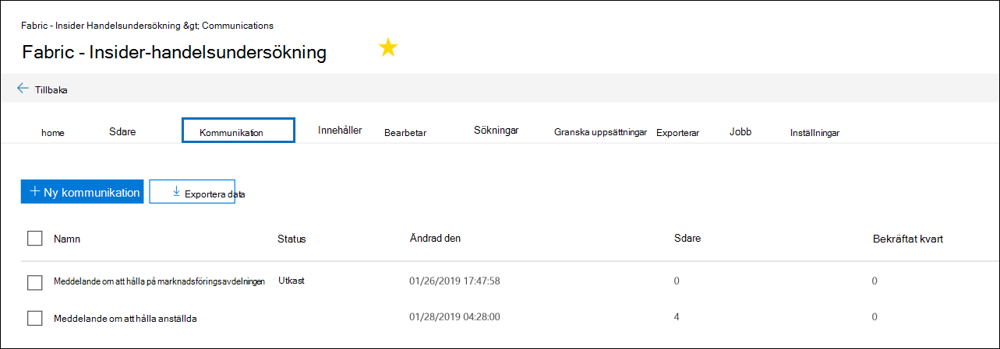
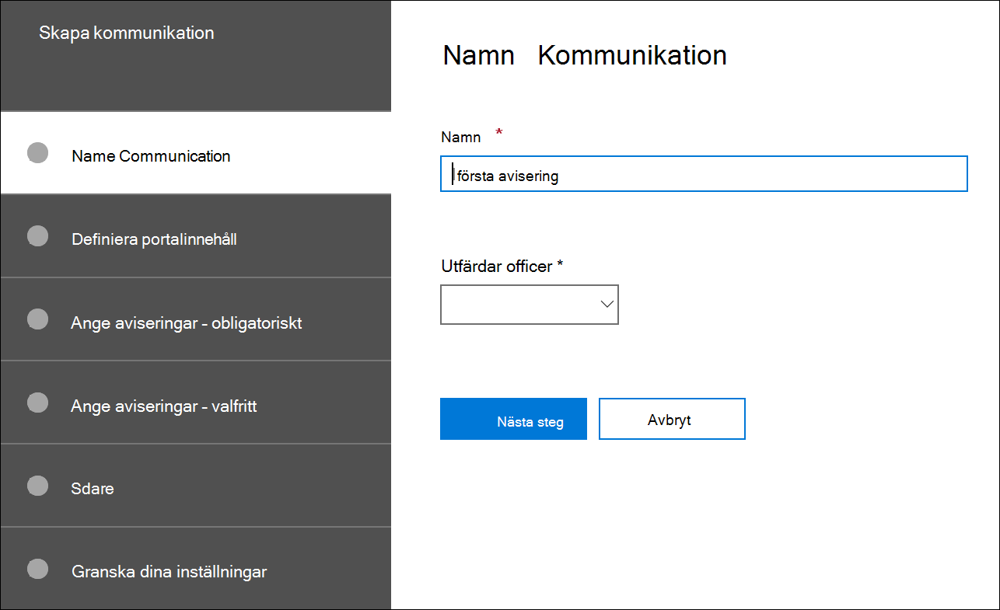
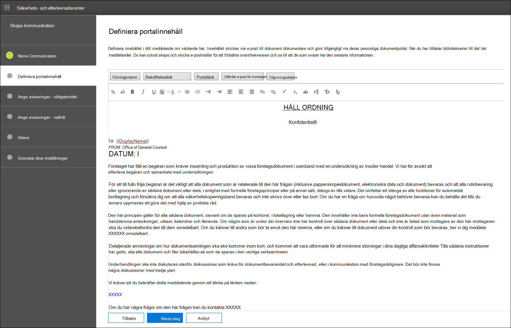
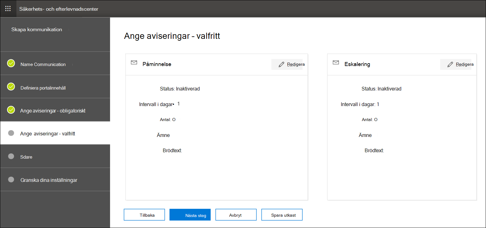
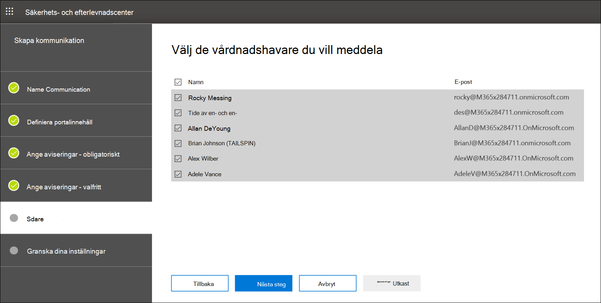

# Skapa ett meddelande om juridiskt väntande

Med Advanced eDiscovery dokumentkommunikation kan organisationer hantera arbetsflödet kring kommunikation med dokumentare. Med verktyget Kommunikation kan juridiska grupper systemmässigt skicka, samla in och spåra aviseringar om juridiska frågor. Den flexibla skapandeprocessen gör det också möjligt för grupper att anpassa arbetsflödet för meddelanden om väntande meddelanden och innehållet i meddelanden som skickas till dokument dokumentare.

I artikeln beskrivs stegen i arbetsflödet för meddelanden om att vänta.

## Steg 1: Ange kommunikationsinformation

Det första steget är att ange lämpliga uppgifter för meddelanden om juridiska meddelanden eller andra meddelanden om juridiska meddelanden.

1. I säkerhets- & efterlevnadscenter går du till **eDiscovery> Advanced eDiscovery** för att visa en lista över ärenden i organisationen.

2. Markera ett ärende, klicka på **fliken Kommunikation** och klicka sedan på **Ny kommunikation.**

3. På sidan **Namnkommunikation** anger du följande (obligatoriskt) kommunikationsinformation.

    - **Namn**: Det här är namnet på kommunikationen.

    - **Utfärdar officer:** Listrutan visar en lista över ärendemedlemmar. Mer information om hur du lägger till nya medlemmar i ett ärende finns i [Skapa ett Advanced eDiscovery ärende.](create-and-manage-advanced-ediscoveryv2-case.md#create-a-case) Varje meddelande som skickas till bibliotekspersonerna skickas för den angivna utfärdaren.

> [!NOTE]
> Den som utfärdar en officer måste ha **en aktiv** postlåda för att visas i listrutan Utfärdar konstapel

4. Klicka på **Nästa**.

## Steg 2: Definiera portalinnehållet

Sedan kan du skapa och lägga till innehållet i meddelandet om väntande meddelanden. På sidan **Definiera portalinnehåll** i guiden **Skapa kommunikation** anger du innehållet i meddelandet om väntande meddelanden. Innehållet läggs automatiskt till i meddelandena Utfärdning, Omproblem, Påminnelse och eskalering. Dessutom visas det här innehållet i den uppsövandes portal för efterlevnad. 

Så här skapar du portalinnehållet:

1. Skriv (eller klipp ut och klistra in från ett annat dokument) ditt hållmeddelande i textrutan för portalinnehållet. 

2. Infoga kopplingsvariabler i ditt meddelande för att anpassa meddelandet och dela portalen för efterlevnadsefterlevnad.

3. Klicka på **Nästa**.

  >[!Tip]
  >Mer information om hur du kan anpassa innehållet och formatet för portalinnehållet finns i [Använda kommunikationsredigeraren.](using-communications-editor.md)

## Steg 3: Ange de aviseringar som krävs

När du har definierat innehållet i meddelandet om väntande åtgärder kan du konfigurera arbetsflödena kring att skicka och hantera meddelandeprocessen. Aviseringar är e-postmeddelanden som skickas för att meddela och följa upp med biblioteksklienter. Alla inseristare som läggs till i meddelandet får samma avisering. 

Om du vill skapa och skicka ett meddelande om väntande måste du inkludera Utfärdning, Utfärdning och Meddelanden om utgivning.

### Meddelande om utfärdning 

När meddelandet har skapats initieras **utfärdningsmeddelandet** av den angivna utfärdaren. Meddelandet Utfärdning är den första meddelandet som skickas till den som skickat in information om sina bevarandeåtaganden. 

Så här skapar du en utfärdningsavisering:

1. Klicka på **Redigera** i panelen **Utfärdning.**

2. Om det behövs lägger du till ytterligare medlemmar eller personal i **fälten Kopia** **och Hemlig** kopia. Om du vill lägga till flera användare i de här fälten avgränsar du e-postadresserna med semikolon.

3. Ange Ämne **för** meddelandet (obligatoriskt).

4. Ange innehållet eller ytterligare instruktioner som du vill ge till den som ska göra det (obligatoriskt). Portalinnehållet som du definierade i steg 2 läggs till i slutet av utfärdningsmeddelandet. 

5. Klicka på **Spara**.

### Re-Issuance meddelande

I sådana fall kan det hända att företag måste bevara ytterligare eller mindre data än vad som har beskrivits tidigare. När du har uppdaterat portalinnehållet skickas meddelandet om att skicka om utfärdningsmeddelandet och skickar varningar till biblioteksanvändare om eventuella ändringar av bevarandeprinciperna.

Så här skapar du en ny utfärdningsavisering:

1. Klicka **på Redigera på panelen Reissue.** 

2. Om det behövs lägger du till ytterligare medlemmar eller personal i **fälten Kopia** **och Hemlig** kopia. Om du vill lägga till flera användare i de här fälten avgränsar du e-postadresserna med semikolon.

3. Ange Ämne **för** meddelandet (obligatoriskt).

4. Ange innehållet eller ytterligare instruktioner som du vill ge till den som ska göra det (obligatoriskt). Portalinnehållet som du definierade i steg 2 läggs till i slutet av meddelandet om ny utfärdning.

5. Klicka på **Spara**.

> [!NOTE]
> Om innehållet på portalen ändras  (på sidan  Definiera portalinnehåll i kommunikationsguiden) skickas omutfärdningsmeddelandet automatiskt till alla dokumentianer som har tilldelats meddelandet. När meddelandet har skickats uppmanas brevare att bekräfta att de har begärt att bli av med sina meddelanden om väntande meddelanden. Om du har angett påminnelser eller eskaleringsarbetsflöden kommer även dessa att startas om. Mer information om andra händelser för ärendehantering som utlöser kommunikation finns i [Händelser som utlöser aviseringar.](#events-that-trigger-notifications)

### Meddelande om släpp

När en fråga har lösts, eller om en vårdnadshavare inte längre behöver bevara innehållet, kan du släppa den vårdnadshavare som avknöjt från ett ärende. Om den vårdnadshavare som tidigare utfärdat en varning om att ett certifikat är intr dess kan den utgivna aviseringen användas för att varna dem om att de har frisläppts från sina skyldigheter.

Så här skapar du ett release-meddelande: 

1. Klicka på **Redigera** på panelen **Släpp.**

2. Om det behövs lägger du till ytterligare medlemmar eller personal i **fälten Kopia** **och Hemlig** kopia. Om du vill lägga till flera användare i de här fälten avgränsar du e-postadresserna med semikolon.

3. Ange Ämne **för** meddelandet (obligatoriskt).

4. Ange innehållet eller ytterligare instruktioner som du vill ge till den som ska göra det (obligatoriskt).

5. Klicka **på** Spara och gå till nästa steg.

## (Valfritt) Steg 4: Ange de valfria meddelandena

Alternativt kan du förenkla arbetsflödet för uppföljning med icke-svarare dokumenterare genom att skapa och schemalägga automatiska påminnelser och eskaleringsaviseringar.

### Påminnelser

När du har skickat ett meddelande om att en påminnelse är väntad kan du följa upp med icke-svarare dokumenterare genom att definiera ett arbetsflöde för påminnelse.

Så här schemalägger du påminnelser:

1. Klicka på **Redigera** i panelen **Påminnelse.**

2. Aktivera **arbetsflödet** påminnelse genom att aktivera **växlingsknappen Status** (obligatoriskt).

3. Ange **påminnelseintervallet (i dagar)** (obligatoriskt). Det här är det antal dagar som du måste vänta innan du skickar den första påminnelsen och uppföljningspåminnelserna. Om du till exempel anger påminnelseintervallet till sju dagar skickas den första påminnelsen sju dagar efter att aviseringen om inställts ursprungligen utfärdades. Alla efterföljande påminnelser skickas också var sju:e dag.

4. Ange Antal **påminnelser** (krävs). Det här fältet anger hur många påminnelser som ska skickas till icke svarare biblioteksnamn. Om du till exempel anger antalet påminnelser till 3 får en vårdnadshavare högst tre påminnelser. När en vårdnadshavare bekräftar att en avisering är väntad skickas inte längre påminnelser till den användaren.

5. Ange Ämne **för** meddelandet (obligatoriskt). 

6. Ange innehållet eller ytterligare instruktioner som du vill ge till den som ska göra det (obligatoriskt). Portalinnehållet som du definierade i steg 2 läggs till i slutet av påminnelsen.

7. Klicka **på** Spara och gå till nästa steg.

### Eskalering

I vissa situationer kan du behöva ytterligare sätt att följa upp med icke-svarare bibliotekare. Om en vårdnadshavare inte godkänner att ett meddelande om att ett meddelande är väntande har mottagits efter att ha fått det angivna antalet påminnelser, kan den juridiska gruppen ange ett arbetsflöde för att automatiskt skicka ett eskaleringsmeddelande till den dokumentansvarige och deras chef.

Så här schemalägger du eskalering:

1. Klicka på **Redigera i** panelen **Eskalering.**

2. Aktivera **eskaleringsarbetsflödet** genom att aktivera **växlingsknappen** Status.

3. Ange **eskaleringsintervallet (i dagar)** (obligatoriskt).

4. Ange antalet **eskaleringar** (obligatoriskt). Det här fältet anger hur många eskaleringar som ska skickas till icke-svarare obehöriga personer. Om du till exempel anger antalet eskalering till 3 skickas ett eskaleringsmeddelande till den vårdnadshavare och deras chef högst tre gånger. När en vårdnadshavare bekräftar att en avisering om inhållen är bekräftad kommer eskalering inte längre att skickas.

5. Ange Ämne **för** meddelandet (obligatoriskt). 

6. Ange innehållet eller ytterligare instruktioner som du vill ge till den som ska göra det (obligatoriskt). Portalinnehållet som du definierade i steg 2 läggs till i slutet av eskaleringsmeddelandet.

7. Klicka **på** Spara och gå till nästa steg.

## Steg 5: Tilldela användare som ska ta emot aviseringar

När du har färdigfört innehållet för aviseringar väljer du de objekt du vill skicka aviseringar till. 

Så här lägger du till biblioteksvårdare:

1. Tilldela brevlådor till kommunikationen genom att klicka på kryssrutan bredvid namnet.

    När meddelandet har skapats tillämpas meddelandearbetsflödet automatiskt på de valda dokumenterna.

2. Klicka **på Nästa** för att granska kommunikationsinställningarna och detaljerna.

>[!NOTE]
>Du kan bara lägga till brevare som har lagts till i ärendet och inte har fått någon annan avisering i ärendet.

## Steg 6: Granska inställningar

När du har granskat inställningarna och **klickat på** Skicka för att slutföra kommunikationen startas kommunikationsarbetsflödet automatiskt av systemet genom att skicka utfärdningsmeddelandet.

## Händelser som utlöser aviseringar

I följande tabell beskrivs händelser i ärendehanteringsprocessen som utlöser när olika typer av meddelanden skickas till brevare.

|Typ av kommunikation|Utlösare |
|:---------|:---------|
|Utfärdning av meddelanden|När meddelandet skapades. Du kan också skicka om en avisering om att vänta manuellt. |
|Omutfärdning av meddelanden|Uppdatera portalinnehållet på sidan **Definiera portalinnehåll** i guiden **Redigera** kommunikation.|
|Meddelanden om släppta meddelanden|Den insläppta har frisläppts från ärendet.|
|Påminnelser|Intervall och antal påminnelser som konfigurerats för påminnelsen.|
|Eskalering|Intervall och antal påminnelser som konfigurerats för eskalering.|
|||
