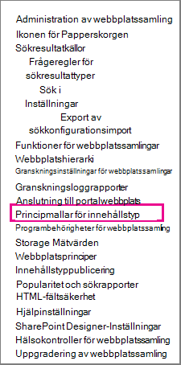
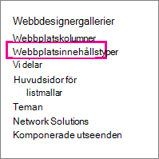
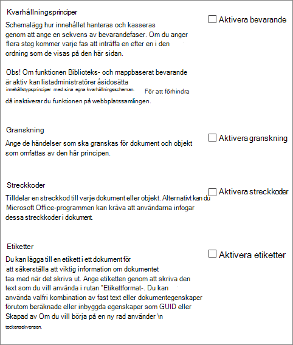
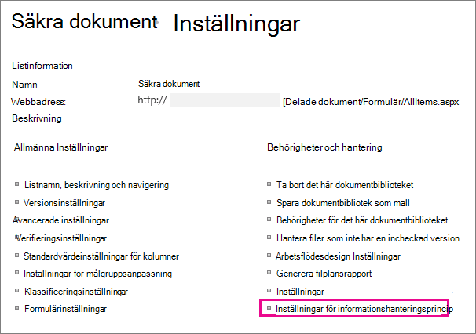

# Skapa och använda principer för informationshantering

Med informationshanteringsprinciper kan organisationen styra hur lång tid innehåll ska behållas, granska vad personer gör med innehåll och lägga till streckkoder eller etiketter i dokument. Med hjälp av en princip kan du tillämpa efterlevnad av lagar, regelverk och interna affärsprocesser. Som administratör kan du konfigurera en princip som styr hur du spårar dokument och hur lång tid dokument behålls.
  
Du kan skapa en informationshanteringsprincip på tre olika platser i webbplatshierarkin, från den bredaste till den smalaste:
  
- Skapa en princip som ska användas på flera innehållstyper i en webbplatssamling.
    
- Skapa en princip för en webbplatsinnehållstyp.
    
- Skapa en princip för en lista eller ett bibliotek.
    
Mer information finns i Introduktion [till informationshanteringsprinciper.](intro-to-info-mgmt-policies.md)
  
## Skapa en princip för flera innehållstyper i en webbplatssamling

Om du vill se till att en informationsprincip tillämpas på alla dokument av en viss typ i en webbplatssamling kan du skapa principen på webbplatssamlingsnivå och sedan tillämpa principen på innehållstyper. Det här kallas för webbplatssamlingsprinciper. 
  
1. Knappen Inställningar SharePoint \>   \>**Webbplats Inställningar**.
    
    På en SharePoint gruppansluten webbplats klickar **du på Inställningar** klicka på **Webbplatsinnehåll** och sedan på **Webbplatsinnehåll och Inställningar**. 
    
2. På sidan Inställningar, under **Policymallar för** innehållstyp \> **för administration av webbplatssamling.** 
  

  
3. På sidan Principer \> **skapar du**. 
    
4. Ange ett namn och en beskrivning för principen och skriv sedan en kort principbeskrivning som förklarar för användarna vad principen gäller.
    
5. I nästa avsnitt om hur du skapar principer för en webbplatsinnehållstyp får du lära dig att konfigurera funktioner som du vill associera med principen. 
    
6. Välj **OK**.
    
## Skapa en princip för en webbplatsinnehållstyp

Om du lägger till en informationshanteringsprincip för en innehållstyp är det enkelt att koppla principfunktioner till flera listor eller bibliotek. Du kan välja att lägga till en befintlig informationshanteringsprincip för en innehållstyp eller att skapa en unik princip som är specifik för en enskild innehållstyp.
  
 Du kan också lägga till en informationshanteringsprincip för en innehållstyp som är specifik för listor. Det här betyder att principen endast tillämpas på objekt i den lista som använder innehållstypen. 
  
1. Knappen Inställningar SharePoint \>   \>**Webbplats Inställningar**.
    
    På en SharePoint gruppansluten webbplats klickar **du på Inställningar** klicka på **Webbplatsinnehåll** och sedan på **Webbplatsinnehåll och Inställningar**. 
    
2. På sidan Inställningar webbplats, under **Webbplatsinnehållstyper för** \> **webbdesignergallerier.**
  

  
3. På sidan Webbplatsinnehållstyp Inställningar väljer du den innehållstyp som du vill lägga till en princip för.
    
4. Klicka på Inställningar för **informationshanteringsprincip** Inställningar \> **sidan Webbplatsinnehållstyp.**
    
5. På sidan Redigera princip anger du ett namn och en beskrivning för principen och skriver sedan en kort beskrivning som förklarar för användarna vad principen gäller.
    
6. I nästa avsnitt markerar du de principfunktioner du vill lägga till i informationshanteringsprincipen. 
  

  
7. Om du vill ange en bevarandeperiod för dokument och objekt som den här principen gäller för väljer du Aktivera bevarande och anger sedan lagringstid och de åtgärder som ska gälla när objekten löper ut.
    
    Så här anger du en bevarandeperiod
    
||||||**1.**|**Välj **Lägg till en bevarandefas för arkivhandlingar...****|
|:-----|:-----|:-----|:-----|:-----|:-----|:-----|
||||||2.    | Välj ett alternativ för bevarandeperiod, vilken specificerar hur lång tid dokument och objekt upphör att gälla. Gör något av följande:     Om du vill ange förfallodatum baserat på en datumegenskap **går** du till Händelse Det här steget baseras på en datumegenskap för objektet och väljer sedan åtgärd för dokumentet eller objektet (till exempel Skapad eller Ändrad) och tidsökningen efter den här åtgärden (till exempel antal dagar, månader eller år) när du vill att objektet ska upphöra \> att gälla.     Om du vill fastställa förfallodatum med en anpassad bevarandeformel väljer du **Anges av en anpassad bevarandeformel som är installerad på servern.**    > [!NOTE]> Det här alternativet är bara tillgängligt om en anpassad formel har angetts av administratören.           |
||||||3.    |Alternativet **Starta ett arbetsflöde** är bara tillgängligt om du definierar en princip för en lista, ett bibliotek eller en innehållstyp som redan har ett kopplat arbetsflöde. Du får sedan ett urval av arbetsflöden att välja bland.    |
||||||4.    |I avsnittet **Upprepning** väljer du **Upprepa den här fasens åtgärd...** och ange hur ofta du vill att åtgärden ska upprepas.    > [!NOTE]> Det här alternativet är bara tillgängligt om det går att upprepa åtgärden. Du kan till exempel inte ställa in upprepning för åtgärden **Ta bort permanent.**           |
||||||5.    |Välj **OK.**    |
   
1. Om du vill aktivera granskning för de dokument och objekt som den här principen gäller för väljer du Aktivera granskning **och** anger sedan de händelser du vill granska.
    
    Så här aktiverar du granskning
    
||||||1.****|På sidan Redigera princip** **under**  Granskning aktivera granskning ** markerar du sedan kryssrutorna bredvid de händelser du vill behålla en **\>**  granskningslogg för.****|
|:-----|:-----|:-----|:-----|:-----|:-----|:-----|
||||||**2.**   |**Om du vill uppmana användarna att infoga dessa streckkoder i dokument väljer**  du Be användarna att ange en streckkod innan de sparar eller **skriver ut** **.**   |
||||||**3.**   |**Välj** **OK** ** för att använda granskningsfunktionen i principen. **   |
|||||||Funktionen för granskning innebär att organisationer kan skapa och analysera granskningshistorik för dokument och listobjekt, till exempel uppgiftslistor, problemlistor, diskussionsgrupper och kalendrar. Med den här principfunktionen får du en granskningslogg som registrerar händelser, till exempel när innehåll visas, redigeras eller tas bort.    |
|||||||När granskning är aktiverad som en del av en informationshanteringsprincip kan administratörer visa granskningsdata i användningsrapporter för principen som är baserade på Microsoft Excel och som sammanfattar den aktuella användningen. Administratörer kan använda rapporterna för att avgöra hur informationen används i organisationen. De här rapporterna kan också hjälpa organisationer att verifiera och dokumentera att regelverk efterlevs eller undersöka möjliga problem.    |
|||||||I granskningsloggen registrerar du följande information: händelsenamn, datum och tid för händelsen och systemnamnet för den användare som utförde åtgärden.    |
   
1. När streckkoder är aktiverade i en princip läggs de till i dokumentegenskaperna och visas i sidhuvudsområdet i dokumentet där streckkoden tillämpas. Streckkoder kan liksom etiketter även tas bort från ett dokument manuellt. Du kan ange om användare ska uppmanas att ange streckkoden när de skriver ut eller  sparar ett objekt eller om streckkoden ska infogas manuellt via fliken Infoga i Office 2010-program. 
    
    Så här aktiverar du streckkoder
    
||||||1.****|**På sidan Redigera princip, under **Streckkoder,** \> **aktiverar du streckkoder.****|
|:-----|:-----|:-----|:-----|:-----|:-----|:-----|
||||||**2.**   |Om du vill uppmana användarna att infoga dessa streckkoder i dokument väljer du Be användarna **att ange en streckkod innan de sparar eller skriver ut**.    |
||||||**3.**   |Välj **OK** för att tillämpa streckkodsfunktionen på principen.    |
|||||||
 Streckkodsprincipen genererar standardstreckkoder av standardkod 39. I streckkodsbild finns text under streckkodssymbolen som representerar streckkodsvärdet. Det innebär att streckkodsdata kan användas även när ingen genomsökningsmaskinvara finns tillgänglig. Användare kan skriva in streckkodsnumret manuellt i sökrutan för att hitta objektet på en webbplats.    |
   
1. Om du vill att dokument som den här principen gäller för ska ha etiketter väljer du Aktivera etiketter och anger sedan de inställningar du vill ha för etiketterna.
    
    Så här aktiverar du etiketter
    
||||||**1.**|**Om du vill att användarna ska lägga till en etikett i ett dokument väljer du Be användarna **att infoga en etikett innan de sparar eller skriver ut**.    > [!NOTE]> Om du vill att etiketterna ska vara valfria ska du inte markera den här kryssrutan.        **|
|:-----|:-----|:-----|:-----|:-----|:-----|:-----|
||||||2.    |Om du vill låsa en etikett så att den inte kan ändras när den har infogats väljer du **Förhindra ändringar av etiketter när de har lagts till.**     Med den här inställningen går det inte att uppdatera etiketttexten när etiketten har infogats i ett objekt i ett klientprogram, till exempel Word, Excel eller PowerPoint. Markera inte den här kryssrutan om du vill att etiketten ska uppdateras när egenskaperna för dokumentet eller objektet uppdateras.    |
||||||3.    |Ange texten för etiketten som du vill att den ska visas i rutan Etikettformat. Etiketter kan innehålla upp till 10 kolumnreferenser, där var och en kan innehålla upp till 255 tecken. Så här skapar du formatet för din etikett:    Skriv namnen på kolumnerna som du vill ska ingå i etiketten i den ordning som du vill att de ska visas. Omge kolumnnamnen med klammerparenteser ( {} ), som i exemplet på sidan Redigera princip.    Skriv ord för att identifiera kolumnerna utanför hakparenteserna, som i exemplet på sidan Redigera princip.    |
||||||4.    |Om du vill lägga till en radbrytning **skriver\n** radbrytning där du vill att radbrytningen ska visas.    |
||||||5.    |Välj den teckenstorlek och det format du vill använda och ange om du vill att etiketten ska placeras till vänster, i mitten eller till höger i dokumentet.     Välj ett teckensnitt och ett format som finns på användarnas datorer. Storleken på teckensnittet påverkar hur mycket text som kan visas på etiketten.    |
||||||6.    |Ange höjd och bredd för etiketten. Höjden kan variera mellan 0,6 och 50,8 cm och etikettbredden kan variera 0,6 och 50,8 cm. Etiketttexten är alltid lodrätt centrerad inom bilden.    |
||||||7.    |Välj **Uppdatera** om du vill förhandsgranska etikettinnehållet.    |
   
1. Välj **OK**.
    
## Skapa en princip för en lista, ett bibliotek eller en mapp (platsbaserad bevarandeprincip)

Du kan definiera en bevarandeprincip som endast gäller för en viss lista, ett visst bibliotek eller en viss mapp. Men om du skapar en bevarandeprincip på det här sättet kan du inte återanvända den på andra listor, bibliotek, mappar eller webbplatser och du kan inte tillämpa en princip för en webbplatssamling på en platsbaserad princip.
  
Om du vill tillämpa en enda bevarandeprincip på alla typer av innehåll på en enda plats är det sannolikt bäst att du använder platsbaserat bevarande. I de flesta andra fall bör du kontrollera att en bevarandeprincip har angetts för alla innehållstyper.
  
 Varje undermapp ärver den bevarandeprincip som gäller för dess överordnade objekt, såvida du inte väljer att bryta arvet och definiera en ny bevarandeprincip på undernivå. 
  
Om du vill definiera en annan informationshanteringsprincip än lagring i en lista eller ett bibliotek måste du definiera en informationshanteringsprincip för varje enskild listinnehållstyp som associeras med listan eller biblioteket.
  
 Om du vid någon tidpunkt vill byta från innehållstyp till platsbaserade principer för en lista eller ett bibliotek används bara bevarandeprincipen som platsbaserad princip. Alla andra hanteringsprinciper (granskningar, streckkoder och streckkoder) ärvs från de associerade innehållstyperna. 
  
 Du kan inaktivera platsbaserade principer för en webbplatssamling genom att inaktivera funktionen Biblioteks- och mappbaserat bevarande. På så sätt kan administratörer för webbplatssamlingar se till att deras innehållstypprinciper inte åsidosätts av en listadministratörs platsbaserade principer. 
  
Du behöver minst behörigheten Hantera listor för att ändra inställningarna för informationshanteringsprincip för en lista eller ett bibliotek.
  
1. Navigera till den lista eller det bibliotek som du vill ange en informationshanteringsprincip för. 
    
2. I menyfliksområdet väljer du fliken **Bibliotek** **eller Lista** i \> **Inställningar** eller **Lista Inställningar**.
    
    I SharePoint Online klickar du på **Inställningar** och sedan på **Listinställningar** eller **Biblioteksinställningar.** 
    
3. Under **Behörigheter och principinställningar för** hantering av \> **informationshantering**.
  

  
4. På sidan Information Management Policy Inställningar kontrollerar du att bevarandekällan för listan eller biblioteket är inställd på Bibliotek och mappar. 
  
Om **Innehållstyp** visas som källa klickar du på **Ändra källa** och sedan på Bibliotek och **mappar.** Du meddelas om att bevarandeprinciper av innehållstyp ignoreras. Välj **OK**. 
    
5. På sidan Redigera princip, under **Biblioteksbaserat bevarandeschema,** anger du en kort beskrivning för principen du skapar. 
    
6. Välj **Lägg till en bevarandefas...**
    
     Observera att under Poster kan du välja att definiera olika bevarandeprinciper för arkivhandlingar genom att välja alternativet Definiera olika bevarandefaser för arkivhandlingar. 
    
7. Välj ett alternativ för bevarandeperiod i dialogrutan Fasegenskaper för att ange när dokument eller objekt ska upphöra att gälla. Gör något av följande:
    
  - Om du vill ange förfallodatum baserat på en datumegenskap **går** du till Händelse Det här steget baseras på en datumegenskap för objektet och väljer sedan åtgärd för dokumentet eller objektet (till exempel Skapad eller Ändrad) och tidsökningen efter den här åtgärden (till exempel antal dagar, månader eller år) när du vill att objektet ska upphöra \> att gälla. 
    
  - Om du vill fastställa förfallodatum med en anpassad bevarandeformel väljer du **Anges av en anpassad bevarandeformel som är installerad på servern.** 
    
    > [!NOTE]
    >  Det här alternativet är bara tillgängligt om en anpassad formel har ställts in av administratören. 
  
  - Under **Åtgärd** anger du vad som ska hända när dokumentet eller objektet upphör att gälla. Välj en åtgärd i listan om du vill aktivera en specifik åtgärd för dokumentet eller objektet (t.ex borttagning). 
    
8. Alternativet **Starta ett arbetsflöde** är bara tillgängligt om du definierar en princip för en lista, ett bibliotek eller en innehållstyp som redan har ett kopplat arbetsflöde. Du får sedan ett urval av arbetsflöden att välja bland. 
    
9. Under **Återkommande** väljer **du Upprepa den här fasens åtgärd...** och ange hur ofta du vill att åtgärden ska upprepas. 
    
    > [!NOTE]
    >  Det här alternativet är bara tillgängligt om det går att upprepa åtgärden. Du kan till exempel inte ställa in upprepning för åtgärden **Ta bort permanent.** 
  
10. Välj **OK**.
    
## Tillämpa en princip för en webbplatssamling på en innehållstyp

Om informationshanteringsprinciper redan har skapats för webbplatsen som webbplatssamlingsprinciper kan du tillämpa en av principerna på en innehållstyp. Då kan du använda samma princip för flera innehållstyper i en webbplatssamling som inte delar samma överordnade innehållstyp.
  
 Om du vill tillämpa principer på flera innehållstyper i en webbplatssamling, och du har en tjänst för hanterad metadata, kan du publicera informationshanteringsprinciper till flera webbplatssamlingar med hjälp av innehållstypspublicering. Mer information finns [i avsnittet Tillämpa en princip i hela](#apply-a-policy-across-site-collections) webbplatssamlingar. 
  
1. Navigera till listan eller biblioteket som innehåller innehållstypen som du vill tillämpa en princip på.
    
2. I menyfliksområdet väljer du fliken **Bibliotek** **eller Lista** i \> **Inställningar** eller **Lista Inställningar**.
    
    I SharePoint Online klickar du på **Inställningar** och sedan på **Listinställningar** eller **Biblioteksinställningar.** 
    
3. Under **Behörigheter och principinställningar för** hantering av \> **informationshantering**.
  

  
4. Kontrollera att principkällan är inställd på **Innehållstyper** och **välj** den innehållstyp som du vill tillämpa principen på under Principer för innehållstyp. 
    
5. Under **Ange principen Använd** en princip för en webbplatssamling väljer du sedan den princip som du vill använda i \> listan. 
    
    > [!NOTE]
    >  Om alternativet **Använd en princip för en** webbplatssamling inte är tillgängligt har inga principer för webbplatssamlingar definierats för webbplatssamlingen. 
  
6. Välj **OK**.
    
     Om det går att hantera flera olika innehållstyper med listan eller biblioteket som du arbetar med kan du **välja** den innehållstyp som du vill ange en informationshanteringsprincip för under Innehållstyper. Det tar dig direkt till steg 5 ovan. 
    
## Tillämpa en princip i alla webbplatssamlingar

Dela innehållstyper över webbplatssamlingar genom att använda ett tjänstprogram för hanterade metadata för att konfigurera innehållstyppublicering. Med innehållstyppublicering kan du hantera innehåll och metadata konsekvent över webbplatserna eftersom innehållstyper kan skapas och uppdateras centralt och uppdateringar kan publiceras till flera prenumererande webbplatssamlingar eller webbprogram.
  
## Skapa en mall från en befintlig princip som kan användas i webbplatssamlingar

Du kan definiera en informationshanteringsprincip och sedan skapa en mall utifrån den som du vill använda i flera webbplatssamlingar. Den här metoden kan användas om du vill säkerhetskopiera dina informationsprinciper, eller om den även kan användas som en alternativ metod för att använda innehållstyppublicering för att tillämpa en princip över webbplatssamlingar. Du skapar en mall eller en säkerhetskopia av principen genom att exportera principen från en webbplatssamling och sedan importera den till en sparad plats eller till en annan webbplatssamling.
  
> [!IMPORTANT]
>  Om du använder export-/importfunktionen för att skapa en uppsättning principmallar bör du tänka på att det finns en unik identifierare i principfilen .xml filen. Därför kan du inte importera policyn till en webbplats flera gånger utan att ändra den här unika identifieraren. 
  
### Exportera en princip

1. På webbplatssamlingens startsida väljer **du Inställningar** small Inställningar som ägde rum i stället för  \> **Inställningar**.
    
    På en SharePoint gruppansluten webbplats klickar **du på Inställningar** klicka på **Webbplatsinnehåll** och sedan på **Webbplatsinnehåll och Inställningar**. 
    
2. På sidan Inställningar, under **Policymallar för** innehållstyp \> **för administration av webbplatssamling.** 
  

  
3. Välj den princip som du vill exportera \> till den nedre \> **exportsidan.**
    
4. När du uppmanas att spara eller öppna filen **väljer du** Spara och väljer sedan en plats där du vill spara filen. Se till att välja en plats som är tillgänglig för de webbplatssamlingar som importerar principen.
    
5. När dialogrutan Nedladdningen är slutförd visas väljer du **Stäng.**
    
### Importera en princip till en annan webbplatssamling

Genom att importera en informationshanteringsprincip kan du tillämpa den på flera innehållstyper på webbplats- eller listnivå inom valfri webbplatssamling. Det finns två fördelar med det här: du behöver inte definiera om och tillämpa principen för varje innehållstyp, och det blir enklare att göra principändringar genom att göra ändringar i principen på ett enda ställe.
  
1. På startsidan för den webbplatssamling där du vill tillämpa principen väljer du **Inställningar** Small Inställningar-kugghjul som ägde rum på  \> **Inställningar**.
    
    På en SharePoint gruppansluten webbplats klickar **du på Inställningar** klicka på **Webbplatsinnehåll** och sedan på **Webbplatsinnehåll och Inställningar**. 
    
2. På sidan Inställningar, under **Policymallar för** innehållstyp \> **för administration av webbplatssamling.**
    
3. På sidan Principer väljer \> **du** \> **Importera bläddra** för att hitta XML-filen för principen. 
    
4. Markera den XML-fil där principen har sparats \> **som Öppen.** 
    
5. På sidan Importera en princip för en webbplatssamling \> **lägger** du till principen i webbplatssamlingen. 
    
Den importerade principen kan nu tillämpas på en eller flera innehållstyper på webbplats- eller listnivå. 
  
Med informationshanteringsprinciper kan organisationen styra hur lång tid innehåll ska behållas, granska vad personer gör med innehåll och lägga till streckkoder eller etiketter i dokument. Med hjälp av en princip kan du tillämpa efterlevnad av lagar, regelverk och interna affärsprocesser. Som administratör kan du konfigurera en princip som styr hur du spårar dokument och hur lång tid dokument behålls.

Du kan skapa en informationshanteringsprincip på tre olika platser i webbplatshierarkin, från den bredaste till den smalaste:
- Skapa en princip som ska användas på flera innehållstyper i en webbplatssamling.
- Skapa en princip för en webbplatsinnehållstyp.
- Skapa en princip för en lista eller ett bibliotek.

Mer information finns i Introduktion [till informationshanteringsprinciper.](intro-to-info-mgmt-policies.md)
  

