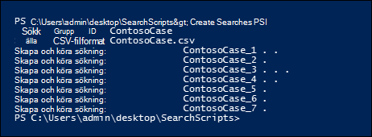
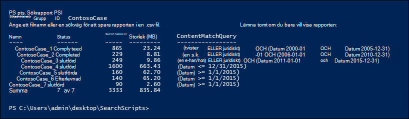
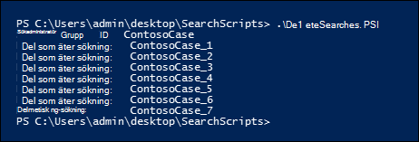

# <a name="create-report-on-and-delete-multiple-content-searches"></a>Skapa, rapportera om och ta bort flera innehållssökningar

 Att snabbt skapa och rapportera upptäcktssökningar är ofta ett viktigt steg i e-dataidentifiering och undersökningar när du försöker lära dig mer om underliggande data, och dess användbarhet och kvalitet. Som hjälp för det kan du använda Säkerhets- & Compliance Center PowerShell med en uppsättning cmdlets som automatiserar tidskrävande aktiviteter för innehållssökning. De här skripten är ett snabbt och enkelt sätt att skapa ett antal sökningar och sedan köra rapporter om uppskattade sökresultat som kan hjälpa dig att fastställa det antal data som är i fråga. Du kan också använda skripten för att skapa olika versioner av sökningar för att jämföra de resultat som respektive användare får fram. Med de här skripten kan du snabbt och effektivt identifiera och hantera dina data.

## <a name="before-you-create-a-content-search"></a>Innan du skapar en innehållssökning

- Du måste vara medlem i rollgruppen för eDiscovery Manager i säkerhets- och efterlevnadscentret för & för att kunna köra skripten som beskrivs i det här avsnittet.

- Om du vill samla in en lista med URL:er för OneDrive för företag-webbplatserna i organisationen som du kan lägga till i CSV-filen i steg 1, se Skapa en lista över alla OneDrive platser i [organisationen.](/onedrive/list-onedrive-urls)

- Se till att spara alla filer som du skapar i det här avsnittet i samma mapp. Det gör det enklare att köra skripten.

- Skripten innehåller minimal felhantering. Syftet med dem är att snabbt skapa, rapportera om och ta bort flera innehållssökningar.

- Exempelskripten som tillhandahålls i det här avsnittet stöds inte under något standardsupportprogram eller någon standardsupporttjänst från Microsoft. Exempelskripten tillhandahålls i SIN FORM UTAN några som helst garantier. Vidare frånsäger sig Microsoft alla underförstådda garantier, inklusive, utan begränsning, alla underförstådda garantier om säljbarhet eller lämplighet för ett visst ändamål. Hela risken i samband med användningen av eller prestandan hos exempelskripten och dokumentationen ligger kvar hos dig. Under inga omständigheter ska Microsoft, dess upphovspersoner eller någon annan som är involverad i skapandet, produktionen eller leveransen av skripten hållas ansvariga för någon som helst skada (inklusive, men inte begränsat till, skador för vinstförlust, driftavbrott, förlust av affärsinformation eller annan ekonomisk skada) som uppstår till följd av användning eller oförmåga att använda exempelskripten eller dokumentationen, även om Microsoft har fått information om att sådana skador kan uppstå.

## <a name="step-1-create-a-csv-file-that-contains-information-about-the-searches-you-want-to-run"></a>Steg 1: Skapa en CSV-fil som innehåller information om de sökningar du vill köra

Filen med kommaavgränsade värden (CSV) som du skapar i det här steget innehåller en rad för varje användare som vill söka. Du kan söka i användarens e Exchange Online postlåda (som innehåller arkivpostlådan, om den är aktiverad) och deras OneDrive för företag webbplats. Du kan också söka i bara postlådan eller OneDrive för företag webbplatsen. Du kan också söka på alla webbplatser i SharePoint Online. Skriptet som du kör i steg 3 skapar en separat sökning för varje rad i CSV-filen.

1. Kopiera och klistra in följande text i en .txt med Anteckningar. Spara filen i en mapp på den lokala datorn. Du sparar även de andra skripten i den här mappen.

   ```text
   ExchangeLocation,SharePointLocation,ContentMatchQuery,StartDate,EndDate
   sarad@contoso.onmicrosoft.com,https://contoso-my.sharepoint.com/personal/sarad_contoso_onmicrosoft_com,(lawsuit OR legal),1/1/2000,12/31/2005
   sarad@contoso.onmicrosoft.com,https://contoso-my.sharepoint.com/personal/sarad_contoso_onmicrosoft_com,(lawsuit OR legal),1/1/2006,12/31/2010
   sarad@contoso.onmicrosoft.com,https://contoso-my.sharepoint.com/personal/sarad_contoso_onmicrosoft_com,(lawsuit OR legal),1/1/2011,3/21/2016
   ,https://contoso.sharepoint.com/sites/contoso,,,3/21/2016
   ,https://contoso-my.sharepoint.com/personal/davidl_contoso_onmicrosoft_com,,1/1/2015,
   ,https://contoso-my.sharepoint.com/personal/janets_contoso_onmicrosoft_com,,1/1/2015,
   ```

   Filens första rad, eller rubrikraden, innehåller de parametrar som kommer att användas av **New-ComplianceSearch-cmdleten** (i skriptet i steg 3) för att skapa en ny innehållssökning. Varje parameternamn avgränsas av ett kommatecken. Kontrollera att det inte finns några blanksteg i rubrikraden. Varje rad under rubrikraden representerar parametervärdena för varje sökning. Se till att ersätta platshållardata i CSV-filen med faktiska data.

2. Öppna .txt filen i Excel och använd sedan informationen i följande tabell för att redigera filen med information för varje sökning.

   ****

   |Parameter|Beskrivning|
   |---|---|
   |`ExchangeLocation`|SMTP-adressen för användarens postlåda.|
   |`SharePointLocation`|URL-adressen för användarens OneDrive för företag webbplats eller URL för en webbplats i organisationen. För URL-adressen för OneDrive för företag använder du följande format: ` https://<your organization>-my.sharepoint.com/personal/<user alias>_<your organization>_onmicrosoft_com ` . Till exempel  `https://contoso-my.sharepoint.com/personal/sarad_contoso_onmicrosoft_com` .|
   |`ContentMatchQuery`|Sökfrågan för sökningen. Mer information om hur du skapar en sökfråga finns [i Nyckelordsfrågor och sökvillkor för innehållssökning.](keyword-queries-and-search-conditions.md)|
   |`StartDate`|För e-post: det datum då eller efter det att ett meddelande togs emot av en mottagare eller skickades av avsändaren. För dokument på SharePoint eller OneDrive för företag, datumet då ett dokument senast ändrades.|
   |`EndDate`|För e-post: det datum då eller innan ett meddelande skickades av en användare. För dokument på SharePoint eller OneDrive för företag webbplatser gäller att det datum då eller innan dokumentet senast ändrades.|
   |

3. Spara filen Excel CSV-fil i en mapp på den lokala datorn. Skriptet som du skapar i steg 3 använder informationen i CSV-filen för att skapa sökningarna.

## <a name="step-2-connect-to-security--compliance-center-powershell"></a>Steg 2: Anslut säkerhets- & Säkerhets- och efterlevnadscenter PowerShell

Nästa steg är att ansluta till Security & Compliance Center, PowerShell för din organisation. Stegvisa instruktioner finns i Skapa säkerhets- [Anslut Säkerhets- & Compliance Center PowerShell.](/powershell/exchange/connect-to-scc-powershell)

## <a name="step-3-run-the-script-to-create-and-start-the-searches"></a>Steg 3: Kör skriptet för att skapa och starta sökningarna

Skriptet i det här steget skapar en separat innehållssökning för varje rad i CSV-filen som du skapade i steg 1. När du kör det här skriptet uppmanas du att ange två värden:

- **Sökgrupp-ID** – Det här namnet är ett enkelt sätt att ordna sökningar som skapas från CSV-filen. Varje sökning som skapas namnges med sökgrupp-ID och sedan läggs ett nummer till i söknamnet. Om du till exempel anger **ContosoCase** för sökgrupp-ID:t heter **sökningarna ContosoCase_1**, **ContosoCase_2**, **ContosoCase_3** och så vidare. Observera att namnet du skriver är det ärendekänsliga. När du använder sökgrupp-ID i steg 4 och steg 5 måste du använda samma ärende som du gjorde när du skapade det.

- **CSV-fil** – namnet på CSV-filen som du skapade i steg 1. Se till att använda det fullständiga filnamnet, inklusive filnamnstillägget .csv filnamnstillägget. till exempel  `ContosoCase.csv` .

Så här kör du skriptet:

1. Spara följande text i en Windows PowerShell skriptfil med hjälp av ett filnamnssuffix .ps1; till exempel `CreateSearches.ps1` . Spara filen i samma mapp där du sparade de andra filerna.

   ```Powershell
   # Get the Search Group ID and the location of the CSV input file
   $searchGroup = Read-Host 'Search Group ID'
   $csvFile = Read-Host 'Source CSV file'

   # Do a quick check to make sure our group name will not collide with other searches
   $searchCounter = 1
   import-csv $csvFile |
     ForEach-Object{

    $searchName = $searchGroup +'_' + $searchCounter
    $search = Get-ComplianceSearch $searchName -EA SilentlyContinue
    if ($search)
    {
       Write-Error "The Search Group ID conflicts with existing searches.  Please choose a search group name and restart the script."
       return
    }
    $searchCounter++
   }

   $searchCounter = 1
   import-csv $csvFile |
     ForEach-Object{

    # Create the query
    $query = $_.ContentMatchQuery
    if(($_.StartDate -or $_.EndDate))
    {
          # Add the appropriate date restrictions.  NOTE: Using the Date condition property here because it works across Exchange, SharePoint, and OneDrive for Business.
          # For Exchange, the Date condition property maps to the Sent and Received dates; for SharePoint and OneDrive for Business, it maps to Created and Modified dates.
          if($query)
          {
              $query += " AND"
          }
          $query += " ("
          if($_.StartDate)
          {
              $query += "Date >= " + $_.StartDate
          }
          if($_.EndDate)
          {
              if($_.StartDate)
              {
                  $query += " AND "
              }
              $query += "Date <= " + $_.EndDate
          }
          $query += ")"
    }

     # -ExchangeLocation can't be set to an empty string, set to null if there's no location.
     $exchangeLocation = $null
     if ( $_.ExchangeLocation)
     {
           $exchangeLocation = $_.ExchangeLocation
     }

    # Create and run the search
    $searchName = $searchGroup +'_' + $searchCounter
    Write-Host "Creating and running search: " $searchName -NoNewline
    $search = New-ComplianceSearch -Name $searchName -ExchangeLocation $exchangeLocation -SharePointLocation $_.SharePointLocation -ContentMatchQuery $query

    # Start and wait for each search to complete
    Start-ComplianceSearch $search.Name
    while ((Get-ComplianceSearch $search.Name).Status -ne "Completed")
    {
       Write-Host " ." -NoNewline
       Start-Sleep -s 3
    }
    Write-Host ""

    $searchCounter++
   }
   ```

2. I Windows PowerShell du till den mapp där du sparade skriptet i föregående steg och kör sedan skriptet. till exempel:

   ```Powershell
   .\CreateSearches.ps1
   ```

3. Skriv ett **namn för sökgruppen** i frågan Sök efter grupp-ID och tryck sedan på **Retur**. till exempel  `ContosoCase` . Kom ihåg att namnet är ärendekänsligt, så du måste skriva det på samma sätt i de efterföljande stegen.

4. I frågan **Käll-CSV-fil** skriver du namnet på CSV-filen, inklusive namnet .csv filnamnstillägget. till exempel  `ContosoCase.csv` .

5. Tryck **på Retur** för att fortsätta köra skriptet.

   Skriptet visar förloppet för att skapa och köra sökningarna. När skriptet är klart återgår det till uppmaningen.

   

## <a name="step-4-run-the-script-to-report-the-search-estimates"></a>Steg 4: Kör skriptet för att rapportera sökuppskattningarna

När du har skapat sökningarna är nästa steg att köra ett skript som visar en enkel rapport med antalet sökträffar för varje sökning som skapades i steg 3. Rapporten innehåller även storleken på resultatet för varje sökning och det totala antalet träffar och den totala storleken för alla sökningar. När du kör rapporteringsskriptet uppmanas du att ange grupp-ID och ett CSV-filnamn om du vill spara rapporten i en CSV-fil.

1. Spara följande text i en Windows PowerShell skriptfil med hjälp av ett filnamnssuffix .ps1; till exempel `SearchReport.ps1` . Spara filen i samma mapp där du sparade de andra filerna.

   ```Powershell
   $searchGroup = Read-Host 'Search Group ID'
   $outputFile = Read-Host 'Enter a file name or file path to save the report to a .csv file. Leave blank to only display the report'
   $searches = Get-ComplianceSearch | ?{$_.Name -clike $searchGroup + "_*"}
   $allSearchStats = @()
   foreach ($partialObj in $searches)
   {
      $search = Get-ComplianceSearch $partialObj.Name
      $sizeMB = [System.Math]::Round($search.Size / 1MB, 2)
      $searchStatus = $search.Status
      if($search.Errors)
      {
          $searchStatus = "Failed"
      }elseif($search.NumFailedSources -gt 0)
      {
          $searchStatus = "Failed Sources"
      }
      $searchStats = New-Object PSObject
      Add-Member -InputObject $searchStats -MemberType NoteProperty -Name Name -Value $search.Name
      Add-Member -InputObject $searchStats -MemberType NoteProperty -Name ContentMatchQuery -Value $search.ContentMatchQuery
      Add-Member -InputObject $searchStats -MemberType NoteProperty -Name Status -Value $searchStatus
      Add-Member -InputObject $searchStats -MemberType NoteProperty -Name Items -Value $search.Items
      Add-Member -InputObject $searchStats -MemberType NoteProperty -Name "Size" -Value $search.Size
      Add-Member -InputObject $searchStats -MemberType NoteProperty -Name "Size(MB)" -Value $sizeMB
      $allSearchStats += $searchStats
   }
   # Calculate the totals
   $allItems = ($allSearchStats | Measure-Object Items -Sum).Sum
   # Convert the total size to MB and round to the nearst 100th
   $allSize = ($allSearchStats | Measure-Object 'Size' -Sum).Sum
   $allSizeMB = [System.Math]::Round($allSize  / 1MB, 2)
   # Get the total successful searches and total of all searches
   $allSuccessCount = ($allSearchStats |?{$_.Status -eq "Completed"}).Count
   $allCount = $allSearchStats.Count
   $allStatus = [string]$allSuccessCount + " of " + [string]$allCount
   # Totals Row
   $totalSearchStats = New-Object PSObject
   Add-Member -InputObject $totalSearchStats -MemberType NoteProperty -Name Name -Value "Total"
   Add-Member -InputObject $totalSearchStats -MemberType NoteProperty -Name Status -Value $allStatus
   Add-Member -InputObject $totalSearchStats -MemberType NoteProperty -Name Items -Value $allItems
   Add-Member -InputObject $totalSearchStats -MemberType NoteProperty -Name "Size(MB)" -Value $allSizeMB
   $allSearchStats += $totalSearchStats
   # Just get the columns we're interested in showing
   $allSearchStatsPrime = $allSearchStats | Select-Object Name, Status, Items, "Size(MB)", ContentMatchQuery
   # Print the results to the screen
   $allSearchStatsPrime |ft -AutoSize -Wrap
   # Save the results to a CSV file
   if ($outputFile)
   {
      $allSearchStatsPrime | Export-Csv -Path $outputFile -NoTypeInformation
   }
   ```

2. I Windows PowerShell du till den mapp där du sparade skriptet i föregående steg och kör sedan skriptet. till exempel:

   ```Powershell
   .\SearchReport.ps1
   ```

3. Skriv ett **namn för sökgruppen** i frågan Sök efter grupp-ID och tryck sedan på **Retur**. till exempel  `ContosoCase` . Kom ihåg att det här namnet är case sensitive så du måste skriva det på samma sätt som du gjorde när du körde skriptet i steg 3.

4. Skriv ett filnamn på den fullständiga filnamnssökvägen (inklusive filnamnstillägget .csv) vid sökvägen till en **CSV-fil (lämna** tomt för att bara visa rapporten) om du vill spara rapporten i en CSV-fil. namnet på CSV-filen, inklusive .csv filnamnstillägget. Du kan till exempel skriva om du vill spara den i den aktuella katalogen eller skriva  `ContosoCaseReport.csv` för att spara den i en annan  `C:\Users\admin\OneDrive for Business\ContosoCase\ContosoCaseReport.csv` mapp. Du kan också lämna uppmaningen tom om du vill visa rapporten men inte spara den i en fil.

5. Tryck **på Retur.**

   Skriptet visar förloppet för att skapa och köra sökningarna. När skriptet är klart visas rapporten.

   

> [!NOTE]
> Om samma postlåda eller webbplats anges som en innehållsplats i mer än en sökning i en sökgrupp kan den totala resultatberäkningen i rapporten (för både antal objekt och den totala storleken) innehålla resultat för samma objekt. Det beror på att samma e-postmeddelande eller dokument räknas mer än en gång om det matchar frågan för olika sökningar i sökgruppen.

## <a name="step-5-run-the-script-to-delete-the-searches"></a>Steg 5: Kör skriptet för att ta bort sökningarna

Eftersom du kanske skapar många sökningar gör det här sista skriptet det enkelt att snabbt ta bort de sökningar du skapade i steg 3. Precis som de andra skripten uppmanas du även att ange sökgrupps-ID. Alla sökningar med sökgrupp-ID i söknamnet tas bort när du kör skriptet.

1. Spara följande text i en Windows PowerShell skriptfil med hjälp av ett filnamnssuffix .ps1; till exempel `DeleteSearches.ps1` . Spara filen i samma mapp där du sparade de andra filerna.

   ```Powershell
   # Delete all searches in a search group
   $searchGroup = Read-Host 'Search Group ID'
   Get-ComplianceSearch |
      ForEach-Object{
      # If the name matches the search group name pattern (case sensitive), delete the search
      if ($_.Name -cmatch $searchGroup + "_\d+")
      {
          Write-Host "Deleting search: " $_.Name
          Remove-ComplianceSearch $_.Name -Confirm:$false
      }
   }
   ```

2. I Windows PowerShell du till den mapp där du sparade skriptet i föregående steg och kör sedan skriptet. till exempel:

   ```Powershell
   .\DeleteSearches.ps1
   ```

3. Skriv ett **namn på sökgruppen** för de sökningar du vill ta bort i uppmaningen Sök efter grupp-ID och tryck sedan på **Retur**. till exempel  `ContosoCase` . Kom ihåg att det här namnet är case sensitive så du måste skriva det på samma sätt som du gjorde när du körde skriptet i steg 3.

   Skriptet visar namnet på varje sökning som tas bort.

   
