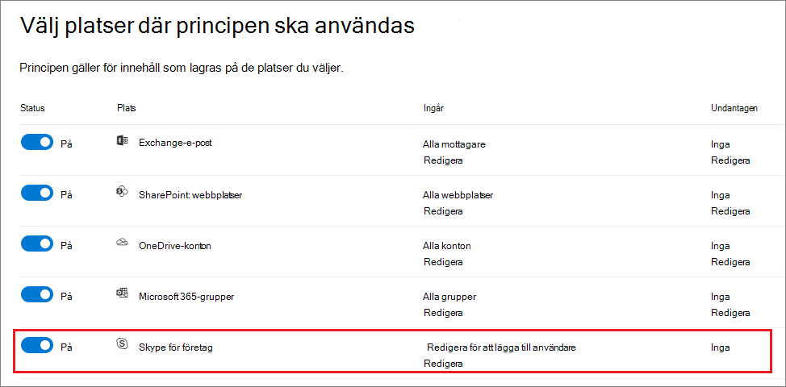
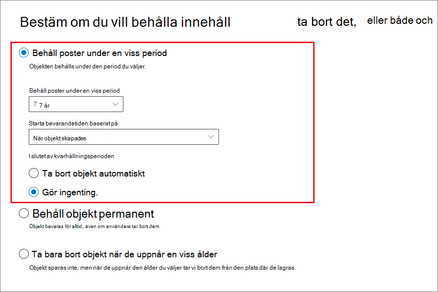

# Skapa och konfigurera kvarhållningsprinciperCreate and configure retention policies

>*[Vägledning för säkerhet och efterlevnad med licensiering i Microsoft 365](/office365/servicedescriptions/microsoft-365-service-descriptions/microsoft-365-tenantlevel-services-licensing-guidance/microsoft-365-security-compliance-licensing-guidance).**[Microsoft 365 licensing guidance for security & compliance](/office365/servicedescriptions/microsoft-365-service-descriptions/microsoft-365-tenantlevel-services-licensing-guidance/microsoft-365-security-compliance-licensing-guidance).*

Använd en kvarhållningsprincip för att hantera data för din organisation genom att proaktivt bestämma om du vill behålla innehåll, ta bort innehåll eller behålla och sedan ta bort innehållet.Use a retention policy to manage the data for your organization by deciding proactively whether to retain content, delete content, or retain and then delete the content.

Med en kvarhållningsprincip kan du göra detta mycket effektivt genom att tilldela samma kvarhållningsinställningar på behållarnivån som automatiskt ärvs av innehåll i den behållaren.A retention policy lets you do this very efficiently by assigning the same retention settings at the container level to be automatically inherited by content in that container. Till exempel alla objekt på SharePoint-webbplatser, alla e-postmeddelanden i användarnas Exchange-postlådor, alla kanalmeddelanden för team som används med Microsoft Teams.For example, all items in SharePoint sites, all email messages in users' Exchange mailboxes, all channel messages for teams that are used with Microsoft Teams. Om du är osäker på om du ska använda en kvarhållningsprincip på behållarnivån eller en kvarhållningsetikett på objektnivån kan du gå till [Kvarhållningsprinciper och kvarhållningsetiketter](retention.md#retention-policies-and-retention-labels).If you're not sure whether to use a retention policy at the container level or a retention label at the item level, see [Retention policies and retention labels](retention.md#retention-policies-and-retention-labels).

Mer information om kvarhållningsprinciper och hur kvarhållning fungerar i Microsoft 365 finns i [Mer information om kvarhållningsprinciper och kvarhållningsetiketter](retention.md).For more information about retention policies and how retention works in Microsoft 365, see [Learn about retention policies and retention labels](retention.md).

> [!NOTE]
> Informationen på den här sidan är till för efterlevnadsadministratörer.The information on this page is for compliance administrators. Om du inte är administratör och vill förstå hur kvarhållningsprinciper har konfigurerats för de program du använder kontaktar du supportavdelningen, IT-avdelningen eller administratören.If you are not an administrator and want to understand how retention policies have been configured for the apps that you use, contact your help desk, IT department, or administrator. Om du ser meddelanden om kvarhållningsprinciper i Teams-chattar och kanalmeddelanden kan det vara bra att läsa [Teams-meddelanden om kvarhållningsprinciper](https://support.microsoft.com/office/teams-messages-about-retention-policies-c151fa2f-1558-4cf9-8e51-854e925b483b).If you're seeing messages about retention policies in Teams chats and channel messages, you might find it helpful to review [Teams messages about retention policies](https://support.microsoft.com/office/teams-messages-about-retention-policies-c151fa2f-1558-4cf9-8e51-854e925b483b).

## Innan du börjarBefore you begin

Den globala administratören för organisationen har fullständig behörighet för att skapa och redigera kvarhållningsprinciper.The global admin for your organization has full permissions to create and edit retention policies. Om du inte loggar in som global administratör kan du läsa mer i [Behörigheter som krävs för att skapa och hantera kvarhållningsprinciper och kvarhållningsetiketter](get-started-with-retention.md#permissions-required-to-create-and-manage-retention-policies-and-retention-labels).If you aren't signing in as a global admin, see [Permissions required to create and manage retention policies and retention labels](get-started-with-retention.md#permissions-required-to-create-and-manage-retention-policies-and-retention-labels).

## Skapa och konfigurera en kvarhållningsprincipCreate and configure a retention policy

Även om en kvarhållningsprincip kan ha stöd för flera tjänster som identifieras som "platser" i kvarhållningsprincipen kan du inte skapa en enskild kvarhållningsprincip som omfattar alla platser som stöds:Although a retention policy can support multiple services that are identified as "locations" in the retention policy, you can't create a single retention policy that includes all the supported locations:

- Exchange-e-postExchange email
- SharePoint-webbplatsSharePoint site
- OneDrive-kontonOneDrive accounts
- Microsoft 365-grupperMicrosoft 365 groups
- Skype för företagSkype for Business
- Gemensamma Exchange-mapparExchange public folders
- Teams-kanalmeddelandenTeams channel messages
- Teams-chattarTeams chats
- Community-meddelanden i YammerYammer community messages
- Användarmeddelanden i YammerYammer user messages

Om du väljer Teams- eller Yammer-platserna när du skapar en kvarhållningsprincip exkluderas de andra platserna automatiskt.If you select the Teams or Yammer locations when you create a retention policy, the other locations are automatically excluded. Det innebär att instruktionerna du ska följa beror på om du behöver inkludera Teams- eller Yammer-platserna:This means that the instructions to follow depend on whether you need to include the Teams or Yammer locations:

- [Instruktioner för en kvarhållningsprincip för Teams-platserInstructions for a retention policy for Teams locations](#retention-policy-for-teams-locations)
- [Instruktioner för en kvarhållningsprincip för Yammer-platserInstructions for a retention policy for Yammer locations](#retention-policy-for-yammer-locations)
- [Instruktioner för en kvarhållningsprincip för andra platser än Teams och YammerInstructions for a retention policy for locations other than Teams and Yammer](#retention-policy-for-locations-other-than-teams-and-yammer)

Om du har fler än en kvarhållningsprincip och du också använder kvarhållningsetiketter kan du läsa [Principerna för kvarhållning, eller vad som har företräde](retention.md#the-principles-of-retention-or-what-takes-precedence) för att förstå resultatet när flera kvarhållningsinställningar gäller för samma innehåll.When you have more than one retention policy, and when you also use retention labels, see [The principles of retention, or what takes precedence?](retention.md#the-principles-of-retention-or-what-takes-precedence) to understand the outcome when multiple retention settings apply to the same content.

### Kvarhållningsprincip för Teams-platserRetention policy for Teams locations

1. I [Microsoft 365 Efterlevnadscenter](https://compliance.microsoft.com/) väljer du **Principer** > **Kvarhållning**.From the [Microsoft 365 compliance center](https://compliance.microsoft.com/), select **Policies** > **Retention**.

2. Välj **Ny kvarhållningsprincip** för att starta guiden Skapa kvarhållningsprincip, och namnge den nya kvarhållningsprincipen.Select **New retention policy** to start the Create retention policy wizard, and name your new retention policy.

3. För sidan **Välj platser där principen ska tillämpas** väljer du en eller båda platserna för Teams: **Teams-kanalmeddelande** och **Teams-chattar**.For the **Choose locations to apply the policy** page, select one or both of the locations for Teams: **Teams channel message** and **Teams chats**.

   För **Teams-kanalmeddelanden** inkluderas meddelanden från standardkanaler men inte från [privata kanaler](/microsoftteams/private-channels).For **Teams channel messages**, message from standard channels but not [private channels](/microsoftteams/private-channels) are included. För närvarande stöds inte privata kanaler av kvarhållningsprinciper.Currently, private channels aren't supported by retention policies.

   Som standard är [alla team och alla användare markerade](#a-policy-that-applies-to-entire-locations), men du kan förfina det genom att välja [alternativen **Välj** och **Exkludera**](#a-policy-with-specific-inclusions-or-exclusions).By default, [all teams and all users are selected](#a-policy-that-applies-to-entire-locations), but you can refine this by selecting the [**Choose** and **Exclude** options](#a-policy-with-specific-inclusions-or-exclusions). Innan du ändrar standardinställningen bör du tänka på följande konsekvenser för en kvarhållningsprincip som tar bort meddelanden när den konfigureras för att omfatta eller exkludera:However, before you change the default, be aware of the following consequences for a retention policy that deletes messages when it's configured for includes or excludes:
    
    - För gruppchattar, eftersom en kopia av meddelanden sparas i varje användares postlåda som ingår i chatten, kommer kopior av meddelanden fortfarande att returneras i eDiscovery-resultat från användare som inte har tilldelats principen.For group chats, because a copy of messages are saved in each user's mailbox who are included in the chat, copies of messages will continue to be returned in eDiscovery results from users who weren't assigned the policy.
    - För användare som inte har tilldelats principen returneras borttagna meddelanden i sökresultat för Teams, men meddelandets innehåll visas inte som ett resultat av den permanenta borttagningen från principen som är tilldelad till användare.For users who weren't assigned the policy, deleted messages will be returned in their Teams search results but won't display the contents of the message as a result of the permanent deletion from the policy assigned to users.

4. För sidan **Bestäm om du vill bevara innehållet och/eller ta bort det** i guiden anger du konfigurationsalternativ för att behålla eller ta bort innehåll.For **Decide if you want to retain content, delete it, or both** page of the wizard, specify the configuration options for retaining and deleting content.

   Du kan skapa en kvarhållningsprincip som bara behåller innehåll utan borttagning, som behåller och sedan tar bort efter en angiven tidsperiod eller som bara tar bort innehåll efter en angiven tidsperiod.You can create a retention policy that just retains content without deleting, retains and then deletes after a specified period of time, or just deletes content after a specified period of time. Mer information finns i [Inställningar för att behålla och ta bort innehåll](#settings-for-retaining-and-deleting-content) på den här sidan.For more information, see [Settings for retaining and deleting content](#settings-for-retaining-and-deleting-content) on this page.

5. Slutför guiden för att spara inställningarna.Complete the wizard to save your settings.

Mer information om när du använder kvarhållningsprinciper för Teams och för att förstå slutanvändarupplevelsen finns i [Hantera kvarhållningsprinciper för Microsoft Teams](/microsoftteams/retention-policies), via Teams-dokumentationen.For guidance when to use retention policies for Teams and understand the end user experience, see [Manage retention policies for Microsoft Teams](/microsoftteams/retention-policies) from the Teams documentation.

Teknisk information om hur kvarhållning fungerar för Teams, inklusive vilka delar av meddelanden som stöds för kvarhållning och tidsinställningar med exempel, finns i [Mer information om kvarhållning för Microsoft Teams](retention-policies-teams.md).For technical details about how retention works for Teams, including what elements of messages are supported for retention and timing information with example walkthroughs, see [Learn about retention for Microsoft Teams](retention-policies-teams.md).

#### Kända konfigurationsproblemKnown configuration issues

- Även om du kan välja att starta kvarhållningsperioden när objekten senast ändrades så används alltid värdet **När objekt skapades**.Although you can select the option to start the retention period when items were last modified, the value of **When items were created** is always used. För meddelanden som redigeras sparas en kopia av det ursprungliga meddelandet med sin ursprungliga tidsstämpel för att identifiera när det här förredigerade meddelandet skapades, och det efterredigerade meddelandet har en nyare tidsstämpel.For messages that are edited, a copy of the original message is saved with its original timestamp to identify when this pre-edited message was created, and the post-edited message has a newer timestamp.

- När du väljer **Välj team** för platsen **Teams-kanalmeddelanden** kanske du ser Microsoft 365-grupper som inte också är team.When you select **Choose teams** for the **Teams channel messages** location, you might see Microsoft 365 groups that aren't also teams. Markera inte de här grupperna.Don't select these groups.

- När du väljer **Välj användare för platsen Teams-chattar** kan du se gäster och användare utan postlåda.When you select **Choose users for the Teams chats** location, you might see guests and non-mailbox users. Kvarhållningsprinciperna är inte avsedda för de här användarna, så välj dem inte.Retention policies aren't designed for these users, so don't select them.

#### Ytterligare kvarhållningsprincip som behövs för att stödja TeamsAdditional retention policy needed to support Teams

Teams är mer än bara chattar och kanalmeddelanden.Teams is more than just chats and channel messages. Om du har team som skapats från en Microsoft 365-grupp (tidigare Office 365-grupp) bör du dessutom konfigurera en kvarhållningsprincip som inkluderar den Microsoft 365-gruppen genom att använda platsen **Microsoft 365-grupper**.If you have teams that were created from a Microsoft 365 group (formerly Office 365 group), you should additionally configure a retention policy that includes that Microsoft 365 group by using the **Microsoft 365 Groups** location. Den här kvarhållningsprincipen gäller för innehåll i gruppens postlåda, webbplats och filer.This retention policy applies to content in the group's mailbox, site, and files.

Om du har gruppwebbplatser som inte är anslutna till en Microsoft 365-grupp behöver du en kvarhållningsprincip som inkluderar platserna **SharePoint-webbplatser** eller **OneDrive-konton** för att behålla och ta bort filer i Teams:If you have team sites that aren't connected to a Microsoft 365 group, you need a retention policy that includes the **SharePoint sites** or **OneDrive accounts** locations to retain and delete files in Teams:

- Filer som delas i chatten lagras på OneDrive-kontot för användaren som delade filen.Files that are shared in chat are stored in the OneDrive account of the user who shared the file.

- Filer som laddas upp till kanaler lagras på teamets SharePoint-webbplats.Files that are uploaded to channels are stored in the SharePoint site for the team.

> [!TIP]
> Du kan använda en kvarhållningsprincip på filer för bara ett visst team när det inte är anslutet till en Microsoft 365-grupp genom att välja teamets SharePoint-webbplats och OneDrive-kontona för användare i teamet.You can apply a retention policy to the files of just a specific team when it's not connected to a Microsoft 365 group by selecting the SharePoint site for the team, and the OneDrive accounts of users in the Team.

Det är möjligt att en kvarhållningsprincip som används på Microsoft 365-grupper, SharePoint-webbplatser eller OneDrive-konton kan ta bort en fil som refereras i en Teams-chatt eller ett kanalmeddelande innan de meddelandena tas bort.It's possible that a retention policy that's applied to Microsoft 365 groups, SharePoint sites, or OneDrive accounts could delete a file that's referenced in a Teams chat or channel message before those messages get deleted. I det här scenariot visas filen fortfarande i Teams-meddelandet, men när användarna väljer filen får de felmeddelandet "Filen hittades inte".In this scenario, the file still displays in the Teams message, but when users select the file, they get a "File not found" error. Det här beteendet är inte specifikt för kvarhållningsprinciper och kan också inträffa om en användare manuellt tar bort en fil från SharePoint eller OneDrive.This behavior isn't specific to retention policies and could also happen if a user manually deletes a file from SharePoint or OneDrive.

### Kvarhållningsprincip för Yammer-platserRetention policy for Yammer locations

> [!NOTE]
> Kvarhållningsprinciper för Yammer distribueras som förhandsversion.Retention policies for Yammer are rolling out in preview. Om du inte ser de nya platserna för Yammer kan du försöka igen om några veckor.If you don't yet see the new locations for Yammer, try again in a few weeks.
>
> För att använda den här funktionen måste Yammer-nätverket vara i [enhetligt läge](/yammer/configure-your-yammer-network/overview-native-mode), inte hybridläge.To use this feature, your Yammer network must be [Native Mode](/yammer/configure-your-yammer-network/overview-native-mode), not Hybrid Mode.

1. I [Microsoft 365 Efterlevnadscenter](https://compliance.microsoft.com/) väljer du **Principer** > **Kvarhållning**.From the [Microsoft 365 compliance center](https://compliance.microsoft.com/), select **Policies** > **Retention**.

2. Välj **Ny kvarhållningsprincip** för att skapa en ny kvarhållningsprincip.Select **New retention policy** to create a new retention policy.

3. För sidan **Bestäm om du vill bevara innehållet och/eller ta bort det** i guiden anger du konfigurationsalternativ för att behålla och ta bort innehåll.For **Decide if you want to retain content, delete it, or both** page of the wizard, specify the configuration options for retaining and deleting content. 
    
    Du kan skapa en kvarhållningsprincip som bara behåller innehåll utan borttagning, som behåller och sedan tar bort efter en angiven tidsperiod eller som bara tar bort innehåll efter en angiven tidsperiod.You can create a retention policy that just retains content without deleting, retains and then deletes after a specified period of time, or just deletes content after a specified period of time. Mer information finns i [Inställningar för att behålla och ta bort innehåll](#settings-for-retaining-and-deleting-content) på den här sidan.For more information, see [Settings for retaining and deleting content](#settings-for-retaining-and-deleting-content) on this page.
    
    Välj inte **Använd avancerade inställningar för kvarhållning** eftersom det här alternativet inte stöds för Yammer-platser.Do not select **Use advanced retention settings** because this option isn't supported for Yammer locations. 

4. För sidan **Välj platser** väljer du **Låt mig välja specifika platser**.For the **Choose locations** page, select **Let me choose specific locations**. Aktivera sedan en eller båda platserna för Yammer: **Community-meddelanden i Yammer** och **Användarmeddelanden i Yammer**.Then toggle on one or both of the locations for Yammer: **Yammer community message** and **Yammer user messages**.
    
    Som standard är alla communities och användare markerade, men du kan förfina detta genom att ange communities och användare som ska inkluderas eller exkluderas.By default, all communities and users are selected, but you can refine this by specifying communities and users to be included or excluded.
    
    För användarmeddelanden i Yammer:For Yammer user messages: 
    - Om du lämnar standardvärdet som **Alla** inkluderas inte Azure B2B-gästanvändare.If you leave the default at **All**, Azure B2B guest users are not included. 
    - Om du väljer **Välj användare** kan du tillämpa en kvarhållningsprincip på externa användare om du känner till deras konto.If you select **Choose user**, you can apply a retention policy to external users if you know their account.

5. Slutför guiden och spara inställningarna.Complete the wizard to save your settings.

Mer information om hur kvarhållningsprinciper fungerar för Yammer finns i [Mer information om kvarhållning för Yammer](retention-policies-yammer.md).For more information about how retention policies work for Yammer, see [Learn about retention for Yammer](retention-policies-yammer.md).

#### Ytterligare kvarhållningsprinciper som behövs för att stödja YammerAdditional retention policies needed to support Yammer

Yammer är mer än bara community-meddelanden och privata meddelanden.Yammer is more than just community messages and private messages. Om du vill behålla och ta bort e-postmeddelanden för Yammer-nätverket konfigurerar du en ytterligare kvarhållningsprincip som omfattar alla Microsoft 365-grupper som används för Yammer genom att använda platsen **Microsoft 365-grupper**.To retain and delete email messages for your Yammer network, configure an additional retention policy that includes any Microsoft 365 groups that are used for Yammer, by using the **Microsoft 365 Groups** location. 

Om du vill behålla och ta bort filer som lagras i Yammer behöver du en kvarhållningsprincip som inkluderar platserna **SharePoint-webbplatser** eller **OneDrive-konton**:To retain and delete files that are stored in Yammer, you need a retention policy that includes the **SharePoint sites** or **OneDrive accounts** locations:

- Filer som delas i privata meddelanden lagras på OneDrive-kontot för användaren som delade filen.Files that are shared in private messages are stored in the OneDrive account of the user who shared the file. 

- Filer som laddas upp till communities lagras på SharePoint-webbplatsen för Yammer-communityn.Files that are uploaded to communities are stored in the SharePoint site for the Yammer community.

Det är möjligt att en kvarhållningsprincip som används på SharePoint-webbplatser eller OneDrive-konton kan ta bort en fil som refereras i ett Yammer-meddelande innan de meddelandena tas bort.It's possible that a retention policy that's applied to SharePoint sites or OneDrive accounts could delete a file that's referenced in a Yammer message before those messages get deleted. I det här scenariot visas filen fortfarande i Yammer-meddelandet, men när användarna väljer filen får de felmeddelandet "Filen hittades inte".In this scenario, the file still displays in the Yammer message, but when users select the file, they get a "File not found" error. Det här beteendet är inte specifikt för kvarhållningsprinciper och kan också inträffa om en användare manuellt tar bort en fil från SharePoint eller OneDrive.This behavior isn't specific to retention policies and could also happen if a user manually deletes a file from SharePoint or OneDrive.

### Kvarhållningsprincip för andra platser än Teams och YammerRetention policy for locations other than Teams and Yammer

Använd följande instruktioner för kvarhållningsprinciper som gäller för någon av dessa tjänster:Use the following instructions for retention policies that apply to any of these services:

- Exchange: e-post och gemensamma mapparExchange: Email and public folders
- SharePoint: webbplatserSharePoint: Sites
- OneDrive: kontonOneDrive: Accounts
- Microsoft 365-grupperMicrosoft 365 groups
- Skype för företagSkype for Business

1. I [Microsoft 365 Efterlevnadscenter](https://compliance.microsoft.com/) väljer du **Principer** > **Kvarhållning**.From the [Microsoft 365 compliance center](https://compliance.microsoft.com/), select **Policies** > **Retention**.

2. Välj **Ny kvarhållningsprincip** för att starta guiden Skapa kvarhållningsprincip, och namnge den nya kvarhållningsprincipen.Select **New retention policy** to start the Create retention policy wizard, and name your new retention policy.

3. För sidan **Välj platser** aktiverar eller inaktiverar du valfria platser förutom platserna för Teams.For the **Choose locations** page, toggle on or off any of the locations except the locations for Teams. Du kan för varje plats lämna den på standardvärdet för att [tillämpa principen på hela platsen](#a-policy-that-applies-to-entire-locations), eller så kan du [ange vilka som ska inkluderas eller exkluderas](#a-policy-with-specific-inclusions-or-exclusions).For each location, you can leave it at the default to [apply the policy to the entire location](#a-policy-that-applies-to-entire-locations), or [specify includes and excludes](#a-policy-with-specific-inclusions-or-exclusions).

    Information som är specifik för platser:Information specific to locations:
    - [Exchange-e-post och gemensamma Exchange-mapparExchange email and Exchange public folders](#configuration-information-for-exchange-email-and-exchange-public-folders)
    - [SharePoint-webbplatser och OneDrive-kontonSharePoint sites and OneDrive accounts](#configuration-information-for-sharepoint-sites-and-onedrive-accounts)
    - [Microsoft 365-grupperMicrosoft 365 Groups](#configuration-information-for-microsoft-365-groups)
    - [Skype för företagSkype for Business](#configuration-information-for-skype-for-business)

4. För sidan **Bestäm om du vill bevara innehållet och/eller ta bort det** i guiden anger du konfigurationsalternativ för att behålla och ta bort innehåll.For **Decide if you want to retain content, delete it, or both** page of the wizard, specify the configuration options for retaining and deleting content.

    Du kan skapa en kvarhållningsprincip som bara behåller innehåll utan borttagning, som behåller och sedan tar bort efter en angiven tidsperiod eller som bara tar bort innehåll efter en angiven tidsperiod.You can create a retention policy that just retains content without deleting, retains and then deletes after a specified period of time, or just deletes content after a specified period of time. Mer information finns i [Inställningar för att behålla och ta bort innehåll](#settings-for-retaining-and-deleting-content) på den här sidan.For more information, see [Settings for retaining and deleting content](#settings-for-retaining-and-deleting-content) on this page.

5. Slutför guiden och spara inställningarna.Complete the wizard to save your settings.

#### Konfigurationsinformation för Exchange-e-post och gemensamma Exchange-mapparConfiguration information for Exchange email and Exchange public folders

Platsen **Exchange-e-post** har stöd för kvarhållning av användares e-post, kalender och andra postlådeobjekt genom att tillämpa kvarhållningsinställningar på nivån för en postlåda.The **Exchange email** location supports retention for users' email, calendar, and other mailbox items, by applying retention settings at the level of a mailbox.

Detaljerad information om vilka objekt som inkluderas och exkluderas när du konfigurerar kvarhållningsinställningar för Exchange finns i [Vad ingår för kvarhållning och borttagning](retention-policies-exchange.md#whats-included-for-retention-and-deletion)For detailed information about which items are included and excluded when you configure retention settings for Exchange, see [What's included for retention and deletion](retention-policies-exchange.md#whats-included-for-retention-and-deletion)

Även om en Microsoft 365-grupp har en Exchange-postlåda så kommer en kvarhållningsprincip som inkluderar hela platsen **Exchange-e-post** inte att inkludera innehåll i Microsoft 365-gruppostlådor.Note that even though a Microsoft 365 group has an Exchange mailbox, a retention policy that includes the entire **Exchange email** location won't include content in Microsoft 365 group mailboxes. För att behålla innehåll i dessa postlådor markerar du platsen **Microsoft 365-grupper**.To retain content in these mailboxes, select the **Microsoft 365 Groups** location.

Platsen **Gemensamma Exchange-mappar** tillämpar kvarhållningsinställningar på alla gemensamma mappar och kan inte tillämpas på mapp- eller postlådenivå.The **Exchange public folders** location applies retention settings to all public folders and can't be applied at the folder or mailbox level.

#### Konfigurationsinformation för SharePoint-webbplatser och OneDrive-kontonConfiguration information for SharePoint sites and OneDrive accounts

När du väljer platsen **SharePoint-webbplatser** kan kvarhållningsprincipen behålla och ta bort dokument på SharePoint-kommunikationswebbplatser, gruppwebbplatser som inte är anslutna med Microsoft 365-grupper samt klassiska webbplatser.When you choose the **SharePoint sites** location, the retention policy can retain and delete documents in SharePoint communication sites, team sites that aren't connected by Microsoft 365 groups, and classic sites. Gruppwebbplatser som är anslutna med Microsoft 365-grupper stöds inte med det här alternativet, utan använder istället platsen **Microsoft 365-grupper** som gäller för innehåll i gruppens postlåda, webbplats och filer.Team sites connected by Microsoft 365 groups aren't supported with this option and instead, use the **Microsoft 365 Groups** location that applies to content in the group's mailbox, site, and files.

Även om kvarhållningsprincipen tillämpas på webbplatsnivå tillämpas kvarhållningsinställningar bara på dokument.Although the retention policy is applied at the site level, only documents have retention settings applied to them. Detaljerad information om vad som inkluderas och exkluderas när du konfigurerar kvarhållningsinställningar för SharePoint och OneDrive finns i [Vad ingår för kvarhållning och borttagning](retention-policies-sharepoint.md#whats-included-for-retention-and-deletion).For detailed information about what's included and excluded when you configure retention settings for SharePoint and OneDrive, see [What's included for retention and deletion](retention-policies-sharepoint.md#whats-included-for-retention-and-deletion). 

När du anger platserna för SharePoint-webbplatser eller OneDrive-konton behöver du inte behörighet för att komma åt webbplatserna och ingen verifiering utförs när du anger URL-adressen på sidan **Redigera platser**.When you specify your locations for SharePoint sites or OneDrive accounts, you don't need permissions to access the sites and no validation is done at the time you specify the URL on the **Edit locations** page. I slutet av guiden kontrolleras däremot att de SharePoint-webbplatser som du anger finns.However, the SharePoint sites that you specify are checked that they exist at the end of the wizard. Om kontrollen misslyckas visas ett meddelande om att verifieringen misslyckades för URL-adressen du angav och guiden skapar inte kvarhållningsprincipen förrän verifieringskontrollen godkänns.If this check fails, you see a message that validation failed for the URL you entered, and the wizard won't create the retention policy until the validation check passes. Om det här meddelandet visas går du tillbaka i guiden och ändrar URL-adressen eller tar bort webbplatsen från kvarhållningsprincipen.If you see this message, go back in the wizard to change the URL or remove the site from the retention policy.

För att ange enskilda OneDrive-konton som ska inkluderas eller exkluderas har URL-adressen följande format: `https://<tenant name>-my.sharepoint.com/personal/<user_name>_<tenant name>_com`To specify individual OneDrive accounts to include or exclude, the URL has the following format: `https://<tenant name>-my.sharepoint.com/personal/<user_name>_<tenant name>_com`

Exempelvis för en användare i Contoso-klientorganisationen som har användarnamnet "rsimone": `https://contoso-my.sharepoint.com/personal/rsimone_contoso_onmicrosoft_com`For example, for a user in the contoso tenant that has a user name of "rsimone": `https://contoso-my.sharepoint.com/personal/rsimone_contoso_onmicrosoft_com`

Information om hur du verifierar klientorganisationens syntax och identifierar URL-adresser för användare finns i [Få en lista över alla OneDrive-URL:er för användare i organisationen](/onedrive/list-onedrive-urls).To verify the syntax for your tenant and identify URLs for users, see [Get a list of all user OneDrive URLs in your organization](/onedrive/list-onedrive-urls).

### Konfigurationsinformation för Microsoft 365-grupperConfiguration information for Microsoft 365 Groups

För att behålla eller ta bort innehåll för en Microsoft 365-grupp (tidigare Office 365-grupp) använder du platsen **Microsoft 365-grupper**.To retain or delete content for a Microsoft 365 group (formerly Office 365 group), use the **Microsoft 365 Groups** location. Även om en Microsoft 365-grupp har en Exchange-postlåda så kommer en kvarhållningsprincip som inkluderar hela platsen **Exchange-e-post** inte att inkludera innehåll i Microsoft 365-gruppostlådor.Even though a Microsoft 365 group has an Exchange mailbox, a retention policy that includes the entire **Exchange email** location won't include content in Microsoft 365 group mailboxes. Även om du med platsen **Exchange-e-post** till en början kan ange att en gruppostlåda ska inkluderas eller exkluderas visas ett felmeddelande om att "RemoteGroupMailbox" inte är ett giltigt val för Exchange-platsen när du försöker spara kvarhållningsprincipen.Although the **Exchange email** location initially allows you to specify a group mailbox to be included or excluded, when you try to save the retention policy, you'll see an error that "RemoteGroupMailbox" is not a valid selection for the Exchange location.

En kvarhållningsprincip som används för en Microsoft 365-grupp inkluderar som standard gruppostlådan och SharePoint-gruppwebbplatsen.By default, a retention policy applied to a Microsoft 365 group includes the group mailbox and SharePoint teams site. Filer som lagras på SharePoint-gruppwebbplatsen omfattas av den här platsen, men inte Teams-chattar eller Teams-kanalmeddelanden som har sina egna platser för kvarhållningsprinciper.Files stored in the SharePoint teams site are covered with this location, but not Teams chats or Teams channel messages that have their own retention policy locations.

Om du vill ändra standardvärdet eftersom du vill att kvarhållningsprincipen bara ska gälla för Microsoft 365-postlådorna eller bara de anslutna SharePoint-gruppwebbplatserna använder du PowerShell-cmdleten [Set-RetentionCompliancePolicy](/powershell/module/exchange/set-retentioncompliancepolicy) med parametern *Applications* med något av följande värden:To change the default because you want the retention policy to apply to either just the Microsoft 365 mailboxes, or just the connected SharePoint teams sites, use the [Set-RetentionCompliancePolicy](/powershell/module/exchange/set-retentioncompliancepolicy) PowerShell cmdlet with the *Applications* parameter with one of the following values:

- `Group:Exchange` för bara Microsoft 365-postlådor som är anslutna till gruppen.`Group:Exchange` for just Microsoft 365 mailboxes that are connected to the group.
- `Group:SharePoint` för bara SharePoint-webbplatser som är anslutna till gruppen.`Group:SharePoint` for just SharePoint sites that are connected to the group.

Om du vill återgå till standardvärdet för både postlådan och SharePoint-webbplatsen för de valda Microsoft 365-grupperna anger du `Group:Exchange,SharePoint`.To return to the default value of both the mailbox and SharePoint site for the selected Microsoft 365 groups, specify `Group:Exchange,SharePoint`.

### Konfigurationsinformation för Skype för företagConfiguration information for Skype for Business

Till skillnad från andra platser kan du inte aktivera status för Skype-platsen så att alla användare inkluderas automatiskt.Unlike other locations, you can't toggle the status of the Skype location on to automatically include all users. När du aktiverar den platsen måste du istället välja alternativet **Redigera** för att manuellt välja de användare vars konversationer du vill behålla:Instead, when you turn on that location, you must then select the **Edit** option to manually choose the users whose conversations you want to retain:

När du har valt alternativet **Redigera** kan du snabbt inkludera alla användare i rutan **Skype för företag** genom att markera den dolda rutan före kolumnen **Namnge**.After you select this **Edit** option, in the **Skype for Business** pane you can quickly include all users by selecting the hidden box before the **Name** column. Det är dock viktigt att förstå att varje användare räknas som en specifik inkludering i principen.However, it's important to understand that each user counts as a specific inclusion in the policy. Så om du inkluderar 1 000 användare genom att markera den här rutan är det samma som om du manuellt valde 1 000 användare att inkluderas, vilket är det högsta antalet som stöds för Skype för företag.So if you include 1,000 users by selecting this box, it's the same as if you manually selected 1,000 users to include, which is the maximum supported for Skype for Business.

Observera att **Konversationshistorik**, en mapp i Outlook, är en funktion som inte har något med Skype-arkivering att göra.Be aware that **Conversation History**, a folder in Outlook, is a feature that has nothing to do with Skype archiving. **Konversationshistorik** kan inaktiveras av slutanvändaren, men arkivering för Skype utförs genom att en kopia av Skype-konversationerna lagras i en dold mapp som inte är tillgänglig för användaren men är tillgänglig för eDiscovery.**Conversation History** can be turned off by the end user, but archiving for Skype is done by storing a copy of Skype conversations in a hidden folder that is inaccessible to the user but available to eDiscovery.

## Inställningar för att behålla och ta bort innehållSettings for retaining and deleting content

När du väljer inställningarna för att behålla och ta bort innehåll i kvarhållningsprincipen får kvarhållningsprincipen en av följande konfigurationer under en angiven tidsperiod:By choosing the settings for retaining and deleting content in your retention policy, your retention policy will have one of the following configurations for a specified period of time:

- Endast behållaRetain-only

    För den här konfigurationen väljer du **Behålla objekt under en viss tidsperiod** och **I slutet av kvarhållningsperioden: Gör ingenting**.For this configuration, choose **Retain items for a specific period** and **At end of the retention period: Do nothing**. Eller välj **Behåll objekt permanent**.Or, select **Retain items forever**.

- Behålla och sedan ta bortRetain and then delete

    För den här konfigurationen väljer du **Behålla objekt under en viss tidsperiod** och **I slutet av kvarhållningsperioden: Ta bort objekt automatiskt**.For this configuration, choose **Retain items for a specific period** and **At end of the retention period: Delete items automatically**.

- Endast ta bortDelete-only

    För den här konfigurationen väljer du **Ta endast bort objekt när de når en viss ålder**.For this configuration, choose **Only delete items when they reach a certain age**.

### Behålla innehåll under en viss tidsperiodRetaining content for a specific period of time

När du konfigurerar en kvarhållningsprincip väljer du att behålla objekt under ett visst antal dagar, månader eller år. Du kan också behålla objekten permanent.When you configure a retention policy, you choose to retain items for a specific number of days, months, or years. Or alternatively, retain the items forever.

När du konfigurerar en kvarhållningsprincip kan du välja att behålla innehåll permanent eller under ett visst antal dagar, månader eller år.When you configure a retention policy, you can choose to retain content indefinitely or for a specific number of days, months, or years. Kvarhållningsperioden beräknas utifrån innehållets ålder, inte från när kvarhållningsprincipen tillämpas.The retention period is calculated from the age of the content, not from when the retention policy is applied.

I början av kvarhållningsperioden kan du också välja när innehållet skapades eller när det senast ändrades, men det senare stöds bara för filer och SharePoint, OneDrive och Microsoft 365-grupper.For the start of the retention period, you can also choose when the content was created or, supported only for files and the SharePoint, OneDrive, and Microsoft 365 Groups, when the content was last modified.

Exempel:Examples:

- SharePoint: Om du vill behålla objekt i en webbplatssamling i sju år efter att innehållet senast ändrades och ett dokument i webbplatssamlingen inte har ändrats på sex år behålls dokumentet bara i ytterligare ett år om det inte ändras.SharePoint: If you want to retain items in a site collection for seven years after this content is last modified, and a document in that site collection hasn't been modified in six years, the document will be retained for only another year if it's not modified. Om dokumentet redigeras igen beräknas dokumentets ålder från det nya senast ändrade datumet och det behålls i ytterligare sju år.If the document is edited again, the age of the document is calculated from the new last modified date, and it will be retained for another seven years.

- Exchange: Om du vill behålla objekt i en postlåda i sju år och ett meddelande skickades för sex år sedan behålls meddelandet i endast ett år.Exchange: If you want to retain items in a mailbox for seven years, and a message was sent six years ago, the message will be retained for only one year. För Exchange-objekt baseras åldern på mottagningsdatumet för inkommande e-post, eller på sändningsdatumet för utgående e-post.For Exchange items, the age is based on the date received for incoming email, or the date sent for outgoing email. Att behålla objekt baserat på när det senast ändrades gäller endast för webbplatsinnehåll i OneDrive och SharePoint.Retaining items based on when it was last modified applies only to site content in OneDrive and SharePoint.

I slutet av kvarhållningsperioden väljer du om du vill att innehållet ska tas bort permanent:At the end of the retention period, you choose whether you want the content to be permanently deleted:

### Ta bort innehåll som är äldre än en viss ålderDeleting content that's older than a specific age

En kvarhållningsprincip kan både behålla och sedan ta bort objekt, eller ta bort gamla objekt utan att behålla dem.A retention policy can both retain and then delete items, or delete old items without retaining them.

Om kvarhållningsprincipen tar bort objekt är det i båda fallen viktigt att förstå att den angivna tidsperioden för en kvarhållningsprincip beräknas från den tid då objektet skapades eller ändrades, och inte tiden sedan principen tilldelades.In both cases, if your retention policy deletes items, it's important to understand that the time period specified for a retention policy is calculated from the time when the item was created or modified, and not the time since the policy was assigned.

Innan du tilldelar en kvarhållningsprincip för första gången, och särskilt när den principen tar bort objekt, bör du först beakta åldern på det befintliga innehållet och hur principen kan påverka innehållet.So before you assign a retention policy for the first time, and especially when that policy deletes items, first consider the age of the existing content and how the policy may impact that content. Du kanske också vill informera användarna om den nya principen innan du tilldelar den, så att de får tid att utvärdera dess eventuella effekt.You might also want to communicate the new policy to your users before assigning it, to give them time to assess the possible impact.

### En princip som gäller för hela platserA policy that applies to entire locations

När du väljer platser, med undantag för Skype för företag, är standardinställningen **Alla** när statusen för platsen är **På**.When you choose locations, with the exception of Skype for Business, the default setting is **All** when the status of the location is **On**.

När en kvarhållningsprincip gäller för en kombination av hela platser finns det ingen begränsning för till exempel antalet mottagare, webbplatser, konton eller grupper som principen kan omfatta.When a retention policy applies to any combination of entire locations, there is no limit to the number of recipients, sites, accounts, groups, etc., that the policy can include.

Om en princip till exempel omfattar alla Exchange-e-postmeddelanden och alla SharePoint-webbplatser, inkluderas alla webbplatser och mottagare oavsett hur många de är.For example, if a policy includes all Exchange email and all SharePoint sites, all sites and recipients will be included, no matter how many. För Exchange gäller att alla nya postlådor som skapats efter att principen tillämpats automatiskt ärver principen.And for Exchange, any new mailbox created after the policy is applied will automatically inherit the policy.

### En princip med specifika inkluderingar eller exkluderingarA policy with specific inclusions or exclusions

Om du använder den valfria konfigurationen för att begränsa dina kvarhållningsinställningar till specifika användare, specifika Microsoft 365-grupper eller specifika webbplatser, finns det några begränsningar per princip som du bör känna till.Be aware that if you use the optional configuration to scope your retention settings to specific users, specific Microsoft 365 groups, or specific sites, there are some limits per policy to be aware of. Mer information finns i [Begränsningar för kvarhållningsprinciper och principer för kvarhållningsetiketter](retention-limits.md).For more information, see [Limits for retention policies and retention label policies](retention-limits.md). 

Om du vill använda den valfria konfigurationen för att begränsa dina kvarhållningsinställningar kontrollerar du att **Status** för platsen är **På** och använder sedan länkarna för att inkludera eller exkludera vissa användare, Microsoft 365-grupper eller webbplatser.To use the optional configuration to scope your retention settings, make sure the **Status** of that location is **On**, and then use the links to include or exclude specific users, Microsoft 365 groups, or sites.

> [!WARNING]
> Om du konfigurerar inkluderingar och sedan tar bort den sista återgår konfigurationen till **Alla** för platsen.If you configure includes and then remove the last one, the configuration reverts to **All** for the location.  Kontrollera att det här är den konfiguration du vill använda innan du sparar principen.Make sure this is the configuration that you intend before you save the policy.
>
> Om du till exempel anger en SharePoint-webbplats som ska inkluderas i din kvarhållningsprincip som är konfigurerad för att ta bort data, och sedan tar bort den enda webbplatsen, kommer alla SharePoint-webbplatser som standard att omfattas av kvarhållningsprincipen som tar bort data permanent. Samma sak gäller för Exchange-mottagare, OneDrive-konton, Teams-chattanvändare osv.For example, if you specify one SharePoint site to include in your retention policy that's configured to delete data, and then remove the single site, by default all SharePoint sites will then be subject to the retention policy that permanently deletes data. The same applies to includes for Exchange recipients, OneDrive accounts, Teams chat users etc.
>
> I det här scenariot inaktiverar du platsen om du inte vill att inställningen **Alla** för platsen ska omfattas av kvarhållningsprincipen.In this scenario, toggle the location off if you don't want the **All** setting for the location to be subject to the retention policy. Alternativt kan du ange exkluderingar som ska undantas från principen.Alternatively, specify excludes to be exempt from the policy.

## Uppdatera kvarhållningsprinciperUpdating retention policies

Vissa inställningar kan inte ändras efter att en kvarhållningsprincip har skapats och sparats, till exempel:Some settings can't be changed after a retention policy is created and saved, which include:
- Kvarhållningsprincipens namn och kvarhållningsinställningarna förutom kvarhållningsperioden och när kvarhållningsperioden ska börja.The retention policy name and the retention settings except the retention period and when to start the retention period.

Om du redigerar en kvarhållningsprincip och objekt redan omfattas av de ursprungliga inställningarna i kvarhållningsprincipen tillämpas de uppdaterade inställningarna automatiskt på de här objekten utöver objekt som nyligen har identifierats.If you edit a retention policy and items are already subject to the original settings in your retention policy, your updated settings will be automatically applied to these items in addition to items that are newly identified.

Den här uppdateringen är vanligtvis relativt snabb, men kan ta flera dagar.Usually this update is fairly quick but can take several days. När principreplikeringen för dina Microsoft 365-platser är klar ser du att statusen för kvarhållningsprincipen i Microsoft 365 Efterlevnadscenter ändras från **På (väntar)** till **På (genomförd)**.When the policy replication across your Microsoft 365 locations is complete, you'll see the status of the retention policy in the Microsoft 365 compliance center change from **On (Pending)** to **On (Success)**.

## Låsa principen för att förhindra ändringarLocking the policy to prevent changes

Om du behöver se till att ingen kan inaktivera principen, ta bort principen eller göra den mindre restriktiv kan du läsa mer i [Använda bevarandelås för att begränsa ändringar av kvarhållningsprinciper och principer för kvarhållningsetiketter](retention-preservation-lock.md).If you need to ensure that no one can turn off the policy, delete the policy, or make it less restrictive, see [Use Preservation Lock to restrict changes to retention policies and retention label policies](retention-preservation-lock.md).
