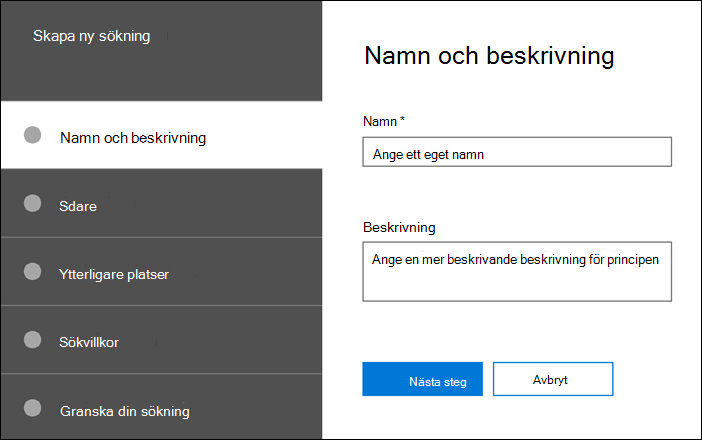

# Skapa en sökning

På fliken **Sökningar** i ditt ärende kan du skapa en ny sökning genom att klicka **på Ny sökning** och följa guiden.

## Namnge sökningen och ge den en beskrivning

Varje sökning med ett ärende ska ha ett unikt namn. Du kan också ange en beskrivning för sökningen. 

## Välj de andrekteriska och uppsövande platserna att söka på

Välj plats för det dokument du vill söka efter genom att ange att dokumentare som du har lagt till i ärendet. Om du väljer en vårdnadshavare körs sökningen mot alla datakällor som är mappade till den inskanssonen. Du kan också begränsa sökningen till valda datakällor för varje enskild person. Mer information om hur du lägger till och hanterar käll sereer och hanterar deras datakällor finns i [Arbeta med biblioteksvårdare.](managing-custodians.md)

## Välja platser som inte är insövade

I vissa fall kan du vilja söka i datakällor som inte är associerade med en vårdnadshavare. I det här fallet kan du ange platser du vill söka på eller välja att söka efter alla innehållsplatser för en viss Microsoft-tjänst (till exempel söka i alla Exchange-postlådor eller alla SharePoint-webbplatser och OneDrive-konton).

## Definiera sökfrågan och villkoren

Du kan definiera nyckelordsfrågan och eventuella villkor för sökningen med hjälp av de förbyggda villkorskorten eller med Hjälp av Keyword Query Language (KQL). Mer information finns i [Skapa sökfrågor.](building-search-queries.md)
