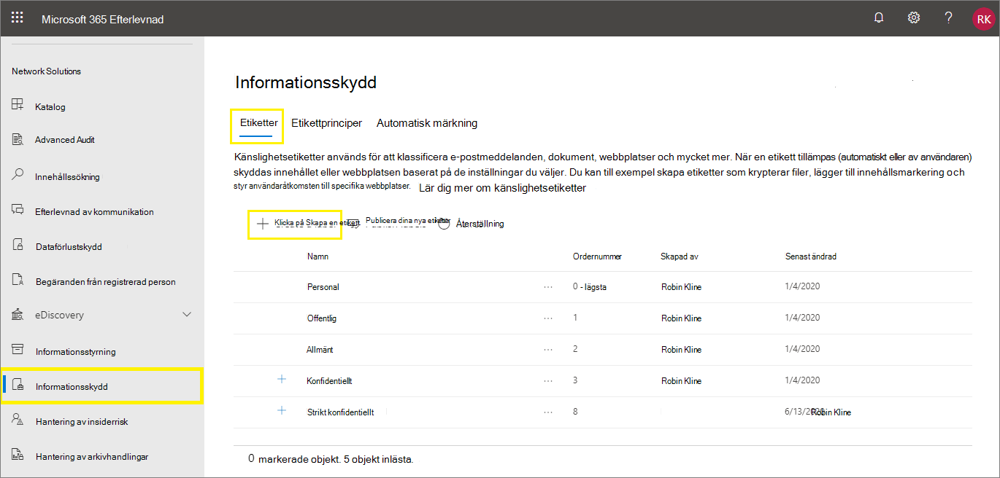
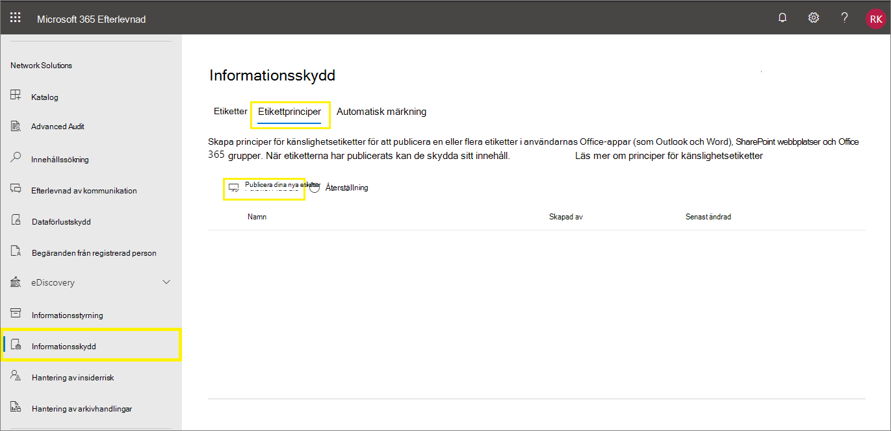
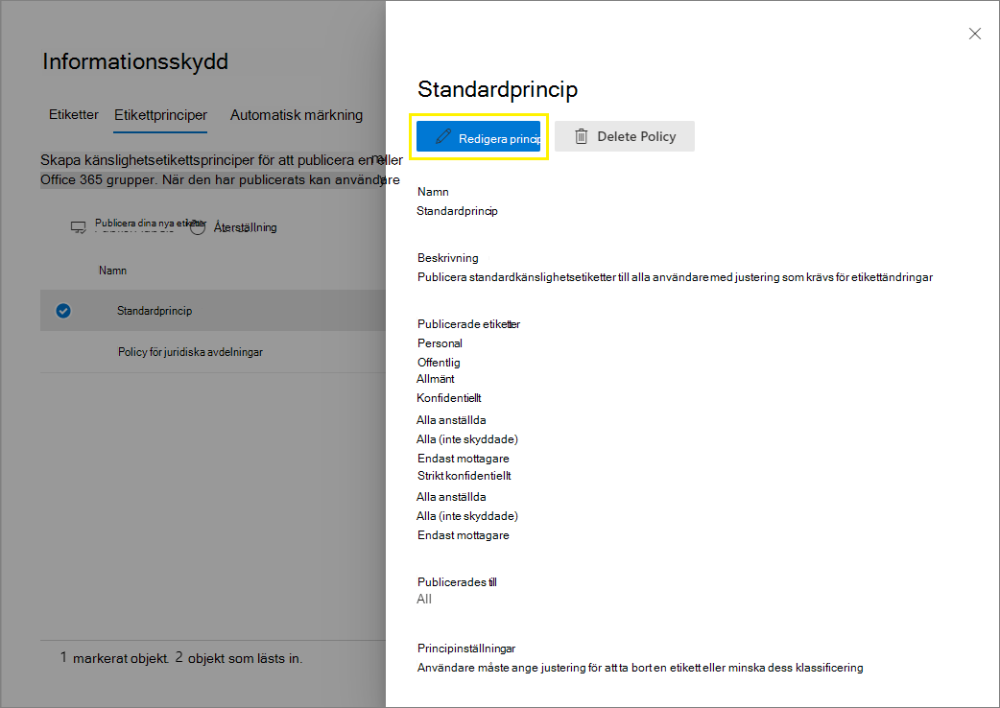

# <a name="create-and-configure-sensitivity-labels-and-their-policies"></a>Skapa och konfigurera känslighetsetiketter och deras principer

>*[Licensieringsvägledning för Microsoft 365 för säkerhet och efterlevnad](/office365/servicedescriptions/microsoft-365-service-descriptions/microsoft-365-tenantlevel-services-licensing-guidance/microsoft-365-security-compliance-licensing-guidance).*

Alla Microsoft Information Protection-lösningar (förkortas ibland MIP) implementeras med hjälp av [känslighetsetiketter](sensitivity-labels.md). Om du vill skapa och publicera etiketterna går du till [Microsoft 365 Efterlevnadscenter](https://compliance.microsoft.com/). Du kan också använda den äldre portalen, Säkerhets- och efterlevnadscenter för Office 365.

Börja med att skapa och konfigurera de känslighetsetiketter du vill göra tillgängliga för appar och andra tjänster. Till exempel de etiketter du vill att användarna ska se och använda från Office-apparna. 

Skapa sedan en eller flera etikettprinciper som innehåller de etiketter och principinställningar du konfigurerar. Det är etikettprincipen som publicerar etiketterna och inställningarna för valda användare och platser.

## <a name="before-you-begin"></a>Innan du börjar

Den globala administratören för organisationen har fullständiga behörigheter för att skapa och hantera alla aspekter av känslighetsetiketter. Om du inte loggar in som global administratör kan du läsa mer i [Behörigheter som krävs för att skapa och hantera känslighetsetiketter](get-started-with-sensitivity-labels.md#permissions-required-to-create-and-manage-sensitivity-labels).

## <a name="create-and-configure-sensitivity-labels"></a>Skapa och konfigurera känslighetsetiketter

1. Gå till känslighetsetiketterna i administrationscentret för etiketter:
    
    - Microsoft 365 Efterlevnadscenter: 
        - **Lösningar** > **Informationsskydd**
        
        Om du inte ser det här alternativet direkt väljer du först **Visa alla**. 
    
    - Säkerhets- och efterlevnadscenter:
        - **Klassificering** > **Känslighetsetiketter**

2. På sidan **Etiketter** väljer du **+ Skapa en etikett**, så startas guiden Ny känslighetsetikett. 
    
    Till exempel, från Microsoft 365 Efterlevnadscenter:
    
    
    
    > [!NOTE]
    > Klientorganisationen har som standard inga etiketter och du måste skapa dem. Etiketterna i exempelbilden visar standardetiketter som har [migrerats från Azure Information Protection](/azure/information-protection/configure-policy-migrate-labels).

3. På sidan **Definiera etikettens omfattning** avgör de valda alternativen etikettens omfattning för de inställningar som du kan konfigurera och var de visas när de har publicerats:
    
    
    
    - Om **Filer och e-postmeddelanden** har markerats kan du konfigurera inställningar i den här guiden som tillämpas för appar som stöder känslighetsetiketter, till exempel Office Word och Outlook. Om det här alternativet inte har markerats visas den första sidan för de här inställningarna i guiden, men du kan inte konfigurera dem och etiketterna kommer inte att vara tillgängliga för användare att välja i de här apparna.
    
    - Om **Grupper och webbplatser** har markerats kan du konfigurera inställningar i den här guiden som tillämpas för Microsoft 365-grupper och webbplatser för Teams och SharePoint. Om det här alternativet inte har markerats visas den första sidan för de här inställningarna i guiden, men du kan inte konfigurera dem och etiketterna kommer inte att vara tillgängliga för användare att välja för grupper och webbplatser.
    
    Information om omfattningen för **Azure Purview-resurser (förhandsversion)** finns i artikeln om att [automatiskt sätta en etikett på innehållet i Azure Purview](/azure/purview/create-sensitivity-label).

4. Följ anvisningarna i guiden för etikettinställningarna.
    
    Om du vill veta mer om etikettinställningarna kan du läsa avsnittet om [vad känslighetsetiketter kan göra](sensitivity-labels.md#what-sensitivity-labels-can-do) i översiktsinformationen och använda hjälpen i guiden för enskilda inställningar.

5. Upprepa de här stegen om du vill skapa fler etiketter. Om du däremot vill skapa en underetikett markerar du först den överordnade etiketten och väljer sedan **...** för **Fler åtgärder**. Välj **Lägg till underetikett**.

6. När du har skapat alla etiketter du behöver granskar du deras ordning och flyttar dem vid behov uppåt eller nedåt. Om du vill ändra ordningen på en etikett väljer du **...** för **Fler åtgärder**. Välj sedan **Flytta uppåt** eller **Flytta nedåt**. Mer information finns i avsnittet för [Etikettprioritet (ordning spelar roll)](sensitivity-labels.md#label-priority-order-matters) i översiktsinformationen.

Om du vill redigera en befintlig etikett markerar du den och väljer sedan knappen **Redigera etikett**:


Med den här knappen startar du guiden **Redigera känslighetsetikett**, där du kan ändra alla etikettinställningar i steg 4.

Ta inte bort en etikett om du inte förstår hur det påverkar användarna. Mer information finns i avsnittet [Ta bort etiketter](#removing-and-deleting-labels). 

> [!NOTE]
> Om du redigerar en etikett som redan har publicerats med hjälp av en etikettprincip krävs inga extra steg när du är klar med guiden. Du behöver till exempel inte lägga till den i en ny etikettprincip för att ändringarna ska bli tillgängliga för samma användare. Det kan ändå ta upp till 24 timmar innan ändringarna replikeras till alla appar och tjänster.

Etiketterna går inte att välja i appar eller för tjänster förrän du har publicerat dem. För att kunna publicera etiketter måste de [läggas till i en etikettprincip](#publish-sensitivity-labels-by-creating-a-label-policy).

> [!IMPORTANT]
> På fliken **Etiketter** ska du inte välja fliken **Publicera etiketter** (eller knappen **Publicera etikett** när du redigerar en etikett). Välj den bara om du behöver skapa en ny etikettprincip. Du behöver bara flera etikettprinciper om användarna behöver olika etiketter eller olika principinställningar. Ha som mål att ha så få etikettprinciper som möjligt – det är inte ovanligt att bara ha en etikettprincip för organisationen.

### <a name="additional-label-settings-with-security--compliance-center-powershell"></a>Ytterligare etikettinställningar med Säkerhets- och efterlevnadscenter via PowerShell

Ytterligare etikettinställningar är tillgängliga med cmdleten [Set-Label](/powershell/module/exchange/set-label) från [Säkerhets- och efterlevnadscenter via PowerShell](/powershell/exchange/scc-powershell).

Till exempel:

- Använd parametern *LocaleSettings* för multinationella distributioner så att användarna ser etikettens namn och knappbeskrivning på det lokala språket. I [följande avsnitt](#example-configuration-to-configure-a-sensitivity-label-for-different-languages) finns en exempelkonfiguration som anger etikettnamn och knappbeskrivningstext för franska, italienska och tyska.

- Endast när det gäller Azure Information Protection-klienten för enhetlig etikettering anger du även [avancerade inställningar](/azure/information-protection/rms-client/clientv2-admin-guide-customizations) som omfattar inställning av etikettfärg och användning av en anpassad egenskap när en etikett används. Hela listan finns i [Tillgängliga avancerade inställningar för etiketter](/azure/information-protection/rms-client/clientv2-admin-guide-customizations#available-advanced-settings-for-labels) i den här klientens administratörsguide.

#### <a name="example-configuration-to-configure-a-sensitivity-label-for-different-languages"></a>Exempelkonfiguration för hur du konfigurerar en känslighetsetikett för olika språk

I följande exempel visas PowerShell-konfigurationen för en etikett med namnet ”Public” med platshållartext för knappbeskrivningen. I det här exemplet är etikettnamnet och knappbeskrivningstexten konfigurerade för franska, italienska och tyska.

Tack vare den här konfigurationen ser användare som har Office-appar som använder dessa visningsspråk etikettnamn och knappbeskrivningar på samma språk. Det fungerar på liknande sätt om Azure Information Protection-klienten för enhetlig etikettering har installerats för att sätta etiketter på filer från Utforskaren. Användare som har de här språkversionerna av Windows kan då se etikettnamn och knappbeskrivningar på sitt lokala språk när de använder högerklicksåtgärder för etikettering.

Använd [språk-ID:n](/deployoffice/office2016/language-identifiers-and-optionstate-id-values-in-office-2016#language-identifiers) i Office (kallas även språktaggar) för de språk du behöver stöd för, och ange din egen översättning av etikettnamnet och knappbeskrivningen.

Innan du kör kommandona i PowerShell måste du först [ansluta till Säkerhets- och efterlevnadscentret via PowerShell](/powershell/exchange/connect-to-scc-powershell).


```powershell
$Languages = @("fr-fr","it-it","de-de")
$DisplayNames=@("Publique","Publico","Oeffentlich")
$Tooltips = @("Texte Français","Testo italiano","Deutscher text")
$label = "Public"
$DisplayNameLocaleSettings = [PSCustomObject]@{LocaleKey='DisplayName';
Settings=@(
@{key=$Languages[0];Value=$DisplayNames[0];}
@{key=$Languages[1];Value=$DisplayNames[1];}
@{key=$Languages[2];Value=$DisplayNames[2];})}
$TooltipLocaleSettings = [PSCustomObject]@{LocaleKey='Tooltip';
Settings=@(
@{key=$Languages[0];Value=$Tooltips[0];}
@{key=$Languages[1];Value=$Tooltips[1];}
@{key=$Languages[2];Value=$Tooltips[2];})}
Set-Label -Identity $Label -LocaleSettings (ConvertTo-Json $DisplayNameLocaleSettings -Depth 3 -Compress),(ConvertTo-Json $TooltipLocaleSettings -Depth 3 -Compress)
```

## <a name="publish-sensitivity-labels-by-creating-a-label-policy"></a>Publicera känslighetsetiketter genom att skapa en etikettprincip

1. Gå till känslighetsetiketterna i administrationscentret för etiketter:
    
    - Microsoft 365 Efterlevnadscenter: 
        - **Lösningar** > **Informationsskydd**
        
        Om du inte ser det här alternativet direkt väljer du först **Visa alla**. 
    
    - Säkerhets- och efterlevnadscenter:
        - **Klassificering** > **Känslighetsetiketter**

2. Välj fliken **Etikettprinciper** och sedan **Publicera etiketter** när du vill starta guiden Skapa princip:
    
    Till exempel, från Microsoft 365 Efterlevnadscenter:
        
    
    
    > [!NOTE]
    > Klientorganisationen har som standard inga etikettprinciper och du måste skapa dem. 

3. I guiden väljer du **Välj vilka känslighetsetiketter som ska publiceras**. Markera de etiketter som du vill göra tillgängliga i appar och tjänster, och välj sedan **Lägg till**.
    
    > [!IMPORTANT]
    > Om du väljer en underetikett väljer du också den överordnade etiketten.
    
4. Granska de markerade etiketterna och gör eventuella ändringar genom att välja **Redigera**. Annars väljer du **Nästa**.

5. Följ anvisningarna för att konfigurera principinställningarna.
    
    De principinställningar som visas matchar omfattningen för de etiketter du har valt. Om du till exempel har markerat etiketter som bara har omfattningen **Filer och e-postmeddelanden** visas inte principinställningarna **Använd den här etiketten som standard för grupper och webbplatser** och **Kräver att användare märker sina grupper och webbplatser**.
    
    Om du vill veta mer om de här inställningarna kan du läsa avsnittet om [vad etikettprinciper kan göra](sensitivity-labels.md#what-label-policies-can-do) i översiktsinformationen och använda hjälpen i guiden för enskilda inställningar.
    
    För etiketter som har konfigurerats för **Azure Purview-resurser (förhandsversion)**: De här etiketterna har inga associerade principinställningar.

7. Upprepa de här stegen om du behöver olika principinställningar för olika användare eller omfattningar. Du kanske till exempel vill använda ytterligare etiketter för en grupp användare eller en annan standardetikett för en del av användarna. Eller du kanske har konfigurerat etiketter så att de har olika omfattningar.

8. Om du skapar fler än en etikettprincip som kan leda till en konflikt för en användare granskar du principordningen och flyttar dem vid behov uppåt eller nedåt. Om du vill ändra ordningen för en etikettprincip väljer du **...** för **Fler åtgärder**. Välj sedan **Flytta uppåt** eller **Flytta nedåt**. Mer information finns i avsnittet för [Prioritet för etikettprinciper (ordning spelar roll)](sensitivity-labels.md#label-policy-priority-order-matters) i översiktsinformationen.

När du slutför guiden publiceras etikettprincipen automatiskt. Om du vill ändra en publicerad princip behöver du bara redigera den. Du behöver inte välja någon specifik åtgärd för att publicera eller publicera på nytt.

Om du vill redigera en befintlig etikettprincip markerar du den och väljer sedan knappen **Redigera policy**: 



Med den här knappen startar du guiden **Skapa princip**, där du kan redigera vilka etiketter som ingår och etikettinställningarna. När du slutför guiden replikeras alla ändringar automatiskt till de valda användarna och tjänsterna.

När du använder inbyggd etikettering för Office-appar i Windows, macOS, iOS och Android ser användarna nya etiketter inom fyra timmar, och inom en timme för Word, Excel och PowerPoint på webben när du uppdaterar webbläsaren. Det tar dock upp till 24 timmar innan ändringarna kopieras till alla appar och tjänster.

### <a name="additional-label-policy-settings-with-security--compliance-center-powershell"></a>Ytterligare inställningar för etikettprinciper med Säkerhets- och efterlevnadscenter via PowerShell

Ytterligare inställningar för etikettprinciper är tillgängliga med cmdleten [Set-LabelPolicy](/powershell/module/exchange/set-labelpolicy) från [Säkerhets- och efterlevnadscenter via PowerShell](/powershell/exchange/scc-powershell).

Azure Information Protection-klienten för enhetlig etikettering har stöd för många [avancerade inställningar](/azure/information-protection/rms-client/clientv2-admin-guide-customizations) som omfattar migrering från andra etikettlösningar och popup-meddelanden i Outlook som varnar för, motiverar eller blockerar e-postmeddelanden som skickas. Hela listan finns i [Tillgängliga avancerade inställningar för etikettprinciper](/azure/information-protection/rms-client/clientv2-admin-guide-customizations#available-advanced-settings-for-label-policies) i den här klientens administratörsguide.

## <a name="use-powershell-for-sensitivity-labels-and-their-policies"></a>Använda PowerShell för känslighetsetiketter och deras principer

Nu kan du använda [Säkerhets- och efterlevnadscenter via PowerShell](/powershell/exchange/scc-powershell) när du vill skapa och konfigurera alla inställningar som visas i administrationscentret för etiketter. Det innebär att du förutom att använda PowerShell för inställningar som inte är tillgängliga i administratörscentren för etiketter nu även kan göra fullständiga skript för att skapa och underhålla känslighetsetiketter och principer för känslighetsetiketter. 

I följande dokumentation finns information om parametrar och värden som stöds:

- [New-Label](/powershell/module/exchange/new-label)
- [New-LabelPolicy](/powershell/module/exchange/new-labelpolicy)
- [Set-Label](/powershell/module/exchange/set-label)
- [Set-LabelPolicy](/powershell/module/exchange/set-labelpolicy)

Du kan också använda [Remove-Label](/powershell/module/exchange/remove-label) och [Remove-LabelPolicy](/powershell/module/exchange/remove-labelpolicy) om du behöver skapa ett skript för borttagning av känslighetsetiketter eller principer för känslighetsetiketter. Innan du tar bort känslighetsetiketter rekommenderar vi att du läser följande avsnitt.

## <a name="removing-and-deleting-labels"></a>Ta bort etiketter

I en produktionsmiljö är det osannolikt att du behöver ta bort känslighetsetiketter från en etikettprincip eller ta bort känslighetsetiketter helt och hållet. Det är mer troligt att du behöver utföra någon av de här åtgärderna under en första testfas. Se till att du förstår vad som händer när du genomför en av de här åtgärderna.

Det är mindre riskabelt att ta bort en etikett från en etikettprincip än att ta bort den helt och hållet. Då kan du lägga till den i en etikettprincip igen senare om det behövs:

- När du tar bort en etikett från en etikettprincip så att etiketten inte längre publiceras till de ursprungligen angivna användarna kan användarna inte längre se och välja den etiketten i Office-appen nästa gång etikettprincipen uppdateras. Men om etiketten har använts i dokument eller e-postmeddelanden tas etiketten inte bort från innehållet. All kryptering som tillämpats av etiketten finns kvar och den underliggande skyddsmallen är fortsättningsvis publicerad. 

- För etiketter som tagits bort från en etikettprincip men tidigare använts för innehåll ser användare som använder inbyggda etiketter för Word, Excel och PowerPoint fortfarande det använda etikettnamnet i statusfältet. På samma sätt visas fortfarande etikettnamnet i kolumnen **Känslighet** för etiketter som har tagits bort från en etikettprincip som användes för SharePoint-webbplatser.

När du däremot tar bort en etikett helt och hållet gäller följande:

- Om etiketten tillämpade kryptering arkiveras den underliggande skyddsmallen så att tidigare skyddat innehåll fortfarande kan öppnas. På grund av den här arkiverade skyddsmallen kan du inte skapa en ny etikett med samma namn. Även om det är möjligt att ta bort en skyddsmall med hjälp av [PowerShell](/powershell/module/aipservice/remove-aipservicetemplate) ska du inte göra det om du inte är säker på att du inte behöver öppna innehåll som har krypterats med den arkiverade mallen.

- För datorprogram: Etikettinformationen i metadata finns kvar, men eftersom mappning av ett etikett-ID till namn inte längre är möjligt kan användarna inte se det använda etikettnamnet som visas (till exempel i statusfältet), så användarna utgår från att innehållet inte har någon etikettering. Om etiketten tillämpade kryptering finns krypteringen kvar och när innehållet öppnas ser användarna fortfarande namnet och beskrivningen för den nu arkiverade skyddsmallen.

- För Office på webben: Användarna ser inte etikettnamnet i statusfältet eller i kolumnen **Känslighet**. Etikettinformationen i metadata finns bara kvar om etiketten inte har tillämpat kryptering. Om etiketten har tillämpat kryptering, och du har aktiverat [känslighetsetiketter för SharePoint och OneDrive](sensitivity-labels-sharepoint-onedrive-files.md), tas etikettinformationen i metadata samt krypteringen bort. 

När du tar bort en känslighetsetikett från en etikettprincip, eller tar bort en känslighetsetikett helt och hållet, kan det ta upp till 24 timmar innan de här ändringarna replikeras till alla användare och tjänster.

## <a name="next-steps"></a>Nästa steg

Om du vill konfigurera och använda känslighetsetiketter för specifika scenarier använder du följande artiklar:

- [Begränsa åtkomst till innehåll med hjälp av kryptering i känslighetsetiketter](encryption-sensitivity-labels.md)

- [Använda en känslighetsetikett för innehåll automatiskt](apply-sensitivity-label-automatically.md)

- [Använda känslighetsetiketter med team, grupper och webbplatser](sensitivity-labels-teams-groups-sites.md)

- [Aktivera känslighetsetiketter för Office-filer i SharePoint och OneDrive](sensitivity-labels-sharepoint-onedrive-files.md)

Information om hur du övervakar hur etiketterna används finns i [Komma igång med dataklassificering](data-classification-overview.md).
