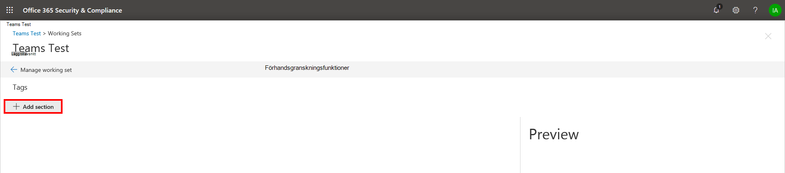
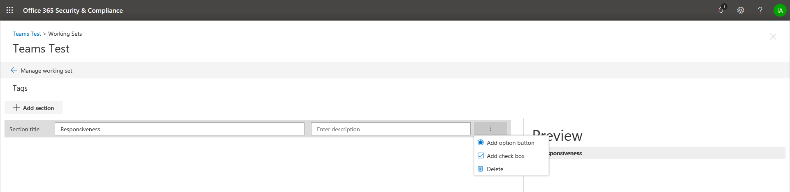
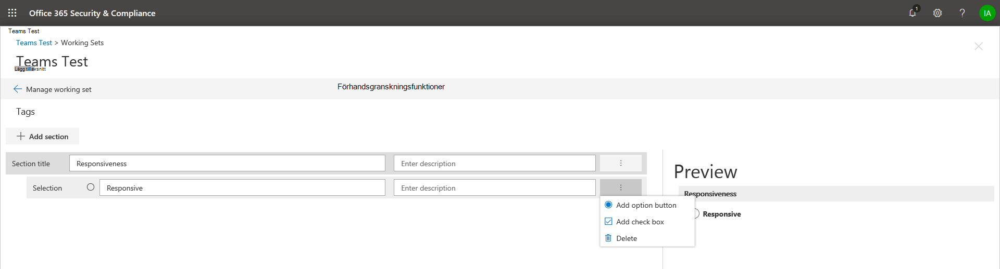

# Skapa tagggrupperCreate tag groups

Innan du eller andra kan tagga dokument i en granskningsuppsättning måste taggarna skapas.Before you or other people can tag documents in a review set, the tags must be created. Det kan du göra genom att skapa tagggrupper som innehåller underordnade taggar.You can do this by creating tag groups that contain child tags. Taggar visas i taggpanelen när du granskar dokument i en granskningsuppsättning.Tags are displayed in the tagging panel when reviewing documents in a review set.

Så här skapar du en tagggrupp:To create a tag group:

1.  Klicka på Hantera granskningsuppsättning **i en granskningsuppsättning.**In a review set, click **Manage review set**.

    

2.  Klicka på **Hantera** taggar i **panelen Taggar.**In the **Tags** tile, click **Manage tags**.

    

När taggarna väl ligger inuti tagghanteringen kan de skapas för att uppfylla kraven i ditt ärende.Once inside the tag management, tags can be created to meet the requirements of your case. Du kan börja med att skapa en tagggrupp.You can start by creating a tag group.

1.  Klicka på **Lägg till avsnitt**.Click **Add section**.

    

    Förhandsgranskningsskärmen uppdateras när du sparar så att du kan förhandsgranska taggpanelen utan att behöva stänga tagghanteringsskärmen och gå tillbaka till arbetsuppsättningen.The preview screen will update when you save so you can preview the tag panel without having to close the tag management screen and go back to the working set.

2. Ange en rubrik och en valfri beskrivning.Enter a title and optional description. 

3. Om du vill skapa en tagg i den gruppen klickar du på punkterna i den nya tagggruppen för att skapa taggar i det nya avsnittet.To create a tag within that group, click the ellipses on the new tag group to create tags in that new section.
    
    

   - **Alternativtaggar** tvingar användarna att välja en tagg från en grupp med taggar.**Option tags** will force users to select one tag from a group of tags.
   
   - **Med kryssringstaggar** kan användarna välja valfri kombination av flaggor.**Check box tags** will allow users to select any combination of tags. |

## Kapslade taggarNested tags

Om du vill kapsla taggar klickar du på punkterna bredvid en tagg och väljer sedan en ny tagg att lägga till.To nest tags, click the ellipses next to a tag and then select a new tag to add.

