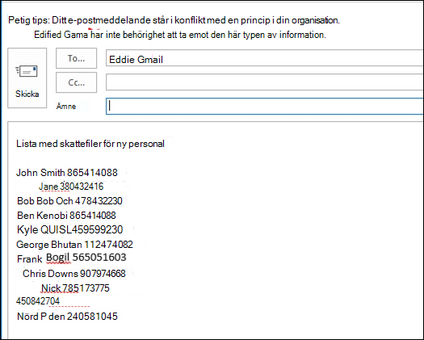

# Skapa, testa och justera en DLP-princip

Med dataförlustskydd (DLP) kan du förhindra oavsiktlig eller oavsiktlig delning av känslig information.

DLP undersöker e-postmeddelanden och filer för känslig information, t.ex. kreditkortsnummer. Med DLP kan du identifiera känslig information och vidta åtgärder som:

- Logga händelsen för granskningsändamål
- Visa en varning till slutanvändaren som skickar e-postmeddelandet eller delar filen
- Blockera aktivt e-postmeddelandet eller fildelningen från att ske

## Behörigheter

Medlemmar i efterlevnadsteamet som ska skapa DLP-principer behöver behörighet till efterlevnadscentret. Som standard har klientorganisationens administratör åtkomst för att ge efterlevnadsansvariga och andra personer åtkomst. Gör så här:
  
1. Skapa en grupp i Microsoft 365 och lägg till efterlevnadsansvariga i den.
    
2. Skapa en rollgrupp på **sidan Behörigheter** i &amp; Säkerhetsefterlevnad. 

3. När du skapar rollgruppen använder du **avsnittet Välj roller för** att lägga till följande roll i rollgruppen: **DLP-efterlevnadshantering.**
    
4. Använd avsnittet **Välj medlemmar** för att lägga till Microsoft 365 grupp som du skapade före i rollgruppen.

Använd rollen **Endast visad DLP-efterlevnadshantering** för att skapa rollgrupper med visningsbehörigheter till DLP-principer och DLP-rapporter.

Mer information finns i [Ge användarna tillgång till Office 365 kompatibilitetscenter.](../security/office-365-security/grant-access-to-the-security-and-compliance-center.md)
  
De här behörigheterna krävs för att skapa och tillämpa en DLP-princip för att inte tillämpa principer.

## Hur känslig information identifieras av DLP

DLP söker efter känslig information genom regelbunden mönstermatchning (RegEx), i kombination med andra indikatorer, till exempel hur nära vissa nyckelord matchar matchningsmönstren. Ett VISA-kreditkortsnummer har till exempel 16 siffror. Siffrorna kan dock skrivas på olika sätt, t.ex. 1111-1111-1111-1111, 1111 1111 1111 1111 eller 1111111111111111.

En 16-siffrig sträng är inte nödvändigtvis ett kreditkortsnummer, det kan vara ett biljettnummer från ett supportsystem eller ett serienummer av maskinvara. För att skilja mellan ett kreditkortsnummer och en ofarlig 16-siffrig 16-siffrig sträng utförs en beräkning (kontrollsumma) för att bekräfta att talen matchar ett känt mönster från de olika kreditkortsmärkena.

Om DLP hittar nyckelord som "VISA" eller "AMEX", datumvärden som kan vara förfallodatum för kreditkortet, använder DLP även dessa data för att avgöra om strängen är ett kreditkortsnummer eller inte.

DLP är med andra ord smart nog att identifiera skillnaden mellan dessa två textsträngar i ett e-postmeddelande:

- "Kan du beställa en ny bärbar dator till mig? Använd mitt VISA-nummer 1111-1111-1111-1111, utgång 11/22 och skicka det uppskattade leveransdatumet när du har det."
- "Min bärbara dator har serienummer 2222-2222-2222 och den köptes 2010-11-2010. Är min resevisum godkänd ännu?"

Läs [Definitioner av typen Känslig information](sensitive-information-type-entity-definitions.md) som förklarar hur varje informationstyp identifieras.

## Var du kan börja med dataförlustskydd

Om risken för dataläckor inte är helt uppenbara är det svårt att ta reda på exakt var du ska börja implementera DLP. Lyckligtvis kan DLP-principer köras i "testläge", så att du kan avgöra deras effektivitet och precision innan du aktiverar dem.

Du kan hantera DLP Exchange Online för användare via administrationscentret Exchange administration. Men du kan konfigurera DLP-principer för alla arbetsbelastningar via Säkerhets- och efterlevnadscenter &, så det är vad jag använder för demonstrationer i den här artikeln. I Säkerhets- & efterlevnadscenter hittar du DLP-principerna under Princip för **skydd mot**  >  **dataförlust.** Välj **Skapa en princip för** att starta.

Microsoft 365 finns ett antal [DLP-principmallar som du](what-the-dlp-policy-templates-include.md) kan använda för att skapa principer. Anta att du är ett australiensiskt företag. Du kan filtrera mallarna i Australien och välja Ekonomi, Hälsa och Sekretess.

För den här demonstrationen väljer jag Personlig information för Australiensiska data (PiI), som innehåller informationstyperna Australian Tax File Number (TFN) och Driver's License Number.

Ge den nya DLP-principen ett namn. Standardnamnet matchar DLP-principmallen, men du bör välja ett mer beskrivande namn eftersom flera principer kan skapas från samma mall.

Välj de platser som principen ska gälla för. DLP-principer kan Exchange Online, SharePoint Online och OneDrive för företag. Jag lämnar den här principen konfigurerad för att gälla för alla platser.

I det **Inställningar** principsteget accepterar du för tillfället bara standardinställningarna. Du kan anpassa DLP-principer, men standardinställningarna är en bra plats att börja på.

När du klickat på Nästa visas en mer principsida **Inställningar** fler anpassningsalternativ. Här kan du börja göra några justeringar för en princip som du just testar.

- Jag har inaktiverat principtips för tillfället. Det är ett rimligt steg att vidta om du bara testar saker och inte vill visa något för användarna ännu. Principtips visar varningar för användare om att de är på väg att bryta mot en DLP-princip. En användare i Outlook till exempel ser en varning om att filen som de har bifogat innehåller kreditkortsnummer och gör att deras e-post avvisas. Syftet med principtipsen är att stoppa beteendet som inte är kompatibelt innan det sker.
- Jag har också minskat antalet förekomster från 10 till 1, så att den här principen identifierar delning av australiensiska PII-data, inte bara massdelning av data.
- Jag har också lagt till en annan mottagare i e-postmeddelandet med incidentrapporten.

Slutligen har jag konfigurerat den här principen att köras i testläge först. Observera att det även finns ett alternativ här för att inaktivera principtips i testläge. Det ger dig möjlighet att få principtips aktiverade i principen men sedan bestämma dig för om du vill visa eller ignorera dem under testningen.

På den sista granskningsskärmen klickar du **på Skapa** för att slutföra principen.

## Testa en DLP-princip

Den nya DLP-principen börjar gälla inom ungefär 1 timme. Du kan vänta tills det utlöses av vanlig användaraktivitet, eller så kan du prova att utlösa det själv. Tidigare kopplade jag till [definitioner av typen Känslig information,](sensitive-information-type-entity-definitions.md)som ger dig information om hur du utlöser DLP-matchningar.

Som ett exempel identifierar DLP-principen jag skapade för den här artikeln australiensiska skattefilnummer (TFN). I dokumentationen baseras matchningen på följande kriterier.

 
Om du vill visa en TFN-identifiering på ett ganska stilrent sätt kan du i ett e-postmeddelande med orden "Skattefilnummer" och en niosiffrig sträng i närheten segla fram utan problem. Orsaken till att DLP-principen inte utlöses är att den niosiffriga strängen måste överföra kontrollsumman som anger att det är ett giltigt TFN och inte bara en ofarlig sträng med siffror.

Som jämförelse utlöser ett e-postmeddelande med orden "Skattefilnummer" och ett giltigt TFN som klarar kontrollsumman principen. För den post här har TFN jag använder tagits från en webbplats som genererar giltiga, men inte äkta, TFN. Sådana webbplatser är användbara eftersom ett av de vanligaste misstagen när du testar en DLP-princip är att falska nummer som inte är giltiga och inte klarar kontrollsumman (och därför inte utlöser principen).

E-postmeddelandet med incidentrapporten innehåller vilken typ av känslig information som upptäckts, hur många förekomster som upptäckts och konfidensnivån för identifieringen.

Om du låter DLP-principen vara i testläge och analyserar e-postmeddelanden till incidentrapporten får du en känsla för hur exakt DLP-principen är och hur effektiv den kommer att vara när den tillämpas. Utöver incidentrapporterna kan du använda [DLP-rapporterna](view-the-dlp-reports.md) för att visa en samlad vy över principmatchningar för hela klientorganisationen.

## Justera en DLP-princip

När du analyserar principträffarna kanske du vill justera hur principerna fungerar. Som ett enkelt exempel kanske du tycker att ett TFN i ett e-postmeddelande inte är ett problem (jag tror att det fortfarande är det, men vi går vidare för demonstration), men två eller flera instanser är ett problem. Flera instanser kan vara ett riskabelt scenario, till exempel att en anställd skickar e-post till en CSV-export från HR-databasen till en extern part, till exempel en extern redovisningstjänst. Definitivt något som du skulle föredra att identifiera och blockera.

I efterlevnadscentret kan du redigera en befintlig princip om du vill ändra beteendet.

 
Du kan justera platsinställningarna så att principen endast tillämpas på specifika arbetsbelastningar eller på specifika webbplatser och konton.

Du kan också justera principinställningarna och redigera reglerna efter dina behov.

När du redigerar en regel i en DLP-princip kan du ändra:

- Villkoren, inklusive typ och antal förekomster av känsliga data som utlöser regeln.
- De åtgärder som vidtas, till exempel att begränsa åtkomsten till innehållet.
- Användarmeddelanden, som är principtips som visas för användaren i deras e-postklient eller webbläsare.
- Användarens åsidosättning avgör om användarna ändå kan välja att fortsätta med e-post- eller fildelningen.
- Incidentrapporter, för att meddela administratörerna.

För den här demonstrationen har jag lagt till användarmeddelanden i principen (var försiktig med att göra det utan tillräcklig utbildning om användarmedvetenhet) och tillåtit användare att åsidosätta principen med en affärsre motivering eller genom att flagga den som en falsk positivhet. Du kan också anpassa texten för e-post- och principtips om du vill lägga till ytterligare information om organisationens principer eller be användarna att kontakta support om de har frågor.

Principen innehåller två regler för hantering av höga och låga volymer, så se till att redigera båda med de åtgärder du vill använda. Det här är en möjlighet att behandla ärenden olika beroende på deras egenskaper. Du kan till exempel tillåta åsidosättningar för låg volymöverträdelser, men inte tillåta åsidosättningar för stora volymöverträdelser.

Om du vill blockera eller begränsa åtkomsten till innehåll som bryter mot principen måste du också konfigurera en åtgärd för regeln för att göra det.

När jag har sparat principinställningarna måste jag också gå tillbaka till principens huvudinställningssida och aktivera alternativet att visa principtips för användare medan principen är i testläge. Det här är ett effektivt sätt att introducera DLP-principer för slutanvändarna och genomföra utbildning i användarna utan att riskera för många falska positiva resultat som påverkar deras produktivitet.

På serversidan (eller molnsidan om du föredrar det) kanske inte ändringen börjar gälla omedelbart på grund av olika bearbetningsintervall. Om du gör en ändring i DLP-principen som visar nya principtips för en användare kanske inte ändringarna börjar gälla omedelbart i Outlook-klienten, som söker efter principändringar en gång per dygn. Om du vill göra det snabbare för att testa kan du använda den här registerkorrigeringen för att ta bort den senaste tidsstämpeln för nedladdning från [nyckeln PolicyNudges.](https://support.microsoft.com/en-au/help/2823261/changes-to-a-data-loss-prevention-policy-don-t-take-effect-in-outlook?__hstc=18650278.46377037dc0a82baa8a30f0ef07a7b2f.1538687978676.1538693509953.1540315763430.3&__hssc=18650278.1.1540315763430&__hsfp=3446956451) Outlook laddar ned den senaste policyinformationen nästa gång du startar om den och börjar skriva ett e-postmeddelande.

Om du har aktiverat principtips börjar användaren se tipsen i Outlook och kan rapportera falska positiva resultat till dig när de inträffar.

## Undersök falska positiva resultat

DLP-principmallar är inte helt perfekta. Det är troligt att det finns falska positiva identifieringar i din miljö, och därför är det så viktigt att förenkla en DLP-distribution, ta dig tid att testa principerna på ett lämpligt sätt och finjustera principerna.

Här är ett exempel på en felaktig positiv inställning. Det här e-postmeddelandet är helt ofarligt. Användaren förser någon med sitt mobiltelefonnummer samt deras e-postsignatur.

 
Men användaren ser ett principtips med en varning om att e-postmeddelandet innehåller känslig information, särskilt ett australiensiskt körkort.

Användaren kan rapportera den felaktiga positiven och administratören kan ta en titt på varför den har inträffat. I e-postmeddelandet med incidentrapporten flaggas e-postmeddelandet som en falsk positiv inställning.

Det här fallet med körkort är ett bra exempel på hur du tar dig till den här licensen. Anledningen till att den här falska positiva typen har inträffat är att typen "Australiensisk driver's License" utlöses av en 9-siffrig sträng (även en som är en del av en 10-siffrig sträng) inom 300 tecken nära nyckelorden "Sydney nsw" (inte fallkänsligt). Det beror på telefonnumret och e-postsignaturen, bara för att användaren råkar vara i Sydney.

Ett alternativ är att ta bort den australiensiska drivrutinens licensinformationstyp från policyn. Den finns där eftersom den ingår i DLP-principmallen, men vi tvingas inte använda den. Om du bara är intresserad av skattefilnummer och inte av körkort kan du ta bort det. Du kan till exempel ta bort den från regeln om låg volym i principen, men låta den vara i högvolymregeln så att listor med licenser för flera drivrutiner fortfarande identifieras.
 
Ett annat alternativ är att öka antalet förekomster, så att en låg volym på drivrutinens licenser bara identifieras när det finns flera instanser.

Förutom att ändra antalet förekomster kan du också justera matchningsprecisionen (eller konfidensnivån). Om typen av känslig information har flera mönster kan du justera matchningsprecisionen i regeln så att regeln bara matchar vissa mönster. Om du till exempel vill minska falska positiva resultat kan du ställa in matchningsprecisionen för regeln så att den bara matchar mönstret med högst konfidensnivå. Mer information om konfidensnivåer finns i [Så här använder du konfidensnivån för att justera dina regler.](data-loss-prevention-policies.md#match-accuracy)

Om du vill ha ännu lite mer avancerat kan du anpassa alla typer av känslig information – du kan till exempel ta bort "Sydney NSW" från listan med nyckelord för Australiens drivrutinslicensnummer [,](sensitive-information-type-entity-definitions.md#australia-drivers-license-number)för att eliminera den falska positiva utlösta ovanstående. Mer information om hur du gör det med hjälp av XML och PowerShell finns i Anpassa en inbyggd typ av [känslig information.](customize-a-built-in-sensitive-information-type.md)

## Aktivera en DLP-princip

När du är nöjd med att DLP-principen identifierar typer av känslig information korrekt och att slutanvändarna är redo att hantera principerna kan du aktivera den.

 
Om du väntar på att se när principen börjar gälla kan du Anslut till Säkerhets- och efterlevnadscenter [för & PowerShell](/powershell/exchange/connect-to-scc-powershell) och köra [cmdleten Get-DlpCompliancePolicy](/powershell/module/exchange/get-dlpcompliancepolicy) för att visa Distributionsstatus.

När du har aktiveraT DLP-principen bör du köra några egna test för att kontrollera att de förväntade principåtgärderna inträffar. Om du försöker testa saker som kreditkortsdata finns det webbplatser online med information om hur du skapar exempel på kreditkort eller annan personlig information som klarar kontrollsummerna och utlöser dina principer.

Principer som tillåter att användaren åsidosätter presenterar det alternativet för användaren som en del av principtipset.

Principer som begränsar innehållet visar varningen för användaren som en del av principtipset, och hindrar dem från att skicka e-postmeddelandet.

## Sammanfattning

Principer för skydd mot dataförlust är användbara för organisationer av alla typer. Att testa vissa DLP-principer är en låg risk på grund av den kontroll du har över sådant som principtips, slutanvändarens åsidosättningar och incidentrapporter. Du kan tyst testa vissa DLP-principer för att se vilken typ av brott som redan inträffar i organisationen, och sedan skapa principer med låga falska positiva kostnader, utbilda användarna om vad som är tillåtet och inte tillåtet och sedan distribuera DLP-principerna till organisationen.