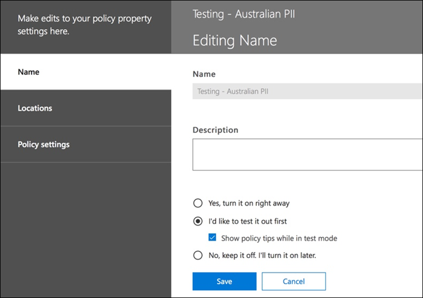

# Skapa, testa och justera en DLP-principCreate, test, and tune a DLP policy

DLP (Data Loss Prevention) hjälper dig att förhindra oavsiktlig eller oavsiktlig delning av känslig information.Data loss prevention (DLP) helps you prevent the unintentional or accidental sharing of sensitive information.

DLP undersöker e-postmeddelanden och filer efter känslig information, till exempel ett kreditkortsnummer.DLP examines email messages and files for sensitive information, like a credit card number. Med DLP kan du identifiera känslig information och vidta åtgärder som:Using DLP you can detect sensitive information, and take action such as:

- Logga händelsen för granskningsändamålLog the event for auditing purposes
- Visa en varning till slutanvändaren som skickar e-postmeddelandet eller delar filenDisplay a warning to the end user who is sending the email or sharing the file
- Blockera aktivt e-post- eller fildelningen från att äga rumActively block the email or file sharing from taking place

## BehörigheterPermissions

Medlemmar i ditt efterlevnadsteam som skapar DLP-principer behöver behörighet till Compliance Center.Members of your compliance team who will create DLP policies need permissions to the Compliance Center. Som standard har din klient administratör åtkomst kan ge efterlevnads tjänstemän och andra personer åtkomst.By default, your tenant admin will have access can give compliance officers and other people access. Gör så här:Follow these steps:
  
1. Skapa en grupp i Microsoft 365 lägga till efterlevnadsansvariga i den.Create a group in Microsoft 365 and add compliance officers to it.
    
2. Skapa en rollgrupp på sidan **Behörigheter** i Security &amp; Compliance Center.Create a role group on the **Permissions** page of the Security &amp; Compliance Center. 

3. När du skapar rollgruppen använder du avsnittet **Välj roller för** att lägga till följande roll i rollgruppen: **DLP Compliance Management**.While creating the role group, use the **Choose Roles** section to add the following role to the role group: **DLP Compliance Management**.
    
4. Använd avsnittet **Välj medlemmar om** du vill lägga Microsoft 365 den grupp som du har skapat tidigare i rollgruppen.Use the **Choose Members** section to add the Microsoft 365 group you created before to the role group.

Använd rollen **Endast visa DLP-efterlevnad för** att skapa rollgrupp med skrivbehörighet till DLP-principerna och DLP-rapporterna.Use the **View-Only DLP Compliance Management** role to create role group with view-only privileges to the DLP policies and DLP reports.

Mer information finns i [Ge användarna åtkomst till Office 365 Compliance Center](../security/office-365-security/grant-access-to-the-security-and-compliance-center.md).For more information, see [Give users access to the Office 365 Compliance Center](../security/office-365-security/grant-access-to-the-security-and-compliance-center.md).
  
Dessa behörigheter krävs för att skapa och tillämpa en DLP-princip för att inte genomdriva principer.These permissions are required to create and apply a DLP policy not to enforce policies.

## Hur känslig information identifieras av DLPHow sensitive information is detected by DLP

DLP hittar känslig information efter regex-mönstermatchning (Regular Expression), i kombination med andra indikatorer, till exempel närheten till vissa nyckelord till matchningsmönstren.DLP finds sensitive information by regular expression (RegEx) pattern matching, in combination with other indicators such as the proximity of certain keywords to the matching patterns. Ett VISA-kreditkortsnummer har till exempel 16 siffror.For example, a VISA credit card number has 16 digits. Men dessa siffror kan skrivas på olika sätt, till exempel 1111-1111-1111-1111, 1111 1111 1111 1111, eller 11111111111111111111.But, those digits can be written in different ways, such as 1111-1111-1111-1111, 1111 1111 1111 1111, or 1111111111111111.

Alla 16-siffriga strängar är inte nödvändigtvis ett kreditkortsnummer, det kan vara ett biljettnummer från ett helpdesksystem eller ett serienummer för en hårdvara.Any 16-digit string is not necessarily a credit card number, it could be a ticket number from a help desk system, or a serial number of a piece of hardware. För att se skillnaden mellan ett kreditkortsnummer och en ofarlig 16-siffrig sträng utförs en beräkning (kontrollsumma) för att bekräfta att siffrorna matchar ett känt mönster från de olika kreditkortsmärkena.To tell the difference between a credit card number and a harmless 16-digit string, a calculation is performed (checksum) to confirm that the numbers match a known pattern from the various credit card brands.

Om DLP hittar nyckelord som "VISA" eller "AMEX", nära datumvärden som kan vara kreditkortens utgångsdatum, använder DLP också dessa data för att avgöra om strängen är ett kreditkortsnummer eller inte.If DLP finds keywords such as "VISA" or "AMEX", near date values that might be the credit card expiry date, DLP also uses that data to help it decide whether the string is a credit card number or not.

Med andra ord är DLP smart nog att känna igen skillnaden mellan dessa två textsträngar i ett e-postmeddelande:In other words, DLP is smart enough to recognize the difference between these two strings of text in an email:

- "Kan du beställa mig en ny bärbar dator."Can you order me a new laptop. Använd mitt VISA-nummer 1111-1111-1111-1111, utgång 11/22, och skicka mig det beräknade leveransdatumet när du har det."Use my VISA number 1111-1111-1111-1111, expiry 11/22, and send me the estimated delivery date when you have it."
- "Mitt serienummer för bärbara datorer är 2222-2222-2222-2222 och det köptes den 11/2010."My laptop serial number is 2222-2222-2222-2222 and it was purchased on 11/2010. Förresten, är mitt resevisum godkänt ännu?"By the way, is my travel visa approved yet?"

Se [Definitioner av känslig informationstyp som](sensitive-information-type-entity-definitions.md) förklarar hur varje informationstyp identifieras.See [Sensitive information type entity definitions](sensitive-information-type-entity-definitions.md) that explains how each information type is detected.

## Var ska man börja med förebyggande av dataförlustWhere to start with data loss prevention

När riskerna för dataläckage inte är helt uppenbara är det svårt att räkna ut exakt var du ska börja med att implementera DLP.When the risks of data leakage aren't entirely obvious, it's difficult to work out where exactly you should start with implementing DLP. Lyckligtvis kan DLP-principer köras i "testläge", så att du kan mäta deras effektivitet och noggrannhet innan du slår på dem.Fortunately, DLP policies can be run in "test mode", allowing you to gauge their effectiveness and accuracy before you turn them on.

DLP-principer Exchange Online kan hanteras via Exchange administrationscenter.DLP policies for Exchange Online can be managed through the Exchange admin center. Men du kan konfigurera DLP-principer för alla arbets belastningar via Security & Compliance Center, så det är vad jag kommer att använda för demonstrationer i den här artikeln.But you can configure DLP policies for all workloads through the Security & Compliance Center, so that's what I'll use for demonstrations in this article. I Security & Compliance Center hittar du DLP-principerna under Policy **för förebyggande av**  >  **dataförlust**.In the Security & Compliance Center, you'll find the DLP policies under **Data loss prevention** > **Policy**. Välj **Skapa en princip som** ska startas.Choose **Create a policy** to start.

Microsoft 365 tillhandahåller en rad [DLP-principmallar som du](what-the-dlp-policy-templates-include.md) kan använda för att skapa principer.Microsoft 365 provides a range of [DLP policy templates](what-the-dlp-policy-templates-include.md) you can use to create policies. Låt oss säga att du är ett australiskt företag.Let's say that you're an Australian business. Du kan filtrera mallarna i Australien och välja Ekonomi, Medicin och Hälsa och Sekretess.You can filter the templates on Australia, and choose Financial, Medical and Health, and Privacy.

För den här demonstrationen väljer jag australiensiska personligt identifierbara informationsdata (PII), som innehåller informationstyperna för australiensiskt skattefilnummer (TFN) och körkortsnummer.For this demonstration I'll choose Australian Personally Identifiable Information (PII) Data, which includes the information types of Australian Tax File Number (TFN) and Driver's License Number.

Ge din nya DLP-policy ett namn.Give your new DLP policy a name. Standardnamnet matchar DLP-principmallen, men du bör välja ett eget beskrivande namn eftersom flera principer kan skapas från samma mall.The default name will match the DLP policy template, but you should choose a more descriptive name of your own, because multiple policies can be created from the same template.

Välj de platser som principen ska gälla för.Choose the locations that the policy will apply to. DLP-principer kan gälla för Exchange Online, SharePoint Online och OneDrive för företag.DLP policies can apply to Exchange Online, SharePoint Online, and OneDrive for Business. Jag kommer att lämna den här principen konfigurerad för att gälla för alla platser.I am going to leave this policy configured to apply to all locations.

Vid det första **Inställningar** steget, acceptera bara standardvärdena för tillfället.At the first **Policy Settings** step, just accept the defaults for now. Du kan anpassa DLP-principer, men standardvärdena är en bra plats att börja på.You can customize DLP policies, but the defaults are a fine place to start.

När du har klickat på Nästa får du en mer **princip Inställningar** sida med fler anpassningsalternativ.After clicking Next,\*\* you'll be presented with an more **Policy Settings** page with more customization options. För en princip som du bara testar, här kan du börja göra några justeringar.For a policy that you are just testing, here's where you can start to make some adjustments.

- Jag har stängt av principtips för tillfället, vilket är ett rimligt steg att ta om du bara testar saker och inte vill visa något för användarna ännu.I've turned off policy tips for now, which is a reasonable step to take if you're just testing things out and don't want to display anything to users yet. Principtips visar varningar till användare om att de är på väg att bryta mot en DLP-policy.Policy tips display warnings to users that they're about to violate a DLP policy. En användare som Outlook en varning om att filen de har bifogat innehåller kreditkortsnummer och gör att deras e-post avvisas.For example, an Outlook user will see a warning that the file they've attached contains credit card numbers and will cause their email to be rejected. Målet med principtips är att stoppa det beteende som inte uppfyller kraven innan det inträffar.The goal of policy tips is to stop the non-compliant behavior before it happens.
- Jag har också minskat antalet instanser från 10 till 1, så att den här policyn kommer att upptäcka all delning av australiska PII-data, inte bara massdelning av data.I've also decreased the number of instances from 10 to 1, so that this policy will detect any sharing of Australian PII data, not just bulk sharing of the data.
- Jag har också lagt till en annan mottagare i incidentrapportens e-post.I've also added another recipient to the incident report email.

Slutligen har jag konfigurerat den här principen så att den körs i testläge från början.Finally, I've configured this policy to run in test mode initially. Observera att det också finns ett alternativ här för att inaktivera principtips när du är i testläge.Notice there's also an option here to disable policy tips while in test mode. Detta ger dig flexibiliteten att ha princip tips aktiverade i principen, men sedan bestämma om du vill visa eller undertrycka dem under testningen.This gives you the flexibility to have policy tips enabled in the policy, but then decide whether to show or suppress them during your testing.

Klicka på Skapa för att slutföra **skapandet av** principen på den slutliga granskningsskärmen.On the final review screen, click **Create** to finish creating the policy.

## Testa en DLP-principTest a DLP policy

Din nya DLP-policy börjar gälla inom cirka 1 timme.Your new DLP policy will begin to take effect within about 1 hour. Du kan sitta och vänta på att den utlöses av normal användaraktivitet, eller så kan du försöka utlösa den själv.You can sit and wait for it to be triggered by normal user activity, or you can try to trigger it yourself. Tidigare länkade jag till [känsliga entitetsdefinitioner av informationstyp](sensitive-information-type-entity-definitions.md), som ger dig information om hur du utlöser DLP-matchningar.Earlier I linked to [Sensitive information type entity definitions](sensitive-information-type-entity-definitions.md), which provides you with information about how to trigger DLP matches.

Som ett exempel kommer DLP-principen som jag skapade för den här artikeln att identifiera australiska skattefilnummer (TFN).As an example, the DLP policy I created for this article will detect Australian tax file numbers (TFN). Enligt dokumentationen baseras matchen på följande kriterier.According to the documentation, the match is based on the following criteria.

 
För att demonstrera TFN-identifiering på ett ganska trubbigt sätt kommer ett e-postmeddelande med orden "Skattefilnummer" och en niosiffrig sträng i närheten att segla igenom utan problem.To demonstrate TFN detection in a rather blunt manner, an email with the words "Tax file number" and a nine digit string in close proximity will sail through without any issues. Anledningen till att DLP-principen inte utlöses är att den niosiffriga strängen måste skicka kontrollsumman som anger att den är ett giltigt TFN och inte bara en ofarlig sträng med tal.The reason it does not trigger the DLP policy is that the nine digit string must pass the checksum that indicates it is a valid TFN and not just a harmless string of numbers.

I jämförelse utlöser ett e-postmeddelande med orden "Momsfilnummer" och ett giltigt TFN som passerar kontrollsumman principen.In comparison, an email with the words "Tax file number" and a valid TFN that passes the checksum will trigger the policy. För posten här togs TFN jag använder från en webbplats som genererar giltiga, men inte äkta, TFNs.For the record here, the TFN I'm using was taken from a website that generates valid, but not genuine, TFNs. Sådana webbplatser är användbara eftersom ett av de vanligaste misstagen när du testar en DLP-princip är att använda ett falskt nummer som inte är giltigt och inte kommer att klara kontrollsumman (och därför inte utlöser principen).Such sites are useful because one of the most common mistakes when testing a DLP policy is using a fake number that's not valid and won't pass the checksum (and therefore won't trigger the policy).

E-postmeddelandet med incidentrapporten innehåller den typ av känslig information som upptäcktes, hur många instanser som identifierades och identifieringens konfidensnivå.The incident report email includes the type of sensitive information that was detected, how many instances were detected, and the confidence level of the detection.

Om du lämnar din DLP-policy i testläge och analyserar e-postmeddelandena i incidentrapporten kan du börja få en känsla för DLP-principens noggrannhet och hur effektiv den kommer att vara när den tillämpas.If you leave your DLP policy in test mode and analyze the incident report emails, you can start to get a feel for the accuracy of the DLP policy and how effective it will be when it is enforced. Förutom incident rapporterna kan du använda [DLP-rapporterna för att se](view-the-dlp-reports.md) en aggregerad vy över princip matchningar över din klient organisation.In addition to the incident reports, you can [use the DLP reports](view-the-dlp-reports.md) to see an aggregated view of policy matches across your tenant.

## Justera en DLP-policyTune a DLP policy

När du analyserar dina principträffar kanske du vill göra några justeringar av hur principerna beter sig.As you analyze your policy hits, you might want to make some adjustments to how the policies behave. Som ett enkelt exempel kan du bestämma att en TFN i ett e-postmeddelande inte är ett problem (jag tror att det fortfarande är det, men låt oss gå med det för demonstrationens skull), men två eller flera instanser är ett problem.As a simple example, you might determine that one TFN in an email is not a problem (I think it still is, but let's go with it for the sake of demonstration), but two or more instances are a problem. Flera instanser kan vara ett riskabelt scenario, till exempel en anställd som skickar en CSV-export från HR-databasen till en extern part, till exempel en extern redovisningstjänst.Multiple instances could be a risky scenario such as an employee emailing a CSV export from the HR database to an external party, for example an external accounting service. Definitivt något du föredrar att upptäcka och blockera.Definitely something you would prefer to detect and block.

I Compliance Center kan du redigera en befintlig princip för att justera beteendet.In the Compliance Center you can edit an existing policy to adjust the behavior.

 
Du kan justera platsinställningarna så att principen endast tillämpas på specifika arbets belastningar eller på specifika webbplatser och konton.You can adjust the location settings so that the policy is applied only to specific workloads, or to specific sites and accounts.

Du kan också justera principinställningarna och redigera reglerna så att de bättre passar dina behov.You can also adjust the policy settings and edit the rules to better suit your needs.

När du redigerar en regel inom en DLP-princip kan du ändra:When editing a rule within a DLP policy, you can change:

- Villkoren, inklusive typen och antalet instanser av känsliga data som utlöser regeln.The conditions, including the type and number of instances of sensitive data that will trigger the rule.
- De åtgärder som vidtas, till exempel att begränsa åtkomsten till innehållet.The actions that are taken, such as restricting access to the content.
- Användaraviseringar, som är principtips som visas för användaren i deras e-postklient eller webbläsare.User notifications, which are policy tips that are displayed to the user in their email client or web browser.
- Användaren åsidosätter avgör om användare kan välja att fortsätta med sin e-post eller fildelning ändå.User overrides determines whether users can choose to proceed with their email or file sharing anyway.
- Incidentrapporter, för att meddela administratörer.Incident reports, to notify administrators.

För den här demonstrationen har jag lagt till användar aviseringar i principen (var försiktig med att göra detta utan adekvat utbildning om användar medvetenhet) och tillät användare att åsidosätta principen med en affärs motivering eller genom att flagga den som en falsk positiv.For this demonstration I've added user notifications to the policy (be careful of doing this without adequate user awareness training), and allowed users to override the policy with a business justification or by flagging it as a false positive. Du kan också anpassa e-post- och principtipstexten om du vill inkludera ytterligare information om organisationens principer eller uppmana användare att kontakta supporten om de har frågor.You can also customize the email and policy tip text if you want to include any additional information about your organization's policies, or prompt users to contact support if they have questions.

Principen innehåller två regler för hantering av hög volym och låg volym, så se till att redigera båda med de åtgärder du vill ha.The policy contains two rules for handling of high volume and low volume, so be sure to edit both with the actions that you want. Detta är en möjlighet att behandla fall olika beroende på deras egenskaper.This is an opportunity to treat cases differently depending on their characteristics. Du kan till exempel tillåta åsidosättningar för överträdelser med låg volym, men inte tillåta åsidosättningar för överträdelser med hög volym.For example, you might allow overrides for low volume violations, but not allow overrides for high volume violations.

Om du faktiskt vill blockera eller begränsa åtkomsten till innehåll som strider mot principen måste du konfigurera en åtgärd på regeln för att göra det.Also, if you want to actually block or restrict access to content that is in violation of policy, you need to configure an action on the rule to do so.

När jag har sparat ändringarna i principinställningarna måste jag också gå tillbaka till huvudinrättningssidan för principen och göra det möjligt för alternativet att visa principtips för användare medan principen är i testläge.After saving those changes to the policy settings, I also need to return to the main settings page for the policy and enable the option to show policy tips to users while the policy is in test mode. Detta är ett effektivt sätt att introducera DLP-principer för dina slutanvändare och göra utbildning i användarmedvetenhet, utan att riskera för många falska positiva effekter som påverkar deras produktivitet.This is an effective way to introduce DLP policies to your end users, and do user awareness training, without risking too many false positives that impact their productivity.

På serversidan (eller molnsidan om du föredrar) kanske ändringen inte träder i kraft omedelbart på grund av olika bearbetningsintervall.On the server side (or cloud side if you prefer), the change may not take effect immediately, due to various processing intervals. Om du gör en DLP-principändring som visar nya principtips för en användare kanske användaren inte ser att ändringarna träder i kraft omedelbart i Outlook-klienten, som söker efter principändringar var 24:e timme.If you're making a DLP policy change that will display new policy tips to a user, the user may not see the changes take effect immediately in their Outlook client, which checks for policy changes every 24 hours. Om du vill påskynda testningen kan du använda den här registerkorrigeringen för att [rensa den senaste hämtningstidsstämpeln från nyckeln PolicyNudges](https://support.microsoft.com/en-au/help/2823261/changes-to-a-data-loss-prevention-policy-don-t-take-effect-in-outlook?__hstc=18650278.46377037dc0a82baa8a30f0ef07a7b2f.1538687978676.1538693509953.1540315763430.3&__hssc=18650278.1.1540315763430&__hsfp=3446956451).If you want to speed things up for testing, you can use this registry fix to [clear the last download time stamp from the PolicyNudges key](https://support.microsoft.com/en-au/help/2823261/changes-to-a-data-loss-prevention-policy-don-t-take-effect-in-outlook?__hstc=18650278.46377037dc0a82baa8a30f0ef07a7b2f.1538687978676.1538693509953.1540315763430.3&__hssc=18650278.1.1540315763430&__hsfp=3446956451). Outlook hämtar den senaste principinformationen nästa gång du startar om den och börjar skriva ett e-postmeddelande.Outlook will download the latest policy information the next time you restart it and begin composing an email message.

Om du har aktiverat principtips börjar användaren se tipsen i Outlook och kan rapportera falska positiva identifieringar till dig när de inträffar.If you have policy tips enabled, the user will begin to see the tips in Outlook, and can report false positives to you when they occur.

## Undersök falska positiva identifieringarInvestigate false positives

DLP-policymallar är inte perfekta direkt ur lådan.DLP policy templates are not perfect straight out of the box. Det är troligt att du hittar några falska positiva identifieringar som uppstår i din miljö, varför det är så viktigt att underlätta din väg in i en DLP-distribution, vilket tar dig tid att testa och finjustera dina principer på ett adekvat sätt.It's likely that you'll find some false positives occurring in your environment, which is why it's so important to ease your way into a DLP deployment, taking the time to adequately test and tune your policies.

Här är ett exempel på ett falskt positivt.Here's an example of a false positive. Det här e-postmeddelandet är ganska ofarligt.This email is quite harmless. Användaren tillhandahåller sitt mobiltelefonnummer till någon och inkluderar sin e-postsignatur.The user is providing their mobile phone number to someone, and including their email signature.

 
Men användaren ser ett policytips som varnar dem om att e-postmeddelandet innehåller känslig information, specifikt ett australiskt körkortsnummer.But the user sees a policy tip warning them that the email contains sensitive information, specifically, an Australian driver's license number.

Användaren kan rapportera det falska positiva och administratören kan undersöka varför det har inträffat.The user can report the false positive, and the administrator can look into why it has occurred. I e-postmeddelandet med incidentrapporten flaggas e-postmeddelandet som falskt positivt.In the incident report email, the email is flagged as a false positive.

Detta körkortsärende är ett bra exempel att gräva i.This driver's license case is a good example to dig into. Anledningen till att detta falska positiva har inträffat är att typen "Australian Driver's License" kommer att utlösas av alla 9-siffriga strängar (även en som ingår i en 10-siffrig sträng), inom 300 tecken närhet till nyckelorden "Sydney nsw" (inte fallkänslig).The reason this false positive has occurred is that the "Australian Driver's License" type will be triggered by any 9-digit string (even one that is part of a 10-digit string), within 300 characters proximity to the keywords "Sydney nsw" (not case sensitive). Så det utlöses av telefonnumret och e-postsignaturen, bara för att användaren råkar vara i Sydney.So it's triggered by the phone number and email signature, only because the user happens to be in Sydney.

Ett alternativ är att ta bort den australiska körkortsinformationstypen från policyn.One option is to remove the Australian driver's license information type from the policy. Den finns där eftersom den är en del av DLP-policymallen, men vi är inte tvungna att använda den.It's in there because it's part of the DLP policy template, but we're not forced to use it. Om du bara är intresserad av skattefilnummer och inte körkort kan du bara ta bort det.If you're only interested in Tax File Numbers and not driver's licenses, you can just remove it. Du kan till exempel ta bort den från lågvolymregeln i principen, men lämna den i högvolymsregeln så att listor med flera körkort fortfarande identifieras.For example, you can remove it from the low volume rule in the policy, but leave it in the high volume rule so that lists of multiple drivers licenses are still detected.
 
Ett annat alternativ är att öka antalet instanser, så att en låg volym körkort bara identifieras när det finns flera instanser.Another option is to increase the instance count, so that a low volume of driver's licenses is only detected when there are multiple instances.

Förutom att ändra antalet förekomster kan du också justera matchningsnoggrannheten (eller konfidensnivån).In addition to changing the instance count, you can also adjust the match accuracy (or confidence level). Om din känsliga informationstyp har flera mönster kan du justera matchningsnoggrannheten i regeln så att regeln bara matchar specifika mönster.If your sensitive information type has multiple patterns, you can adjust the match accuracy in your rule, so that your rule matches only specific patterns. Om du till exempel vill minska falska positiva identifieringar kan du ställa in matchningsnoggrannheten för regeln så att den bara matchar mönstret med den högsta konfidensnivån.For example, to help reduce false positives, you can set the match accuracy of your rule so that it matches only the pattern with the highest confidence level. Mer information om förtroendenivåer finns i Så [här använder du konfidensnivå för att justera dina regler](data-loss-prevention-policies.md#match-accuracy).For more information on confidence levels, see [How to use confidence level to tune your rules](data-loss-prevention-policies.md#match-accuracy).

Slutligen, om du vill bli ännu mer avancerad, kan du anpassa alla känsliga informationstyper - till exempel kan du ta bort "Sydney NSW" från listan över nyckelord för [Australiens körkortsnummer](sensitive-information-type-entity-definitions.md#australia-drivers-license-number), för att eliminera det falska positiva som utlöses ovan.Finally, if you want to get even a bit more advanced, you can customize any sensitive information type -- for example, you can remove "Sydney NSW" from the list of keywords for [Australia driver's license number](sensitive-information-type-entity-definitions.md#australia-drivers-license-number), to eliminate the false positive triggered above. Mer information om hur du gör detta med hjälp av XML och PowerShell finns [i anpassa en inbyggd känslig informationstyp](customize-a-built-in-sensitive-information-type.md).To learn how to do this by using XML and PowerShell, see [customizing a built-in sensitive information type](customize-a-built-in-sensitive-information-type.md).

## Aktivera en DLP-principTurn on a DLP policy

När du är glad över att din DLP-princip korrekt och effektivt identifierar känsliga informationstyper och att dina slutanvändare är redo att hantera de principer som finns på plats kan du aktivera principen.When you're happy that your DLP policy is accurately and effectively detecting sensitive information types, and that your end users are ready to deal with the policies being in place, then you can enable the policy.

 
Om du väntar på att se när principen träder i kraft [Anslut till Security & Compliance Center PowerShell](/powershell/exchange/connect-to-scc-powershell) och kör [cmdleten Get-DlpCompliancePolicy för](/powershell/module/exchange/get-dlpcompliancepolicy) att se DistributionStatus.If you're waiting to see when the policy will take effect, [Connect to Security & Compliance Center PowerShell](/powershell/exchange/connect-to-scc-powershell) and run the [Get-DlpCompliancePolicy cmdlet](/powershell/module/exchange/get-dlpcompliancepolicy) to see the DistributionStatus.

När du har aktiverat DLP-principen bör du köra några egna slutliga tester för att se till att de förväntade principåtgärderna inträffar.After turning on the DLP policy, you should run some final tests of your own to make sure that the expected policy actions are occurring. Om du försöker testa saker som kreditkortsdata finns det webbplatser online med information om hur du genererar exempelkreditkort eller annan personlig information som skickar checkums och utlöser dina policyer.If you're trying to test things like credit card data, there are websites online with information on how to generate sample credit card or other personal information that will pass checksums and trigger your policies.

Principer som tillåter användar åsidosättningar presenterar det alternativet för användaren som en del av princip tipset.Policies that allow user overrides will present that option to the user as part of the policy tip.

Principer som begränsar innehållet kommer att presentera varningen för användaren som en del av principtipset och förhindra att de skickar e-postmeddelandet.Policies that restrict content will present the warning to the user as part of the policy tip, and prevent them from sending the email.

## SammanfattningSummary

Principer för förebyggande av dataförlust är användbara för organisationer av alla slag.Data loss prevention policies are useful for organizations of all types. Att testa vissa DLP-principer är en lågriskövning på grund av den kontroll du har över saker som principtips, åsidosättningar av slutanvändare och incidentrapporter.Testing some DLP policies is a low risk exercise due to the control you have over things like policy tips, end-user overrides, and incident reports. Du kan tyst testa vissa DLP-principer för att se vilken typ av överträdelser som redan förekommer i din organisation och sedan skapa principer med låga falska positiva priser, utbilda dina användare om vad som är tillåtet och inte tillåtet och sedan distribuera dina DLP-principer till organisationen.You can quietly test some DLP policies to see what type of violations are already occurring in your organization, and then craft policies with low false positive rates, educate your users on what is allowed and not allowed, and then roll out your DLP policies to the organization.