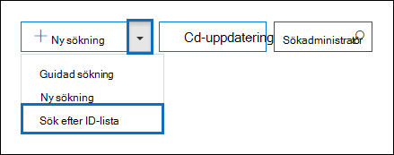
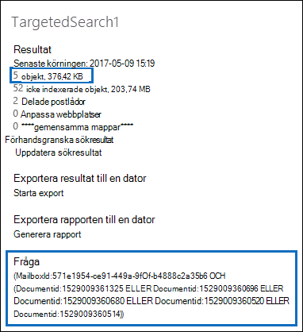

# Förbereda en CSV-fil för en ID-lista InnehållssökningPrepare a CSV file for an ID list Content Search

Du kan söka efter specifika e-postmeddelanden och andra postlådeobjekt med hjälp av en lista Exchange-ID.You can search for specific mailbox email messages and other mailbox items using a list of Exchange IDs. Om du vill skapa en sökning med ID-listor (som kallas för riktad sökning) skickar du en CSV-fil (kommaavgränsade värden) som identifierar de specifika postlådeobjekten att söka efter.To create an ID list search (formally called a targeted search), you submit a comma separated value (CSV) file that identifies the specific mailbox items to search for. För den här CSV-filen använder du **Results.csv-filen** eller **Oindexerade Items.csv-filen** som tas med när du exporterar sökresultatet eller exporterar en innehållsökningsrapport från och befintlig innehållssökning.For this CSV file you use the **Results.csv** file or the **Unindexed Items.csv** file that are included when you export the Content Search results or export a Content Search report from and existing Content Search. Sedan redigerar du en av dessa filer för att ange de specifika objekten som ska sökas efter, och skapar sedan en ny sökning i ID-listan och skickar CSV-filen.Then you edit one of these files to indicate the specific items to search for, and then create a new ID list search and submit the CSV file.

Här är en snabb överblick över processen för att skapa en sökning i en ID-lista.Here's a quick overview of the process for creating an ID list search.

1. Skapa och kör en ny eller guidad innehållssökning i Säkerhets- & efterlevnadscenter.Create and run a new or guided Content Search in the Security & Compliance Center.

2. Exportera innehållssökningsresultaten eller exportera rapporten för innehållssökning.Export the content search results or export the content search report. Mer information finns i:For more information, see:

    - [Exportera resultat för innehållssökningExport Content Search results](export-search-results.md)

    - [Exportera en rapport för innehållssökningExport a Content Search report](export-a-content-search-report.md)

3. Redigera **Results.csv** eller Icke indexerade objekt **Items.csv** och identifiera de specifika postlådeobjekt som du vill ska ingå i sökningen i ID-listan.Edit the **Results.csv** file or the **Unindexed Items.csv** and identify the specific mailbox items that you want to include in the ID list search. Läs [anvisningarna för](#prepare-the-csv-file-for-an-id-list-search) att förbereda en CSV-fil för sökning i EN ID-lista.See the [instructions](#prepare-the-csv-file-for-an-id-list-search) for preparing a CSV file for an ID list search.

4. Skapa en ny sökning i ID-listan (se [instruktionerna](#create-an-id-list-search)) och skicka CSV-filen som du förberett.Create a new ID list search (see the [instructions](#create-an-id-list-search)) and submit the CSV file that you prepared. Sökningen som skapas söker bara efter de objekt som har markerats i CSV-filen.The search query that's created will only search for the items selected in the CSV file.

> [!NOTE]
> Sökningar i ID-listor stöds endast för postlådeobjekt.ID list searches are only supported for mailbox items. Det går inte att söka efter SharePoint och OneDrive dokument i en sökning i en ID-lista.You can't search for SharePoint and OneDrive documents in an ID list search.

 **Varför skapa en sökning i en ID-lista?****Why create an ID list search?** Om du inte kan avgöra om ett objekt svarar på en eDiscovery-begäran baserat på metadata i **Results.csv-** eller **Oindexerade Items.csv-filer** kan du använda en ID-lista för att söka efter, förhandsgranska och exportera objektet för att avgöra om det svarar på det ärende som du undersöker.If you're unable to determine if an item is responsive to an eDiscovery request based on the metadata in the **Results.csv** or **Unindexed Items.csv** files, you can use an ID list search to find, preview, and then export that item to determine if it's responsive to the case you're investigating. Sökningar i ID-listor används oftast för att söka efter och returnera en viss uppsättning icke indexerade objekt.ID list searches are typically used to search for and return a specific set of unindexed items.

## Förbereda CSV-filen för sökning i ID-listaPrepare the CSV file for an ID list search

När du exporterat sökresultatet eller rapporten för en innehållssökning kan du utföra följande steg för att förbereda CSV-filen för sökning i en ID-lista.After you export the search results or report for a content search, you can perform the following steps to prepare the CSV file for an ID list search. Den här CSV-filen identifierar alla objekt i sökningen i ID-listan.This CSV file will identify every item in the ID list search.

Observera att du kan använda en CSV-fil från en sökning som inkluderade SharePoint webbplatser  och OneDrive-konton, men du kan bara välja postlådeobjekt för sökning med en ID-lista.Note that you can use a CSV file from a search that included SharePoint sites and OneDrive accounts, but you can select  *only*  mailbox items for an ID list search. Om du väljer ett dokument i SharePoint eller OneDrive misslyckas CSV-filen när du skapar en sökning i ID-listan.If you select a document in SharePoint or OneDrive, the CSV file will fail validation when you create an ID list search.

1. Öppna **Results.csv** eller **icke indexerade Items.csv** i Excel.Open the **Results.csv** or **Unindexed Items.csv** file in Excel.

2. I kolumnen **Markerad** skriver du **Ja** i cellen som motsvarar objektet du vill söka efter.In the **Selected** column, type **Yes** in the cell that corresponds to the item that you want to search for. Upprepa det här steget för alla objekt som du vill söka efter.Repeat this step for every item that you want to search for.

    > [!IMPORTANT]
    > När du öppnar CSV-filen i Excel ändras dataformatet för kolumnen **Dokument-ID** till **Allmänt.**When you open the CSV file in Excel, the data format for the **Document ID** column is changed to **General**. Det leder till att dokument-ID:t för ett objekt visas i vetenskaplig notation.This results in displaying the document ID for an item in scientific notation. Exempel: Dokument-ID för "481037338205" visas som "4,81037E+11" Du måste utföra nästa steg för att  ändra dataformatet i kolumnen **Dokument-ID** till Tal för att återställa rätt format för dokument-ID.For example, the document ID of "481037338205" is displayed as "4.81037E+11" You have to perform the next steps to change the data format of the **Document ID** column to **Number** to restore the correct format for the document ID. Om du inte gör det kommer sökningen i ID-listan som använder CSV-filen att misslyckas.If you don't do this, the ID list search that uses the CSV file will fail.

3. Högerklicka på hela kolumnen **Dokument-ID** och välj **Formatera celler.**Right-click the entire **Document ID** column and select **Format Cells**.

4. Klicka på **Tal** i rutan **Kategori.**In the **Category** box, click **Number**.

5. Ändra antalet decimaler till **0** och klicka sedan på **OK för** att spara ändringarna.Change the number of decimal places to **0**, and then click **OK** to save your changes. Observera att värdena i kolumnen Dokument-ID ändras till tal.Notice that the values in the Document ID column are changed to numbers.

    Här är ett exempel på en CSV-fil som kan skickas för innehållssökning i ID-listan.Here's an example of the a CSV file that's ready to be submitted for a ID list content search.

    

6. Spara CSV-filen eller **använd Spara som** för att spara filen med ett annat filnamn.Save the CSV file or use **Save As** to the save the file with different file name. Se till att spara filen i CSV-format i båda fallen.In both cases, be sure to save the file with the CSV format.

## Skapa en sökning i en ID-listaCreate an ID list search

Nästa steg är att skapa en ny ID-lista Innehållssökning och skicka CSV-filen som du förberett i föregående steg.The next step is to create a new ID list Content Search and submit the CSV file that you prepared in the previous step.

> [!IMPORTANT]
> Du bör skapa en sökning i ID-listan högst 2 dagar efter att du exporterat resultatet eller rapporten från en innehållssökning.You should create an ID list search no more than 2 days after exporting the results or report from a Content Search. Om sökresultatet eller rapporten som exporterades för mer än två dagar sedan bör du exportera om sökresultatet eller rapporten för att generera uppdaterade CSV-filer.If the search results or report where exported more than 2 days ago, you should re-export the search results or report to generate updated CSV files. Sedan kan du förbereda en av de uppdaterade CSV-filerna och använda den för att skapa en sökning i ID-listan.Then you can prepare one of the updated CSV files and use it to create an ID list search.

1. Gå till Sök & i **Säkerhets- och** \> **efterlevnadscenter.**In the Security & Compliance Center, go to **Search** \> **Content search**.

2. På sidan **Sök** klickar du på pilen bredvid Lägg  **Ny sökning** och klickar sedan på Sök efter **ID-lista**.On the **Search** page, click the arrow next to  **New search**, and then click **Search by ID List**.

    

3. På den **utfällbara** menyn Sök efter ID ger du sökningen  ett namn (och beskriver den om det). Klicka sedan på Bläddra och välj CSV-filen som du förberedde i föregående steg.On the **Search by ID List** flyout, name the search (and optionally describe it) and then click **Browse** and select the CSV file that you prepared in the previous step.

    Microsoft 365 försöker verifiera CSV-filen.Microsoft 365 attempts to validate the CSV file. Om verifieringen inte lyckas visas ett felmeddelande som kan hjälpa dig att felsöka verifieringsfelen.If the validation is unsuccessful, an error message is displayed that might help you troubleshoot the validation errors. CSV-filen måste valideras för att du ska kunna skapa en sökning i ID-listan.The CSV file has to be successfully validated to create an ID list search.

4. När CSV-filen har verifierats klickar du på **Sök för** att skapa sökningen i ID-listan.After the CSV file is successfully validated, click **Search** to create the ID list search.

    Här är ett exempel på det uppskattade sökresultatet och frågan som genereras för sökning med ID-listor.Here's an example of the estimated search results and the query that's generated for an ID list search.

    

    Observera att det uppskattade antalet objekt som visas i statistik för ID-sökningen ska matcha antalet objekt som du valde i CSV-filen.Note that the number of estimated items displayed in statistics for the ID search should match the number of items that you selected in the CSV file.

5. Förhandsgranska eller exportera de objekt som returneras av sökningen i ID-listan.Preview or export the items returned by the ID list search.

> [!NOTE]
> Om du flyttar en postlåda efter att ha skapat en sökning i ID-listan returnerar frågan för sökningen inte de angivna objekten.If you move a mailbox after creating an ID list search, the query for the search won't return the specified items. Det beror på att egenskapen **DocumentId** för postlådeobjekt ändras när en postlåda flyttas.That's because the **DocumentId** property for mailbox items are changed when a mailbox is moved. I den sällsynta instansen när en postlåda flyttas när du har skapat en sökning i en ID-lista ska du skapa en ny innehållssökning (eller uppdatera sökresultaten för den befintliga innehållssökningen) och sedan exportera sökresultatet eller rapporten för att generera uppdaterade CSV-filer som kan användas för att skapa en ny ID-lista.In the rare instance when a mailbox is moved after you create an ID list search, you should create a new content search (or update the search results for the existing content search) and then export the search results or report to generate updated CSV files that can be used to create a new ID list search.
