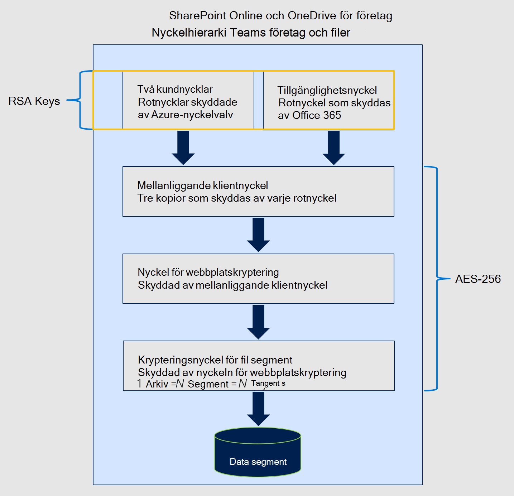

# Lär dig mer om tillgänglighetsnyckeln för Customer Key

Tillgänglighetsnyckeln är en rotnyckel som genereras automatiskt och etableras när du skapar en datakrypteringsprincip. Microsoft 365 lagrar och skyddar tillgänglighetsnyckeln. Tillgänglighetsnyckeln fungerar som de två rotnycklar som du tillhandahåller för tjänstkryptering med kundnyckeln. Tillgänglighetsnyckeln radbryter tangenterna en nivå längre ned i nyckelhierarkin. Till skillnad från de nycklar som du tillhandahåller och hanterar i Azure Key Vault kan du inte direkt komma åt tillgänglighetsnyckeln. Microsoft 365 automatiska tjänster hanterar tillgänglighetsnyckeln programmässigt. De här tjänsterna initierar automatiserade åtgärder som aldrig innebär direkt åtkomst till tillgänglighetsnyckeln.

Det primära syftet med tillgänglighetsnyckeln är att tillhandahålla återställningsfunktioner från den oväntade förlust av rotnycklar som du hanterar. Förlust kan vara ett resultat av mismanagement eller skadlig åtgärd. Om du förlorar kontrollen över rotnycklarna kontaktar du Microsoft Support så hjälper Microsoft dig genom processen med återställning med hjälp av tillgänglighetsnyckeln. Du använder tillgänglighetsnyckeln för att migrera till en ny datakrypteringsprincip med nya rotnycklar som du etablerar.

Storage och kontroll av tillgänglighetsnyckeln skiljer sig avsiktligt från Azure Key Vault-nycklar av tre anledningar:

- Tillgänglighetsnyckeln ger en återställningsfunktion, "break-glass", om kontrollen över både Azure Key Vault-nycklar går förlorad.
- Avgränsningen av logiska kontroller och säkra lagringsplatser är ett skydd på djupet och skyddar mot förlust av alla nycklar och dina data, från en enda attack eller felpunkt.
- Tillgänglighetsnyckeln ger en funktion med hög tillgänglighet om Microsoft 365 inte kan nå nycklar som finns i Azure Key Vault på grund av tillfälliga fel. Den här regeln gäller endast Exchange Online och Skype för företag kryptering av tjänsten. SharePoint Online-, OneDrive för företag och Teams använder aldrig tillgänglighetsnyckeln om du inte uttryckligen instruerar Microsoft att starta återställningsprocessen.

Genom att dela ansvaret för att skydda dina data, med hjälp av en mängd olika skydd och processer för nyckelhantering, minskar du slutligen risken att alla nycklar (och därmed dina data) försvinner permanent eller raderas. Microsoft ger dig enbart behörighet över inaktiveringen eller tillgänglighetsnyckeln när du lämnar tjänsten. Som design har ingen på Microsoft tillgång till tillgänglighetsnyckeln: den kan bara nås Microsoft 365 tjänstkod.

Mer information [om hur vi](https://www.microsoft.com/trustcenter/Privacy/govt-requests-for-data) skyddar nycklar finns i Microsoft Säkerhetscenter.
  
## Tillgänglighetsnyckelanvändning

Tillgänglighetsnyckeln ger återställningsfunktioner för scenarier där en extern manfaktor eller illvillig insider stjäl kontroll över ditt nyckelvalv, eller när oavsiktlig mismanagement resulterar i förlust av rotnycklar. Den här återställningsfunktionerna gäller för Microsoft 365 tjänster som är kompatibla med kundnyckeln. Enskilda tjänster använder tillgänglighetsnyckeln på ett annat sätt. Microsoft 365 använder bara tillgänglighetsnyckeln på de sätt som beskrivs nedan.

### Exchange Online och Skype för företag användning

Utöver återställningsfunktionerna kan du Exchange Online och Skype för företag använda tillgänglighetsnyckeln för att säkerställa datatillgänglighet under tillfälliga eller tillfälliga driftsproblem, som är relaterade till tjänstens åtkomst av rotnycklar. När tjänsten inte kan nå någon av dina kundnycklar i Azure-nyckelvalv på grund av tillfälliga fel använder tjänsten automatiskt tillgänglighetsnyckeln. Tjänsten GÅR ALDRIG direkt till tillgänglighetsnyckeln.

Automatiserade system i Exchange Online och Skype för företag kan använda tillgänglighetsnyckeln under tillfälliga fel för att stödja automatiserade backend-tjänster som antivirus, e-discovery, skydd mot dataförlust, postlådeflyttningar och dataindexering.

### SharePoint Filer som OneDrive för företag online, i Teams och i

För SharePoint Online-, OneDrive för företag- och Teams-filer används tillgänglighetsnyckeln ALDRIG utanför återställningsfunktionerna och kunderna måste uttryckligen instruera Microsoft att börja använda tillgänglighetsnyckeln under ett återställningsscenario. Automatiserade tjänståtgärder är endast beroende av kundnycklar i Azure-nyckelvalvet. Mer information om hur nyckelhierarkin fungerar för de här tjänsterna finns i Hur SharePoint [Online-, OneDrive för företag- och Teams-filer använder tillgänglighetsnyckeln](#how-sharepoint-online-onedrive-for-business-and-teams-files-use-the-availability-key).

## Säkerhet för tillgänglighetsnyckel

Microsoft delar ansvaret för dataskydd med dig genom att instansiera tillgänglighetsnyckeln och vidta omfattande åtgärder för att skydda den. Microsoft visar inte direkt kontroll över tillgänglighetsnyckeln för kunder. Du kan till exempel bara rulla (rotera) de nycklar som du äger i Azure Key Vault. Mer information finns i Återställa [eller rotera en kundnyckel eller en tillgänglighetsnyckel](customer-key-availability-key-roll.md).

### Hemliga lager med tillgänglighetstangenter

Microsoft skyddar tillgänglighetsnycklar i åtkomstkontrollerade interna hemliga butiker som Azure-nyckelvalvet mot kunder. Vi implementerar åtkomstkontroller för att hindra Microsoft-administratörer från att få direkt åtkomst till de hemligheter som finns i dem. Hemliga lagringsåtgärder, inklusive nyckelrotation och borttagning, utförs genom automatiska kommandon som aldrig innebär direkt åtkomst till tillgänglighetsnyckeln. Hemliga hanteringsåtgärder i butik är begränsade till specifika tekniker och kräver eskalering av behörigheter via ett internt verktyg Lockbox. Eskalering av behörigheter kräver godkännande och motiveringar från chefen innan eskalering beviljas. Lockbox säkerställer att åtkomsttiden är bunden till automatisk återkallelse av åtkomst vid utgångsdatum eller att tekniker loggar ut.

**Exchange Online och Skype för företag** lagras i en hemlig Active Directory-Exchange Online lagras. Tillgänglighetsnycklar lagras på ett säkert sätt i klientspecifika behållare i Active Directory-domänkontrollanten. Den här säkra lagringsplatsen är separat och isolerad från den hemliga SharePoint online, OneDrive för företag och Teams av filer.

**SharePoint online, OneDrive för företag och Teams** lagras i en intern hemlig butik som hanteras av tjänstteamet. Den här skyddade lagringstjänsten har klientservrar med programslutpunkter och en SQL Database som serverslut. Tillgänglighetsnycklar lagras i SQL Database och radbrutsas (krypteras) av hemliga krypteringsnycklar som använder en kombination av AES-256 och HMAC för att kryptera tillgänglighetsnyckeln i vila. Krypteringsnycklarna för hemlig lagring lagras i en logiskt isolerad komponent i samma SQL Database och krypteras ytterligare med RSA-2048-nycklar som finns i certifikat som hanteras av Microsofts certifikatutfärdare (CA). De här certifikaten lagras i den hemliga lagrings frontend-servrarna som utför åtgärder mot databasen.

### Försvar på djupet

Microsoft använder en djupgående strategi för att förhindra att skadliga aktör påverkar konfidentialitet, integritet eller tillgänglighet för kunddata som lagras i Microsoft Cloud. Specifika förebyggande och förebyggande kontroller implementeras för att skydda den hemliga lagringen och tillgänglighetsnyckeln som en del av den övergripande säkerhetsstrategin.

Microsoft 365 är byggt för att förhindra felaktig användning av tillgänglighetsnyckeln. Programlagret är den enda metod som används för att kryptera och dekryptera data med nycklar, inklusive tillgänglighetsnyckeln. Det Microsoft 365 att tjänstekoden kan tolka och passera genom nyckelhierarkin för krypterings- och dekrypteringsaktiviteter. Logisk avgränsning finns mellan lagringsplatserna för kundnycklar, tillgänglighetsnycklar, andra hierarkiska nycklar och kunddata. Den här avgränsningen minimerar risken för exponering av data i händelse av att en eller flera platser har komprometterats. Varje lager i hierarkin har inbyggda funktioner för intrångsidentifiering dygnet runt för att skydda data och hemligheter som lagras.

Access-kontroller implementeras för att förhindra obehörig åtkomst till interna system, inklusive hemliga lager med tillgänglighetsnyckel. Microsoft-tekniker har inte direkt åtkomst till viktiga, hemliga butiker som är tillgängliga. Mer information om åtkomstkontroller finns i [Administrativa åtkomstkontroller i Microsoft 365](/Office365/securitycompliance/office-365-administrative-access-controls-overview).

Tekniska kontroller hindrar Microsoft-personalen från att logga in på tjänstkonton med hög privilegierad kompetens, som annars skulle kunna användas av attackerare för att utge sig för att Microsoft-tjänster. De här kontrollerna förhindrar till exempel interaktiv inloggning.

Säkerhetsloggnings- och övervakningskontrollerna är ett annat skydd av djupskydd som implementeras för att minimera risker för Microsoft-tjänster och dina data. Microsoft-tjänstteam har distribuerat lösningar för aktiv övervakning som genererar varningar och granskningsloggar. Alla tjänstteam laddar upp sina loggar till en central lagringsplats där loggarna aggregeras och bearbetas. Interna verktyg undersöker automatiskt poster för att bekräfta att tjänsterna fungerar i en optimal, flexibel och säker status. Ovanlig aktivitet flaggas för ytterligare granskning.

En logghändelse som anger ett potentiellt brott mot Microsoft-säkerhetsprincipen uppmärksammas omedelbart av Microsofts säkerhetsteam. Microsoft 365 säkerheten har konfigurerat aviseringar för att identifiera försöka komma åt hemliga lager med tillgänglighetstangenter. Aviseringar skapas också om Microsoft-personal försöker logga in interaktivt på tjänstkonton som är förbjudna och skyddade av åtkomstkontroller. Microsoft 365 säkerhet kan också upptäcka och varningar på avvikelser från Microsoft 365 baslinjeåtgärder. Mansfaktorer som försöker Microsoft 365 felaktigt använda tjänsterna utlöser aviseringar som resulterar i att microsofts molnmiljö tar bort eventuella varningar.

## Återställa nyckeln efter nyckelförlust med hjälp av tillgänglighetsnyckeln

Om du förlorar kontrollen över dina kundnycklar kan du återställa och kryptera dina data med tillgänglighetsnyckeln.

### Återställningsprocedur för Exchange Online och Skype för företag

Om du förlorar kontrollen över dina kundnycklar ger tillgänglighetsnyckeln dig möjlighet att återställa dina data och ta de påverkade resurserna Microsoft 365 online. Tillgänglighetsnyckeln fortsätter att skydda dina data medan du återskapar. Om du vill återställa helt och hållet efter nyckelförlust måste du skapa en ny deP och flytta påverkade resurser till den nya principen.

Om du vill kryptera dina data med nya kundnycklar skapar du nya nycklar i Azure-nyckelvalv, skapar en ny DEP med de nya kundnycklarna och tilldelar sedan den nya dataleverantören till de postlådor som för närvarande krypteras med den tidigare deP som nycklarna har tappats bort eller komprometterats för.

Den här omkrypteringsprocessen kan ta upp till 72 timmar. Det här är standardvaraktigheten när du ändrar en deP.
  
### Återställningsprocedur för SharePoint Online, OneDrive för företag och Teams filer

För SharePoint online-, OneDrive för företag- Teams-filer används tillgänglighetsnyckeln ALDRIG utanför återställningsfunktionerna. Du måste uttryckligen instruera Microsoft att börja använda tillgänglighetsnyckeln under ett återställningsscenario. Kontakta Microsoft för att aktivera tillgänglighetsnyckeln för att starta återställningsprocessen. När den har aktiverats används tillgänglighetsnyckeln automatiskt för att dekryptera dina data, så att du kan kryptera data med en nyskapad deP som är kopplad till nya kundnycklar.  

Den här åtgärden motsvarar antalet webbplatser i organisationen. När du ringer Microsoft för att använda tillgänglighetsnyckeln ska du vara helt online inom ungefär fyra timmar.

## Hur Exchange Online och Skype för företag använder tillgänglighetsnyckeln

När du skapar en DEP med Microsoft 365 en principnyckel för datakryptering (DEP) som är kopplad till den datakrypteringsnyckeln. Tjänsten krypterar DEP-nyckeln tre gånger: en gång med var och en av kundnycklarna och en gång med tillgänglighetsnyckeln. Endast krypterade versioner av DEP-nyckeln lagras och en DEP-nyckel kan bara dekrypteras med kundnycklarna eller tillgänglighetsnyckeln. DEP-nyckeln används sedan för att kryptera postlådenycklar, som krypterar enskilda postlådor.
  
Microsoft 365 den här processen för att dekryptera och tillhandahålla data när kunder använder tjänsten:
  
1. Dekryptera DEP-nyckeln med kundnyckeln.

2. Använd den dekrypterade DEP-nyckeln för att dekryptera en postlådenyckel.

3. Använd den dekrypterade postlådans nyckel för att dekryptera själva postlådan, så att du får åtkomst till data i postlådan.

## Hur SharePoint online-, OneDrive för företag- Teams-filer använder tillgänglighetsnyckeln

Arkitekturen SharePoint online OneDrive för företag implementering av kundnyckel och tillgänglighet skiljer sig från Exchange Online och Skype för företag.
  
När en organisation går över till kund hanterade nycklar Microsoft 365 en organisationsspecifik mellanliggande nyckel (TIK). Microsoft 365 krypterar TIK två gånger, en gång med var och en av kundnycklarna, och lagrar de två krypterade versionerna av TIK. Endast krypterade versioner av TIK lagras och ett TIK kan endast dekrypteras med kundnycklar. TIK används sedan för att kryptera webbplatsnycklar, som sedan används för att kryptera blob-nycklar (kallas även fildelningsnycklar). Beroende på filstorlek kan tjänsten dela upp en fil i flera fildelar var och en med en unik nyckel. Själva blobbar (fillager) krypteras med blob-nycklar och lagras i Microsoft Azure Blob-lagringstjänsten.
  
Microsoft 365 följer den här processen för att dekryptera och tillhandahålla kundfiler när kunder använder tjänsten:

1. Dekryptera TIK med hjälp av kundnyckeln.

2. Använd det dekrypterade TIK-tangenten för att dekryptera en webbplatsnyckel.

3. Använd den dekrypterade webbplatsnyckeln för att dekryptera en blob-nyckel.

4. Använd den dekrypterade blob-tangenten för att dekryptera blob-tangenten.

Microsoft 365 dekrypterar ett TIK genom att utfärda två dekrypteringsförfrågningar till Azure-tangentvalvet med en liten förskjutning. När den första frågan slutförs blir resultatet inställt och den andra begäran avbryts.
  
Om du förlorar åtkomsten till dina kundnycklar krypterar Microsoft 365 också TIK med en tillgänglighetsnyckel och lagrar detta tillsammans med de TIKs som krypteras med varje kundnyckel. TIK som krypteras med tillgänglighetsnyckeln används endast när kunden ringer Microsoft för att lista återställningssökvägen när de har förlorat åtkomsten till sina nycklar, skadligt eller av misstag.
  
Av tillgänglighets- och skalor kan dekrypterade TIKs cachelagras i ett tidsbegränsat minne. Två timmar innan en TIK-cache upphör att gälla försöker Microsoft 365 dekryptera varje TIK. Dekryptera TIKs utökar livslängden för cachen. Om TIK-dekryptering misslyckas under en betydande tid genereras en Microsoft 365 som meddelar teknik innan cachen går ut. Det är bara om kunden ringer Microsoft som Microsoft 365 initierar återställningsåtgärden, vilket innebär att TIK dekrypteras med den tillgänglighetsnyckel som lagras i Microsofts hemliga butik och klientorganisationen lagras på nytt med hjälp av det dekrypterade TIK och en ny uppsättning azure-nyckelvalvsnycklar som tillhandahålls av kunder.
  
I dagsläget ingår Kundnyckel i krypterings- och dekrypteringskedjan i SharePoint Online-fildata som lagras i Azure Blob Store, men inte SharePoint Online-listobjekt eller metadata som lagras i SQL Database. Microsoft 365 använder inte tillgänglighetsnyckeln för andra filer i Exchange Online, Skype för företag, SharePoint Online, OneDrive för företag eller Teams än det som beskrivs ovan och som initieras av kunder. Human åtkomst till kunddata skyddas av Customer Lockbox.

## Utlösare för tillgänglighetsnyckel

Microsoft 365 utlöser bara tillgänglighetsnyckeln under vissa omständigheter. Omständigheterna är olika beroende på tjänst.

### Utlösare för Exchange Online och Skype för företag
  
1. Microsoft 365 läser deP som postlådan har tilldelats till för att fastställa platsen för de två kundnycklarna i Azure-nyckelvalvet.

2. Microsoft 365 slumpmässigt en av de två kundnycklarna från DEP och skickar en förfrågan till Azure-nyckelvalvet om att ta bort DEP-nyckeln med hjälp av kundnyckeln.

3. Om begäran att ta bort DEP-nyckeln med hjälp av kundnyckeln misslyckas skickar Microsoft 365 en andra förfrågan till Azure-nyckelvalv, den här gången en uppmaning om att använda den alternativa (andra) kundnyckeln.

4. Om den andra begäran om att ta bort ENP-tangenten med hjälp av kundnyckeln misslyckas Microsoft 365 undersöker resultatet av båda förfrågningarna.

    - Om granskningarna anser att förfrågningarna misslyckades returnerar ett systemfel:

       - Microsoft 365 utlöser tillgänglighetsnyckeln för att dekryptera DEP-tangenten.

       - Microsoft 365 sedan dekryptera postlådenyckeln och slutföra användarbegäran med DEP-tangenten. 

       - I det här fallet kan inte Azure-tangentvalvet svara eller inte kan nås på grund av ett tillfälligt FEL.

    - Om en undersökning anser att begärandena misslyckades returnerar DU ÅTKOMST NEKAD:

       - Det innebär att avsiktlig, oavsiktlig eller skadlig åtgärd har vidtas för att återge kundnycklarna otillgängliga (till exempel under datarensningsprocessen som en del av att lämna tjänsten).

       - I det här fallet används tillgänglighetsnyckeln endast för systemåtgärder och inte för användaråtgärder, användarens begäran misslyckas och användaren får ett felmeddelande.

>[!IMPORTANT]
>Microsoft 365-tjänstkod har alltid en giltig inloggningstoken som skäl över kunddata för att tillhandahålla värdebaserade molntjänster. Tills tillgänglighetsnyckeln har tagits bort kan den därför användas som reserv för åtgärder initierade av, eller interna till, Exchange Online och Skype för företag till exempel skapa sökindex eller flytta postlådor. Det här gäller både tillfälliga FEL och ÅTKOMST NEKADE förfrågningar till Azure Key Vault.

### Utlösare för SharePoint Online, OneDrive för företag och Teams filer

För SharePoint Online-, OneDrive för företag- och Teams-filer används tillgänglighetsnyckeln ALDRIG utanför återställningsfunktionerna och kunderna måste uttryckligen instruera Microsoft att börja använda tillgänglighetsnyckeln under ett återställningsscenario.

## Granskningsloggar och tillgänglighetsnyckel

Automatiserade system i Microsoft 365 bearbeta alla data allt eftersom de flödar genom systemet för att tillhandahålla molntjänster, till exempel antivirus, e-discovery, skydd mot dataförlust och dataindexering. Microsoft 365 genererar inte kund synliga loggar för den här aktiviteten. Dessutom kommer Microsofts personal inte åt dina data som en del av de här normala systemåtgärderna.

### Exchange Online och Skype för företag loggning av tillgänglighetsnyckel

När Exchange Online och Skype för företag åtkomst till tillgänglighetsnyckeln för att tillhandahålla tjänst publicerar Microsoft 365 kund synliga loggar som är tillgängliga från Säkerhets- och efterlevnadscenter. En granskningsloggpost för tillgänglighetsnyckelåtgärden genereras varje gång tjänsten använder tillgänglighetsnyckeln. En ny posttyp som kallas "Kryptering av customer key service" med aktivitetstyp "Reserv till tillgänglighetsnyckel" gör att administratörer kan filtrera resultat för enhetlig granskningslogg för att visa tillgänglighetsnyckelposter. 

Loggposter innehåller attribut som datum, tid, aktivitet, organisations-ID och policy-ID för datakryptering. Posten är tillgänglig som en del av Enhetliga granskningsloggar och kan nås från fliken granskningsloggsökning & säkerhets- och efterlevnadscenter.

Exchange Online och Skype för företag av viktiga poster för tillgänglighet använder det  vanliga Office 365-schema för hanteringsaktivitet med tillagda anpassade parametrar: princip-ID, omfattningsnyckelversions-ID och begär id.

### SharePoint Loggning av OneDrive för företag, online Teams för filtillgänglighet

Loggning av tillgänglighetsnyckel är inte tillgänglig ännu för dessa tjänster. För SharePoint online-, OneDrive för företag- och Teams-filer aktiveras tillgänglighetsnyckeln endast av Microsoft, när du uppmanas att göra det, i återställningssyfte. Därför vet du redan alla händelser där tillgänglighetsnyckeln används för dessa tjänster.

## Tillgänglighetsnyckel i kundnyckelhierarkin
  
Microsoft 365 använder tillgänglighetsnyckeln för att radbryt nivån av nycklar längre ned i nyckelhierarkin som upprättats för tjänstkryptering för kundtjänst. Olika nyckelhierarkier finns mellan tjänsterna. Nyckelalgoritmer skiljer sig också mellan tillgänglighetsnycklar och andra nycklar i hierarkin för varje tillämplig tjänst. Följande är de algoritmer som används av de olika tjänsterna i tillgänglighetsnyckeln:

- I Exchange Online och Skype för företag använder du AES-256.

- I SharePoint Online, OneDrive för företag och Teams använder tillgänglighetsnycklarna för filer RSA-2048.

### Krypteringschiffrar som används för att kryptera nycklar Exchange Online och Skype för företag

### Krypteringschiffrar som används för att kryptera nycklar SharePoint online och OneDrive för företag

## Relaterade artiklar

- [Tjänst kryptering med kundnyckel](customer-key-overview.md)

- [Konfigurera kundnyckel](customer-key-set-up.md)

- [Hantera kundnyckel](customer-key-manage.md)

- [Rulla eller rotera Customer Key eller en tillgänglighetsnyckel](customer-key-availability-key-roll.md)