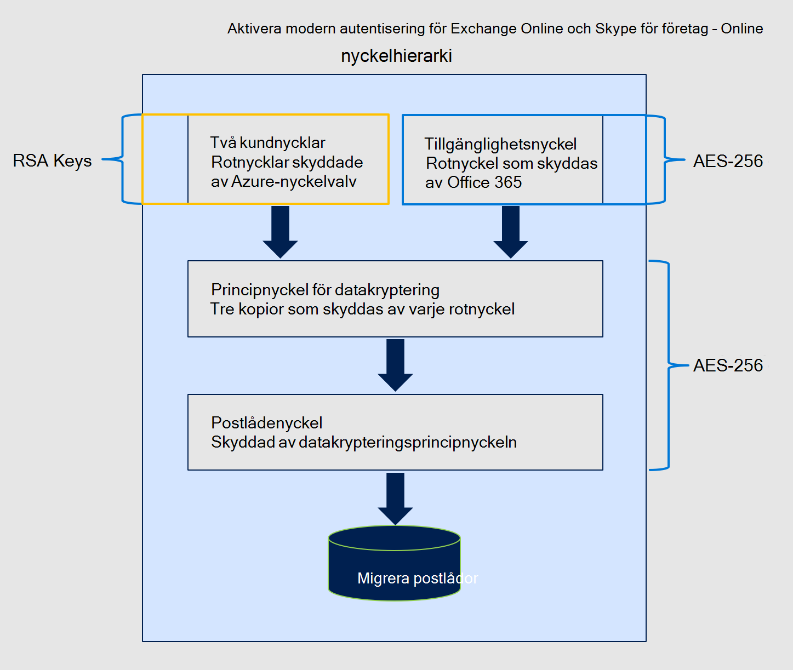
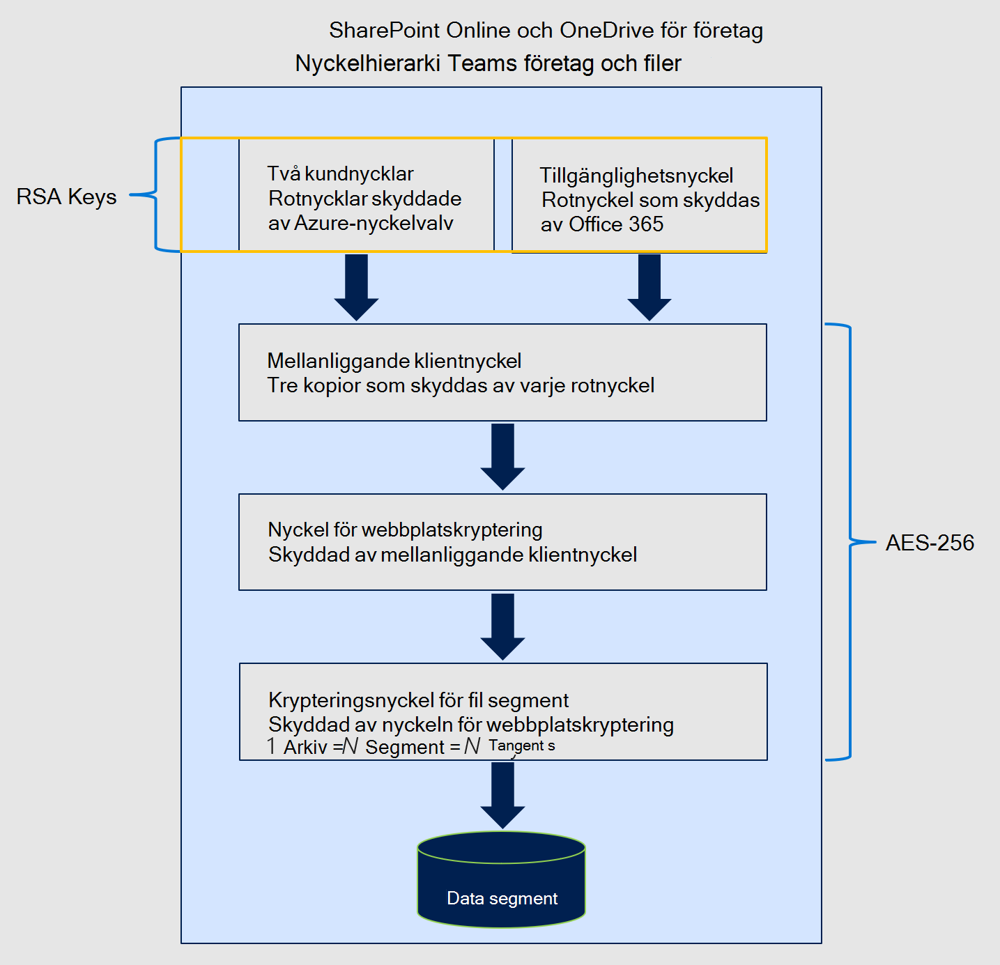

# Krypteringstjänst med kundnyckel

Microsoft 365 grundläggande, volymnivåkryptering aktiverad via BitLocker och DKM (Distributed Key Manager). Microsoft 365 erbjuder ett extra krypteringslager för innehållet. Det här innehållet omfattar data Exchange Online, Skype för företag, SharePoint Online, OneDrive för företag och Microsoft Teams.

## Så här fungerar tjänstekryptering, BitLocker och kundnyckel tillsammans

Dina data krypteras alltid vilan i Microsoft 365 med BitLocker och DKM. Mer information finns i Hur [du Exchange Online dina e-posthemligheter.](exchange-online-secures-email-secrets.md) Kundnyckel ger extra skydd mot visning av data av obehöriga system eller personal, och kompletterar BitLocker diskkryptering i Microsofts datacenter. Tjänstekryptering är inte avsedd att hindra Microsoft-personalen från att komma åt dina data. Kundnyckeln hjälper dig i stället att uppfylla regel- och efterlevnadsskyldigheter för rotnycklar. Du godkänner uttryckligen Microsoft 365-tjänster att använda dina krypteringsnycklar för att tillhandahålla ytterligare molntjänster, till exempel eDiscovery, skadlig programvara, skydd mot skräppost, sökindexering och så vidare.

Kundnyckel bygger på tjänstkryptering och låter dig tillhandahålla och kontrollera krypteringsnycklar. Microsoft 365 sedan dessa nycklar för att kryptera data vilan enligt beskrivningen i [villkor för onlinetjänster (OST).](https://www.microsoft.com/licensing/product-licensing/products.aspx) Kundnyckeln hjälper dig att uppfylla efterlevnadsskyldigheter eftersom du kontrollerar krypteringsnycklarna som Microsoft 365 använder för att kryptera och dekryptera data.
  
Kundnyckel förbättrar organisationens förmåga att uppfylla kraven på efterlevnad som anger viktiga arrangemang med molntjänstleverantören. Med kundnyckeln tillhandahåller och kontrollerar du rotkrypteringsnycklarna för Microsoft 365 data i vila på programnivå. Därför kan du ta kontroll över organisationens nycklar.

## Kundnyckel med hybriddistributioner

Kundnyckel krypterar bara data i vila i molnet. Kundnyckeln fungerar inte för att skydda dina lokala postlådor och filer. Du kan kryptera lokala data med en annan metod, till exempel genom att BitLocker.

## Om principer för datakryptering

En datakrypteringsprincip (DEP) definierar krypteringshierarkin. Hierarkin används av tjänsten för att kryptera data med hjälp av de nycklar du hanterar och den tillgänglighetsnyckel som skyddas av Microsoft. Du skapar DEP:er med PowerShell-cmdlets och tilldelar sedan de här DEP:erna för att kryptera programdata. Det finns tre typer av DEP:er som stöds av Microsoft 365 Kundnyckel, varje principtyp använder olika cmdlets och tillhandahåller täckning för olika typer av data. De de du kan definiera omfattar:

**DEP för Microsoft 365 arbetsbelastningar** De här deP:erna krypterar data över flera M365-arbetsbelastningar för alla användare inom klientorganisationen. Dessa arbetsbelastningar omfattar:

- Teams dina chattmeddelanden (1:1-chattar, gruppchattar, möteschattar och kanalkonversationer)
- Teams mediemeddelanden (bilder, kodstycken, videomeddelanden, ljudmeddelanden, wiki-bilder)
- Teams samtals- och mötesinspelningar som lagras Teams lagringsutrymme
- Teams chattaviseringar
- Teams förslag på chattar av Cortana
- Teams statusmeddelanden
- Information om användare och Exchange Online
- Exchange Online-postlådor som inte redan krypteras av postlådekoderna
- Exakt MIP-data (EDM) – (scheman för datafiler, regelpaket och salter som används för att hashtagga känsliga data).
  För exakt datamatchning med MIP och Microsoft Teams krypteras nya data från och med den tidpunkt då du tilldelar klientorganisationen data med flera arbetsbelastningar. I Exchange Online krypterar Kundnyckel alla befintliga och nya data.

De data med flera arbetsbelastningar krypterar inte följande typer av data. I stället Microsoft 365 andra typer av kryptering för att skydda dessa data.

- SharePoint och OneDrive för företag data.
- Microsoft Teams filer och vissa Teams samtals- och mötesinspelningar som sparats i OneDrive för företag och SharePoint Online krypteras med SharePoint Online dep.
- Andra Microsoft 365 arbetsbelastningar, till exempel Yammer och Planner, som för närvarande inte stöds av Kundnyckel.
- Teams Livehändelser och fråge&A i livehändelser. Det Teams scenariot är det enda scenariot som inte krypteras av kundnyckel med hjälp av deP för flera arbetsbelastningar.

Du kan skapa flera DEP-adresser per klientorganisation men bara tilldela en DEP i taget. När du tilldelar DEP påbörjas krypteringen automatiskt men tar lite tid att slutföra beroende på storleken på klientorganisationen.

**DEPs för Exchange Online postlådor** E-post-DEP ger mer exakt kontroll över enskilda postlådor Exchange Online. Använd postlåde-DEP för att kryptera data som lagras i EXO-postlådor av olika typer, till exempel UserMailbox, MailUser, Group, PublicFolder och Shared mailboxes. Du kan ha upp till 50 aktiva dep:er per klientorganisation och tilldela de här dep:erna till enskilda postlådor. Du kan tilldela en dep till flera postlådor.

Som standard krypteras dina postlådor med microsoft-hanterade nycklar. När du tilldelar en kundnyckel DEP till en postlåda:

- Om postlådan är krypterad med en deP för flera arbetsbelastningar, skriver tjänsten om postlådan med den nya postlådans datakod så länge en användare eller ett system har åtkomst till postlådedata.

- Om postlådan redan är krypterad med Microsoft-hanterade nycklar kommer tjänsten att omkoda postlådan med den nya postlådans datakod så länge en användare eller ett system har åtkomst till postlådedata.

- Om postlådan ännu inte krypteras med standardkryptering markerar tjänsten postlådan för en flytt. Krypteringen sker när flyttningen är klar. Postlådeflyttningar styrs av prioriteringar som ställts in för alla Microsoft 365. Mer information finns i [Flyttningsförfrågningar i Microsoft 365 tjänst](/exchange/mailbox-migration/office-365-migration-best-practices#move-requests-in-the-office-365-service). Om postlådorna inte är krypterade inom den angivna tiden kontaktar du Microsoft.

Senare kan du antingen uppdatera DEP eller tilldela en annan DEP till postlådan enligt beskrivningen i Hantera [kundnyckel för Office 365.](customer-key-manage.md) Varje postlåda måste ha lämpliga licenser för att tilldelas en DEP. Mer information om licensiering finns i [Innan du konfigurerar kundnyckel.](customer-key-set-up.md#before-you-set-up-customer-key)

DEP:er kan tilldelas till en delad postlåda, en gemensam mapppostlåda Microsoft 365 en grupppostlåda för klientorganisationen som uppfyller licensieringskravet för användarnas postlådor. Du behöver inga separata licenser för icke-användarspecifika postlådor för att tilldela Customer Key DEP.

Du kan begära att Microsoft rensar specifika DEP:er för kundnyckel dep:er som du tilldelar till enskilda postlådor när du lämnar tjänsten. Mer information om datarensningsprocessen och återkallelse av nycklar finns i Återkalla dina nycklar och starta [en datarensningssökväg.](customer-key-manage.md#revoke-your-keys-and-start-the-data-purge-path-process)

När du återkallar åtkomsten till dina nycklar när du lämnar tjänsten tas tillgänglighetsnyckeln bort, vilket leder till att dina data tas bort av kryptografik. Cryptographic deletion mitigates the risk of data remanence, which is important for meeting both security and compliance obligations.

**DEP för SharePoint Online och OneDrive för företag** Den här dataleverantören används för att kryptera innehåll som lagrats i SPO och OneDrive för företag, inklusive Microsoft Teams filer som lagrats i SPO. Om du använder multi-geofunktionen kan du skapa en DEP per geo för organisationen. Om du inte använder multi-geofunktionen kan du bara skapa en DEP per klientorganisation. Mer information finns i [Konfigurera kundnyckel.](customer-key-set-up.md)

### Krypteringschiffrer som används av kundnyckeln

Kundnyckel använder olika krypterings-chiffer för att kryptera nycklar, som visas på följande bilder.

Den nyckelhierarki som används för dep:ar som krypterar data för Microsoft 365 arbetsbelastningar liknar den hierarki som används för dep:ar för Exchange Online postlådor. Den enda skillnaden är att postlådenyckeln ersätts med motsvarande arbetsnyckel Microsoft 365 Arbetsbelastning.

#### Krypteringschiffrar som används för att kryptera nycklar Exchange Online och Skype för företag

#### Krypteringskrypteringar som används för att kryptera nycklar SharePoint online-, OneDrive för företag- och Teams filer

## Relaterade artiklar

- [Konfigurera kundnyckel](customer-key-set-up.md)

- [Hantera kundnyckel](customer-key-manage.md)

- [Rulla eller rotera Customer Key eller en tillgänglighetsnyckel](customer-key-availability-key-roll.md)

- [Läs mer om tillgänglighetsnyckeln](customer-key-availability-key-understand.md)

- [Customer Lockbox](customer-lockbox-requests.md)

- [Tjänstkryptering](office-365-service-encryption.md)