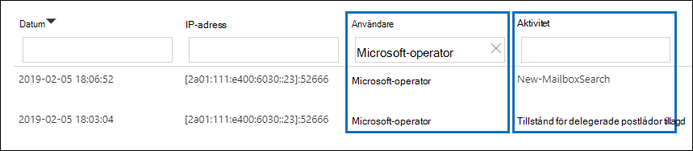
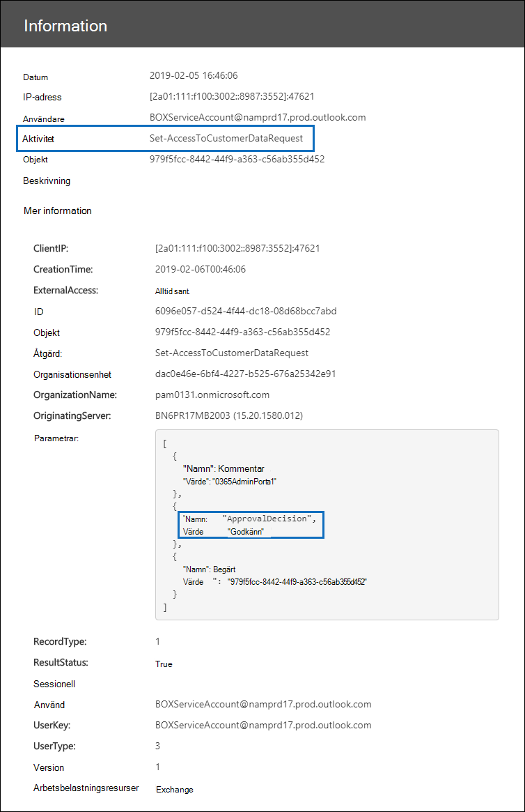

# Customer Lockbox i Office 365Customer Lockbox in Office 365

Den här artikeln innehåller distributions- och konfigurationsvägledning för Customer Lockbox.This article provides deployment and configuration guidance for Customer Lockbox. Customer Lockbox har stöd för förfrågningar om åtkomst till data Exchange Online, SharePoint Online och OneDrive för företag.Customer Lockbox supports requests to access data in Exchange Online, SharePoint Online, and OneDrive for Business. Om du vill rekommendera support för andra tjänster kan du skicka en förfrågan [Office 365 UserVoice.](https://office365.uservoice.com/)To recommend support for other services, please submit a request at [Office 365 UserVoice](https://office365.uservoice.com/).

Om du vill se alternativen för att licensiera dina användare att dra nytta av Microsoft 365 efterlevnadserbjudanden, inklusive detta, från och med den 1 april 2020, se vägledningen för Microsoft 365-licensiering för [& efterlevnad.](/office365/servicedescriptions/microsoft-365-service-descriptions/microsoft-365-tenantlevel-services-licensing-guidance/microsoft-365-security-compliance-licensing-guidance)To see the options for licensing your users to benefit from Microsoft 365 compliance offerings, including this one, as of April 1, 2020, see the [Microsoft 365 licensing guidance for security & compliance](/office365/servicedescriptions/microsoft-365-service-descriptions/microsoft-365-tenantlevel-services-licensing-guidance/microsoft-365-security-compliance-licensing-guidance).

Customer Lockbox ser till att Microsoft inte kan komma åt ditt innehåll för att utföra en tjänståtgärd utan ditt uttryckliga godkännande.Customer Lockbox ensures that Microsoft cannot access your content to perform a service operation without your explicit approval. Med Customer Lockbox kommer du till arbetsflödet för godkännande för förfrågningar om åtkomst till innehållet.Customer Lockbox brings you into the approval workflow for requests to access your content.

Ibland kan Microsoft-tekniker hjälpa till att felsöka och åtgärda problem som rapporterats av kunder i supportprocessen.Occasionally, Microsoft engineers help troubleshoot and fix customer reported issues in the support process. Vanligtvis åtgärdas problem genom omfattande telemetri- och felsökningsverktyg som Microsoft har för sina tjänster.Usually, issues are fixed through extensive telemetry and debugging tools Microsoft has in place for its services. I vissa fall krävs dock en Microsoft-tekniker för att få åtkomst till kundinnehåll för att fastställa orsaken och åtgärda problemet.However, some cases require a Microsoft engineer to access customer content to determine the root cause and fix the issue. Customer Lockbox kräver att teknikern begär åtkomst från kunden som ett sista steg i arbetsflödet för godkännande.Customer Lockbox requires the engineer to request access from the customer as a final step in the approval workflow. Detta ger organisationer möjlighet att godkänna eller neka dessa begäranden och ge direkt åtkomstkontroll till kunden.This gives organizations the option to approve or deny these requests, and provide direct-access control to the customer.

### Video med översikt över Customer LockboxCustomer Lockbox overview video

> [!VIDEO https://www.microsoft.com/videoplayer/embed/8fecf10b-1f03-4849-8b67-76d3d2a43f26?autoplay=false]

## Customer Lockbox-arbetsflödeCustomer Lockbox workflow

I följande steg beskrivs det vanliga arbetsflödet när en Microsoft-tekniker inleder en Customer Lockbox-begäran:The following steps outline the typical workflow when a Microsoft engineer initiates a Customer Lockbox request:

1. Någon på en organisation får problem med sin egen Microsoft 365 postlåda.Someone at an organization experiences an issue with their Microsoft 365 mailbox.

2. När användaren har felsökt problemet, men inte kan åtgärda det, öppnar de en supportbegäran med Microsoft Support.After the user troubleshoots the issue, but can't fix it, they open a support request with Microsoft Support.

3. En Microsoft-supporttekniker granskar tjänstbegäran och fastställer ett behov av åtkomst till organisationens klientorganisation för att reparera problemet i Exchange Online.A Microsoft support engineer reviews the service request and determines a need to access the organization's tenant to repair the issue in Exchange Online.

4. Microsofts supporttekniker loggar in i verktyget för Customer Lockbox-begäran och gör en dataåtkomstbegäran som innehåller organisationens klientnamn, serviceförfrågans nummer och den beräknade tid teknikern behöver åtkomst till data.The Microsoft support engineer logs into the Customer Lockbox request tool and makes a data access request that includes the organization's tenant name, service request number, and the estimated time the engineer needs access to the data.

5. När en Microsoft Support Manager har godkänt begäran skickar Customer Lockbox ett e-postmeddelande till den utsedda godkännaren till organisationen om den väntande åtkomstbegäran från Microsoft.After a Microsoft Support manager approves the request, Customer Lockbox sends the designated approver at the organization an email notification about the pending access request from Microsoft.

    

   Alla som har tilldelats rollen [Godkännare av Customer Lockbox-åtkomst](/office365/admin/add-users/about-admin-roles) i Microsoft 365 kan godkänna Customer Lockbox-begäranden.Anyone who is assigned the [Customer Lockbox access approver](/office365/admin/add-users/about-admin-roles) admin role in Microsoft 365 admin center can approve Customer Lockbox requests.

6. Godkännaren loggar in Microsoft 365 administrationscentret och godkänner begäran.The approver signs in to the Microsoft 365 admin center and approves the request. Det här steget utlöser skapandet av en granskningspost som är tillgänglig genom att söka i granskningsloggen.This step triggers the creation of an audit record available by searching the audit log. Mer information finns i Granska [Customer Lockbox-begäranden](#auditing-customer-lockbox-requests).For more information, see [Auditing Customer Lockbox requests](#auditing-customer-lockbox-requests).

   Om kunden avvisar begäran eller inte godkänner den inom 12 timmar upphör den att gälla och ingen åtkomst ges till Microsoft-teknikern.If the customer rejects the request or doesn't approve the request within 12 hours, the request expires and no access is granted to the Microsoft engineer.

   > [!IMPORTANT]
   > Microsoft har inga länkar i Customer Lockbox-e-postaviseringar som kräver att du loggar in på Office 365.Microsoft does not include any links in Customer Lockbox email notifications requiring you to sign in to Office 365.

7. När godkännaren från organisationen godkänt begäran får Microsoft-teknikern meddelandet om godkännande, loggar in i klientorganisationen i Exchange Online och åtgärdar kundens problem.After the approver from the organization approves the request, the Microsoft engineer receives the approval message, logs into the tenant in Exchange Online, and fixes the customer's issue. Microsoft-tekniker har den begärda varaktigheten för att åtgärda problemet efter vilket åtkomsten automatiskt återkallas.Microsoft engineers have the requested duration to fix the issue after which the access is automatically revoked.

> [!NOTE]
> Alla åtgärder som utförs av en Microsoft-tekniker loggas i granskningsloggen.All actions performed by a Microsoft engineer are logged in the audit log. Du kan söka efter och granska dessa granskningsposter.You can search for and review these audit records.

## Aktivera eller inaktivera Customer Lockbox-begärandenTurn Customer Lockbox requests on or off

Du kan aktivera Customer Lockbox-kontroller i Microsoft 365 administrationscentret.You can turn on Customer Lockbox controls in the Microsoft 365 admin center. När du aktiverar Customer Lockbox måste Microsoft godkännas av din organisation innan du kan komma åt innehållet i din klientorganisation.When you turn on Customer Lockbox, Microsoft must obtain your organization's approval before accessing any of your tenant's content.

1. Använd ett arbets- eller skolkonto som har tilldelats rollen som global administratör eller **Customer Lockbox-godkännare** för åtkomst, gå till [https://admin.microsoft.com](https://admin.microsoft.com) och logga in.Using a work or school account that has either the global administrator or the **Customer Lockbox access approver** role assigned, go to [https://admin.microsoft.com](https://admin.microsoft.com) and sign in.

2. Välj **Inställningar > Organisations Inställningar**.Choose **Settings > Org Settings**.

3. Välj **Säkerhet & Redigera Customer** Lockbox för Sekretess och flytta sedan växlingsknappen till På eller Av för att aktivera eller inaktivera  >    >  funktionen.  Select **Security & Privacy** > **Customer Lockbox** > **Edit**, and then move the toggle to **On** or **Off** to turn the feature on or off.

    

## Godkänna eller neka en Customer Lockbox-begäranApprove or deny a Customer Lockbox request

1. Använd ett arbets- eller skolkonto som har tilldelats rollen som global administratör eller **Customer Lockbox-godkännare** för åtkomst, gå till [https://admin.microsoft.com](https://admin.microsoft.com) och logga in.Using a work or school account that has either the global administrator or the **Customer Lockbox access approver** role assigned, go to [https://admin.microsoft.com](https://admin.microsoft.com) and sign in.

2. Välj **Support > Customer Lockbox-begäranden**.Choose **Support > Customer Lockbox Requests**.

    

    En lista med Customer Lockbox-begäranden visas.A list of Customer Lockbox requests displays.

    

3. Välj en Customer Lockbox-begäran och välj **sedan Godkänn** eller **Neka**.Select a Customer Lockbox request, and then choose **Approve** or **Deny**.

    

    Ett bekräftelsemeddelande om att Customer Lockbox-begäran har godkänts visas.A confirmation message about the approval of the Customer Lockbox request displays.

    

> [!NOTE]
> Använd Set-AccessToCustomerDataRequest-cmdleten för att godkänna, neka eller avbryta Microsoft 365 Customer Lockbox-begäranden som Microsoft-supporttekniker kan ge åtkomst till dina data.Use the Set-AccessToCustomerDataRequest cmdlet to approve, deny, or cancel Microsoft 365 customer lockbox requests that control access to your data by Microsoft support engineers. Mer information finns i [Set-AccessToCustomerDataRequest](/powershell/module/exchange/set-accesstocustomerdatarequest).For more information, see [Set-AccessToCustomerDataRequest](/powershell/module/exchange/set-accesstocustomerdatarequest).

## Granska Customer Lockbox-begärandenAuditing Customer Lockbox requests

Granskningsposter som motsvarar Customer Lockbox-begäranden loggas i granskningsloggen.Audit records that correspond to the Customer Lockbox requests are logged in the audit log. Du kan komma åt dessa loggar med hjälp [av verktyget för granskningsloggsökning](search-the-audit-log-in-security-and-compliance.md) i Säkerhets- & Efterlevnadscenter.You can access these logs by using the [audit log search tool](search-the-audit-log-in-security-and-compliance.md) in the Security & Compliance Center. Åtgärder som är relaterade till att acceptera eller neka en Customer Lockbox-begäran och åtgärder som utförs av Microsoft-tekniker (när åtkomstbegäranden godkänns) loggas också i granskningsloggen.Actions related to accepting or denying a Customer Lockbox request and actions performed by Microsoft engineers (when access requests are approved) are also logged in the audit log. Du kan söka efter och granska dessa granskningsposter.You can search for and review these audit records.

### Söka i granskningsloggen efter aktivitet relaterad till Customer Lockbox-begärandenSearch the audit log for activity related to Customer Lockbox requests

Innan du kan använda granskningsloggen för att spåra förfrågningar om Customer Lockbox finns det några åtgärder du måste vidta för att konfigurera granskningsloggning.Before you can use the audit log to track requests for Customer Lockbox, there are some steps you need to take to set up audit logging. Mer information finns i [Söka i granskningsloggen i Säkerhets- & efterlevnadscenter.](/office365/securitycompliance/search-the-audit-log-in-security-and-compliance#before-you-begin)For more information, see [Search the audit log in the Security & Compliance Center](/office365/securitycompliance/search-the-audit-log-in-security-and-compliance#before-you-begin). När du har slutfört konfigurationen kan du använda de här stegen för att skapa en granskningsloggsökningsfråga för att returnera granskningsposter som är relaterade till Customer Lockbox:Once you've completed setup, use these steps to create an audit log search query to return audit records related to Customer Lockbox:

1. Gå till [https://protection.office.com](https://protection.office.com).Go to [https://protection.office.com](https://protection.office.com).
  
2. Logga in med ditt arbets- eller skolkonto.Sign in using your work or school account.

3. I den vänstra rutan i säkerhets- & efterlevnadscenter väljer du **Sökning och undersökning &**  >  **Granskningsloggsökning**.In the left pane of the Security & Compliance Center, choose **Search & investigation** > **Audit log search**.

    Sidan **Granskningsloggsökning** visas.The **Audit log search** page displays.

    
  
4. Konfigurera följande sökvillkor:Configure the following search criteria:

    1. **Aktiviteter** – Lämna det här fältet tomt så att sökningen returnerar granskningsposter för alla aktiviteter.**Activities** - Leave this field blank so that the search returns audit records for all activities. Detta är nödvändigt för att returnera alla granskningsposter som är relaterade till Customer Lockbox-begäranden och motsvarande aktivitet som utförts av Microsoft-tekniker.This is necessary to return any audit records related to Customer Lockbox requests and corresponding activity performed by Microsoft engineers.

    1. **Startdatum och** **Slutdatum – Välj** ett datum- och tidsintervall för att visa händelser som inträffat under perioden.**Start date** and **End date** - Select a date and time range to display the events that occurred within that period.

    1. **Användare** – Lämna fältet tomt.**Users** - Leave this field blank.

    1. **Fil, mapp eller webbplats –** Lämna fältet tomt.**File, folder, or site** - Leave this field blank.

5. Klicka **på Sök** för att köra sökningen med dina sökvillkor.Click **Search** to run the search using your search criteria.

    Sökresultaten läses in och efter en liten stund visas de under **Resultat på** sidan **Granskningsloggsökning.**The search results are loaded, and after a few moments they are displayed under **Results** on the **Audit log search** page.

6. Klicka **på Filtrera** resultat på sidan med sökresultat och gör något av följande:Click **Filter results** on the search results page, and do one of the following things:

   - Om du vill visa granskningsposter som är relaterade till en godkännare i organisationen  som ska godkänna eller neka en Customer Lockbox-begäran: Skriv **Set-AccessToCustomerDataRequest** i rutan under kolumnen Aktivitet.To display audit records related to an approver in your organization approving or denying a Customer Lockbox request: In the box under the **Activity** column, type **Set-AccessToCustomerDataRequest**.

   - Om du vill visa granskningsposter som är relaterade till en Microsoft-tekniker  som utför åtgärder som svar på en godkänd Customer Lockbox-begäran: I rutan under användarkolumnen skriver du **Microsoft-operator.**To display audit records related to a Microsoft engineer performing actions in response to an approved Customer Lockbox request: In the box under the **User** column, type **Microsoft Operator**. I **kolumnen** Aktivitet visas åtgärden som utförts av teknikern.The **Activity** column displays the action performed by the engineer.

      

7. Klicka på en granskningspost i resultatlistan för att visa den.In the list of results, click an audit record to display it.

### Granskningspost för en Customer Lockbox-åtkomstbegäranAudit record for a Customer Lockbox access request

När en person i organisationen godkänner eller nekar en Customer Lockbox-begäran loggas en granskningspost i granskningsloggen.When a person in your organization approves or denies a Customer Lockbox request, an audit record is logged in the audit log. Den här posten innehåller följande information.This record contains the following information.

| Egenskapen GranskningspostAudit record property| BeskrivningDescription|
|:---------- |:----------|
| DatumDate       | Datum och tid då Customer Lockbox-begäran godkänts eller nekats.The date and time when the Customer Lockbox request was approved or denied.
| IP-adressIP address | IP-adressen för den dator som godkännaren använde för att godkänna eller neka en begäran.The IP address of the machine the approver used to approve or deny a request. |
| AnvändareUser       | Tjänstkontot utgör BOXServiceAccount@ \[ \] .prod.outlook.com.The service account BOXServiceAccount@\[customerforest\].prod.outlook.com.            |
| AktivitetActivity   | Set-AccessToCustomerDataRequest; detta är granskningsaktiviteten som loggas när du godkänner eller nekar en Customer Lockbox-begäran.Set-AccessToCustomerDataRequest; this is the auditing activity that is logged when you approve or deny a Customer Lockbox request.                                |
| ObjektItem       | Guid för Customer Lockbox-begäranThe Guid of the Customer Lockbox request                             |

Följande skärmbild visar ett exempel på en granskningsloggpost som motsvarar en godkänd Customer Lockbox-begäran.The following screenshot shows an example of an audit log record that corresponds to an approved Customer Lockbox request. Om en Customer Lockbox-begäran nekades är värdet för parametern **ApprovalDecision** **Neka**.If a Customer Lockbox request was denied, then the value of **ApprovalDecision** parameter would be **Deny**.

> [!TIP]
> Om du vill visa mer detaljerad information i en granskningspost klickar du **på Mer information.**To display more detailed information in an audit record, click **More information**.

### Granskningspost för en åtgärd som utförs av en Microsoft-teknikerAudit record for an action performed by a Microsoft engineer

De åtgärder som utförs av en Microsoft-tekniker efter att en Customer Lockbox-begäran har godkänts (och som kan resultera i åtkomst till kundinnehåll) loggas i granskningsloggen.The actions performed by a Microsoft engineer after a Customer Lockbox request is approved (and that may result in accessing customer content) are logged in the audit log. Dessa poster innehåller följande information.These records contain the following information.

| Egenskapen GranskningspostAudit record property| BeskrivningDescription|
|:---------- |:----------|
| DatumDate       | Datum när åtgärden utfördes.Date time when the action was performed. Observera att tiden som åtgärden utfördes kommer att ske inom 4 timmar från det att Customer Lockbox-begäran godkänts.Note that the time that this action was performed will be within 4 hours of when the Customer Lockbox request was approved.              |
| IP-adressIP address | IP-adressen för den Microsoft-tekniker som används.The IP Address of the machine Microsoft engineer used. |
| AnvändareUser       | Microsoft-operator; det här värdet anger att den här posten är relaterad till en Customer Lockbox-begäran.Microsoft Operator; this value indicates that this record is related to a Customer Lockbox request.                                  |
| AktivitetActivity   | Namn på aktiviteten som utförts av Microsoft-teknikern.Name of the activity performed by the Microsoft engineer.|
| ObjektItem       | \<empty\>                                             |

## Vanliga frågor och svarFrequently asked questions

#### Vilka Microsoft 365 tjänster gäller Customer Lockbox för?Which Microsoft 365 services does Customer Lockbox apply to?

Customer Lockbox stöds för närvarande i Exchange Online, SharePoint Online och OneDrive för företag.Customer Lockbox is currently supported in Exchange Online, SharePoint Online, and OneDrive for Business.

#### Är Customer Lockbox tillgängligt för alla kunder?Is Customer Lockbox available to all customers?

Customer Lockbox ingår i Microsoft 365- eller Office 365 E5-prenumerationer och kan läggas till i andra abonnemang med ett tillägg för Informationsskydd och efterlevnad eller en tilläggsprenumeration på Avancerad efterlevnad.Customer Lockbox is included with the Microsoft 365 or Office 365 E5 subscriptions and can be added to other plans with an Information Protection and Compliance or an Advanced Compliance add-on subscription. Mer information [finns i Abonnemang](https://products.office.com/business/office-365-enterprise-e5-business-software) och priser.Please see [Plans and pricing](https://products.office.com/business/office-365-enterprise-e5-business-software) for more information.

#### Vad är kundinnehåll?What is customer content?

Kundinnehåll är data som skapas av användare av Microsoft 365 och program.Customer content is the data created by users of Microsoft 365 services and applications. Exempel på kundinnehåll är:Examples of customer content include:

- E-post, brödtext och e-postbilagorEmail body or email attachments

- SharePoint webbplatsinnehållSharePoint site contents

- Information i brödtexten i en SharePoint filInformation in the body of a SharePoint file

- Skype för företag brödtext i presentationsfilenSkype for Business presentation file body

- Snabbmeddelanden och röstkonversationerInstant messages (IM) or voice conversations

- Kundgenererade blob-data eller strukturerade lagringsdata (till exempel SQL behållare)Customer-generated blob or structured storage data (for example, SQL Containers)

- Kundägd säkerhetsinformation (till exempel certifikat, krypteringsnycklar och lösenord)Customer-owned security information (for example, certificates, encryption keys, and passwords)

- Slutledningar och alla efterföljande slutledningar, om kundinnehållet finns kvarInferences, and all subsequent inferences, if customer content remains

Mer information om kundinnehåll i Office 365 finns i [Office 365 Säkerhetscenter.](https://products.office.com/business/office-365-trust-center-privacy/)For additional information about customer content in Office 365, see the [Office 365 Trust Center](https://products.office.com/business/office-365-trust-center-privacy/).

#### Vem meddelas när det finns en begäran om åtkomst till mitt innehåll?Who is notified when there is a request to access my content?

Globala administratörer och alla som har tilldelats rollen godkännare för Customer Lockbox-åtkomst meddelas.Global administrators and anyone assigned the Customer Lockbox access approver admin role are notified. Det här är också samma användare som kan godkänna Customer Lockbox-begäranden.These are also the same users who can approve for Customer Lockbox requests.

#### Vem kan godkänna eller avvisa dessa förfrågningar i min organisation?Who can approve or reject these requests in my organization?

Globala administratörer och alla som har tilldelats rollen godkännare av Customer Lockbox-åtkomst kan godkänna Customer Lockbox-begäranden.Global administrators and anyone assigned the Customer Lockbox access approver admin role can approve Customer Lockbox requests. Kunder styr de här rolltilldelningarna i sina organisationer.Customers control these role assignments in their organizations.

#### Hur anmäler jag mig till Customer Lockbox?How do I opt in to Customer Lockbox?

En global administratör kan aktivera och konfigurera Customer Lockbox i Microsoft 365 eller Microsoft 365 administrationscentret.A global administrator can enable and configure Customer Lockbox in the Microsoft 365 or Microsoft 365 admin center.

#### Vad kan teknikern göra och hur vet jag vad Microsoft-teknikern gjorde om jag godkänner en Customer Lockbox-begäran?If I approve a Customer Lockbox request, what can the engineer do and how will I know what the Microsoft engineer did?

När du godkänt en Customer Lockbox-begäran gav Microsoft-teknikern dessa behörigheter för att få åtkomst till kundinnehåll genom att använda förgodkända cmdlets.After you approve a Customer Lockbox request, the Microsoft engineer granted these necessary privileges to access customer content by using pre-approved cmdlets. Åtgärder som vidtas av Microsoft-tekniker som svar på Customer Lockbox-begäranden loggas och är tillgängliga i granskningsloggen i säkerhets- & efterlevnadscenter.Actions taken by Microsoft engineers in response to Customer Lockbox requests are logged and accessible in the audit log in the Security & Compliance Center.

#### Hur vet jag att Microsoft följer godkännandeprocessen?How do I know that Microsoft follows the approval process?

Du kan korsreferenser till meddelanden om e-postgodkännande som skickas till administratörer och godkännare i organisationen med historiken för Customer Lockbox-begäran Microsoft 365 administrationscentret.You can cross-reference the email approval notifications sent to admins and approvers in your organization with the Customer Lockbox request history in the Microsoft 365 admin center.

Customer Lockbox ingår i den senaste [granskningsrapporten för SOC 1 SSAE 16.](https://servicetrust.microsoft.com/ViewPage/MSComplianceGuide?command=Download&downloadType=Document&downloadId=91592749-e86a-43ac-801e-121382614681&docTab=4ce99610-c9c0-11e7-8c2c-f908a777fa4d_SOC%20%2F%20SSAE%2016%20Reports)Customer Lockbox is included in the latest [SOC 1 SSAE 16 audit report](https://servicetrust.microsoft.com/ViewPage/MSComplianceGuide?command=Download&downloadType=Document&downloadId=91592749-e86a-43ac-801e-121382614681&docTab=4ce99610-c9c0-11e7-8c2c-f908a777fa4d_SOC%20%2F%20SSAE%2016%20Reports). Du hittar mer information i de senaste rapporterna på [Microsoft Service Trust Portal.](https://servicetrust.microsoft.com/ViewPage/MSComplianceGuide?command=Download&downloadType=Document&downloadId=91592749-e86a-43ac-801e-121382614681&docTab=4ce99610-c9c0-11e7-8c2c-f908a777fa4d_SOC%20%2F%20SSAE%2016%20Reports)For more details, you can find the latest reports in the [Microsoft Service Trust Portal](https://servicetrust.microsoft.com/ViewPage/MSComplianceGuide?command=Download&downloadType=Document&downloadId=91592749-e86a-43ac-801e-121382614681&docTab=4ce99610-c9c0-11e7-8c2c-f908a777fa4d_SOC%20%2F%20SSAE%2016%20Reports).

#### Kan Microsoft ändra listan över godkännare för min klientorganisation?Can Microsoft modify the list of approvers for my tenant? Om inte, hur förhindras det?If not, how is it prevented?

Endast en global administratör i organisationen kan ange vem som kan godkänna Customer Lockbox-begäranden.Only a global administrator in your organization can specify who can approve Customer Lockbox requests. Det innebär att endast medlemmar i gruppen Global administratör i gruppen Azure Active Directory ange vem som kan godkänna begäran.That means only the members of the Global administrator group in Azure Active Directory can specify who can approve request. Medlemskap i gruppen Global administratör i Azure Active Directory hanteras endast av organisationen.Membership of the Global administrator group in Azure Active Directory is managed only by your organization.

#### Vad händer om jag behöver mer information om en begäran om innehållsåtkomst för att godkänna den?What if I need more information about a content access request to approve it?

Varje Customer Lockbox-begäran innehåller Microsoft 365 för din servicebegäran.Each Customer Lockbox request contains a Microsoft 365 service request number. Du kan kontakta Microsoft Support och hänvisa till det här servicenumret för att få mer information om begäran.You can contact Microsoft Support and reference this service number to get more information about the request.

#### När en Customer Lockbox-begäran godkänns, hur länge är behörigheterna giltiga?When a Customer Lockbox request is approved, how long are the permissions valid?

För närvarande är den maximala perioden för åtkomstbehörigheter som beviljats Microsoft-teknikern 4 timmar.Currently, the maximum period for the access permissions granted to the Microsoft engineer is 4 hours. Microsoft-teknikern kan också begära en kortare tidsperiod.The Microsoft engineer can also request a shorter period.

#### Hur får jag en historik över alla Customer Lockbox-begäranden?How can I get a history of all Customer Lockbox requests?

Alla Customer Lockbox-begäranden visas i Microsoft 365 administrationscentret.All Customer Lockbox requests are viewed in the Microsoft 365 admin center.

#### Hur korrelerar jag begäranden om innehållsåtkomst till relaterade granskningsloggar?How do I correlate the content access requests with the related audit logs?

Aktivitetsfeeden för efterlevnadscenter innehåller loggaktiviteter i Customer Lockbox.The Compliance Center Activity Feed contains log activities of Customer Lockbox. Kunder kan korsreferenser för Customer Lockbox-loggaktiviteterna från aktivitetsflödet mot den e-postförfrågan de får.Customers can cross-reference the Customer Lockbox log activities from the activity feed against the email request they receive.

#### Vad händer när en kund inte svarar på en Customer Lockbox-begäran?What happens when a customer doesn't respond to a Customer Lockbox request?

Customer Lockbox-begäranden varar som standard 12 timmar.Customer Lockbox requests have a default duration of 12 hours. Om du inte svarar på en begäran inom 12 timmar förfaller begäran.If you don't respond to a request within 12 hour, the request expires.

#### Vad gör Microsoft när en kund avvisar en Customer Lockbox-begäran?What does Microsoft do when a customer rejects a Customer Lockbox request?

Om en kund avvisar en Customer Lockbox-begäran görs ingen åtkomst till kundinnehållet.If a customer rejects a Customer Lockbox request, no access to customer content occurs. Om en användare i organisationen fortsätter att ha problem med tjänsten som kräver att Microsoft får åtkomst till kundinnehåll för att lösa problemet kan tjänstproblemet kvarstå och Microsoft informerar användaren om problemet.If a user in your organization continues to experience a service issue requiring Microsoft to access customer content to resolve the issue, then the service issue might persist and Microsoft will inform the user about this.

#### Skyddar Customer Lockbox mot dataförfrågningar från myndigheter och andra tredje parter?Does Customer Lockbox protect against data requests from law enforcement agencies or other third parties?

Nej.No. Microsoft ser allvarligt på förfrågningar från tredje part om kunddata.Microsoft takes third-party requests for customer data seriously. Som molntjänstleverantör arbetar Microsoft alltid för att se till att kunddata är privata.As a cloud service provider, Microsoft always advocates for the privacy of customer data. Om vi får en undergrupp försöker Microsoft alltid dirigera om tredje part till kunden för att få informationen.In the event we get a subpoena, Microsoft always attempts to redirect the third party to the customer to obtain the information. (Läs Brad Smiths blogg: [Skydda kunddata från myndigheters snooping](https://blogs.microsoft.com/blog/2013/12/04/protecting-customer-data-from-government-snooping/)).(Read Brad Smith's blog: [Protecting customer data from government snooping](https://blogs.microsoft.com/blog/2013/12/04/protecting-customer-data-from-government-snooping/)). Vi publicerar regelbundet [detaljerad information om](https://www.microsoft.com/corporate-responsibility/lerr) de förfrågningar om verkställande av lag som Microsoft får.We periodically publish [detailed information](https://www.microsoft.com/corporate-responsibility/lerr) about the law enforcement requests that Microsoft receives.

Mer information [finns i Microsoft Säkerhetscenter](https://www.microsoft.com/trustcenter/default.aspx) om dataförfrågningar från tredje part och avsnittet "Avslöjande av kunddata" i [villkoren](https://www.microsoft.com/Licensing/product-licensing/products.aspx) för onlinetjänster.See the [Microsoft Trust Center](https://www.microsoft.com/trustcenter/default.aspx) regarding third-party data requests and the "Disclosure of Customer Data" section in the [Online Services Terms](https://www.microsoft.com/Licensing/product-licensing/products.aspx) for more information.

#### Hur ser Microsoft till att en anställd inte har stående åtkomst till kundinnehåll i Office 365 program?How does Microsoft ensure that a member of its staff doesn't have standing access to customer content in Office 365 applications?

Microsoft implementerar omfattande förebyggande åtgärder genom åtkomstkontrollsystem och åtgärder för att identifiera och åtgärda försök att kringgå dessa åtkomstkontrollsystem.Microsoft implements extensive preventive measures through access control systems, and detective measures to identify and address attempts to circumvent these access control systems. Microsoft 365 med principerna för minsta behörighet och direktåtkomst.Microsoft 365 operates with the principles of least privilege and just-in-time access. Därför har ingen Microsoft-personal kontinuerlig åtkomst till kundinnehåll.Therefore, no Microsoft personnel have permission to access customer content on an ongoing basis. Om behörighet beviljas, gäller den under en begränsad tid.If permission is granted, it is for a limited duration. 

Microsoft 365 använder ett åtkomstkontrollsystem som kallas *Lockbox* för att bearbeta begäranden om behörigheter som ger möjlighet att utföra drift- och administrativa funktioner i tjänsten.Microsoft 365 uses an access control system called *Lockbox* to process requests for permissions that grant the ability to perform operational and administrative functions within the service. En operatör måste begära åtkomst till kundinnehåll med hjälp av Lockbox, vilket innebär att en andra person måste vidta åtgärder på begäran (t.ex. godkänna den) innan åtkomst beviljas.An operator must request access to customer content using Lockbox, which then requires a second person to take action on the request (e.g., approve it) before access is granted. Den andra personen kan inte vara beställare och måste godkänna åtkomst till kundinnehåll.That second person can't be the requestor and must be designated to approve access to customer content. Endast om begäran godkänns får operatören tillfällig åtkomst till kundinnehållet.Only if the request is approved does the operator acquire temporary access to customer content. Efter att ökningsperioden gått ut återkallar Lockbox åtkomsten.After the elevation period expires, Lockbox revokes access.

Mer information om [Microsofts allmänna säkerhetsmetoder](https://www.microsoft.com/licensing/product-licensing/products) finns i villkoren för onlinetjänster.Please refer to the [Online Services Terms](https://www.microsoft.com/licensing/product-licensing/products) for more details about Microsoft general security practices.

#### Under vilka omständigheter behöver Microsoft-tekniker åtkomst till mitt innehåll?Under what circumstances do Microsoft engineers need access to my content?

Det vanligaste scenariot där Microsoft-tekniker behöver åtkomst till kundinnehåll är när kunden gör en supportbegäran som kräver åtkomst för felsökning.The most common scenario where Microsoft engineers need access customer content is when the customer makes a support request requiring access for troubleshooting. En grundprincip i Microsoft 365 är att tjänsten fungerar utan Microsofts åtkomst till kundinnehåll.A foundational principle of Microsoft 365 is that the service operates without Microsoft access to customer content. Nästan alla tjänsteåtgärder som utförs av Microsoft är helt automatiska och den mänskliga engagemanget styrs i mycket hög grad av kundinnehållet.Nearly all service operations performed by Microsoft are fully automated and human involvement is highly controlled and abstracted away from customer content. Målet för Microsoft 365 är åtkomst till kundinnehåll för att stödja tjänsten behövs inte förrän kunden godkänt en särskild begäran om Microsoft-åtkomst.The goal for Microsoft 365 is access to customer content to support the service isn't needed until the customer approves a specific request for Microsoft access.

#### Jag trodde redan att mina data var säkra med Microsoft-molnet, så varför behöver jag Customer Lockbox?I already thought my data was secure with the Microsoft cloud, so why do I need Customer Lockbox?

Customer Lockbox ger en extra kontrollnivå genom att ge kunderna möjlighet att ge explicit åtkomstauktorisering för tjänståtgärder.Customer Lockbox provides an extra layer of control by offering customers the ability to give explicit access authorization for service operations. Genom att visa att det finns procedurer för uttrycklig autentisering av dataåtkomst hjälper Customer Lockbox även kunderna att uppfylla vissa efterlevnadsskyldigheter, till exempel HIPAA och FEDRAMP.By demonstrating that procedures are in place for explicit data access authorization, Customer Lockbox also helps customers meet certain compliance obligations such as HIPAA and FEDRAMP.