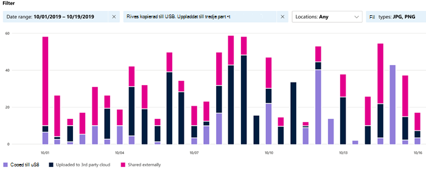

# Kom igång med aktivitetsutforskaren

Med [flikarna Översikt över](data-classification-overview.md) [dataklassificering och](data-classification-content-explorer.md) Innehållsutforskaren får du insyn i vilket innehåll som har identifierats och etiketterats och var innehållet finns. Aktivitetsutforskaren avrundar den här funktionssviten genom att låta dig övervaka vad som görs med det etiketterade innehållet. Aktivitetsutforskaren ger en historisk vy av aktiviteter på ditt etiketterade innehåll. Aktivitetsinformation samlas in från Microsoft 365 enhetliga granskningsloggar, transformerade och tillgängliga i användargränssnittet för Aktivitetsutforskaren. 

Det finns över 30 olika filter att använda och några är:

- datumintervall
- aktivitetstyp
- plats
- användare
- känslighetsetikett
- bevarandeetikett
- filsökväg
- DLP-princip

## Förutsättningar

Varje konto som har åtkomst till och använder dataklassificering, måste ha en tilldelad licens från någon av dessa prenumerationer:

- Microsoft 365 (E5)
- Office 365 (E5)
- Tillägget Advanced Compliance (E5)
- Tillägget Advanced Threat Intelligence (E5)
- Microsoft 365 E5/A5 – Informationsskydd och styrning
- Microsoft 365 E5/A5 – Efterlevnad

### Behörigheter

 För att få åtkomst till fliken aktivitetsutforskaren måste ett konto uttryckligen tilldelas medlemskap i någon av rollgrupperna eller uttryckligen beviljas rollen.

<!--
> [!IMPORTANT]
> Access to Activity explorer via the Security reader or Device Management role groups or other has been removed-->

**Microsoft 365-rollgrupper**

- Global administratör
- Efterlevnadsadministratör
- Säkerhetsadministratör
- Administratör för efterlevnadsdata

**Microsoft 365 roller**

- Efterlevnadsadministratör
- Säkerhetsadministratör

## Aktivitetstyper

Aktivitetsutforskaren samlar in aktivitetsinformation från granskningsloggar på flera aktivitetskällor. Mer detaljerad information om vad aktivitetsetiketter gör det till Aktivitetsutforskaren finns i [Märka händelser som är tillgängliga i Aktivitetsutforskaren.](data-classification-activity-explorer-available-events.md)

**Aktiviteter för känslighetsetiketter** och aktiviteter med bevarandeetiketter från Office inbyggda program, tillägg för Azure Information Protection, SharePoint Online, Exchange Online (endast känslighetsetiketter) och OneDrive.  Några exempel är:

- etikett används
- etikett har ändrats (uppgraderats, nedgraderats eller tagits bort)
- automatisk märkning av simulering
- fil som lästs 

**AIP-skanner (Azure Information Protection) och AIP-klienter**

- skydd tillämpat
- skydd har ändrats
- skydd har tagits bort
- upptäckta filer 

Aktivitetsutforskaren  samlar även in DLP-principmatchningar från Exchange Online, SharePoint Online, OneDrive, Teams Chatt och kanal (förhandsversion), lokala SharePoint-mappar och bibliotek och lokala filresurser och Windows 10-enheter via slutpunktens skydd mot **dataförlust (DLP).** Några exempelhändelser från Windows 10 enheter är filer:

- borttagningar
- skapelser
- har kopierats till Urklipp
- ändrad
- läsa
- utskriven
- bytt namn
- kopieras till nätverksresurs
- åtkomst av ej tillkomlig app 

Värdet av att förstå vilka åtgärder som vidtas med känsligt etikettinnehåll är att du kan se om de kontroller som du redan har vidtagit, t.ex. skydd mot [dataförlust,](dlp-learn-about-dlp.md) är effektiva eller inte. Om det inte fungerar, eller om du upptäcker något oväntat, t.ex. ett stort antal objekt som är märkta och nedgraderade, kan du hantera dina olika principer och vidta nya åtgärder för att begränsa det oönskade `highly confidential` `general` beteendet.

> [!NOTE]
> Aktivitetsutforskaren övervakar för närvarande inte kvarhållningsaktiviteter för Exchange Online.

## Se även

- [Mer information om känslighetsetiketter](sensitivity-labels.md)
- [Mer information om kvarhållningsprinciper och kvarhållningsetiketter](retention.md)
- [Mer information om typer av känslig information](sensitive-information-type-learn-about.md)
- [Mer information om dataklassificering](data-classification-overview.md)
